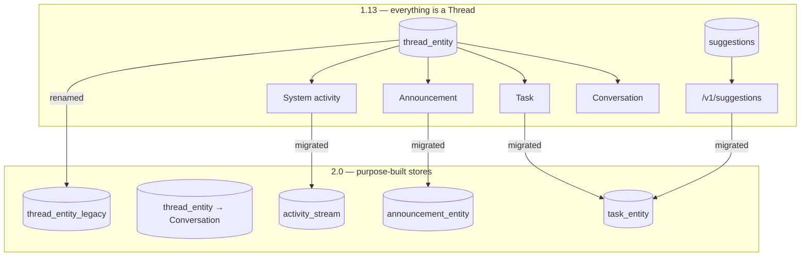

# Collaboration: Tasks, Suggestions, Announcements, Feed

**2.0 retires the thread-backed collaboration model.** Tasks, suggestions, announcements and system
activity each move out of `thread_entity` into purpose-built entities with their own tables, APIs and
permissions. Human conversations remain on `/v1/feed`.



---

## The Task redesign

:material-close-octagon:{ .om-breaking } **Breaking** · Affects: API clients, bots, workflow
integrations, anything reading `/v1/feed/tasks/*`

Tasks are now a first-class entity backed by `task_entity`, with a full CRUD + versioning surface at
`/v1/tasks`. 22 new endpoints:

| Endpoint | Purpose |
|----------|---------|
| `GET/POST/PUT /v1/tasks` | List / create / upsert |
| `GET /v1/tasks/{id}`, `GET /v1/tasks/name/{taskId}` | Fetch by UUID or human task id |
| `PATCH /v1/tasks/{id}`, `DELETE /v1/tasks/{id}` | Update / delete |
| `POST /v1/tasks/{id}/resolve`, `POST /v1/tasks/{id}/close` | Lifecycle transitions |
| `PUT /v1/tasks/{id}/suggestion/apply` | Apply a suggestion payload |
| `POST /v1/tasks/{id}/comments`, `PATCH`/`DELETE .../{commentId}` | Threaded comments |
| `GET /v1/tasks/assigned`, `/created`, `/owned`, `/visible` | Scoped task lists |
| `GET /v1/tasks/count`, `GET /v1/tasks/dataAccessRequests` | Counts and DAR queue |
| `POST /v1/tasks/bulk` | Bulk operations |
| `GET /v1/tasks/{id}/versions[/{version}]` | Entity version history |

### The Task shape

```json title="entity/tasks/task.json (required: id, name, category, type, status, createdBy)"
{
  "taskId": "TASK-1042",
  "category": "Approval",
  "type": "GlossaryApproval",
  "status": "Open",
  "priority": "Medium",
  "about": { "type": "glossaryTerm", "id": "..." },
  "assignees": [], "reviewers": [], "watchers": [],
  "payload": { },
  "resolution": { },
  "dueDate": 1712345678000,
  "workflowInstanceId": "...", "workflowStageId": "...",
  "availableTransitions": [],
  "taskFormSchemaId": "...", "taskFormSchemaVersion": 0.1,
  "comments": [], "commentCount": 0,
  "domains": [], "tags": [], "externalReference": { }
}
```

| Enum | Values |
|------|--------|
| `taskCategory` | `Approval`, `DataAccess`, `MetadataUpdate`, `Incident`, `Review`, `Custom` |
| `taskType` | `GlossaryApproval`, `RequestApproval`, `DataAccessRequest`, `DescriptionUpdate`, `TagUpdate`, `OwnershipUpdate`, `TierUpdate`, `DomainUpdate`, `Suggestion`, `TestCaseResolution`, `IncidentResolution`, `PipelineReview`, `DataQualityReview`, `RecognizerFeedbackApproval`, `CustomTask` |
| `taskStatus` | `Open`, `InProgress`, `Pending`, `Approved`, `Granted`, `ManualRevoke`, `Rejected`, `Completed`, `Cancelled`, `Failed`, `Revoked`, `Expired` |
| `taskPriority` | `Critical`, `High`, `Medium`, `Low` |
| `resolutionType` | `Approved`, `Rejected`, `Completed`, `Cancelled`, `TimedOut`, `AutoApproved`, `AutoRejected`, `Revoked`, `Expired` |

Typed payload schemas ship for each task type: `glossaryApprovalPayload`, `descriptionUpdatePayload`,
`tagUpdatePayload`, `ownershipUpdatePayload`, `tierUpdatePayload`, `domainUpdatePayload`,
`suggestionPayload`, `reviewPayload`, `testCaseResolutionPayload`, `incidentResolutionPayload`,
`dataAccessRequestPayload`, `genericTaskPayload`.

### Migration

`migrateThreadTasksToTaskEntity()` converts every `thread_entity` row with `type='Task'` into a Task,
computing `about` and `aboutFqnHash` from the entity link. A `task_migration_mapping` table records
`old_thread_id → new_task_id` for traceability and redirects.

### `/v1/feed` task endpoints are now restricted

:material-close-octagon:{ .om-breaking }

`/v1/feed` still exposes `GET /v1/feed/tasks/{id}`, `PUT /v1/feed/tasks/{id}/resolve` and
`PUT /v1/feed/tasks/{id}/close`, but creating a task thread through `POST /v1/feed` now validates the
task type and rejects anything outside the supported legacy set:

```java title="FeedResource.isSupportedLegacyFeedTask()"
return EntityUtil.isDescriptionTask(taskType)
    || EntityUtil.isTagTask(taskType)
    || EntityUtil.isApprovalTask(taskType)
    || EntityUtil.isTestCaseFailureResolutionTask(taskType);
```

Other validations added to `POST /v1/feed`:

- `about` is required and must be non-blank.
- `taskDetails` is required for `Task` threads and **forbidden** on non-task threads.
- `RequestApproval` tasks must target an entity (not a field or column).
- Tag-task `oldValue`/`suggestion` must be valid `TagLabel` JSON.

!!! success "Action"
    Move task creation to `POST /v1/tasks`. If you must stay on `/v1/feed`, restrict yourself to
    description, tag, approval and test-case-failure-resolution task types and supply well-formed
    `taskDetails`.

### New task permissions

:material-alert:{ .om-behavioral } · Affects: non-admin users and application bots

Five new policy operations exist in 2.0: `CreateTask`, `EditTask`, `ResolveTask`, `CloseTask`,
`ReassignTask`. The 2.0.0 migration backfills them so existing tenants keep working:

| Migration step | Effect |
|----------------|--------|
| `addTaskAuthorPolicyToDataConsumerRole` | Seeds `TaskAuthorPolicy` and attaches it to the `DataConsumer` role |
| `addCreateTaskRuleToDataConsumerPolicy` | Adds `DataConsumerPolicy-CreateTask-Rule` (grants `Create` on the `task` resource) |
| `addTaskRuleToDataConsumerPolicy` | Adds the per-entity `CreateTask`/`EditTask` grant |
| `addCreateTaskOperationToApplicationBotPolicy` | Lets application bots file suggestions as tasks |

!!! warning "Custom policies are not backfilled"
    If you replaced `DataConsumerPolicy` with your own policy, add the task operations manually or
    non-admin users will get `403` when filing or patching tasks.

Task authorization is also **self-approval guarded** — a task's creator cannot approve their own task.

---

## Suggestions API removed { #suggestions-api-removed }

:material-close-octagon:{ .om-breaking } **Breaking** · Affects: AI/automation bots, SDK users

`SuggestionsResource` is deleted (477 lines removed). Suggestions become Tasks with
`type: "Suggestion"` and `category: "MetadataUpdate"`.

| 1.13 | 2.0 |
|------|-----|
| `GET /v1/suggestions?entityFQN=…` | `GET /v1/tasks?…` filtered on `type=Suggestion` |
| `POST /v1/suggestions` | `POST /v1/tasks` with `type: Suggestion` |
| `PUT /v1/suggestions/{id}/accept` | `PUT /v1/tasks/{id}/suggestion/apply` (then resolve) |
| `PUT /v1/suggestions/{id}/reject` | `POST /v1/tasks/{id}/resolve` with a rejecting resolution |
| `PUT /v1/suggestions/accept-all` / `reject-all` | `POST /v1/tasks/bulk` |

Status mapping used by the 2.0 UI adapter:

| Task status | Suggestion status |
|-------------|-------------------|
| `Open`, `InProgress`, `Pending` | `Open` |
| `Completed`, `Approved` | `Accepted` |
| `Rejected`, `Cancelled`, `Failed` | `Rejected` |

The suggestion field path moves from an entity link to `payload.fieldPath` in dot notation
(`columns.col_name.description`).

`migrateSuggestionsToTaskEntity()` converts existing rows; the `suggestions` table is left in place
and skipped if absent.

---

## Announcements are a standalone entity { #announcements-are-a-standalone-entity }

:material-close-octagon:{ .om-breaking } **Breaking** · Affects: anything reading or writing
announcements through the feed API

`/v1/feed` now **rejects** announcements outright:

```java title="FeedResource.rejectLegacyAnnouncementAccess()"
throw new IllegalArgumentException(
    "Announcements are no longer served from /v1/feed. Use /v1/announcements instead.");
```

The guard fires on list (`threadType=Announcement`), get-by-id, patch, create, delete, posts, and
reactions — any request that touches an `Announcement` thread returns `400`.

New surface:

```
GET/POST/PUT   /v1/announcements
GET            /v1/announcements/{id}
GET            /v1/announcements/name/{fqn}
PATCH          /v1/announcements/{id}
DELETE         /v1/announcements/{id}
PUT            /v1/announcements/restore
GET            /v1/announcements/{id}/versions[/{version}]
```

### Migration shape

The 2.0.0 migration rewrites each `Announcement` thread into `announcement_entity`:

| Thread field | Announcement field |
|--------------|--------------------|
| `id` | `id` |
| — | `name` / `fullyQualifiedName` = `announcement-<id>` |
| `message` | `displayName` |
| `announcement.description` ?? `message` | `description` |
| `about` | `entityLink` |
| `announcement.startTime` / `endTime` | `startTime` / `endTime` |
| derived from times | `status` = `Active` \| `Scheduled` \| `Expired` |
| `threadTs` | `createdAt` |
| `reactions` | `reactions` |

Announcements are full entities in 2.0 — versioned, soft-deletable, restorable — and the UI renders
them in the entity header rather than only in the feed widget.

!!! success "Action"
    Repoint announcement automation at `/v1/announcements`. Note announcements now have a synthetic
    `name`/`fullyQualifiedName`, so they can be fetched by FQN.

---

## The Activity Stream replaces system-generated feed threads

:material-close-octagon:{ .om-breaking } **Breaking** · Affects: anything treating the feed as an
audit trail

System-generated activity (field changes, entity created/updated) no longer lives in
`thread_entity`. It moves to a purpose-built, **time-partitioned, retention-bounded**
`activity_stream` table with its own API at `/v1/activity`.

```json title="entity/activity/activityEvent.json"
"description": "A lightweight activity notification for user dashboards and feeds.
 NOT for compliance, audit trails, or workflows - use entity version history and Task entity
 for those purposes."
```

| Endpoint | Purpose |
|----------|---------|
| `GET /v1/activity` | Global stream |
| `GET /v1/activity/my-feed` | Current user's feed |
| `GET /v1/activity/following` | Followed entities |
| `GET /v1/activity/user/{userId}` | A user's activity |
| `GET /v1/activity/entity/{entityType}/{entityId}` | Per-entity |
| `GET /v1/activity/entity/{entityType}/name/{fqn}` | Per-entity by FQN |
| `GET /v1/activity/about` | By entity link |
| `GET /v1/activity/count` | Count |
| `PUT/DELETE /v1/activity/{id}/reaction/{reactionType}` | Reactions |

### Retention: activity is now deleted after 30 days by default

:material-alert:{ .om-behavioral } **Behavioural — data loss on old activity**

`activityStreamConfig` is configurable globally or per domain:

| Field | Default | Meaning |
|-------|---------|---------|
| `enabled` | `true` | Generate activity events for this scope |
| `retentionDays` | **`30`** | Events older than this are deleted automatically |
| `excludeEventTypes` | `[]` | Event types to skip |
| `excludeEntityTypes` | `[]` | Entity types to skip |
| `visibility` | — | Who can see events in this scope |
| `scope` / `scopeReference` | — | Global or per-domain |

Events carry `domains` inherited from the source entity, enabling **domain-scoped feed visibility**.
`oldValue` / `newValue` are explicitly documented as *"truncated for display, not for audit"*.

!!! danger "Do not use the activity stream as an audit trail"
    For compliance history use **entity version history** (`/v1/{entityType}/{id}/versions`) and the
    **audit log** (`/v1/audit/logs`, which gains a searchable `search_text` column and
    `GET /v1/audit/logs/export/{jobId}` in 2.0). Activity events are ephemeral by design.

The `migrateLegacyActivityThreadsToActivityStream()` step moves existing generated feed rows into the
partitioned table; partitions are then managed by `ActivityStreamPartitionManager`.

---

## `thread_entity` is renamed

:material-alert:{ .om-behavioral } · Affects: anyone querying the OpenMetadata database directly

```sql
-- 2.0.0 postDataMigrationSQLScript, Phase 2E
RENAME TABLE thread_entity TO thread_entity_legacy;   -- MySQL
ALTER TABLE IF EXISTS thread_entity RENAME TO thread_entity_legacy;  -- Postgres
```

`FeedRepository` resolves the legacy table dynamically, probing
`thread_entity_legacy` → `thread_entity_archived` → `thread_entity`, so migrated threads stay
readable. (A later release renames it again to `thread_entity_archived`.)

!!! success "Action"
    Update any BI dashboards, retention jobs or support scripts that query `thread_entity` directly.

---

## New Task Form Schemas

:material-plus-circle:{ .om-additive }

`/v1/taskFormSchemas` stores per-task-type form definitions (`taskFormSchema` entity,
`task_form_schema_entity` table), referenced from a Task via `taskFormSchemaId` /
`taskFormSchemaVersion`. This is what lets governance workflows render custom task forms.

---

## Change events for tasks and lineage

:material-plus-circle:{ .om-additive } · Affects: webhook and event-subscription consumers

`type/changeEventType.json` adds `taskCreated`, `taskUpdated`, `entityLineageAdded`,
`entityLineageDeleted`, `entityLineageUpdated`. `type/changeEvent.json` adds a `recursive` flag
marking cascade deletes — a single event is recorded for the deleted root; cascaded descendants
produce no individual events.

!!! success "Action"
    Consumers with exhaustive event-type handling need branches for the new types. Consumers that
    previously counted per-child delete events must read `recursive` instead.

---

## Alert and notification behaviour changes

:material-alert:{ .om-behavioral } **Behavioural** · Affects: existing alert subscriptions

### Thread events are now scoped by their parent entity

In 1.13, `matchAnyEntityFqn` returned `true` unconditionally for `THREAD` change events —
thread activity bypassed the entity filter entirely:

```diff title="AlertsRuleEvaluator.matchAnyEntityFqn()"
- // Filter does not apply to Thread Change Events
- if (changeEvent.getEntityType().equals(THREAD)) {
-   return true;
- }
+ if (changeEvent.getEntityType().equals(THREAD)) {
+   return threadSubjectMatchesFqn(entityFqns);
+ }
```

In 2.0 a thread event is matched against the FQN of the entity the thread is **about**.

**Consequence:** an alert scoped to `service.db.schema` that previously fired for *every* conversation
and task in the system now fires only for threads about entities under that FQN. Alerts that appeared
noisy will go quiet; alerts you relied on for global thread coverage will stop firing.

### Filter matching is literal, not regex

`matchAnyEntityFqn` and the other alert filter functions now match FQNs **literally** rather than as
regular expressions. Descendant matching is handled explicitly by `matchesFqnOrDescendant`.

**Consequence:** an alert whose filter used regex metacharacters (`.`, `*`, `|`) to match a family of
FQNs no longer matches. Enumerate the FQNs or rely on descendant matching.

### Other alert changes

| Change | Effect |
|--------|--------|
| Observability status triggers no longer fire on thread events | Fewer spurious observability alerts |
| Owner/user name filters match usernames containing a dot | Previously-missed recipients now match |
| `POST .../testDestination` redacts destination config in the response | Secrets no longer echoed back |
| Filter expressions compiled once; combined condition validated at save time | Invalid filters fail at save, not at fire time |
| Recipients without contact info are skipped instead of failing the batch | Partial delivery instead of total failure |
| Incident-task comment mentions and assignee alerts rewired for the Task redesign | Mentions work again post-migration |

!!! success "Action"
    Audit every alert with an Entity FQN filter after upgrading. Test with
    `POST /v1/events/subscriptions/testDestination` and verify the expected events still match.

---

## Server-side feed and task time filters

:material-plus-circle:{ .om-additive }

Both the feed list and task list APIs accept `startTs` / `endTs` for server-side time-range
filtering, replacing client-side windowing.
