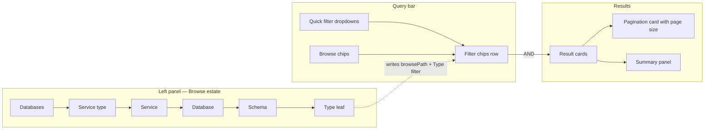

# Discovery & Search (Explore)

**The Explore page is redesigned in 2.0. Filtering, browsing, pagination, ranking and export all
behave differently.**

This is the single most user-visible change in the release. The redesign is not cosmetic — the
mental model changed from *"a tree that replaces your filters"* to *"a browse location that **stacks
with** your filters"*.

---

## The new Explore layout



| | 1.13 | 2.0 |
|---|------|-----|
| Left panel title | **Data Assets** | **Browse estate** |
| Left panel role | Tree selection **replaced** the quick filters | Tree sets a *browse location* that **ANDs with** the quick filters |
| Active filter display | A single "Clear all" text link | A dedicated **query chip row** — one chip per browse level and per selected filter value, each individually removable |
| Filter apply | Pick values, then click **Update** | **Immediate apply** on selection — the Update button is gone (`immediateApply`) |
| Pagination | Inline pagination inside the results card | Dedicated `PaginationCardWithControls` below results, with a page-size selector |
| Tab switching | Refetch with spinner every time | Served from a short-lived client cache, then silently revalidated |
| Result relevance | `searchFields` scoring | Staged ranking (`nameFirstLexicalThenSignals`) with optional per-result explanation |
| CSV export | Synchronous browser download | Background job surfaced in the **Background jobs** tray |

---

## Explore URL parameters changed { #explore-url-parameters-changed }

:material-close-octagon:{ .om-breaking } **Breaking** · Affects: bookmarks, saved links, embedded
iframes, docs that deep-link into Explore, and anything constructing Explore URLs

```diff title="parseSearchParams() — utils/ExplorePureUtils.ts"
- export const parseSearchParams = (search, globalPageSize, queryFilter) => {
-   ...
-   const page = isString(parsedSearch.page) ? Number.parseInt(parsedSearch.page) : 1;
-   const size = isString(parsedSearch.size) ? Number.parseInt(parsedSearch.size) : globalPageSize;
-   return { parsedSearch, searchQueryParam, sortValue, sortOrder, page, size, showDeleted };
+ export const parseSearchParams = (search, queryFilter) => {
+   ...
+   const browseFields = parseBrowsePathFields(parsedSearch.browsePath);
+   return { parsedSearch, searchQueryParam, browseFields, sortValue, sortOrder, showDeleted };
  }
```

| Parameter | 1.13 | 2.0 |
|-----------|------|-----|
| Page number | `page` | **`currentPage`** |
| Page size | `size` | **`pageSize`** |
| Browse location | — | **`browsePath`** (JSON-encoded `ExploreQuickFilterField[]`) |
| Cursor paging | — | `cursorType`, `cursorValue` |
| Quick filters | `quickFilter` (unchanged) | `quickFilter` |
| Free text | `search` (unchanged) | `search` |
| Sort | `sort`, `sortOrder` (unchanged) | `sort`, `sortOrder` |
| Deleted | `showDeleted` (unchanged) | `showDeleted` |

=== "1.13 URL"

    ```
    /explore/tables?search=orders&page=3&size=25&sort=_score&sortOrder=desc
    ```

=== "2.0 URL"

    ```
    /explore/tables?search=orders&currentPage=3&pageSize=25&sort=_score&sortOrder=desc
    ```

**Failure mode:** a 1.13 link with `?page=3&size=25` still loads Explore, but silently lands on
**page 1 at the default page size**. There is no error and no redirect.

!!! note "Page size is now constrained to 15 / 25 / 50"
    Explore accepts only `PAGE_SIZE_BASE` (15), `PAGE_SIZE_MEDIUM` (25) and `PAGE_SIZE_LARGE` (50).
    Any other `pageSize` — including a value inherited from the user's stored `globalPageSize` — is
    coerced back to 15.

!!! success "Action"
    Update deep links, embedded dashboards and documentation to the new parameter names. The route
    itself (`/explore/:tab`) is unchanged.

---

## Browsing no longer clears your filters

:material-alert:{ .om-behavioral } **Behavioural** · Affects: every Explore user

In 1.13 the left tree drove the quick filters directly — clicking a service **overwrote** the filter
state. In 2.0 the tree writes to its own `browsePath` parameter, which is compiled into a separate
Elasticsearch filter and `AND`-ed with the dropdown filters:

```js title="ExplorePageV1.component.tsx"
// ES filter contributed by the browse-tree location. It ANDs with the
// dropdown quickFilter so browsing never clears filters and vice versa.
const browseQueryFilter = useMemo(() => getBrowsePathQueryFilter(browseFields), [browseFields]);
```

Consequences:

- Selecting **Tier 1** and then browsing to a schema keeps the Tier 1 filter.
- Clicking a **type leaf** (Tables, Columns) in the tree writes the parent levels into `browsePath`
  *and* upserts the type into the `entityType.keyword` quick filter — both land in one navigation.
- Removing a **browse chip truncates the path from that level down** — dropping the *Service* chip
  also drops the Database and Schema beneath it (`truncateBrowsePath`).
- Category roots whose entity types can't hold the selected Data Asset type are **greyed out** —
  selecting "Table" disables every non-Database service root (`getDisabledExploreTreeKeys`).

---

## Facet options are now scoped differently

:material-alert:{ .om-behavioral } **Behavioural** · Affects: every Explore user; changes which
options appear in each dropdown

In 1.13 every dropdown's aggregation was computed against the *full* combined filter — including
that dropdown's own selection. Selecting `Table` in **Data Assets** shrank the Data Assets dropdown
to just `Table`.

2.0 excludes a facet's own field from its own aggregation:

```js title="ExploreQuickFilters.tsx"
// Facet options exclude the facet's own field (but keep every other
// constraint): unselecting Column must reveal the other asset types still
// available in the current browse location, and selecting values must not
// shrink the list to just the selection.
```

The resulting semantics are the conventional faceted-search model:

- **Within one facet:** values are `OR`-ed, and the option list keeps showing the alternatives.
- **Across facets:** constraints are `AND`-ed.
- The browse location is always applied, including to facet option lists.

The page-level aggregations are reused (no extra request) whenever no dropdown has a value to
exclude; a per-facet aggregation request is issued only once a selection must be excluded from its
own facet.

!!! success "Action"
    None required, but expect option lists to be longer than in 1.13 and to change as you browse.
    UI tests that clicked **Update** to commit a dropdown selection must drop that step — the button
    is only rendered when `immediateApply` is off.

---

## The query chip row

:material-plus-circle:{ .om-additive } **New UI** · Replaces the "Clear all" link

A `Query` row sits under the filter dropdowns and renders the whole active query as chips:

```
🔎 Query   [In · Databases ×] [Service · redshift_prod ×] [Schema · dbt_jaffle ×] [Type · Table ×] [Tier · Tier1 ×]   Clear all
```

- Browse levels are labelled `In`, `Service Type`, `Service`, `Database`, `Schema`.
- The Data Asset facet renders as `Type` with a human-readable entity label
  (`tableColumn` → `Column`) rather than the raw aggregation key.
- With nothing selected the row shows a placeholder:
  *"Browsing your whole data estate — pick a filter above or a location on the left and they stack here."*

### `Clear all` scope changed

:material-alert:{ .om-behavioral }

| Control | 1.13 | 2.0 |
|---------|------|-----|
| "Clear all" text link next to Tools | Called `onResetAllFilters()` | Removed — replaced by **Clear all** on the chip row, which also calls `onResetAllFilters()` |
| Clear (`×`) on the **Advanced Search** applied-filter banner | Called `onResetAllFilters()` — wiped quick filters too | Calls **`onResetQueryFilter()`** — clears only the advanced query, leaving quick filters and browse location intact |

!!! success "Action"
    Playwright/Cypress suites keyed on `data-testid="clear-filters"` must move to the chip row
    (`data-testid="explore-query-filter-chips"`). Dismissing an advanced-search query no longer
    resets the rest of the filter state.

---

## Tools menu changes

:material-alert:{ .om-behavioral }

| Item | 1.13 | 2.0 |
|------|------|-----|
| Deleted toggle | Labelled **Deleted** | Labelled **Show Deleted** |
| Export | Synchronous download | Queues a background job |
| Advanced Search | unchanged | unchanged |
| **Ranking Details** | — | **New toggle** |

### Ranking Details

Turning on **Ranking Details** re-runs the search with `explain` enabled and renders, per result
card, the Elasticsearch `_score`, the `_explanation` tree and the `matched_queries` (which ranking
stages fired).

```diff title="SearchedData.tsx"
+ matchedQueries={showRankingDetails ? matched_queries : undefined}
+ score={showRankingDetails ? _score : undefined}
+ scoreExplanation={showRankingDetails ? _explanation : undefined}
```

It is part of the Explore fetch key, so toggling it forces a refetch and a separate cache entry.

---

## Result ordering changes (staged ranking)

:material-alert:{ .om-behavioral } **Behavioural** · Affects: every search and Explore result list

`configuration/searchSettings.json` gains a per-asset-type `ranking` block:

```json
{
  "algorithm": "nameFirstLexicalThenSignals",
  "enabled": true,
  "disMaxTieBreaker": 0.05,
  "stages": [ /* ordered lexical ranking stages */ ],
  "signals": {
    "boostMode": "sum",
    "scoreMode": "sum",
    "maxBoost": 2.0
  },
  "stopWords": [],
  "stopWordsByLanguage": {
    "en": ["a","an","and","are","as","at","by","for","from","in","into","is","of","on","or","the","to","with"]
  }
}
```

The model is: **ordered lexical stages first** (name matches outrank description/context matches),
then **bounded metadata signals** (Tier, usage) capped at `maxBoost: 2.0` so they act as
tie-breakers rather than dominating relevance. Setting `ranking.enabled: false` falls back to the
legacy `searchFields` scoring.

The 2.0.0 migration `backfillSearchRankingSettings()` writes the default ranking configuration into
any **existing** stored `searchSettings`, merging in missing stages rather than overwriting operator
customisations. `SearchIndexSettingsRepair.repairSearchIndexFieldSearchSettings()` runs alongside it.

!!! warning "Expect different result ordering after upgrade"
    Same query, same corpus, different order. If you have automated tests asserting the top result
    for a given query, re-baseline them. Tune via **Settings → Search → Ranking**, which also gains a
    **Reset to Default** button in 2.0.

---

## CSV export is now a background job

:material-alert:{ .om-behavioral } **Behavioural** · Affects: Explore users exporting search results

```diff title="ExploreV1.component.tsx"
- const blob = await exportSearchResultsCsvStream(params);
- const url = URL.createObjectURL(blob);
- a.download = `Search_Results_${new Date().toISOString()}.csv`;
- a.click();
+ const exportJob = await exportSearchResultsAsync(params);
+ markCsvJobOwned(exportJob?.jobId);
+ window.dispatchEvent(new Event(CSV_JOBS_REFRESH_EVENT));
+ showSuccessToast(t('message.search-export-job-started'));
```

The user now sees *"Export started — track progress and download the CSV from Background jobs."*
instead of an immediate file download. The job is tracked in `background_jobs` (`jobType: CSV_EXPORT`)
and downloaded from `GET /v1/csvAsyncJobs/{jobId}/result`.

!!! note "The synchronous endpoint still exists"
    `GET /v1/search/export` is unchanged and still streams CSV directly. Only the **UI** switched to
    `GET /v1/search/export/async`. Scripted exporters do not need to change.

The export **scope modal** also changed: exporting "all" now covers the full tab result set with an
accurate pre-count, capped at 200,000 rows.

---

## Explore result caching

:material-alert:{ .om-behavioral } **Behavioural** · Affects: perceived freshness on tab switches

2.0 adds `useExploreCache` — a short-lived stale-while-revalidate cache keyed by the full search
dependency string (filters, browse path, query, sort, page, page size, search index, ranking-details
flag).

- **Cache hit:** results render synchronously with **no spinner**, then a background refetch updates
  them.
- **Cache miss:** normal loading path.
- A stale-response guard drops in-flight responses whose key no longer matches the current search,
  so a slow response can no longer overwrite a newer result set.

!!! success "Action"
    UI tests that wait for a loading spinner on tab switch will need to key off content instead.

---

## Explore tree count semantics

:material-alert:{ .om-behavioral }

Tree counts now aggregate over the `dataAsset` index at every level, so a node's count is the total
matching objects in its **subtree** (parent ≥ child), and they respect the active quick filters,
advanced query filter and browse path (`buildTreeCountQueryFilter`). In 1.13 counts came from the
per-entity index for the immediate children only.

A count refresh no longer rebuilds the tree from scratch: lazily-loaded expanded nodes keep their
children, counts and selection (`refreshRootCounts`, `reconcilePresentRoots`).

---

## Entity-type label and casing normalisation

:material-alert:{ .om-behavioral } · Affects: automation reading the Data Assets dropdown

Search aggregations return entity types lowercased (`tablecolumn`) while the `EntityType` enum uses
camelCase (`tableColumn`). 2.0 adds `getCanonicalEntityType()` and renders **human labels with
entity icons** in the Data Asset dropdown, while storing the **lowercased** key in `quickFilter`.

!!! success "Action"
    If you construct `quickFilter` URLs by hand, use the lowercased `entityType.keyword` value.
    Note that the Explore quick filter uses `entityType.keyword`, not `entityType`.

---

## Summary of Explore-related file changes

| Area | File | Change |
|------|------|--------|
| Page controller | `pages/ExplorePage/ExplorePageV1.component.tsx` | +452 lines — paging hook, browse path, SWR cache, stale guard |
| Layout | `components/ExploreV1/ExploreV1.component.tsx` | +408 lines — chip row, pagination card, tools menu, async export |
| Chips | `components/Explore/ExploreQueryFilterChips/*` | New |
| Filters | `components/Explore/ExploreQuickFilters.tsx` | +214 lines — facet scoping, immediate apply, icons |
| Tree | `components/Explore/ExploreTree/ExploreTree.tsx` | +479 lines — browse path, disabled roots, count refresh |
| Utils | `utils/ExplorePureUtils.ts` | +104 lines — browse-path parsing, tree-count query builder |
| Cache | `hooks/useExploreCache.ts` | New |
| Cards | `components/ExploreV1/ExploreSearchCard/*` | +475 lines — 2.0 card layout, ranking details |
