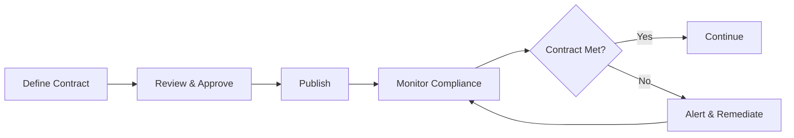

# Core Concepts

Comprehensive guide to OpenMetadata's data management framework.

## Overview

OpenMetadata provides a unified platform for managing metadata across your entire data ecosystem. The framework is built around five core pillars that work together to enable comprehensive data management:

---

## Data Assets

**10+ asset types** covering your entire data landscape.

OpenMetadata catalogs all data resources in your organization:

- **Database Assets**: Tables, columns, schemas, stored procedures
- **Streaming Assets**: Kafka/Pulsar topics with message schemas
- **BI & Analytics**: Dashboards, charts, and data models
- **Pipelines**: Airflow, dbt, Dagster orchestration workflows
- **ML Models**: Model metadata, features, hyperparameters, metrics
- **Storage**: S3 buckets, GCS containers, data lakes
- **APIs**: REST endpoints and API collections
- **Search**: Elasticsearch/OpenSearch indexes

Each asset type has rich metadata schemas capturing:
- Identity and descriptions
- Technical structure and properties
- Ownership and domain assignment
- Tags and glossary terms
- Quality test results
- Usage statistics
- Complete lineage

**[Explore Data Assets →](../schemas/entity/data-assets.md)**

---

## Data Quality

**Comprehensive testing and profiling** to ensure data reliability.

OpenMetadata's data quality framework enables you to:

### Test Framework
- **100+ built-in test definitions** for tables and columns
- **Multi-platform support**: OpenMetadata, Great Expectations, dbt, Deequ, Soda
- **Custom SQL tests** for business-specific validations
- **Test suites** for organized execution

### Common Tests
- Row count validations
- Column completeness (null checks)
- Uniqueness constraints
- Pattern matching (regex)
- Range validations
- Statistical checks (mean, std dev)
- Custom business rules

### Data Profiling
- Automatic statistical analysis
- Null counts and distributions
- Min/max/mean/median values
- Distinct value counts
- Top values histograms

### Quality Monitoring
- Test execution history
- Success/failure trends
- Quality scores and KPIs
- Alerts for critical failures
- Impact on downstream assets

**[Explore Data Quality →](../schemas/data-quality.md)**

---

## Lineage

**End-to-end data flow** tracking across your ecosystem.

OpenMetadata automatically captures and visualizes lineage:

### Column-Level Lineage
- Track transformations from source to target
- SQL query parsing for automatic lineage
- dbt lineage integration
- Custom lineage APIs

### Asset-Level Lineage
```
Source Database Tables
  ↓ ETL Pipeline
Target Data Warehouse
  ↓ BI Pipeline
Dashboard
  ↓ ML Training
ML Model
```

### Use Cases
- **Impact Analysis**: See downstream effects of changes
- **Root Cause Analysis**: Trace issues to source
- **Compliance**: Document data flows for regulations
- **Optimization**: Identify redundant pipelines

### Lineage Backends
- **OpenMetadata Native**: Built-in lineage tracking
- **PROV-O**: W3C provenance ontology for semantic lineage
- **RDF Graphs**: Queryable lineage using SPARQL

**[Explore Lineage →](../rdf/provenance/lineage.md)**

---

## Governance

**Classification, tagging, and business glossaries** for consistent metadata management.

### Classifications & Tags

Hierarchical taxonomies for categorizing data:

**Built-in Classifications**:

- **PII**: Personal data (Email, SSN, Phone, Address, Credit Cards)
- **PHI**: Protected health information
- **Tier**: Data criticality (Gold, Silver, Bronze)
- **Retention**: Data lifecycle policies
- **Compliance**: GDPR, CCPA, HIPAA, SOX, PCI-DSS

**Tag Application**:

- Asset-level tagging (tables, dashboards, pipelines)
- Column-level tagging (sensitive data)
- Automated PII detection
- Lineage-based propagation

### Business Glossaries

Standardized terminology across the organization:

- **Glossary Terms**: Business definitions
- **Synonyms**: Alternative names
- **Hierarchies**: Parent-child term relationships
- **Related Terms**: Semantic connections
- **Term Approval**: Review workflows
- **Asset Linking**: Connect terms to technical assets

### Governance Workflows

- Automated sensitive data discovery
- Policy-based access control
- Compliance reporting
- Data stewardship
- Audit trails

**[Explore Governance →](../schemas/governance.md)**

---

## Data Contracts

**Formal agreements** about data structure, quality, and SLAs.

Data Contracts define expectations between data producers and consumers:

### Contract Components

**Schema Requirements**:

- Required columns and data types
- Constraints and validations
- Backward compatibility rules

**Quality Requirements**:

- Minimum test success rates
- Acceptable null percentages
- Freshness requirements
- Completeness thresholds

**Service Level Agreements**:

- Data availability guarantees
- Update frequency commitments
- Latency requirements
- Support and notification channels

### Contract Lifecycle



### Benefits

- **Clear Expectations**: Documented producer/consumer agreements
- **Automated Validation**: Continuous contract compliance checking
- **Breaking Change Prevention**: Schema evolution controls
- **Trust**: Reliable data for downstream consumers
- **Ownership**: Defined responsibilities

**[Explore Data Contracts →](../schemas/entity/data-assets.md#data-contracts)**

---

## How They Work Together

These five pillars integrate to provide comprehensive data management:

### Example: Customer Data Pipeline

1. **Data Assets**: Track customer tables, ETL pipelines, and dashboards
2. **Data Quality**: Run tests on customer email format, uniqueness of customer_id
3. **Lineage**: See customer data flow from source → warehouse → analytics → ML model
4. **Governance**:
   - Tag customer email as `PII.Sensitive.Email`
   - Link to "Customer" glossary term
   - Apply GDPR compliance tags
5. **Data Contracts**: Define SLA that customer table updates within 1 hour, 99.9% uptime

### Integration Flow

```
┌─────────────────┐
│  Data Assets    │ ← Metadata about all resources
└────────┬────────┘
         │
         ├──→ ┌──────────────┐
         │    │ Data Quality │ ← Tests attached to assets
         │    └──────────────┘
         │
         ├──→ ┌──────────────┐
         │    │   Lineage    │ ← Relationships between assets
         │    └──────────────┘
         │
         ├──→ ┌──────────────┐
         │    │  Governance  │ ← Tags and terms on assets
         │    └──────────────┘
         │
         └──→ ┌──────────────┐
              │   Contracts  │ ← SLAs for critical assets
              └──────────────┘
```

---

## Getting Started

### 1. Discover Your Data
Start by ingesting metadata from your data sources to populate the catalog with assets.

**[Quick Start Guide →](../getting-started/quick-start.md)**

### 2. Add Quality Tests
Define and run tests on your most critical tables and columns.

**[Data Quality Guide →](../schemas/data-quality.md)**

### 3. Apply Governance
Tag sensitive data and create business glossaries.

**[Governance Guide →](../schemas/governance.md)**

### 4. Track Lineage
Enable automatic lineage capture from your pipelines.

**[Lineage Setup →](../rdf/provenance/lineage.md)**

### 5. Define Contracts
Formalize agreements for your most critical datasets.

**[Data Contracts →](../schemas/entity/data-assets.md#data-contracts)**

---

## Related Documentation

- **[JSON Schemas](../schemas/overview.md)** - Complete schema reference
- **[RDF & Ontologies](../rdf/overview.md)** - Semantic metadata standards
- **[Use Cases](../getting-started/use-cases.md)** - Real-world examples
- **[API Reference](../schemas/api/rest-api.md)** - Programmatic access
