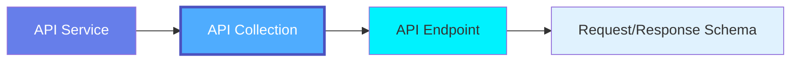

# API Collection

**Grouping related API endpoints - organizing API resources by domain**

---

## Overview

The **ApiCollection** entity represents a logical grouping of related API endpoints, similar to resource collections in REST APIs or service definitions in gRPC. It provides organization, versioning, and shared configuration for groups of endpoints.

**Hierarchy**:



---

## Relationships

ApiCollection has comprehensive relationships with entities across the metadata platform:

```mermaid
graph TD
    subgraph Hierarchy
        SVC[ApiService<br/>customer_api_v2]
        SVC --> COLL[ApiCollection<br/>customers]
    end

    subgraph Endpoints
        COLL --> EP1[ApiEndpoint<br/>GET /customers]
        COLL --> EP2[ApiEndpoint<br/>POST /customers]
        COLL --> EP3[ApiEndpoint<br/>GET /customers/:id]
        COLL --> EP4[ApiEndpoint<br/>PUT /customers/:id]
        COLL --> EP5[ApiEndpoint<br/>DELETE /customers/:id]
    end

    subgraph Ownership
        COLL -.->|owned by| TEAM[Team<br/>API Platform]
        COLL -.->|owned by| USER[User<br/>api.admin]
    end

    subgraph Governance
        COLL -.->|in domain| DOM[Domain<br/>Customer Platform]
        COLL -.->|tagged| TAG1[Tag<br/>Tier.Gold]
        COLL -.->|tagged| TAG2[Tag<br/>Public API]
        COLL -.->|tagged| TAG3[Tag<br/>Versioned]
        COLL -.->|linked to| GT[GlossaryTerm<br/>Customer API]
    end

    subgraph Backend Data
        EP1 -.->|queries| TBL1[Table<br/>customers]
        EP2 -.->|inserts into| TBL1
        EP3 -.->|queries| TBL1
        EP4 -.->|updates| TBL1
        EP5 -.->|deletes from| TBL1
    end

    subgraph Dependencies
        COLL -.->|depends on| SVC2[Service<br/>auth_service]
        COLL -.->|depends on| SVC3[Service<br/>payment_service]
    end

    subgraph Consumers
        APP1[Application<br/>web_app] -.->|calls| COLL
        APP2[Application<br/>mobile_app] -.->|calls| COLL
        APP3[Application<br/>partner_integration] -.->|calls| COLL
    end

    subgraph Quality
        TC1[TestCase<br/>api_response_time] -.->|monitors| EP1
        TC2[TestCase<br/>schema_validation] -.->|validates| EP2
        TC3[TestCase<br/>rate_limit_check] -.->|monitors| COLL
    end

    subgraph Documentation
        DOC[Documentation<br/>OpenAPI Spec] -.->|describes| COLL
        DASH[Dashboard<br/>API Metrics] -.->|monitors| COLL
    end

    style SVC fill:#667eea,color:#fff
    style COLL fill:#4facfe,color:#fff,stroke:#4c51bf,stroke-width:3px
    style EP1 fill:#00f2fe,color:#333
    style EP2 fill:#00f2fe,color:#333
    style EP3 fill:#00f2fe,color:#333
    style EP4 fill:#00f2fe,color:#333
    style EP5 fill:#00f2fe,color:#333
    style TEAM fill:#43e97b,color:#fff
    style USER fill:#43e97b,color:#fff
    style DOM fill:#fa709a,color:#fff
    style TAG1 fill:#f093fb,color:#fff
    style TAG2 fill:#f093fb,color:#fff
    style TAG3 fill:#f093fb,color:#fff
    style GT fill:#ffd700,color:#333
    style TBL1 fill:#764ba2,color:#fff
    style SVC2 fill:#00ac69,color:#fff
    style SVC3 fill:#00ac69,color:#fff
    style APP1 fill:#f5576c,color:#fff
    style APP2 fill:#f5576c,color:#fff
    style APP3 fill:#f5576c,color:#fff
    style TC1 fill:#9b59b6,color:#fff
    style TC2 fill:#9b59b6,color:#fff
    style TC3 fill:#9b59b6,color:#fff
    style DOC fill:#ff6b6b,color:#fff
    style DASH fill:#ff6b6b,color:#fff
```



**Relationship Types**:

- **Solid lines (→)**: Hierarchical containment (Service contains ApiCollection, ApiCollection contains Endpoints)
- **Dashed lines (-.->)**: References and associations (ownership, governance, lineage, consumers)

### Parent Entities
- **ApiService**: The API service hosting this collection

### Child Entities
- **ApiEndpoint**: Individual API endpoints in this collection

### Associated Entities
- **Owner**: User or team owning this API collection
- **Domain**: Business domain assignment
- **Tag**: Classification tags
- **GlossaryTerm**: Business terminology
- **Table**: Backend database tables accessed by endpoints
- **Service**: Dependent microservices
- **Application**: Consumer applications
- **TestCase**: API performance, schema validation, rate limiting tests
- **Dashboard**: API metrics and monitoring dashboards

---

## Schema Specifications

View the complete ApiCollection schema in your preferred format:

=== "JSON Schema"

    **Complete JSON Schema Definition**

    ```json
    {
      "$id": "https://open-metadata.org/schema/entity/data/apiCollection.json",
      "$schema": "http://json-schema.org/draft-07/schema#",
      "title": "ApiCollection",
      "description": "An `ApiCollection` groups related API endpoints together, providing versioning and shared configuration.",
      "type": "object",
      "javaType": "org.openmetadata.schema.entity.data.ApiCollection",

      "definitions": {
        "apiVersion": {
          "description": "API version specification",
          "type": "object",
          "properties": {
            "version": {
              "type": "string",
              "pattern": "^(v)?\\d+(\\.\\d+)?(\\.\\d+)?$"
            },
            "versioningScheme": {
              "type": "string",
              "enum": ["URL", "Header", "QueryParam"]
            },
            "deprecated": {
              "type": "boolean"
            },
            "sunsetDate": {
              "type": "string",
              "format": "date-time"
            }
          }
        },
        "rateLimit": {
          "type": "object",
          "properties": {
            "requestsPerMinute": {
              "type": "integer"
            },
            "requestsPerHour": {
              "type": "integer"
            },
            "requestsPerDay": {
              "type": "integer"
            }
          }
        }
      },

      "properties": {
        "id": {
          "description": "Unique identifier",
          "$ref": "../../type/basic.json#/definitions/uuid"
        },
        "name": {
          "description": "Collection name",
          "$ref": "../../type/basic.json#/definitions/entityName"
        },
        "fullyQualifiedName": {
          "description": "Fully qualified name: service.collection",
          "$ref": "../../type/basic.json#/definitions/fullyQualifiedEntityName"
        },
        "displayName": {
          "description": "Display name",
          "type": "string"
        },
        "description": {
          "description": "Markdown description",
          "$ref": "../../type/basic.json#/definitions/markdown"
        },
        "apiVersion": {
          "$ref": "#/definitions/apiVersion"
        },
        "basePath": {
          "description": "Base path for all endpoints in collection",
          "type": "string"
        },
        "endpoints": {
          "description": "API endpoints in this collection",
          "type": "array",
          "items": {
            "$ref": "../../type/entityReference.json"
          }
        },
        "service": {
          "description": "Parent API service",
          "$ref": "../../type/entityReference.json"
        },
        "rateLimit": {
          "$ref": "#/definitions/rateLimit"
        },
        "authentication": {
          "description": "Authentication requirements",
          "type": "object"
        },
        "owner": {
          "description": "Owner (user or team)",
          "$ref": "../../type/entityReference.json"
        },
        "domain": {
          "description": "Data domain",
          "$ref": "../../type/entityReference.json"
        },
        "tags": {
          "description": "Classification tags",
          "type": "array",
          "items": {
            "$ref": "../../type/tagLabel.json"
          }
        },
        "glossaryTerms": {
          "description": "Business glossary terms",
          "type": "array",
          "items": {
            "$ref": "../../type/entityReference.json"
          }
        },
        "version": {
          "description": "Metadata version",
          "$ref": "../../type/entityHistory.json#/definitions/entityVersion"
        }
      },

      "required": ["id", "name", "service"]
    }
    ```

    **[View Full JSON Schema →](https://github.com/open-metadata/OpenMetadataStandards/blob/main/schemas/entity/data/apiCollection.json)**

=== "RDF"

    **RDF/OWL Ontology Definition**

    ```turtle
    @prefix om: <https://open-metadata.org/schema/> .
    @prefix rdfs: <http://www.w3.org/2000/01/rdf-schema#> .
    @prefix owl: <http://www.w3.org/2001/XMLSchema#> .
    @prefix xsd: <http://www.w3.org/2001/XMLSchema#> .

    # ApiCollection Class Definition
    om:ApiCollection a owl:Class ;
        rdfs:subClassOf om:DataAsset ;
        rdfs:label "ApiCollection" ;
        rdfs:comment "A collection of related API endpoints sharing configuration and versioning" ;
        om:hierarchyLevel 2 .

    # Properties
    om:collectionName a owl:DatatypeProperty ;
        rdfs:domain om:ApiCollection ;
        rdfs:range xsd:string ;
        rdfs:label "name" ;
        rdfs:comment "Name of the API collection" .

    om:fullyQualifiedName a owl:DatatypeProperty ;
        rdfs:domain om:ApiCollection ;
        rdfs:range xsd:string ;
        rdfs:label "fullyQualifiedName" ;
        rdfs:comment "Complete hierarchical name: service.collection" .

    om:basePath a owl:DatatypeProperty ;
        rdfs:domain om:ApiCollection ;
        rdfs:range xsd:string ;
        rdfs:label "basePath" ;
        rdfs:comment "Base URL path for all endpoints in collection" .

    om:apiVersion a owl:DatatypeProperty ;
        rdfs:domain om:ApiCollection ;
        rdfs:range xsd:string ;
        rdfs:label "apiVersion" ;
        rdfs:comment "API version (e.g., v1, v2.0)" .

    om:hasEndpoint a owl:ObjectProperty ;
        rdfs:domain om:ApiCollection ;
        rdfs:range om:ApiEndpoint ;
        rdfs:label "hasEndpoint" ;
        rdfs:comment "Endpoints in this collection" .

    om:belongsToService a owl:ObjectProperty ;
        rdfs:domain om:ApiCollection ;
        rdfs:range om:ApiService ;
        rdfs:label "belongsToService" ;
        rdfs:comment "Parent API service" .

    om:ownedBy a owl:ObjectProperty ;
        rdfs:domain om:ApiCollection ;
        rdfs:range om:Owner ;
        rdfs:label "ownedBy" ;
        rdfs:comment "User or team that owns this collection" .

    om:hasTag a owl:ObjectProperty ;
        rdfs:domain om:ApiCollection ;
        rdfs:range om:Tag ;
        rdfs:label "hasTag" ;
        rdfs:comment "Classification tags applied to collection" .

    om:linkedToGlossaryTerm a owl:ObjectProperty ;
        rdfs:domain om:ApiCollection ;
        rdfs:range om:GlossaryTerm ;
        rdfs:label "linkedToGlossaryTerm" ;
        rdfs:comment "Business glossary terms" .

    # Example Instance
    ex:paymentsAPI a om:ApiCollection ;
        om:collectionName "payments_api" ;
        om:fullyQualifiedName "production_api_gateway.payments_api" ;
        om:displayName "Payments API" ;
        om:basePath "/api/v2/payments" ;
        om:apiVersion "v2" ;
        om:belongsToService ex:productionAPIGateway ;
        om:ownedBy ex:paymentsTeam ;
        om:hasTag ex:tierGold ;
        om:hasEndpoint ex:createPaymentEndpoint ;
        om:hasEndpoint ex:getPaymentEndpoint .
    ```

    **[View Full RDF Ontology →](https://github.com/open-metadata/OpenMetadataStandards/blob/main/rdf/ontology/openmetadata.ttl)**

=== "JSON-LD"

    **JSON-LD Context and Example**

    ```json
    {
      "@context": {
        "@vocab": "https://open-metadata.org/schema/",
        "om": "https://open-metadata.org/schema/",
        "rdfs": "http://www.w3.org/2000/01/rdf-schema#",
        "xsd": "http://www.w3.org/2001/XMLSchema#",

        "ApiCollection": "om:ApiCollection",
        "name": {
          "@id": "om:collectionName",
          "@type": "xsd:string"
        },
        "fullyQualifiedName": {
          "@id": "om:fullyQualifiedName",
          "@type": "xsd:string"
        },
        "displayName": {
          "@id": "om:displayName",
          "@type": "xsd:string"
        },
        "description": {
          "@id": "om:description",
          "@type": "xsd:string"
        },
        "basePath": {
          "@id": "om:basePath",
          "@type": "xsd:string"
        },
        "apiVersion": {
          "@id": "om:apiVersion",
          "@type": "@id"
        },
        "endpoints": {
          "@id": "om:hasEndpoint",
          "@type": "@id",
          "@container": "@set"
        },
        "service": {
          "@id": "om:belongsToService",
          "@type": "@id"
        },
        "owner": {
          "@id": "om:ownedBy",
          "@type": "@id"
        },
        "domain": {
          "@id": "om:inDomain",
          "@type": "@id"
        },
        "tags": {
          "@id": "om:hasTag",
          "@type": "@id",
          "@container": "@set"
        },
        "glossaryTerms": {
          "@id": "om:linkedToGlossaryTerm",
          "@type": "@id",
          "@container": "@set"
        }
      }
    }
    ```

    **Example JSON-LD Instance**:

    ```json
    {
      "@context": "https://open-metadata.org/context/apiCollection.jsonld",
      "@type": "ApiCollection",
      "@id": "https://example.com/api/collections/payments",

      "name": "payments_api",
      "fullyQualifiedName": "production_api_gateway.payments_api",
      "displayName": "Payments API",
      "description": "REST API for payment processing and transaction management",
      "basePath": "/api/v2/payments",

      "apiVersion": {
        "version": "v2",
        "versioningScheme": "URL",
        "deprecated": false
      },

      "service": {
        "@id": "https://example.com/services/production_api_gateway",
        "@type": "ApiService",
        "name": "production_api_gateway"
      },

      "owner": {
        "@id": "https://example.com/teams/payments",
        "@type": "Team",
        "name": "payments",
        "displayName": "Payments Team"
      },

      "tags": [
        {
          "@id": "https://open-metadata.org/tags/Tier/Gold",
          "tagFQN": "Tier.Gold"
        },
        {
          "@id": "https://open-metadata.org/tags/Compliance/PCI-DSS",
          "tagFQN": "Compliance.PCI-DSS"
        }
      ],

      "endpoints": [
        {
          "@id": "https://example.com/api/endpoints/create_payment",
          "@type": "ApiEndpoint",
          "name": "createPayment",
          "path": "/",
          "method": "POST"
        },
        {
          "@id": "https://example.com/api/endpoints/get_payment",
          "@type": "ApiEndpoint",
          "name": "getPayment",
          "path": "/{id}",
          "method": "GET"
        }
      ]
    }
    ```

    **[View Full JSON-LD Context →](https://github.com/open-metadata/OpenMetadataStandards/blob/main/rdf/contexts/apiCollection.jsonld)**

---

## Use Cases

- Group related API endpoints by resource domain (Users, Payments, Orders)
- Manage API versioning and deprecation policies
- Apply shared rate limits and authentication to endpoint groups
- Document API collections with OpenAPI/Swagger specifications
- Track API collection ownership by feature teams
- Apply governance tags (Security level, SLA, Compliance)
- Monitor collection-level metrics and usage
- Define service-level agreements for API collections

---

## JSON Schema Specification

### Core Properties

#### `id` (uuid)
**Type**: `string` (UUID format)
**Required**: Yes (system-generated)
**Description**: Unique identifier for this API collection instance

```json
{
  "id": "2b3c4d5e-6f7a-4b8c-9d0e-1f2a3b4c5d6e"
}
```

---

#### `name` (entityName)
**Type**: `string`
**Required**: Yes
**Pattern**: `^[^.]*$` (no dots allowed)
**Min Length**: 1
**Max Length**: 256
**Description**: Name of the API collection (unqualified)

```json
{
  "name": "payments_api"
}
```

---

#### `fullyQualifiedName` (fullyQualifiedEntityName)
**Type**: `string`
**Required**: Yes (system-generated)
**Pattern**: `^((?!::).)*$`
**Description**: Fully qualified name in the format `service.collection`

```json
{
  "fullyQualifiedName": "production_api_gateway.payments_api"
}
```

---

#### `displayName`
**Type**: `string`
**Required**: No
**Description**: Human-readable display name

```json
{
  "displayName": "Payments API"
}
```

---

#### `description` (markdown)
**Type**: `string` (Markdown format)
**Required**: No
**Description**: Rich text description of the API collection's purpose

```json
{
  "description": "# Payments API\n\nREST API for payment processing and transaction management.\n\n## Capabilities\n- Create payments\n- Process refunds\n- Query transaction history\n- Webhook notifications"
}
```

---

### Configuration Properties

#### `basePath`
**Type**: `string`
**Required**: No
**Description**: Base URL path for all endpoints in this collection

```json
{
  "basePath": "/api/v2/payments"
}
```

---

#### `apiVersion` (ApiVersion)
**Type**: `object`
**Required**: No
**Description**: API version specification and deprecation information

**ApiVersion Properties**:

| Property | Type | Required | Description |
|----------|------|----------|-------------|
| `version` | string | Yes | Version identifier (v1, v2.0, etc.) |
| `versioningScheme` | VersionScheme enum | No | URL, Header, or QueryParam |
| `deprecated` | boolean | No | Whether this version is deprecated |
| `sunsetDate` | date-time | No | When this version will be removed |
| `releaseDate` | date-time | No | When this version was released |

**Example**:

```json
{
  "apiVersion": {
    "version": "v2",
    "versioningScheme": "URL",
    "deprecated": false,
    "releaseDate": "2024-01-15T00:00:00Z"
  }
}
```

**Deprecated Version Example**:

```json
{
  "apiVersion": {
    "version": "v1",
    "versioningScheme": "URL",
    "deprecated": true,
    "sunsetDate": "2024-12-31T23:59:59Z",
    "releaseDate": "2022-06-01T00:00:00Z"
  }
}
```

---

#### `rateLimit` (RateLimit)
**Type**: `object`
**Required**: No
**Description**: Rate limiting configuration for this collection

```json
{
  "rateLimit": {
    "requestsPerMinute": 1000,
    "requestsPerHour": 50000,
    "requestsPerDay": 1000000,
    "burstLimit": 2000
  }
}
```

---

#### `authentication` (object)
**Type**: `object`
**Required**: No
**Description**: Authentication requirements for this collection

```json
{
  "authentication": {
    "required": true,
    "methods": ["OAuth2", "APIKey"],
    "scopes": ["payments.read", "payments.write"],
    "apiKeyLocation": "header",
    "apiKeyName": "X-API-Key"
  }
}
```

---

### Structure Properties

#### `endpoints[]` (EntityReference[])
**Type**: `array`
**Required**: No
**Description**: API endpoints in this collection

```json
{
  "endpoints": [
    {
      "id": "endpoint-uuid-1",
      "type": "apiEndpoint",
      "name": "createPayment",
      "fullyQualifiedName": "production_api_gateway.payments_api.createPayment"
    },
    {
      "id": "endpoint-uuid-2",
      "type": "apiEndpoint",
      "name": "getPayment",
      "fullyQualifiedName": "production_api_gateway.payments_api.getPayment"
    },
    {
      "id": "endpoint-uuid-3",
      "type": "apiEndpoint",
      "name": "refundPayment",
      "fullyQualifiedName": "production_api_gateway.payments_api.refundPayment"
    }
  ]
}
```

---

### Location Properties

#### `service` (EntityReference)
**Type**: `object`
**Required**: Yes
**Description**: Reference to parent API service

```json
{
  "service": {
    "id": "service-uuid",
    "type": "apiService",
    "name": "production_api_gateway",
    "fullyQualifiedName": "production_api_gateway"
  }
}
```

---

### Governance Properties

#### `owner` (EntityReference)
**Type**: `object`
**Required**: No
**Description**: User or team that owns this API collection

```json
{
  "owner": {
    "id": "team-uuid",
    "type": "team",
    "name": "payments",
    "displayName": "Payments Team"
  }
}
```

---

#### `domain` (EntityReference)
**Type**: `object`
**Required**: No
**Description**: Data domain this collection belongs to

```json
{
  "domain": {
    "id": "domain-uuid",
    "type": "domain",
    "name": "Finance",
    "fullyQualifiedName": "Finance"
  }
}
```

---

#### `tags[]` (TagLabel[])
**Type**: `array`
**Required**: No
**Description**: Classification tags applied to the collection

```json
{
  "tags": [
    {
      "tagFQN": "Tier.Gold",
      "description": "Critical business API",
      "source": "Classification",
      "labelType": "Manual",
      "state": "Confirmed"
    },
    {
      "tagFQN": "Compliance.PCI-DSS",
      "source": "Classification",
      "labelType": "Automated",
      "state": "Confirmed"
    }
  ]
}
```

---

#### `glossaryTerms[]` (GlossaryTerm[])
**Type**: `array`
**Required**: No
**Description**: Business glossary terms linked to this collection

```json
{
  "glossaryTerms": [
    {
      "fullyQualifiedName": "BusinessGlossary.Payment"
    },
    {
      "fullyQualifiedName": "BusinessGlossary.Transaction"
    }
  ]
}
```

---

### Versioning Properties

#### `version` (entityVersion)
**Type**: `number`
**Required**: Yes (system-managed)
**Description**: Metadata version number, incremented on changes

```json
{
  "version": 3.1
}
```

---

#### `updatedAt` (timestamp)
**Type**: `integer` (Unix epoch milliseconds)
**Required**: Yes (system-managed)
**Description**: Last update timestamp

```json
{
  "updatedAt": 1704240000000
}
```

---

#### `updatedBy` (string)
**Type**: `string`
**Required**: Yes (system-managed)
**Description**: User who made the update

```json
{
  "updatedBy": "john.developer"
}
```

---

## Complete Example

```json
{
  "id": "2b3c4d5e-6f7a-4b8c-9d0e-1f2a3b4c5d6e",
  "name": "payments_api",
  "fullyQualifiedName": "production_api_gateway.payments_api",
  "displayName": "Payments API",
  "description": "# Payments API\n\nREST API for payment processing and transaction management.",
  "basePath": "/api/v2/payments",
  "apiVersion": {
    "version": "v2",
    "versioningScheme": "URL",
    "deprecated": false,
    "releaseDate": "2024-01-15T00:00:00Z"
  },
  "rateLimit": {
    "requestsPerMinute": 1000,
    "requestsPerHour": 50000,
    "requestsPerDay": 1000000
  },
  "authentication": {
    "required": true,
    "methods": ["OAuth2", "APIKey"],
    "scopes": ["payments.read", "payments.write"]
  },
  "endpoints": [
    {
      "id": "endpoint-uuid-1",
      "type": "apiEndpoint",
      "name": "createPayment",
      "fullyQualifiedName": "production_api_gateway.payments_api.createPayment"
    },
    {
      "id": "endpoint-uuid-2",
      "type": "apiEndpoint",
      "name": "getPayment",
      "fullyQualifiedName": "production_api_gateway.payments_api.getPayment"
    }
  ],
  "service": {
    "id": "service-uuid",
    "type": "apiService",
    "name": "production_api_gateway"
  },
  "owner": {
    "id": "team-uuid",
    "type": "team",
    "name": "payments",
    "displayName": "Payments Team"
  },
  "domain": {
    "id": "domain-uuid",
    "type": "domain",
    "name": "Finance"
  },
  "tags": [
    {"tagFQN": "Tier.Gold"},
    {"tagFQN": "Compliance.PCI-DSS"}
  ],
  "glossaryTerms": [
    {"fullyQualifiedName": "BusinessGlossary.Payment"}
  ],
  "version": 3.1,
  "updatedAt": 1704240000000,
  "updatedBy": "john.developer"
}
```

---

## RDF Representation

### Ontology Class

```turtle
@prefix om: <https://open-metadata.org/schema/> .
@prefix rdfs: <http://www.w3.org/2000/01/rdf-schema#> .
@prefix owl: <http://www.w3.org/2001/XMLSchema#> .

om:ApiCollection a owl:Class ;
    rdfs:subClassOf om:DataAsset ;
    rdfs:label "ApiCollection" ;
    rdfs:comment "A collection of related API endpoints" ;
    om:hasProperties [
        om:name "string" ;
        om:basePath "string" ;
        om:apiVersion "ApiVersion" ;
        om:endpoints "ApiEndpoint[]" ;
        om:service "ApiService" ;
        om:owner "Owner" ;
        om:tags "Tag[]" ;
    ] .
```

### Instance Example

```turtle
@prefix om: <https://open-metadata.org/schema/> .
@prefix ex: <https://example.com/> .

ex:payments_api a om:ApiCollection ;
    om:collectionName "payments_api" ;
    om:fullyQualifiedName "production_api_gateway.payments_api" ;
    om:displayName "Payments API" ;
    om:basePath "/api/v2/payments" ;
    om:apiVersion "v2" ;
    om:belongsToService ex:productionAPIGateway ;
    om:ownedBy ex:paymentsTeam ;
    om:hasTag ex:tierGold ;
    om:hasEndpoint ex:createPayment ;
    om:hasEndpoint ex:getPayment .
```

---

## JSON-LD Context

```json
{
  "@context": {
    "@vocab": "https://open-metadata.org/schema/",
    "om": "https://open-metadata.org/schema/",
    "ApiCollection": "om:ApiCollection",
    "name": "om:name",
    "basePath": "om:basePath",
    "apiVersion": "om:apiVersion",
    "endpoints": {
      "@id": "om:hasEndpoint",
      "@type": "@id",
      "@container": "@set"
    },
    "service": {
      "@id": "om:belongsToService",
      "@type": "@id"
    },
    "owner": {
      "@id": "om:ownedBy",
      "@type": "@id"
    },
    "tags": {
      "@id": "om:hasTag",
      "@type": "@id",
      "@container": "@set"
    }
  }
}
```

### JSON-LD Example

```json
{
  "@context": "https://open-metadata.org/context/apiCollection.jsonld",
  "@type": "ApiCollection",
  "@id": "https://example.com/api/payments",
  "name": "payments_api",
  "basePath": "/api/v2/payments",
  "apiVersion": {
    "version": "v2",
    "deprecated": false
  },
  "service": {
    "@id": "https://example.com/services/production_api_gateway",
    "@type": "ApiService"
  },
  "endpoints": [
    {
      "@id": "https://example.com/api/endpoints/create_payment",
      "@type": "ApiEndpoint"
    }
  ]
}
```

---

## Relationships

### Parent Entities
- **ApiService**: The API service hosting this collection

### Child Entities
- **ApiEndpoint**: Individual endpoints within this collection

### Associated Entities
- **Owner**: User or team owning this collection
- **Domain**: Business domain assignment
- **Tag**: Classification tags
- **GlossaryTerm**: Business terminology
- **Schema**: Request/response schemas (via endpoints)

---

## Custom Properties

This entity supports custom properties through the `extension` field.
Common custom properties include:

- **Data Classification**: Sensitivity level
- **Cost Center**: Billing allocation
- **Retention Period**: Data retention requirements
- **Application Owner**: Owning application/team

See [Custom Properties](../../metadata-specifications/custom-properties.md)
for details on defining and using custom properties.

---

## API Operations

### Create API Collection

```http
POST /api/v1/apiCollections
Content-Type: application/json

{
  "name": "payments_api",
  "service": "production_api_gateway",
  "basePath": "/api/v2/payments",
  "apiVersion": {
    "version": "v2",
    "versioningScheme": "URL"
  }
}
```

### Get API Collection

```http
GET /api/v1/apiCollections/name/production_api_gateway.payments_api?fields=endpoints,owner,tags
```

### Update API Collection

```http
PATCH /api/v1/apiCollections/{id}
Content-Type: application/json-patch+json

[
  {
    "op": "add",
    "path": "/tags/-",
    "value": {"tagFQN": "Tier.Gold"}
  }
]
```

### Add Endpoint to Collection

```http
PUT /api/v1/apiCollections/{id}/endpoints
Content-Type: application/json

{
  "endpoints": [
    {
      "name": "refundPayment",
      "path": "/{id}/refund",
      "method": "POST"
    }
  ]
}
```

---

## Related Documentation

- **[API Service](api-service.md)** - Parent service configuration
- **[API Endpoint](api-endpoint.md)** - Individual endpoint specification
- **[OpenAPI Specification](../../specifications/openapi.md)** - OpenAPI/Swagger docs
- **[API Versioning](../../governance/api-versioning.md)** - Versioning strategies
