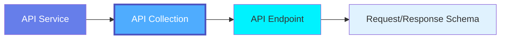

# API Collection

**Grouping related API endpoints - organizing API resources by domain**

---

## Overview

The **ApiCollection** entity represents a logical grouping of related API endpoints, similar to resource collections in REST APIs or service definitions in gRPC. It provides organization, versioning, and shared configuration for groups of endpoints.

**Hierarchy**:



---

## Relationships

ApiCollection has comprehensive relationships with entities across the metadata platform:

```mermaid
graph TD
    subgraph Hierarchy
        SVC[ApiService<br/>customer_api_v2]
        SVC --> COLL[ApiCollection<br/>customers]
    end

    subgraph Endpoints
        COLL --> EP1[ApiEndpoint<br/>GET /customers]
        COLL --> EP2[ApiEndpoint<br/>POST /customers]
        COLL --> EP3[ApiEndpoint<br/>GET /customers/:id]
        COLL --> EP4[ApiEndpoint<br/>PUT /customers/:id]
        COLL --> EP5[ApiEndpoint<br/>DELETE /customers/:id]
    end

    subgraph Ownership
        COLL -.->|owned by| TEAM[Team<br/>API Platform]
        COLL -.->|owned by| USER[User<br/>api.admin]
    end

    subgraph Governance
        COLL -.->|in domain| DOM[Domain<br/>Customer Platform]
        COLL -.->|tagged| TAG1[Tag<br/>Tier.Gold]
        COLL -.->|tagged| TAG2[Tag<br/>Public API]
        COLL -.->|tagged| TAG3[Tag<br/>Versioned]
        COLL -.->|linked to| GT[GlossaryTerm<br/>Customer API]
    end

    subgraph Backend Data
        EP1 -.->|queries| TBL1[Table<br/>customers]
        EP2 -.->|inserts into| TBL1
        EP3 -.->|queries| TBL1
        EP4 -.->|updates| TBL1
        EP5 -.->|deletes from| TBL1
    end

    subgraph Dependencies
        COLL -.->|depends on| SVC2[Service<br/>auth_service]
        COLL -.->|depends on| SVC3[Service<br/>payment_service]
    end

    subgraph Consumers
        APP1[Application<br/>web_app] -.->|calls| COLL
        APP2[Application<br/>mobile_app] -.->|calls| COLL
        APP3[Application<br/>partner_integration] -.->|calls| COLL
    end

    subgraph Quality
        TC1[TestCase<br/>api_response_time] -.->|monitors| EP1
        TC2[TestCase<br/>schema_validation] -.->|validates| EP2
        TC3[TestCase<br/>rate_limit_check] -.->|monitors| COLL
    end

    subgraph Documentation
        DOC[Documentation<br/>OpenAPI Spec] -.->|describes| COLL
        DASH[Dashboard<br/>API Metrics] -.->|monitors| COLL
    end

    style SVC fill:#667eea,color:#fff
    style COLL fill:#4facfe,color:#fff,stroke:#4c51bf,stroke-width:3px
    style EP1 fill:#00f2fe,color:#333
    style EP2 fill:#00f2fe,color:#333
    style EP3 fill:#00f2fe,color:#333
    style EP4 fill:#00f2fe,color:#333
    style EP5 fill:#00f2fe,color:#333
    style TEAM fill:#43e97b,color:#fff
    style USER fill:#43e97b,color:#fff
    style DOM fill:#fa709a,color:#fff
    style TAG1 fill:#f093fb,color:#fff
    style TAG2 fill:#f093fb,color:#fff
    style TAG3 fill:#f093fb,color:#fff
    style GT fill:#ffd700,color:#333
    style TBL1 fill:#764ba2,color:#fff
    style SVC2 fill:#00ac69,color:#fff
    style SVC3 fill:#00ac69,color:#fff
    style APP1 fill:#f5576c,color:#fff
    style APP2 fill:#f5576c,color:#fff
    style APP3 fill:#f5576c,color:#fff
    style TC1 fill:#9b59b6,color:#fff
    style TC2 fill:#9b59b6,color:#fff
    style TC3 fill:#9b59b6,color:#fff
    style DOC fill:#ff6b6b,color:#fff
    style DASH fill:#ff6b6b,color:#fff
```



**Relationship Types**:

- **Solid lines (→)**: Hierarchical containment (Service contains ApiCollection, ApiCollection contains Endpoints)
- **Dashed lines (-.->)**: References and associations (ownership, governance, lineage, consumers)

### Parent Entities
- **ApiService**: The API service hosting this collection

### Child Entities
- **ApiEndpoint**: Individual API endpoints in this collection

### Associated Entities
- **Owner**: User or team owning this API collection
- **Domain**: Business domain assignment
- **Tag**: Classification tags
- **GlossaryTerm**: Business terminology
- **Table**: Backend database tables accessed by endpoints
- **Service**: Dependent microservices
- **Application**: Consumer applications
- **TestCase**: API performance, schema validation, rate limiting tests
- **Dashboard**: API metrics and monitoring dashboards

---

## Schema Specifications

View the complete ApiCollection schema in your preferred format:

=== "JSON Schema"

    **Complete JSON Schema Definition**

    ```json
    {
      "$id": "https://open-metadata.org/schema/entity/data/apiCollection.json",
      "$schema": "http://json-schema.org/draft-07/schema#",
      "title": "APICollection",
      "$comment": "@om-entity-type",
      "description": "This schema defines the APICollection entity. API Collection allows user to group multiple APIs together. In OpenAPI specification its marked as a Tag.",
      "type": "object",
      "javaType": "org.openmetadata.schema.entity.data.APICollection",
      "javaInterfaces": ["org.openmetadata.schema.EntityInterface"],

      "properties": {
        "id": {
          "description": "Unique identifier that identifies a API Collection instance.",
          "$ref": "../../type/basic.json#/definitions/uuid"
        },
        "name": {
          "description": "Name that identifies this API Collection.",
          "$ref": "../../type/basic.json#/definitions/entityName"
        },
        "displayName": {
          "description": "Display Name that identifies this API Collection. It could be title or label from the source services.",
          "type": "string"
        },
        "fullyQualifiedName": {
          "description": "A unique name that identifies a API Collection in the format 'ServiceName.ApiCollectionName'.",
          "$ref": "../../type/basic.json#/definitions/fullyQualifiedEntityName"
        },
        "description": {
          "description": "Description of the API Collection, what it is, and how to use it.",
          "$ref": "../../type/basic.json#/definitions/markdown"
        },
        "version": {
          "description": "Metadata version of the entity.",
          "$ref": "../../type/entityHistory.json#/definitions/entityVersion"
        },
        "updatedAt": {
          "description": "Last update time corresponding to the new version of the entity in Unix epoch time milliseconds.",
          "$ref": "../../type/basic.json#/definitions/timestamp"
        },
        "updatedBy": {
          "description": "User who made the update.",
          "type": "string"
        },
        "impersonatedBy": {
          "description": "Bot user that performed the action on behalf of the actual user.",
          "$ref": "../../type/basic.json#/definitions/impersonatedBy"
        },
        "endpointURL": {
          "title": "Endpoint URL",
          "description": "EndPoint URL for the API Collection. Capture the Root URL of the collection.",
          "type": "string",
          "format": "uri"
        },
        "apiEndpoints": {
          "description": "All the APIs included in this API Collection.",
          "$ref": "../../type/entityReferenceList.json",
          "default": null
        },
        "href": {
          "description": "Link to the resource corresponding to this entity.",
          "$ref": "../../type/basic.json#/definitions/href"
        },
        "owners": {
          "description": "Owners of this API Collection.",
          "$ref": "../../type/entityReferenceList.json",
          "default": null
        },
        "tags": {
          "description": "Tags for this API Collection.",
          "type": "array",
          "items": {
            "$ref": "../../type/tagLabel.json"
          },
          "default": []
        },
        "service": {
          "description": "Link to service where this API Collection is hosted in.",
          "$ref": "../../type/entityReference.json"
        },
        "serviceType": {
          "description": "Service type where this API Collection is hosted in.",
          "$ref": "../services/apiService.json#/definitions/apiServiceType"
        },
        "changeDescription": {
          "description": "Change that lead to this version of the entity.",
          "$ref": "../../type/entityHistory.json#/definitions/changeDescription"
        },
        "incrementalChangeDescription": {
          "description": "Change that lead to this version of the entity.",
          "$ref": "../../type/entityHistory.json#/definitions/changeDescription"
        },
        "deleted": {
          "description": "When `true` indicates the entity has been soft deleted.",
          "type": "boolean",
          "default": false
        },
        "extension": {
          "description": "Entity extension data with custom attributes added to the entity.",
          "$ref": "../../type/basic.json#/definitions/entityExtension"
        },
        "domains": {
          "description": "Domains the API Collection belongs to. When not set, the API Collection inherits the domain from the API service it belongs to.",
          "$ref": "../../type/entityReferenceList.json"
        },
        "dataProducts": {
          "description": "List of data products this entity is part of.",
          "$ref": "../../type/entityReferenceList.json"
        },
        "votes": {
          "description": "Votes on the entity.",
          "$ref": "../../type/votes.json"
        },
        "lifeCycle": {
          "description": "Life Cycle properties of the entity",
          "$ref": "../../type/lifeCycle.json"
        },
        "certification": {
          "$ref": "../../type/assetCertification.json"
        },
        "sourceHash": {
          "description": "Source hash of the entity",
          "type": "string",
          "minLength": 1,
          "maxLength": 32
        },
        "entityStatus": {
          "description": "Status of the API Collection.",
          "$ref": "../../type/status.json"
        }
      },

      "required": ["id", "name", "service", "endpointURL"],
      "additionalProperties": false
    }
    ```

    **[View Full JSON Schema →](https://github.com/open-metadata/OpenMetadataStandards/blob/main/schemas/entity/data/apiCollection.json)**

=== "RDF"

    **RDF/OWL Ontology Definition**

    ```turtle
    @prefix om: <https://open-metadata.org/schema/> .
    @prefix rdfs: <http://www.w3.org/2000/01/rdf-schema#> .
    @prefix owl: <http://www.w3.org/2001/XMLSchema#> .
    @prefix xsd: <http://www.w3.org/2001/XMLSchema#> .

    # ApiCollection Class Definition
    om:APICollection a owl:Class ;
        rdfs:subClassOf om:DataAsset ;
        rdfs:label "APICollection" ;
        rdfs:comment "API Collection allows user to group multiple APIs together. In OpenAPI specification its marked as a Tag." ;
        om:hierarchyLevel 2 .

    # Properties
    om:collectionName a owl:DatatypeProperty ;
        rdfs:domain om:APICollection ;
        rdfs:range xsd:string ;
        rdfs:label "name" ;
        rdfs:comment "Name that identifies this API Collection" .

    om:displayName a owl:DatatypeProperty ;
        rdfs:domain om:APICollection ;
        rdfs:range xsd:string ;
        rdfs:label "displayName" ;
        rdfs:comment "Display Name that identifies this API Collection" .

    om:fullyQualifiedName a owl:DatatypeProperty ;
        rdfs:domain om:APICollection ;
        rdfs:range xsd:string ;
        rdfs:label "fullyQualifiedName" ;
        rdfs:comment "A unique name that identifies a API Collection in the format 'ServiceName.ApiCollectionName'" .

    om:endpointURL a owl:DatatypeProperty ;
        rdfs:domain om:APICollection ;
        rdfs:range xsd:anyURI ;
        rdfs:label "endpointURL" ;
        rdfs:comment "EndPoint URL for the API Collection. Capture the Root URL of the collection" .

    om:hasApiEndpoint a owl:ObjectProperty ;
        rdfs:domain om:APICollection ;
        rdfs:range om:ApiEndpoint ;
        rdfs:label "hasApiEndpoint" ;
        rdfs:comment "All the APIs included in this API Collection" .

    om:belongsToService a owl:ObjectProperty ;
        rdfs:domain om:APICollection ;
        rdfs:range om:ApiService ;
        rdfs:label "belongsToService" ;
        rdfs:comment "Link to service where this API Collection is hosted in" .

    om:hasOwners a owl:ObjectProperty ;
        rdfs:domain om:APICollection ;
        rdfs:range om:Owner ;
        rdfs:label "hasOwners" ;
        rdfs:comment "Owners of this API Collection" .

    om:hasTag a owl:ObjectProperty ;
        rdfs:domain om:APICollection ;
        rdfs:range om:Tag ;
        rdfs:label "hasTag" ;
        rdfs:comment "Tags for this API Collection" .

    om:inDomains a owl:ObjectProperty ;
        rdfs:domain om:APICollection ;
        rdfs:range om:Domain ;
        rdfs:label "inDomains" ;
        rdfs:comment "Domains the API Collection belongs to" .

    om:hasDataProducts a owl:ObjectProperty ;
        rdfs:domain om:APICollection ;
        rdfs:range om:DataProduct ;
        rdfs:label "hasDataProducts" ;
        rdfs:comment "List of data products this entity is part of" .

    om:hasVotes a owl:ObjectProperty ;
        rdfs:domain om:APICollection ;
        rdfs:range om:Votes ;
        rdfs:label "hasVotes" ;
        rdfs:comment "Votes on the entity" .

    om:hasLifeCycle a owl:ObjectProperty ;
        rdfs:domain om:APICollection ;
        rdfs:range om:LifeCycle ;
        rdfs:label "hasLifeCycle" ;
        rdfs:comment "Life Cycle properties of the entity" .

    om:hasCertification a owl:ObjectProperty ;
        rdfs:domain om:APICollection ;
        rdfs:range om:AssetCertification ;
        rdfs:label "hasCertification" ;
        rdfs:comment "Asset certification information" .

    # Example Instance
    ex:paymentsAPI a om:APICollection ;
        om:collectionName "payments_api" ;
        om:fullyQualifiedName "production_api_gateway.payments_api" ;
        om:displayName "Payments API" ;
        om:endpointURL "https://api.example.com/v2/payments" ;
        om:belongsToService ex:productionAPIGateway ;
        om:hasOwners ex:paymentsTeam ;
        om:hasTag ex:tierGold ;
        om:hasApiEndpoint ex:createPaymentEndpoint ;
        om:hasApiEndpoint ex:getPaymentEndpoint ;
        om:inDomains ex:financeDomain .
    ```

    **[View Full RDF Ontology →](https://github.com/open-metadata/OpenMetadataStandards/blob/main/rdf/ontology/openmetadata.ttl)**

=== "JSON-LD"

    **JSON-LD Context and Example**

    ```json
    {
      "@context": {
        "@vocab": "https://open-metadata.org/schema/",
        "om": "https://open-metadata.org/schema/",
        "rdfs": "http://www.w3.org/2000/01/rdf-schema#",
        "xsd": "http://www.w3.org/2001/XMLSchema#",

        "APICollection": "om:APICollection",
        "name": {
          "@id": "om:collectionName",
          "@type": "xsd:string"
        },
        "fullyQualifiedName": {
          "@id": "om:fullyQualifiedName",
          "@type": "xsd:string"
        },
        "displayName": {
          "@id": "om:displayName",
          "@type": "xsd:string"
        },
        "description": {
          "@id": "om:description",
          "@type": "xsd:string"
        },
        "endpointURL": {
          "@id": "om:endpointURL",
          "@type": "xsd:anyURI"
        },
        "apiEndpoints": {
          "@id": "om:hasApiEndpoint",
          "@type": "@id",
          "@container": "@set"
        },
        "service": {
          "@id": "om:belongsToService",
          "@type": "@id"
        },
        "owners": {
          "@id": "om:hasOwners",
          "@type": "@id",
          "@container": "@set"
        },
        "domains": {
          "@id": "om:inDomains",
          "@type": "@id",
          "@container": "@set"
        },
        "tags": {
          "@id": "om:hasTag",
          "@type": "@id",
          "@container": "@set"
        },
        "dataProducts": {
          "@id": "om:hasDataProducts",
          "@type": "@id",
          "@container": "@set"
        },
        "votes": {
          "@id": "om:hasVotes",
          "@type": "@id"
        },
        "lifeCycle": {
          "@id": "om:hasLifeCycle",
          "@type": "@id"
        },
        "certification": {
          "@id": "om:hasCertification",
          "@type": "@id"
        }
      }
    }
    ```

    **Example JSON-LD Instance**:

    ```json
    {
      "@context": "https://open-metadata.org/context/apiCollection.jsonld",
      "@type": "APICollection",
      "@id": "https://example.com/api/collections/payments",

      "name": "payments_api",
      "fullyQualifiedName": "production_api_gateway.payments_api",
      "displayName": "Payments API",
      "description": "REST API for payment processing and transaction management",
      "endpointURL": "https://api.example.com/v2/payments",

      "service": {
        "@id": "https://example.com/services/production_api_gateway",
        "@type": "ApiService",
        "name": "production_api_gateway"
      },

      "owners": [
        {
          "@id": "https://example.com/teams/payments",
          "@type": "Team",
          "name": "payments",
          "displayName": "Payments Team"
        }
      ],

      "domains": [
        {
          "@id": "https://example.com/domains/finance",
          "@type": "Domain",
          "name": "Finance"
        }
      ],

      "tags": [
        {
          "@id": "https://open-metadata.org/tags/Tier/Gold",
          "tagFQN": "Tier.Gold"
        },
        {
          "@id": "https://open-metadata.org/tags/Compliance/PCI-DSS",
          "tagFQN": "Compliance.PCI-DSS"
        }
      ],

      "apiEndpoints": [
        {
          "@id": "https://example.com/api/endpoints/create_payment",
          "@type": "ApiEndpoint",
          "name": "createPayment",
          "path": "/",
          "method": "POST"
        },
        {
          "@id": "https://example.com/api/endpoints/get_payment",
          "@type": "ApiEndpoint",
          "name": "getPayment",
          "path": "/{id}",
          "method": "GET"
        }
      ]
    }
    ```

    **[View Full JSON-LD Context →](https://github.com/open-metadata/OpenMetadataStandards/blob/main/rdf/contexts/apiCollection.jsonld)**

---

## Use Cases

- Group related API endpoints by resource domain (Users, Payments, Orders)
- Manage API versioning and deprecation policies
- Apply shared rate limits and authentication to endpoint groups
- Document API collections with OpenAPI/Swagger specifications
- Track API collection ownership by feature teams
- Apply governance tags (Security level, SLA, Compliance)
- Monitor collection-level metrics and usage
- Define service-level agreements for API collections

---

## JSON Schema Specification

### Core Properties

#### `id` (uuid)
**Type**: `string` (UUID format)
**Required**: Yes (system-generated)
**Description**: Unique identifier for this API collection instance

```json
{
  "id": "2b3c4d5e-6f7a-4b8c-9d0e-1f2a3b4c5d6e"
}
```

---

#### `name` (entityName)
**Type**: `string`
**Required**: Yes
**Pattern**: `^[^.]*$` (no dots allowed)
**Min Length**: 1
**Max Length**: 256
**Description**: Name of the API collection (unqualified)

```json
{
  "name": "payments_api"
}
```

---

#### `fullyQualifiedName` (fullyQualifiedEntityName)
**Type**: `string`
**Required**: Yes (system-generated)
**Pattern**: `^((?!::).)*$`
**Description**: Fully qualified name in the format `service.collection`

```json
{
  "fullyQualifiedName": "production_api_gateway.payments_api"
}
```

---

#### `displayName`
**Type**: `string`
**Required**: No
**Description**: Human-readable display name

```json
{
  "displayName": "Payments API"
}
```

---

#### `description` (markdown)
**Type**: `string` (Markdown format)
**Required**: No
**Description**: Rich text description of the API collection's purpose

```json
{
  "description": "# Payments API\n\nREST API for payment processing and transaction management.\n\n## Capabilities\n- Create payments\n- Process refunds\n- Query transaction history\n- Webhook notifications"
}
```

---

### Configuration Properties

#### `endpointURL`
**Type**: `string` (URI format)
**Required**: Yes
**Description**: EndPoint URL for the API Collection. Capture the Root URL of the collection.

```json
{
  "endpointURL": "https://api.example.com/v2/payments"
}
```

---

### Structure Properties

#### `apiEndpoints` (EntityReferenceList)
**Type**: `EntityReferenceList`
**Required**: No
**Default**: `null`
**Description**: All the APIs included in this API Collection.

```json
{
  "apiEndpoints": [
    {
      "id": "endpoint-uuid-1",
      "type": "apiEndpoint",
      "name": "createPayment",
      "fullyQualifiedName": "production_api_gateway.payments_api.createPayment"
    },
    {
      "id": "endpoint-uuid-2",
      "type": "apiEndpoint",
      "name": "getPayment",
      "fullyQualifiedName": "production_api_gateway.payments_api.getPayment"
    },
    {
      "id": "endpoint-uuid-3",
      "type": "apiEndpoint",
      "name": "refundPayment",
      "fullyQualifiedName": "production_api_gateway.payments_api.refundPayment"
    }
  ]
}
```

---

#### `href`
**Type**: `string` (URI format)
**Required**: No (system-managed)
**Description**: Link to the resource corresponding to this entity.

```json
{
  "href": "https://platform.open-metadata.org/api/v1/apiCollections/2b3c4d5e-6f7a-4b8c-9d0e-1f2a3b4c5d6e"
}
```

---

### Location Properties

#### `service` (EntityReference)
**Type**: `object`
**Required**: Yes
**Description**: Link to service where this API Collection is hosted in.

```json
{
  "service": {
    "id": "service-uuid",
    "type": "apiService",
    "name": "production_api_gateway",
    "fullyQualifiedName": "production_api_gateway"
  }
}
```

---

#### `serviceType`
**Type**: `string` (enum)
**Required**: No (system-managed)
**Description**: Service type where this API Collection is hosted in.

```json
{
  "serviceType": "REST"
}
```

---

### Governance Properties

#### `owners` (EntityReferenceList)
**Type**: `EntityReferenceList`
**Required**: No
**Default**: `null`
**Description**: Owners of this API Collection.

```json
{
  "owners": [
    {
      "id": "team-uuid",
      "type": "team",
      "name": "payments",
      "displayName": "Payments Team"
    }
  ]
}
```

---

#### `domains` (EntityReferenceList)
**Type**: `EntityReferenceList`
**Required**: No
**Description**: Domains the API Collection belongs to. When not set, the API Collection inherits the domain from the API service it belongs to.

```json
{
  "domains": [
    {
      "id": "domain-uuid",
      "type": "domain",
      "name": "Finance",
      "fullyQualifiedName": "Finance"
    }
  ]
}
```

---

#### `tags[]` (TagLabel[])
**Type**: `array`
**Required**: No
**Default**: `[]`
**Description**: Tags for this API Collection.

```json
{
  "tags": [
    {
      "tagFQN": "Tier.Gold",
      "description": "Critical business API",
      "source": "Classification",
      "labelType": "Manual",
      "state": "Confirmed"
    },
    {
      "tagFQN": "Compliance.PCI-DSS",
      "source": "Classification",
      "labelType": "Automated",
      "state": "Confirmed"
    }
  ]
}
```

---

#### `dataProducts` (EntityReferenceList)
**Type**: `EntityReferenceList`
**Required**: No
**Description**: List of data products this entity is part of.

```json
{
  "dataProducts": [
    {
      "id": "product-uuid",
      "type": "dataProduct",
      "name": "customer_360",
      "fullyQualifiedName": "CustomerDomain.customer_360"
    }
  ]
}
```

---

#### `votes`
**Type**: `object`
**Required**: No
**Description**: Votes on the entity.

```json
{
  "votes": {
    "upVotes": 15,
    "downVotes": 2,
    "upVoters": ["user1", "user2"],
    "downVoters": ["user3"]
  }
}
```

---

#### `lifeCycle`
**Type**: `object`
**Required**: No
**Description**: Life Cycle properties of the entity.

```json
{
  "lifeCycle": {
    "stage": "Production",
    "accessed": {
      "timestamp": 1704240000000
    }
  }
}
```

---

#### `certification`
**Type**: `object`
**Required**: No
**Description**: Asset certification information.

```json
{
  "certification": {
    "tagLabel": {
      "tagFQN": "Certified.Gold"
    }
  }
}
```

---

### Versioning Properties

#### `version` (entityVersion)
**Type**: `number`
**Required**: Yes (system-managed)
**Description**: Metadata version number, incremented on changes

```json
{
  "version": 3.1
}
```

---

#### `updatedAt` (timestamp)
**Type**: `integer` (Unix epoch milliseconds)
**Required**: Yes (system-managed)
**Description**: Last update timestamp

```json
{
  "updatedAt": 1704240000000
}
```

---

#### `updatedBy` (string)
**Type**: `string`
**Required**: Yes (system-managed)
**Description**: User who made the update

```json
{
  "updatedBy": "john.developer"
}
```

---

#### `impersonatedBy`
**Type**: `object`
**Required**: No (system-managed)
**Description**: Bot user that performed the action on behalf of the actual user.

```json
{
  "impersonatedBy": {
    "id": "bot-uuid",
    "type": "bot",
    "name": "ingestion-bot"
  }
}
```

---

#### `changeDescription`
**Type**: `object`
**Required**: No (system-managed)
**Description**: Change that lead to this version of the entity.

```json
{
  "changeDescription": {
    "fieldsAdded": [
      {
        "name": "tags",
        "newValue": "[{\"tagFQN\":\"Tier.Gold\"}]"
      }
    ],
    "fieldsUpdated": [],
    "fieldsDeleted": [],
    "previousVersion": 2.0
  }
}
```

---

#### `incrementalChangeDescription`
**Type**: `object`
**Required**: No (system-managed)
**Description**: Incremental change that lead to this version of the entity.

```json
{
  "incrementalChangeDescription": {
    "fieldsAdded": [],
    "fieldsUpdated": [
      {
        "name": "description",
        "oldValue": "Old description",
        "newValue": "Updated description"
      }
    ],
    "fieldsDeleted": []
  }
}
```

---

#### `deleted`
**Type**: `boolean`
**Required**: No
**Default**: `false`
**Description**: When `true` indicates the entity has been soft deleted.

```json
{
  "deleted": false
}
```

---

#### `extension`
**Type**: `object`
**Required**: No
**Description**: Entity extension data with custom attributes added to the entity.

```json
{
  "extension": {
    "customProperty1": "value1",
    "customProperty2": 123
  }
}
```

---

#### `sourceHash`
**Type**: `string`
**Required**: No
**Min Length**: 1
**Max Length**: 32
**Description**: Source hash of the entity

```json
{
  "sourceHash": "abc123def456"
}
```

---

#### `entityStatus`
**Type**: `string` (enum)
**Required**: No
**Description**: Status of the API Collection.

```json
{
  "entityStatus": "Active"
}
```

---

## Complete Example

```json
{
  "id": "2b3c4d5e-6f7a-4b8c-9d0e-1f2a3b4c5d6e",
  "name": "payments_api",
  "fullyQualifiedName": "production_api_gateway.payments_api",
  "displayName": "Payments API",
  "description": "# Payments API\n\nREST API for payment processing and transaction management.",
  "endpointURL": "https://api.example.com/v2/payments",
  "apiEndpoints": [
    {
      "id": "endpoint-uuid-1",
      "type": "apiEndpoint",
      "name": "createPayment",
      "fullyQualifiedName": "production_api_gateway.payments_api.createPayment"
    },
    {
      "id": "endpoint-uuid-2",
      "type": "apiEndpoint",
      "name": "getPayment",
      "fullyQualifiedName": "production_api_gateway.payments_api.getPayment"
    }
  ],
  "href": "https://platform.open-metadata.org/api/v1/apiCollections/2b3c4d5e-6f7a-4b8c-9d0e-1f2a3b4c5d6e",
  "service": {
    "id": "service-uuid",
    "type": "apiService",
    "name": "production_api_gateway"
  },
  "serviceType": "REST",
  "owners": [
    {
      "id": "team-uuid",
      "type": "team",
      "name": "payments",
      "displayName": "Payments Team"
    }
  ],
  "domains": [
    {
      "id": "domain-uuid",
      "type": "domain",
      "name": "Finance"
    }
  ],
  "dataProducts": [
    {
      "id": "product-uuid",
      "type": "dataProduct",
      "name": "customer_360"
    }
  ],
  "tags": [
    {"tagFQN": "Tier.Gold"},
    {"tagFQN": "Compliance.PCI-DSS"}
  ],
  "votes": {
    "upVotes": 15,
    "downVotes": 2
  },
  "lifeCycle": {
    "stage": "Production"
  },
  "certification": {
    "tagLabel": {
      "tagFQN": "Certified.Gold"
    }
  },
  "version": 3.1,
  "updatedAt": 1704240000000,
  "updatedBy": "john.developer",
  "deleted": false,
  "extension": {
    "cost_center": "CC-001",
    "sla": "99.9%"
  },
  "sourceHash": "abc123def456",
  "entityStatus": "Active"
}
```

---

## RDF Representation

### Ontology Class

```turtle
@prefix om: <https://open-metadata.org/schema/> .
@prefix rdfs: <http://www.w3.org/2000/01/rdf-schema#> .
@prefix owl: <http://www.w3.org/2001/XMLSchema#> .

om:APICollection a owl:Class ;
    rdfs:subClassOf om:DataAsset ;
    rdfs:label "APICollection" ;
    rdfs:comment "API Collection allows user to group multiple APIs together" ;
    om:hasProperties [
        om:name "string" ;
        om:endpointURL "anyURI" ;
        om:apiEndpoints "ApiEndpoint[]" ;
        om:service "ApiService" ;
        om:owners "Owner[]" ;
        om:domains "Domain[]" ;
        om:tags "Tag[]" ;
        om:dataProducts "DataProduct[]" ;
        om:votes "Votes" ;
        om:lifeCycle "LifeCycle" ;
        om:certification "AssetCertification" ;
    ] .
```

### Instance Example

```turtle
@prefix om: <https://open-metadata.org/schema/> .
@prefix ex: <https://example.com/> .

ex:payments_api a om:APICollection ;
    om:collectionName "payments_api" ;
    om:fullyQualifiedName "production_api_gateway.payments_api" ;
    om:displayName "Payments API" ;
    om:endpointURL "https://api.example.com/v2/payments" ;
    om:belongsToService ex:productionAPIGateway ;
    om:hasOwners ex:paymentsTeam ;
    om:hasTag ex:tierGold ;
    om:hasApiEndpoint ex:createPayment ;
    om:hasApiEndpoint ex:getPayment ;
    om:inDomains ex:financeDomain .
```

---

## JSON-LD Context

```json
{
  "@context": {
    "@vocab": "https://open-metadata.org/schema/",
    "om": "https://open-metadata.org/schema/",
    "APICollection": "om:APICollection",
    "name": "om:name",
    "endpointURL": "om:endpointURL",
    "apiEndpoints": {
      "@id": "om:hasApiEndpoint",
      "@type": "@id",
      "@container": "@set"
    },
    "service": {
      "@id": "om:belongsToService",
      "@type": "@id"
    },
    "owners": {
      "@id": "om:hasOwners",
      "@type": "@id",
      "@container": "@set"
    },
    "domains": {
      "@id": "om:inDomains",
      "@type": "@id",
      "@container": "@set"
    },
    "tags": {
      "@id": "om:hasTag",
      "@type": "@id",
      "@container": "@set"
    }
  }
}
```

### JSON-LD Example

```json
{
  "@context": "https://open-metadata.org/context/apiCollection.jsonld",
  "@type": "APICollection",
  "@id": "https://example.com/api/payments",
  "name": "payments_api",
  "endpointURL": "https://api.example.com/v2/payments",
  "service": {
    "@id": "https://example.com/services/production_api_gateway",
    "@type": "ApiService"
  },
  "owners": [
    {
      "@id": "https://example.com/teams/payments",
      "@type": "Team"
    }
  ],
  "domains": [
    {
      "@id": "https://example.com/domains/finance",
      "@type": "Domain"
    }
  ],
  "apiEndpoints": [
    {
      "@id": "https://example.com/api/endpoints/create_payment",
      "@type": "ApiEndpoint"
    }
  ]
}
```

---

## Relationships

### Parent Entities
- **ApiService**: The API service hosting this collection

### Child Entities
- **ApiEndpoint**: Individual endpoints within this collection

### Associated Entities
- **Owner**: User or team owning this collection
- **Domain**: Business domain assignment
- **Tag**: Classification tags
- **GlossaryTerm**: Business terminology
- **Schema**: Request/response schemas (via endpoints)

---

## Custom Properties

This entity supports custom properties through the `extension` field.
Common custom properties include:

- **Data Classification**: Sensitivity level
- **Cost Center**: Billing allocation
- **Retention Period**: Data retention requirements
- **Application Owner**: Owning application/team

See [Custom Properties](../../metadata-specifications/custom-properties.md)
for details on defining and using custom properties.

---

## API Operations

### List API Collections

```http
GET /v1/apiCollections
Query Parameters:
  - fields: Fields to include (owners, apiEndpoints, tags, extension, domains, sourceHash)
  - service: Filter by API service name (e.g., "Users API")
  - limit: Number of results (1-1000000, default 10)
  - before: Cursor for previous page
  - after: Cursor for next page
  - include: all | deleted | non-deleted (default: non-deleted)

Response: APICollectionList
```

**Example Request**:

```http
GET /v1/apiCollections?service=production_api_gateway&fields=owners,apiEndpoints,tags&limit=20
```

---

### Create API Collection

```http
POST /v1/apiCollections
Content-Type: application/json

{
  "name": "payments_api",
  "service": "production_api_gateway",
  "displayName": "Payments API",
  "description": "REST API for payment processing and transaction management",
  "endpointURL": "https://api.example.com/v2/payments",
  "owners": [
    {
      "id": "team-uuid",
      "type": "team"
    }
  ],
  "domains": [
    {
      "id": "domain-uuid",
      "type": "domain"
    }
  ],
  "tags": [
    {"tagFQN": "Tier.Gold"},
    {"tagFQN": "Compliance.PCI-DSS"}
  ]
}

Response: APICollection
```

---

### Get API Collection by Name

```http
GET /v1/apiCollections/name/{fqn}
Query Parameters:
  - fields: Fields to include (owners, apiEndpoints, tags, extension, domains)
  - include: all | deleted | non-deleted (default: non-deleted)

Response: APICollection
```

**Example Request**:

```http
GET /v1/apiCollections/name/production_api_gateway.payments_api?fields=owners,apiEndpoints,tags
```

---

### Get API Collection by ID

```http
GET /v1/apiCollections/{id}
Query Parameters:
  - fields: Fields to include
  - include: all | deleted | non-deleted (default: non-deleted)

Response: APICollection
```

---

### Update API Collection (Partial)

```http
PATCH /v1/apiCollections/{id}
Content-Type: application/json-patch+json

[
  {
    "op": "add",
    "path": "/tags/-",
    "value": {"tagFQN": "Tier.Gold"}
  },
  {
    "op": "replace",
    "path": "/description",
    "value": "Updated API collection description"
  },
  {
    "op": "replace",
    "path": "/endpointURL",
    "value": "https://api.example.com/v3/payments"
  }
]

Response: APICollection
```

---

### Create or Update API Collection

```http
PUT /v1/apiCollections
Content-Type: application/json

{
  "name": "payments_api",
  "service": "production_api_gateway",
  "endpointURL": "https://api.example.com/v2/payments"
}

Response: APICollection
```

---

### Delete API Collection

```http
DELETE /v1/apiCollections/{id}
Query Parameters:
  - hardDelete: true | false (default: false - soft delete)
  - recursive: true | false (default: false)

Response: APICollection
```

---

### Delete API Collection (Async)

```http
DELETE /v1/apiCollections/async/{id}
Query Parameters:
  - hardDelete: true | false (default: false)
  - recursive: true | false (default: false)

Response: Async deletion job details
```

---

### Get API Collection Version

```http
GET /v1/apiCollections/{id}/versions/{version}

Response: APICollection (specific version)
```

---

### Get API Collection Versions

```http
GET /v1/apiCollections/{id}/versions

Response: EntityHistory (all versions)
```

---

### Restore API Collection

```http
PUT /v1/apiCollections/restore
Content-Type: application/json

{
  "id": "collection-uuid"
}

Response: APICollection (restored)
```

---

### Vote on API Collection

```http
PUT /v1/apiCollections/{id}/vote
Content-Type: application/json

{
  "vote": "upvote"
}

Response: ChangeEvent
```

---

### Bulk Create or Update API Collections

```http
PUT /v1/apiCollections/bulk
Content-Type: application/json

{
  "entities": [
    {
      "name": "users_api",
      "service": "production_api_gateway",
      "endpointURL": "https://api.example.com/v2/users"
    },
    {
      "name": "orders_api",
      "service": "production_api_gateway",
      "endpointURL": "https://api.example.com/v2/orders"
    }
  ]
}

Response: BulkOperationResult
```

---

## Related Documentation

- **[API Service](api-service.md)** - Parent service configuration
- **[API Endpoint](api-endpoint.md)** - Individual endpoint specification
- **[OpenAPI Specification](../../specifications/openapi.md)** - OpenAPI/Swagger docs
- **[API Versioning](../../governance/api-versioning.md)** - Versioning strategies
