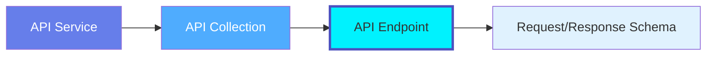

# API Endpoint

**Individual API endpoints - the building blocks of REST APIs**

---

## Overview

The **ApiEndpoint** entity represents a single API endpoint with its HTTP method, path, request/response schemas, authentication requirements, and OpenAPI specification. It is the most granular API asset in OpenMetadata.

**Hierarchy**:



---

## Relationships

ApiEndpoint has comprehensive relationships with entities across the metadata platform:

```mermaid
graph TD
    subgraph Hierarchy
        SVC[ApiService<br/>customer_api_v2]
        COLL[ApiCollection<br/>customers]
        SVC --> COLL
        COLL --> EP[ApiEndpoint<br/>GET /customers/:id]
    end

    subgraph Request/Response
        EP --> REQ[RequestSchema<br/>PathParams + QueryParams]
        EP --> RES[ResponseSchema<br/>200: Customer Object]
        REQ --> F1[Field<br/>id: string]
        REQ --> F2[Field<br/>include: string array]
        RES --> F3[Field<br/>customer_id: string]
        RES --> F4[Field<br/>email: string]
        RES --> F5[Field<br/>name: string]
    end

    subgraph Backend Data
        EP -.->|queries| TBL1[Table<br/>customers]
        EP -.->|joins| TBL2[Table<br/>addresses]
        EP -.->|joins| TBL3[Table<br/>orders]
    end

    subgraph Ownership
        EP -.->|owned by| TEAM[Team<br/>API Platform]
        EP -.->|owned by| USER[User<br/>api.dev]
    end

    subgraph Governance
        EP -.->|in domain| DOM[Domain<br/>Customer Platform]
        EP -.->|tagged| TAG1[Tag<br/>Public API]
        EP -.->|tagged| TAG2[Tag<br/>PII.Sensitive]
        EP -.->|linked to| GT[GlossaryTerm<br/>Customer Retrieval]
    end

    subgraph Policies
        POL1[Policy<br/>Rate Limiting] -.->|applies to| EP
        POL2[Policy<br/>Authentication] -.->|requires| EP
        POL3[Policy<br/>Authorization] -.->|enforces| EP
    end

    subgraph Quality
        TC1[TestCase<br/>response_time_sla] -.->|monitors| EP
        TC2[TestCase<br/>schema_compliance] -.->|validates| RES
        TC3[TestCase<br/>error_rate] -.->|tracks| EP
    end

    subgraph Consumers
        APP1[Application<br/>web_app] -.->|calls| EP
        APP2[Application<br/>mobile_app] -.->|calls| EP
        APP3[Service<br/>notification_service] -.->|calls| EP
    end

    subgraph Documentation
        DOC[Documentation<br/>OpenAPI Spec] -.->|describes| EP
        DASH[Dashboard<br/>API Performance] -.->|monitors| EP
    end

    style SVC fill:#667eea,color:#fff
    style COLL fill:#4facfe,color:#fff
    style EP fill:#00f2fe,color:#333,stroke:#4c51bf,stroke-width:3px
    style REQ fill:#00f2fe,color:#333
    style RES fill:#00f2fe,color:#333
    style F1 fill:#00f2fe,color:#333
    style F2 fill:#00f2fe,color:#333
    style F3 fill:#00f2fe,color:#333
    style F4 fill:#00f2fe,color:#333
    style F5 fill:#00f2fe,color:#333
    style TBL1 fill:#764ba2,color:#fff
    style TBL2 fill:#764ba2,color:#fff
    style TBL3 fill:#764ba2,color:#fff
    style TEAM fill:#43e97b,color:#fff
    style USER fill:#43e97b,color:#fff
    style DOM fill:#fa709a,color:#fff
    style TAG1 fill:#f093fb,color:#fff
    style TAG2 fill:#f093fb,color:#fff
    style GT fill:#ffd700,color:#333
    style POL1 fill:#ff6b6b,color:#fff
    style POL2 fill:#ff6b6b,color:#fff
    style POL3 fill:#ff6b6b,color:#fff
    style TC1 fill:#9b59b6,color:#fff
    style TC2 fill:#9b59b6,color:#fff
    style TC3 fill:#9b59b6,color:#fff
    style APP1 fill:#00ac69,color:#fff
    style APP2 fill:#00ac69,color:#fff
    style APP3 fill:#00ac69,color:#fff
    style DOC fill:#f5576c,color:#fff
    style DASH fill:#f5576c,color:#fff
```



**Relationship Types**:

- **Solid lines (→)**: Hierarchical containment (Service → Collection → Endpoint → Schemas)
- **Dashed lines (-.->)**: References and associations (ownership, governance, lineage, policies)

### Parent Entities
- **ApiService**: The API service hosting this endpoint
- **ApiCollection**: The collection grouping this endpoint

### Child Entities
- **RequestSchema**: Request parameters and body schema
- **ResponseSchema**: Response body schema for various status codes

### Associated Entities
- **Owner**: User or team owning this endpoint
- **Domain**: Business domain assignment
- **Tag**: Classification tags
- **GlossaryTerm**: Business terminology
- **Table**: Backend database tables accessed by this endpoint
- **Policy**: Rate limiting, authentication, authorization policies
- **Application**: Consumer applications calling this endpoint
- **TestCase**: Performance SLA, schema validation, error rate monitoring
- **Dashboard**: API performance monitoring dashboards

---

## Schema Specifications

View the complete ApiEndpoint schema in your preferred format:

=== "JSON Schema"

    **Complete JSON Schema Definition**

    ```json
    {
      "$id": "https://open-metadata.org/schema/entity/data/apiEndpoint.json",
      "$schema": "http://json-schema.org/draft-07/schema#",
      "title": "APIEndpoint",
      "$comment": "@om-entity-type",
      "description": "This schema defines the APIEndpoint entity. An APIEndpoint is a specific endpoint of an API that is part of an API Collection.",
      "type": "object",
      "javaType": "org.openmetadata.schema.entity.data.APIEndpoint",
      "javaInterfaces": ["org.openmetadata.schema.EntityInterface"],

      "definitions": {
        "apiRequestMethod": {
          "javaType": "org.openmetadata.schema.type.APIRequestMethod",
          "description": "This schema defines the Request Method type for APIs.",
          "type": "string",
          "default": "GET",
          "enum": [
            "GET",
            "POST",
            "PUT",
            "PATCH",
            "DELETE",
            "HEAD",
            "CONNECT",
            "OPTIONS",
            "TRACE"
          ]
        }
      },

      "properties": {
        "id": {
          "description": "Unique identifier that identifies a API Endpoint instance.",
          "$ref": "../../type/basic.json#/definitions/uuid"
        },
        "name": {
          "description": "Name that identifies this API Endpoint.",
          "$ref": "../../type/basic.json#/definitions/entityName"
        },
        "displayName": {
          "description": "Display Name that identifies this API Endpoint.",
          "type": "string"
        },
        "fullyQualifiedName": {
          "description": "A unique name that identifies a API Collection in the format 'ServiceName.ApiCollectionName.APIEndpoint'.",
          "$ref": "../../type/basic.json#/definitions/fullyQualifiedEntityName"
        },
        "description": {
          "description": "Description of the API Endpoint, what it is, and how to use it.",
          "$ref": "../../type/basic.json#/definitions/markdown"
        },
        "version": {
          "description": "Metadata version of the entity.",
          "$ref": "../../type/entityHistory.json#/definitions/entityVersion"
        },
        "updatedAt": {
          "description": "Last update time corresponding to the new version of the entity in Unix epoch time milliseconds.",
          "$ref": "../../type/basic.json#/definitions/timestamp"
        },
        "updatedBy": {
          "description": "User who made the update.",
          "type": "string"
        },
        "impersonatedBy": {
          "description": "Bot user that performed the action on behalf of the actual user.",
          "$ref": "../../type/basic.json#/definitions/impersonatedBy"
        },
        "endpointURL": {
          "title": "Endpoint URL",
          "description": "EndPoint URL for the API Collection. Capture the Root URL of the collection.",
          "type": "string",
          "format": "uri"
        },
        "requestMethod": {
          "description": "Request Method for the API Endpoint.",
          "$ref": "#/definitions/apiRequestMethod"
        },
        "requestSchema": {
          "description": "Request Schema for the API Endpoint.",
          "$ref": "../../type/apiSchema.json"
        },
        "responseSchema": {
          "description": "Response Schema for the API Endpoint.",
          "$ref": "../../type/apiSchema.json"
        },
        "apiCollection": {
          "description": "Reference to API Collection that contains this API Endpoint.",
          "$ref": "../../type/entityReference.json"
        },
        "href": {
          "description": "Link to the resource corresponding to this entity.",
          "$ref": "../../type/basic.json#/definitions/href"
        },
        "owners": {
          "description": "Owners of this API Collection.",
          "$ref": "../../type/entityReferenceList.json"
        },
        "followers": {
          "description": "Followers of this API Collection.",
          "$ref": "../../type/entityReferenceList.json"
        },
        "tags": {
          "description": "Tags for this API Collection.",
          "type": "array",
          "items": {
            "$ref": "../../type/tagLabel.json"
          },
          "default": []
        },
        "service": {
          "description": "Link to service where this API Collection is hosted in.",
          "$ref": "../../type/entityReference.json"
        },
        "serviceType": {
          "description": "Service type where this API Collection is hosted in.",
          "$ref": "../services/apiService.json#/definitions/apiServiceType"
        },
        "changeDescription": {
          "description": "Change that lead to this version of the entity.",
          "$ref": "../../type/entityHistory.json#/definitions/changeDescription"
        },
        "incrementalChangeDescription": {
          "description": "Change that lead to this version of the entity.",
          "$ref": "../../type/entityHistory.json#/definitions/changeDescription"
        },
        "deleted": {
          "description": "When `true` indicates the entity has been soft deleted.",
          "type": "boolean",
          "default": false
        },
        "extension": {
          "description": "Entity extension data with custom attributes added to the entity.",
          "$ref": "../../type/basic.json#/definitions/entityExtension"
        },
        "domains": {
          "description": "Domains the API Collection belongs to. When not set, the API Collection inherits the domain from the API service it belongs to.",
          "$ref": "../../type/entityReferenceList.json"
        },
        "dataProducts": {
          "description": "List of data products this entity is part of.",
          "$ref": "../../type/entityReferenceList.json"
        },
        "votes": {
          "description": "Votes on the entity.",
          "$ref": "../../type/votes.json"
        },
        "lifeCycle": {
          "description": "Life Cycle properties of the entity",
          "$ref": "../../type/lifeCycle.json"
        },
        "certification": {
          "$ref": "../../type/assetCertification.json"
        },
        "sourceHash": {
          "description": "Source hash of the entity",
          "type": "string",
          "minLength": 1,
          "maxLength": 32
        },
        "entityStatus": {
          "description": "Status of the APIEndpoint.",
          "$ref": "../../type/status.json"
        }
      },

      "required": ["id", "name", "service", "endpointURL"],
      "additionalProperties": false
    }
    ```

    **[View Full JSON Schema →](https://github.com/open-metadata/OpenMetadataStandards/blob/main/schemas/entity/data/apiEndpoint.json)**

=== "RDF"

    **RDF/OWL Ontology Definition**

    ```turtle
    @prefix om: <https://open-metadata.org/schema/> .
    @prefix rdfs: <http://www.w3.org/2000/01/rdf-schema#> .
    @prefix owl: <http://www.w3.org/2001/XMLSchema#> .
    @prefix xsd: <http://www.w3.org/2001/XMLSchema#> .

    # ApiEndpoint Class Definition
    om:ApiEndpoint a owl:Class ;
        rdfs:subClassOf om:DataAsset ;
        rdfs:label "ApiEndpoint" ;
        rdfs:comment "A single API endpoint with HTTP method, path, and request/response schemas" ;
        om:hierarchyLevel 3 .

    # Properties
    om:endpointName a owl:DatatypeProperty ;
        rdfs:domain om:ApiEndpoint ;
        rdfs:range xsd:string ;
        rdfs:label "name" ;
        rdfs:comment "Name of the API endpoint" .

    om:fullyQualifiedName a owl:DatatypeProperty ;
        rdfs:domain om:ApiEndpoint ;
        rdfs:range xsd:string ;
        rdfs:label "fullyQualifiedName" ;
        rdfs:comment "Complete hierarchical name: service.collection.endpoint" .

    om:endpointURL a owl:DatatypeProperty ;
        rdfs:domain om:ApiEndpoint ;
        rdfs:range xsd:string ;
        rdfs:label "endpointURL" ;
        rdfs:comment "URL path for the endpoint" .

    om:requestMethod a owl:DatatypeProperty ;
        rdfs:domain om:ApiEndpoint ;
        rdfs:range om:APIRequestMethod ;
        rdfs:label "requestMethod" ;
        rdfs:comment "Request method: GET, POST, PUT, PATCH, DELETE, HEAD, CONNECT, OPTIONS, TRACE" .

    om:hasRequestSchema a owl:ObjectProperty ;
        rdfs:domain om:ApiEndpoint ;
        rdfs:range om:RequestSchema ;
        rdfs:label "hasRequestSchema" ;
        rdfs:comment "Request schema definition" .

    om:hasResponseSchema a owl:ObjectProperty ;
        rdfs:domain om:ApiEndpoint ;
        rdfs:range om:ResponseSchema ;
        rdfs:label "hasResponseSchema" ;
        rdfs:comment "Response schema definitions" .

    om:belongsToCollection a owl:ObjectProperty ;
        rdfs:domain om:ApiEndpoint ;
        rdfs:range om:ApiCollection ;
        rdfs:label "belongsToCollection" ;
        rdfs:comment "Parent API collection" .

    om:requiresAuthentication a owl:ObjectProperty ;
        rdfs:domain om:ApiEndpoint ;
        rdfs:range om:Authentication ;
        rdfs:label "requiresAuthentication" ;
        rdfs:comment "Authentication requirements" .

    om:hasOwners a owl:ObjectProperty ;
        rdfs:domain om:ApiEndpoint ;
        rdfs:range om:Owner ;
        rdfs:label "hasOwners" ;
        rdfs:comment "Users or teams that own this endpoint" .

    om:hasFollowers a owl:ObjectProperty ;
        rdfs:domain om:ApiEndpoint ;
        rdfs:range om:User ;
        rdfs:label "hasFollowers" ;
        rdfs:comment "Users following this endpoint" .

    om:inDomains a owl:ObjectProperty ;
        rdfs:domain om:ApiEndpoint ;
        rdfs:range om:Domain ;
        rdfs:label "inDomains" ;
        rdfs:comment "Domains this endpoint belongs to" .

    om:partOfDataProducts a owl:ObjectProperty ;
        rdfs:domain om:ApiEndpoint ;
        rdfs:range om:DataProduct ;
        rdfs:label "partOfDataProducts" ;
        rdfs:comment "Data products this endpoint is part of" .

    om:hasVotes a owl:ObjectProperty ;
        rdfs:domain om:ApiEndpoint ;
        rdfs:range om:Votes ;
        rdfs:label "hasVotes" ;
        rdfs:comment "Votes on this endpoint" .

    om:hasLifeCycle a owl:ObjectProperty ;
        rdfs:domain om:ApiEndpoint ;
        rdfs:range om:LifeCycle ;
        rdfs:label "hasLifeCycle" ;
        rdfs:comment "Life cycle properties of the endpoint" .

    om:hasCertification a owl:ObjectProperty ;
        rdfs:domain om:ApiEndpoint ;
        rdfs:range om:AssetCertification ;
        rdfs:label "hasCertification" ;
        rdfs:comment "Certification status of the endpoint" .

    om:hasTag a owl:ObjectProperty ;
        rdfs:domain om:ApiEndpoint ;
        rdfs:range om:Tag ;
        rdfs:label "hasTag" ;
        rdfs:comment "Classification tags applied to endpoint" .

    om:linkedToGlossaryTerm a owl:ObjectProperty ;
        rdfs:domain om:ApiEndpoint ;
        rdfs:range om:GlossaryTerm ;
        rdfs:label "linkedToGlossaryTerm" ;
        rdfs:comment "Business glossary terms" .

    # API Request Method Enumeration
    om:APIRequestMethod a owl:Class ;
        owl:oneOf (
            om:GET
            om:POST
            om:PUT
            om:PATCH
            om:DELETE
            om:HEAD
            om:CONNECT
            om:OPTIONS
            om:TRACE
        ) .

    # Example Instance
    ex:createPaymentEndpoint a om:ApiEndpoint ;
        om:endpointName "createPayment" ;
        om:fullyQualifiedName "production_api_gateway.payments_api.createPayment" ;
        om:displayName "Create Payment" ;
        om:endpointURL "/api/v2/payments" ;
        om:requestMethod om:POST ;
        om:belongsToCollection ex:paymentsAPI ;
        om:hasOwners ex:paymentsTeam ;
        om:hasFollowers ex:user1, ex:user2 ;
        om:hasTag ex:tierGold ;
        om:hasRequestSchema ex:createPaymentRequest ;
        om:hasResponseSchema ex:createPaymentResponse200 ;
        om:inDomains ex:financeDomain ;
        om:partOfDataProducts ex:paymentsDataProduct .
    ```

    **[View Full RDF Ontology →](https://github.com/open-metadata/OpenMetadataStandards/blob/main/rdf/ontology/openmetadata.ttl)**

=== "JSON-LD"

    **JSON-LD Context and Example**

    ```json
    {
      "@context": {
        "@vocab": "https://open-metadata.org/schema/",
        "om": "https://open-metadata.org/schema/",
        "rdfs": "http://www.w3.org/2000/01/rdf-schema#",
        "xsd": "http://www.w3.org/2001/XMLSchema#",

        "ApiEndpoint": "om:ApiEndpoint",
        "name": {
          "@id": "om:endpointName",
          "@type": "xsd:string"
        },
        "fullyQualifiedName": {
          "@id": "om:fullyQualifiedName",
          "@type": "xsd:string"
        },
        "displayName": {
          "@id": "om:displayName",
          "@type": "xsd:string"
        },
        "description": {
          "@id": "om:description",
          "@type": "xsd:string"
        },
        "endpointURL": {
          "@id": "om:endpointURL",
          "@type": "xsd:string"
        },
        "requestMethod": {
          "@id": "om:requestMethod",
          "@type": "@vocab"
        },
        "requestSchema": {
          "@id": "om:hasRequestSchema",
          "@type": "@id"
        },
        "responseSchema": {
          "@id": "om:hasResponseSchema",
          "@type": "@id"
        },
        "apiCollection": {
          "@id": "om:belongsToCollection",
          "@type": "@id"
        },
        "service": {
          "@id": "om:belongsToService",
          "@type": "@id"
        },
        "owners": {
          "@id": "om:hasOwners",
          "@type": "@id",
          "@container": "@set"
        },
        "followers": {
          "@id": "om:hasFollowers",
          "@type": "@id",
          "@container": "@set"
        },
        "domains": {
          "@id": "om:inDomains",
          "@type": "@id",
          "@container": "@set"
        },
        "dataProducts": {
          "@id": "om:partOfDataProducts",
          "@type": "@id",
          "@container": "@set"
        },
        "tags": {
          "@id": "om:hasTag",
          "@type": "@id",
          "@container": "@set"
        },
        "votes": {
          "@id": "om:hasVotes",
          "@type": "@id"
        },
        "lifeCycle": {
          "@id": "om:hasLifeCycle",
          "@type": "@id"
        },
        "certification": {
          "@id": "om:hasCertification",
          "@type": "@id"
        }
      }
    }
    ```

    **Example JSON-LD Instance**:

    ```json
    {
      "@context": "https://open-metadata.org/context/apiEndpoint.jsonld",
      "@type": "ApiEndpoint",
      "@id": "https://example.com/api/endpoints/create_payment",

      "name": "createPayment",
      "fullyQualifiedName": "production_api_gateway.payments_api.createPayment",
      "displayName": "Create Payment",
      "description": "Creates a new payment transaction",
      "endpointURL": "/api/v2/payments",
      "requestMethod": "POST",

      "requestSchema": {
        "schemaType": "JSON",
        "contentType": "application/json",
        "schemaDefinition": {
          "type": "object",
          "properties": {
            "amount": {"type": "number"},
            "currency": {"type": "string"},
            "customerId": {"type": "string"}
          },
          "required": ["amount", "currency", "customerId"]
        }
      },

      "responseSchema": {
        "statusCode": 200,
        "description": "Payment created successfully",
        "schemaType": "JSON",
        "contentType": "application/json",
        "schemaDefinition": {
          "type": "object",
          "properties": {
            "paymentId": {"type": "string"},
            "status": {"type": "string"},
            "amount": {"type": "number"}
          }
        }
      },

      "apiCollection": {
        "@id": "https://example.com/api/collections/payments",
        "@type": "ApiCollection",
        "name": "payments_api"
      },

      "service": {
        "@id": "https://example.com/services/production_api_gateway",
        "@type": "ApiService",
        "name": "production_api_gateway"
      },

      "owners": [
        {
          "@id": "https://example.com/teams/payments",
          "@type": "Team",
          "name": "payments",
          "displayName": "Payments Team"
        }
      ],

      "followers": [
        {
          "@id": "https://example.com/users/user1",
          "@type": "User",
          "name": "user1"
        }
      ],

      "domains": [
        {
          "@id": "https://example.com/domains/finance",
          "@type": "Domain",
          "name": "Finance"
        }
      ],

      "dataProducts": [
        {
          "@id": "https://example.com/dataProducts/payments",
          "@type": "DataProduct",
          "name": "Payments Data Product"
        }
      ],

      "tags": [
        {
          "@id": "https://open-metadata.org/tags/Tier/Gold",
          "tagFQN": "Tier.Gold"
        },
        {
          "@id": "https://open-metadata.org/tags/Compliance/PCI-DSS",
          "tagFQN": "Compliance.PCI-DSS"
        }
      ],

      "votes": {
        "upVotes": 15,
        "downVotes": 2
      },

      "lifeCycle": {
        "created": {
          "timestamp": 1704067200000,
          "user": "admin"
        }
      },

      "certification": {
        "tagLabel": {
          "tagFQN": "Certification.Gold"
        }
      }
    }
    ```

    **[View Full JSON-LD Context →](https://github.com/open-metadata/OpenMetadataStandards/blob/main/rdf/contexts/apiEndpoint.jsonld)**

---

## Use Cases

- Document REST API endpoints with OpenAPI specifications
- Catalog GraphQL queries and mutations
- Track gRPC service methods
- Define request/response schemas and validation rules
- Apply authentication and authorization requirements
- Monitor endpoint performance and error rates
- Track endpoint ownership by development teams
- Apply governance tags (Security, Compliance, SLA)
- Generate API documentation automatically
- Version API endpoints and manage deprecation

---

## JSON Schema Specification

### Core Properties

#### `id` (uuid)
**Type**: `string` (UUID format)
**Required**: Yes (system-generated)
**Description**: Unique identifier for this API endpoint instance

```json
{
  "id": "3c4d5e6f-7a8b-4c9d-0e1f-2a3b4c5d6e7f"
}
```

---

#### `name` (entityName)
**Type**: `string`
**Required**: Yes
**Pattern**: `^[^.]*$` (no dots allowed)
**Min Length**: 1
**Max Length**: 256
**Description**: Name of the API endpoint (unqualified)

```json
{
  "name": "createPayment"
}
```

---

#### `fullyQualifiedName` (fullyQualifiedEntityName)
**Type**: `string`
**Required**: Yes (system-generated)
**Pattern**: `^((?!::).)*$`
**Description**: Fully qualified name in the format `service.collection.endpoint`

```json
{
  "fullyQualifiedName": "production_api_gateway.payments_api.createPayment"
}
```

---

#### `displayName`
**Type**: `string`
**Required**: No
**Description**: Human-readable display name

```json
{
  "displayName": "Create Payment"
}
```

---

#### `description` (markdown)
**Type**: `string` (Markdown format)
**Required**: No
**Description**: Rich text description of the endpoint's purpose

```json
{
  "description": "# Create Payment Endpoint\n\nCreates a new payment transaction.\n\n## Authentication\nRequires OAuth2 with `payments.write` scope.\n\n## Rate Limits\n- 100 requests per minute per user\n- 10,000 requests per hour per organization"
}
```

---

### Endpoint Properties

#### `endpointURL`
**Type**: `string`
**Required**: Yes
**Description**: URL path for this endpoint (can include path parameters)

```json
{
  "endpointURL": "/api/v2/payments/{paymentId}"
}
```

---

#### `requestMethod` (apiRequestMethod enum)
**Type**: `string` enum
**Required**: No
**Default**: `GET`
**Allowed Values**:

- `GET` - Retrieve resource
- `POST` - Create resource
- `PUT` - Replace resource
- `PATCH` - Update resource
- `DELETE` - Delete resource
- `HEAD` - Get headers only
- `CONNECT` - Establish tunnel
- `OPTIONS` - Get allowed methods
- `TRACE` - Diagnostic trace

```json
{
  "requestMethod": "POST"
}
```

---

### Schema Properties

#### `requestSchema` (apiSchema)
**Type**: `object`
**Required**: No
**Description**: Request Schema for the API Endpoint

**Example**:

```json
{
  "requestSchema": {
    "schemaType": "JSON",
    "schemaFields": [
      {
        "name": "amount",
        "dataType": "NUMBER",
        "description": "Payment amount"
      },
      {
        "name": "currency",
        "dataType": "STRING",
        "description": "ISO 4217 currency code"
      },
      {
        "name": "customerId",
        "dataType": "STRING",
        "description": "Customer UUID"
      }
    ]
  }
}
```

---

#### `responseSchema` (apiSchema)
**Type**: `object`
**Required**: No
**Description**: Response Schema for the API Endpoint

**Example**:

```json
{
  "responseSchema": {
    "schemaType": "JSON",
    "schemaFields": [
      {
        "name": "paymentId",
        "dataType": "STRING",
        "description": "Unique payment identifier"
      },
      {
        "name": "status",
        "dataType": "STRING",
        "description": "Payment status"
      },
      {
        "name": "amount",
        "dataType": "NUMBER",
        "description": "Payment amount"
      },
      {
        "name": "currency",
        "dataType": "STRING",
        "description": "Currency code"
      }
    ]
  }
}
```

---

### Location Properties

#### `apiCollection` (EntityReference)
**Type**: `object`
**Required**: Yes
**Description**: Reference to parent API collection

```json
{
  "apiCollection": {
    "id": "collection-uuid",
    "type": "apiCollection",
    "name": "payments_api",
    "fullyQualifiedName": "production_api_gateway.payments_api"
  }
}
```

---

#### `service` (EntityReference)
**Type**: `object`
**Required**: Yes
**Description**: Reference to API service

```json
{
  "service": {
    "id": "service-uuid",
    "type": "apiService",
    "name": "production_api_gateway",
    "fullyQualifiedName": "production_api_gateway"
  }
}
```

---

### Governance Properties

#### `owners` (EntityReferenceList)
**Type**: `array`
**Required**: No
**Description**: Users or teams that own this endpoint

```json
{
  "owners": [
    {
      "id": "team-uuid",
      "type": "team",
      "name": "payments",
      "displayName": "Payments Team"
    }
  ]
}
```

---

#### `followers` (EntityReferenceList)
**Type**: `array`
**Required**: No
**Description**: Users following this API endpoint

```json
{
  "followers": [
    {
      "id": "user-uuid",
      "type": "user",
      "name": "john.doe",
      "displayName": "John Doe"
    }
  ]
}
```

---

#### `domains` (EntityReferenceList)
**Type**: `array`
**Required**: No
**Description**: Domains the API endpoint belongs to

```json
{
  "domains": [
    {
      "id": "domain-uuid",
      "type": "domain",
      "name": "Finance",
      "fullyQualifiedName": "Finance"
    }
  ]
}
```

---

#### `dataProducts` (EntityReferenceList)
**Type**: `array`
**Required**: No
**Description**: List of data products this entity is part of

```json
{
  "dataProducts": [
    {
      "id": "dataproduct-uuid",
      "type": "dataProduct",
      "name": "PaymentsDataProduct",
      "fullyQualifiedName": "Finance.PaymentsDataProduct"
    }
  ]
}
```

---

#### `tags[]` (TagLabel[])
**Type**: `array`
**Required**: No
**Description**: Classification tags applied to the endpoint

```json
{
  "tags": [
    {
      "tagFQN": "Tier.Gold",
      "description": "Critical business endpoint",
      "source": "Classification",
      "labelType": "Manual",
      "state": "Confirmed"
    },
    {
      "tagFQN": "Compliance.PCI-DSS",
      "source": "Classification",
      "labelType": "Automated",
      "state": "Confirmed"
    },
    {
      "tagFQN": "Security.Sensitive",
      "source": "Classification"
    }
  ]
}
```

---

#### `votes` (Votes)
**Type**: `object`
**Required**: No
**Description**: Votes on the entity

```json
{
  "votes": {
    "upVotes": 15,
    "downVotes": 2,
    "upVoters": ["user1-uuid", "user2-uuid"],
    "downVoters": ["user3-uuid"]
  }
}
```

---

#### `lifeCycle` (LifeCycle)
**Type**: `object`
**Required**: No
**Description**: Life Cycle properties of the entity

```json
{
  "lifeCycle": {
    "created": {
      "timestamp": 1704067200000,
      "user": "admin"
    },
    "updated": {
      "timestamp": 1704153600000,
      "user": "jane.developer"
    }
  }
}
```

---

#### `certification` (AssetCertification)
**Type**: `object`
**Required**: No
**Description**: Certification status of the endpoint

```json
{
  "certification": {
    "tagLabel": {
      "tagFQN": "Certification.Gold",
      "description": "Gold tier certified endpoint"
    }
  }
}
```

---

#### `extension` (EntityExtension)
**Type**: `object`
**Required**: No
**Description**: Entity extension data with custom attributes

```json
{
  "extension": {
    "customProperty1": "value1",
    "customProperty2": "value2"
  }
}
```

---

#### `serviceType` (apiServiceType)
**Type**: `string`
**Required**: No
**Description**: Service type where this API endpoint is hosted

```json
{
  "serviceType": "REST"
}
```

---

#### `sourceHash` (string)
**Type**: `string`
**Required**: No
**Min Length**: 1
**Max Length**: 32
**Description**: Source hash of the entity

```json
{
  "sourceHash": "a1b2c3d4e5f6"
}
```

---

#### `entityStatus` (Status)
**Type**: `object`
**Required**: No
**Description**: Status of the APIEndpoint

```json
{
  "entityStatus": "Active"
}
```

---

#### `deleted` (boolean)
**Type**: `boolean`
**Required**: No
**Default**: false
**Description**: When `true` indicates the entity has been soft deleted

```json
{
  "deleted": false
}
```

---

### Versioning Properties

#### `version` (entityVersion)
**Type**: `number`
**Required**: Yes (system-managed)
**Description**: Metadata version number, incremented on changes

```json
{
  "version": 4.2
}
```

---

#### `updatedAt` (timestamp)
**Type**: `integer` (Unix epoch milliseconds)
**Required**: Yes (system-managed)
**Description**: Last update timestamp

```json
{
  "updatedAt": 1704240000000
}
```

---

#### `updatedBy` (string)
**Type**: `string`
**Required**: Yes (system-managed)
**Description**: User who made the update

```json
{
  "updatedBy": "jane.developer"
}
```

---

## Complete Example

### API Endpoint Example

```json
{
  "id": "3c4d5e6f-7a8b-4c9d-0e1f-2a3b4c5d6e7f",
  "name": "createPayment",
  "fullyQualifiedName": "production_api_gateway.payments_api.createPayment",
  "displayName": "Create Payment",
  "description": "# Create Payment Endpoint\n\nCreates a new payment transaction.",
  "endpointURL": "/api/v2/payments",
  "requestMethod": "POST",
  "requestSchema": {
    "schemaType": "JSON",
    "schemaFields": [
      {
        "name": "amount",
        "dataType": "NUMBER",
        "description": "Payment amount"
      },
      {
        "name": "currency",
        "dataType": "STRING",
        "description": "ISO 4217 currency code"
      },
      {
        "name": "customerId",
        "dataType": "STRING",
        "description": "Customer UUID"
      }
    ]
  },
  "responseSchema": {
    "schemaType": "JSON",
    "schemaFields": [
      {
        "name": "paymentId",
        "dataType": "STRING",
        "description": "Unique payment identifier"
      },
      {
        "name": "status",
        "dataType": "STRING",
        "description": "Payment status"
      },
      {
        "name": "amount",
        "dataType": "NUMBER",
        "description": "Payment amount"
      }
    ]
  },
  "apiCollection": {
    "id": "collection-uuid",
    "type": "apiCollection",
    "name": "payments_api",
    "fullyQualifiedName": "production_api_gateway.payments_api"
  },
  "service": {
    "id": "service-uuid",
    "type": "apiService",
    "name": "production_api_gateway",
    "fullyQualifiedName": "production_api_gateway"
  },
  "serviceType": "REST",
  "owners": [
    {
      "id": "team-uuid",
      "type": "team",
      "name": "payments",
      "displayName": "Payments Team"
    }
  ],
  "followers": [
    {
      "id": "user1-uuid",
      "type": "user",
      "name": "john.doe"
    }
  ],
  "domains": [
    {
      "id": "domain-uuid",
      "type": "domain",
      "name": "Finance",
      "fullyQualifiedName": "Finance"
    }
  ],
  "dataProducts": [
    {
      "id": "dataproduct-uuid",
      "type": "dataProduct",
      "name": "PaymentsDataProduct"
    }
  ],
  "tags": [
    {
      "tagFQN": "Tier.Gold",
      "source": "Classification",
      "labelType": "Manual",
      "state": "Confirmed"
    },
    {
      "tagFQN": "Compliance.PCI-DSS",
      "source": "Classification"
    }
  ],
  "votes": {
    "upVotes": 15,
    "downVotes": 2
  },
  "lifeCycle": {
    "created": {
      "timestamp": 1704067200000,
      "user": "admin"
    }
  },
  "certification": {
    "tagLabel": {
      "tagFQN": "Certification.Gold"
    }
  },
  "version": 4.2,
  "updatedAt": 1704240000000,
  "updatedBy": "jane.developer",
  "deleted": false
}
```

---

## RDF Representation

### Ontology Class

```turtle
@prefix om: <https://open-metadata.org/schema/> .
@prefix rdfs: <http://www.w3.org/2000/01/rdf-schema#> .
@prefix owl: <http://www.w3.org/2001/XMLSchema#> .

om:ApiEndpoint a owl:Class ;
    rdfs:subClassOf om:DataAsset ;
    rdfs:label "ApiEndpoint" ;
    rdfs:comment "A single API endpoint with request/response schemas" ;
    om:hasProperties [
        om:name "string" ;
        om:endpointURL "string" ;
        om:requestMethod "APIRequestMethod" ;
        om:requestSchema "RequestSchema" ;
        om:responseSchema "ResponseSchema" ;
        om:apiCollection "ApiCollection" ;
        om:owners "Owner[]" ;
        om:followers "User[]" ;
        om:domains "Domain[]" ;
        om:dataProducts "DataProduct[]" ;
        om:tags "Tag[]" ;
        om:votes "Votes" ;
        om:lifeCycle "LifeCycle" ;
        om:certification "AssetCertification" ;
    ] .
```

### Instance Example

```turtle
@prefix om: <https://open-metadata.org/schema/> .
@prefix ex: <https://example.com/> .

ex:createPayment a om:ApiEndpoint ;
    om:endpointName "createPayment" ;
    om:fullyQualifiedName "production_api_gateway.payments_api.createPayment" ;
    om:displayName "Create Payment" ;
    om:endpointURL "/api/v2/payments" ;
    om:requestMethod om:POST ;
    om:belongsToCollection ex:paymentsAPI ;
    om:hasOwners ex:paymentsTeam ;
    om:hasFollowers ex:user1, ex:user2 ;
    om:hasTag ex:tierGold ;
    om:hasRequestSchema ex:createPaymentRequest ;
    om:hasResponseSchema ex:createPaymentResponse ;
    om:inDomains ex:financeDomain ;
    om:partOfDataProducts ex:paymentsDataProduct ;
    om:hasVotes ex:votesObject ;
    om:hasLifeCycle ex:lifeCycleObject ;
    om:hasCertification ex:goldCertification .
```

---

## JSON-LD Context

```json
{
  "@context": {
    "@vocab": "https://open-metadata.org/schema/",
    "om": "https://open-metadata.org/schema/",
    "ApiEndpoint": "om:ApiEndpoint",
    "name": "om:name",
    "endpointURL": "om:endpointURL",
    "requestMethod": "om:requestMethod",
    "requestSchema": {
      "@id": "om:hasRequestSchema",
      "@type": "@id"
    },
    "responseSchema": {
      "@id": "om:hasResponseSchema",
      "@type": "@id"
    },
    "apiCollection": {
      "@id": "om:belongsToCollection",
      "@type": "@id"
    },
    "owners": {
      "@id": "om:hasOwners",
      "@type": "@id",
      "@container": "@set"
    },
    "followers": {
      "@id": "om:hasFollowers",
      "@type": "@id",
      "@container": "@set"
    },
    "domains": {
      "@id": "om:inDomains",
      "@type": "@id",
      "@container": "@set"
    },
    "dataProducts": {
      "@id": "om:partOfDataProducts",
      "@type": "@id",
      "@container": "@set"
    },
    "votes": {
      "@id": "om:hasVotes",
      "@type": "@id"
    },
    "lifeCycle": {
      "@id": "om:hasLifeCycle",
      "@type": "@id"
    },
    "certification": {
      "@id": "om:hasCertification",
      "@type": "@id"
    }
  }
}
```

### JSON-LD Example

```json
{
  "@context": "https://open-metadata.org/context/apiEndpoint.jsonld",
  "@type": "ApiEndpoint",
  "@id": "https://example.com/api/endpoints/create_payment",
  "name": "createPayment",
  "endpointURL": "/api/v2/payments",
  "requestMethod": "POST",
  "apiCollection": {
    "@id": "https://example.com/api/payments",
    "@type": "ApiCollection"
  },
  "owners": [
    {
      "@id": "https://example.com/teams/payments",
      "@type": "Team"
    }
  ],
  "domains": [
    {
      "@id": "https://example.com/domains/finance",
      "@type": "Domain"
    }
  ]
}
```

---

## Relationships

### Parent Entities
- **ApiCollection**: The collection this endpoint belongs to
- **ApiService**: The API service hosting this endpoint

### Child Entities
- None (leaf entity in hierarchy)

### Associated Entities
- **Owner**: User or team owning this endpoint
- **Domain**: Business domain assignment
- **Tag**: Classification tags
- **GlossaryTerm**: Business terminology
- **Schema**: Request and response schemas
- **Table**: Database tables accessed by endpoint (via lineage)

---

## Custom Properties

This entity supports custom properties through the `extension` field.
Common custom properties include:

- **Data Classification**: Sensitivity level
- **Cost Center**: Billing allocation
- **Retention Period**: Data retention requirements
- **Application Owner**: Owning application/team

See [Custom Properties](../../metadata-specifications/custom-properties.md)
for details on defining and using custom properties.

---

## Followers

Users can follow API endpoints to receive notifications about schema changes, deprecation notices, and authentication updates. See **[Followers](../../metadata-specifications/followers.md)** for details.

---

## API Operations

### List API Endpoints

```http
GET /v1/apiEndpoints
Query Parameters:
  - fields: Fields to include (owners, followers, tags, extension, domains, dataProducts, votes, lifeCycle, certification, sourceHash)
  - service: Filter by API service name (e.g., "OpenMetadata API Service")
  - apiCollection: Filter by API collection name (e.g., "UsersAPI")
  - limit: Number of results (1-1000000, default 10)
  - before: Cursor for previous page
  - after: Cursor for next page
  - include: all | deleted | non-deleted (default: non-deleted)

Response: APIEndpointList
```

**Example Request**:

```http
GET /v1/apiEndpoints?apiCollection=payments_api&fields=requestSchema,responseSchema,tags,owners&limit=50
```

---

### Create API Endpoint

```http
POST /v1/apiEndpoints
Content-Type: application/json

{
  "name": "createPayment",
  "apiCollection": "production_api_gateway.payments_api",
  "displayName": "Create Payment",
  "description": "Creates a new payment transaction",
  "endpointURL": "/api/v2/payments",
  "requestMethod": "POST",
  "requestSchema": {
    "schemaType": "JSON",
    "schemaFields": [
      {
        "name": "amount",
        "dataType": "NUMBER",
        "description": "Payment amount"
      },
      {
        "name": "currency",
        "dataType": "STRING",
        "description": "ISO 4217 currency code"
      },
      {
        "name": "customerId",
        "dataType": "STRING",
        "description": "Customer UUID"
      }
    ]
  },
  "responseSchema": {
    "schemaType": "JSON",
    "schemaFields": [
      {
        "name": "paymentId",
        "dataType": "STRING",
        "description": "Unique payment identifier"
      },
      {
        "name": "status",
        "dataType": "STRING",
        "description": "Payment status"
      },
      {
        "name": "amount",
        "dataType": "NUMBER",
        "description": "Payment amount"
      }
    ]
  },
  "owners": [
    {
      "id": "team-uuid",
      "type": "team"
    }
  ],
  "tags": [
    {"tagFQN": "Tier.Gold"},
    {"tagFQN": "Compliance.PCI-DSS"}
  ]
}

Response: APIEndpoint
```

---

### Get API Endpoint by Name

```http
GET /v1/apiEndpoints/name/{fqn}
Query Parameters:
  - fields: Fields to include (requestSchema, responseSchema, owners, followers, tags, extension, domains, dataProducts, votes, lifeCycle, certification)
  - include: all | deleted | non-deleted (default: non-deleted)

Response: APIEndpoint
```

**Example Request**:

```http
GET /v1/apiEndpoints/name/production_api_gateway.payments_api.createPayment?fields=requestSchema,responseSchema,owners,tags
```

---

### Get API Endpoint by ID

```http
GET /v1/apiEndpoints/{id}
Query Parameters:
  - fields: Fields to include
  - include: all | deleted | non-deleted (default: non-deleted)

Response: APIEndpoint
```

---

### Update API Endpoint (Partial)

```http
PATCH /v1/apiEndpoints/{id}
Content-Type: application/json-patch+json

[
  {
    "op": "add",
    "path": "/tags/-",
    "value": {"tagFQN": "Tier.Gold"}
  },
  {
    "op": "replace",
    "path": "/description",
    "value": "Updated endpoint description with new details"
  },
  {
    "op": "replace",
    "path": "/requestMethod",
    "value": "PUT"
  }
]

Response: APIEndpoint
```

---

### Create or Update API Endpoint

```http
PUT /v1/apiEndpoints
Content-Type: application/json

{
  "name": "getPayment",
  "apiCollection": "production_api_gateway.payments_api",
  "endpointURL": "/api/v2/payments/{id}",
  "requestMethod": "GET",
  "requestSchema": {
    "schemaType": "JSON",
    "schemaFields": [
      {
        "name": "id",
        "dataType": "STRING",
        "description": "Payment ID"
      }
    ]
  }
}

Response: APIEndpoint
```

---

### Delete API Endpoint

```http
DELETE /v1/apiEndpoints/{id}
Query Parameters:
  - hardDelete: true | false (default: false - soft delete)
  - recursive: true | false (default: false)

Response: APIEndpoint
```

---

### Delete API Endpoint (Async)

```http
DELETE /v1/apiEndpoints/async/{id}
Query Parameters:
  - hardDelete: true | false (default: false)
  - recursive: true | false (default: false)

Response: Async deletion job details
```

---

### Get Followers

```http
GET /v1/apiEndpoints/{id}/followers

Response: List of followers (users following this endpoint)
```

---

### Add Follower

```http
PUT /v1/apiEndpoints/{id}/followers/{userId}

Response: ChangeEvent
```

---

### Get API Endpoint Version

```http
GET /v1/apiEndpoints/{id}/versions/{version}

Response: APIEndpoint (specific version)
```

---

### Get API Endpoint Versions

```http
GET /v1/apiEndpoints/{id}/versions

Response: EntityHistory (all versions)
```

---

### Restore API Endpoint

```http
PUT /v1/apiEndpoints/restore
Content-Type: application/json

{
  "id": "endpoint-uuid"
}

Response: APIEndpoint (restored)
```

---

### Vote on API Endpoint

```http
PUT /v1/apiEndpoints/{id}/vote
Content-Type: application/json

{
  "vote": "upvote"
}

Response: ChangeEvent
```

---

### Bulk Create or Update API Endpoints

```http
PUT /v1/apiEndpoints/bulk
Content-Type: application/json

{
  "entities": [
    {
      "name": "getCustomer",
      "apiCollection": "production_api_gateway.customers_api",
      "endpointURL": "/api/v2/customers/{id}",
      "requestMethod": "GET"
    },
    {
      "name": "listCustomers",
      "apiCollection": "production_api_gateway.customers_api",
      "endpointURL": "/api/v2/customers",
      "requestMethod": "GET"
    }
  ]
}

Response: BulkOperationResult
```

---

## Related Documentation

- **[API Service](api-service.md)** - Parent service configuration
- **[API Collection](api-collection.md)** - Parent collection specification
- **[OpenAPI Specification](../../specifications/openapi.md)** - OpenAPI/Swagger standards
- **[Authentication](../../security/authentication.md)** - API authentication methods
- **[Schema Registry](../../schemas/overview.md)** - Schema management
