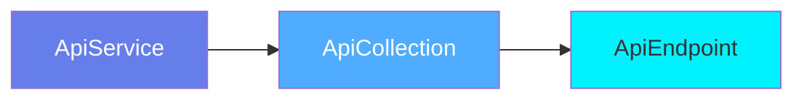

# API Service

**API Gateway and REST service platforms - managing API infrastructure**

---

## Overview

The **ApiService** entity represents API gateway platforms, service mesh configurations, and REST API hosting services. It is the top-level container for API collections and endpoints, capturing service configuration, authentication methods, and API infrastructure metadata.

**Hierarchy**:


---

## Relationships

ApiService has comprehensive relationships with entities across the metadata platform:

```mermaid
graph TD
    subgraph Service Layer
        A[ApiService<br/>kong_prod]
    end

    subgraph API Collections
        A --> B1[ApiCollection:<br/>Customer API v2]
        A --> B2[ApiCollection:<br/>Order Management API v1]
        A --> B3[ApiCollection:<br/>Payment API v3]

        B1 --> C1[ApiEndpoint:<br/>GET /customers/:id]
        B1 --> C2[ApiEndpoint:<br/>POST /customers]
        B1 --> C3[ApiEndpoint:<br/>PUT /customers/:id]

        B2 --> C4[ApiEndpoint:<br/>GET /orders]
        B2 --> C5[ApiEndpoint:<br/>POST /orders]
        B2 --> C6[ApiEndpoint:<br/>GET /orders/:id/status]

        B3 --> C7[ApiEndpoint:<br/>POST /payments/process]
        B3 --> C8[ApiEndpoint:<br/>GET /payments/:id]
    end

    subgraph Ownership
        A -.->|owned by| D1[Team:<br/>API Platform]
        A -.->|owned by| D2[User:<br/>api.admin]
    end

    subgraph Governance
        A -.->|in domain| E[Domain:<br/>API Gateway]
        A -.->|has tags| F1[Tag:<br/>Production]
        A -.->|has tags| F2[Tag:<br/>External]
        A -.->|has tags| F3[Tag:<br/>Tier.Gold]
    end

    subgraph Access Policies
        A -.->|governed by| G1[Policy:<br/>Rate Limiting]
        A -.->|governed by| G2[Policy:<br/>Authentication]
        A -.->|governed by| G3[Policy:<br/>API Key Validation]

        B3 -.->|requires| G4[Policy:<br/>PCI Compliance]
    end

    subgraph Backend Data Sources
        C1 -.->|reads from| H1[Table:<br/>customers]
        C2 -.->|writes to| H1
        C4 -.->|reads from| H2[Table:<br/>orders]
        C5 -.->|writes to| H2
        C7 -.->|writes to| H3[Table:<br/>payments]
    end

    subgraph Integration
        I1[Dashboard:<br/>API Metrics] -.->|monitors| A
        I2[Pipeline:<br/>api_log_processor] -.->|processes logs from| A
    end

    subgraph Authentication
        J1[OAuth2 Provider] -.->|authenticates| B1
        J2[API Key Manager] -.->|validates| B2
        J3[JWT Service] -.->|secures| B3
    end

    style A fill:#667eea,color:#fff,stroke:#4c51bf,stroke-width:3px
    style B1 fill:#4facfe,color:#fff
    style B2 fill:#4facfe,color:#fff
    style B3 fill:#4facfe,color:#fff
    style C1 fill:#00f2fe,color:#333
    style C2 fill:#00f2fe,color:#333
    style C3 fill:#00f2fe,color:#333
    style C4 fill:#00f2fe,color:#333
    style C5 fill:#00f2fe,color:#333
    style C6 fill:#00f2fe,color:#333
    style C7 fill:#00f2fe,color:#333
    style C8 fill:#00f2fe,color:#333
    style D1 fill:#43e97b,color:#fff
    style D2 fill:#43e97b,color:#fff
    style E fill:#fa709a,color:#fff
    style F1 fill:#f093fb,color:#fff
    style F2 fill:#f093fb,color:#fff
    style F3 fill:#f093fb,color:#fff
    style G1 fill:#ffd700,color:#333
    style G2 fill:#ffd700,color:#333
    style G3 fill:#ffd700,color:#333
    style G4 fill:#ffd700,color:#333
    style H1 fill:#764ba2,color:#fff
    style H2 fill:#764ba2,color:#fff
    style H3 fill:#764ba2,color:#fff
    style I1 fill:#00ac69,color:#fff
    style I2 fill:#00ac69,color:#fff
    style J1 fill:#ff6b6b,color:#fff
    style J2 fill:#ff6b6b,color:#fff
    style J3 fill:#ff6b6b,color:#fff
```



**Relationship Types**:

- **Solid lines (→)**: Hierarchical containment (Service hosts Collections, Collections contain Endpoints)
- **Dashed lines (-.->)**: References and associations (ownership, governance, policies, data sources, authentication)

---

### Parent Entities
- None (top-level service entity)

### Child Entities
- **ApiCollection**: API collections hosted by this service
- **ApiEndpoint**: Individual endpoints (via collections)

### Associated Entities
- **Owner**: User or team owning this service
- **Domain**: Business domain assignment
- **Tag**: Classification tags
- **Policy**: Access and security policies
- **Table**: Backend database tables accessed by APIs
- **Dashboard**: API monitoring and analytics dashboards
- **Pipeline**: Log processing and analytics pipelines

---

## Schema Specifications

View the complete ApiService schema in your preferred format:

=== "JSON Schema"

    **Complete JSON Schema Definition**

    ```json
    {
      "$id": "https://open-metadata.org/schema/entity/services/apiService.json",
      "$schema": "http://json-schema.org/draft-07/schema#",
      "title": "Api Service",
      "description": "This schema defines the API Service entity, to capture metadata from any REST API Services.",
      "type": "object",
      "javaType": "org.openmetadata.schema.entity.services.ApiService",
      "javaInterfaces": [
        "org.openmetadata.schema.EntityInterface",
        "org.openmetadata.schema.ServiceEntityInterface"
      ],

      "definitions": {
        "apiServiceType": {
          "description": "Type of api service such as REST, Webhook,...",
          "javaInterfaces": [
            "org.openmetadata.schema.EnumInterface"
          ],
          "type": "string",
          "enum": [
            "Rest",
            "WEBHOOK"
          ],
          "javaEnums": [
            {
              "name": "Rest"
            },
            {
              "name": "WEBHOOK"
            }
          ]
        },
        "apiConnection": {
          "type": "object",
          "javaType": "org.openmetadata.schema.type.ApiConnection",
          "description": "API Service Connection.",
          "javaInterfaces": [
            "org.openmetadata.schema.ServiceConnectionEntityInterface"
          ],
          "properties": {
            "config": {
              "mask": true,
              "oneOf": [
                {
                  "$ref": "./connections/api/restConnection.json"
                }
              ]
            }
          },
          "additionalProperties": false
        }
      },

      "properties": {
        "id": {
          "description": "Unique identifier of this API service instance.",
          "$ref": "../../type/basic.json#/definitions/uuid"
        },
        "name": {
          "description": "Name that identifies this API service.",
          "$ref": "../../type/basic.json#/definitions/entityName"
        },
        "fullyQualifiedName": {
          "description": "FullyQualifiedName same as `name`.",
          "$ref": "../../type/basic.json#/definitions/fullyQualifiedEntityName"
        },
        "displayName": {
          "description": "Display Name that identifies this API service.",
          "type": "string"
        },
        "serviceType": {
          "description": "Type of API service such as REST, WEBHOOK..",
          "$ref": "#/definitions/apiServiceType"
        },
        "description": {
          "description": "Description of a API service instance.",
          "$ref": "../../type/basic.json#/definitions/markdown"
        },
        "connection": {
          "$ref": "#/definitions/apiConnection"
        },
        "pipelines": {
          "description": "References to pipelines deployed for this API service to extract metadata, usage, lineage etc..",
          "$ref": "../../type/entityReferenceList.json"
        },
        "testConnectionResult": {
          "description": "Last test connection results for this service",
          "$ref": "connections/testConnectionResult.json"
        },
        "tags": {
          "description": "Tags for this API Service.",
          "type": "array",
          "items": {
            "$ref": "../../type/tagLabel.json"
          },
          "default": []
        },
        "followers": {
          "description": "Followers of this entity.",
          "$ref": "../../type/entityReferenceList.json"
        },
        "version": {
          "description": "Metadata version of the entity.",
          "$ref": "../../type/entityHistory.json#/definitions/entityVersion"
        },
        "updatedAt": {
          "description": "Last update time corresponding to the new version of the entity in Unix epoch time milliseconds.",
          "$ref": "../../type/basic.json#/definitions/timestamp"
        },
        "updatedBy": {
          "description": "User who made the update.",
          "type": "string"
        },
        "impersonatedBy": {
          "description": "Bot user that performed the action on behalf of the actual user.",
          "$ref": "../../type/basic.json#/definitions/impersonatedBy"
        },
        "href": {
          "description": "Link to the resource corresponding to this API service.",
          "$ref": "../../type/basic.json#/definitions/href"
        },
        "owners": {
          "description": "Owners of this API service.",
          "$ref": "../../type/entityReferenceList.json"
        },
        "changeDescription": {
          "description": "Change that lead to this version of the entity.",
          "$ref": "../../type/entityHistory.json#/definitions/changeDescription"
        },
        "incrementalChangeDescription": {
          "description": "Change that lead to this version of the entity.",
          "$ref": "../../type/entityHistory.json#/definitions/changeDescription"
        },
        "deleted": {
          "description": "When `true` indicates the entity has been soft deleted.",
          "type": "boolean",
          "default": false
        },
        "dataProducts": {
          "description": "List of data products this entity is part of.",
          "$ref": "../../type/entityReferenceList.json"
        },
        "domains": {
          "description": "Domains the API service belongs to.",
          "$ref": "../../type/entityReferenceList.json"
        },
        "ingestionRunner": {
          "description": "The ingestion agent responsible for executing the ingestion pipeline.",
          "$ref": "../../type/entityReference.json"
        }
      },

      "required": ["id", "name", "serviceType"],
      "additionalProperties": false
    }
    ```

    **[View Full JSON Schema →](https://github.com/open-metadata/OpenMetadataStandards/blob/main/schemas/entity/services/apiService.json)**

=== "RDF"

    **RDF/OWL Ontology Definition**

    ```turtle
    @prefix om: <https://open-metadata.org/schema/> .
    @prefix rdfs: <http://www.w3.org/2000/01/rdf-schema#> .
    @prefix owl: <http://www.w3.org/2002/07/owl#> .
    @prefix xsd: <http://www.w3.org/2001/XMLSchema#> .

    # ApiService Class Definition
    om:ApiService a owl:Class ;
        rdfs:subClassOf om:Service ;
        rdfs:label "Api Service" ;
        rdfs:comment "This schema defines the API Service entity, to capture metadata from any REST API Services." ;
        om:hierarchyLevel 1 .

    # Core Properties
    om:id a owl:DatatypeProperty ;
        rdfs:domain om:ApiService ;
        rdfs:range xsd:string ;
        rdfs:label "id" ;
        rdfs:comment "Unique identifier of this API service instance." .

    om:name a owl:DatatypeProperty ;
        rdfs:domain om:ApiService ;
        rdfs:range xsd:string ;
        rdfs:label "name" ;
        rdfs:comment "Name that identifies this API service." .

    om:fullyQualifiedName a owl:DatatypeProperty ;
        rdfs:domain om:ApiService ;
        rdfs:range xsd:string ;
        rdfs:label "fullyQualifiedName" ;
        rdfs:comment "FullyQualifiedName same as `name`." .

    om:displayName a owl:DatatypeProperty ;
        rdfs:domain om:ApiService ;
        rdfs:range xsd:string ;
        rdfs:label "displayName" ;
        rdfs:comment "Display Name that identifies this API service." .

    om:serviceType a owl:DatatypeProperty ;
        rdfs:domain om:ApiService ;
        rdfs:range om:ApiServiceType ;
        rdfs:label "serviceType" ;
        rdfs:comment "Type of API service such as REST, WEBHOOK." .

    om:description a owl:DatatypeProperty ;
        rdfs:domain om:ApiService ;
        rdfs:range xsd:string ;
        rdfs:label "description" ;
        rdfs:comment "Description of a API service instance." .

    om:connection a owl:ObjectProperty ;
        rdfs:domain om:ApiService ;
        rdfs:range om:ApiConnection ;
        rdfs:label "connection" ;
        rdfs:comment "API Service Connection." .

    om:pipelines a owl:ObjectProperty ;
        rdfs:domain om:ApiService ;
        rdfs:range om:EntityReferenceList ;
        rdfs:label "pipelines" ;
        rdfs:comment "References to pipelines deployed for this API service to extract metadata, usage, lineage etc.." .

    om:testConnectionResult a owl:ObjectProperty ;
        rdfs:domain om:ApiService ;
        rdfs:range om:TestConnectionResult ;
        rdfs:label "testConnectionResult" ;
        rdfs:comment "Last test connection results for this service" .

    om:tags a owl:ObjectProperty ;
        rdfs:domain om:ApiService ;
        rdfs:range om:TagLabel ;
        rdfs:label "tags" ;
        rdfs:comment "Tags for this API Service." .

    om:followers a owl:ObjectProperty ;
        rdfs:domain om:ApiService ;
        rdfs:range om:EntityReferenceList ;
        rdfs:label "followers" ;
        rdfs:comment "Followers of this entity." .

    om:owners a owl:ObjectProperty ;
        rdfs:domain om:ApiService ;
        rdfs:range om:EntityReferenceList ;
        rdfs:label "owners" ;
        rdfs:comment "Owners of this API service." .

    om:domains a owl:ObjectProperty ;
        rdfs:domain om:ApiService ;
        rdfs:range om:EntityReferenceList ;
        rdfs:label "domains" ;
        rdfs:comment "Domains the API service belongs to." .

    om:dataProducts a owl:ObjectProperty ;
        rdfs:domain om:ApiService ;
        rdfs:range om:EntityReferenceList ;
        rdfs:label "dataProducts" ;
        rdfs:comment "List of data products this entity is part of." .

    om:ingestionRunner a owl:ObjectProperty ;
        rdfs:domain om:ApiService ;
        rdfs:range om:EntityReference ;
        rdfs:label "ingestionRunner" ;
        rdfs:comment "The ingestion agent responsible for executing the ingestion pipeline." .

    # Versioning Properties
    om:version a owl:DatatypeProperty ;
        rdfs:domain om:ApiService ;
        rdfs:range xsd:decimal ;
        rdfs:label "version" ;
        rdfs:comment "Metadata version of the entity." .

    om:updatedAt a owl:DatatypeProperty ;
        rdfs:domain om:ApiService ;
        rdfs:range xsd:long ;
        rdfs:label "updatedAt" ;
        rdfs:comment "Last update time corresponding to the new version of the entity in Unix epoch time milliseconds." .

    om:updatedBy a owl:DatatypeProperty ;
        rdfs:domain om:ApiService ;
        rdfs:range xsd:string ;
        rdfs:label "updatedBy" ;
        rdfs:comment "User who made the update." .

    om:href a owl:DatatypeProperty ;
        rdfs:domain om:ApiService ;
        rdfs:range xsd:anyURI ;
        rdfs:label "href" ;
        rdfs:comment "Link to the resource corresponding to this API service." .

    om:deleted a owl:DatatypeProperty ;
        rdfs:domain om:ApiService ;
        rdfs:range xsd:boolean ;
        rdfs:label "deleted" ;
        rdfs:comment "When `true` indicates the entity has been soft deleted." .

    # Service Type Enumeration
    om:ApiServiceType a owl:Class ;
        owl:oneOf (
            om:Rest
            om:WEBHOOK
        ) .

    # Example Instance
    ex:productionAPIGateway a om:ApiService ;
        om:id "1a2b3c4d-5e6f-4a7b-8c9d-0e1f2a3b4c5d" ;
        om:name "production_api_gateway" ;
        om:fullyQualifiedName "production_api_gateway" ;
        om:displayName "Production API Gateway" ;
        om:serviceType om:Rest ;
        om:owners ex:platformTeam ;
        om:tags ex:tierProduction ;
        om:domains ex:infrastructureDomain .
    ```

    **[View Full RDF Ontology →](https://github.com/open-metadata/OpenMetadataStandards/blob/main/rdf/ontology/openmetadata.ttl)**

=== "JSON-LD"

    **JSON-LD Context and Example**

    ```json
    {
      "@context": {
        "@vocab": "https://open-metadata.org/schema/",
        "om": "https://open-metadata.org/schema/",
        "rdfs": "http://www.w3.org/2000/01/rdf-schema#",
        "xsd": "http://www.w3.org/2001/XMLSchema#",

        "ApiService": "om:ApiService",
        "id": {
          "@id": "om:id",
          "@type": "xsd:string"
        },
        "name": {
          "@id": "om:name",
          "@type": "xsd:string"
        },
        "fullyQualifiedName": {
          "@id": "om:fullyQualifiedName",
          "@type": "xsd:string"
        },
        "displayName": {
          "@id": "om:displayName",
          "@type": "xsd:string"
        },
        "description": {
          "@id": "om:description",
          "@type": "xsd:string"
        },
        "serviceType": {
          "@id": "om:serviceType",
          "@type": "@vocab"
        },
        "connection": {
          "@id": "om:connection",
          "@type": "@id"
        },
        "pipelines": {
          "@id": "om:pipelines",
          "@type": "@id"
        },
        "testConnectionResult": {
          "@id": "om:testConnectionResult",
          "@type": "@id"
        },
        "tags": {
          "@id": "om:tags",
          "@type": "@id",
          "@container": "@set"
        },
        "followers": {
          "@id": "om:followers",
          "@type": "@id"
        },
        "owners": {
          "@id": "om:owners",
          "@type": "@id",
          "@container": "@set"
        },
        "domains": {
          "@id": "om:domains",
          "@type": "@id",
          "@container": "@set"
        },
        "dataProducts": {
          "@id": "om:dataProducts",
          "@type": "@id",
          "@container": "@set"
        },
        "ingestionRunner": {
          "@id": "om:ingestionRunner",
          "@type": "@id"
        },
        "version": {
          "@id": "om:version",
          "@type": "xsd:decimal"
        },
        "updatedAt": {
          "@id": "om:updatedAt",
          "@type": "xsd:long"
        },
        "updatedBy": {
          "@id": "om:updatedBy",
          "@type": "xsd:string"
        },
        "href": {
          "@id": "om:href",
          "@type": "xsd:anyURI"
        },
        "deleted": {
          "@id": "om:deleted",
          "@type": "xsd:boolean"
        }
      }
    }
    ```

    **Example JSON-LD Instance**:

    ```json
    {
      "@context": "https://open-metadata.org/context/apiService.jsonld",
      "@type": "ApiService",
      "@id": "https://example.com/services/production_api_gateway",

      "id": "1a2b3c4d-5e6f-4a7b-8c9d-0e1f2a3b4c5d",
      "name": "production_api_gateway",
      "fullyQualifiedName": "production_api_gateway",
      "displayName": "Production API Gateway",
      "description": "REST API Service hosting production REST APIs",
      "serviceType": "Rest",

      "connection": {
        "config": {
          "type": "Rest",
          "openAPISchemaURL": "https://api.example.com/openapi.json"
        }
      },

      "owners": [
        {
          "@id": "https://example.com/teams/platform",
          "@type": "Team",
          "name": "platform",
          "displayName": "Platform Engineering Team"
        }
      ],

      "domains": [
        {
          "@id": "https://example.com/domains/infrastructure",
          "@type": "Domain",
          "name": "Infrastructure"
        }
      ],

      "tags": [
        {
          "@id": "https://open-metadata.org/tags/Tier/Production",
          "tagFQN": "Tier.Production"
        },
        {
          "@id": "https://open-metadata.org/tags/Environment/Production",
          "tagFQN": "Environment.Production"
        }
      ],

      "version": 1.5,
      "updatedAt": 1704240000000,
      "updatedBy": "admin",
      "href": "https://example.com/api/v1/services/apiServices/1a2b3c4d-5e6f-4a7b-8c9d-0e1f2a3b4c5d",
      "deleted": false
    }
    ```

    **[View Full JSON-LD Context →](https://github.com/open-metadata/OpenMetadataStandards/blob/main/rdf/contexts/apiService.jsonld)**

---

## Use Cases

- Catalog API gateways (Kong, Apigee, AWS API Gateway, Azure API Management)
- Document API infrastructure and service mesh configurations
- Track API service ownership and platform teams
- Apply governance tags (Environment, SLA, Security level)
- Monitor API gateway health and performance
- Manage API authentication and authorization policies
- Track API collections and endpoint organization
- Document service-level agreements and rate limits

---

## JSON Schema Specification

### Core Properties

#### `id` (uuid)
**Type**: `string` (UUID format)
**Required**: Yes (system-generated)
**Description**: Unique identifier for this API service instance

```json
{
  "id": "1a2b3c4d-5e6f-4a7b-8c9d-0e1f2a3b4c5d"
}
```

---

#### `name` (entityName)
**Type**: `string`
**Required**: Yes
**Pattern**: `^[^.]*$` (no dots allowed)
**Min Length**: 1
**Max Length**: 256
**Description**: Name of the API service (unqualified)

```json
{
  "name": "production_api_gateway"
}
```

---

#### `fullyQualifiedName` (fullyQualifiedEntityName)
**Type**: `string`
**Required**: Yes (system-generated)
**Pattern**: `^((?!::).)*$`
**Description**: Fully qualified name (same as name for services)

```json
{
  "fullyQualifiedName": "production_api_gateway"
}
```

---

#### `displayName`
**Type**: `string`
**Required**: No
**Description**: Human-readable display name

```json
{
  "displayName": "Production API Gateway"
}
```

---

#### `description` (markdown)
**Type**: `string` (Markdown format)
**Required**: No
**Description**: Rich text description of the API service's purpose

```json
{
  "description": "# Production API Gateway\n\nKong-based API gateway hosting all production REST APIs.\n\n## Key Features\n- OAuth2 authentication\n- Rate limiting: 1000 req/min\n- SSL/TLS encryption\n- Request/response logging"
}
```

---

### Service Properties

#### `serviceType` (ApiServiceType enum)
**Type**: `string` enum
**Required**: Yes
**Allowed Values**:

- `Rest` - RESTful API service
- `WEBHOOK` - Webhook service

```json
{
  "serviceType": "Rest"
}
```

---

#### `connection` (ApiConnection)
**Type**: `object`
**Required**: No
**Description**: API Service Connection configuration

**ApiConnection Properties**:

| Property | Type | Required | Description |
|----------|------|----------|-------------|
| `config` | object | No | Connection config referencing restConnection.json |

**Example**:

```json
{
  "connection": {
    "config": {
      "type": "Rest",
      "openAPISchemaURL": "https://api.example.com/openapi.json"
    }
  }
}
```

---

#### `pipelines` (EntityReferenceList)
**Type**: `object` (EntityReferenceList)
**Required**: No
**Description**: References to pipelines deployed for this API service to extract metadata, usage, lineage etc.

```json
{
  "pipelines": {
    "entities": [
      {
        "id": "pipeline-uuid-1",
        "type": "pipeline",
        "name": "api_metadata_ingestion"
      }
    ]
  }
}
```

---

#### `testConnectionResult` (TestConnectionResult)
**Type**: `object`
**Required**: No
**Description**: Last test connection results for this service

```json
{
  "testConnectionResult": {
    "status": "successful",
    "timestamp": 1704240000000
  }
}
```

---

#### `followers` (EntityReferenceList)
**Type**: `object` (EntityReferenceList)
**Required**: No
**Description**: Followers of this entity

```json
{
  "followers": {
    "entities": [
      {
        "id": "user-uuid-1",
        "type": "user",
        "name": "john.doe"
      }
    ]
  }
}
```

---

### Governance Properties

#### `owners` (EntityReferenceList)
**Type**: `object` (EntityReferenceList)
**Required**: No
**Description**: Owners of this API service

```json
{
  "owners": {
    "entities": [
      {
        "id": "team-uuid",
        "type": "team",
        "name": "platform",
        "displayName": "Platform Engineering Team"
      }
    ]
  }
}
```

---

#### `domains` (EntityReferenceList)
**Type**: `object` (EntityReferenceList)
**Required**: No
**Description**: Domains the API service belongs to

```json
{
  "domains": {
    "entities": [
      {
        "id": "domain-uuid",
        "type": "domain",
        "name": "Infrastructure",
        "fullyQualifiedName": "Infrastructure"
      }
    ]
  }
}
```

---

#### `dataProducts` (EntityReferenceList)
**Type**: `object` (EntityReferenceList)
**Required**: No
**Description**: List of data products this entity is part of

```json
{
  "dataProducts": {
    "entities": [
      {
        "id": "product-uuid",
        "type": "dataProduct",
        "name": "api_platform_product",
        "fullyQualifiedName": "api_platform_product"
      }
    ]
  }
}
```

---

#### `tags[]` (TagLabel[])
**Type**: `array`
**Required**: No
**Description**: Classification tags applied to the service

```json
{
  "tags": [
    {
      "tagFQN": "Tier.Production",
      "description": "Production environment",
      "source": "Classification",
      "labelType": "Manual",
      "state": "Confirmed"
    },
    {
      "tagFQN": "Environment.Production",
      "source": "Classification",
      "labelType": "Manual",
      "state": "Confirmed"
    }
  ]
}
```

---

### Versioning Properties

#### `version` (entityVersion)
**Type**: `number`
**Required**: Yes (system-managed)
**Description**: Metadata version number, incremented on changes

```json
{
  "version": 1.5
}
```

---

#### `updatedAt` (timestamp)
**Type**: `integer` (Unix epoch milliseconds)
**Required**: Yes (system-managed)
**Description**: Last update timestamp

```json
{
  "updatedAt": 1704240000000
}
```

---

#### `updatedBy` (string)
**Type**: `string`
**Required**: No (system-managed)
**Description**: User who made the update

```json
{
  "updatedBy": "admin"
}
```

---

#### `impersonatedBy` (string)
**Type**: `string`
**Required**: No
**Description**: Bot user that performed the action on behalf of the actual user

```json
{
  "impersonatedBy": "bot_user"
}
```

---

#### `href` (URI)
**Type**: `string` (URI format)
**Required**: No (system-generated)
**Description**: Link to the resource corresponding to this API service

```json
{
  "href": "https://example.com/api/v1/services/apiServices/1a2b3c4d-5e6f-4a7b-8c9d-0e1f2a3b4c5d"
}
```

---

#### `changeDescription` (ChangeDescription)
**Type**: `object`
**Required**: No (system-managed)
**Description**: Change that lead to this version of the entity

```json
{
  "changeDescription": {
    "fieldsAdded": [],
    "fieldsUpdated": [
      {
        "name": "description",
        "oldValue": "Old description",
        "newValue": "Updated description"
      }
    ],
    "fieldsDeleted": []
  }
}
```

---

#### `incrementalChangeDescription` (ChangeDescription)
**Type**: `object`
**Required**: No (system-managed)
**Description**: Change that lead to this version of the entity

```json
{
  "incrementalChangeDescription": {
    "fieldsAdded": [],
    "fieldsUpdated": [],
    "fieldsDeleted": []
  }
}
```

---

#### `deleted` (boolean)
**Type**: `boolean`
**Required**: No (default: false)
**Description**: When `true` indicates the entity has been soft deleted

```json
{
  "deleted": false
}
```

---

#### `ingestionRunner` (EntityReference)
**Type**: `object` (EntityReference)
**Required**: No
**Description**: The ingestion agent responsible for executing the ingestion pipeline

```json
{
  "ingestionRunner": {
    "id": "runner-uuid",
    "type": "ingestionPipeline",
    "name": "default_runner"
  }
}
```

---

## Complete Example

```json
{
  "id": "1a2b3c4d-5e6f-4a7b-8c9d-0e1f2a3b4c5d",
  "name": "production_api_gateway",
  "fullyQualifiedName": "production_api_gateway",
  "displayName": "Production API Gateway",
  "description": "# Production API Gateway\n\nREST API Service hosting all production REST APIs.",
  "serviceType": "Rest",
  "connection": {
    "config": {
      "type": "Rest",
      "openAPISchemaURL": "https://api.example.com/openapi.json"
    }
  },
  "pipelines": {
    "entities": [
      {
        "id": "pipeline-uuid",
        "type": "pipeline",
        "name": "api_metadata_ingestion"
      }
    ]
  },
  "testConnectionResult": {
    "status": "successful",
    "timestamp": 1704240000000
  },
  "tags": [
    {
      "tagFQN": "Tier.Production"
    },
    {
      "tagFQN": "Environment.Production"
    }
  ],
  "followers": {
    "entities": []
  },
  "owners": {
    "entities": [
      {
        "id": "team-uuid",
        "type": "team",
        "name": "platform",
        "displayName": "Platform Engineering Team"
      }
    ]
  },
  "domains": {
    "entities": [
      {
        "id": "domain-uuid",
        "type": "domain",
        "name": "Infrastructure"
      }
    ]
  },
  "dataProducts": {
    "entities": []
  },
  "version": 1.5,
  "updatedAt": 1704240000000,
  "updatedBy": "admin",
  "href": "https://example.com/api/v1/services/apiServices/1a2b3c4d-5e6f-4a7b-8c9d-0e1f2a3b4c5d",
  "deleted": false
}
```

---

## RDF Representation

### Ontology Class

```turtle
@prefix om: <https://open-metadata.org/schema/> .
@prefix rdfs: <http://www.w3.org/2000/01/rdf-schema#> .
@prefix owl: <http://www.w3.org/2002/07/owl#> .

om:ApiService a owl:Class ;
    rdfs:subClassOf om:Service ;
    rdfs:label "Api Service" ;
    rdfs:comment "This schema defines the API Service entity, to capture metadata from any REST API Services." ;
    om:hasProperties [
        om:name "string" ;
        om:serviceType "ApiServiceType" ;
        om:connection "ApiConnection" ;
        om:pipelines "EntityReferenceList" ;
        om:owners "EntityReferenceList" ;
        om:domains "EntityReferenceList" ;
        om:tags "TagLabel[]" ;
    ] .
```

### Instance Example

```turtle
@prefix om: <https://open-metadata.org/schema/> .
@prefix ex: <https://example.com/> .

ex:production_api_gateway a om:ApiService ;
    om:id "1a2b3c4d-5e6f-4a7b-8c9d-0e1f2a3b4c5d" ;
    om:name "production_api_gateway" ;
    om:fullyQualifiedName "production_api_gateway" ;
    om:displayName "Production API Gateway" ;
    om:serviceType om:Rest ;
    om:owners ex:platformTeam ;
    om:domains ex:infrastructureDomain ;
    om:tags ex:tierProduction .
```

---

## JSON-LD Context

```json
{
  "@context": {
    "@vocab": "https://open-metadata.org/schema/",
    "om": "https://open-metadata.org/schema/",
    "ApiService": "om:ApiService",
    "id": "om:id",
    "name": "om:name",
    "serviceType": "om:serviceType",
    "connection": {
      "@id": "om:connection",
      "@type": "@id"
    },
    "pipelines": {
      "@id": "om:pipelines",
      "@type": "@id"
    },
    "owners": {
      "@id": "om:owners",
      "@type": "@id",
      "@container": "@set"
    },
    "domains": {
      "@id": "om:domains",
      "@type": "@id",
      "@container": "@set"
    },
    "tags": {
      "@id": "om:tags",
      "@type": "@id",
      "@container": "@set"
    }
  }
}
```

### JSON-LD Example

```json
{
  "@context": "https://open-metadata.org/context/apiService.jsonld",
  "@type": "ApiService",
  "@id": "https://example.com/services/production_api_gateway",
  "id": "1a2b3c4d-5e6f-4a7b-8c9d-0e1f2a3b4c5d",
  "name": "production_api_gateway",
  "serviceType": "Rest",
  "connection": {
    "config": {
      "type": "Rest",
      "openAPISchemaURL": "https://api.example.com/openapi.json"
    }
  },
  "owners": [
    {
      "@id": "https://example.com/teams/platform",
      "@type": "Team"
    }
  ],
  "domains": [
    {
      "@id": "https://example.com/domains/infrastructure",
      "@type": "Domain"
    }
  ]
}
```

---

## Custom Properties

This entity supports custom properties through the `extension` field.
Common custom properties include:

- **Data Classification**: Sensitivity level
- **Cost Center**: Billing allocation
- **Retention Period**: Data retention requirements
- **Application Owner**: Owning application/team

See [Custom Properties](../../metadata-specifications/custom-properties.md)
for details on defining and using custom properties.

---

## API Operations

### Create API Service

```http
POST /api/v1/services/apiServices
Content-Type: application/json

{
  "name": "production_api_gateway",
  "serviceType": "Kong",
  "connection": {
    "endpointURL": "https://api.example.com",
    "authenticationType": "OAuth2"
  }
}
```

### Get API Service

```http
GET /api/v1/services/apiServices/name/production_api_gateway?fields=apiCollections,owner,tags
```

### Update API Service

```http
PATCH /api/v1/services/apiServices/{id}
Content-Type: application/json-patch+json

[
  {
    "op": "add",
    "path": "/tags/-",
    "value": {"tagFQN": "Tier.Production"}
  }
]
```

### Delete API Service

```http
DELETE /api/v1/services/apiServices/{id}?hardDelete=true&recursive=true
```

---

## Related Documentation

- **[API Collection](api-collection.md)** - API collection specification
- **[API Endpoint](api-endpoint.md)** - Individual endpoint specification
- **[Service Configuration](../../services/overview.md)** - General service setup
- **[Authentication](../../security/authentication.md)** - API authentication methods
