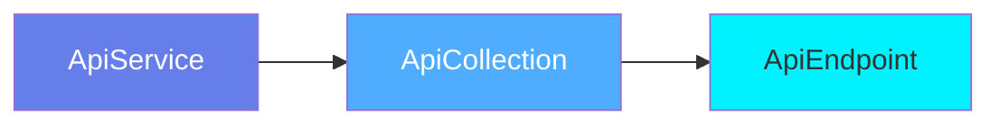

# API Service

**API Gateway and REST service platforms - managing API infrastructure**

---

## Overview

The **ApiService** entity represents API gateway platforms, service mesh configurations, and REST API hosting services. It is the top-level container for API collections and endpoints, capturing service configuration, authentication methods, and API infrastructure metadata.

**Hierarchy**:


---

## Relationships

ApiService has comprehensive relationships with entities across the metadata platform:

```mermaid
graph TD
    subgraph Service Layer
        A[ApiService<br/>kong_prod]
    end

    subgraph API Collections
        A --> B1[ApiCollection:<br/>Customer API v2]
        A --> B2[ApiCollection:<br/>Order Management API v1]
        A --> B3[ApiCollection:<br/>Payment API v3]

        B1 --> C1[ApiEndpoint:<br/>GET /customers/:id]
        B1 --> C2[ApiEndpoint:<br/>POST /customers]
        B1 --> C3[ApiEndpoint:<br/>PUT /customers/:id]

        B2 --> C4[ApiEndpoint:<br/>GET /orders]
        B2 --> C5[ApiEndpoint:<br/>POST /orders]
        B2 --> C6[ApiEndpoint:<br/>GET /orders/:id/status]

        B3 --> C7[ApiEndpoint:<br/>POST /payments/process]
        B3 --> C8[ApiEndpoint:<br/>GET /payments/:id]
    end

    subgraph Ownership
        A -.->|owned by| D1[Team:<br/>API Platform]
        A -.->|owned by| D2[User:<br/>api.admin]
    end

    subgraph Governance
        A -.->|in domain| E[Domain:<br/>API Gateway]
        A -.->|has tags| F1[Tag:<br/>Production]
        A -.->|has tags| F2[Tag:<br/>External]
        A -.->|has tags| F3[Tag:<br/>Tier.Gold]
    end

    subgraph Access Policies
        A -.->|governed by| G1[Policy:<br/>Rate Limiting]
        A -.->|governed by| G2[Policy:<br/>Authentication]
        A -.->|governed by| G3[Policy:<br/>API Key Validation]

        B3 -.->|requires| G4[Policy:<br/>PCI Compliance]
    end

    subgraph Backend Data Sources
        C1 -.->|reads from| H1[Table:<br/>customers]
        C2 -.->|writes to| H1
        C4 -.->|reads from| H2[Table:<br/>orders]
        C5 -.->|writes to| H2
        C7 -.->|writes to| H3[Table:<br/>payments]
    end

    subgraph Integration
        I1[Dashboard:<br/>API Metrics] -.->|monitors| A
        I2[Pipeline:<br/>api_log_processor] -.->|processes logs from| A
    end

    subgraph Authentication
        J1[OAuth2 Provider] -.->|authenticates| B1
        J2[API Key Manager] -.->|validates| B2
        J3[JWT Service] -.->|secures| B3
    end

    style A fill:#667eea,color:#fff,stroke:#4c51bf,stroke-width:3px
    style B1 fill:#4facfe,color:#fff
    style B2 fill:#4facfe,color:#fff
    style B3 fill:#4facfe,color:#fff
    style C1 fill:#00f2fe,color:#333
    style C2 fill:#00f2fe,color:#333
    style C3 fill:#00f2fe,color:#333
    style C4 fill:#00f2fe,color:#333
    style C5 fill:#00f2fe,color:#333
    style C6 fill:#00f2fe,color:#333
    style C7 fill:#00f2fe,color:#333
    style C8 fill:#00f2fe,color:#333
    style D1 fill:#43e97b,color:#fff
    style D2 fill:#43e97b,color:#fff
    style E fill:#fa709a,color:#fff
    style F1 fill:#f093fb,color:#fff
    style F2 fill:#f093fb,color:#fff
    style F3 fill:#f093fb,color:#fff
    style G1 fill:#ffd700,color:#333
    style G2 fill:#ffd700,color:#333
    style G3 fill:#ffd700,color:#333
    style G4 fill:#ffd700,color:#333
    style H1 fill:#764ba2,color:#fff
    style H2 fill:#764ba2,color:#fff
    style H3 fill:#764ba2,color:#fff
    style I1 fill:#00ac69,color:#fff
    style I2 fill:#00ac69,color:#fff
    style J1 fill:#ff6b6b,color:#fff
    style J2 fill:#ff6b6b,color:#fff
    style J3 fill:#ff6b6b,color:#fff
```



**Relationship Types**:

- **Solid lines (→)**: Hierarchical containment (Service hosts Collections, Collections contain Endpoints)
- **Dashed lines (-.->)**: References and associations (ownership, governance, policies, data sources, authentication)

---

### Parent Entities
- None (top-level service entity)

### Child Entities
- **ApiCollection**: API collections hosted by this service
- **ApiEndpoint**: Individual endpoints (via collections)

### Associated Entities
- **Owner**: User or team owning this service
- **Domain**: Business domain assignment
- **Tag**: Classification tags
- **Policy**: Access and security policies
- **Table**: Backend database tables accessed by APIs
- **Dashboard**: API monitoring and analytics dashboards
- **Pipeline**: Log processing and analytics pipelines

---

## Schema Specifications

View the complete ApiService schema in your preferred format:

=== "JSON Schema"

    **Complete JSON Schema Definition**

    ```json
    {
      "$id": "https://open-metadata.org/schema/entity/services/apiService.json",
      "$schema": "http://json-schema.org/draft-07/schema#",
      "title": "ApiService",
      "description": "An `ApiService` represents an API gateway, service mesh, or REST API platform hosting API collections and endpoints.",
      "type": "object",
      "javaType": "org.openmetadata.schema.entity.services.ApiService",

      "definitions": {
        "apiServiceType": {
          "description": "Type of API service platform",
          "type": "string",
          "enum": [
            "REST", "GraphQL", "gRPC", "SOAP",
            "Kong", "Apigee", "AWS_API_Gateway",
            "Azure_API_Management", "Mulesoft", "Custom"
          ]
        },
        "connectionConfig": {
          "type": "object",
          "properties": {
            "endpointURL": {
              "type": "string",
              "format": "uri"
            },
            "authenticationType": {
              "type": "string",
              "enum": ["None", "Basic", "Bearer", "OAuth2", "APIKey", "JWT"]
            },
            "authenticationConfig": {
              "type": "object"
            }
          }
        }
      },

      "properties": {
        "id": {
          "description": "Unique identifier",
          "$ref": "../../type/basic.json#/definitions/uuid"
        },
        "name": {
          "description": "Service name",
          "$ref": "../../type/basic.json#/definitions/entityName"
        },
        "fullyQualifiedName": {
          "description": "Fully qualified name: service_name",
          "$ref": "../../type/basic.json#/definitions/fullyQualifiedEntityName"
        },
        "displayName": {
          "description": "Display name",
          "type": "string"
        },
        "description": {
          "description": "Markdown description",
          "$ref": "../../type/basic.json#/definitions/markdown"
        },
        "serviceType": {
          "$ref": "#/definitions/apiServiceType"
        },
        "connection": {
          "description": "Connection configuration",
          "$ref": "#/definitions/connectionConfig"
        },
        "apiCollections": {
          "description": "API collections in this service",
          "type": "array",
          "items": {
            "$ref": "../../type/entityReference.json"
          }
        },
        "owner": {
          "description": "Owner (user or team)",
          "$ref": "../../type/entityReference.json"
        },
        "domain": {
          "description": "Data domain",
          "$ref": "../../type/entityReference.json"
        },
        "tags": {
          "description": "Classification tags",
          "type": "array",
          "items": {
            "$ref": "../../type/tagLabel.json"
          }
        },
        "version": {
          "description": "Metadata version",
          "$ref": "../../type/entityHistory.json#/definitions/entityVersion"
        }
      },

      "required": ["id", "name", "serviceType"]
    }
    ```

    **[View Full JSON Schema →](https://github.com/open-metadata/OpenMetadataStandards/blob/main/schemas/entity/services/apiService.json)**

=== "RDF"

    **RDF/OWL Ontology Definition**

    ```turtle
    @prefix om: <https://open-metadata.org/schema/> .
    @prefix rdfs: <http://www.w3.org/2000/01/rdf-schema#> .
    @prefix owl: <http://www.w3.org/2001/XMLSchema#> .
    @prefix xsd: <http://www.w3.org/2001/XMLSchema#> .

    # ApiService Class Definition
    om:ApiService a owl:Class ;
        rdfs:subClassOf om:Service ;
        rdfs:label "ApiService" ;
        rdfs:comment "An API gateway or platform hosting REST APIs, GraphQL endpoints, or gRPC services" ;
        om:hierarchyLevel 1 .

    # Properties
    om:serviceName a owl:DatatypeProperty ;
        rdfs:domain om:ApiService ;
        rdfs:range xsd:string ;
        rdfs:label "name" ;
        rdfs:comment "Name of the API service" .

    om:serviceType a owl:DatatypeProperty ;
        rdfs:domain om:ApiService ;
        rdfs:range om:ApiServiceType ;
        rdfs:label "serviceType" ;
        rdfs:comment "Type of API platform: REST, GraphQL, gRPC, Kong, Apigee, etc." .

    om:endpointURL a owl:DatatypeProperty ;
        rdfs:domain om:ApiService ;
        rdfs:range xsd:anyURI ;
        rdfs:label "endpointURL" ;
        rdfs:comment "Base URL for the API service" .

    om:hasApiCollection a owl:ObjectProperty ;
        rdfs:domain om:ApiService ;
        rdfs:range om:ApiCollection ;
        rdfs:label "hasApiCollection" ;
        rdfs:comment "API collections hosted by this service" .

    om:ownedBy a owl:ObjectProperty ;
        rdfs:domain om:ApiService ;
        rdfs:range om:Owner ;
        rdfs:label "ownedBy" ;
        rdfs:comment "User or team that owns this service" .

    om:hasTag a owl:ObjectProperty ;
        rdfs:domain om:ApiService ;
        rdfs:range om:Tag ;
        rdfs:label "hasTag" ;
        rdfs:comment "Classification tags applied to service" .

    # Service Type Enumeration
    om:ApiServiceType a owl:Class ;
        owl:oneOf (
            om:RESTService
            om:GraphQLService
            om:gRPCService
            om:KongService
            om:ApigeeService
            om:AWSAPIGateway
        ) .

    # Example Instance
    ex:productionAPIGateway a om:ApiService ;
        om:serviceName "production_api_gateway" ;
        om:displayName "Production API Gateway" ;
        om:serviceType om:KongService ;
        om:endpointURL "https://api.example.com" ;
        om:ownedBy ex:platformTeam ;
        om:hasTag ex:tierProduction ;
        om:hasApiCollection ex:paymentsAPI ;
        om:hasApiCollection ex:userManagementAPI .
    ```

    **[View Full RDF Ontology →](https://github.com/open-metadata/OpenMetadataStandards/blob/main/rdf/ontology/openmetadata.ttl)**

=== "JSON-LD"

    **JSON-LD Context and Example**

    ```json
    {
      "@context": {
        "@vocab": "https://open-metadata.org/schema/",
        "om": "https://open-metadata.org/schema/",
        "rdfs": "http://www.w3.org/2000/01/rdf-schema#",
        "xsd": "http://www.w3.org/2001/XMLSchema#",

        "ApiService": "om:ApiService",
        "name": {
          "@id": "om:serviceName",
          "@type": "xsd:string"
        },
        "fullyQualifiedName": {
          "@id": "om:fullyQualifiedName",
          "@type": "xsd:string"
        },
        "displayName": {
          "@id": "om:displayName",
          "@type": "xsd:string"
        },
        "description": {
          "@id": "om:description",
          "@type": "xsd:string"
        },
        "serviceType": {
          "@id": "om:serviceType",
          "@type": "@vocab"
        },
        "connection": {
          "@id": "om:hasConnection",
          "@type": "@id"
        },
        "apiCollections": {
          "@id": "om:hasApiCollection",
          "@type": "@id",
          "@container": "@set"
        },
        "owner": {
          "@id": "om:ownedBy",
          "@type": "@id"
        },
        "domain": {
          "@id": "om:inDomain",
          "@type": "@id"
        },
        "tags": {
          "@id": "om:hasTag",
          "@type": "@id",
          "@container": "@set"
        }
      }
    }
    ```

    **Example JSON-LD Instance**:

    ```json
    {
      "@context": "https://open-metadata.org/context/apiService.jsonld",
      "@type": "ApiService",
      "@id": "https://example.com/services/production_api_gateway",

      "name": "production_api_gateway",
      "fullyQualifiedName": "production_api_gateway",
      "displayName": "Production API Gateway",
      "description": "Kong API Gateway hosting production REST APIs",
      "serviceType": "Kong",

      "connection": {
        "endpointURL": "https://api.example.com",
        "authenticationType": "OAuth2",
        "authenticationConfig": {
          "tokenURL": "https://auth.example.com/token",
          "scopes": ["api.read", "api.write"]
        }
      },

      "owner": {
        "@id": "https://example.com/teams/platform",
        "@type": "Team",
        "name": "platform",
        "displayName": "Platform Engineering Team"
      },

      "tags": [
        {
          "@id": "https://open-metadata.org/tags/Tier/Production",
          "tagFQN": "Tier.Production"
        },
        {
          "@id": "https://open-metadata.org/tags/Environment/Production",
          "tagFQN": "Environment.Production"
        }
      ],

      "apiCollections": [
        {
          "@id": "https://example.com/api/collections/payments",
          "@type": "ApiCollection",
          "name": "payments_api",
          "displayName": "Payments API"
        },
        {
          "@id": "https://example.com/api/collections/users",
          "@type": "ApiCollection",
          "name": "user_management_api",
          "displayName": "User Management API"
        }
      ]
    }
    ```

    **[View Full JSON-LD Context →](https://github.com/open-metadata/OpenMetadataStandards/blob/main/rdf/contexts/apiService.jsonld)**

---

## Use Cases

- Catalog API gateways (Kong, Apigee, AWS API Gateway, Azure API Management)
- Document API infrastructure and service mesh configurations
- Track API service ownership and platform teams
- Apply governance tags (Environment, SLA, Security level)
- Monitor API gateway health and performance
- Manage API authentication and authorization policies
- Track API collections and endpoint organization
- Document service-level agreements and rate limits

---

## JSON Schema Specification

### Core Properties

#### `id` (uuid)
**Type**: `string` (UUID format)
**Required**: Yes (system-generated)
**Description**: Unique identifier for this API service instance

```json
{
  "id": "1a2b3c4d-5e6f-4a7b-8c9d-0e1f2a3b4c5d"
}
```

---

#### `name` (entityName)
**Type**: `string`
**Required**: Yes
**Pattern**: `^[^.]*$` (no dots allowed)
**Min Length**: 1
**Max Length**: 256
**Description**: Name of the API service (unqualified)

```json
{
  "name": "production_api_gateway"
}
```

---

#### `fullyQualifiedName` (fullyQualifiedEntityName)
**Type**: `string`
**Required**: Yes (system-generated)
**Pattern**: `^((?!::).)*$`
**Description**: Fully qualified name (same as name for services)

```json
{
  "fullyQualifiedName": "production_api_gateway"
}
```

---

#### `displayName`
**Type**: `string`
**Required**: No
**Description**: Human-readable display name

```json
{
  "displayName": "Production API Gateway"
}
```

---

#### `description` (markdown)
**Type**: `string` (Markdown format)
**Required**: No
**Description**: Rich text description of the API service's purpose

```json
{
  "description": "# Production API Gateway\n\nKong-based API gateway hosting all production REST APIs.\n\n## Key Features\n- OAuth2 authentication\n- Rate limiting: 1000 req/min\n- SSL/TLS encryption\n- Request/response logging"
}
```

---

### Service Properties

#### `serviceType` (ApiServiceType enum)
**Type**: `string` enum
**Required**: Yes
**Allowed Values**:

- `REST` - RESTful API service
- `GraphQL` - GraphQL API service
- `gRPC` - gRPC service
- `SOAP` - SOAP web service
- `Kong` - Kong API Gateway
- `Apigee` - Google Apigee
- `AWS_API_Gateway` - AWS API Gateway
- `Azure_API_Management` - Azure API Management
- `Mulesoft` - Mulesoft Anypoint
- `Custom` - Custom API platform

```json
{
  "serviceType": "Kong"
}
```

---

#### `connection` (ConnectionConfig)
**Type**: `object`
**Required**: Yes
**Description**: API service connection configuration

**ConnectionConfig Properties**:

| Property | Type | Required | Description |
|----------|------|----------|-------------|
| `endpointURL` | string (URI) | Yes | Base URL for the API service |
| `authenticationType` | AuthType enum | No | Authentication method |
| `authenticationConfig` | object | No | Auth-specific configuration |
| `headers` | object | No | Default headers |
| `timeout` | integer | No | Request timeout (seconds) |
| `verifySsl` | boolean | No | Verify SSL certificates |

**Example**:

```json
{
  "connection": {
    "endpointURL": "https://api.example.com",
    "authenticationType": "OAuth2",
    "authenticationConfig": {
      "tokenURL": "https://auth.example.com/token",
      "clientId": "${OAUTH_CLIENT_ID}",
      "clientSecret": "${OAUTH_CLIENT_SECRET}",
      "scopes": ["api.read", "api.write"]
    },
    "headers": {
      "X-API-Version": "v1",
      "Accept": "application/json"
    },
    "timeout": 30,
    "verifySsl": true
  }
}
```

---

#### `apiCollections[]` (EntityReference[])
**Type**: `array`
**Required**: No
**Description**: API collections hosted by this service

```json
{
  "apiCollections": [
    {
      "id": "col-uuid-1",
      "type": "apiCollection",
      "name": "payments_api",
      "fullyQualifiedName": "production_api_gateway.payments_api"
    },
    {
      "id": "col-uuid-2",
      "type": "apiCollection",
      "name": "user_management_api",
      "fullyQualifiedName": "production_api_gateway.user_management_api"
    }
  ]
}
```

---

### Governance Properties

#### `owner` (EntityReference)
**Type**: `object`
**Required**: No
**Description**: User or team that owns this API service

```json
{
  "owner": {
    "id": "team-uuid",
    "type": "team",
    "name": "platform",
    "displayName": "Platform Engineering Team"
  }
}
```

---

#### `domain` (EntityReference)
**Type**: `object`
**Required**: No
**Description**: Data domain this service belongs to

```json
{
  "domain": {
    "id": "domain-uuid",
    "type": "domain",
    "name": "Infrastructure",
    "fullyQualifiedName": "Infrastructure"
  }
}
```

---

#### `tags[]` (TagLabel[])
**Type**: `array`
**Required**: No
**Description**: Classification tags applied to the service

```json
{
  "tags": [
    {
      "tagFQN": "Tier.Production",
      "description": "Production environment",
      "source": "Classification",
      "labelType": "Manual",
      "state": "Confirmed"
    },
    {
      "tagFQN": "Environment.Production",
      "source": "Classification",
      "labelType": "Manual",
      "state": "Confirmed"
    }
  ]
}
```

---

### Versioning Properties

#### `version` (entityVersion)
**Type**: `number`
**Required**: Yes (system-managed)
**Description**: Metadata version number, incremented on changes

```json
{
  "version": 1.5
}
```

---

#### `updatedAt` (timestamp)
**Type**: `integer` (Unix epoch milliseconds)
**Required**: Yes (system-managed)
**Description**: Last update timestamp

```json
{
  "updatedAt": 1704240000000
}
```

---

#### `updatedBy` (string)
**Type**: `string`
**Required**: Yes (system-managed)
**Description**: User who made the update

```json
{
  "updatedBy": "admin"
}
```

---

## Complete Example

```json
{
  "id": "1a2b3c4d-5e6f-4a7b-8c9d-0e1f2a3b4c5d",
  "name": "production_api_gateway",
  "fullyQualifiedName": "production_api_gateway",
  "displayName": "Production API Gateway",
  "description": "# Production API Gateway\n\nKong-based API gateway hosting all production REST APIs.",
  "serviceType": "Kong",
  "connection": {
    "endpointURL": "https://api.example.com",
    "authenticationType": "OAuth2",
    "authenticationConfig": {
      "tokenURL": "https://auth.example.com/token",
      "clientId": "${OAUTH_CLIENT_ID}",
      "clientSecret": "${OAUTH_CLIENT_SECRET}",
      "scopes": ["api.read", "api.write"]
    },
    "headers": {
      "X-API-Version": "v1",
      "Accept": "application/json"
    },
    "timeout": 30,
    "verifySsl": true
  },
  "apiCollections": [
    {
      "id": "col-uuid-1",
      "type": "apiCollection",
      "name": "payments_api",
      "fullyQualifiedName": "production_api_gateway.payments_api"
    },
    {
      "id": "col-uuid-2",
      "type": "apiCollection",
      "name": "user_management_api",
      "fullyQualifiedName": "production_api_gateway.user_management_api"
    }
  ],
  "owner": {
    "id": "team-uuid",
    "type": "team",
    "name": "platform",
    "displayName": "Platform Engineering Team"
  },
  "domain": {
    "id": "domain-uuid",
    "type": "domain",
    "name": "Infrastructure"
  },
  "tags": [
    {
      "tagFQN": "Tier.Production"
    },
    {
      "tagFQN": "Environment.Production"
    }
  ],
  "version": 1.5,
  "updatedAt": 1704240000000,
  "updatedBy": "admin"
}
```

---

## RDF Representation

### Ontology Class

```turtle
@prefix om: <https://open-metadata.org/schema/> .
@prefix rdfs: <http://www.w3.org/2000/01/rdf-schema#> .
@prefix owl: <http://www.w3.org/2001/XMLSchema#> .

om:ApiService a owl:Class ;
    rdfs:subClassOf om:Service ;
    rdfs:label "ApiService" ;
    rdfs:comment "An API gateway or platform hosting REST APIs" ;
    om:hasProperties [
        om:name "string" ;
        om:serviceType "ApiServiceType" ;
        om:connection "ConnectionConfig" ;
        om:apiCollections "ApiCollection[]" ;
        om:owner "Owner" ;
        om:tags "Tag[]" ;
    ] .
```

### Instance Example

```turtle
@prefix om: <https://open-metadata.org/schema/> .
@prefix ex: <https://example.com/> .

ex:production_api_gateway a om:ApiService ;
    om:name "production_api_gateway" ;
    om:displayName "Production API Gateway" ;
    om:serviceType "Kong" ;
    om:endpointURL <https://api.example.com> ;
    om:ownedBy ex:platformTeam ;
    om:hasTag ex:tierProduction ;
    om:hasApiCollection ex:paymentsAPI ;
    om:hasApiCollection ex:userManagementAPI .
```

---

## JSON-LD Context

```json
{
  "@context": {
    "@vocab": "https://open-metadata.org/schema/",
    "om": "https://open-metadata.org/schema/",
    "ApiService": "om:ApiService",
    "name": "om:name",
    "serviceType": "om:serviceType",
    "connection": {
      "@id": "om:hasConnection",
      "@type": "@id"
    },
    "apiCollections": {
      "@id": "om:hasApiCollection",
      "@type": "@id",
      "@container": "@set"
    },
    "owner": {
      "@id": "om:ownedBy",
      "@type": "@id"
    },
    "tags": {
      "@id": "om:hasTag",
      "@type": "@id",
      "@container": "@set"
    }
  }
}
```

### JSON-LD Example

```json
{
  "@context": "https://open-metadata.org/context/apiService.jsonld",
  "@type": "ApiService",
  "@id": "https://example.com/services/production_api_gateway",
  "name": "production_api_gateway",
  "serviceType": "Kong",
  "connection": {
    "endpointURL": "https://api.example.com",
    "authenticationType": "OAuth2"
  },
  "owner": {
    "@id": "https://example.com/teams/platform",
    "@type": "Team"
  },
  "apiCollections": [
    {
      "@id": "https://example.com/api/payments",
      "@type": "ApiCollection"
    }
  ]
}
```

---

## Custom Properties

This entity supports custom properties through the `extension` field.
Common custom properties include:

- **Data Classification**: Sensitivity level
- **Cost Center**: Billing allocation
- **Retention Period**: Data retention requirements
- **Application Owner**: Owning application/team

See [Custom Properties](../../metadata-specifications/custom-properties.md)
for details on defining and using custom properties.

---

## API Operations

### Create API Service

```http
POST /api/v1/services/apiServices
Content-Type: application/json

{
  "name": "production_api_gateway",
  "serviceType": "Kong",
  "connection": {
    "endpointURL": "https://api.example.com",
    "authenticationType": "OAuth2"
  }
}
```

### Get API Service

```http
GET /api/v1/services/apiServices/name/production_api_gateway?fields=apiCollections,owner,tags
```

### Update API Service

```http
PATCH /api/v1/services/apiServices/{id}
Content-Type: application/json-patch+json

[
  {
    "op": "add",
    "path": "/tags/-",
    "value": {"tagFQN": "Tier.Production"}
  }
]
```

### Delete API Service

```http
DELETE /api/v1/services/apiServices/{id}?hardDelete=true&recursive=true
```

---

## Related Documentation

- **[API Collection](api-collection.md)** - API collection specification
- **[API Endpoint](api-endpoint.md)** - Individual endpoint specification
- **[Service Configuration](../../services/overview.md)** - General service setup
- **[Authentication](../../security/authentication.md)** - API authentication methods
