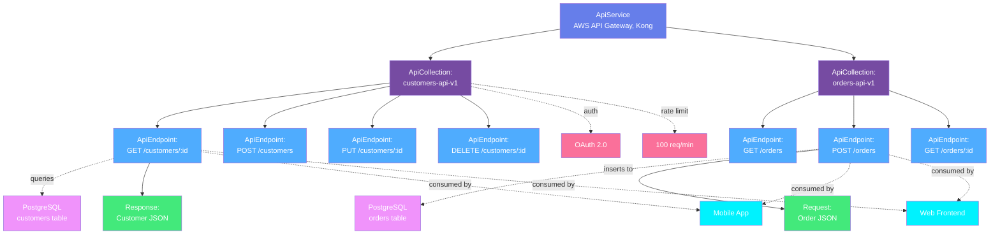
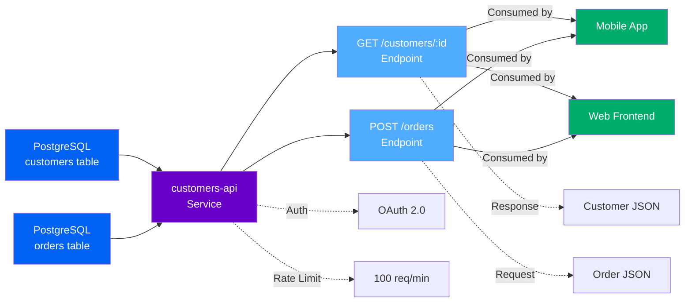
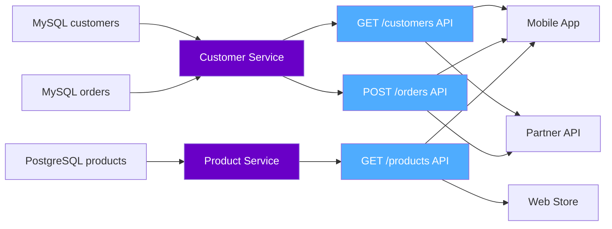
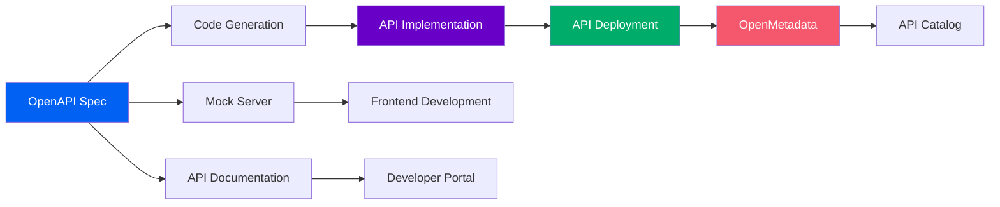

# API Assets

**REST APIs and data services**

API assets represent RESTful web services, microservices, and data APIs that expose data through HTTP endpoints. OpenMetadata models APIs with a three-level hierarchy for API platforms and services.

---

## Hierarchy Overview



---

## Why This Hierarchy?

### API Service
**Purpose**: Represents the API gateway, platform, or service registry

An API Service is the platform or gateway that hosts and manages APIs. It contains configuration for discovering API collections and endpoints.

**Examples**:

- `aws-api-gateway-prod` - Production AWS API Gateway
- `kong-gateway` - Kong API Gateway
- `azure-apim` - Azure API Management
- `internal-microservices` - Internal service mesh

**Why needed**: Organizations have multiple API gateways and service platforms (AWS API Gateway, Kong, Azure APIM, internal Kubernetes services). The service level groups APIs by platform and environment, making it easy to manage connections and understand API organization.

**Supported Platforms**: AWS API Gateway, Azure API Management, Kong, Apigee, MuleSoft, Postman, OpenAPI/Swagger, GraphQL, gRPC

[**View API Service Specification →**](api-service.md){ .md-button }

---

### API Collection
**Purpose**: Groups related API endpoints (microservice or resource group)

An API Collection represents a logical grouping of related endpoints, typically corresponding to a microservice, resource type, or API version.

**Examples**:

- `customers-api-v1` - Customer management endpoints
- `orders-service` - Order processing APIs
- `payment-gateway` - Payment processing endpoints
- `analytics-api-v2` - Analytics and reporting APIs

**Key Metadata**:

- **Version**: API version (v1, v2, 2024-11-01)
- **Base URL**: API base path (e.g., `/api/v1/customers`)
- **Authentication**: OAuth 2.0, API key, JWT, etc.
- **Endpoints**: Individual API operations
- **OpenAPI Spec**: Swagger/OpenAPI definition
- **Documentation**: API usage guides
- **Owner**: Team responsible for the API

**Why needed**: API Collections organize endpoints by functionality and ownership. This enables:
- Logical grouping of related operations
- Version management (v1, v2)
- Team ownership and accountability
- Consistent authentication and policies

[**View API Collection Specification →**](api-collection.md){ .md-button }

---

### API Endpoint
**Purpose**: Individual API operation (GET, POST, PUT, DELETE)

An API Endpoint is a specific HTTP operation on a resource. It has a method, path, request/response schemas, and dependencies on data sources.

**Examples**:

- `GET /api/v1/customers/{id}` - Retrieve customer by ID
- `POST /api/v1/orders` - Create new order
- `PUT /api/v1/products/{id}` - Update product
- `DELETE /api/v1/sessions/{id}` - Delete user session

**Key Metadata**:

- **HTTP Method**: GET, POST, PUT, DELETE, PATCH
- **Path**: URL path with parameters
- **Request Schema**: Body, query params, headers
- **Response Schema**: Success and error responses
- **Status Codes**: 200, 201, 400, 404, 500, etc.
- **Data Sources**: Database tables or services queried
- **Rate Limits**: Throttling and quota policies
- **Lineage**: Database → API → Consumer applications

**Why needed**: Endpoints provide granular lineage. You can see exactly which database tables or services each API operation depends on, enabling precise impact analysis when schemas change.

[**View API Endpoint Specification →**](api-endpoint.md){ .md-button }

---

## Common Patterns

### Pattern 1: RESTful Microservice
```
API Service → customers-api-v1 Collection → GET /customers/{id} Endpoint
                                          → POST /customers Endpoint
                                          → PUT /customers/{id} Endpoint
                                          → DELETE /customers/{id} Endpoint
```

Standard CRUD operations for customer resource.

### Pattern 2: AWS API Gateway + Lambda
```
AWS API Gateway → orders-service Collection → POST /orders Endpoint
                                             → Lambda: processOrder
                                             → Data: DynamoDB orders table
```

Serverless API with Lambda backend and DynamoDB storage.

### Pattern 3: GraphQL API
```
GraphQL Service → ecommerce-api Collection → Query: products Endpoint
                                            → Query: customer Endpoint
                                            → Mutation: createOrder Endpoint
```

GraphQL API with queries and mutations.

---

## Real-World Example

Here's how a platform team exposes data through APIs:



**Flow**:
1. **Data Sources**: PostgreSQL tables store customer and order data
2. **API Service**: REST API exposes data through endpoints
3. **Endpoints**:
   - `GET /customers/:id` - Retrieves customer by ID from database
   - `POST /orders` - Creates new order in database
4. **Consumers**: Mobile app and web frontend consume the APIs
5. **Governance**: OAuth authentication, rate limiting, schema validation

**Benefits**:

- **Lineage**: Trace API endpoints back to source database tables
- **Schema Management**: Track request/response schemas, detect breaking changes
- **Impact Analysis**: Know which apps break if endpoint changes
- **API Governance**: Monitor usage, enforce rate limits, track versions
- **Documentation**: Automatically generate API docs from OpenAPI specs

---

## API Lineage

APIs create lineage connections between data sources and consuming applications:



**Database → Service → API → Application**

---

## OpenAPI/Swagger Integration

APIs are typically defined using OpenAPI (Swagger) specifications:

### OpenAPI 3.0 Example
```yaml
openapi: 3.0.0
info:
  title: Customer API
  version: 1.0.0
  description: Customer management operations

paths:
  /customers/{id}:
    get:
      summary: Get customer by ID
      parameters:
        - name: id
          in: path
          required: true
          schema:
            type: string
      responses:
        '200':
          description: Customer found
          content:
            application/json:
              schema:
                $ref: '#/components/schemas/Customer'
        '404':
          description: Customer not found

components:
  schemas:
    Customer:
      type: object
      properties:
        id:
          type: string
        name:
          type: string
        email:
          type: string
          format: email
```

**OpenMetadata Integration**: Automatically discovers and imports OpenAPI specifications, creating API Collections and Endpoints with full schema information.

---

## API Request/Response Schemas

Track detailed request and response structures:

### GET Endpoint
```json
{
  "method": "GET",
  "path": "/api/v1/customers/{id}",
  "parameters": {
    "path": {
      "id": {
        "type": "string",
        "required": true,
        "description": "Customer ID"
      }
    },
    "query": {
      "include": {
        "type": "string",
        "enum": ["orders", "addresses"],
        "description": "Related resources to include"
      }
    }
  },
  "responses": {
    "200": {
      "description": "Customer found",
      "schema": {
        "type": "object",
        "properties": {
          "id": {"type": "string"},
          "name": {"type": "string"},
          "email": {"type": "string"},
          "createdAt": {"type": "string", "format": "date-time"}
        }
      }
    },
    "404": {
      "description": "Customer not found"
    }
  }
}
```

### POST Endpoint
```json
{
  "method": "POST",
  "path": "/api/v1/orders",
  "requestBody": {
    "required": true,
    "schema": {
      "type": "object",
      "properties": {
        "customerId": {"type": "string"},
        "items": {
          "type": "array",
          "items": {
            "type": "object",
            "properties": {
              "productId": {"type": "string"},
              "quantity": {"type": "integer"}
            }
          }
        }
      }
    }
  },
  "responses": {
    "201": {
      "description": "Order created",
      "schema": {
        "type": "object",
        "properties": {
          "orderId": {"type": "string"},
          "status": {"type": "string"},
          "totalAmount": {"type": "number"}
        }
      }
    }
  }
}
```

---

## API Authentication Patterns

Different authentication methods for different use cases:

### OAuth 2.0
```json
{
  "authentication": {
    "type": "oauth2",
    "flows": {
      "authorizationCode": {
        "authorizationUrl": "https://auth.example.com/oauth/authorize",
        "tokenUrl": "https://auth.example.com/oauth/token",
        "scopes": {
          "read:customers": "Read customer data",
          "write:orders": "Create orders"
        }
      }
    }
  }
}
```

### API Key
```json
{
  "authentication": {
    "type": "apiKey",
    "in": "header",
    "name": "X-API-Key"
  }
}
```

### JWT Bearer Token
```json
{
  "authentication": {
    "type": "http",
    "scheme": "bearer",
    "bearerFormat": "JWT"
  }
}
```

---

## API Rate Limiting

Track rate limits and quotas:

```json
{
  "endpoint": "GET /api/v1/customers",
  "rateLimits": [
    {
      "type": "requests_per_minute",
      "limit": 100,
      "scope": "user"
    },
    {
      "type": "requests_per_day",
      "limit": 10000,
      "scope": "api_key"
    }
  ],
  "quotas": {
    "monthlyRequests": 1000000,
    "dataTransferGB": 100
  }
}
```

---

## API Versioning Strategies

Track API versions and deprecation:

### URL-Based Versioning
```
/api/v1/customers  (Current)
/api/v2/customers  (New version)
```

### Header-Based Versioning
```
GET /api/customers
Accept: application/vnd.company.v2+json
```

### Date-Based Versioning
```
GET /api/customers
API-Version: 2024-11-01
```

**Version Metadata**:
```json
{
  "collection": "customers-api",
  "versions": [
    {
      "version": "v1",
      "status": "deprecated",
      "deprecationDate": "2024-12-31",
      "sunsetDate": "2025-06-30"
    },
    {
      "version": "v2",
      "status": "current",
      "releaseDate": "2024-11-01"
    }
  ]
}
```

---

## API-First Development

APIs defined before implementation:



**Design-First Workflow**:
1. Define OpenAPI specification
2. Generate server stubs and client SDKs
3. Build mock servers for early testing
4. Implement backend services
5. Deploy and register in API catalog

---

## GraphQL APIs

Track GraphQL schemas and operations:

```graphql
type Query {
  customer(id: ID!): Customer
  customers(limit: Int, offset: Int): [Customer]
  product(id: ID!): Product
}

type Mutation {
  createOrder(input: OrderInput!): Order
  updateCustomer(id: ID!, input: CustomerInput!): Customer
}

type Customer {
  id: ID!
  name: String!
  email: String!
  orders: [Order]
}

type Order {
  id: ID!
  customer: Customer!
  items: [OrderItem]
  totalAmount: Float!
}
```

**GraphQL Metadata**:

- **Queries**: Read operations
- **Mutations**: Write operations
- **Subscriptions**: Real-time updates
- **Schema**: Type definitions
- **Resolvers**: Data source mappings

---

## API Analytics and Monitoring

Track API usage and performance:

```json
{
  "endpoint": "GET /api/v1/customers/{id}",
  "metrics": {
    "requestsPerMinute": 45,
    "averageLatency": "120ms",
    "errorRate": "0.5%",
    "p95Latency": "250ms",
    "p99Latency": "500ms"
  },
  "topConsumers": [
    {"app": "mobile-app", "requests": 10000},
    {"app": "web-frontend", "requests": 5000}
  ],
  "errorsByCode": {
    "400": 50,
    "404": 100,
    "500": 10
  }
}
```

---

## Entity Specifications

| Entity | Description | Specification |
|--------|-------------|---------------|
| **API Service** | API gateway or platform | [View Spec](api-service.md) |
| **API Collection** | Group of related endpoints | [View Spec](api-collection.md) |
| **API Endpoint** | Individual HTTP operation | [View Spec](api-endpoint.md) |

Each specification includes:
- Complete field reference
- JSON Schema definition
- RDF/OWL ontology representation
- JSON-LD context and examples
- OpenAPI/Swagger integration

---

## Supported API Platforms

OpenMetadata supports metadata extraction from:

- **AWS API Gateway** - Managed API gateway service
- **Azure API Management** - Full lifecycle API management
- **Kong** - Open-source API gateway
- **Apigee** - Google Cloud API management
- **MuleSoft** - Integration and API platform
- **OpenAPI/Swagger** - API specification standard
- **Postman** - API development platform
- **GraphQL** - Query language for APIs
- **gRPC** - High-performance RPC framework
- **REST** - RESTful web services
- **SOAP** - Web services protocol

---

## API Governance

Track important governance metadata:

### Schema Validation
- **Breaking Changes**: Detect backward-incompatible changes
- **Contract Testing**: Validate requests/responses against schemas
- **Version Compatibility**: Track API versions and deprecations

### Security
- **Authentication**: OAuth, API keys, JWT validation
- **Authorization**: Role-based access control (RBAC)
- **Encryption**: TLS/HTTPS requirements
- **Input Validation**: Prevent injection attacks

### Compliance
- **Data Privacy**: GDPR, CCPA compliance for PII
- **Rate Limiting**: Prevent abuse and ensure fair usage
- **Audit Logging**: Track API access and changes
- **SLA Monitoring**: Track uptime and performance

---

## Next Steps

1. **Explore specifications** - Click through each entity above
2. **See API lineage** - Check out [lineage from databases to APIs to apps](../../lineage/overview.md)
3. **OpenAPI integration** - Learn how to import OpenAPI/Swagger specs
