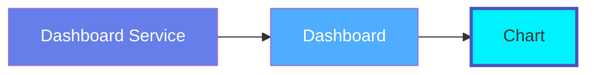
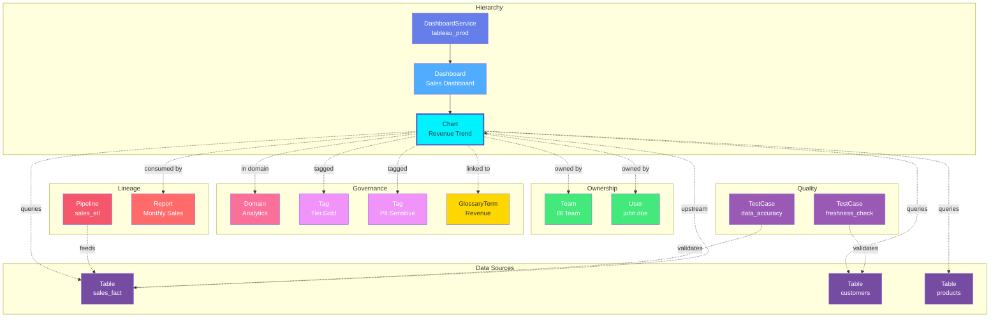

# Chart

**Individual visualizations and chart components - the building blocks of analytics**

---

## Overview

The **Chart** entity represents individual data visualizations and chart components within dashboards. It captures chart metadata, visualization type, data sources, and configuration across all BI platforms like Tableau, Looker, Power BI, and others.

**Hierarchy**:



---

## Relationships

Chart has comprehensive relationships with entities across the metadata platform:



**Relationship Types**:

- **Solid lines (→)**: Hierarchical containment (Service contains Dashboard, Dashboard contains Chart)
- **Dashed lines (-.->)**: References and associations (ownership, governance, lineage)

### Parent Entities
- **DashboardService**: The BI service hosting this chart's parent dashboard
- **Dashboard**: The dashboard containing this chart

### Child Entities
- None (leaf node in hierarchy)

### Associated Entities
- **Owner**: User or team owning this chart
- **Domain**: Business domain assignment
- **Tag**: Classification tags
- **GlossaryTerm**: Business terminology
- **Table**: Tables queried by this chart (data sources)
- **Pipeline**: ETL pipelines feeding the source data
- **TestCase**: Data quality tests on source tables

---

## Schema Specifications

View the complete Chart schema in your preferred format:

=== "JSON Schema"

    **Complete JSON Schema Definition**

    ```json
    {
      "$id": "https://open-metadata.org/schema/entity/data/chart.json",
      "$schema": "http://json-schema.org/draft-07/schema#",
      "title": "Chart",
      "$comment": "@om-entity-type",
      "description": "A `Chart` presents data visually. Charts can be part of `Dashboards`.",
      "type": "object",
      "javaType": "org.openmetadata.schema.entity.data.Chart",
      "javaInterfaces": ["org.openmetadata.schema.EntityInterface"],

      "definitions": {
        "chartType": {
          "javaType": "org.openmetadata.schema.type.ChartType",
          "description": "This schema defines the type used for describing different types of charts.",
          "type": "string",
          "enum": [
            "Line", "Table", "Bar", "Area", "Pie", "Histogram",
            "Scatter", "Text", "BoxPlot", "SanKey", "Gauge",
            "Map", "Graph", "Heatmap", "Timeline", "Other"
          ]
        }
      },

      "properties": {
        "id": {
          "description": "Unique identifier that identifies a chart instance.",
          "$ref": "../../type/basic.json#/definitions/uuid"
        },
        "name": {
          "description": "Name that identifies this Chart.",
          "$ref": "../../type/basic.json#/definitions/entityName"
        },
        "displayName": {
          "description": "Display Name that identifies this Chart. It could be title or label from the source services.",
          "type": "string"
        },
        "fullyQualifiedName": {
          "description": "A unique name that identifies a dashboard in the format 'ServiceName.ChartName'.",
          "$ref": "../../type/basic.json#/definitions/fullyQualifiedEntityName"
        },
        "description": {
          "description": "Description of the dashboard, what it is, and how to use it.",
          "$ref": "../../type/basic.json#/definitions/markdown"
        },
        "version": {
          "description": "Metadata version of the entity.",
          "$ref": "../../type/entityHistory.json#/definitions/entityVersion"
        },
        "updatedAt": {
          "description": "Last update time corresponding to the new version of the entity in Unix epoch time milliseconds.",
          "$ref": "../../type/basic.json#/definitions/timestamp"
        },
        "updatedBy": {
          "description": "User who made the update.",
          "type": "string"
        },
        "impersonatedBy": {
          "description": "Bot user that performed the action on behalf of the actual user.",
          "$ref": "../../type/basic.json#/definitions/impersonatedBy"
        },
        "chartType": {
          "$ref": "#/definitions/chartType"
        },
        "sourceUrl": {
          "description": "Chart URL suffix from its service.",
          "$ref": "../../type/basic.json#/definitions/sourceUrl"
        },
        "href": {
          "description": "Link to the resource corresponding to this entity.",
          "$ref": "../../type/basic.json#/definitions/href"
        },
        "owners": {
          "description": "Owners of this chart.",
          "$ref": "../../type/entityReferenceList.json"
        },
        "followers": {
          "description": "Followers of this chart.",
          "$ref": "../../type/entityReferenceList.json"
        },
        "tags": {
          "description": "Tags for this chart.",
          "type": "array",
          "items": {
            "$ref": "../../type/tagLabel.json"
          },
          "default": []
        },
        "service": {
          "description": "Link to service where this dashboard is hosted in.",
          "$ref": "../../type/entityReference.json"
        },
        "serviceType": {
          "description": "Service type where this chart is hosted in.",
          "$ref": "../services/dashboardService.json#/definitions/dashboardServiceType"
        },
        "usageSummary": {
          "description": "Latest usage information for this chart.",
          "$ref": "../../type/usageDetails.json",
          "default": null
        },
        "changeDescription": {
          "description": "Change that lead to this version of the entity.",
          "$ref": "../../type/entityHistory.json#/definitions/changeDescription"
        },
        "incrementalChangeDescription": {
          "description": "Change that lead to this version of the entity.",
          "$ref": "../../type/entityHistory.json#/definitions/changeDescription"
        },
        "deleted": {
          "description": "When `true` indicates the entity has been soft deleted.",
          "type": "boolean",
          "default": false
        },
        "domains": {
          "description": "Domains the Chart belongs to. The Chart inherits domain from the dashboard service it belongs to.",
          "$ref": "../../type/entityReferenceList.json"
        },
        "dataProducts": {
          "description": "List of data products this entity is part of.",
          "$ref": "../../type/entityReferenceList.json"
        },
        "votes": {
          "description": "Votes on the entity.",
          "$ref": "../../type/votes.json"
        },
        "lifeCycle": {
          "description": "Life Cycle properties of the entity",
          "$ref": "../../type/lifeCycle.json"
        },
        "certification": {
          "$ref": "../../type/assetCertification.json"
        },
        "sourceHash": {
          "description": "Source hash of the entity",
          "type": "string",
          "minLength": 1,
          "maxLength": 32
        },
        "extension": {
          "description": "Entity extension data with custom attributes added to the entity.",
          "$ref": "../../type/basic.json#/definitions/entityExtension"
        },
        "dashboards": {
          "description": "All the dashboards containing this chart.",
          "$ref": "../../type/entityReferenceList.json",
          "default": null
        },
        "entityStatus": {
          "description": "Status of the Chart.",
          "$ref": "../../type/status.json"
        }
      },

      "required": ["id", "name", "service"],
      "additionalProperties": false
    }
    ```

    **[View Full JSON Schema →](https://github.com/open-metadata/OpenMetadataStandards/blob/main/schemas/entity/data/chart.json)**

=== "RDF"

    **RDF/OWL Ontology Definition**

    ```turtle
    @prefix om: <https://open-metadata.org/schema/> .
    @prefix rdfs: <http://www.w3.org/2000/01/rdf-schema#> .
    @prefix owl: <http://www.w3.org/2001/XMLSchema#> .
    @prefix xsd: <http://www.w3.org/2001/XMLSchema#> .

    # Chart Class Definition
    om:Chart a owl:Class ;
        rdfs:subClassOf om:DataAsset ;
        rdfs:label "Chart" ;
        rdfs:comment "A data visualization or chart component within a dashboard" ;
        om:hierarchyLevel 3 .

    # Properties
    om:chartName a owl:DatatypeProperty ;
        rdfs:domain om:Chart ;
        rdfs:range xsd:string ;
        rdfs:label "name" ;
        rdfs:comment "Name of the chart" .

    om:fullyQualifiedName a owl:DatatypeProperty ;
        rdfs:domain om:Chart ;
        rdfs:range xsd:string ;
        rdfs:label "fullyQualifiedName" ;
        rdfs:comment "Complete hierarchical name: service.dashboard.chart" .

    om:chartType a owl:DatatypeProperty ;
        rdfs:domain om:Chart ;
        rdfs:range om:ChartType ;
        rdfs:label "chartType" ;
        rdfs:comment "Type of visualization: Line, Table, Bar, Area, Pie, etc." .

    om:sourceUrl a owl:DatatypeProperty ;
        rdfs:domain om:Chart ;
        rdfs:range xsd:string ;
        rdfs:label "sourceUrl" ;
        rdfs:comment "Chart URL suffix from its service" .

    om:hasDashboard a owl:ObjectProperty ;
        rdfs:domain om:Chart ;
        rdfs:range om:Dashboard ;
        rdfs:label "hasDashboard" ;
        rdfs:comment "Dashboards containing this chart" .

    om:belongsToService a owl:ObjectProperty ;
        rdfs:domain om:Chart ;
        rdfs:range om:DashboardService ;
        rdfs:label "belongsToService" ;
        rdfs:comment "Dashboard service hosting this chart" .

    om:hasOwner a owl:ObjectProperty ;
        rdfs:domain om:Chart ;
        rdfs:range om:Owner ;
        rdfs:label "hasOwner" ;
        rdfs:comment "Users or teams that own this chart" .

    om:hasFollower a owl:ObjectProperty ;
        rdfs:domain om:Chart ;
        rdfs:range om:User ;
        rdfs:label "hasFollower" ;
        rdfs:comment "Users following this chart" .

    om:inDomain a owl:ObjectProperty ;
        rdfs:domain om:Chart ;
        rdfs:range om:Domain ;
        rdfs:label "inDomain" ;
        rdfs:comment "Domains the chart belongs to" .

    om:hasDataProduct a owl:ObjectProperty ;
        rdfs:domain om:Chart ;
        rdfs:range om:DataProduct ;
        rdfs:label "hasDataProduct" ;
        rdfs:comment "Data products this chart is part of" .

    om:hasTag a owl:ObjectProperty ;
        rdfs:domain om:Chart ;
        rdfs:range om:Tag ;
        rdfs:label "hasTag" ;
        rdfs:comment "Classification tags applied to chart" .

    om:hasVotes a owl:ObjectProperty ;
        rdfs:domain om:Chart ;
        rdfs:range om:Votes ;
        rdfs:label "hasVotes" ;
        rdfs:comment "Votes on the chart" .

    om:hasLifeCycle a owl:ObjectProperty ;
        rdfs:domain om:Chart ;
        rdfs:range om:LifeCycle ;
        rdfs:label "hasLifeCycle" ;
        rdfs:comment "Life cycle properties" .

    om:hasCertification a owl:ObjectProperty ;
        rdfs:domain om:Chart ;
        rdfs:range om:AssetCertification ;
        rdfs:label "hasCertification" ;
        rdfs:comment "Asset certification information" .

    # Chart Type Enumeration
    om:ChartType a owl:Class ;
        owl:oneOf (
            om:LineChart
            om:TableChart
            om:BarChart
            om:AreaChart
            om:PieChart
            om:HistogramChart
            om:ScatterChart
            om:TextChart
            om:BoxPlotChart
            om:SanKeyChart
            om:GaugeChart
            om:MapChart
            om:GraphChart
            om:HeatmapChart
            om:TimelineChart
            om:OtherChart
        ) .

    # Example Instance
    ex:monthlySalesChart a om:Chart ;
        om:chartName "monthly_sales" ;
        om:fullyQualifiedName "tableau_prod.sales_overview.monthly_sales" ;
        om:displayName "Monthly Sales Trend" ;
        om:chartType om:LineChart ;
        om:sourceUrl "/views/sales_overview/monthly_sales" ;
        om:hasDashboard ex:salesOverviewDashboard ;
        om:belongsToService ex:tableauProdService ;
        om:hasOwner ex:salesTeam ;
        om:hasFollower ex:janeSmith ;
        om:inDomain ex:salesDomain ;
        om:hasDataProduct ex:salesAnalytics ;
        om:hasTag ex:tierGold ;
        om:hasVotes ex:chartVotes ;
        om:hasCertification ex:goldCertification .
    ```

    **[View Full RDF Ontology →](https://github.com/open-metadata/OpenMetadataStandards/blob/main/rdf/ontology/openmetadata.ttl)**

=== "JSON-LD"

    **JSON-LD Context and Example**

    ```json
    {
      "@context": {
        "@vocab": "https://open-metadata.org/schema/",
        "om": "https://open-metadata.org/schema/",
        "rdfs": "http://www.w3.org/2000/01/rdf-schema#",
        "xsd": "http://www.w3.org/2001/XMLSchema#",

        "Chart": "om:Chart",
        "name": {
          "@id": "om:chartName",
          "@type": "xsd:string"
        },
        "fullyQualifiedName": {
          "@id": "om:fullyQualifiedName",
          "@type": "xsd:string"
        },
        "displayName": {
          "@id": "om:displayName",
          "@type": "xsd:string"
        },
        "description": {
          "@id": "om:description",
          "@type": "xsd:string"
        },
        "chartType": {
          "@id": "om:chartType",
          "@type": "@vocab"
        },
        "sourceUrl": {
          "@id": "om:sourceUrl",
          "@type": "xsd:string"
        },
        "dashboards": {
          "@id": "om:hasDashboard",
          "@type": "@id",
          "@container": "@set"
        },
        "service": {
          "@id": "om:belongsToService",
          "@type": "@id"
        },
        "serviceType": {
          "@id": "om:serviceType",
          "@type": "xsd:string"
        },
        "owners": {
          "@id": "om:hasOwner",
          "@type": "@id",
          "@container": "@set"
        },
        "followers": {
          "@id": "om:hasFollower",
          "@type": "@id",
          "@container": "@set"
        },
        "domains": {
          "@id": "om:inDomain",
          "@type": "@id",
          "@container": "@set"
        },
        "dataProducts": {
          "@id": "om:hasDataProduct",
          "@type": "@id",
          "@container": "@set"
        },
        "tags": {
          "@id": "om:hasTag",
          "@type": "@id",
          "@container": "@set"
        },
        "votes": {
          "@id": "om:hasVotes",
          "@type": "@id"
        },
        "lifeCycle": {
          "@id": "om:hasLifeCycle",
          "@type": "@id"
        },
        "certification": {
          "@id": "om:hasCertification",
          "@type": "@id"
        }
      }
    }
    ```

    **Example JSON-LD Instance**:

    ```json
    {
      "@context": "https://open-metadata.org/context/chart.jsonld",
      "@type": "Chart",
      "@id": "https://example.com/charts/monthly_sales",

      "name": "monthly_sales",
      "fullyQualifiedName": "tableau_prod.sales_overview.monthly_sales",
      "displayName": "Monthly Sales Trend",
      "description": "Line chart showing monthly sales trends over the past 12 months",
      "chartType": "Line",
      "sourceUrl": "/views/sales_overview/monthly_sales",

      "service": {
        "@id": "https://example.com/services/tableau_prod",
        "@type": "DashboardService",
        "name": "tableau_prod"
      },

      "serviceType": "Tableau",

      "dashboards": [
        {
          "@id": "https://example.com/dashboards/sales_overview",
          "@type": "Dashboard",
          "name": "sales_overview"
        }
      ],

      "owners": [
        {
          "@id": "https://example.com/teams/sales-team",
          "@type": "Team",
          "name": "sales-team",
          "displayName": "Sales Team"
        }
      ],

      "followers": [
        {
          "@id": "https://example.com/users/jane-smith",
          "@type": "User",
          "name": "jane.smith"
        }
      ],

      "domains": [
        {
          "@id": "https://example.com/domains/sales",
          "@type": "Domain",
          "name": "Sales"
        }
      ],

      "dataProducts": [
        {
          "@id": "https://example.com/dataProducts/sales_analytics",
          "@type": "DataProduct",
          "name": "sales_analytics"
        }
      ],

      "tags": [
        {
          "@id": "https://open-metadata.org/tags/Tier/Gold",
          "tagFQN": "Tier.Gold"
        }
      ],

      "votes": {
        "upVotes": 15,
        "downVotes": 2
      },

      "certification": {
        "tagLabel": {
          "tagFQN": "Certified.Gold"
        }
      }
    }
    ```

    **[View Full JSON-LD Context →](https://github.com/open-metadata/OpenMetadataStandards/blob/main/rdf/contexts/chart.jsonld)**

---

## Use Cases

- Catalog all chart visualizations across BI platforms
- Document chart purpose and data sources
- Track chart ownership and stakeholders
- Discover charts by visualization type or metric
- Capture lineage from source tables to charts
- Apply governance tags to sensitive visualizations
- Track chart dependencies and refresh schedules
- Understand which tables feed which visualizations
- Document chart calculation logic and filters

---

## JSON Schema Specification

### Core Properties

#### `id` (uuid)
**Type**: `string` (UUID format)
**Required**: Yes (system-generated)
**Description**: Unique identifier for this chart instance

```json
{
  "id": "3c4d5e6f-7a8b-9c0d-1e2f-3a4b5c6d7e8f"
}
```

---

#### `name` (entityName)
**Type**: `string`
**Required**: Yes
**Pattern**: `^[^.]*$` (no dots allowed)
**Min Length**: 1
**Max Length**: 256
**Description**: Name of the chart (unqualified)

```json
{
  "name": "monthly_sales"
}
```

---

#### `fullyQualifiedName` (fullyQualifiedEntityName)
**Type**: `string`
**Required**: Yes (system-generated)
**Pattern**: `^((?!::).)*$`
**Description**: Fully qualified name in the format `service.dashboard.chart`

```json
{
  "fullyQualifiedName": "tableau_prod.sales_overview.monthly_sales"
}
```

---

#### `displayName`
**Type**: `string`
**Required**: No
**Description**: Human-readable display name

```json
{
  "displayName": "Monthly Sales Trend"
}
```

---

#### `description` (markdown)
**Type**: `string` (Markdown format)
**Required**: No
**Description**: Rich text description of the chart's purpose and methodology

```json
{
  "description": "# Monthly Sales Trend\n\nLine chart showing monthly sales trends over the past 12 months.\n\n## Metrics\n- Total Revenue (SUM)\n- Year-over-Year Growth %\n\n## Filters\n- Region: All\n- Product Category: All\n- Date Range: Last 12 months"
}
```

---

### Chart Configuration

#### `chartType` (ChartType enum)
**Type**: `string` enum
**Required**: No
**Allowed Values**:

- `Line` - Line chart
- `Table` - Data table
- `Bar` - Bar chart
- `Area` - Area chart
- `Pie` - Pie chart
- `Histogram` - Histogram
- `Scatter` - Scatter plot
- `Text` - Text/KPI card
- `BoxPlot` - Box and whisker plot
- `SanKey` - Sankey diagram
- `Gauge` - Gauge/speedometer
- `Map` - Geographic map
- `Graph` - Graph visualization
- `Heatmap` - Heat map
- `Timeline` - Timeline chart
- `Other` - Other/custom visualization

```json
{
  "chartType": "Line"
}
```

---

#### `sourceUrl` (sourceUrl)
**Type**: `string`
**Required**: No
**Description**: Chart URL suffix from its service

```json
{
  "sourceUrl": "/views/sales_overview/monthly_sales"
}
```

---

### Location Properties

#### `service` (EntityReference)
**Type**: `object`
**Required**: Yes
**Description**: Link to service where this dashboard is hosted in

```json
{
  "service": {
    "id": "service-uuid",
    "type": "dashboardService",
    "name": "tableau_prod",
    "fullyQualifiedName": "tableau_prod"
  }
}
```

---

#### `serviceType` (dashboardServiceType)
**Type**: `string` enum
**Required**: No
**Description**: Service type where this chart is hosted in

```json
{
  "serviceType": "Tableau"
}
```

---

#### `dashboards[]` (EntityReferenceList)
**Type**: `array` of Dashboard entity references
**Required**: No
**Description**: All the dashboards containing this chart

```json
{
  "dashboards": [
    {
      "id": "dashboard-uuid",
      "type": "dashboard",
      "name": "sales_overview",
      "fullyQualifiedName": "tableau_prod.sales_overview"
    }
  ]
}
```

---

### Governance Properties

#### `owners[]` (EntityReferenceList)
**Type**: `array` of entity references
**Required**: No
**Description**: Owners of this chart

```json
{
  "owners": [
    {
      "id": "owner-uuid",
      "type": "user",
      "name": "john.doe",
      "displayName": "John Doe"
    }
  ]
}
```

---

#### `followers[]` (EntityReferenceList)
**Type**: `array` of entity references
**Required**: No
**Description**: Followers of this chart

```json
{
  "followers": [
    {
      "id": "user-uuid",
      "type": "user",
      "name": "jane.smith"
    }
  ]
}
```

---

#### `domains[]` (EntityReferenceList)
**Type**: `array` of domain references
**Required**: No
**Description**: Domains the Chart belongs to. The Chart inherits domain from the dashboard service it belongs to

```json
{
  "domains": [
    {
      "id": "domain-uuid",
      "type": "domain",
      "name": "Sales",
      "fullyQualifiedName": "Sales"
    }
  ]
}
```

---

#### `dataProducts[]` (EntityReferenceList)
**Type**: `array` of data product references
**Required**: No
**Description**: List of data products this entity is part of

```json
{
  "dataProducts": [
    {
      "id": "product-uuid",
      "type": "dataProduct",
      "name": "sales_analytics",
      "fullyQualifiedName": "sales_analytics"
    }
  ]
}
```

---

#### `tags[]` (TagLabel[])
**Type**: `array`
**Required**: No
**Default**: `[]`
**Description**: Tags for this chart

```json
{
  "tags": [
    {
      "tagFQN": "Tier.Gold",
      "description": "Critical sales metric",
      "source": "Classification",
      "labelType": "Manual",
      "state": "Confirmed"
    },
    {
      "tagFQN": "Metric.Revenue",
      "source": "Classification",
      "labelType": "Automated",
      "state": "Suggested"
    }
  ]
}
```

---

#### `votes` (Votes)
**Type**: `object`
**Required**: No
**Description**: Votes on the entity

```json
{
  "votes": {
    "upVotes": 15,
    "downVotes": 2,
    "upVoters": ["user1-uuid", "user2-uuid"]
  }
}
```

---

#### `lifeCycle` (LifeCycle)
**Type**: `object`
**Required**: No
**Description**: Life Cycle properties of the entity

```json
{
  "lifeCycle": {
    "created": {
      "timestamp": 1704067200000,
      "user": "john.doe"
    },
    "updated": {
      "timestamp": 1704240000000,
      "user": "jane.smith"
    }
  }
}
```

---

#### `certification` (AssetCertification)
**Type**: `object`
**Required**: No
**Description**: Asset certification information

```json
{
  "certification": {
    "tagLabel": {
      "tagFQN": "Certified.Gold"
    },
    "certifiedBy": "data-governance-team",
    "certifiedAt": 1704067200000
  }
}
```

---

### System Properties

#### `href` (href)
**Type**: `string` (URI format)
**Required**: No (system-managed)
**Description**: Link to the resource corresponding to this entity

```json
{
  "href": "https://api.example.com/v1/charts/3c4d5e6f-7a8b-9c0d-1e2f-3a4b5c6d7e8f"
}
```

---

#### `usageSummary` (UsageDetails)
**Type**: `object`
**Required**: No
**Default**: `null`
**Description**: Latest usage information for this chart

```json
{
  "usageSummary": {
    "dailyStats": {
      "count": 125,
      "percentileRank": 85.5
    },
    "weeklyStats": {
      "count": 650,
      "percentileRank": 82.3
    },
    "date": "2024-01-03"
  }
}
```

---

#### `deleted` (boolean)
**Type**: `boolean`
**Required**: No (system-managed)
**Default**: `false`
**Description**: When `true` indicates the entity has been soft deleted

```json
{
  "deleted": false
}
```

---

#### `entityStatus` (Status)
**Type**: `string` enum
**Required**: No
**Description**: Status of the Chart

```json
{
  "entityStatus": "Active"
}
```

---

#### `sourceHash` (string)
**Type**: `string`
**Required**: No
**Min Length**: 1
**Max Length**: 32
**Description**: Source hash of the entity

```json
{
  "sourceHash": "a1b2c3d4e5f6"
}
```

---

#### `extension` (EntityExtension)
**Type**: `object`
**Required**: No
**Description**: Entity extension data with custom attributes added to the entity

```json
{
  "extension": {
    "customField1": "value1",
    "customField2": 123
  }
}
```

---

### Versioning Properties

#### `version` (entityVersion)
**Type**: `number`
**Required**: Yes (system-managed)
**Description**: Metadata version of the entity

```json
{
  "version": 1.2
}
```

---

#### `updatedAt` (timestamp)
**Type**: `integer` (Unix epoch milliseconds)
**Required**: Yes (system-managed)
**Description**: Last update time corresponding to the new version of the entity in Unix epoch time milliseconds

```json
{
  "updatedAt": 1704240000000
}
```

---

#### `updatedBy` (string)
**Type**: `string`
**Required**: Yes (system-managed)
**Description**: User who made the update

```json
{
  "updatedBy": "john.doe"
}
```

---

#### `impersonatedBy` (impersonatedBy)
**Type**: `object`
**Required**: No
**Description**: Bot user that performed the action on behalf of the actual user

```json
{
  "impersonatedBy": {
    "type": "bot",
    "name": "ingestion-bot"
  }
}
```

---

#### `changeDescription` (ChangeDescription)
**Type**: `object`
**Required**: No (system-managed)
**Description**: Change that lead to this version of the entity

```json
{
  "changeDescription": {
    "fieldsAdded": [{"name": "tags", "newValue": "[{\"tagFQN\":\"Tier.Gold\"}]"}],
    "fieldsUpdated": [],
    "fieldsDeleted": [],
    "previousVersion": 1.1
  }
}
```

---

#### `incrementalChangeDescription` (ChangeDescription)
**Type**: `object`
**Required**: No (system-managed)
**Description**: Change that lead to this version of the entity

```json
{
  "incrementalChangeDescription": {
    "fieldsAdded": [],
    "fieldsUpdated": [{"name": "description", "oldValue": "Old desc", "newValue": "New desc"}],
    "fieldsDeleted": [],
    "previousVersion": 1.1
  }
}
```

---

## Complete Example

```json
{
  "id": "3c4d5e6f-7a8b-9c0d-1e2f-3a4b5c6d7e8f",
  "name": "monthly_sales",
  "fullyQualifiedName": "tableau_prod.sales_overview.monthly_sales",
  "displayName": "Monthly Sales Trend",
  "description": "# Monthly Sales Trend\n\nLine chart showing monthly sales trends over the past 12 months.",
  "chartType": "Line",
  "sourceUrl": "/views/sales_overview/monthly_sales",
  "href": "https://api.example.com/v1/charts/3c4d5e6f-7a8b-9c0d-1e2f-3a4b5c6d7e8f",
  "service": {
    "id": "service-uuid",
    "type": "dashboardService",
    "name": "tableau_prod",
    "fullyQualifiedName": "tableau_prod"
  },
  "serviceType": "Tableau",
  "dashboards": [
    {
      "id": "dashboard-uuid",
      "type": "dashboard",
      "name": "sales_overview",
      "fullyQualifiedName": "tableau_prod.sales_overview"
    }
  ],
  "owners": [
    {
      "id": "owner-uuid",
      "type": "user",
      "name": "john.doe",
      "displayName": "John Doe"
    }
  ],
  "followers": [
    {
      "id": "follower-uuid",
      "type": "user",
      "name": "jane.smith"
    }
  ],
  "domains": [
    {
      "id": "domain-uuid",
      "type": "domain",
      "name": "Sales",
      "fullyQualifiedName": "Sales"
    }
  ],
  "dataProducts": [
    {
      "id": "product-uuid",
      "type": "dataProduct",
      "name": "sales_analytics"
    }
  ],
  "tags": [
    {"tagFQN": "Tier.Gold"},
    {"tagFQN": "Metric.Revenue"}
  ],
  "votes": {
    "upVotes": 15,
    "downVotes": 2
  },
  "lifeCycle": {
    "created": {
      "timestamp": 1704067200000,
      "user": "john.doe"
    }
  },
  "certification": {
    "tagLabel": {
      "tagFQN": "Certified.Gold"
    }
  },
  "usageSummary": {
    "dailyStats": {
      "count": 125,
      "percentileRank": 85.5
    },
    "date": "2024-01-03"
  },
  "deleted": false,
  "version": 1.2,
  "updatedAt": 1704240000000,
  "updatedBy": "john.doe"
}
```

---

## RDF Representation

### Ontology Class

```turtle
@prefix om: <https://open-metadata.org/schema/> .
@prefix rdfs: <http://www.w3.org/2000/01/rdf-schema#> .
@prefix owl: <http://www.w3.org/2001/XMLSchema#> .

om:Chart a owl:Class ;
    rdfs:subClassOf om:DataAsset ;
    rdfs:label "Chart" ;
    rdfs:comment "A data visualization or chart component" ;
    om:hasProperties [
        om:name "string" ;
        om:chartType "ChartType" ;
        om:sourceUrl "string" ;
        om:dashboards "Dashboard[]" ;
        om:service "DashboardService" ;
        om:serviceType "string" ;
        om:owners "Owner[]" ;
        om:followers "User[]" ;
        om:domains "Domain[]" ;
        om:dataProducts "DataProduct[]" ;
        om:tags "Tag[]" ;
        om:votes "Votes" ;
        om:lifeCycle "LifeCycle" ;
        om:certification "AssetCertification" ;
    ] .
```

### Instance Example

```turtle
@prefix om: <https://open-metadata.org/schema/> .
@prefix ex: <https://example.com/charts/> .

ex:monthly_sales a om:Chart ;
    om:name "monthly_sales" ;
    om:fullyQualifiedName "tableau_prod.sales_overview.monthly_sales" ;
    om:displayName "Monthly Sales Trend" ;
    om:description "Line chart showing monthly sales" ;
    om:chartType om:LineChart ;
    om:sourceUrl "/views/sales_overview/monthly_sales" ;
    om:hasDashboard ex:sales_overview ;
    om:belongsToService ex:tableau_prod ;
    om:hasOwner ex:john_doe ;
    om:hasFollower ex:jane_smith ;
    om:inDomain ex:sales_domain ;
    om:hasDataProduct ex:sales_analytics ;
    om:hasTag ex:tier_gold ;
    om:hasVotes ex:chart_votes ;
    om:hasCertification ex:gold_certification .
```

---

## JSON-LD Context

```json
{
  "@context": {
    "@vocab": "https://open-metadata.org/schema/",
    "Chart": "om:Chart",
    "name": "om:name",
    "fullyQualifiedName": "om:fullyQualifiedName",
    "displayName": "om:displayName",
    "chartType": {
      "@id": "om:chartType",
      "@type": "@vocab"
    },
    "sourceUrl": {
      "@id": "om:sourceUrl",
      "@type": "xsd:string"
    },
    "dashboards": {
      "@id": "om:hasDashboard",
      "@type": "@id",
      "@container": "@set"
    },
    "service": {
      "@id": "om:belongsToService",
      "@type": "@id"
    },
    "serviceType": {
      "@id": "om:serviceType",
      "@type": "xsd:string"
    },
    "owners": {
      "@id": "om:hasOwner",
      "@type": "@id",
      "@container": "@set"
    },
    "followers": {
      "@id": "om:hasFollower",
      "@type": "@id",
      "@container": "@set"
    },
    "domains": {
      "@id": "om:inDomain",
      "@type": "@id",
      "@container": "@set"
    },
    "dataProducts": {
      "@id": "om:hasDataProduct",
      "@type": "@id",
      "@container": "@set"
    },
    "tags": {
      "@id": "om:hasTag",
      "@type": "@id",
      "@container": "@set"
    },
    "votes": {
      "@id": "om:hasVotes",
      "@type": "@id"
    },
    "lifeCycle": {
      "@id": "om:hasLifeCycle",
      "@type": "@id"
    },
    "certification": {
      "@id": "om:hasCertification",
      "@type": "@id"
    }
  }
}
```

---

## Relationships

### Parent Entities
- **Dashboard**: The dashboard containing this chart
- **DashboardService**: The BI platform hosting this chart

### Child Entities
- None

### Associated Entities
- **Owner**: User or team owning this chart
- **Domain**: Business domain assignment
- **Tag**: Classification tags
- **GlossaryTerm**: Business terminology
- **Table**: Tables used as data sources
- **DataModel**: Data models used
- **Column**: Specific columns used in the chart (via lineage)

---

## Custom Properties

This entity supports custom properties through the `extension` field.
Common custom properties include:

- **Data Classification**: Sensitivity level
- **Cost Center**: Billing allocation
- **Retention Period**: Data retention requirements
- **Application Owner**: Owning application/team

See [Custom Properties](../../metadata-specifications/custom-properties.md)
for details on defining and using custom properties.

---

## Followers

Users can follow charts to receive notifications about visualization changes, query modifications, and data source updates. See **[Followers](../../metadata-specifications/followers.md)** for details.

---

## API Operations

All Chart operations are available under the `/v1/charts` endpoint.

### List Charts

Get a list of charts, optionally filtered by service or dashboard.

```http
GET /v1/charts
Query Parameters:
  - fields: Fields to include (tables, tags, owner, dashboard, dataModels, etc.)
  - service: Filter by dashboard service name
  - limit: Number of results (1-1000000, default 10)
  - before/after: Cursor-based pagination
  - include: all | deleted | non-deleted (default: non-deleted)

Response: ChartList
```

### Create Chart

Create a new chart under a dashboard service.

```http
POST /v1/charts
Content-Type: application/json

{
  "name": "monthly_sales_trend",
  "service": "tableau_prod",
  "displayName": "Monthly Sales Trend",
  "description": "Line chart showing monthly sales trends",
  "chartType": "Line",
  "chartUrl": "https://tableau.example.com/views/sales/monthly_sales",
  "tables": [
    {
      "id": "sales-table-uuid",
      "type": "table"
    }
  ],
  "tags": [
    {"tagFQN": "Metric.Revenue"}
  ]
}

Response: Chart
```

### Get Chart by Name

Get a chart by its fully qualified name.

```http
GET /v1/charts/name/{fqn}
Query Parameters:
  - fields: Fields to include (tables, tags, owner, dashboard, etc.)
  - include: all | deleted | non-deleted

Example:
GET /v1/charts/name/tableau_prod.sales_overview.monthly_sales?fields=tables,tags,owner

Response: Chart
```

### Get Chart by ID

Get a chart by its unique identifier.

```http
GET /v1/charts/{id}
Query Parameters:
  - fields: Fields to include
  - include: all | deleted | non-deleted

Response: Chart
```

### Update Chart

Update a chart using JSON Patch.

```http
PATCH /v1/charts/name/{fqn}
Content-Type: application/json-patch+json

[
  {"op": "add", "path": "/tags/-", "value": {"tagFQN": "BusinessCritical"}},
  {"op": "replace", "path": "/description", "value": "Updated chart description"},
  {"op": "replace", "path": "/chartType", "value": "Bar"}
]

Response: Chart
```

### Create or Update Chart

Create a new chart or update if it exists.

```http
PUT /v1/charts
Content-Type: application/json

{
  "name": "revenue_by_region",
  "service": "powerbi_prod",
  "chartType": "Bar",
  "tables": [...]
}

Response: Chart
```

### Delete Chart

Delete a chart by fully qualified name.

```http
DELETE /v1/charts/name/{fqn}
Query Parameters:
  - hardDelete: Permanently delete (default: false)

Response: 200 OK
```

### Update Chart Data Sources

Update the tables/data sources used by this chart.

```http
PUT /v1/charts/{id}/tables
Content-Type: application/json

{
  "tables": [
    {"id": "table-uuid-1", "type": "table"},
    {"id": "table-uuid-2", "type": "table"}
  ]
}

Response: Chart
```

### Get Chart Versions

Get all versions of a chart.

```http
GET /v1/charts/{id}/versions

Response: EntityHistory
```

### Follow Chart

Add a follower to a chart.

```http
PUT /v1/charts/{id}/followers/{userId}

Response: ChangeEvent
```

### Get Followers

Get all followers of a chart.

```http
GET /v1/charts/{id}/followers

Response: EntityReference[]
```

### Vote on Chart

Upvote or downvote a chart.

```http
PUT /v1/charts/{id}/vote
Content-Type: application/json

{
  "vote": "upvote"
}

Response: ChangeEvent
```

### Bulk Operations

Create or update multiple charts.

```http
PUT /v1/charts/bulk
Content-Type: application/json

{
  "entities": [...]
}

Response: BulkOperationResult
```

---

## Related Documentation

- **[Dashboard Service](dashboard-service.md)** - Service configuration
- **[Dashboard](dashboard.md)** - Dashboard entity specification
- **[Table](../databases/table.md)** - Data source tables
- **[Lineage](../../lineage/overview.md)** - Chart lineage
- **[Governance](../../governance/overview.md)** - Governance policies
