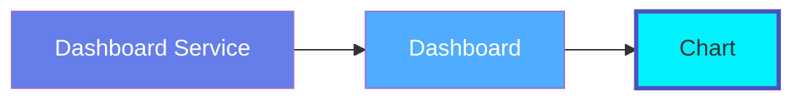
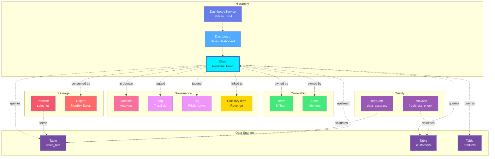

# Chart

**Individual visualizations and chart components - the building blocks of analytics**

---

## Overview

The **Chart** entity represents individual data visualizations and chart components within dashboards. It captures chart metadata, visualization type, data sources, and configuration across all BI platforms like Tableau, Looker, Power BI, and others.

**Hierarchy**:



---

## Relationships

Chart has comprehensive relationships with entities across the metadata platform:



**Relationship Types**:

- **Solid lines (→)**: Hierarchical containment (Service contains Dashboard, Dashboard contains Chart)
- **Dashed lines (-.->)**: References and associations (ownership, governance, lineage)

### Parent Entities
- **DashboardService**: The BI service hosting this chart's parent dashboard
- **Dashboard**: The dashboard containing this chart

### Child Entities
- None (leaf node in hierarchy)

### Associated Entities
- **Owner**: User or team owning this chart
- **Domain**: Business domain assignment
- **Tag**: Classification tags
- **GlossaryTerm**: Business terminology
- **Table**: Tables queried by this chart (data sources)
- **Pipeline**: ETL pipelines feeding the source data
- **TestCase**: Data quality tests on source tables

---

## Schema Specifications

View the complete Chart schema in your preferred format:

=== "JSON Schema"

    **Complete JSON Schema Definition**

    ```json
    {
      "$id": "https://open-metadata.org/schema/entity/data/chart.json",
      "$schema": "http://json-schema.org/draft-07/schema#",
      "title": "Chart",
      "description": "A `Chart` entity represents a single data visualization or chart component.",
      "type": "object",
      "javaType": "org.openmetadata.schema.entity.data.Chart",

      "definitions": {
        "chartType": {
          "description": "Type of chart visualization",
          "type": "string",
          "enum": [
            "Line", "Bar", "Area", "Pie", "Donut", "Scatter",
            "Bubble", "Histogram", "Table", "Pivot", "BoxPlot",
            "Text", "Metric", "Gauge", "Funnel", "Heatmap",
            "Tree", "Treemap", "Sankey", "Waterfall", "Combo",
            "Map", "GeoMap", "Other"
          ]
        }
      },

      "properties": {
        "id": {
          "description": "Unique identifier",
          "$ref": "../../type/basic.json#/definitions/uuid"
        },
        "name": {
          "description": "Chart name",
          "$ref": "../../type/basic.json#/definitions/entityName"
        },
        "fullyQualifiedName": {
          "description": "Fully qualified name: service.dashboard.chart",
          "$ref": "../../type/basic.json#/definitions/fullyQualifiedEntityName"
        },
        "displayName": {
          "description": "Display name",
          "type": "string"
        },
        "description": {
          "description": "Markdown description",
          "$ref": "../../type/basic.json#/definitions/markdown"
        },
        "chartType": {
          "$ref": "#/definitions/chartType"
        },
        "chartUrl": {
          "description": "External URL to access chart",
          "type": "string",
          "format": "uri"
        },
        "dashboard": {
          "description": "Parent dashboard",
          "$ref": "../../type/entityReference.json"
        },
        "service": {
          "description": "Dashboard service",
          "$ref": "../../type/entityReference.json"
        },
        "tables": {
          "description": "Tables used as data sources",
          "type": "array",
          "items": {
            "$ref": "../../type/entityReference.json"
          }
        },
        "dataModels": {
          "description": "Data models used by chart",
          "type": "array",
          "items": {
            "$ref": "../../type/entityReference.json"
          }
        },
        "owner": {
          "description": "Owner (user or team)",
          "$ref": "../../type/entityReference.json"
        },
        "domain": {
          "description": "Data domain",
          "$ref": "../../type/entityReference.json"
        },
        "tags": {
          "description": "Classification tags",
          "type": "array",
          "items": {
            "$ref": "../../type/tagLabel.json"
          }
        },
        "glossaryTerms": {
          "description": "Business glossary terms",
          "type": "array",
          "items": {
            "$ref": "../../type/entityReference.json"
          }
        },
        "version": {
          "description": "Metadata version",
          "$ref": "../../type/entityHistory.json#/definitions/entityVersion"
        }
      },

      "required": ["id", "name", "service"]
    }
    ```

    **[View Full JSON Schema →](https://github.com/open-metadata/OpenMetadataStandards/blob/main/schemas/entity/data/chart.json)**

=== "RDF"

    **RDF/OWL Ontology Definition**

    ```turtle
    @prefix om: <https://open-metadata.org/schema/> .
    @prefix rdfs: <http://www.w3.org/2000/01/rdf-schema#> .
    @prefix owl: <http://www.w3.org/2001/XMLSchema#> .
    @prefix xsd: <http://www.w3.org/2001/XMLSchema#> .

    # Chart Class Definition
    om:Chart a owl:Class ;
        rdfs:subClassOf om:DataAsset ;
        rdfs:label "Chart" ;
        rdfs:comment "A data visualization or chart component within a dashboard" ;
        om:hierarchyLevel 3 .

    # Properties
    om:chartName a owl:DatatypeProperty ;
        rdfs:domain om:Chart ;
        rdfs:range xsd:string ;
        rdfs:label "name" ;
        rdfs:comment "Name of the chart" .

    om:fullyQualifiedName a owl:DatatypeProperty ;
        rdfs:domain om:Chart ;
        rdfs:range xsd:string ;
        rdfs:label "fullyQualifiedName" ;
        rdfs:comment "Complete hierarchical name: service.dashboard.chart" .

    om:chartType a owl:DatatypeProperty ;
        rdfs:domain om:Chart ;
        rdfs:range om:ChartType ;
        rdfs:label "chartType" ;
        rdfs:comment "Type of visualization: Line, Bar, Pie, etc." .

    om:chartUrl a owl:DatatypeProperty ;
        rdfs:domain om:Chart ;
        rdfs:range xsd:anyURI ;
        rdfs:label "chartUrl" ;
        rdfs:comment "External URL to access the chart" .

    om:belongsToDashboard a owl:ObjectProperty ;
        rdfs:domain om:Chart ;
        rdfs:range om:Dashboard ;
        rdfs:label "belongsToDashboard" ;
        rdfs:comment "Parent dashboard containing this chart" .

    om:belongsToService a owl:ObjectProperty ;
        rdfs:domain om:Chart ;
        rdfs:range om:DashboardService ;
        rdfs:label "belongsToService" ;
        rdfs:comment "Dashboard service hosting this chart" .

    om:usesTable a owl:ObjectProperty ;
        rdfs:domain om:Chart ;
        rdfs:range om:Table ;
        rdfs:label "usesTable" ;
        rdfs:comment "Tables used as data sources for this chart" .

    om:usesDataModel a owl:ObjectProperty ;
        rdfs:domain om:Chart ;
        rdfs:range om:DataModel ;
        rdfs:label "usesDataModel" ;
        rdfs:comment "Data models used by this chart" .

    om:ownedBy a owl:ObjectProperty ;
        rdfs:domain om:Chart ;
        rdfs:range om:Owner ;
        rdfs:label "ownedBy" ;
        rdfs:comment "User or team that owns this chart" .

    om:hasTag a owl:ObjectProperty ;
        rdfs:domain om:Chart ;
        rdfs:range om:Tag ;
        rdfs:label "hasTag" ;
        rdfs:comment "Classification tags applied to chart" .

    om:linkedToGlossaryTerm a owl:ObjectProperty ;
        rdfs:domain om:Chart ;
        rdfs:range om:GlossaryTerm ;
        rdfs:label "linkedToGlossaryTerm" ;
        rdfs:comment "Business glossary terms" .

    # Chart Type Enumeration
    om:ChartType a owl:Class ;
        owl:oneOf (
            om:LineChart
            om:BarChart
            om:PieChart
            om:ScatterChart
            om:TableChart
            om:HeatmapChart
        ) .

    # Example Instance
    ex:monthlySalesChart a om:Chart ;
        om:chartName "monthly_sales" ;
        om:fullyQualifiedName "tableau_prod.sales_overview.monthly_sales" ;
        om:displayName "Monthly Sales Trend" ;
        om:chartType om:LineChart ;
        om:chartUrl "https://tableau.example.com/views/sales_overview/monthly_sales" ;
        om:belongsToDashboard ex:salesOverviewDashboard ;
        om:belongsToService ex:tableauProdService ;
        om:usesTable ex:salesFactTable ;
        om:ownedBy ex:salesTeam ;
        om:hasTag ex:tierGold ;
        om:linkedToGlossaryTerm ex:revenueTerm .
    ```

    **[View Full RDF Ontology →](https://github.com/open-metadata/OpenMetadataStandards/blob/main/rdf/ontology/openmetadata.ttl)**

=== "JSON-LD"

    **JSON-LD Context and Example**

    ```json
    {
      "@context": {
        "@vocab": "https://open-metadata.org/schema/",
        "om": "https://open-metadata.org/schema/",
        "rdfs": "http://www.w3.org/2000/01/rdf-schema#",
        "xsd": "http://www.w3.org/2001/XMLSchema#",

        "Chart": "om:Chart",
        "name": {
          "@id": "om:chartName",
          "@type": "xsd:string"
        },
        "fullyQualifiedName": {
          "@id": "om:fullyQualifiedName",
          "@type": "xsd:string"
        },
        "displayName": {
          "@id": "om:displayName",
          "@type": "xsd:string"
        },
        "description": {
          "@id": "om:description",
          "@type": "xsd:string"
        },
        "chartType": {
          "@id": "om:chartType",
          "@type": "@vocab"
        },
        "chartUrl": {
          "@id": "om:chartUrl",
          "@type": "xsd:anyURI"
        },
        "dashboard": {
          "@id": "om:belongsToDashboard",
          "@type": "@id"
        },
        "service": {
          "@id": "om:belongsToService",
          "@type": "@id"
        },
        "tables": {
          "@id": "om:usesTable",
          "@type": "@id",
          "@container": "@set"
        },
        "dataModels": {
          "@id": "om:usesDataModel",
          "@type": "@id",
          "@container": "@set"
        },
        "owner": {
          "@id": "om:ownedBy",
          "@type": "@id"
        },
        "domain": {
          "@id": "om:inDomain",
          "@type": "@id"
        },
        "tags": {
          "@id": "om:hasTag",
          "@type": "@id",
          "@container": "@set"
        },
        "glossaryTerms": {
          "@id": "om:linkedToGlossaryTerm",
          "@type": "@id",
          "@container": "@set"
        }
      }
    }
    ```

    **Example JSON-LD Instance**:

    ```json
    {
      "@context": "https://open-metadata.org/context/chart.jsonld",
      "@type": "Chart",
      "@id": "https://example.com/charts/monthly_sales",

      "name": "monthly_sales",
      "fullyQualifiedName": "tableau_prod.sales_overview.monthly_sales",
      "displayName": "Monthly Sales Trend",
      "description": "Line chart showing monthly sales trends over the past 12 months",
      "chartType": "Line",
      "chartUrl": "https://tableau.example.com/views/sales_overview/monthly_sales",

      "dashboard": {
        "@id": "https://example.com/dashboards/sales_overview",
        "@type": "Dashboard",
        "name": "sales_overview"
      },

      "service": {
        "@id": "https://example.com/services/tableau_prod",
        "@type": "DashboardService",
        "name": "tableau_prod"
      },

      "tables": [
        {
          "@id": "https://example.com/tables/sales_fact",
          "@type": "Table",
          "name": "sales_fact",
          "fullyQualifiedName": "postgres_prod.analytics.public.sales_fact"
        }
      ],

      "owner": {
        "@id": "https://example.com/teams/sales-team",
        "@type": "Team",
        "name": "sales-team",
        "displayName": "Sales Team"
      },

      "tags": [
        {
          "@id": "https://open-metadata.org/tags/Tier/Gold",
          "tagFQN": "Tier.Gold"
        }
      ],

      "glossaryTerms": [
        {
          "@id": "https://example.com/glossary/Revenue",
          "@type": "GlossaryTerm",
          "fullyQualifiedName": "BusinessGlossary.Revenue"
        }
      ]
    }
    ```

    **[View Full JSON-LD Context →](https://github.com/open-metadata/OpenMetadataStandards/blob/main/rdf/contexts/chart.jsonld)**

---

## Use Cases

- Catalog all chart visualizations across BI platforms
- Document chart purpose and data sources
- Track chart ownership and stakeholders
- Discover charts by visualization type or metric
- Capture lineage from source tables to charts
- Apply governance tags to sensitive visualizations
- Track chart dependencies and refresh schedules
- Understand which tables feed which visualizations
- Document chart calculation logic and filters

---

## JSON Schema Specification

### Core Properties

#### `id` (uuid)
**Type**: `string` (UUID format)
**Required**: Yes (system-generated)
**Description**: Unique identifier for this chart instance

```json
{
  "id": "3c4d5e6f-7a8b-9c0d-1e2f-3a4b5c6d7e8f"
}
```

---

#### `name` (entityName)
**Type**: `string`
**Required**: Yes
**Pattern**: `^[^.]*$` (no dots allowed)
**Min Length**: 1
**Max Length**: 256
**Description**: Name of the chart (unqualified)

```json
{
  "name": "monthly_sales"
}
```

---

#### `fullyQualifiedName` (fullyQualifiedEntityName)
**Type**: `string`
**Required**: Yes (system-generated)
**Pattern**: `^((?!::).)*$`
**Description**: Fully qualified name in the format `service.dashboard.chart`

```json
{
  "fullyQualifiedName": "tableau_prod.sales_overview.monthly_sales"
}
```

---

#### `displayName`
**Type**: `string`
**Required**: No
**Description**: Human-readable display name

```json
{
  "displayName": "Monthly Sales Trend"
}
```

---

#### `description` (markdown)
**Type**: `string` (Markdown format)
**Required**: No
**Description**: Rich text description of the chart's purpose and methodology

```json
{
  "description": "# Monthly Sales Trend\n\nLine chart showing monthly sales trends over the past 12 months.\n\n## Metrics\n- Total Revenue (SUM)\n- Year-over-Year Growth %\n\n## Filters\n- Region: All\n- Product Category: All\n- Date Range: Last 12 months"
}
```

---

### Chart Configuration

#### `chartType` (ChartType enum)
**Type**: `string` enum
**Required**: No
**Allowed Values**:

- `Line` - Line chart
- `Bar` - Bar chart (vertical)
- `Area` - Area chart
- `Pie` - Pie chart
- `Donut` - Donut chart
- `Scatter` - Scatter plot
- `Bubble` - Bubble chart
- `Histogram` - Histogram
- `Table` - Data table
- `Pivot` - Pivot table
- `BoxPlot` - Box and whisker plot
- `Text` - Text/KPI card
- `Metric` - Single metric display
- `Gauge` - Gauge/speedometer
- `Funnel` - Funnel chart
- `Heatmap` - Heat map
- `Tree` - Tree diagram
- `Treemap` - Treemap
- `Sankey` - Sankey diagram
- `Waterfall` - Waterfall chart
- `Combo` - Combination chart
- `Map` - Geographic map
- `GeoMap` - Geospatial map
- `Other` - Other/custom visualization

```json
{
  "chartType": "Line"
}
```

---

#### `chartUrl` (uri)
**Type**: `string` (URI format)
**Required**: No
**Description**: External URL to access the chart in the BI tool

```json
{
  "chartUrl": "https://tableau.example.com/views/sales_overview/monthly_sales"
}
```

---

### Location Properties

#### `dashboard` (EntityReference)
**Type**: `object`
**Required**: No
**Description**: Reference to parent dashboard (if chart belongs to a dashboard)

```json
{
  "dashboard": {
    "id": "dashboard-uuid",
    "type": "dashboard",
    "name": "sales_overview",
    "fullyQualifiedName": "tableau_prod.sales_overview"
  }
}
```

---

#### `service` (EntityReference)
**Type**: `object`
**Required**: Yes
**Description**: Reference to parent dashboard service

```json
{
  "service": {
    "id": "service-uuid",
    "type": "dashboardService",
    "name": "tableau_prod",
    "fullyQualifiedName": "tableau_prod"
  }
}
```

---

### Data Source Properties

#### `tables[]` (Table[])
**Type**: `array` of Table entity references
**Required**: No
**Description**: Tables used as data sources for this chart

```json
{
  "tables": [
    {
      "id": "table-1-uuid",
      "type": "table",
      "name": "sales_fact",
      "fullyQualifiedName": "postgres_prod.analytics.public.sales_fact"
    },
    {
      "id": "table-2-uuid",
      "type": "table",
      "name": "product_dim",
      "fullyQualifiedName": "postgres_prod.analytics.public.product_dim"
    }
  ]
}
```

---

#### `dataModels[]` (DataModel[])
**Type**: `array` of DataModel entity references
**Required**: No
**Description**: Data models or datasets used by this chart (e.g., Looker explores)

```json
{
  "dataModels": [
    {
      "id": "model-uuid",
      "type": "dataModel",
      "name": "sales_explore",
      "fullyQualifiedName": "looker_prod.sales_model.sales_explore"
    }
  ]
}
```

---

### Governance Properties

#### `owner` (EntityReference)
**Type**: `object`
**Required**: No
**Description**: User or team that owns this chart

```json
{
  "owner": {
    "id": "owner-uuid",
    "type": "user",
    "name": "john.doe",
    "displayName": "John Doe"
  }
}
```

---

#### `domain` (EntityReference)
**Type**: `object`
**Required**: No
**Description**: Data domain this chart belongs to

```json
{
  "domain": {
    "id": "domain-uuid",
    "type": "domain",
    "name": "Sales",
    "fullyQualifiedName": "Sales"
  }
}
```

---

#### `tags[]` (TagLabel[])
**Type**: `array`
**Required**: No
**Description**: Classification tags applied to the chart

```json
{
  "tags": [
    {
      "tagFQN": "Tier.Gold",
      "description": "Critical sales metric",
      "source": "Classification",
      "labelType": "Manual",
      "state": "Confirmed"
    },
    {
      "tagFQN": "Metric.Revenue",
      "source": "Classification",
      "labelType": "Automated",
      "state": "Suggested"
    }
  ]
}
```

---

#### `glossaryTerms[]` (GlossaryTerm[])
**Type**: `array`
**Required**: No
**Description**: Business glossary terms linked to this chart

```json
{
  "glossaryTerms": [
    {
      "fullyQualifiedName": "BusinessGlossary.Revenue"
    },
    {
      "fullyQualifiedName": "BusinessGlossary.MonthlySales"
    }
  ]
}
```

---

### Versioning Properties

#### `version` (entityVersion)
**Type**: `number`
**Required**: Yes (system-managed)
**Description**: Metadata version number, incremented on changes

```json
{
  "version": 1.2
}
```

---

#### `updatedAt` (timestamp)
**Type**: `integer` (Unix epoch milliseconds)
**Required**: Yes (system-managed)
**Description**: Last update timestamp

```json
{
  "updatedAt": 1704240000000
}
```

---

#### `updatedBy` (string)
**Type**: `string`
**Required**: Yes (system-managed)
**Description**: User who made the update

```json
{
  "updatedBy": "john.doe"
}
```

---

## Complete Example

```json
{
  "id": "3c4d5e6f-7a8b-9c0d-1e2f-3a4b5c6d7e8f",
  "name": "monthly_sales",
  "fullyQualifiedName": "tableau_prod.sales_overview.monthly_sales",
  "displayName": "Monthly Sales Trend",
  "description": "# Monthly Sales Trend\n\nLine chart showing monthly sales trends over the past 12 months.",
  "chartType": "Line",
  "chartUrl": "https://tableau.example.com/views/sales_overview/monthly_sales",
  "dashboard": {
    "id": "dashboard-uuid",
    "type": "dashboard",
    "name": "sales_overview",
    "fullyQualifiedName": "tableau_prod.sales_overview"
  },
  "service": {
    "id": "service-uuid",
    "type": "dashboardService",
    "name": "tableau_prod"
  },
  "tables": [
    {
      "id": "table-uuid",
      "type": "table",
      "name": "sales_fact",
      "fullyQualifiedName": "postgres_prod.analytics.public.sales_fact"
    }
  ],
  "owner": {
    "id": "owner-uuid",
    "type": "user",
    "name": "john.doe",
    "displayName": "John Doe"
  },
  "domain": {
    "id": "domain-uuid",
    "type": "domain",
    "name": "Sales"
  },
  "tags": [
    {"tagFQN": "Tier.Gold"},
    {"tagFQN": "Metric.Revenue"}
  ],
  "glossaryTerms": [
    {"fullyQualifiedName": "BusinessGlossary.Revenue"}
  ],
  "version": 1.2,
  "updatedAt": 1704240000000,
  "updatedBy": "john.doe"
}
```

---

## RDF Representation

### Ontology Class

```turtle
@prefix om: <https://open-metadata.org/schema/> .
@prefix rdfs: <http://www.w3.org/2000/01/rdf-schema#> .
@prefix owl: <http://www.w3.org/2001/XMLSchema#> .

om:Chart a owl:Class ;
    rdfs:subClassOf om:DataAsset ;
    rdfs:label "Chart" ;
    rdfs:comment "A data visualization or chart component" ;
    om:hasProperties [
        om:name "string" ;
        om:chartType "ChartType" ;
        om:chartUrl "uri" ;
        om:dashboard "Dashboard" ;
        om:service "DashboardService" ;
        om:tables "Table[]" ;
        om:owner "Owner" ;
        om:tags "Tag[]" ;
    ] .
```

### Instance Example

```turtle
@prefix om: <https://open-metadata.org/schema/> .
@prefix ex: <https://example.com/charts/> .

ex:monthly_sales a om:Chart ;
    om:name "monthly_sales" ;
    om:fullyQualifiedName "tableau_prod.sales_overview.monthly_sales" ;
    om:displayName "Monthly Sales Trend" ;
    om:description "Line chart showing monthly sales" ;
    om:chartType om:LineChart ;
    om:chartUrl "https://tableau.example.com/views/sales_overview/monthly_sales" ;
    om:belongsToDashboard ex:sales_overview ;
    om:belongsToService ex:tableau_prod ;
    om:usesTable ex:sales_fact_table ;
    om:ownedBy ex:john_doe ;
    om:hasTag ex:tier_gold ;
    om:linkedToGlossaryTerm ex:revenue_term .
```

---

## JSON-LD Context

```json
{
  "@context": {
    "@vocab": "https://open-metadata.org/schema/",
    "Chart": "om:Chart",
    "name": "om:name",
    "fullyQualifiedName": "om:fullyQualifiedName",
    "displayName": "om:displayName",
    "chartType": {
      "@id": "om:chartType",
      "@type": "@vocab"
    },
    "chartUrl": {
      "@id": "om:chartUrl",
      "@type": "xsd:anyURI"
    },
    "dashboard": {
      "@id": "om:belongsToDashboard",
      "@type": "@id"
    },
    "service": {
      "@id": "om:belongsToService",
      "@type": "@id"
    },
    "tables": {
      "@id": "om:usesTable",
      "@type": "@id",
      "@container": "@set"
    },
    "owner": {
      "@id": "om:ownedBy",
      "@type": "@id"
    },
    "tags": {
      "@id": "om:hasTag",
      "@type": "@id",
      "@container": "@set"
    }
  }
}
```

---

## Relationships

### Parent Entities
- **Dashboard**: The dashboard containing this chart
- **DashboardService**: The BI platform hosting this chart

### Child Entities
- None

### Associated Entities
- **Owner**: User or team owning this chart
- **Domain**: Business domain assignment
- **Tag**: Classification tags
- **GlossaryTerm**: Business terminology
- **Table**: Tables used as data sources
- **DataModel**: Data models used
- **Column**: Specific columns used in the chart (via lineage)

---

## Custom Properties

This entity supports custom properties through the `extension` field.
Common custom properties include:

- **Data Classification**: Sensitivity level
- **Cost Center**: Billing allocation
- **Retention Period**: Data retention requirements
- **Application Owner**: Owning application/team

See [Custom Properties](../../metadata-specifications/custom-properties.md)
for details on defining and using custom properties.

---

## API Operations

All Chart operations are available under the `/v1/charts` endpoint.

### List Charts

Get a list of charts, optionally filtered by service or dashboard.

```http
GET /v1/charts
Query Parameters:
  - fields: Fields to include (tables, tags, owner, dashboard, dataModels, etc.)
  - service: Filter by dashboard service name
  - limit: Number of results (1-1000000, default 10)
  - before/after: Cursor-based pagination
  - include: all | deleted | non-deleted (default: non-deleted)

Response: ChartList
```

### Create Chart

Create a new chart under a dashboard service.

```http
POST /v1/charts
Content-Type: application/json

{
  "name": "monthly_sales_trend",
  "service": "tableau_prod",
  "displayName": "Monthly Sales Trend",
  "description": "Line chart showing monthly sales trends",
  "chartType": "Line",
  "chartUrl": "https://tableau.example.com/views/sales/monthly_sales",
  "tables": [
    {
      "id": "sales-table-uuid",
      "type": "table"
    }
  ],
  "tags": [
    {"tagFQN": "Metric.Revenue"}
  ]
}

Response: Chart
```

### Get Chart by Name

Get a chart by its fully qualified name.

```http
GET /v1/charts/name/{fqn}
Query Parameters:
  - fields: Fields to include (tables, tags, owner, dashboard, etc.)
  - include: all | deleted | non-deleted

Example:
GET /v1/charts/name/tableau_prod.sales_overview.monthly_sales?fields=tables,tags,owner

Response: Chart
```

### Get Chart by ID

Get a chart by its unique identifier.

```http
GET /v1/charts/{id}
Query Parameters:
  - fields: Fields to include
  - include: all | deleted | non-deleted

Response: Chart
```

### Update Chart

Update a chart using JSON Patch.

```http
PATCH /v1/charts/name/{fqn}
Content-Type: application/json-patch+json

[
  {"op": "add", "path": "/tags/-", "value": {"tagFQN": "BusinessCritical"}},
  {"op": "replace", "path": "/description", "value": "Updated chart description"},
  {"op": "replace", "path": "/chartType", "value": "Bar"}
]

Response: Chart
```

### Create or Update Chart

Create a new chart or update if it exists.

```http
PUT /v1/charts
Content-Type: application/json

{
  "name": "revenue_by_region",
  "service": "powerbi_prod",
  "chartType": "Bar",
  "tables": [...]
}

Response: Chart
```

### Delete Chart

Delete a chart by fully qualified name.

```http
DELETE /v1/charts/name/{fqn}
Query Parameters:
  - hardDelete: Permanently delete (default: false)

Response: 200 OK
```

### Update Chart Data Sources

Update the tables/data sources used by this chart.

```http
PUT /v1/charts/{id}/tables
Content-Type: application/json

{
  "tables": [
    {"id": "table-uuid-1", "type": "table"},
    {"id": "table-uuid-2", "type": "table"}
  ]
}

Response: Chart
```

### Get Chart Versions

Get all versions of a chart.

```http
GET /v1/charts/{id}/versions

Response: EntityHistory
```

### Follow Chart

Add a follower to a chart.

```http
PUT /v1/charts/{id}/followers/{userId}

Response: ChangeEvent
```

### Get Followers

Get all followers of a chart.

```http
GET /v1/charts/{id}/followers

Response: EntityReference[]
```

### Vote on Chart

Upvote or downvote a chart.

```http
PUT /v1/charts/{id}/vote
Content-Type: application/json

{
  "vote": "upvote"
}

Response: ChangeEvent
```

### Bulk Operations

Create or update multiple charts.

```http
PUT /v1/charts/bulk
Content-Type: application/json

{
  "entities": [...]
}

Response: BulkOperationResult
```

---

## Related Documentation

- **[Dashboard Service](dashboard-service.md)** - Service configuration
- **[Dashboard](dashboard.md)** - Dashboard entity specification
- **[Table](../databases/table.md)** - Data source tables
- **[Lineage](../../lineage/overview.md)** - Chart lineage
- **[Governance](../../governance/overview.md)** - Governance policies
