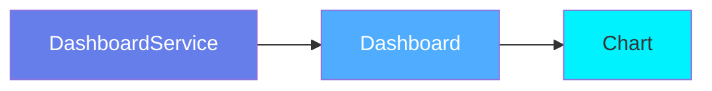

# Dashboard Service

**BI platform connections - Tableau, Looker, Power BI, and more**

---

## Overview

The **DashboardService** entity represents connections to Business Intelligence (BI) and analytics platforms. It serves as the root container for all dashboards, charts, and data models from platforms like Tableau, Looker, Power BI, Metabase, and others.

**Hierarchy**:



---

## Relationships

DashboardService has comprehensive relationships with entities across the metadata platform:

```mermaid
graph TD
    subgraph Service Layer
        A[DashboardService<br/>tableau_prod]
    end

    subgraph Dashboard Assets
        A --> B1[Dashboard:<br/>sales_overview]
        A --> B2[Dashboard:<br/>marketing_analytics]
        A --> B3[Dashboard:<br/>finance_reports]

        B1 --> C1[Chart:<br/>revenue_trend]
        B1 --> C2[Chart:<br/>conversion_funnel]
        B2 --> C3[Chart:<br/>campaign_performance]
        B2 --> C4[Chart:<br/>roi_metrics]
        B3 --> C5[Chart:<br/>budget_variance]
    end

    subgraph Ownership
        A -.->|owned by| D1[Team:<br/>BI Team]
        A -.->|owned by| D2[User:<br/>john.doe]
    end

    subgraph Governance
        A -.->|in domain| E[Domain:<br/>Analytics]
        A -.->|has tags| F1[Tag:<br/>Tier.Gold]
        A -.->|has tags| F2[Tag:<br/>Production]
        A -.->|has tags| F3[Tag:<br/>PII]
    end

    subgraph Data Lineage
        B1 -.->|uses data from| G1[Table:<br/>sales.sales_fact]
        B1 -.->|uses data from| G2[Table:<br/>crm.customers]
        B2 -.->|uses data from| G3[Table:<br/>marketing.campaigns]
        B2 -.->|uses data from| G4[Table:<br/>marketing.leads]
        B3 -.->|uses data from| G5[Table:<br/>finance.budget]

        H1[Pipeline:<br/>sales_etl] -.->|feeds data to| B1
        H2[Pipeline:<br/>marketing_etl] -.->|feeds data to| B2
        H3[Pipeline:<br/>finance_etl] -.->|feeds data to| B3
    end

    subgraph Data Models
        J1[DataModel:<br/>sales_model] --> B1
        J2[DataModel:<br/>marketing_model] --> B2
    end

    style A fill:#667eea,color:#fff,stroke:#4c51bf,stroke-width:3px
    style B1 fill:#4facfe,color:#fff
    style B2 fill:#4facfe,color:#fff
    style B3 fill:#4facfe,color:#fff
    style C1 fill:#00f2fe,color:#333
    style C2 fill:#00f2fe,color:#333
    style C3 fill:#00f2fe,color:#333
    style C4 fill:#00f2fe,color:#333
    style C5 fill:#00f2fe,color:#333
    style D1 fill:#43e97b,color:#fff
    style D2 fill:#43e97b,color:#fff
    style E fill:#fa709a,color:#fff
    style F1 fill:#f093fb,color:#fff
    style F2 fill:#f093fb,color:#fff
    style F3 fill:#f093fb,color:#fff
    style G1 fill:#764ba2,color:#fff
    style G2 fill:#764ba2,color:#fff
    style G3 fill:#764ba2,color:#fff
    style G4 fill:#764ba2,color:#fff
    style G5 fill:#764ba2,color:#fff
    style H1 fill:#f5576c,color:#fff
    style H2 fill:#f5576c,color:#fff
    style H3 fill:#f5576c,color:#fff
    style J1 fill:#00ac69,color:#fff
    style J2 fill:#00ac69,color:#fff
```



**Relationship Types**:

- **Solid lines (→)**: Hierarchical containment (Service hosts Dashboards, Dashboards contain Charts)
- **Dashed lines (-.->)**: References and associations (ownership, governance, lineage)

### Parent Entities
- None (root level entity)

### Child Entities
- **Dashboard**: Dashboards hosted by this service
- **Chart**: Charts (indirectly through dashboards)
- **DataModel**: Data models (for platforms like Looker)

### Associated Entities
- **Owner**: User or team owning this service
- **Domain**: Business domain assignment
- **Tag**: Classification tags
- **Table**: Tables used by dashboards (via lineage)
- **Pipeline**: ETL pipelines feeding dashboard data

---

## Schema Specifications

View the complete DashboardService schema in your preferred format:

=== "JSON Schema"

    **Complete JSON Schema Definition**

    ```json
    {
      "$id": "https://open-metadata.org/schema/entity/services/dashboardService.json",
      "$schema": "http://json-schema.org/draft-07/schema#",
      "title": "DashboardService",
      "description": "A `DashboardService` entity represents a BI platform service that hosts dashboards and visualizations.",
      "type": "object",
      "javaType": "org.openmetadata.schema.entity.services.DashboardService",

      "definitions": {
        "dashboardServiceType": {
          "description": "Type of dashboard service",
          "type": "string",
          "enum": [
            "Tableau", "Looker", "PowerBI", "Superset",
            "Metabase", "Redash", "Mode", "Lightdash",
            "QlikSense", "QlikCloud", "Domo", "MicroStrategy",
            "QuickSight", "ThoughtSpot", "DataStudio", "Custom"
          ]
        },
        "connection": {
          "type": "object",
          "properties": {
            "type": {
              "$ref": "#/definitions/dashboardServiceType"
            },
            "hostPort": {
              "description": "Host and port of the dashboard service",
              "type": "string",
              "format": "uri"
            },
            "username": {
              "description": "Username for authentication",
              "type": "string"
            },
            "apiKey": {
              "description": "API key for authentication",
              "type": "string"
            },
            "token": {
              "description": "Access token",
              "type": "string"
            },
            "env": {
              "description": "Environment (for cloud services)",
              "type": "string"
            },
            "site": {
              "description": "Site name (Tableau)",
              "type": "string"
            },
            "projectFilter": {
              "description": "Filter dashboards by project",
              "type": "array",
              "items": {"type": "string"}
            }
          },
          "required": ["type", "hostPort"]
        }
      },

      "properties": {
        "id": {
          "description": "Unique identifier",
          "$ref": "../../type/basic.json#/definitions/uuid"
        },
        "name": {
          "description": "Service name",
          "$ref": "../../type/basic.json#/definitions/entityName"
        },
        "fullyQualifiedName": {
          "description": "Fully qualified name: serviceName",
          "$ref": "../../type/basic.json#/definitions/fullyQualifiedEntityName"
        },
        "displayName": {
          "description": "Display name",
          "type": "string"
        },
        "description": {
          "description": "Markdown description",
          "$ref": "../../type/basic.json#/definitions/markdown"
        },
        "serviceType": {
          "$ref": "#/definitions/dashboardServiceType"
        },
        "connection": {
          "$ref": "#/definitions/connection"
        },
        "owner": {
          "description": "Owner (user or team)",
          "$ref": "../../type/entityReference.json"
        },
        "domain": {
          "description": "Data domain",
          "$ref": "../../type/entityReference.json"
        },
        "tags": {
          "description": "Classification tags",
          "type": "array",
          "items": {
            "$ref": "../../type/tagLabel.json"
          }
        },
        "version": {
          "description": "Metadata version",
          "$ref": "../../type/entityHistory.json#/definitions/entityVersion"
        }
      },

      "required": ["id", "name", "serviceType", "connection"]
    }
    ```

    **[View Full JSON Schema →](https://github.com/open-metadata/OpenMetadataStandards/blob/main/schemas/entity/services/dashboardService.json)**

=== "RDF"

    **RDF/OWL Ontology Definition**

    ```turtle
    @prefix om: <https://open-metadata.org/schema/> .
    @prefix rdfs: <http://www.w3.org/2000/01/rdf-schema#> .
    @prefix owl: <http://www.w3.org/2001/XMLSchema#> .
    @prefix xsd: <http://www.w3.org/2001/XMLSchema#> .

    # DashboardService Class Definition
    om:DashboardService a owl:Class ;
        rdfs:subClassOf om:Service ;
        rdfs:label "DashboardService" ;
        rdfs:comment "A BI platform service that hosts dashboards and visualizations" ;
        om:hierarchyLevel 1 .

    # Properties
    om:dashboardServiceName a owl:DatatypeProperty ;
        rdfs:domain om:DashboardService ;
        rdfs:range xsd:string ;
        rdfs:label "name" ;
        rdfs:comment "Name of the dashboard service" .

    om:serviceType a owl:DatatypeProperty ;
        rdfs:domain om:DashboardService ;
        rdfs:range om:DashboardServiceType ;
        rdfs:label "serviceType" ;
        rdfs:comment "Type of BI platform: Tableau, Looker, PowerBI, etc." .

    om:connection a owl:ObjectProperty ;
        rdfs:domain om:DashboardService ;
        rdfs:range om:Connection ;
        rdfs:label "connection" ;
        rdfs:comment "Connection configuration for the BI platform" .

    om:hostsDashboard a owl:ObjectProperty ;
        rdfs:domain om:DashboardService ;
        rdfs:range om:Dashboard ;
        rdfs:label "hostsDashboard" ;
        rdfs:comment "Dashboards hosted by this service" .

    om:ownedBy a owl:ObjectProperty ;
        rdfs:domain om:DashboardService ;
        rdfs:range om:Owner ;
        rdfs:label "ownedBy" ;
        rdfs:comment "User or team that owns this service" .

    om:hasTag a owl:ObjectProperty ;
        rdfs:domain om:DashboardService ;
        rdfs:range om:Tag ;
        rdfs:label "hasTag" ;
        rdfs:comment "Classification tags applied to service" .

    # Dashboard Service Type Enumeration
    om:DashboardServiceType a owl:Class ;
        owl:oneOf (
            om:Tableau
            om:Looker
            om:PowerBI
            om:Superset
            om:Metabase
        ) .

    # Example Instance
    ex:tableauProdService a om:DashboardService ;
        om:dashboardServiceName "tableau_prod" ;
        om:fullyQualifiedName "tableau_prod" ;
        om:serviceType om:Tableau ;
        om:displayName "Tableau Production" ;
        om:connection ex:tableauConnection ;
        om:ownedBy ex:biTeam ;
        om:hasTag ex:tierGold ;
        om:hostsDashboard ex:salesDashboard ;
        om:hostsDashboard ex:marketingDashboard .
    ```

    **[View Full RDF Ontology →](https://github.com/open-metadata/OpenMetadataStandards/blob/main/rdf/ontology/openmetadata.ttl)**

=== "JSON-LD"

    **JSON-LD Context and Example**

    ```json
    {
      "@context": {
        "@vocab": "https://open-metadata.org/schema/",
        "om": "https://open-metadata.org/schema/",
        "rdfs": "http://www.w3.org/2000/01/rdf-schema#",
        "xsd": "http://www.w3.org/2001/XMLSchema#",

        "DashboardService": "om:DashboardService",
        "name": {
          "@id": "om:dashboardServiceName",
          "@type": "xsd:string"
        },
        "fullyQualifiedName": {
          "@id": "om:fullyQualifiedName",
          "@type": "xsd:string"
        },
        "displayName": {
          "@id": "om:displayName",
          "@type": "xsd:string"
        },
        "description": {
          "@id": "om:description",
          "@type": "xsd:string"
        },
        "serviceType": {
          "@id": "om:serviceType",
          "@type": "@vocab"
        },
        "connection": {
          "@id": "om:connection",
          "@type": "@id"
        },
        "dashboards": {
          "@id": "om:hostsDashboard",
          "@type": "@id",
          "@container": "@set"
        },
        "owner": {
          "@id": "om:ownedBy",
          "@type": "@id"
        },
        "domain": {
          "@id": "om:inDomain",
          "@type": "@id"
        },
        "tags": {
          "@id": "om:hasTag",
          "@type": "@id",
          "@container": "@set"
        }
      }
    }
    ```

    **Example JSON-LD Instance**:

    ```json
    {
      "@context": "https://open-metadata.org/context/dashboardService.jsonld",
      "@type": "DashboardService",
      "@id": "https://example.com/services/tableau_prod",

      "name": "tableau_prod",
      "fullyQualifiedName": "tableau_prod",
      "displayName": "Tableau Production",
      "description": "Production Tableau server hosting all business dashboards",
      "serviceType": "Tableau",

      "connection": {
        "@type": "Connection",
        "hostPort": "https://tableau.example.com",
        "username": "api_user",
        "site": "default",
        "env": "PROD"
      },

      "owner": {
        "@id": "https://example.com/teams/bi-team",
        "@type": "Team",
        "name": "bi-team",
        "displayName": "BI Team"
      },

      "tags": [
        {
          "@id": "https://open-metadata.org/tags/Tier/Gold",
          "tagFQN": "Tier.Gold"
        }
      ],

      "dashboards": [
        {
          "@id": "https://example.com/dashboards/sales-overview",
          "@type": "Dashboard",
          "name": "sales-overview"
        },
        {
          "@id": "https://example.com/dashboards/marketing-analytics",
          "@type": "Dashboard",
          "name": "marketing-analytics"
        }
      ]
    }
    ```

    **[View Full JSON-LD Context →](https://github.com/open-metadata/OpenMetadataStandards/blob/main/rdf/contexts/dashboardService.jsonld)**

---

## Use Cases

- Connect to multiple BI platforms (Tableau, Looker, Power BI, etc.)
- Catalog all dashboards and charts across the organization
- Track dashboard ownership and governance
- Discover and search for business reports
- Capture dashboard lineage to source data
- Apply governance policies to BI assets
- Monitor dashboard usage and adoption
- Centralize documentation for analytics assets

---

## JSON Schema Specification

### Core Properties

#### `id` (uuid)
**Type**: `string` (UUID format)
**Required**: Yes (system-generated)
**Description**: Unique identifier for this dashboard service instance

```json
{
  "id": "1a2b3c4d-5e6f-7a8b-9c0d-1e2f3a4b5c6d"
}
```

---

#### `name` (entityName)
**Type**: `string`
**Required**: Yes
**Pattern**: `^[^.]*$` (no dots allowed)
**Min Length**: 1
**Max Length**: 256
**Description**: Name of the dashboard service (must be unique)

```json
{
  "name": "tableau_prod"
}
```

---

#### `fullyQualifiedName` (fullyQualifiedEntityName)
**Type**: `string`
**Required**: Yes (system-generated)
**Pattern**: `^((?!::).)*$`
**Description**: Fully qualified name (for services, this equals the name)

```json
{
  "fullyQualifiedName": "tableau_prod"
}
```

---

#### `displayName`
**Type**: `string`
**Required**: No
**Description**: Human-readable display name

```json
{
  "displayName": "Tableau Production"
}
```

---

#### `description` (markdown)
**Type**: `string` (Markdown format)
**Required**: No
**Description**: Rich text description of the service

```json
{
  "description": "# Tableau Production\n\nProduction Tableau server hosting all business dashboards for sales, marketing, and finance teams.\n\n## Access\n- URL: https://tableau.example.com\n- Contact: bi-team@example.com"
}
```

---

### Service Configuration

#### `serviceType` (DashboardServiceType enum)
**Type**: `string` enum
**Required**: Yes
**Allowed Values**:

- `Tableau` - Tableau Server or Tableau Cloud
- `Looker` - Looker/LookML platform
- `PowerBI` - Microsoft Power BI
- `Superset` - Apache Superset
- `Metabase` - Metabase
- `Redash` - Redash
- `Mode` - Mode Analytics
- `Lightdash` - Lightdash
- `QlikSense` - Qlik Sense
- `QlikCloud` - Qlik Cloud
- `Domo` - Domo
- `MicroStrategy` - MicroStrategy
- `QuickSight` - Amazon QuickSight
- `ThoughtSpot` - ThoughtSpot
- `DataStudio` - Google Data Studio (Looker Studio)
- `Custom` - Custom BI platform

```json
{
  "serviceType": "Tableau"
}
```

---

#### `connection` (Connection)
**Type**: `object`
**Required**: Yes
**Description**: Connection configuration specific to the BI platform

**Connection Object Properties**:

| Property | Type | Required | Description |
|----------|------|----------|-------------|
| `type` | DashboardServiceType | Yes | Service type |
| `hostPort` | string (URI) | Yes | Host and port (e.g., https://tableau.example.com) |
| `username` | string | No | Username for authentication |
| `password` | string | No | Password (encrypted) |
| `apiKey` | string | No | API key for authentication |
| `token` | string | No | Access token |
| `env` | string | No | Environment (PROD, DEV, etc.) |
| `site` | string | No | Site name (Tableau) |
| `clientId` | string | No | OAuth client ID |
| `clientSecret` | string | No | OAuth client secret |
| `projectFilter` | string[] | No | Filter dashboards by project/workspace |

**Tableau Example**:

```json
{
  "connection": {
    "type": "Tableau",
    "hostPort": "https://tableau.example.com",
    "username": "api_user",
    "apiKey": "encrypted_key",
    "site": "default",
    "env": "PROD",
    "projectFilter": ["Sales", "Marketing"]
  }
}
```

**Power BI Example**:

```json
{
  "connection": {
    "type": "PowerBI",
    "hostPort": "https://api.powerbi.com",
    "clientId": "oauth_client_id",
    "clientSecret": "encrypted_secret",
    "tenantId": "tenant-uuid",
    "scope": ["https://analysis.windows.net/powerbi/api/.default"]
  }
}
```

**Looker Example**:

```json
{
  "connection": {
    "type": "Looker",
    "hostPort": "https://looker.example.com:19999",
    "clientId": "looker_client_id",
    "clientSecret": "encrypted_secret"
  }
}
```

---

### Governance Properties

#### `owner` (EntityReference)
**Type**: `object`
**Required**: No
**Description**: User or team that owns this service

```json
{
  "owner": {
    "id": "a1b2c3d4-e5f6-7a8b-9c0d-1e2f3a4b5c6d",
    "type": "team",
    "name": "bi-team",
    "displayName": "BI Team"
  }
}
```

---

#### `domain` (EntityReference)
**Type**: `object`
**Required**: No
**Description**: Data domain this service belongs to

```json
{
  "domain": {
    "id": "b2c3d4e5-f6a7-8b9c-0d1e-2f3a4b5c6d7e",
    "type": "domain",
    "name": "Analytics",
    "fullyQualifiedName": "Analytics"
  }
}
```

---

#### `tags[]` (TagLabel[])
**Type**: `array`
**Required**: No
**Description**: Classification tags applied to the service

```json
{
  "tags": [
    {
      "tagFQN": "Tier.Gold",
      "description": "Production service",
      "source": "Classification",
      "labelType": "Manual",
      "state": "Confirmed"
    }
  ]
}
```

---

### Versioning Properties

#### `version` (entityVersion)
**Type**: `number`
**Required**: Yes (system-managed)
**Description**: Metadata version number, incremented on changes

```json
{
  "version": 1.5
}
```

---

#### `updatedAt` (timestamp)
**Type**: `integer` (Unix epoch milliseconds)
**Required**: Yes (system-managed)
**Description**: Last update timestamp

```json
{
  "updatedAt": 1704240000000
}
```

---

#### `updatedBy` (string)
**Type**: `string`
**Required**: Yes (system-managed)
**Description**: User who made the update

```json
{
  "updatedBy": "admin"
}
```

---

## Complete Example

```json
{
  "id": "1a2b3c4d-5e6f-7a8b-9c0d-1e2f3a4b5c6d",
  "name": "tableau_prod",
  "fullyQualifiedName": "tableau_prod",
  "displayName": "Tableau Production",
  "description": "# Tableau Production\n\nProduction Tableau server hosting all business dashboards.",
  "serviceType": "Tableau",
  "connection": {
    "type": "Tableau",
    "hostPort": "https://tableau.example.com",
    "username": "api_user",
    "apiKey": "encrypted_api_key",
    "site": "default",
    "env": "PROD",
    "projectFilter": ["Sales", "Marketing", "Finance"]
  },
  "owner": {
    "id": "a1b2c3d4-e5f6-7a8b-9c0d-1e2f3a4b5c6d",
    "type": "team",
    "name": "bi-team",
    "displayName": "BI Team"
  },
  "domain": {
    "id": "b2c3d4e5-f6a7-8b9c-0d1e-2f3a4b5c6d7e",
    "type": "domain",
    "name": "Analytics"
  },
  "tags": [
    {
      "tagFQN": "Tier.Gold",
      "source": "Classification"
    }
  ],
  "version": 1.5,
  "updatedAt": 1704240000000,
  "updatedBy": "admin"
}
```

---

## RDF Representation

### Ontology Class

```turtle
@prefix om: <https://open-metadata.org/schema/> .
@prefix rdfs: <http://www.w3.org/2000/01/rdf-schema#> .
@prefix owl: <http://www.w3.org/2001/XMLSchema#> .

om:DashboardService a owl:Class ;
    rdfs:subClassOf om:Service ;
    rdfs:label "DashboardService" ;
    rdfs:comment "A BI platform service that hosts dashboards" ;
    om:hasProperties [
        om:name "string" ;
        om:serviceType "DashboardServiceType" ;
        om:connection "Connection" ;
        om:owner "Owner" ;
        om:tags "Tag[]" ;
    ] .
```

### Instance Example

```turtle
@prefix om: <https://open-metadata.org/schema/> .
@prefix ex: <https://example.com/services/> .

ex:tableau_prod a om:DashboardService ;
    om:name "tableau_prod" ;
    om:fullyQualifiedName "tableau_prod" ;
    om:displayName "Tableau Production" ;
    om:description "Production Tableau server" ;
    om:serviceType om:Tableau ;
    om:connection ex:tableauConnection ;
    om:ownedBy ex:bi_team ;
    om:hasTag ex:tier_gold ;
    om:hostsDashboard ex:sales_dashboard ;
    om:hostsDashboard ex:marketing_dashboard .
```

---

## JSON-LD Context

```json
{
  "@context": {
    "@vocab": "https://open-metadata.org/schema/",
    "om": "https://open-metadata.org/schema/",
    "DashboardService": "om:DashboardService",
    "name": "om:name",
    "fullyQualifiedName": "om:fullyQualifiedName",
    "displayName": "om:displayName",
    "description": "om:description",
    "serviceType": {
      "@id": "om:serviceType",
      "@type": "@vocab"
    },
    "connection": {
      "@id": "om:connection",
      "@type": "@id"
    },
    "owner": {
      "@id": "om:ownedBy",
      "@type": "@id"
    },
    "tags": {
      "@id": "om:hasTag",
      "@type": "@id",
      "@container": "@set"
    }
  }
}
```

### JSON-LD Example

```json
{
  "@context": "https://open-metadata.org/context/dashboardService.jsonld",
  "@type": "DashboardService",
  "@id": "https://example.com/services/tableau_prod",
  "name": "tableau_prod",
  "fullyQualifiedName": "tableau_prod",
  "displayName": "Tableau Production",
  "serviceType": "Tableau",
  "connection": {
    "@type": "Connection",
    "hostPort": "https://tableau.example.com"
  },
  "owner": {
    "@id": "https://example.com/teams/bi-team",
    "@type": "Team"
  },
  "tags": [
    {"@id": "https://open-metadata.org/tags/Tier/Gold"}
  ]
}
```

---

## Custom Properties

This entity supports custom properties through the `extension` field.
Common custom properties include:

- **Data Classification**: Sensitivity level
- **Cost Center**: Billing allocation
- **Retention Period**: Data retention requirements
- **Application Owner**: Owning application/team

See [Custom Properties](../../metadata-specifications/custom-properties.md)
for details on defining and using custom properties.

---

## API Operations

### Create Dashboard Service

```http
POST /api/v1/services/dashboardServices
Content-Type: application/json

{
  "name": "tableau_prod",
  "serviceType": "Tableau",
  "connection": {
    "type": "Tableau",
    "hostPort": "https://tableau.example.com",
    "username": "api_user",
    "site": "default"
  }
}
```

### Get Dashboard Service

```http
GET /api/v1/services/dashboardServices/name/tableau_prod?fields=owner,tags,connection
```

### Update Dashboard Service

```http
PATCH /api/v1/services/dashboardServices/{id}
Content-Type: application/json-patch+json

[
  {
    "op": "add",
    "path": "/tags/-",
    "value": {"tagFQN": "Tier.Gold"}
  }
]
```

### Test Connection

```http
POST /api/v1/services/dashboardServices/testConnection
Content-Type: application/json

{
  "serviceType": "Tableau",
  "connection": {
    "type": "Tableau",
    "hostPort": "https://tableau.example.com",
    "username": "api_user",
    "apiKey": "test_key"
  }
}
```

### Delete Dashboard Service

```http
DELETE /api/v1/services/dashboardServices/{id}?recursive=true&hardDelete=false
```

---

## Related Documentation

- **[Dashboard](dashboard.md)** - Dashboard entity specification
- **[Chart](chart.md)** - Chart entity specification
- **[Services Overview](../../services/overview.md)** - Service concepts
- **[Lineage](../../lineage/overview.md)** - Dashboard lineage
- **[Governance](../../governance/overview.md)** - Governance policies
