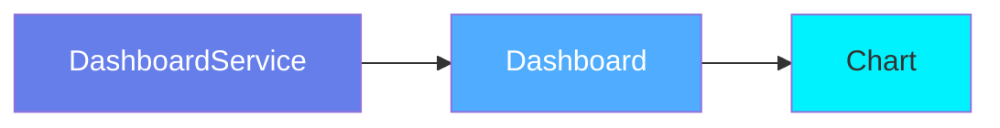

# Dashboard Service

**BI platform connections - Tableau, Looker, Power BI, and more**

---

## Overview

The **DashboardService** entity represents connections to Business Intelligence (BI) and analytics platforms. It serves as the root container for all dashboards, charts, and data models from platforms like Tableau, Looker, Power BI, Metabase, and others.

**Hierarchy**:



---

## Relationships

DashboardService has comprehensive relationships with entities across the metadata platform:

```mermaid
graph TD
    subgraph Service Layer
        A[DashboardService<br/>tableau_prod]
    end

    subgraph Dashboard Assets
        A --> B1[Dashboard:<br/>sales_overview]
        A --> B2[Dashboard:<br/>marketing_analytics]
        A --> B3[Dashboard:<br/>finance_reports]

        B1 --> C1[Chart:<br/>revenue_trend]
        B1 --> C2[Chart:<br/>conversion_funnel]
        B2 --> C3[Chart:<br/>campaign_performance]
        B2 --> C4[Chart:<br/>roi_metrics]
        B3 --> C5[Chart:<br/>budget_variance]
    end

    subgraph Ownership
        A -.->|owned by| D1[Team:<br/>BI Team]
        A -.->|owned by| D2[User:<br/>john.doe]
    end

    subgraph Governance
        A -.->|in domain| E[Domain:<br/>Analytics]
        A -.->|has tags| F1[Tag:<br/>Tier.Gold]
        A -.->|has tags| F2[Tag:<br/>Production]
        A -.->|has tags| F3[Tag:<br/>PII]
    end

    subgraph Data Lineage
        B1 -.->|uses data from| G1[Table:<br/>sales.sales_fact]
        B1 -.->|uses data from| G2[Table:<br/>crm.customers]
        B2 -.->|uses data from| G3[Table:<br/>marketing.campaigns]
        B2 -.->|uses data from| G4[Table:<br/>marketing.leads]
        B3 -.->|uses data from| G5[Table:<br/>finance.budget]

        H1[Pipeline:<br/>sales_etl] -.->|feeds data to| B1
        H2[Pipeline:<br/>marketing_etl] -.->|feeds data to| B2
        H3[Pipeline:<br/>finance_etl] -.->|feeds data to| B3
    end

    subgraph Data Models
        J1[DataModel:<br/>sales_model] --> B1
        J2[DataModel:<br/>marketing_model] --> B2
    end

    style A fill:#667eea,color:#fff,stroke:#4c51bf,stroke-width:3px
    style B1 fill:#4facfe,color:#fff
    style B2 fill:#4facfe,color:#fff
    style B3 fill:#4facfe,color:#fff
    style C1 fill:#00f2fe,color:#333
    style C2 fill:#00f2fe,color:#333
    style C3 fill:#00f2fe,color:#333
    style C4 fill:#00f2fe,color:#333
    style C5 fill:#00f2fe,color:#333
    style D1 fill:#43e97b,color:#fff
    style D2 fill:#43e97b,color:#fff
    style E fill:#fa709a,color:#fff
    style F1 fill:#f093fb,color:#fff
    style F2 fill:#f093fb,color:#fff
    style F3 fill:#f093fb,color:#fff
    style G1 fill:#764ba2,color:#fff
    style G2 fill:#764ba2,color:#fff
    style G3 fill:#764ba2,color:#fff
    style G4 fill:#764ba2,color:#fff
    style G5 fill:#764ba2,color:#fff
    style H1 fill:#f5576c,color:#fff
    style H2 fill:#f5576c,color:#fff
    style H3 fill:#f5576c,color:#fff
    style J1 fill:#00ac69,color:#fff
    style J2 fill:#00ac69,color:#fff
```



**Relationship Types**:

- **Solid lines (→)**: Hierarchical containment (Service hosts Dashboards, Dashboards contain Charts)
- **Dashed lines (-.->)**: References and associations (ownership, governance, lineage)

### Parent Entities
- None (root level entity)

### Child Entities
- **Dashboard**: Dashboards hosted by this service
- **Chart**: Charts (indirectly through dashboards)
- **DataModel**: Data models (for platforms like Looker)

### Associated Entities
- **Owner**: User or team owning this service
- **Domain**: Business domain assignment
- **Tag**: Classification tags
- **Table**: Tables used by dashboards (via lineage)
- **Pipeline**: ETL pipelines feeding dashboard data

---

## Schema Specifications

View the complete DashboardService schema in your preferred format:

=== "JSON Schema"

    **Complete JSON Schema Definition**

    ```json
    {
      "$id": "https://open-metadata.org/schema/entity/services/dashboardService.json",
      "$schema": "http://json-schema.org/draft-07/schema#",
      "title": "Dashboard Service",
      "description": "This schema defines the Dashboard Service entity, such as Looker and Superset.",
      "type": "object",
      "javaType": "org.openmetadata.schema.entity.services.DashboardService",
      "javaInterfaces": [
        "org.openmetadata.schema.EntityInterface",
        "org.openmetadata.schema.ServiceEntityInterface"
      ],

      "definitions": {
        "dashboardServiceType": {
          "description": "Type of Dashboard service - Superset, Looker, Redash, Tableau, Metabase, PowerBi, Mode, or Lightdash",
          "type": "string",
          "javaInterfaces": ["org.openmetadata.schema.EnumInterface"],
          "enum": [
            "Superset", "Looker", "Tableau", "Redash", "Metabase",
            "PowerBI", "PowerBIReportServer", "Mode", "CustomDashboard",
            "DomoDashboard", "QuickSight", "QlikSense", "Lightdash",
            "MicroStrategy", "QlikCloud", "Sigma", "ThoughtSpot",
            "Grafana", "Hex"
          ]
        },
        "dashboardConnection": {
          "type": "object",
          "javaType": "org.openmetadata.schema.type.DashboardConnection",
          "description": "Dashboard Connection.",
          "javaInterfaces": [
            "org.openmetadata.schema.ServiceConnectionEntityInterface"
          ],
          "properties": {
            "config": {
              "mask": true,
              "oneOf": [
                {"$ref": "./connections/dashboard/lookerConnection.json"},
                {"$ref": "./connections/dashboard/metabaseConnection.json"},
                {"$ref": "./connections/dashboard/powerBIConnection.json"},
                {"$ref": "./connections/dashboard/powerBIReportServerConnection.json"},
                {"$ref": "./connections/dashboard/redashConnection.json"},
                {"$ref": "./connections/dashboard/supersetConnection.json"},
                {"$ref": "./connections/dashboard/tableauConnection.json"},
                {"$ref": "./connections/dashboard/modeConnection.json"},
                {"$ref": "./connections/dashboard/customDashboardConnection.json"},
                {"$ref": "./connections/dashboard/domoDashboardConnection.json"},
                {"$ref": "./connections/dashboard/quickSightConnection.json"},
                {"$ref": "./connections/dashboard/qlikSenseConnection.json"},
                {"$ref": "./connections/dashboard/lightdashConnection.json"},
                {"$ref": "./connections/dashboard/microStrategyConnection.json"},
                {"$ref": "./connections/dashboard/qlikCloudConnection.json"},
                {"$ref": "./connections/dashboard/sigmaConnection.json"},
                {"$ref": "./connections/dashboard/thoughtSpotConnection.json"},
                {"$ref": "./connections/dashboard/grafanaConnection.json"},
                {"$ref": "./connections/dashboard/hexConnection.json"}
              ]
            }
          },
          "additionalProperties": false
        }
      },

      "properties": {
        "id": {
          "description": "Unique identifier of this dashboard service instance.",
          "$ref": "../../type/basic.json#/definitions/uuid"
        },
        "name": {
          "description": "Name that identifies this dashboard service.",
          "$ref": "../../type/basic.json#/definitions/entityName"
        },
        "fullyQualifiedName": {
          "description": "FullyQualifiedName same as `name`.",
          "$ref": "../../type/basic.json#/definitions/fullyQualifiedEntityName"
        },
        "displayName": {
          "description": "Display Name that identifies this dashboard service.",
          "type": "string"
        },
        "serviceType": {
          "description": "Type of dashboard service such as Looker or Superset...",
          "$ref": "#/definitions/dashboardServiceType"
        },
        "description": {
          "description": "Description of a dashboard service instance.",
          "$ref": "../../type/basic.json#/definitions/markdown"
        },
        "connection": {
          "$ref": "#/definitions/dashboardConnection"
        },
        "pipelines": {
          "description": "References to pipelines deployed for this dashboard service.",
          "$ref": "../../type/entityReferenceList.json"
        },
        "testConnectionResult": {
          "description": "Last test connection results for this service",
          "$ref": "connections/testConnectionResult.json"
        },
        "tags": {
          "description": "Tags for this Dashboard Service.",
          "type": "array",
          "items": {
            "$ref": "../../type/tagLabel.json"
          },
          "default": []
        },
        "owners": {
          "description": "Owners of this dashboard service.",
          "$ref": "../../type/entityReferenceList.json"
        },
        "version": {
          "description": "Metadata version of the entity.",
          "$ref": "../../type/entityHistory.json#/definitions/entityVersion"
        },
        "updatedAt": {
          "description": "Last update time corresponding to the new version of the entity in Unix epoch time milliseconds.",
          "$ref": "../../type/basic.json#/definitions/timestamp"
        },
        "updatedBy": {
          "description": "User who made the update.",
          "type": "string"
        },
        "impersonatedBy": {
          "description": "Bot user that performed the action on behalf of the actual user.",
          "$ref": "../../type/basic.json#/definitions/impersonatedBy"
        },
        "href": {
          "description": "Link to the resource corresponding to this dashboard service.",
          "$ref": "../../type/basic.json#/definitions/href"
        },
        "changeDescription": {
          "description": "Change that lead to this version of the entity.",
          "$ref": "../../type/entityHistory.json#/definitions/changeDescription"
        },
        "incrementalChangeDescription": {
          "description": "Change that lead to this version of the entity.",
          "$ref": "../../type/entityHistory.json#/definitions/changeDescription"
        },
        "deleted": {
          "description": "When `true` indicates the entity has been soft deleted.",
          "type": "boolean",
          "default": false
        },
        "dataProducts": {
          "description": "List of data products this entity is part of.",
          "$ref": "../../type/entityReferenceList.json"
        },
        "domains": {
          "description": "Domains the Dashboard service belongs to.",
          "$ref": "../../type/entityReferenceList.json"
        },
        "followers": {
          "description": "Followers of this entity.",
          "$ref": "../../type/entityReferenceList.json"
        },
        "ingestionRunner": {
          "description": "The ingestion agent responsible for executing the ingestion pipeline.",
          "$ref": "../../type/entityReference.json"
        }
      },

      "required": ["id", "name", "serviceType"],
      "additionalProperties": false
    }
    ```

    **[View Full JSON Schema →](https://github.com/open-metadata/OpenMetadataStandards/blob/main/schemas/entity/services/dashboardService.json)**

=== "RDF"

    **RDF/OWL Ontology Definition**

    ```turtle
    @prefix om: <https://open-metadata.org/schema/> .
    @prefix rdfs: <http://www.w3.org/2000/01/rdf-schema#> .
    @prefix owl: <http://www.w3.org/2002/07/owl#> .
    @prefix xsd: <http://www.w3.org/2001/XMLSchema#> .

    # DashboardService Class Definition
    om:DashboardService a owl:Class ;
        rdfs:subClassOf om:Service ;
        rdfs:label "Dashboard Service" ;
        rdfs:comment "This schema defines the Dashboard Service entity, such as Looker and Superset." ;
        om:hierarchyLevel 1 .

    # Core Properties
    om:dashboardServiceName a owl:DatatypeProperty ;
        rdfs:domain om:DashboardService ;
        rdfs:range xsd:string ;
        rdfs:label "name" ;
        rdfs:comment "Name that identifies this dashboard service" .

    om:fullyQualifiedName a owl:DatatypeProperty ;
        rdfs:domain om:DashboardService ;
        rdfs:range xsd:string ;
        rdfs:label "fullyQualifiedName" ;
        rdfs:comment "FullyQualifiedName same as name" .

    om:displayName a owl:DatatypeProperty ;
        rdfs:domain om:DashboardService ;
        rdfs:range xsd:string ;
        rdfs:label "displayName" ;
        rdfs:comment "Display Name that identifies this dashboard service" .

    om:description a owl:DatatypeProperty ;
        rdfs:domain om:DashboardService ;
        rdfs:range xsd:string ;
        rdfs:label "description" ;
        rdfs:comment "Description of a dashboard service instance" .

    om:serviceType a owl:DatatypeProperty ;
        rdfs:domain om:DashboardService ;
        rdfs:range om:DashboardServiceType ;
        rdfs:label "serviceType" ;
        rdfs:comment "Type of dashboard service such as Looker or Superset" .

    om:connection a owl:ObjectProperty ;
        rdfs:domain om:DashboardService ;
        rdfs:range om:DashboardConnection ;
        rdfs:label "connection" ;
        rdfs:comment "Connection configuration for the BI platform" .

    # Relationship Properties
    om:hostsDashboard a owl:ObjectProperty ;
        rdfs:domain om:DashboardService ;
        rdfs:range om:Dashboard ;
        rdfs:label "hostsDashboard" ;
        rdfs:comment "Dashboards hosted by this service" .

    om:hasOwner a owl:ObjectProperty ;
        rdfs:domain om:DashboardService ;
        rdfs:range om:EntityReference ;
        rdfs:label "owners" ;
        rdfs:comment "Owners of this dashboard service" .

    om:belongsToDomain a owl:ObjectProperty ;
        rdfs:domain om:DashboardService ;
        rdfs:range om:EntityReference ;
        rdfs:label "domains" ;
        rdfs:comment "Domains the Dashboard service belongs to" .

    om:hasTag a owl:ObjectProperty ;
        rdfs:domain om:DashboardService ;
        rdfs:range om:TagLabel ;
        rdfs:label "tags" ;
        rdfs:comment "Tags for this Dashboard Service" .

    om:hasPipeline a owl:ObjectProperty ;
        rdfs:domain om:DashboardService ;
        rdfs:range om:EntityReference ;
        rdfs:label "pipelines" ;
        rdfs:comment "References to pipelines deployed for this dashboard service" .

    om:hasDataProduct a owl:ObjectProperty ;
        rdfs:domain om:DashboardService ;
        rdfs:range om:EntityReference ;
        rdfs:label "dataProducts" ;
        rdfs:comment "List of data products this entity is part of" .

    om:hasFollower a owl:ObjectProperty ;
        rdfs:domain om:DashboardService ;
        rdfs:range om:EntityReference ;
        rdfs:label "followers" ;
        rdfs:comment "Followers of this entity" .

    om:hasIngestionRunner a owl:ObjectProperty ;
        rdfs:domain om:DashboardService ;
        rdfs:range om:EntityReference ;
        rdfs:label "ingestionRunner" ;
        rdfs:comment "The ingestion agent responsible for executing the ingestion pipeline" .

    # System Properties
    om:deleted a owl:DatatypeProperty ;
        rdfs:domain om:DashboardService ;
        rdfs:range xsd:boolean ;
        rdfs:label "deleted" ;
        rdfs:comment "When true indicates the entity has been soft deleted" .

    om:href a owl:DatatypeProperty ;
        rdfs:domain om:DashboardService ;
        rdfs:range xsd:anyURI ;
        rdfs:label "href" ;
        rdfs:comment "Link to the resource corresponding to this dashboard service" .

    # Dashboard Service Type Enumeration
    om:DashboardServiceType a owl:Class ;
        owl:oneOf (
            om:Superset
            om:Looker
            om:Tableau
            om:Redash
            om:Metabase
            om:PowerBI
            om:PowerBIReportServer
            om:Mode
            om:CustomDashboard
            om:DomoDashboard
            om:QuickSight
            om:QlikSense
            om:Lightdash
            om:MicroStrategy
            om:QlikCloud
            om:Sigma
            om:ThoughtSpot
            om:Grafana
            om:Hex
        ) .

    # Example Instance
    ex:tableauProdService a om:DashboardService ;
        om:id "1a2b3c4d-5e6f-7a8b-9c0d-1e2f3a4b5c6d"^^xsd:string ;
        om:dashboardServiceName "tableau_prod" ;
        om:fullyQualifiedName "tableau_prod" ;
        om:serviceType om:Tableau ;
        om:displayName "Tableau Production" ;
        om:description "Production Tableau server hosting all business dashboards" ;
        om:connection ex:tableauConnection ;
        om:hasOwner ex:biTeam ;
        om:belongsToDomain ex:analyticsDomain ;
        om:hasTag ex:tierGold ;
        om:hasPipeline ex:tableauMetadataPipeline ;
        om:hostsDashboard ex:salesDashboard ;
        om:hostsDashboard ex:marketingDashboard ;
        om:deleted "false"^^xsd:boolean ;
        om:href "https://api.example.com/api/v1/services/dashboardServices/1a2b3c4d-5e6f-7a8b-9c0d-1e2f3a4b5c6d"^^xsd:anyURI .
    ```

    **[View Full RDF Ontology →](https://github.com/open-metadata/OpenMetadataStandards/blob/main/rdf/ontology/openmetadata.ttl)**

=== "JSON-LD"

    **JSON-LD Context and Example**

    ```json
    {
      "@context": {
        "@vocab": "https://open-metadata.org/schema/",
        "om": "https://open-metadata.org/schema/",
        "rdfs": "http://www.w3.org/2000/01/rdf-schema#",
        "xsd": "http://www.w3.org/2001/XMLSchema#",

        "DashboardService": "om:DashboardService",
        "id": {
          "@id": "om:id",
          "@type": "xsd:string"
        },
        "name": {
          "@id": "om:dashboardServiceName",
          "@type": "xsd:string"
        },
        "fullyQualifiedName": {
          "@id": "om:fullyQualifiedName",
          "@type": "xsd:string"
        },
        "displayName": {
          "@id": "om:displayName",
          "@type": "xsd:string"
        },
        "description": {
          "@id": "om:description",
          "@type": "xsd:string"
        },
        "serviceType": {
          "@id": "om:serviceType",
          "@type": "@vocab"
        },
        "connection": {
          "@id": "om:connection",
          "@type": "@id"
        },
        "pipelines": {
          "@id": "om:hasPipeline",
          "@type": "@id",
          "@container": "@set"
        },
        "dashboards": {
          "@id": "om:hostsDashboard",
          "@type": "@id",
          "@container": "@set"
        },
        "owners": {
          "@id": "om:hasOwner",
          "@type": "@id",
          "@container": "@set"
        },
        "domains": {
          "@id": "om:belongsToDomain",
          "@type": "@id",
          "@container": "@set"
        },
        "tags": {
          "@id": "om:hasTag",
          "@type": "@id",
          "@container": "@set"
        },
        "dataProducts": {
          "@id": "om:hasDataProduct",
          "@type": "@id",
          "@container": "@set"
        },
        "followers": {
          "@id": "om:hasFollower",
          "@type": "@id",
          "@container": "@set"
        },
        "ingestionRunner": {
          "@id": "om:hasIngestionRunner",
          "@type": "@id"
        },
        "href": {
          "@id": "om:href",
          "@type": "xsd:anyURI"
        },
        "deleted": {
          "@id": "om:deleted",
          "@type": "xsd:boolean"
        }
      }
    }
    ```

    **Example JSON-LD Instance**:

    ```json
    {
      "@context": "https://open-metadata.org/context/dashboardService.jsonld",
      "@type": "DashboardService",
      "@id": "https://example.com/services/tableau_prod",

      "id": "1a2b3c4d-5e6f-7a8b-9c0d-1e2f3a4b5c6d",
      "name": "tableau_prod",
      "fullyQualifiedName": "tableau_prod",
      "displayName": "Tableau Production",
      "description": "Production Tableau server hosting all business dashboards",
      "serviceType": "Tableau",

      "connection": {
        "@type": "DashboardConnection",
        "config": {
          "type": "Tableau",
          "hostPort": "https://tableau.example.com",
          "username": "api_user",
          "site": "default",
          "env": "PROD"
        }
      },

      "pipelines": [
        {
          "@id": "https://example.com/pipelines/tableau_metadata_pipeline",
          "@type": "Pipeline",
          "name": "tableau_metadata_pipeline"
        }
      ],

      "owners": [
        {
          "@id": "https://example.com/teams/bi-team",
          "@type": "Team",
          "name": "bi-team",
          "displayName": "BI Team"
        }
      ],

      "domains": [
        {
          "@id": "https://example.com/domains/Analytics",
          "@type": "Domain",
          "name": "Analytics"
        }
      ],

      "tags": [
        {
          "@id": "https://open-metadata.org/tags/Tier/Gold",
          "tagFQN": "Tier.Gold"
        }
      ],

      "dashboards": [
        {
          "@id": "https://example.com/dashboards/sales-overview",
          "@type": "Dashboard",
          "name": "sales-overview"
        },
        {
          "@id": "https://example.com/dashboards/marketing-analytics",
          "@type": "Dashboard",
          "name": "marketing-analytics"
        }
      ],

      "dataProducts": [],
      "followers": [],
      "href": "https://api.example.com/api/v1/services/dashboardServices/1a2b3c4d-5e6f-7a8b-9c0d-1e2f3a4b5c6d",
      "deleted": false
    }
    ```

    **[View Full JSON-LD Context →](https://github.com/open-metadata/OpenMetadataStandards/blob/main/rdf/contexts/dashboardService.jsonld)**

---

## Use Cases

- Connect to multiple BI platforms (Tableau, Looker, Power BI, etc.)
- Catalog all dashboards and charts across the organization
- Track dashboard ownership and governance
- Discover and search for business reports
- Capture dashboard lineage to source data
- Apply governance policies to BI assets
- Monitor dashboard usage and adoption
- Centralize documentation for analytics assets

---

## JSON Schema Specification

### Core Properties

#### `id` (uuid)
**Type**: `string` (UUID format)
**Required**: Yes (system-generated)
**Description**: Unique identifier for this dashboard service instance

```json
{
  "id": "1a2b3c4d-5e6f-7a8b-9c0d-1e2f3a4b5c6d"
}
```

---

#### `name` (entityName)
**Type**: `string`
**Required**: Yes
**Pattern**: `^[^.]*$` (no dots allowed)
**Min Length**: 1
**Max Length**: 256
**Description**: Name of the dashboard service (must be unique)

```json
{
  "name": "tableau_prod"
}
```

---

#### `fullyQualifiedName` (fullyQualifiedEntityName)
**Type**: `string`
**Required**: Yes (system-generated)
**Pattern**: `^((?!::).)*$`
**Description**: Fully qualified name (for services, this equals the name)

```json
{
  "fullyQualifiedName": "tableau_prod"
}
```

---

#### `displayName`
**Type**: `string`
**Required**: No
**Description**: Human-readable display name

```json
{
  "displayName": "Tableau Production"
}
```

---

#### `description` (markdown)
**Type**: `string` (Markdown format)
**Required**: No
**Description**: Rich text description of the service

```json
{
  "description": "# Tableau Production\n\nProduction Tableau server hosting all business dashboards for sales, marketing, and finance teams.\n\n## Access\n- URL: https://tableau.example.com\n- Contact: bi-team@example.com"
}
```

---

### Service Configuration

#### `serviceType` (DashboardServiceType enum)
**Type**: `string` enum
**Required**: Yes
**Allowed Values**:

- `Superset` - Apache Superset
- `Looker` - Looker/LookML platform
- `Tableau` - Tableau Server or Tableau Cloud
- `Redash` - Redash
- `Metabase` - Metabase
- `PowerBI` - Microsoft Power BI
- `PowerBIReportServer` - Microsoft Power BI Report Server
- `Mode` - Mode Analytics
- `CustomDashboard` - Custom BI platform
- `DomoDashboard` - Domo
- `QuickSight` - Amazon QuickSight
- `QlikSense` - Qlik Sense
- `Lightdash` - Lightdash
- `MicroStrategy` - MicroStrategy
- `QlikCloud` - Qlik Cloud
- `Sigma` - Sigma Computing
- `ThoughtSpot` - ThoughtSpot
- `Grafana` - Grafana
- `Hex` - Hex

```json
{
  "serviceType": "Tableau"
}
```

---

#### `connection` (DashboardConnection)
**Type**: `object`
**Required**: No
**Description**: Connection configuration specific to the BI platform

The connection object contains a `config` property that references the specific connection type based on the service:

**Connection Object Structure**:

| Property | Type | Required | Description |
|----------|------|----------|-------------|
| `config` | oneOf[connections] | Yes | Service-specific connection configuration (masked for security) |

**Supported Connection Types** (referenced via `oneOf`):

- `lookerConnection.json` - Looker connection
- `metabaseConnection.json` - Metabase connection
- `powerBIConnection.json` - Power BI connection
- `powerBIReportServerConnection.json` - Power BI Report Server connection
- `redashConnection.json` - Redash connection
- `supersetConnection.json` - Superset connection
- `tableauConnection.json` - Tableau connection
- `modeConnection.json` - Mode connection
- `customDashboardConnection.json` - Custom dashboard connection
- `domoDashboardConnection.json` - Domo connection
- `quickSightConnection.json` - QuickSight connection
- `qlikSenseConnection.json` - Qlik Sense connection
- `lightdashConnection.json` - Lightdash connection
- `microStrategyConnection.json` - MicroStrategy connection
- `qlikCloudConnection.json` - Qlik Cloud connection
- `sigmaConnection.json` - Sigma connection
- `thoughtSpotConnection.json` - ThoughtSpot connection
- `grafanaConnection.json` - Grafana connection
- `hexConnection.json` - Hex connection

**Tableau Example**:

```json
{
  "connection": {
    "config": {
      "type": "Tableau",
      "hostPort": "https://tableau.example.com",
      "username": "api_user",
      "apiKey": "encrypted_key",
      "site": "default",
      "env": "PROD"
    }
  }
}
```

**Power BI Example**:

```json
{
  "connection": {
    "config": {
      "type": "PowerBI",
      "hostPort": "https://api.powerbi.com",
      "clientId": "oauth_client_id",
      "clientSecret": "encrypted_secret",
      "tenantId": "tenant-uuid"
    }
  }
}
```

**Looker Example**:

```json
{
  "connection": {
    "config": {
      "type": "Looker",
      "hostPort": "https://looker.example.com:19999",
      "clientId": "looker_client_id",
      "clientSecret": "encrypted_secret"
    }
  }
}
```

---

### Governance Properties

#### `owners` (EntityReferenceList)
**Type**: `array` of entity references
**Required**: No
**Description**: Users or teams that own this service

```json
{
  "owners": [
    {
      "id": "a1b2c3d4-e5f6-7a8b-9c0d-1e2f3a4b5c6d",
      "type": "team",
      "name": "bi-team",
      "displayName": "BI Team"
    },
    {
      "id": "e5f6a7b8-c9d0-1e2f-3a4b-5c6d7e8f9a0b",
      "type": "user",
      "name": "john.doe",
      "displayName": "John Doe"
    }
  ]
}
```

---

#### `domains` (EntityReferenceList)
**Type**: `array` of entity references
**Required**: No
**Description**: Data domains this service belongs to

```json
{
  "domains": [
    {
      "id": "b2c3d4e5-f6a7-8b9c-0d1e-2f3a4b5c6d7e",
      "type": "domain",
      "name": "Analytics",
      "fullyQualifiedName": "Analytics"
    }
  ]
}
```

---

#### `tags[]` (TagLabel[])
**Type**: `array`
**Required**: No
**Default**: `[]`
**Description**: Classification tags applied to the service

```json
{
  "tags": [
    {
      "tagFQN": "Tier.Gold",
      "description": "Production service",
      "source": "Classification",
      "labelType": "Manual",
      "state": "Confirmed"
    }
  ]
}
```

---

#### `pipelines` (EntityReferenceList)
**Type**: `array` of entity references
**Required**: No
**Description**: References to pipelines deployed for this dashboard service

```json
{
  "pipelines": [
    {
      "id": "c1d2e3f4-a5b6-7c8d-9e0f-1a2b3c4d5e6f",
      "type": "pipeline",
      "name": "tableau_metadata_pipeline",
      "fullyQualifiedName": "tableau_prod.tableau_metadata_pipeline"
    }
  ]
}
```

---

#### `testConnectionResult` (TestConnectionResult)
**Type**: `object`
**Required**: No
**Description**: Last test connection results for this service

```json
{
  "testConnectionResult": {
    "status": "successful",
    "lastUpdatedAt": 1704240000000
  }
}
```

---

#### `dataProducts` (EntityReferenceList)
**Type**: `array` of entity references
**Required**: No
**Description**: List of data products this entity is part of

```json
{
  "dataProducts": [
    {
      "id": "d1e2f3a4-b5c6-7d8e-9f0a-1b2c3d4e5f6a",
      "type": "dataProduct",
      "name": "analytics_product",
      "fullyQualifiedName": "analytics_product"
    }
  ]
}
```

---

#### `followers` (EntityReferenceList)
**Type**: `array` of entity references
**Required**: No
**Description**: Followers of this entity

```json
{
  "followers": [
    {
      "id": "e1f2a3b4-c5d6-7e8f-9a0b-1c2d3e4f5a6b",
      "type": "user",
      "name": "jane.smith",
      "displayName": "Jane Smith"
    }
  ]
}
```

---

#### `ingestionRunner` (EntityReference)
**Type**: `object`
**Required**: No
**Description**: The ingestion agent responsible for executing the ingestion pipeline

```json
{
  "ingestionRunner": {
    "id": "f1a2b3c4-d5e6-7f8a-9b0c-1d2e3f4a5b6c",
    "type": "ingestionPipeline",
    "name": "openmetadata_agent",
    "fullyQualifiedName": "openmetadata_agent"
  }
}
```

---

#### `href` (URI)
**Type**: `string` (URI format)
**Required**: No (system-generated)
**Description**: Link to the resource corresponding to this dashboard service

```json
{
  "href": "https://api.example.com/api/v1/services/dashboardServices/1a2b3c4d-5e6f-7a8b-9c0d-1e2f3a4b5c6d"
}
```

---

#### `deleted` (boolean)
**Type**: `boolean`
**Required**: No
**Default**: `false`
**Description**: When `true` indicates the entity has been soft deleted

```json
{
  "deleted": false
}
```

---

### Versioning Properties

#### `version` (entityVersion)
**Type**: `number`
**Required**: Yes (system-managed)
**Description**: Metadata version number, incremented on changes

```json
{
  "version": 1.5
}
```

---

#### `updatedAt` (timestamp)
**Type**: `integer` (Unix epoch milliseconds)
**Required**: Yes (system-managed)
**Description**: Last update timestamp

```json
{
  "updatedAt": 1704240000000
}
```

---

#### `updatedBy` (string)
**Type**: `string`
**Required**: Yes (system-managed)
**Description**: User who made the update

```json
{
  "updatedBy": "admin"
}
```

---

#### `impersonatedBy` (string)
**Type**: `string`
**Required**: No (system-managed)
**Description**: Bot user that performed the action on behalf of the actual user

```json
{
  "impersonatedBy": "ingestion_bot"
}
```

---

#### `changeDescription` (ChangeDescription)
**Type**: `object`
**Required**: No (system-managed)
**Description**: Change that lead to this version of the entity

```json
{
  "changeDescription": {
    "fieldsAdded": [],
    "fieldsUpdated": [
      {
        "name": "description",
        "oldValue": "Old description",
        "newValue": "Updated description"
      }
    ],
    "fieldsDeleted": [],
    "previousVersion": 1.4
  }
}
```

---

#### `incrementalChangeDescription` (ChangeDescription)
**Type**: `object`
**Required**: No (system-managed)
**Description**: Incremental change that lead to this version of the entity

```json
{
  "incrementalChangeDescription": {
    "fieldsAdded": [],
    "fieldsUpdated": [
      {
        "name": "tags",
        "oldValue": [],
        "newValue": [{"tagFQN": "Tier.Gold"}]
      }
    ],
    "fieldsDeleted": [],
    "previousVersion": 1.4
  }
}
```

---

## Complete Example

```json
{
  "id": "1a2b3c4d-5e6f-7a8b-9c0d-1e2f3a4b5c6d",
  "name": "tableau_prod",
  "fullyQualifiedName": "tableau_prod",
  "displayName": "Tableau Production",
  "description": "# Tableau Production\n\nProduction Tableau server hosting all business dashboards.",
  "serviceType": "Tableau",
  "connection": {
    "config": {
      "type": "Tableau",
      "hostPort": "https://tableau.example.com",
      "username": "api_user",
      "apiKey": "encrypted_api_key",
      "site": "default",
      "env": "PROD"
    }
  },
  "pipelines": [
    {
      "id": "c1d2e3f4-a5b6-7c8d-9e0f-1a2b3c4d5e6f",
      "type": "pipeline",
      "name": "tableau_metadata_pipeline"
    }
  ],
  "testConnectionResult": {
    "status": "successful",
    "lastUpdatedAt": 1704240000000
  },
  "tags": [
    {
      "tagFQN": "Tier.Gold",
      "source": "Classification"
    }
  ],
  "owners": [
    {
      "id": "a1b2c3d4-e5f6-7a8b-9c0d-1e2f3a4b5c6d",
      "type": "team",
      "name": "bi-team",
      "displayName": "BI Team"
    }
  ],
  "domains": [
    {
      "id": "b2c3d4e5-f6a7-8b9c-0d1e-2f3a4b5c6d7e",
      "type": "domain",
      "name": "Analytics"
    }
  ],
  "dataProducts": [],
  "followers": [],
  "href": "https://api.example.com/api/v1/services/dashboardServices/1a2b3c4d-5e6f-7a8b-9c0d-1e2f3a4b5c6d",
  "deleted": false,
  "version": 1.5,
  "updatedAt": 1704240000000,
  "updatedBy": "admin"
}
```

---

## RDF Representation

### Ontology Class

```turtle
@prefix om: <https://open-metadata.org/schema/> .
@prefix rdfs: <http://www.w3.org/2000/01/rdf-schema#> .
@prefix owl: <http://www.w3.org/2002/07/owl#> .
@prefix xsd: <http://www.w3.org/2001/XMLSchema#> .

om:DashboardService a owl:Class ;
    rdfs:subClassOf om:Service ;
    rdfs:label "Dashboard Service" ;
    rdfs:comment "This schema defines the Dashboard Service entity, such as Looker and Superset." .

# Core datatype properties
om:dashboardServiceName a owl:DatatypeProperty ;
    rdfs:domain om:DashboardService ;
    rdfs:range xsd:string .

om:serviceType a owl:DatatypeProperty ;
    rdfs:domain om:DashboardService ;
    rdfs:range om:DashboardServiceType .

# Object properties
om:connection a owl:ObjectProperty ;
    rdfs:domain om:DashboardService ;
    rdfs:range om:DashboardConnection .

om:hasOwner a owl:ObjectProperty ;
    rdfs:domain om:DashboardService ;
    rdfs:range om:EntityReference .

om:belongsToDomain a owl:ObjectProperty ;
    rdfs:domain om:DashboardService ;
    rdfs:range om:EntityReference .

om:hasTag a owl:ObjectProperty ;
    rdfs:domain om:DashboardService ;
    rdfs:range om:TagLabel .

om:hasPipeline a owl:ObjectProperty ;
    rdfs:domain om:DashboardService ;
    rdfs:range om:EntityReference .

om:hasDataProduct a owl:ObjectProperty ;
    rdfs:domain om:DashboardService ;
    rdfs:range om:EntityReference .

om:hasFollower a owl:ObjectProperty ;
    rdfs:domain om:DashboardService ;
    rdfs:range om:EntityReference .

om:hasIngestionRunner a owl:ObjectProperty ;
    rdfs:domain om:DashboardService ;
    rdfs:range om:EntityReference .
```

### Instance Example

```turtle
@prefix om: <https://open-metadata.org/schema/> .
@prefix ex: <https://example.com/services/> .
@prefix xsd: <http://www.w3.org/2001/XMLSchema#> .

ex:tableau_prod a om:DashboardService ;
    om:id "1a2b3c4d-5e6f-7a8b-9c0d-1e2f3a4b5c6d"^^xsd:string ;
    om:dashboardServiceName "tableau_prod" ;
    om:fullyQualifiedName "tableau_prod" ;
    om:displayName "Tableau Production" ;
    om:description "Production Tableau server hosting all business dashboards" ;
    om:serviceType om:Tableau ;
    om:connection ex:tableauConnection ;
    om:hasOwner ex:bi_team ;
    om:belongsToDomain ex:analytics_domain ;
    om:hasTag ex:tier_gold ;
    om:hasPipeline ex:tableau_metadata_pipeline ;
    om:hostsDashboard ex:sales_dashboard ;
    om:hostsDashboard ex:marketing_dashboard ;
    om:deleted "false"^^xsd:boolean ;
    om:href "https://api.example.com/api/v1/services/dashboardServices/1a2b3c4d-5e6f-7a8b-9c0d-1e2f3a4b5c6d"^^xsd:anyURI .
```

---

## JSON-LD Context

```json
{
  "@context": {
    "@vocab": "https://open-metadata.org/schema/",
    "om": "https://open-metadata.org/schema/",
    "xsd": "http://www.w3.org/2001/XMLSchema#",

    "DashboardService": "om:DashboardService",
    "id": {
      "@id": "om:id",
      "@type": "xsd:string"
    },
    "name": {
      "@id": "om:dashboardServiceName",
      "@type": "xsd:string"
    },
    "fullyQualifiedName": {
      "@id": "om:fullyQualifiedName",
      "@type": "xsd:string"
    },
    "displayName": {
      "@id": "om:displayName",
      "@type": "xsd:string"
    },
    "description": {
      "@id": "om:description",
      "@type": "xsd:string"
    },
    "serviceType": {
      "@id": "om:serviceType",
      "@type": "@vocab"
    },
    "connection": {
      "@id": "om:connection",
      "@type": "@id"
    },
    "pipelines": {
      "@id": "om:hasPipeline",
      "@type": "@id",
      "@container": "@set"
    },
    "owners": {
      "@id": "om:hasOwner",
      "@type": "@id",
      "@container": "@set"
    },
    "domains": {
      "@id": "om:belongsToDomain",
      "@type": "@id",
      "@container": "@set"
    },
    "tags": {
      "@id": "om:hasTag",
      "@type": "@id",
      "@container": "@set"
    },
    "dataProducts": {
      "@id": "om:hasDataProduct",
      "@type": "@id",
      "@container": "@set"
    },
    "followers": {
      "@id": "om:hasFollower",
      "@type": "@id",
      "@container": "@set"
    },
    "ingestionRunner": {
      "@id": "om:hasIngestionRunner",
      "@type": "@id"
    },
    "href": {
      "@id": "om:href",
      "@type": "xsd:anyURI"
    },
    "deleted": {
      "@id": "om:deleted",
      "@type": "xsd:boolean"
    }
  }
}
```

### JSON-LD Example

```json
{
  "@context": "https://open-metadata.org/context/dashboardService.jsonld",
  "@type": "DashboardService",
  "@id": "https://example.com/services/tableau_prod",

  "id": "1a2b3c4d-5e6f-7a8b-9c0d-1e2f3a4b5c6d",
  "name": "tableau_prod",
  "fullyQualifiedName": "tableau_prod",
  "displayName": "Tableau Production",
  "description": "Production Tableau server hosting all business dashboards",
  "serviceType": "Tableau",

  "connection": {
    "@type": "DashboardConnection",
    "config": {
      "type": "Tableau",
      "hostPort": "https://tableau.example.com"
    }
  },

  "pipelines": [
    {
      "@id": "https://example.com/pipelines/tableau_metadata_pipeline",
      "@type": "Pipeline"
    }
  ],

  "owners": [
    {
      "@id": "https://example.com/teams/bi-team",
      "@type": "Team"
    }
  ],

  "domains": [
    {
      "@id": "https://example.com/domains/Analytics",
      "@type": "Domain"
    }
  ],

  "tags": [
    {"@id": "https://open-metadata.org/tags/Tier/Gold"}
  ],

  "dataProducts": [],
  "followers": [],
  "href": "https://api.example.com/api/v1/services/dashboardServices/1a2b3c4d-5e6f-7a8b-9c0d-1e2f3a4b5c6d",
  "deleted": false
}
```

---

## Custom Properties

This entity supports custom properties through the `extension` field.
Common custom properties include:

- **Data Classification**: Sensitivity level
- **Cost Center**: Billing allocation
- **Retention Period**: Data retention requirements
- **Application Owner**: Owning application/team

See [Custom Properties](../../metadata-specifications/custom-properties.md)
for details on defining and using custom properties.

---

## API Operations

### Create Dashboard Service

```http
POST /api/v1/services/dashboardServices
Content-Type: application/json

{
  "name": "tableau_prod",
  "serviceType": "Tableau",
  "connection": {
    "type": "Tableau",
    "hostPort": "https://tableau.example.com",
    "username": "api_user",
    "site": "default"
  }
}
```

### Get Dashboard Service

```http
GET /api/v1/services/dashboardServices/name/tableau_prod?fields=owner,tags,connection
```

### Update Dashboard Service

```http
PATCH /api/v1/services/dashboardServices/{id}
Content-Type: application/json-patch+json

[
  {
    "op": "add",
    "path": "/tags/-",
    "value": {"tagFQN": "Tier.Gold"}
  }
]
```

### Test Connection

```http
POST /api/v1/services/dashboardServices/testConnection
Content-Type: application/json

{
  "serviceType": "Tableau",
  "connection": {
    "type": "Tableau",
    "hostPort": "https://tableau.example.com",
    "username": "api_user",
    "apiKey": "test_key"
  }
}
```

### Delete Dashboard Service

```http
DELETE /api/v1/services/dashboardServices/{id}?recursive=true&hardDelete=false
```

---

## Related Documentation

- **[Dashboard](dashboard.md)** - Dashboard entity specification
- **[Chart](chart.md)** - Chart entity specification
- **[Services Overview](../../services/overview.md)** - Service concepts
- **[Lineage](../../lineage/overview.md)** - Dashboard lineage
- **[Governance](../../governance/overview.md)** - Governance policies
