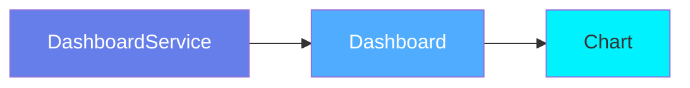

# Dashboard

**BI reports and analytics dashboards - the interface to data insights**

---

## Overview

The **Dashboard** entity represents business intelligence reports, analytics dashboards, and data visualizations from BI platforms. It captures dashboard metadata, charts, data sources, and usage patterns across tools like Tableau, Looker, Power BI, and others.

**Hierarchy**:


---

## Relationships

Dashboard has comprehensive relationships with entities across the metadata platform:

```mermaid
graph TD
    subgraph Service
        A[DashboardService:<br/>tableau_prod]
    end

    subgraph Dashboard Layer
        A --> B[Dashboard:<br/>Sales Performance Q4]
    end

    subgraph Charts
        B --> C1[Chart:<br/>Revenue Trend]
        B --> C2[Chart:<br/>Conversion Funnel]
        B --> C3[Chart:<br/>Regional Sales Map]
        B --> C4[Chart:<br/>Top Products]
    end

    subgraph Ownership
        B -.->|owned by| D1[Team:<br/>Sales Analytics]
        B -.->|owned by| D2[User:<br/>analytics.lead]
    end

    subgraph Governance
        B -.->|in domain| E[Domain:<br/>Sales]
        B -.->|has tags| F1[Tag:<br/>Executive]
        B -.->|has tags| F2[Tag:<br/>Quarterly]
        B -.->|has tags| F3[Tag:<br/>PII]

        B -.->|described by| G1[GlossaryTerm:<br/>Revenue]
        B -.->|described by| G2[GlossaryTerm:<br/>Conversion Rate]
    end

    subgraph Data Sources
        C1 -.->|reads from| H1[Table:<br/>sales.revenue_daily]
        C2 -.->|reads from| H2[Table:<br/>sales.funnel_metrics]
        C3 -.->|reads from| H3[Table:<br/>sales.regional_agg]
        C4 -.->|reads from| H4[Table:<br/>sales.product_sales]

        I1[DataModel:<br/>Sales Mart] -.->|powers| B
    end

    subgraph Upstream Lineage
        J1[Pipeline:<br/>sales_etl] -.->|feeds data to| H1
        J2[Pipeline:<br/>metrics_aggregation] -.->|feeds data to| H2
    end

    subgraph Usage & Access
        K1[User:<br/>sarah.johnson] -.->|views| B
        K2[User:<br/>mike.chen] -.->|views| B
        K3[User:<br/>exec.team] -.->|subscribes to| B
    end

    subgraph Quality & Monitoring
        L1[TestCase:<br/>data_freshness_check] -.->|validates| B
        L2[Dashboard:<br/>Usage Analytics] -.->|monitors| B
    end

    style A fill:#667eea,color:#fff
    style B fill:#4facfe,color:#fff,stroke:#4c51bf,stroke-width:3px
    style C1 fill:#00f2fe,color:#333
    style C2 fill:#00f2fe,color:#333
    style C3 fill:#00f2fe,color:#333
    style C4 fill:#00f2fe,color:#333
    style D1 fill:#43e97b,color:#fff
    style D2 fill:#43e97b,color:#fff
    style E fill:#fa709a,color:#fff
    style F1 fill:#f093fb,color:#fff
    style F2 fill:#f093fb,color:#fff
    style F3 fill:#f093fb,color:#fff
    style G1 fill:#ffd700,color:#333
    style G2 fill:#ffd700,color:#333
    style H1 fill:#764ba2,color:#fff
    style H2 fill:#764ba2,color:#fff
    style H3 fill:#764ba2,color:#fff
    style H4 fill:#764ba2,color:#fff
    style I1 fill:#00ac69,color:#fff
    style J1 fill:#f5576c,color:#fff
    style J2 fill:#f5576c,color:#fff
    style K1 fill:#ff6b6b,color:#fff
    style K2 fill:#ff6b6b,color:#fff
    style K3 fill:#ff6b6b,color:#fff
    style L1 fill:#9b59b6,color:#fff
    style L2 fill:#9b59b6,color:#fff
```



**Relationship Types**:

- **Solid lines (→)**: Hierarchical containment (Service hosts Dashboard, Dashboard contains Charts)
- **Dashed lines (-.->)**: References and associations (ownership, governance, data sources, usage, lineage, quality)

---

### Parent Entities
- **DashboardService**: The BI platform hosting this dashboard

### Child Entities
- **Chart**: Individual visualizations within the dashboard

### Associated Entities
- **Owner**: User or team owning this dashboard
- **Domain**: Business domain assignment
- **Tag**: Classification tags
- **GlossaryTerm**: Business terminology
- **Table**: Tables used as data sources (via lineage)
- **DataModel**: Data models or datasets used
- **User**: Users who have accessed the dashboard
- **Pipeline**: ETL pipelines feeding the source data
- **TestCase**: Data quality tests validating dashboard freshness

---

## Schema Specifications

View the complete Dashboard schema in your preferred format:

=== "JSON Schema"

    **Complete JSON Schema Definition**

    ```json
    {
      "$id": "https://open-metadata.org/schema/entity/data/dashboard.json",
      "$schema": "http://json-schema.org/draft-07/schema#",
      "title": "Dashboard",
      "description": "A `Dashboard` entity represents a BI dashboard containing multiple visualizations and charts.",
      "type": "object",
      "javaType": "org.openmetadata.schema.entity.data.Dashboard",

      "definitions": {
        "dashboardType": {
          "description": "Type of dashboard",
          "type": "string",
          "enum": [
            "Dashboard", "Report", "Story", "Workbook",
            "Analysis", "Exploration"
          ]
        }
      },

      "properties": {
        "id": {
          "description": "Unique identifier",
          "$ref": "../../type/basic.json#/definitions/uuid"
        },
        "name": {
          "description": "Dashboard name",
          "$ref": "../../type/basic.json#/definitions/entityName"
        },
        "fullyQualifiedName": {
          "description": "Fully qualified name: service.dashboard",
          "$ref": "../../type/basic.json#/definitions/fullyQualifiedEntityName"
        },
        "displayName": {
          "description": "Display name",
          "type": "string"
        },
        "description": {
          "description": "Markdown description",
          "$ref": "../../type/basic.json#/definitions/markdown"
        },
        "dashboardType": {
          "$ref": "#/definitions/dashboardType"
        },
        "dashboardUrl": {
          "description": "External URL to access dashboard",
          "type": "string",
          "format": "uri"
        },
        "charts": {
          "description": "Charts in this dashboard",
          "type": "array",
          "items": {
            "$ref": "../../type/entityReference.json"
          }
        },
        "dataModels": {
          "description": "Data models used by dashboard",
          "type": "array",
          "items": {
            "$ref": "../../type/entityReference.json"
          }
        },
        "project": {
          "description": "Project or workspace name",
          "type": "string"
        },
        "service": {
          "description": "Dashboard service",
          "$ref": "../../type/entityReference.json"
        },
        "owner": {
          "description": "Owner (user or team)",
          "$ref": "../../type/entityReference.json"
        },
        "domain": {
          "description": "Data domain",
          "$ref": "../../type/entityReference.json"
        },
        "tags": {
          "description": "Classification tags",
          "type": "array",
          "items": {
            "$ref": "../../type/tagLabel.json"
          }
        },
        "glossaryTerms": {
          "description": "Business glossary terms",
          "type": "array",
          "items": {
            "$ref": "../../type/entityReference.json"
          }
        },
        "usageSummary": {
          "description": "Usage statistics",
          "$ref": "../../type/usageDetails.json"
        },
        "version": {
          "description": "Metadata version",
          "$ref": "../../type/entityHistory.json#/definitions/entityVersion"
        }
      },

      "required": ["id", "name", "service"]
    }
    ```

    **[View Full JSON Schema →](https://github.com/open-metadata/OpenMetadataStandards/blob/main/schemas/entity/data/dashboard.json)**

=== "RDF"

    **RDF/OWL Ontology Definition**

    ```turtle
    @prefix om: <https://open-metadata.org/schema/> .
    @prefix rdfs: <http://www.w3.org/2000/01/rdf-schema#> .
    @prefix owl: <http://www.w3.org/2001/XMLSchema#> .
    @prefix xsd: <http://www.w3.org/2001/XMLSchema#> .

    # Dashboard Class Definition
    om:Dashboard a owl:Class ;
        rdfs:subClassOf om:DataAsset ;
        rdfs:label "Dashboard" ;
        rdfs:comment "A BI dashboard or report containing data visualizations" ;
        om:hierarchyLevel 2 .

    # Properties
    om:dashboardName a owl:DatatypeProperty ;
        rdfs:domain om:Dashboard ;
        rdfs:range xsd:string ;
        rdfs:label "name" ;
        rdfs:comment "Name of the dashboard" .

    om:fullyQualifiedName a owl:DatatypeProperty ;
        rdfs:domain om:Dashboard ;
        rdfs:range xsd:string ;
        rdfs:label "fullyQualifiedName" ;
        rdfs:comment "Complete hierarchical name: service.dashboard" .

    om:dashboardType a owl:DatatypeProperty ;
        rdfs:domain om:Dashboard ;
        rdfs:range om:DashboardType ;
        rdfs:label "dashboardType" ;
        rdfs:comment "Type: Dashboard, Report, Story, etc." .

    om:dashboardUrl a owl:DatatypeProperty ;
        rdfs:domain om:Dashboard ;
        rdfs:range xsd:anyURI ;
        rdfs:label "dashboardUrl" ;
        rdfs:comment "External URL to access the dashboard" .

    om:hasChart a owl:ObjectProperty ;
        rdfs:domain om:Dashboard ;
        rdfs:range om:Chart ;
        rdfs:label "hasChart" ;
        rdfs:comment "Charts contained in this dashboard" .

    om:usesDataModel a owl:ObjectProperty ;
        rdfs:domain om:Dashboard ;
        rdfs:range om:DataModel ;
        rdfs:label "usesDataModel" ;
        rdfs:comment "Data models used by this dashboard" .

    om:belongsToService a owl:ObjectProperty ;
        rdfs:domain om:Dashboard ;
        rdfs:range om:DashboardService ;
        rdfs:label "belongsToService" ;
        rdfs:comment "Dashboard service hosting this dashboard" .

    om:ownedBy a owl:ObjectProperty ;
        rdfs:domain om:Dashboard ;
        rdfs:range om:Owner ;
        rdfs:label "ownedBy" ;
        rdfs:comment "User or team that owns this dashboard" .

    om:hasTag a owl:ObjectProperty ;
        rdfs:domain om:Dashboard ;
        rdfs:range om:Tag ;
        rdfs:label "hasTag" ;
        rdfs:comment "Classification tags applied to dashboard" .

    om:linkedToGlossaryTerm a owl:ObjectProperty ;
        rdfs:domain om:Dashboard ;
        rdfs:range om:GlossaryTerm ;
        rdfs:label "linkedToGlossaryTerm" ;
        rdfs:comment "Business glossary terms" .

    # Dashboard Type Enumeration
    om:DashboardType a owl:Class ;
        owl:oneOf (
            om:DashboardType_Dashboard
            om:DashboardType_Report
            om:DashboardType_Story
            om:DashboardType_Workbook
        ) .

    # Example Instance
    ex:salesOverview a om:Dashboard ;
        om:dashboardName "sales_overview" ;
        om:fullyQualifiedName "tableau_prod.sales_overview" ;
        om:displayName "Sales Overview Dashboard" ;
        om:dashboardType om:DashboardType_Dashboard ;
        om:dashboardUrl "https://tableau.example.com/views/sales_overview" ;
        om:belongsToService ex:tableauProdService ;
        om:ownedBy ex:salesTeam ;
        om:hasTag ex:tierGold ;
        om:linkedToGlossaryTerm ex:revenueTerm ;
        om:hasChart ex:monthlySalesChart ;
        om:hasChart ex:regionalBreakdownChart .
    ```

    **[View Full RDF Ontology →](https://github.com/open-metadata/OpenMetadataStandards/blob/main/rdf/ontology/openmetadata.ttl)**

=== "JSON-LD"

    **JSON-LD Context and Example**

    ```json
    {
      "@context": {
        "@vocab": "https://open-metadata.org/schema/",
        "om": "https://open-metadata.org/schema/",
        "rdfs": "http://www.w3.org/2000/01/rdf-schema#",
        "xsd": "http://www.w3.org/2001/XMLSchema#",

        "Dashboard": "om:Dashboard",
        "name": {
          "@id": "om:dashboardName",
          "@type": "xsd:string"
        },
        "fullyQualifiedName": {
          "@id": "om:fullyQualifiedName",
          "@type": "xsd:string"
        },
        "displayName": {
          "@id": "om:displayName",
          "@type": "xsd:string"
        },
        "description": {
          "@id": "om:description",
          "@type": "xsd:string"
        },
        "dashboardType": {
          "@id": "om:dashboardType",
          "@type": "@vocab"
        },
        "dashboardUrl": {
          "@id": "om:dashboardUrl",
          "@type": "xsd:anyURI"
        },
        "charts": {
          "@id": "om:hasChart",
          "@type": "@id",
          "@container": "@list"
        },
        "dataModels": {
          "@id": "om:usesDataModel",
          "@type": "@id",
          "@container": "@set"
        },
        "service": {
          "@id": "om:belongsToService",
          "@type": "@id"
        },
        "owner": {
          "@id": "om:ownedBy",
          "@type": "@id"
        },
        "domain": {
          "@id": "om:inDomain",
          "@type": "@id"
        },
        "tags": {
          "@id": "om:hasTag",
          "@type": "@id",
          "@container": "@set"
        },
        "glossaryTerms": {
          "@id": "om:linkedToGlossaryTerm",
          "@type": "@id",
          "@container": "@set"
        }
      }
    }
    ```

    **Example JSON-LD Instance**:

    ```json
    {
      "@context": "https://open-metadata.org/context/dashboard.jsonld",
      "@type": "Dashboard",
      "@id": "https://example.com/dashboards/sales_overview",

      "name": "sales_overview",
      "fullyQualifiedName": "tableau_prod.sales_overview",
      "displayName": "Sales Overview Dashboard",
      "description": "Executive dashboard showing sales performance metrics",
      "dashboardType": "Dashboard",
      "dashboardUrl": "https://tableau.example.com/views/sales_overview",

      "service": {
        "@id": "https://example.com/services/tableau_prod",
        "@type": "DashboardService",
        "name": "tableau_prod"
      },

      "owner": {
        "@id": "https://example.com/teams/sales-team",
        "@type": "Team",
        "name": "sales-team",
        "displayName": "Sales Team"
      },

      "tags": [
        {
          "@id": "https://open-metadata.org/tags/Tier/Gold",
          "tagFQN": "Tier.Gold"
        }
      ],

      "glossaryTerms": [
        {
          "@id": "https://example.com/glossary/Revenue",
          "@type": "GlossaryTerm",
          "fullyQualifiedName": "BusinessGlossary.Revenue"
        }
      ],

      "charts": [
        {
          "@type": "Chart",
          "@id": "https://example.com/charts/monthly_sales",
          "name": "monthly_sales",
          "displayName": "Monthly Sales Trend"
        },
        {
          "@type": "Chart",
          "@id": "https://example.com/charts/regional_breakdown",
          "name": "regional_breakdown",
          "displayName": "Sales by Region"
        }
      ]
    }
    ```

    **[View Full JSON-LD Context →](https://github.com/open-metadata/OpenMetadataStandards/blob/main/rdf/contexts/dashboard.jsonld)**

---

## Use Cases

- Catalog all BI dashboards across the organization
- Document dashboard purpose, metrics, and KPIs
- Track dashboard ownership and stakeholders
- Discover dashboards by business domain or topic
- Capture lineage from source tables to dashboards
- Monitor dashboard usage and adoption
- Apply governance tags to sensitive dashboards
- Centralize documentation for business reports
- Track dashboard dependencies and refresh schedules

---

## JSON Schema Specification

### Core Properties

#### `id` (uuid)
**Type**: `string` (UUID format)
**Required**: Yes (system-generated)
**Description**: Unique identifier for this dashboard instance

```json
{
  "id": "2b3c4d5e-6f7a-8b9c-0d1e-2f3a4b5c6d7e"
}
```

---

#### `name` (entityName)
**Type**: `string`
**Required**: Yes
**Pattern**: `^[^.]*$` (no dots allowed)
**Min Length**: 1
**Max Length**: 256
**Description**: Name of the dashboard (unqualified)

```json
{
  "name": "sales_overview"
}
```

---

#### `fullyQualifiedName` (fullyQualifiedEntityName)
**Type**: `string`
**Required**: Yes (system-generated)
**Pattern**: `^((?!::).)*$`
**Description**: Fully qualified name in the format `service.dashboard`

```json
{
  "fullyQualifiedName": "tableau_prod.sales_overview"
}
```

---

#### `displayName`
**Type**: `string`
**Required**: No
**Description**: Human-readable display name

```json
{
  "displayName": "Sales Overview Dashboard"
}
```

---

#### `description` (markdown)
**Type**: `string` (Markdown format)
**Required**: No
**Description**: Rich text description of the dashboard's purpose and usage

```json
{
  "description": "# Sales Overview Dashboard\n\nExecutive dashboard showing sales performance metrics across all regions.\n\n## Key Metrics\n- Total Revenue\n- Sales Growth %\n- Regional Breakdown\n- Top Products\n\n## Refresh Schedule\nUpdated daily at 6 AM EST"
}
```

---

### Dashboard Configuration

#### `dashboardType` (DashboardType enum)
**Type**: `string` enum
**Required**: No (default: `Dashboard`)
**Allowed Values**:

- `Dashboard` - Interactive dashboard
- `Report` - Static report
- `Story` - Data story/narrative (Tableau)
- `Workbook` - Collection of dashboards (Excel, Tableau)
- `Analysis` - Ad-hoc analysis
- `Exploration` - Data exploration view

```json
{
  "dashboardType": "Dashboard"
}
```

---

#### `dashboardUrl` (uri)
**Type**: `string` (URI format)
**Required**: No
**Description**: External URL to access the dashboard in the BI tool

```json
{
  "dashboardUrl": "https://tableau.example.com/views/sales_overview"
}
```

---

#### `project` (string)
**Type**: `string`
**Required**: No
**Description**: Project, workspace, or folder containing this dashboard

```json
{
  "project": "Sales Analytics"
}
```

---

### Content Properties

#### `charts[]` (Chart[])
**Type**: `array` of Chart entity references
**Required**: No
**Description**: Charts and visualizations within this dashboard

```json
{
  "charts": [
    {
      "id": "chart-1-uuid",
      "type": "chart",
      "name": "monthly_sales",
      "displayName": "Monthly Sales Trend",
      "fullyQualifiedName": "tableau_prod.sales_overview.monthly_sales"
    },
    {
      "id": "chart-2-uuid",
      "type": "chart",
      "name": "regional_breakdown",
      "displayName": "Sales by Region",
      "fullyQualifiedName": "tableau_prod.sales_overview.regional_breakdown"
    },
    {
      "id": "chart-3-uuid",
      "type": "chart",
      "name": "top_products",
      "displayName": "Top 10 Products",
      "fullyQualifiedName": "tableau_prod.sales_overview.top_products"
    }
  ]
}
```

---

#### `dataModels[]` (DataModel[])
**Type**: `array` of DataModel entity references
**Required**: No
**Description**: Data models or datasets used by this dashboard (e.g., Looker LookML models)

```json
{
  "dataModels": [
    {
      "id": "model-1-uuid",
      "type": "dataModel",
      "name": "sales_model",
      "fullyQualifiedName": "looker_prod.sales_model"
    }
  ]
}
```

---

### Location Properties

#### `service` (EntityReference)
**Type**: `object`
**Required**: Yes
**Description**: Reference to parent dashboard service

```json
{
  "service": {
    "id": "service-uuid",
    "type": "dashboardService",
    "name": "tableau_prod",
    "fullyQualifiedName": "tableau_prod"
  }
}
```

---

### Governance Properties

#### `owner` (EntityReference)
**Type**: `object`
**Required**: No
**Description**: User or team that owns this dashboard

```json
{
  "owner": {
    "id": "owner-uuid",
    "type": "team",
    "name": "sales-team",
    "displayName": "Sales Team"
  }
}
```

---

#### `domain` (EntityReference)
**Type**: `object`
**Required**: No
**Description**: Data domain this dashboard belongs to

```json
{
  "domain": {
    "id": "domain-uuid",
    "type": "domain",
    "name": "Sales",
    "fullyQualifiedName": "Sales"
  }
}
```

---

#### `tags[]` (TagLabel[])
**Type**: `array`
**Required**: No
**Description**: Classification tags applied to the dashboard

```json
{
  "tags": [
    {
      "tagFQN": "Tier.Gold",
      "description": "Critical executive dashboard",
      "source": "Classification",
      "labelType": "Manual",
      "state": "Confirmed"
    },
    {
      "tagFQN": "BusinessCritical",
      "source": "Classification",
      "labelType": "Manual",
      "state": "Confirmed"
    }
  ]
}
```

---

#### `glossaryTerms[]` (GlossaryTerm[])
**Type**: `array`
**Required**: No
**Description**: Business glossary terms linked to this dashboard

```json
{
  "glossaryTerms": [
    {
      "fullyQualifiedName": "BusinessGlossary.Revenue"
    },
    {
      "fullyQualifiedName": "BusinessGlossary.SalesRegion"
    }
  ]
}
```

---

### Usage Properties

#### `usageSummary` (UsageDetails)
**Type**: `object`
**Required**: No (system-generated)
**Description**: Dashboard usage statistics

```json
{
  "usageSummary": {
    "dailyStats": {
      "count": 45,
      "percentileRank": 92.5
    },
    "weeklyStats": {
      "count": 287,
      "percentileRank": 88.3
    },
    "monthlyStats": {
      "count": 1243,
      "percentileRank": 95.1
    },
    "date": "2024-01-15"
  }
}
```

---

### Versioning Properties

#### `version` (entityVersion)
**Type**: `number`
**Required**: Yes (system-managed)
**Description**: Metadata version number, incremented on changes

```json
{
  "version": 1.8
}
```

---

#### `updatedAt` (timestamp)
**Type**: `integer` (Unix epoch milliseconds)
**Required**: Yes (system-managed)
**Description**: Last update timestamp

```json
{
  "updatedAt": 1704240000000
}
```

---

#### `updatedBy` (string)
**Type**: `string`
**Required**: Yes (system-managed)
**Description**: User who made the update

```json
{
  "updatedBy": "john.doe"
}
```

---

## Complete Example

```json
{
  "id": "2b3c4d5e-6f7a-8b9c-0d1e-2f3a4b5c6d7e",
  "name": "sales_overview",
  "fullyQualifiedName": "tableau_prod.sales_overview",
  "displayName": "Sales Overview Dashboard",
  "description": "# Sales Overview Dashboard\n\nExecutive dashboard showing sales performance metrics across all regions.",
  "dashboardType": "Dashboard",
  "dashboardUrl": "https://tableau.example.com/views/sales_overview",
  "project": "Sales Analytics",
  "charts": [
    {
      "id": "chart-1-uuid",
      "type": "chart",
      "name": "monthly_sales",
      "displayName": "Monthly Sales Trend"
    },
    {
      "id": "chart-2-uuid",
      "type": "chart",
      "name": "regional_breakdown",
      "displayName": "Sales by Region"
    }
  ],
  "service": {
    "id": "service-uuid",
    "type": "dashboardService",
    "name": "tableau_prod"
  },
  "owner": {
    "id": "owner-uuid",
    "type": "team",
    "name": "sales-team",
    "displayName": "Sales Team"
  },
  "domain": {
    "id": "domain-uuid",
    "type": "domain",
    "name": "Sales"
  },
  "tags": [
    {"tagFQN": "Tier.Gold"},
    {"tagFQN": "BusinessCritical"}
  ],
  "glossaryTerms": [
    {"fullyQualifiedName": "BusinessGlossary.Revenue"}
  ],
  "usageSummary": {
    "dailyStats": {
      "count": 45,
      "percentileRank": 92.5
    },
    "weeklyStats": {
      "count": 287,
      "percentileRank": 88.3
    },
    "date": "2024-01-15"
  },
  "version": 1.8,
  "updatedAt": 1704240000000,
  "updatedBy": "john.doe"
}
```

---

## RDF Representation

### Ontology Class

```turtle
@prefix om: <https://open-metadata.org/schema/> .
@prefix rdfs: <http://www.w3.org/2000/01/rdf-schema#> .
@prefix owl: <http://www.w3.org/2001/XMLSchema#> .

om:Dashboard a owl:Class ;
    rdfs:subClassOf om:DataAsset ;
    rdfs:label "Dashboard" ;
    rdfs:comment "A BI dashboard or report" ;
    om:hasProperties [
        om:name "string" ;
        om:dashboardType "DashboardType" ;
        om:dashboardUrl "uri" ;
        om:charts "Chart[]" ;
        om:service "DashboardService" ;
        om:owner "Owner" ;
        om:tags "Tag[]" ;
    ] .
```

### Instance Example

```turtle
@prefix om: <https://open-metadata.org/schema/> .
@prefix ex: <https://example.com/dashboards/> .

ex:sales_overview a om:Dashboard ;
    om:name "sales_overview" ;
    om:fullyQualifiedName "tableau_prod.sales_overview" ;
    om:displayName "Sales Overview Dashboard" ;
    om:description "Executive sales dashboard" ;
    om:dashboardType "Dashboard" ;
    om:dashboardUrl "https://tableau.example.com/views/sales_overview" ;
    om:belongsToService ex:tableau_prod ;
    om:ownedBy ex:sales_team ;
    om:hasTag ex:tier_gold ;
    om:linkedToGlossaryTerm ex:revenue_term ;
    om:hasChart ex:monthly_sales_chart ;
    om:hasChart ex:regional_breakdown_chart .
```

---

## JSON-LD Context

```json
{
  "@context": {
    "@vocab": "https://open-metadata.org/schema/",
    "Dashboard": "om:Dashboard",
    "name": "om:name",
    "fullyQualifiedName": "om:fullyQualifiedName",
    "displayName": "om:displayName",
    "dashboardType": {
      "@id": "om:dashboardType",
      "@type": "@vocab"
    },
    "dashboardUrl": {
      "@id": "om:dashboardUrl",
      "@type": "xsd:anyURI"
    },
    "charts": {
      "@id": "om:hasChart",
      "@type": "@id",
      "@container": "@list"
    },
    "service": {
      "@id": "om:belongsToService",
      "@type": "@id"
    },
    "owner": {
      "@id": "om:ownedBy",
      "@type": "@id"
    },
    "tags": {
      "@id": "om:hasTag",
      "@type": "@id",
      "@container": "@set"
    }
  }
}
```

---

## Custom Properties

This entity supports custom properties through the `extension` field.
Common custom properties include:

- **Data Classification**: Sensitivity level
- **Cost Center**: Billing allocation
- **Retention Period**: Data retention requirements
- **Application Owner**: Owning application/team

See [Custom Properties](../../metadata-specifications/custom-properties.md)
for details on defining and using custom properties.

---

## Followers

Users can follow dashboards to receive notifications about updates, chart changes, and data source modifications. See **[Followers](../../metadata-specifications/followers.md)** for details.

---

## API Operations

All Dashboard operations are available under the `/v1/dashboards` endpoint.

### List Dashboards

Get a list of dashboards, optionally filtered by service.

```http
GET /v1/dashboards
Query Parameters:
  - fields: Fields to include (charts, tags, owner, usageSummary, dataModels, etc.)
  - service: Filter by dashboard service name
  - limit: Number of results (1-1000000, default 10)
  - before/after: Cursor-based pagination
  - include: all | deleted | non-deleted (default: non-deleted)

Response: DashboardList
```

### Create Dashboard

Create a new dashboard under a dashboard service.

```http
POST /v1/dashboards
Content-Type: application/json

{
  "name": "sales_overview",
  "service": "tableau_prod",
  "displayName": "Sales Overview Dashboard",
  "description": "Executive sales performance dashboard",
  "dashboardUrl": "https://tableau.example.com/views/sales_overview",
  "dashboardType": "Dashboard",
  "charts": [
    {
      "id": "chart-1-uuid",
      "type": "chart"
    },
    {
      "id": "chart-2-uuid",
      "type": "chart"
    }
  ],
  "dataModels": [
    {
      "id": "model-uuid",
      "type": "dashboardDataModel"
    }
  ],
  "tags": [
    {"tagFQN": "BusinessCritical"}
  ]
}

Response: Dashboard
```

### Get Dashboard by Name

Get a dashboard by its fully qualified name.

```http
GET /v1/dashboards/name/{fqn}
Query Parameters:
  - fields: Fields to include (charts, tags, owner, usageSummary, dataModels, etc.)
  - include: all | deleted | non-deleted

Example:
GET /v1/dashboards/name/tableau_prod.sales_overview?fields=charts,tags,owner,usageSummary

Response: Dashboard
```

### Get Dashboard by ID

Get a dashboard by its unique identifier.

```http
GET /v1/dashboards/{id}
Query Parameters:
  - fields: Fields to include
  - include: all | deleted | non-deleted

Response: Dashboard
```

### Update Dashboard

Update a dashboard using JSON Patch.

```http
PATCH /v1/dashboards/name/{fqn}
Content-Type: application/json-patch+json

[
  {"op": "add", "path": "/tags/-", "value": {"tagFQN": "Tier.Gold"}},
  {"op": "replace", "path": "/description", "value": "Updated sales dashboard"},
  {"op": "add", "path": "/owner", "value": {"id": "...", "type": "team"}}
]

Response: Dashboard
```

### Create or Update Dashboard

Create a new dashboard or update if it exists.

```http
PUT /v1/dashboards
Content-Type: application/json

{
  "name": "revenue_analytics",
  "service": "powerbi_prod",
  "dashboardUrl": "...",
  "charts": [...]
}

Response: Dashboard
```

### Delete Dashboard

Delete a dashboard by fully qualified name.

```http
DELETE /v1/dashboards/name/{fqn}
Query Parameters:
  - hardDelete: Permanently delete (default: false)

Response: 200 OK
```

### Update Dashboard Charts

Update the charts associated with a dashboard.

```http
PUT /v1/dashboards/{id}/charts
Content-Type: application/json

{
  "charts": [
    {"id": "chart-uuid-1", "type": "chart"},
    {"id": "chart-uuid-2", "type": "chart"}
  ]
}

Response: Dashboard
```

### Get Dashboard Usage

Get usage statistics for a dashboard.

```http
GET /v1/dashboards/{id}/usage
Query Parameters:
  - days: Number of days for usage data (default: 30)

Response: UsageDetails (view count, users, etc.)
```

### Get Dashboard Versions

Get all versions of a dashboard.

```http
GET /v1/dashboards/{id}/versions

Response: EntityHistory
```

### Follow Dashboard

Add a follower to a dashboard.

```http
PUT /v1/dashboards/{id}/followers/{userId}

Response: ChangeEvent
```

### Get Followers

Get all followers of a dashboard.

```http
GET /v1/dashboards/{id}/followers

Response: EntityReference[]
```

### Vote on Dashboard

Upvote or downvote a dashboard.

```http
PUT /v1/dashboards/{id}/vote
Content-Type: application/json

{
  "vote": "upvote"
}

Response: ChangeEvent
```

### Bulk Operations

Create or update multiple dashboards.

```http
PUT /v1/dashboards/bulk
Content-Type: application/json

{
  "entities": [...]
}

Response: BulkOperationResult
```

---

## Related Documentation

- **[Dashboard Service](dashboard-service.md)** - Service configuration
- **[Chart](chart.md)** - Chart entity specification
- **[Lineage](../../lineage/overview.md)** - Dashboard lineage
- **[Usage Analytics](../../analytics/usage.md)** - Usage tracking
- **[Governance](../../governance/overview.md)** - Governance policies
