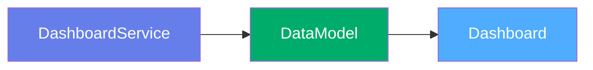

# Data Model

**BI semantic layers and data models - Looker LookML, dbt models, Power BI datasets**

---

## Overview

The **DataModel** entity represents semantic data models, business logic layers, and dataset definitions used by BI and analytics tools. It captures the abstraction layer between raw data and visualizations, including LookML models in Looker, dbt models, Power BI datasets, Tableau data sources, and other business semantic layers.

**Hierarchy**:


---

## Relationships

DataModel has comprehensive relationships with entities across the metadata platform:

```mermaid
graph TD
    subgraph Service
        A[DashboardService:<br/>looker_prod]
    end

    subgraph DataModel Layer
        A --> B[DataModel:<br/>Sales LookML Model]
    end

    subgraph Dashboards
        B --> C1[Dashboard:<br/>Sales Overview]
        B --> C2[Dashboard:<br/>Revenue Analysis]
        B --> C3[Dashboard:<br/>Regional Performance]
    end

    subgraph Model Components
        B --> D1[ModelField:<br/>total_revenue]
        B --> D2[ModelField:<br/>customer_count]
        B --> D3[ModelField:<br/>avg_order_value]
    end

    subgraph Ownership
        B -.->|owned by| E1[Team:<br/>Analytics]
        B -.->|owned by| E2[User:<br/>data.engineer]
    end

    subgraph Governance
        B -.->|in domain| F[Domain:<br/>Sales]
        B -.->|has tags| G1[Tag:<br/>Tier.Gold]
        B -.->|has tags| G2[Tag:<br/>Certified]
        B -.->|has tags| G3[Tag:<br/>PII]

        B -.->|described by| H1[GlossaryTerm:<br/>Revenue]
        B -.->|described by| H2[GlossaryTerm:<br/>Customer]
    end

    subgraph Data Sources
        B -.->|reads from| I1[Table:<br/>sales.fact_orders]
        B -.->|reads from| I2[Table:<br/>sales.dim_customers]
        B -.->|reads from| I3[Table:<br/>sales.dim_products]
        B -.->|reads from| I4[Table:<br/>sales.agg_daily_revenue]

        D1 -.->|uses column| J1[Column:<br/>order_amount]
        D2 -.->|uses column| J2[Column:<br/>customer_id]
        D3 -.->|uses column| J3[Column:<br/>order_total]
    end

    subgraph Code & SQL
        B -.->|defined by| K1[Code:<br/>sales_model.lkml]
        B -.->|has SQL| K2[SQL:<br/>derived_table_sql]
    end

    subgraph Upstream Lineage
        L1[Pipeline:<br/>sales_etl] -.->|feeds data to| I1
        L2[dbt Model:<br/>dim_customers] -.->|creates| I2
    end

    subgraph Usage & Access
        M1[User:<br/>analyst.team] -.->|uses| B
        M2[User:<br/>exec.team] -.->|views dashboards from| B
    end

    subgraph Quality & Monitoring
        N1[TestCase:<br/>model_validation] -.->|validates| B
        N2[DataQuality:<br/>freshness_check] -.->|monitors| I1
    end

    style A fill:#667eea,color:#fff
    style B fill:#00ac69,color:#fff,stroke:#047857,stroke-width:3px
    style C1 fill:#4facfe,color:#fff
    style C2 fill:#4facfe,color:#fff
    style C3 fill:#4facfe,color:#fff
    style D1 fill:#10b981,color:#fff
    style D2 fill:#10b981,color:#fff
    style D3 fill:#10b981,color:#fff
    style E1 fill:#43e97b,color:#fff
    style E2 fill:#43e97b,color:#fff
    style F fill:#fa709a,color:#fff
    style G1 fill:#f093fb,color:#fff
    style G2 fill:#f093fb,color:#fff
    style G3 fill:#f093fb,color:#fff
    style H1 fill:#ffd700,color:#333
    style H2 fill:#ffd700,color:#333
    style I1 fill:#764ba2,color:#fff
    style I2 fill:#764ba2,color:#fff
    style I3 fill:#764ba2,color:#fff
    style I4 fill:#764ba2,color:#fff
    style J1 fill:#9b59b6,color:#fff
    style J2 fill:#9b59b6,color:#fff
    style J3 fill:#9b59b6,color:#fff
    style K1 fill:#34495e,color:#fff
    style K2 fill:#34495e,color:#fff
    style L1 fill:#f5576c,color:#fff
    style L2 fill:#f5576c,color:#fff
    style M1 fill:#ff6b6b,color:#fff
    style M2 fill:#ff6b6b,color:#fff
    style N1 fill:#9b59b6,color:#fff
    style N2 fill:#9b59b6,color:#fff
```



**Relationship Types**:

- **Solid lines (→)**: Hierarchical containment (Service hosts DataModel, DataModel powers Dashboards)
- **Dashed lines (-.->)**: References and associations (ownership, governance, data sources, usage, lineage, quality)

---

### Parent Entities
- **DashboardService**: The BI platform hosting this data model

### Child Entities
- **Dashboard**: Dashboards powered by this data model
- **Chart**: Charts using this data model

### Associated Entities
- **Owners**: Users or teams owning this data model (plural)
- **Domains**: Business domain assignments (plural)
- **DataProducts**: Data products this model is part of
- **Tag**: Classification tags
- **Column**: Columns defined in the model
- **Followers**: Users following this data model
- **User**: Users who access the data model

---

## Schema Specifications

View the complete DataModel schema in your preferred format:

=== "JSON Schema"

    **Complete JSON Schema Definition**

    ```json
    {
      "$id": "https://open-metadata.org/schema/entity/data/dashboardDataModel.json",
      "$schema": "http://json-schema.org/draft-07/schema#",
      "title": "DashboardDataModel",
      "description": "Dashboard Data Model entity definition. Data models are the schemas used to build dashboards, charts, or other data assets.",
      "type": "object",
      "javaType": "org.openmetadata.schema.entity.data.DashboardDataModel",
      "javaInterfaces": [
        "org.openmetadata.schema.EntityInterface",
        "org.openmetadata.schema.ColumnsEntityInterface"
      ],

      "definitions": {
        "dataModelType": {
          "javaType": "org.openmetadata.schema.type.DataModelType",
          "description": "This schema defines the type used for describing different types of data models.",
          "type": "string",
          "enum": [
            "TableauDataModel",
            "TableauPublishedDatasource",
            "TableauEmbeddedDatasource",
            "SupersetDataModel",
            "MetabaseDataModel",
            "LookMlView",
            "LookMlExplore",
            "PowerBIDataModel",
            "QlikDataModel",
            "QuickSightDataModel",
            "SigmaDataModel",
            "PowerBIDataFlow",
            "MicroStrategyDataset",
            "ThoughtSpotDataModel"
          ]
        }
      },

      "properties": {
        "id": {
          "description": "Unique identifier of this data model instance.",
          "$ref": "../../type/basic.json#/definitions/uuid"
        },
        "name": {
          "description": "Name of a data model. Expected to be unique within a Dashboard.",
          "$ref": "../../type/basic.json#/definitions/entityName"
        },
        "displayName": {
          "description": "Display Name that identifies this data model. It could be title or label from the source.",
          "type": "string"
        },
        "fullyQualifiedName": {
          "description": "Fully qualified name of a data model in the form `serviceName.dashboardName.datamodel.datamodelName`.",
          "$ref": "../../type/basic.json#/definitions/fullyQualifiedEntityName"
        },
        "description": {
          "description": "Description of a data model.",
          "$ref": "../../type/basic.json#/definitions/markdown"
        },
        "version": {
          "description": "Metadata version of the entity.",
          "$ref": "../../type/entityHistory.json#/definitions/entityVersion"
        },
        "updatedAt": {
          "description": "Last update time corresponding to the new version of the entity in Unix epoch time milliseconds.",
          "$ref": "../../type/basic.json#/definitions/timestamp"
        },
        "updatedBy": {
          "description": "User who made the update.",
          "type": "string"
        },
        "impersonatedBy": {
          "description": "Bot user that performed the action on behalf of the actual user.",
          "$ref": "../../type/basic.json#/definitions/impersonatedBy"
        },
        "href": {
          "description": "Link to this data model entity.",
          "$ref": "../../type/basic.json#/definitions/href"
        },
        "owners": {
          "description": "Owners of this data model.",
          "$ref": "../../type/entityReferenceList.json",
          "default": null
        },
        "dataProducts": {
          "description": "List of data products this entity is part of.",
          "$ref": "../../type/entityReferenceList.json"
        },
        "tags": {
          "description": "Tags for this data model.",
          "type": "array",
          "items": {
            "$ref": "../../type/tagLabel.json"
          },
          "default": []
        },
        "changeDescription": {
          "description": "Change that lead to this version of the entity.",
          "$ref": "../../type/entityHistory.json#/definitions/changeDescription"
        },
        "incrementalChangeDescription": {
          "description": "Change that lead to this version of the entity.",
          "$ref": "../../type/entityHistory.json#/definitions/changeDescription"
        },
        "deleted": {
          "description": "When `true` indicates the entity has been soft deleted.",
          "type": "boolean",
          "default": false
        },
        "followers": {
          "description": "Followers of this dashboard.",
          "$ref": "../../type/entityReferenceList.json"
        },
        "service": {
          "description": "Link to service where this data model is hosted in.",
          "$ref": "../../type/entityReference.json"
        },
        "serviceType": {
          "description": "Service type where this data model is hosted in.",
          "$ref": "../services/dashboardService.json#/definitions/dashboardServiceType"
        },
        "dataModelType": {
          "$ref": "#/definitions/dataModelType"
        },
        "sql": {
          "description": "In case the Data Model is based on a SQL query.",
          "$ref": "../../type/basic.json#/definitions/sqlQuery",
          "default": null
        },
        "columns": {
          "description": "Columns from the data model.",
          "type": "array",
          "items": {
            "$ref": "table.json#/definitions/column"
          },
          "default": null
        },
        "project": {
          "description": "Name of the project / workspace / collection in which the dataModel is contained",
          "type": "string"
        },
        "sourceUrl": {
          "description": "Dashboard Data Model URL suffix from its service.",
          "$ref": "../../type/basic.json#/definitions/sourceUrl"
        },
        "domains": {
          "description": "Domains the Dashboard Data Model belongs to. When not set, the Dashboard model inherits the domain from the dashboard service it belongs to.",
          "$ref": "../../type/entityReferenceList.json"
        },
        "votes": {
          "description": "Votes on the entity.",
          "$ref": "../../type/votes.json"
        },
        "lifeCycle": {
          "description": "Life Cycle properties of the entity",
          "$ref": "../../type/lifeCycle.json"
        },
        "certification": {
          "$ref": "../../type/assetCertification.json"
        },
        "sourceHash": {
          "description": "Source hash of the entity",
          "type": "string",
          "minLength": 1,
          "maxLength": 32
        },
        "extension": {
          "description": "Entity extension data with custom attributes added to the entity.",
          "$ref": "../../type/basic.json#/definitions/entityExtension"
        },
        "entityStatus": {
          "description": "Status of the DashboardDataModel.",
          "$ref": "../../type/status.json"
        }
      },

      "required": ["id", "name", "dataModelType", "columns"]
    }
    ```

    **[View Full JSON Schema →](https://github.com/open-metadata/OpenMetadataStandards/blob/main/schemas/entity/data/dashboardDataModel.json)**

=== "RDF"

    **RDF/OWL Ontology Definition**

    ```turtle
    @prefix om: <https://open-metadata.org/schema/> .
    @prefix rdfs: <http://www.w3.org/2000/01/rdf-schema#> .
    @prefix owl: <http://www.w3.org/2002/07/owl#> .
    @prefix xsd: <http://www.w3.org/2001/XMLSchema#> .

    # DashboardDataModel Class Definition
    om:DashboardDataModel a owl:Class ;
        rdfs:subClassOf om:DataAsset ;
        rdfs:label "DashboardDataModel" ;
        rdfs:comment "Dashboard Data Model entity definition. Data models are the schemas used to build dashboards, charts, or other data assets." ;
        om:hierarchyLevel 2 .

    # Properties
    om:dataModelName a owl:DatatypeProperty ;
        rdfs:domain om:DashboardDataModel ;
        rdfs:range xsd:string ;
        rdfs:label "name" ;
        rdfs:comment "Name of a data model. Expected to be unique within a Dashboard." .

    om:fullyQualifiedName a owl:DatatypeProperty ;
        rdfs:domain om:DashboardDataModel ;
        rdfs:range xsd:string ;
        rdfs:label "fullyQualifiedName" ;
        rdfs:comment "Fully qualified name of a data model in the form serviceName.dashboardName.datamodel.datamodelName" .

    om:dataModelType a owl:DatatypeProperty ;
        rdfs:domain om:DashboardDataModel ;
        rdfs:range om:DataModelType ;
        rdfs:label "dataModelType" ;
        rdfs:comment "Type: TableauDataModel, LookMlView, PowerBIDataModel, etc." .

    om:modelSQL a owl:DatatypeProperty ;
        rdfs:domain om:DashboardDataModel ;
        rdfs:range xsd:string ;
        rdfs:label "sql" ;
        rdfs:comment "In case the Data Model is based on a SQL query." .

    om:sourceUrl a owl:DatatypeProperty ;
        rdfs:domain om:DashboardDataModel ;
        rdfs:range xsd:anyURI ;
        rdfs:label "sourceUrl" ;
        rdfs:comment "Dashboard Data Model URL suffix from its service." .

    om:hasColumn a owl:ObjectProperty ;
        rdfs:domain om:DashboardDataModel ;
        rdfs:range om:Column ;
        rdfs:label "hasColumn" ;
        rdfs:comment "Columns from the data model" .

    om:belongsToService a owl:ObjectProperty ;
        rdfs:domain om:DashboardDataModel ;
        rdfs:range om:DashboardService ;
        rdfs:label "belongsToService" ;
        rdfs:comment "Link to service where this data model is hosted in." .

    om:hasOwner a owl:ObjectProperty ;
        rdfs:domain om:DashboardDataModel ;
        rdfs:range om:Owner ;
        rdfs:label "hasOwner" ;
        rdfs:comment "Owners of this data model" .

    om:inDomain a owl:ObjectProperty ;
        rdfs:domain om:DashboardDataModel ;
        rdfs:range om:Domain ;
        rdfs:label "inDomain" ;
        rdfs:comment "Domains the Dashboard Data Model belongs to" .

    om:hasFollower a owl:ObjectProperty ;
        rdfs:domain om:DashboardDataModel ;
        rdfs:range om:User ;
        rdfs:label "hasFollower" ;
        rdfs:comment "Followers of this data model" .

    om:partOfDataProduct a owl:ObjectProperty ;
        rdfs:domain om:DashboardDataModel ;
        rdfs:range om:DataProduct ;
        rdfs:label "partOfDataProduct" ;
        rdfs:comment "List of data products this entity is part of" .

    # DataModel Type Enumeration
    om:DataModelType a owl:Class ;
        owl:oneOf (
            om:DataModelType_TableauDataModel
            om:DataModelType_TableauPublishedDatasource
            om:DataModelType_TableauEmbeddedDatasource
            om:DataModelType_SupersetDataModel
            om:DataModelType_MetabaseDataModel
            om:DataModelType_LookMlView
            om:DataModelType_LookMlExplore
            om:DataModelType_PowerBIDataModel
            om:DataModelType_QlikDataModel
            om:DataModelType_QuickSightDataModel
            om:DataModelType_SigmaDataModel
            om:DataModelType_PowerBIDataFlow
            om:DataModelType_MicroStrategyDataset
            om:DataModelType_ThoughtSpotDataModel
        ) .

    # Example Instance
    ex:salesModel a om:DashboardDataModel ;
        om:dataModelName "sales_model" ;
        om:fullyQualifiedName "looker_prod.sales_dashboard.datamodel.sales_model" ;
        om:displayName "Sales LookML Model" ;
        om:dataModelType om:DataModelType_LookMlView ;
        om:belongsToService ex:lookerProdService ;
        om:hasColumn ex:totalRevenueColumn ;
        om:hasColumn ex:customerCountColumn ;
        om:hasOwner ex:analyticsTeam ;
        om:inDomain ex:salesDomain ;
        om:hasTag ex:tierGold .
    ```

    **[View Full RDF Ontology →](https://github.com/open-metadata/OpenMetadataStandards/blob/main/rdf/ontology/openmetadata.ttl)**

=== "JSON-LD"

    **JSON-LD Context and Example**

    ```json
    {
      "@context": {
        "@vocab": "https://open-metadata.org/schema/",
        "om": "https://open-metadata.org/schema/",
        "rdfs": "http://www.w3.org/2000/01/rdf-schema#",
        "xsd": "http://www.w3.org/2001/XMLSchema#",

        "DashboardDataModel": "om:DashboardDataModel",
        "name": {
          "@id": "om:dataModelName",
          "@type": "xsd:string"
        },
        "fullyQualifiedName": {
          "@id": "om:fullyQualifiedName",
          "@type": "xsd:string"
        },
        "displayName": {
          "@id": "om:displayName",
          "@type": "xsd:string"
        },
        "description": {
          "@id": "om:description",
          "@type": "xsd:string"
        },
        "dataModelType": {
          "@id": "om:dataModelType",
          "@type": "@vocab"
        },
        "sql": {
          "@id": "om:modelSQL",
          "@type": "xsd:string"
        },
        "sourceUrl": {
          "@id": "om:sourceUrl",
          "@type": "xsd:anyURI"
        },
        "columns": {
          "@id": "om:hasColumn",
          "@type": "@id",
          "@container": "@list"
        },
        "service": {
          "@id": "om:belongsToService",
          "@type": "@id"
        },
        "serviceType": {
          "@id": "om:serviceType",
          "@type": "@vocab"
        },
        "owners": {
          "@id": "om:hasOwner",
          "@type": "@id",
          "@container": "@set"
        },
        "domains": {
          "@id": "om:inDomain",
          "@type": "@id",
          "@container": "@set"
        },
        "dataProducts": {
          "@id": "om:partOfDataProduct",
          "@type": "@id",
          "@container": "@set"
        },
        "followers": {
          "@id": "om:hasFollower",
          "@type": "@id",
          "@container": "@set"
        },
        "tags": {
          "@id": "om:hasTag",
          "@type": "@id",
          "@container": "@set"
        }
      }
    }
    ```

    **Example JSON-LD Instance**:

    ```json
    {
      "@context": "https://open-metadata.org/context/dashboardDataModel.jsonld",
      "@type": "DashboardDataModel",
      "@id": "https://example.com/dataModels/sales_model",

      "name": "sales_model",
      "fullyQualifiedName": "looker_prod.sales_dashboard.datamodel.sales_model",
      "displayName": "Sales LookML Model",
      "description": "# Sales Data Model\n\nLookML model defining sales metrics and dimensions.",
      "dataModelType": "LookMlView",
      "project": "sales_analytics",
      "sourceUrl": "/models/sales_model",

      "service": {
        "@id": "https://example.com/services/looker_prod",
        "@type": "DashboardService",
        "name": "looker_prod"
      },

      "columns": [
        {
          "@id": "https://example.com/columns/total_revenue",
          "@type": "Column",
          "name": "total_revenue",
          "dataType": "NUMBER"
        },
        {
          "@id": "https://example.com/columns/customer_count",
          "@type": "Column",
          "name": "customer_count",
          "dataType": "NUMBER"
        }
      ],

      "owners": [
        {
          "@id": "https://example.com/teams/analytics",
          "@type": "Team",
          "name": "analytics"
        }
      ],

      "domains": [
        {
          "@id": "https://example.com/domains/sales",
          "@type": "Domain",
          "name": "Sales"
        }
      ],

      "tags": [
        {
          "@id": "https://open-metadata.org/tags/Tier/Gold",
          "tagFQN": "Tier.Gold"
        }
      ]
    }
    ```

    **[View Full JSON-LD Context →](https://github.com/open-metadata/OpenMetadataStandards/blob/main/rdf/contexts/dashboardDataModel.jsonld)**

---

## Use Cases

- Catalog LookML models, Power BI datasets, and Tableau data sources
- Document semantic layer business logic and transformations
- Track data model ownership and dependencies
- Capture lineage from source tables to BI models to dashboards
- Understand which dashboards use which data models
- Document calculated fields and metrics definitions
- Apply governance tags to certified business models
- Track model changes and version history
- Enable discovery of reusable business logic

---

## JSON Schema Specification

### Core Properties

#### `id` (uuid)
**Type**: `string` (UUID format)
**Required**: Yes (system-generated)
**Description**: Unique identifier for this data model instance

```json
{
  "id": "4d5e6f7a-8b9c-0d1e-2f3a-4b5c6d7e8f9a"
}
```

---

#### `name` (entityName)
**Type**: `string`
**Required**: Yes
**Pattern**: `^[^.]*$` (no dots allowed)
**Min Length**: 1
**Max Length**: 256
**Description**: Name of the data model (unqualified)

```json
{
  "name": "sales_model"
}
```

---

#### `fullyQualifiedName` (fullyQualifiedEntityName)
**Type**: `string`
**Required**: Yes (system-generated)
**Pattern**: `^((?!::).)*$`
**Description**: Fully qualified name in the format `serviceName.dashboardName.datamodel.datamodelName`

```json
{
  "fullyQualifiedName": "looker_prod.sales_dashboard.datamodel.sales_model"
}
```

---

#### `displayName`
**Type**: `string`
**Required**: No
**Description**: Human-readable display name

```json
{
  "displayName": "Sales LookML Model"
}
```

---

#### `description` (markdown)
**Type**: `string` (Markdown format)
**Required**: No
**Description**: Rich text description of the data model's purpose and logic

```json
{
  "description": "# Sales Data Model\n\nLookML model defining sales metrics, dimensions, and measures.\n\n## Key Metrics\n- Total Revenue\n- Customer Count\n- Average Order Value\n\n## Source Tables\n- fact_orders\n- dim_customers\n- dim_products"
}
```

---

### Model Configuration

#### `dataModelType` (DataModelType enum)
**Type**: `string` enum
**Required**: Yes
**Allowed Values**:

- `TableauDataModel` - Tableau data model
- `TableauPublishedDatasource` - Tableau published datasource
- `TableauEmbeddedDatasource` - Tableau embedded datasource
- `SupersetDataModel` - Superset data model
- `MetabaseDataModel` - Metabase data model
- `LookMlView` - Looker LookML view
- `LookMlExplore` - Looker LookML explore
- `PowerBIDataModel` - Power BI data model
- `QlikDataModel` - Qlik data model
- `QuickSightDataModel` - QuickSight data model
- `SigmaDataModel` - Sigma data model
- `PowerBIDataFlow` - Power BI dataflow
- `MicroStrategyDataset` - MicroStrategy dataset
- `ThoughtSpotDataModel` - ThoughtSpot data model

```json
{
  "dataModelType": "LookMlView"
}
```

---

#### `project` (string)
**Type**: `string`
**Required**: No
**Description**: Name of the project / workspace / collection in which the dataModel is contained

```json
{
  "project": "sales_analytics"
}
```

---

### Model Definition

#### `sql` (sqlQuery)
**Type**: `string`
**Required**: No
**Description**: In case the Data Model is based on a SQL query

```json
{
  "sql": "SELECT\n  o.order_id,\n  o.customer_id,\n  o.order_date,\n  o.total_amount,\n  c.customer_name\nFROM fact_orders o\nJOIN dim_customers c ON o.customer_id = c.customer_id"
}
```

---

#### `columns[]` (Column[])
**Type**: `array` of Column objects
**Required**: Yes
**Description**: Columns from the data model. Uses the same Column definition as Table entities.

```json
{
  "columns": [
    {
      "name": "total_revenue",
      "displayName": "Total Revenue",
      "description": "Sum of all order amounts",
      "dataType": "NUMBER",
      "dataTypeDisplay": "decimal(18,2)",
      "fullyQualifiedName": "looker_prod.sales_dashboard.datamodel.sales_model.total_revenue",
      "tags": [
        {"tagFQN": "Metric.Revenue"}
      ]
    },
    {
      "name": "customer_count",
      "displayName": "Customer Count",
      "description": "Distinct count of customers",
      "dataType": "NUMBER",
      "fullyQualifiedName": "looker_prod.sales_dashboard.datamodel.sales_model.customer_count"
    }
  ]
}
```

---

#### `sourceUrl` (sourceUrl)
**Type**: `string`
**Required**: No
**Description**: Dashboard Data Model URL suffix from its service

```json
{
  "sourceUrl": "/models/sales_model"
}
```

---

### Location Properties

#### `service` (EntityReference)
**Type**: `object`
**Required**: No
**Description**: Link to service where this data model is hosted in

```json
{
  "service": {
    "id": "service-uuid",
    "type": "dashboardService",
    "name": "looker_prod",
    "fullyQualifiedName": "looker_prod"
  }
}
```

---

#### `serviceType` (dashboardServiceType)
**Type**: `string` enum
**Required**: No
**Description**: Service type where this data model is hosted in

```json
{
  "serviceType": "Looker"
}
```

---

### Governance Properties

#### `owners` (EntityReferenceList)
**Type**: `array` of entity references
**Required**: No
**Default**: `null`
**Description**: Owners of this data model

```json
{
  "owners": [
    {
      "id": "owner-uuid",
      "type": "team",
      "name": "analytics-team",
      "displayName": "Analytics Team"
    }
  ]
}
```

---

#### `domains` (EntityReferenceList)
**Type**: `array` of entity references
**Required**: No
**Description**: Domains the Dashboard Data Model belongs to. When not set, the Dashboard model inherits the domain from the dashboard service it belongs to

```json
{
  "domains": [
    {
      "id": "domain-uuid",
      "type": "domain",
      "name": "Sales",
      "fullyQualifiedName": "Sales"
    }
  ]
}
```

---

#### `dataProducts` (EntityReferenceList)
**Type**: `array` of entity references
**Required**: No
**Description**: List of data products this entity is part of

```json
{
  "dataProducts": [
    {
      "id": "dataproduct-uuid",
      "type": "dataProduct",
      "name": "sales_analytics",
      "fullyQualifiedName": "sales_analytics"
    }
  ]
}
```

---

#### `tags[]` (TagLabel[])
**Type**: `array`
**Required**: No
**Default**: `[]`
**Description**: Tags for this data model

```json
{
  "tags": [
    {
      "tagFQN": "Tier.Gold",
      "description": "Certified business model",
      "source": "Classification",
      "labelType": "Manual",
      "state": "Confirmed"
    },
    {
      "tagFQN": "Certified",
      "source": "Classification",
      "labelType": "Manual",
      "state": "Confirmed"
    }
  ]
}
```

---

#### `followers` (EntityReferenceList)
**Type**: `array` of entity references
**Required**: No
**Description**: Followers of this dashboard

```json
{
  "followers": [
    {
      "id": "user-uuid",
      "type": "user",
      "name": "john.doe",
      "displayName": "John Doe"
    }
  ]
}
```

---

#### `certification` (assetCertification)
**Type**: `object`
**Required**: No
**Description**: Certification information for the data model

```json
{
  "certification": {
    "tagLabel": {
      "tagFQN": "Certified"
    },
    "certifiedBy": "data-governance-team",
    "certifiedAt": 1704240000000
  }
}
```

---

#### `votes` (votes)
**Type**: `object`
**Required**: No
**Description**: Votes on the entity

```json
{
  "votes": {
    "upVotes": 15,
    "downVotes": 2,
    "upVoters": ["user1", "user2"],
    "downVoters": ["user3"]
  }
}
```

---

#### `lifeCycle` (lifeCycle)
**Type**: `object`
**Required**: No
**Description**: Life Cycle properties of the entity

```json
{
  "lifeCycle": {
    "created": {
      "timestamp": 1704067200000,
      "user": "data.engineer"
    },
    "updated": {
      "timestamp": 1704240000000,
      "user": "data.engineer"
    }
  }
}
```

---

### Versioning Properties

#### `version` (entityVersion)
**Type**: `number`
**Required**: Yes (system-managed)
**Description**: Metadata version of the entity

```json
{
  "version": 2.3
}
```

---

#### `updatedAt` (timestamp)
**Type**: `number`
**Required**: No
**Description**: Last update time corresponding to the new version of the entity in Unix epoch time milliseconds

```json
{
  "updatedAt": 1704240000000
}
```

---

#### `updatedBy` (string)
**Type**: `string`
**Required**: No
**Description**: User who made the update

```json
{
  "updatedBy": "data.engineer"
}
```

---

#### `changeDescription` (changeDescription)
**Type**: `object`
**Required**: No
**Description**: Change that lead to this version of the entity

```json
{
  "changeDescription": {
    "fieldsAdded": [{"name": "columns[1]", "newValue": "..."}],
    "fieldsUpdated": [{"name": "description", "oldValue": "...", "newValue": "..."}],
    "fieldsDeleted": []
  }
}
```

---

### System Properties

#### `deleted` (boolean)
**Type**: `boolean`
**Required**: No
**Default**: `false`
**Description**: When `true` indicates the entity has been soft deleted

```json
{
  "deleted": false
}
```

---

#### `href` (href)
**Type**: `string`
**Required**: No
**Description**: Link to this data model entity

```json
{
  "href": "http://localhost:8585/api/v1/dashboardDataModels/4d5e6f7a-8b9c-0d1e-2f3a-4b5c6d7e8f9a"
}
```

---

#### `entityStatus` (status)
**Type**: `string` enum
**Required**: No
**Description**: Status of the DashboardDataModel

```json
{
  "entityStatus": "Active"
}
```

---

#### `sourceHash` (string)
**Type**: `string`
**Required**: No
**Min Length**: 1
**Max Length**: 32
**Description**: Source hash of the entity

```json
{
  "sourceHash": "a1b2c3d4e5f6"
}
```

---

#### `extension` (entityExtension)
**Type**: `object`
**Required**: No
**Description**: Entity extension data with custom attributes added to the entity

```json
{
  "extension": {
    "customProperty1": "value1",
    "customProperty2": 123
  }
}
```

---

## Complete Example

```json
{
  "id": "4d5e6f7a-8b9c-0d1e-2f3a-4b5c6d7e8f9a",
  "name": "sales_model",
  "fullyQualifiedName": "looker_prod.sales_dashboard.datamodel.sales_model",
  "displayName": "Sales LookML Model",
  "description": "# Sales Data Model\n\nLookML model defining sales metrics and dimensions.",
  "dataModelType": "LookMlView",
  "project": "sales_analytics",
  "sourceUrl": "/models/sales_model",
  "sql": "SELECT\n  order_id,\n  customer_id,\n  SUM(order_amount) as total_revenue,\n  COUNT(DISTINCT customer_id) as customer_count\nFROM fact_orders\nGROUP BY 1, 2",
  "columns": [
    {
      "name": "total_revenue",
      "displayName": "Total Revenue",
      "description": "Sum of all order amounts",
      "dataType": "NUMBER",
      "dataTypeDisplay": "decimal(18,2)",
      "fullyQualifiedName": "looker_prod.sales_dashboard.datamodel.sales_model.total_revenue",
      "tags": [
        {"tagFQN": "Metric.Revenue"}
      ]
    },
    {
      "name": "customer_count",
      "displayName": "Customer Count",
      "description": "Distinct count of customers",
      "dataType": "NUMBER",
      "fullyQualifiedName": "looker_prod.sales_dashboard.datamodel.sales_model.customer_count"
    }
  ],
  "service": {
    "id": "service-uuid",
    "type": "dashboardService",
    "name": "looker_prod"
  },
  "serviceType": "Looker",
  "owners": [
    {
      "id": "owner-uuid",
      "type": "team",
      "name": "analytics-team",
      "displayName": "Analytics Team"
    }
  ],
  "domains": [
    {
      "id": "domain-uuid",
      "type": "domain",
      "name": "Sales",
      "fullyQualifiedName": "Sales"
    }
  ],
  "dataProducts": [
    {
      "id": "dataproduct-uuid",
      "type": "dataProduct",
      "name": "sales_analytics",
      "fullyQualifiedName": "sales_analytics"
    }
  ],
  "tags": [
    {"tagFQN": "Tier.Gold"},
    {"tagFQN": "Certified"}
  ],
  "followers": [
    {
      "id": "user-uuid",
      "type": "user",
      "name": "john.doe"
    }
  ],
  "certification": {
    "tagLabel": {
      "tagFQN": "Certified"
    },
    "certifiedBy": "data-governance-team",
    "certifiedAt": 1704240000000
  },
  "votes": {
    "upVotes": 15,
    "downVotes": 2
  },
  "version": 2.3,
  "updatedAt": 1704240000000,
  "updatedBy": "data.engineer",
  "href": "http://localhost:8585/api/v1/dashboardDataModels/4d5e6f7a-8b9c-0d1e-2f3a-4b5c6d7e8f9a",
  "deleted": false
}
```

---

## Examples by Platform

### Looker LookML View

```json
{
  "name": "ecommerce_view",
  "fullyQualifiedName": "looker_prod.ecommerce_dashboard.datamodel.ecommerce_view",
  "displayName": "E-commerce View",
  "dataModelType": "LookMlView",
  "project": "ecommerce",
  "sourceUrl": "/views/ecommerce_view",
  "columns": [
    {
      "name": "order_id",
      "displayName": "Order ID",
      "dataType": "NUMBER"
    },
    {
      "name": "total_sales",
      "displayName": "Total Sales",
      "dataType": "NUMBER",
      "description": "Measure: SUM of order amounts"
    }
  ],
  "service": {
    "type": "dashboardService",
    "name": "looker_prod"
  },
  "serviceType": "Looker"
}
```

---

### Power BI Data Model

```json
{
  "name": "sales_datamodel",
  "fullyQualifiedName": "powerbi_prod.sales_report.datamodel.sales_datamodel",
  "displayName": "Sales Data Model",
  "dataModelType": "PowerBIDataModel",
  "project": "Sales Workspace",
  "columns": [
    {
      "name": "TotalRevenue",
      "displayName": "Total Revenue",
      "dataType": "DECIMAL",
      "description": "Measure: SUM of SalesAmount"
    },
    {
      "name": "CustomerName",
      "displayName": "Customer Name",
      "dataType": "STRING",
      "description": "Dimension: Customer full name"
    }
  ],
  "service": {
    "type": "dashboardService",
    "name": "powerbi_prod"
  },
  "serviceType": "PowerBI"
}
```

---

### Tableau Published Datasource

```json
{
  "name": "sales_datasource",
  "fullyQualifiedName": "tableau_prod.sales_dashboard.datamodel.sales_datasource",
  "displayName": "Sales Data Source",
  "dataModelType": "TableauPublishedDatasource",
  "project": "Sales Analytics",
  "sourceUrl": "/datasources/sales_datasource",
  "columns": [
    {
      "name": "Revenue",
      "displayName": "Revenue",
      "dataType": "NUMBER",
      "description": "Calculated Field: [Order Amount] * [Quantity]"
    },
    {
      "name": "OrderDate",
      "displayName": "Order Date",
      "dataType": "DATE"
    }
  ],
  "service": {
    "type": "dashboardService",
    "name": "tableau_prod"
  },
  "serviceType": "Tableau"
}
```

---

## Custom Properties

This entity supports custom properties through the `extension` field.
Common custom properties include:

- **Data Classification**: Sensitivity level
- **Cost Center**: Billing allocation
- **Retention Period**: Data retention requirements
- **Application Owner**: Owning application/team

See [Custom Properties](../../metadata-specifications/custom-properties.md)
for details on defining and using custom properties.

---

## API Operations

### Create Dashboard Data Model

```http
POST /api/v1/dashboardDataModels
Content-Type: application/json

{
  "name": "sales_model",
  "service": "looker_prod",
  "dataModelType": "LookMlView",
  "description": "Sales data model",
  "project": "sales_analytics",
  "columns": [
    {
      "name": "total_revenue",
      "dataType": "NUMBER"
    }
  ]
}
```

### Get Dashboard Data Model

```http
GET /api/v1/dashboardDataModels/name/looker_prod.sales_dashboard.datamodel.sales_model?fields=columns,owners,domains,service
```

### Update Dashboard Data Model

```http
PATCH /api/v1/dashboardDataModels/{id}
Content-Type: application/json-patch+json

[
  {
    "op": "add",
    "path": "/tags/-",
    "value": {"tagFQN": "Certified"}
  }
]
```

### Add Owners

```http
PUT /api/v1/dashboardDataModels/{id}/owners
Content-Type: application/json

{
  "owners": [
    {
      "id": "team-uuid",
      "type": "team"
    }
  ]
}
```

### Get Dashboard Data Model Lineage

```http
GET /api/v1/dashboardDataModels/{id}/lineage?upstreamDepth=3&downstreamDepth=2
```

---

## Related Documentation

- **[Dashboard Service](dashboard-service.md)** - Service configuration
- **[Dashboard](dashboard.md)** - Dashboard entity specification
- **[Chart](chart.md)** - Chart entity specification
- **[Table](../databases/table.md)** - Source table specification
- **[Lineage](../../lineage/overview.md)** - Data lineage tracking
- **[Governance](../../governance/overview.md)** - Governance policies
