# Data Model

**BI semantic layers and data models - Looker LookML, dbt models, Power BI datasets**

---

## Overview

The **DataModel** entity represents semantic data models, business logic layers, and dataset definitions used by BI and analytics tools. It captures the abstraction layer between raw data and visualizations, including LookML models in Looker, dbt models, Power BI datasets, Tableau data sources, and other business semantic layers.

**Hierarchy**:


---

## Relationships

DataModel has comprehensive relationships with entities across the metadata platform:

```mermaid
graph TD
    subgraph Service
        A[DashboardService:<br/>looker_prod]
    end

    subgraph DataModel Layer
        A --> B[DataModel:<br/>Sales LookML Model]
    end

    subgraph Dashboards
        B --> C1[Dashboard:<br/>Sales Overview]
        B --> C2[Dashboard:<br/>Revenue Analysis]
        B --> C3[Dashboard:<br/>Regional Performance]
    end

    subgraph Model Components
        B --> D1[ModelField:<br/>total_revenue]
        B --> D2[ModelField:<br/>customer_count]
        B --> D3[ModelField:<br/>avg_order_value]
    end

    subgraph Ownership
        B -.->|owned by| E1[Team:<br/>Analytics]
        B -.->|owned by| E2[User:<br/>data.engineer]
    end

    subgraph Governance
        B -.->|in domain| F[Domain:<br/>Sales]
        B -.->|has tags| G1[Tag:<br/>Tier.Gold]
        B -.->|has tags| G2[Tag:<br/>Certified]
        B -.->|has tags| G3[Tag:<br/>PII]

        B -.->|described by| H1[GlossaryTerm:<br/>Revenue]
        B -.->|described by| H2[GlossaryTerm:<br/>Customer]
    end

    subgraph Data Sources
        B -.->|reads from| I1[Table:<br/>sales.fact_orders]
        B -.->|reads from| I2[Table:<br/>sales.dim_customers]
        B -.->|reads from| I3[Table:<br/>sales.dim_products]
        B -.->|reads from| I4[Table:<br/>sales.agg_daily_revenue]

        D1 -.->|uses column| J1[Column:<br/>order_amount]
        D2 -.->|uses column| J2[Column:<br/>customer_id]
        D3 -.->|uses column| J3[Column:<br/>order_total]
    end

    subgraph Code & SQL
        B -.->|defined by| K1[Code:<br/>sales_model.lkml]
        B -.->|has SQL| K2[SQL:<br/>derived_table_sql]
    end

    subgraph Upstream Lineage
        L1[Pipeline:<br/>sales_etl] -.->|feeds data to| I1
        L2[dbt Model:<br/>dim_customers] -.->|creates| I2
    end

    subgraph Usage & Access
        M1[User:<br/>analyst.team] -.->|uses| B
        M2[User:<br/>exec.team] -.->|views dashboards from| B
    end

    subgraph Quality & Monitoring
        N1[TestCase:<br/>model_validation] -.->|validates| B
        N2[DataQuality:<br/>freshness_check] -.->|monitors| I1
    end

    style A fill:#667eea,color:#fff
    style B fill:#00ac69,color:#fff,stroke:#047857,stroke-width:3px
    style C1 fill:#4facfe,color:#fff
    style C2 fill:#4facfe,color:#fff
    style C3 fill:#4facfe,color:#fff
    style D1 fill:#10b981,color:#fff
    style D2 fill:#10b981,color:#fff
    style D3 fill:#10b981,color:#fff
    style E1 fill:#43e97b,color:#fff
    style E2 fill:#43e97b,color:#fff
    style F fill:#fa709a,color:#fff
    style G1 fill:#f093fb,color:#fff
    style G2 fill:#f093fb,color:#fff
    style G3 fill:#f093fb,color:#fff
    style H1 fill:#ffd700,color:#333
    style H2 fill:#ffd700,color:#333
    style I1 fill:#764ba2,color:#fff
    style I2 fill:#764ba2,color:#fff
    style I3 fill:#764ba2,color:#fff
    style I4 fill:#764ba2,color:#fff
    style J1 fill:#9b59b6,color:#fff
    style J2 fill:#9b59b6,color:#fff
    style J3 fill:#9b59b6,color:#fff
    style K1 fill:#34495e,color:#fff
    style K2 fill:#34495e,color:#fff
    style L1 fill:#f5576c,color:#fff
    style L2 fill:#f5576c,color:#fff
    style M1 fill:#ff6b6b,color:#fff
    style M2 fill:#ff6b6b,color:#fff
    style N1 fill:#9b59b6,color:#fff
    style N2 fill:#9b59b6,color:#fff
```



**Relationship Types**:

- **Solid lines (→)**: Hierarchical containment (Service hosts DataModel, DataModel powers Dashboards)
- **Dashed lines (-.->)**: References and associations (ownership, governance, data sources, usage, lineage, quality)

---

### Parent Entities
- **DashboardService**: The BI platform hosting this data model

### Child Entities
- **Dashboard**: Dashboards powered by this data model
- **Chart**: Charts using this data model

### Associated Entities
- **Owner**: User or team owning this data model
- **Domain**: Business domain assignment
- **Tag**: Classification tags
- **GlossaryTerm**: Business terminology
- **Table**: Source tables used by the model
- **Column**: Specific columns used in model fields
- **Pipeline**: ETL pipelines feeding source data
- **User**: Users who access dashboards using this model
- **TestCase**: Data quality tests validating the model

---

## Schema Specifications

View the complete DataModel schema in your preferred format:

=== "JSON Schema"

    **Complete JSON Schema Definition**

    ```json
    {
      "$id": "https://open-metadata.org/schema/entity/data/dataModel.json",
      "$schema": "http://json-schema.org/draft-07/schema#",
      "title": "DataModel",
      "description": "A `DataModel` represents a semantic layer or business logic layer used by BI tools.",
      "type": "object",
      "javaType": "org.openmetadata.schema.entity.data.DataModel",

      "definitions": {
        "dataModelType": {
          "description": "Type of data model",
          "type": "string",
          "enum": [
            "LookML", "PowerBIDataset", "TableauDataSource",
            "dbtModel", "SemanticModel", "Cube", "Other"
          ]
        },
        "modelColumn": {
          "description": "A column or field in the data model",
          "type": "object",
          "properties": {
            "name": {
              "type": "string"
            },
            "displayName": {
              "type": "string"
            },
            "description": {
              "type": "string"
            },
            "dataType": {
              "type": "string"
            },
            "dataTypeDisplay": {
              "type": "string"
            },
            "fullyQualifiedName": {
              "type": "string"
            },
            "tags": {
              "type": "array",
              "items": {
                "$ref": "../../type/tagLabel.json"
              }
            },
            "sourceColumns": {
              "description": "Source columns from tables",
              "type": "array",
              "items": {
                "$ref": "../../type/entityReference.json"
              }
            }
          },
          "required": ["name", "dataType"]
        }
      },

      "properties": {
        "id": {
          "description": "Unique identifier",
          "$ref": "../../type/basic.json#/definitions/uuid"
        },
        "name": {
          "description": "Data model name",
          "$ref": "../../type/basic.json#/definitions/entityName"
        },
        "fullyQualifiedName": {
          "description": "Fully qualified name: service.dataModel",
          "$ref": "../../type/basic.json#/definitions/fullyQualifiedEntityName"
        },
        "displayName": {
          "description": "Display name",
          "type": "string"
        },
        "description": {
          "description": "Markdown description",
          "$ref": "../../type/basic.json#/definitions/markdown"
        },
        "dataModelType": {
          "$ref": "#/definitions/dataModelType"
        },
        "service": {
          "description": "Dashboard service",
          "$ref": "../../type/entityReference.json"
        },
        "columns": {
          "description": "Fields or columns in the model",
          "type": "array",
          "items": {
            "$ref": "#/definitions/modelColumn"
          }
        },
        "sql": {
          "description": "SQL definition or derived table logic",
          "type": "string"
        },
        "code": {
          "description": "Model definition code (LookML, etc.)",
          "type": "string"
        },
        "path": {
          "description": "File path in source control",
          "type": "string"
        },
        "project": {
          "description": "Project or workspace name",
          "type": "string"
        },
        "tables": {
          "description": "Source tables used by model",
          "type": "array",
          "items": {
            "$ref": "../../type/entityReference.json"
          }
        },
        "dashboards": {
          "description": "Dashboards using this model",
          "type": "array",
          "items": {
            "$ref": "../../type/entityReference.json"
          }
        },
        "owner": {
          "description": "Owner (user or team)",
          "$ref": "../../type/entityReference.json"
        },
        "domain": {
          "description": "Data domain",
          "$ref": "../../type/entityReference.json"
        },
        "tags": {
          "description": "Classification tags",
          "type": "array",
          "items": {
            "$ref": "../../type/tagLabel.json"
          }
        },
        "glossaryTerms": {
          "description": "Business glossary terms",
          "type": "array",
          "items": {
            "$ref": "../../type/entityReference.json"
          }
        },
        "version": {
          "description": "Metadata version",
          "$ref": "../../type/entityHistory.json#/definitions/entityVersion"
        }
      },

      "required": ["id", "name", "service"]
    }
    ```

    **[View Full JSON Schema →](https://github.com/open-metadata/OpenMetadataStandards/blob/main/schemas/entity/data/dataModel.json)**

=== "RDF"

    **RDF/OWL Ontology Definition**

    ```turtle
    @prefix om: <https://open-metadata.org/schema/> .
    @prefix rdfs: <http://www.w3.org/2000/01/rdf-schema#> .
    @prefix owl: <http://www.w3.org/2001/XMLSchema#> .
    @prefix xsd: <http://www.w3.org/2001/XMLSchema#> .

    # DataModel Class Definition
    om:DataModel a owl:Class ;
        rdfs:subClassOf om:DataAsset ;
        rdfs:label "DataModel" ;
        rdfs:comment "A semantic layer or business logic layer for BI tools" ;
        om:hierarchyLevel 2 .

    # Properties
    om:dataModelName a owl:DatatypeProperty ;
        rdfs:domain om:DataModel ;
        rdfs:range xsd:string ;
        rdfs:label "name" ;
        rdfs:comment "Name of the data model" .

    om:fullyQualifiedName a owl:DatatypeProperty ;
        rdfs:domain om:DataModel ;
        rdfs:range xsd:string ;
        rdfs:label "fullyQualifiedName" ;
        rdfs:comment "Complete hierarchical name: service.dataModel" .

    om:dataModelType a owl:DatatypeProperty ;
        rdfs:domain om:DataModel ;
        rdfs:range om:DataModelType ;
        rdfs:label "dataModelType" ;
        rdfs:comment "Type: LookML, PowerBIDataset, TableauDataSource, etc." .

    om:modelSQL a owl:DatatypeProperty ;
        rdfs:domain om:DataModel ;
        rdfs:range xsd:string ;
        rdfs:label "sql" ;
        rdfs:comment "SQL definition for derived tables" .

    om:modelCode a owl:DatatypeProperty ;
        rdfs:domain om:DataModel ;
        rdfs:range xsd:string ;
        rdfs:label "code" ;
        rdfs:comment "Model definition code (LookML, YAML, etc.)" .

    om:hasModelColumn a owl:ObjectProperty ;
        rdfs:domain om:DataModel ;
        rdfs:range om:ModelColumn ;
        rdfs:label "hasModelColumn" ;
        rdfs:comment "Fields or columns defined in the model" .

    om:usesSourceTable a owl:ObjectProperty ;
        rdfs:domain om:DataModel ;
        rdfs:range om:Table ;
        rdfs:label "usesSourceTable" ;
        rdfs:comment "Source tables used by the model" .

    om:powersDashboard a owl:ObjectProperty ;
        rdfs:domain om:DataModel ;
        rdfs:range om:Dashboard ;
        rdfs:label "powersDashboard" ;
        rdfs:comment "Dashboards using this data model" .

    om:belongsToService a owl:ObjectProperty ;
        rdfs:domain om:DataModel ;
        rdfs:range om:DashboardService ;
        rdfs:label "belongsToService" ;
        rdfs:comment "Dashboard service hosting this model" .

    om:ownedBy a owl:ObjectProperty ;
        rdfs:domain om:DataModel ;
        rdfs:range om:Owner ;
        rdfs:label "ownedBy" ;
        rdfs:comment "User or team that owns this model" .

    # DataModel Type Enumeration
    om:DataModelType a owl:Class ;
        owl:oneOf (
            om:DataModelType_LookML
            om:DataModelType_PowerBIDataset
            om:DataModelType_TableauDataSource
            om:DataModelType_dbtModel
        ) .

    # Example Instance
    ex:salesModel a om:DataModel ;
        om:dataModelName "sales_model" ;
        om:fullyQualifiedName "looker_prod.sales_model" ;
        om:displayName "Sales LookML Model" ;
        om:dataModelType om:DataModelType_LookML ;
        om:belongsToService ex:lookerProdService ;
        om:usesSourceTable ex:salesFactTable ;
        om:usesSourceTable ex:customerDimTable ;
        om:powersDashboard ex:salesDashboard ;
        om:ownedBy ex:analyticsTeam ;
        om:hasTag ex:tierGold .
    ```

    **[View Full RDF Ontology →](https://github.com/open-metadata/OpenMetadataStandards/blob/main/rdf/ontology/openmetadata.ttl)**

=== "JSON-LD"

    **JSON-LD Context and Example**

    ```json
    {
      "@context": {
        "@vocab": "https://open-metadata.org/schema/",
        "om": "https://open-metadata.org/schema/",
        "rdfs": "http://www.w3.org/2000/01/rdf-schema#",
        "xsd": "http://www.w3.org/2001/XMLSchema#",

        "DataModel": "om:DataModel",
        "name": {
          "@id": "om:dataModelName",
          "@type": "xsd:string"
        },
        "fullyQualifiedName": {
          "@id": "om:fullyQualifiedName",
          "@type": "xsd:string"
        },
        "displayName": {
          "@id": "om:displayName",
          "@type": "xsd:string"
        },
        "description": {
          "@id": "om:description",
          "@type": "xsd:string"
        },
        "dataModelType": {
          "@id": "om:dataModelType",
          "@type": "@vocab"
        },
        "sql": {
          "@id": "om:modelSQL",
          "@type": "xsd:string"
        },
        "code": {
          "@id": "om:modelCode",
          "@type": "xsd:string"
        },
        "columns": {
          "@id": "om:hasModelColumn",
          "@type": "@id",
          "@container": "@list"
        },
        "tables": {
          "@id": "om:usesSourceTable",
          "@type": "@id",
          "@container": "@set"
        },
        "dashboards": {
          "@id": "om:powersDashboard",
          "@type": "@id",
          "@container": "@set"
        },
        "service": {
          "@id": "om:belongsToService",
          "@type": "@id"
        },
        "owner": {
          "@id": "om:ownedBy",
          "@type": "@id"
        },
        "domain": {
          "@id": "om:inDomain",
          "@type": "@id"
        },
        "tags": {
          "@id": "om:hasTag",
          "@type": "@id",
          "@container": "@set"
        }
      }
    }
    ```

    **Example JSON-LD Instance**:

    ```json
    {
      "@context": "https://open-metadata.org/context/dataModel.jsonld",
      "@type": "DataModel",
      "@id": "https://example.com/dataModels/sales_model",

      "name": "sales_model",
      "fullyQualifiedName": "looker_prod.sales_model",
      "displayName": "Sales LookML Model",
      "description": "# Sales Data Model\n\nLookML model defining sales metrics and dimensions.",
      "dataModelType": "LookML",
      "project": "sales_analytics",
      "path": "models/sales_model.lkml",

      "service": {
        "@id": "https://example.com/services/looker_prod",
        "@type": "DashboardService",
        "name": "looker_prod"
      },

      "tables": [
        {
          "@id": "https://example.com/tables/sales_fact",
          "@type": "Table",
          "fullyQualifiedName": "postgres_prod.sales.fact_orders"
        },
        {
          "@id": "https://example.com/tables/customer_dim",
          "@type": "Table",
          "fullyQualifiedName": "postgres_prod.sales.dim_customers"
        }
      ],

      "dashboards": [
        {
          "@id": "https://example.com/dashboards/sales_overview",
          "@type": "Dashboard",
          "name": "sales_overview"
        }
      ],

      "owner": {
        "@id": "https://example.com/teams/analytics",
        "@type": "Team",
        "name": "analytics"
      },

      "tags": [
        {
          "@id": "https://open-metadata.org/tags/Tier/Gold",
          "tagFQN": "Tier.Gold"
        }
      ]
    }
    ```

    **[View Full JSON-LD Context →](https://github.com/open-metadata/OpenMetadataStandards/blob/main/rdf/contexts/dataModel.jsonld)**

---

## Use Cases

- Catalog LookML models, Power BI datasets, and Tableau data sources
- Document semantic layer business logic and transformations
- Track data model ownership and dependencies
- Capture lineage from source tables to BI models to dashboards
- Understand which dashboards use which data models
- Document calculated fields and metrics definitions
- Apply governance tags to certified business models
- Track model changes and version history
- Enable discovery of reusable business logic

---

## JSON Schema Specification

### Core Properties

#### `id` (uuid)
**Type**: `string` (UUID format)
**Required**: Yes (system-generated)
**Description**: Unique identifier for this data model instance

```json
{
  "id": "4d5e6f7a-8b9c-0d1e-2f3a-4b5c6d7e8f9a"
}
```

---

#### `name` (entityName)
**Type**: `string`
**Required**: Yes
**Pattern**: `^[^.]*$` (no dots allowed)
**Min Length**: 1
**Max Length**: 256
**Description**: Name of the data model (unqualified)

```json
{
  "name": "sales_model"
}
```

---

#### `fullyQualifiedName` (fullyQualifiedEntityName)
**Type**: `string`
**Required**: Yes (system-generated)
**Pattern**: `^((?!::).)*$`
**Description**: Fully qualified name in the format `service.dataModel`

```json
{
  "fullyQualifiedName": "looker_prod.sales_model"
}
```

---

#### `displayName`
**Type**: `string`
**Required**: No
**Description**: Human-readable display name

```json
{
  "displayName": "Sales LookML Model"
}
```

---

#### `description` (markdown)
**Type**: `string` (Markdown format)
**Required**: No
**Description**: Rich text description of the data model's purpose and logic

```json
{
  "description": "# Sales Data Model\n\nLookML model defining sales metrics, dimensions, and measures.\n\n## Key Metrics\n- Total Revenue\n- Customer Count\n- Average Order Value\n\n## Source Tables\n- fact_orders\n- dim_customers\n- dim_products"
}
```

---

### Model Configuration

#### `dataModelType` (DataModelType enum)
**Type**: `string` enum
**Required**: No
**Allowed Values**:

- `LookML` - Looker LookML model
- `PowerBIDataset` - Power BI dataset
- `TableauDataSource` - Tableau data source
- `dbtModel` - dbt model
- `SemanticModel` - Generic semantic model
- `Cube` - OLAP cube
- `Other` - Other model type

```json
{
  "dataModelType": "LookML"
}
```

---

#### `project` (string)
**Type**: `string`
**Required**: No
**Description**: Project or workspace containing this model

```json
{
  "project": "sales_analytics"
}
```

---

#### `path` (string)
**Type**: `string`
**Required**: No
**Description**: File path in source control

```json
{
  "path": "models/sales_model.lkml"
}
```

---

### Model Definition

#### `sql` (string)
**Type**: `string`
**Required**: No
**Description**: SQL definition for derived tables or data source

```json
{
  "sql": "SELECT\n  o.order_id,\n  o.customer_id,\n  o.order_date,\n  o.total_amount,\n  c.customer_name\nFROM fact_orders o\nJOIN dim_customers c ON o.customer_id = c.customer_id"
}
```

---

#### `code` (string)
**Type**: `string`
**Required**: No
**Description**: Model definition code (LookML, YAML, etc.)

```json
{
  "code": "view: orders {\n  sql_table_name: public.fact_orders ;;\n\n  dimension: order_id {\n    type: number\n    primary_key: yes\n    sql: ${TABLE}.order_id ;;\n  }\n\n  measure: total_revenue {\n    type: sum\n    sql: ${TABLE}.order_amount ;;\n  }\n}"
}
```

---

#### `columns[]` (ModelColumn[])
**Type**: `array` of ModelColumn objects
**Required**: No
**Description**: Fields, dimensions, or measures defined in the model

**ModelColumn Object**:

| Property | Type | Required | Description |
|----------|------|----------|-------------|
| `name` | string | Yes | Column/field name |
| `displayName` | string | No | Display name |
| `description` | string | No | Field description |
| `dataType` | string | Yes | Data type |
| `dataTypeDisplay` | string | No | Display data type |
| `fullyQualifiedName` | string | No | FQN |
| `tags` | TagLabel[] | No | Tags |
| `sourceColumns` | EntityReference[] | No | Source columns from tables |

```json
{
  "columns": [
    {
      "name": "total_revenue",
      "displayName": "Total Revenue",
      "description": "Sum of all order amounts",
      "dataType": "NUMBER",
      "dataTypeDisplay": "decimal(18,2)",
      "fullyQualifiedName": "looker_prod.sales_model.total_revenue",
      "sourceColumns": [
        {
          "id": "column-uuid",
          "type": "column",
          "name": "order_amount",
          "fullyQualifiedName": "postgres_prod.sales.fact_orders.order_amount"
        }
      ],
      "tags": [
        {"tagFQN": "Metric.Revenue"}
      ]
    },
    {
      "name": "customer_count",
      "displayName": "Customer Count",
      "description": "Distinct count of customers",
      "dataType": "NUMBER",
      "sourceColumns": [
        {
          "id": "column-uuid-2",
          "type": "column",
          "name": "customer_id",
          "fullyQualifiedName": "postgres_prod.sales.fact_orders.customer_id"
        }
      ]
    }
  ]
}
```

---

### Data Source Properties

#### `tables[]` (Table[])
**Type**: `array` of Table entity references
**Required**: No
**Description**: Source tables used by this data model

```json
{
  "tables": [
    {
      "id": "table-1-uuid",
      "type": "table",
      "name": "fact_orders",
      "fullyQualifiedName": "postgres_prod.sales.public.fact_orders"
    },
    {
      "id": "table-2-uuid",
      "type": "table",
      "name": "dim_customers",
      "fullyQualifiedName": "postgres_prod.sales.public.dim_customers"
    }
  ]
}
```

---

#### `dashboards[]` (Dashboard[])
**Type**: `array` of Dashboard entity references
**Required**: No
**Description**: Dashboards using this data model

```json
{
  "dashboards": [
    {
      "id": "dashboard-uuid",
      "type": "dashboard",
      "name": "sales_overview",
      "fullyQualifiedName": "looker_prod.sales_overview"
    }
  ]
}
```

---

### Location Properties

#### `service` (EntityReference)
**Type**: `object`
**Required**: Yes
**Description**: Reference to parent dashboard service

```json
{
  "service": {
    "id": "service-uuid",
    "type": "dashboardService",
    "name": "looker_prod",
    "fullyQualifiedName": "looker_prod"
  }
}
```

---

### Governance Properties

#### `owner` (EntityReference)
**Type**: `object`
**Required**: No
**Description**: User or team that owns this data model

```json
{
  "owner": {
    "id": "owner-uuid",
    "type": "team",
    "name": "analytics-team",
    "displayName": "Analytics Team"
  }
}
```

---

#### `domain` (EntityReference)
**Type**: `object`
**Required**: No
**Description**: Data domain this model belongs to

```json
{
  "domain": {
    "id": "domain-uuid",
    "type": "domain",
    "name": "Sales",
    "fullyQualifiedName": "Sales"
  }
}
```

---

#### `tags[]` (TagLabel[])
**Type**: `array`
**Required**: No
**Description**: Classification tags applied to the data model

```json
{
  "tags": [
    {
      "tagFQN": "Tier.Gold",
      "description": "Certified business model",
      "source": "Classification",
      "labelType": "Manual",
      "state": "Confirmed"
    },
    {
      "tagFQN": "Certified",
      "source": "Classification",
      "labelType": "Manual",
      "state": "Confirmed"
    }
  ]
}
```

---

#### `glossaryTerms[]` (GlossaryTerm[])
**Type**: `array`
**Required**: No
**Description**: Business glossary terms linked to this model

```json
{
  "glossaryTerms": [
    {
      "fullyQualifiedName": "BusinessGlossary.Revenue"
    },
    {
      "fullyQualifiedName": "BusinessGlossary.Customer"
    }
  ]
}
```

---

### Versioning Properties

#### `version` (entityVersion)
**Type**: `number`
**Required**: Yes (system-managed)
**Description**: Metadata version number, incremented on changes

```json
{
  "version": 2.3
}
```

---

## Complete Example

```json
{
  "id": "4d5e6f7a-8b9c-0d1e-2f3a-4b5c6d7e8f9a",
  "name": "sales_model",
  "fullyQualifiedName": "looker_prod.sales_model",
  "displayName": "Sales LookML Model",
  "description": "# Sales Data Model\n\nLookML model defining sales metrics and dimensions.",
  "dataModelType": "LookML",
  "project": "sales_analytics",
  "path": "models/sales_model.lkml",
  "code": "view: orders {\n  sql_table_name: public.fact_orders ;;\n\n  measure: total_revenue {\n    type: sum\n    sql: ${TABLE}.order_amount ;;\n  }\n}",
  "columns": [
    {
      "name": "total_revenue",
      "displayName": "Total Revenue",
      "description": "Sum of all order amounts",
      "dataType": "NUMBER",
      "sourceColumns": [
        {
          "id": "column-uuid",
          "type": "column",
          "name": "order_amount",
          "fullyQualifiedName": "postgres_prod.sales.fact_orders.order_amount"
        }
      ]
    }
  ],
  "tables": [
    {
      "id": "table-uuid",
      "type": "table",
      "name": "fact_orders",
      "fullyQualifiedName": "postgres_prod.sales.public.fact_orders"
    }
  ],
  "dashboards": [
    {
      "id": "dashboard-uuid",
      "type": "dashboard",
      "name": "sales_overview",
      "fullyQualifiedName": "looker_prod.sales_overview"
    }
  ],
  "service": {
    "id": "service-uuid",
    "type": "dashboardService",
    "name": "looker_prod"
  },
  "owner": {
    "id": "owner-uuid",
    "type": "team",
    "name": "analytics-team",
    "displayName": "Analytics Team"
  },
  "domain": {
    "id": "domain-uuid",
    "type": "domain",
    "name": "Sales"
  },
  "tags": [
    {"tagFQN": "Tier.Gold"},
    {"tagFQN": "Certified"}
  ],
  "glossaryTerms": [
    {"fullyQualifiedName": "BusinessGlossary.Revenue"}
  ],
  "version": 2.3,
  "updatedAt": 1704240000000,
  "updatedBy": "data.engineer"
}
```

---

## Examples by Platform

### Looker LookML Model

```json
{
  "name": "ecommerce_model",
  "fullyQualifiedName": "looker_prod.ecommerce_model",
  "displayName": "E-commerce Model",
  "dataModelType": "LookML",
  "project": "ecommerce",
  "path": "models/ecommerce.model.lkml",
  "code": "connection: \"production\"\n\ninclude: \"/views/*.view.lkml\"\n\nexplore: orders {\n  join: customers {\n    sql_on: ${orders.customer_id} = ${customers.id} ;;\n  }\n}",
  "service": {
    "type": "dashboardService",
    "name": "looker_prod"
  },
  "tables": [
    {
      "type": "table",
      "fullyQualifiedName": "postgres_prod.ecommerce.orders"
    }
  ]
}
```

---

### Power BI Dataset

```json
{
  "name": "sales_dataset",
  "fullyQualifiedName": "powerbi_prod.sales_dataset",
  "displayName": "Sales Dataset",
  "dataModelType": "PowerBIDataset",
  "project": "Sales Workspace",
  "columns": [
    {
      "name": "TotalRevenue",
      "displayName": "Total Revenue",
      "dataType": "DECIMAL",
      "description": "Measure: SUM of SalesAmount"
    },
    {
      "name": "CustomerName",
      "displayName": "Customer Name",
      "dataType": "STRING",
      "description": "Dimension: Customer full name"
    }
  ],
  "service": {
    "type": "dashboardService",
    "name": "powerbi_prod"
  },
  "tables": [
    {
      "type": "table",
      "fullyQualifiedName": "sqlserver_prod.sales.FactSales"
    }
  ]
}
```

---

### Tableau Data Source

```json
{
  "name": "sales_datasource",
  "fullyQualifiedName": "tableau_prod.sales_datasource",
  "displayName": "Sales Data Source",
  "dataModelType": "TableauDataSource",
  "project": "Sales Analytics",
  "columns": [
    {
      "name": "Revenue",
      "displayName": "Revenue",
      "dataType": "NUMBER",
      "description": "Calculated Field: [Order Amount] * [Quantity]"
    }
  ],
  "service": {
    "type": "dashboardService",
    "name": "tableau_prod"
  },
  "tables": [
    {
      "type": "table",
      "fullyQualifiedName": "postgres_prod.sales.orders"
    }
  ]
}
```

---

## Custom Properties

This entity supports custom properties through the `extension` field.
Common custom properties include:

- **Data Classification**: Sensitivity level
- **Cost Center**: Billing allocation
- **Retention Period**: Data retention requirements
- **Application Owner**: Owning application/team

See [Custom Properties](../../metadata-specifications/custom-properties.md)
for details on defining and using custom properties.

---

## API Operations

### Create DataModel

```http
POST /api/v1/dataModels
Content-Type: application/json

{
  "name": "sales_model",
  "service": "looker_prod",
  "dataModelType": "LookML",
  "description": "Sales data model",
  "project": "sales_analytics"
}
```

### Get DataModel

```http
GET /api/v1/dataModels/name/looker_prod.sales_model?fields=columns,tables,dashboards,owner
```

### Update DataModel

```http
PATCH /api/v1/dataModels/{id}
Content-Type: application/json-patch+json

[
  {
    "op": "add",
    "path": "/tags/-",
    "value": {"tagFQN": "Certified"}
  }
]
```

### Add Source Tables

```http
PUT /api/v1/dataModels/{id}/tables
Content-Type: application/json

{
  "tables": [
    {
      "id": "table-uuid",
      "type": "table"
    }
  ]
}
```

### Get DataModel Lineage

```http
GET /api/v1/dataModels/{id}/lineage?upstreamDepth=3&downstreamDepth=2
```

---

## Related Documentation

- **[Dashboard Service](dashboard-service.md)** - Service configuration
- **[Dashboard](dashboard.md)** - Dashboard entity specification
- **[Chart](chart.md)** - Chart entity specification
- **[Table](../databases/table.md)** - Source table specification
- **[Lineage](../../lineage/overview.md)** - Data lineage tracking
- **[Governance](../../governance/overview.md)** - Governance policies
