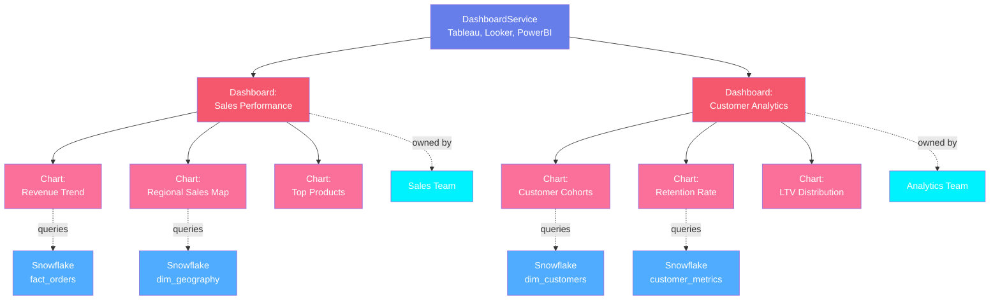
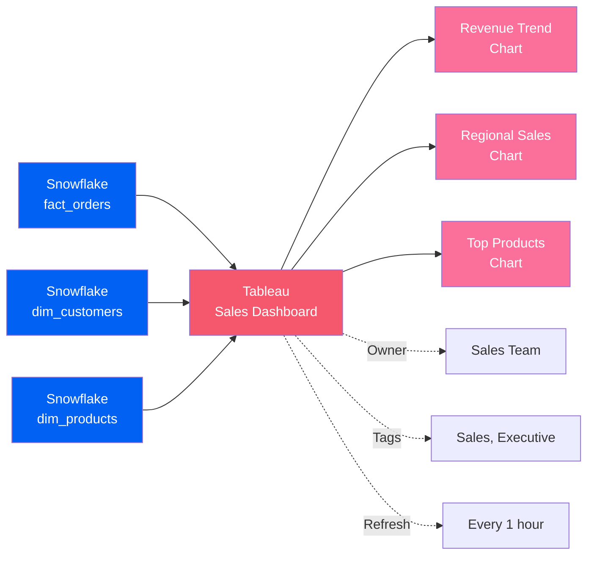
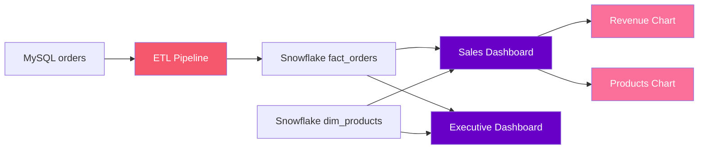

# Dashboard Assets

**Business intelligence and data visualization**

Dashboard assets represent business intelligence reports, visualizations, and analytics that help users understand and explore data. OpenMetadata models dashboards with a three-level hierarchy for BI platforms.

---

## Hierarchy Overview



---

## Why This Hierarchy?

### Dashboard Service
**Purpose**: Represents the BI or analytics platform

A Dashboard Service is the platform that hosts dashboards and visualizations. It contains configuration for connecting to the BI tool and discovering reports.

**Examples**:

- `tableau-prod` - Production Tableau Server
- `looker-analytics` - Looker instance
- `powerbi-sales` - Power BI workspace
- `superset-internal` - Apache Superset for internal analytics

**Why needed**: Organizations use multiple BI platforms for different teams and use cases (Tableau for executive dashboards, Looker for self-service analytics, Superset for engineering). The service level organizes dashboards by platform.

**Supported Platforms**: Tableau, Looker, Power BI, Apache Superset, Metabase, Mode, Redash, QuickSight, Sisense, Google Data Studio

[**View Dashboard Service Specification →**](dashboard-service.md){ .md-button }

---

### Dashboard
**Purpose**: Represents a complete BI report or dashboard

A Dashboard is a collection of charts and visualizations that tell a story about the data. It has owners, tags, lineage to source tables, and contains multiple charts.

**Examples**:

- `Sales Performance Dashboard` - Executive sales metrics
- `Customer Analytics` - Customer behavior and segmentation
- `Operations KPIs` - Operational metrics and health
- `Marketing Attribution` - Marketing channel effectiveness

**Key Metadata**:

- **Charts**: Individual visualizations within the dashboard
- **Data Sources**: Tables and queries used
- **Lineage**: Source tables → Dashboard
- **Owners**: Team or users responsible
- **Tags**: Department, sensitivity, business domain
- **URL**: Link to live dashboard
- **Refresh Schedule**: How often data updates

**Why needed**: Dashboards are the consumption layer of analytics. Tracking them enables:
- Understanding which data powers which business decisions
- Impact analysis (which dashboards break if table changes?)
- Governance (who has access to sensitive dashboards?)
- Discoverability (find relevant dashboards for your team)

[**View Dashboard Specification →**](dashboard.md){ .md-button }

---

### Chart
**Purpose**: Individual visualization within a dashboard

A Chart is a single visualization - bar chart, line chart, pie chart, table, etc. Charts have queries, data sources, and visual configurations.

**Examples**:

- `Monthly Revenue Trend` - Line chart of revenue over time
- `Top 10 Products` - Bar chart of product sales
- `Customer Segmentation` - Pie chart of customer types
- `Orders Table` - Tabular view of recent orders

**Chart Types**:

- **Bar/Column**: Compare categories
- **Line**: Show trends over time
- **Pie/Donut**: Show composition
- **Table**: Display raw data
- **Map**: Geographic visualization
- **Scatter**: Show correlations
- **Heatmap**: Show intensity across dimensions

**Why needed**: Charts provide granular lineage. You can see exactly which columns from which tables feed each visualization, enabling precise impact analysis.

[**View Chart Specification →**](chart.md){ .md-button }

---

## Common Patterns

### Pattern 1: Tableau Executive Dashboard
```
Tableau Service → Sales Performance Dashboard → Revenue Trend Chart
                                              → Regional Sales Map
                                              → Top Products Table
```

Executive dashboard with multiple visualizations from a single data source.

### Pattern 2: Looker Self-Service Analytics
```
Looker Service → Customer Analytics Dashboard → Customer Cohorts Chart
                                               → Retention Rate Chart
                                               → LTV Distribution Chart
```

Self-service dashboard with drill-down capabilities.

### Pattern 3: Power BI Operational KPIs
```
Power BI Service → Operations Dashboard → Real-Time Orders Chart
                                        → Inventory Levels Chart
                                        → Fulfillment Rate Chart
```

Real-time operational dashboard with live data connections.

---

## Real-World Example

Here's how a sales team uses dashboards to track performance:



**Flow**:
1. **Data Sources**: Three Snowflake tables (fact and dimension tables)
2. **Dashboard**: Tableau Sales Dashboard combining all three sources
3. **Charts**:
   - Revenue trend over time (from fact_orders)
   - Regional breakdown (from fact_orders + dim_customers)
   - Top products (from fact_orders + dim_products)
4. **Metadata**: Owned by Sales Team, tagged for executives, refreshes hourly

**Benefits**:

- **Lineage**: See which tables power which charts
- **Impact Analysis**: Know which dashboards break if fact_orders schema changes
- **Ownership**: Know who to contact for dashboard questions
- **Discoverability**: Sales team can find all sales-related dashboards

---

## Dashboard Lineage

Dashboards create lineage from data tables to business insights:



**Column-Level Lineage**: Track which specific columns are used in which charts (e.g., `orders.total_amount` → Revenue Chart Y-axis).

---

## Dashboard Data Models

Some BI tools have intermediate data models:

### Looker LookML Models
```
Looker Service → E-commerce Model → Orders View
                                  → Customers View
               → Sales Dashboard → Uses Orders View & Customers View
```

Looker's semantic layer (LookML) defines reusable data models.

### Power BI Datasets
```
Power BI Service → Sales Dataset → fact_sales Table
                                 → dim_date Table
                 → Sales Dashboard → Uses Sales Dataset
```

Power BI datasets are reusable data models shared across dashboards.

---

## Embedded Analytics

Track dashboards embedded in applications:

```
Tableau Service → Customer Portal Dashboard → Embedded in: app.company.com/portal
                                             → Public Access: Yes
                                             → Row-Level Security: customer_id
```

Embedded dashboards require special security and access controls.

---

## Entity Specifications

| Entity | Description | Specification |
|--------|-------------|---------------|
| **Dashboard Service** | BI platform | [View Spec](dashboard-service.md) |
| **Dashboard** | Report or dashboard | [View Spec](dashboard.md) |
| **Chart** | Individual visualization | [View Spec](chart.md) |

Each specification includes:
- Complete field reference
- JSON Schema definition
- RDF/OWL ontology representation
- JSON-LD context and examples
- Platform-specific integrations

---

## Supported BI Platforms

OpenMetadata supports metadata extraction from:

- **Tableau** - Enterprise BI and visualization
- **Looker** - Modern BI with semantic modeling
- **Power BI** - Microsoft's BI platform
- **Apache Superset** - Open-source data exploration
- **Metabase** - Simple BI for everyone
- **Mode** - Collaborative analytics
- **Redash** - SQL-based dashboards
- **Amazon QuickSight** - Cloud-native BI
- **Google Data Studio** - Free BI from Google
- **Sisense** - Embedded analytics platform
- **Qlik** - Associative analytics
- **MicroStrategy** - Enterprise analytics

---

## Next Steps

1. **Explore specifications** - Click through each entity above
2. **See lineage examples** - Check out [lineage from tables to dashboards](../../lineage/overview.md)
3. **BI integration** - Learn how to connect your BI platform
