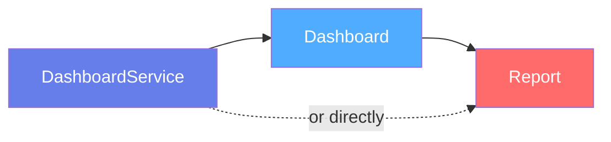

# Report

**Scheduled reports and report templates**

---

## Overview

The **Report** entity represents scheduled reports, automated report deliveries, and report templates in BI and analytics platforms. It captures report metadata, scheduling configuration, delivery settings, data sources, and relationships to dashboards and recipients. Reports enable automated distribution of business insights through PDF exports, Excel files, email subscriptions, and other delivery mechanisms.

**Hierarchy**:


---

## Relationships

Report has comprehensive relationships with entities across the metadata platform:

```mermaid
graph TD
    subgraph Service
        SVC[DashboardService:<br/>tableau_prod]
    end

    subgraph Report Definition
        SVC --> R[Report:<br/>Weekly Sales Report]
    end

    subgraph Source Content
        R -.->|based on| D1[Dashboard:<br/>Sales Dashboard]
        R -.->|includes| CH1[Chart:<br/>Revenue Trend]
        R -.->|includes| CH2[Chart:<br/>Regional Sales]

        R -.->|queries| DM[DataModel:<br/>Sales Model]
    end

    subgraph Data Sources
        R -.->|reads from| T1[Table:<br/>sales.orders]
        R -.->|reads from| T2[Table:<br/>sales.customers]
        R -.->|reads from| T3[Table:<br/>sales.products]

        R -.->|uses column| C1[Column:<br/>order_date]
        R -.->|uses column| C2[Column:<br/>revenue]
    end

    subgraph Schedule & Delivery
        R -.->|has schedule| SCH[Schedule:<br/>Weekly Mon 8AM]
        R -.->|delivered to| U1[User:<br/>exec.team]
        R -.->|delivered to| U2[User:<br/>sales.director]
        R -.->|delivered to| U3[Team:<br/>Sales Team]

        R -.->|delivery method| DEL1[Email]
        R -.->|delivery method| DEL2[Slack]
        R -.->|format| FMT1[PDF]
        R -.->|format| FMT2[Excel]
    end

    subgraph Ownership & Governance
        R -.->|owned by| O1[Team:<br/>Analytics]
        R -.->|created by| O2[User:<br/>analyst.lead]

        R -.->|in domain| DOM[Domain:<br/>Sales]
        R -.->|has tags| TAG1[Tag:<br/>Tier.Gold]
        R -.->|has tags| TAG2[Tag:<br/>Executive]
        R -.->|has tags| TAG3[Tag:<br/>Weekly]

        R -.->|described by| GT1[GlossaryTerm:<br/>Sales]
        R -.->|described by| GT2[GlossaryTerm:<br/>Revenue]
    end

    subgraph Parameters & Filters
        R -.->|has parameter| P1[Parameter:<br/>date_range]
        R -.->|has parameter| P2[Parameter:<br/>region]
        R -.->|has filter| F1[Filter:<br/>status=active]
    end

    subgraph Execution History
        R -.->|execution history| EX1[Execution:<br/>2024-01-15]
        R -.->|execution history| EX2[Execution:<br/>2024-01-22]
        R -.->|execution history| EX3[Execution:<br/>2024-01-29]

        EX1 -.->|generated file| FILE1[File:<br/>sales_2024_w03.pdf]
    end

    subgraph Quality & Monitoring
        R -.->|validated by| TC[TestCase:<br/>report_data_quality]
        R -.->|monitored by| AL[Alert:<br/>delivery_failure]
    end

    subgraph Upstream Lineage
        PIP1[Pipeline:<br/>sales_etl] -.->|feeds| T1
        PIP2[Pipeline:<br/>revenue_agg] -.->|feeds| T2
    end

    style R fill:#ff6b6b,color:#fff,stroke:#ef4444,stroke-width:3px
    style SVC fill:#667eea,color:#fff
    style D1 fill:#4facfe,color:#fff
    style CH1 fill:#00f2fe,color:#333
    style CH2 fill:#00f2fe,color:#333
    style DM fill:#00ac69,color:#fff
    style T1 fill:#764ba2,color:#fff
    style T2 fill:#764ba2,color:#fff
    style T3 fill:#764ba2,color:#fff
    style C1 fill:#9b59b6,color:#fff
    style C2 fill:#9b59b6,color:#fff
    style SCH fill:#22c55e,color:#fff
    style U1 fill:#43e97b,color:#fff
    style U2 fill:#43e97b,color:#fff
    style U3 fill:#43e97b,color:#fff
    style DEL1 fill:#3b82f6,color:#fff
    style DEL2 fill:#3b82f6,color:#fff
    style FMT1 fill:#6366f1,color:#fff
    style FMT2 fill:#6366f1,color:#fff
    style O1 fill:#43e97b,color:#fff
    style O2 fill:#43e97b,color:#fff
    style DOM fill:#fa709a,color:#fff
    style TAG1 fill:#f093fb,color:#fff
    style TAG2 fill:#f093fb,color:#fff
    style TAG3 fill:#f093fb,color:#fff
    style GT1 fill:#ffd700,color:#333
    style GT2 fill:#ffd700,color:#333
    style P1 fill:#8b5cf6,color:#fff
    style P2 fill:#8b5cf6,color:#fff
    style F1 fill:#8b5cf6,color:#fff
    style EX1 fill:#10b981,color:#fff
    style EX2 fill:#10b981,color:#fff
    style EX3 fill:#10b981,color:#fff
    style FILE1 fill:#64748b,color:#fff
    style TC fill:#9b59b6,color:#fff
    style AL fill:#f59e0b,color:#fff
    style PIP1 fill:#f5576c,color:#fff
    style PIP2 fill:#f5576c,color:#fff
```



**Relationship Types**:

- **Solid lines (→)**: Hierarchical containment (Service hosts Report, Report based on Dashboard)
- **Dashed lines (-.->)**: References and associations (ownership, governance, data sources, delivery, scheduling, lineage)

---

### Parent Entities
- **DashboardService**: The BI platform hosting this report
- **Dashboard**: The dashboard this report is based on (optional)

### Child Entities
- **Execution**: Execution history records

### Associated Entities
- **Owner**: User or team owning this report
- **Domain**: Business domain assignment
- **Tag**: Classification tags
- **GlossaryTerm**: Business terminology
- **Dashboard**: Source dashboard
- **Chart**: Charts included in the report
- **DataModel**: Data models used
- **Table**: Source tables
- **Column**: Specific columns
- **User/Team**: Report recipients
- **Pipeline**: ETL pipelines feeding source data
- **TestCase**: Data quality tests
- **Schedule**: Delivery schedule configuration

---

## Schema Specifications

View the complete Report schema in your preferred format:

=== "JSON Schema"

    **Complete JSON Schema Definition**

    ```json
    {
      "$id": "https://open-metadata.org/schema/entity/data/report.json",
      "$schema": "http://json-schema.org/draft-07/schema#",
      "title": "Report",
      "description": "A `Report` represents a scheduled report or automated report delivery.",
      "type": "object",
      "javaType": "org.openmetadata.schema.entity.data.Report",

      "definitions": {
        "reportType": {
          "description": "Type of report",
          "type": "string",
          "enum": [
            "DASHBOARD_EXPORT", "SCHEDULED_REPORT",
            "SUBSCRIPTION", "ALERT", "SNAPSHOT", "OTHER"
          ]
        },
        "deliveryFormat": {
          "description": "Report delivery format",
          "type": "string",
          "enum": [
            "PDF", "EXCEL", "CSV", "PNG", "IMAGE",
            "HTML", "JSON", "POWERPOINT"
          ]
        },
        "deliveryChannel": {
          "description": "Delivery channel",
          "type": "string",
          "enum": [
            "EMAIL", "SLACK", "TEAMS", "WEBHOOK",
            "S3", "SFTP", "OTHER"
          ]
        },
        "scheduleConfig": {
          "description": "Schedule configuration",
          "type": "object",
          "properties": {
            "cronExpression": {
              "description": "Cron expression for schedule",
              "type": "string"
            },
            "timezone": {
              "description": "Timezone for schedule",
              "type": "string"
            },
            "frequency": {
              "description": "Human-readable frequency",
              "type": "string"
            },
            "enabled": {
              "description": "Is schedule enabled",
              "type": "boolean"
            }
          },
          "required": ["cronExpression"]
        },
        "deliveryConfig": {
          "description": "Delivery configuration",
          "type": "object",
          "properties": {
            "channel": {
              "$ref": "#/definitions/deliveryChannel"
            },
            "format": {
              "$ref": "#/definitions/deliveryFormat"
            },
            "recipients": {
              "description": "Report recipients",
              "type": "array",
              "items": {
                "$ref": "../../type/entityReference.json"
              }
            },
            "subject": {
              "description": "Email subject or message title",
              "type": "string"
            },
            "message": {
              "description": "Email body or message content",
              "type": "string"
            }
          },
          "required": ["channel", "format", "recipients"]
        }
      },

      "properties": {
        "id": {
          "description": "Unique identifier",
          "$ref": "../../type/basic.json#/definitions/uuid"
        },
        "name": {
          "description": "Report name",
          "$ref": "../../type/basic.json#/definitions/entityName"
        },
        "fullyQualifiedName": {
          "description": "Fully qualified name: service.report",
          "$ref": "../../type/basic.json#/definitions/fullyQualifiedEntityName"
        },
        "displayName": {
          "description": "Display name",
          "type": "string"
        },
        "description": {
          "description": "Markdown description",
          "$ref": "../../type/basic.json#/definitions/markdown"
        },
        "reportType": {
          "$ref": "#/definitions/reportType"
        },
        "service": {
          "description": "Dashboard service",
          "$ref": "../../type/entityReference.json"
        },
        "dashboard": {
          "description": "Source dashboard",
          "$ref": "../../type/entityReference.json"
        },
        "charts": {
          "description": "Charts included in report",
          "type": "array",
          "items": {
            "$ref": "../../type/entityReference.json"
          }
        },
        "dataModels": {
          "description": "Data models used",
          "type": "array",
          "items": {
            "$ref": "../../type/entityReference.json"
          }
        },
        "tables": {
          "description": "Source tables",
          "type": "array",
          "items": {
            "$ref": "../../type/entityReference.json"
          }
        },
        "schedule": {
          "$ref": "#/definitions/scheduleConfig"
        },
        "delivery": {
          "$ref": "#/definitions/deliveryConfig"
        },
        "owner": {
          "description": "Owner (user or team)",
          "$ref": "../../type/entityReference.json"
        },
        "domain": {
          "description": "Data domain",
          "$ref": "../../type/entityReference.json"
        },
        "tags": {
          "description": "Classification tags",
          "type": "array",
          "items": {
            "$ref": "../../type/tagLabel.json"
          }
        },
        "glossaryTerms": {
          "description": "Business glossary terms",
          "type": "array",
          "items": {
            "$ref": "../../type/entityReference.json"
          }
        },
        "version": {
          "description": "Metadata version",
          "$ref": "../../type/entityHistory.json#/definitions/entityVersion"
        }
      },

      "required": ["id", "name", "service", "reportType"]
    }
    ```

    **[View Full JSON Schema →](https://github.com/open-metadata/OpenMetadataStandards/blob/main/schemas/entity/data/report.json)**

=== "RDF"

    **RDF/OWL Ontology Definition**

    ```turtle
    @prefix om: <https://open-metadata.org/schema/> .
    @prefix rdfs: <http://www.w3.org/2000/01/rdf-schema#> .
    @prefix owl: <http://www.w3.org/2001/XMLSchema#> .
    @prefix xsd: <http://www.w3.org/2001/XMLSchema#> .

    # Report Class Definition
    om:Report a owl:Class ;
        rdfs:subClassOf om:DataAsset ;
        rdfs:label "Report" ;
        rdfs:comment "A scheduled report or automated report delivery" ;
        om:hierarchyLevel 2 .

    # Properties
    om:reportName a owl:DatatypeProperty ;
        rdfs:domain om:Report ;
        rdfs:range xsd:string ;
        rdfs:label "name" ;
        rdfs:comment "Name of the report" .

    om:reportType a owl:DatatypeProperty ;
        rdfs:domain om:Report ;
        rdfs:range om:ReportType ;
        rdfs:label "reportType" ;
        rdfs:comment "Type: DASHBOARD_EXPORT, SCHEDULED_REPORT, etc." .

    om:deliveryFormat a owl:DatatypeProperty ;
        rdfs:domain om:Report ;
        rdfs:range om:DeliveryFormat ;
        rdfs:label "deliveryFormat" ;
        rdfs:comment "Format: PDF, EXCEL, CSV, etc." .

    om:deliveryChannel a owl:DatatypeProperty ;
        rdfs:domain om:Report ;
        rdfs:range om:DeliveryChannel ;
        rdfs:label "deliveryChannel" ;
        rdfs:comment "Channel: EMAIL, SLACK, etc." .

    om:scheduleExpression a owl:DatatypeProperty ;
        rdfs:domain om:Report ;
        rdfs:range xsd:string ;
        rdfs:label "cronExpression" ;
        rdfs:comment "Cron expression for scheduling" .

    om:basedOnDashboard a owl:ObjectProperty ;
        rdfs:domain om:Report ;
        rdfs:range om:Dashboard ;
        rdfs:label "basedOnDashboard" ;
        rdfs:comment "Source dashboard for this report" .

    om:includesChart a owl:ObjectProperty ;
        rdfs:domain om:Report ;
        rdfs:range om:Chart ;
        rdfs:label "includesChart" ;
        rdfs:comment "Charts included in the report" .

    om:usesDataSource a owl:ObjectProperty ;
        rdfs:domain om:Report ;
        rdfs:range om:Table ;
        rdfs:label "usesDataSource" ;
        rdfs:comment "Source tables used by the report" .

    om:deliveredTo a owl:ObjectProperty ;
        rdfs:domain om:Report ;
        rdfs:range om:User ;
        rdfs:label "deliveredTo" ;
        rdfs:comment "Recipients of the report" .

    om:belongsToService a owl:ObjectProperty ;
        rdfs:domain om:Report ;
        rdfs:range om:DashboardService ;
        rdfs:label "belongsToService" ;
        rdfs:comment "Dashboard service hosting this report" .

    # Report Type Enumeration
    om:ReportType a owl:Class ;
        owl:oneOf (
            om:ReportType_DashboardExport
            om:ReportType_ScheduledReport
            om:ReportType_Subscription
            om:ReportType_Alert
        ) .

    # Example Instance
    ex:weeklySalesReport a om:Report ;
        om:reportName "weekly_sales_report" ;
        om:fullyQualifiedName "tableau_prod.weekly_sales_report" ;
        om:displayName "Weekly Sales Report" ;
        om:reportType om:ReportType_ScheduledReport ;
        om:deliveryFormat om:DeliveryFormat_PDF ;
        om:deliveryChannel om:DeliveryChannel_EMAIL ;
        om:scheduleExpression "0 8 * * MON" ;
        om:basedOnDashboard ex:salesDashboard ;
        om:belongsToService ex:tableauProdService ;
        om:deliveredTo ex:execTeam ;
        om:ownedBy ex:analyticsTeam .
    ```

    **[View Full RDF Ontology →](https://github.com/open-metadata/OpenMetadataStandards/blob/main/rdf/ontology/openmetadata.ttl)**

=== "JSON-LD"

    **JSON-LD Context and Example**

    ```json
    {
      "@context": {
        "@vocab": "https://open-metadata.org/schema/",
        "om": "https://open-metadata.org/schema/",
        "rdfs": "http://www.w3.org/2000/01/rdf-schema#",
        "xsd": "http://www.w3.org/2001/XMLSchema#",

        "Report": "om:Report",
        "name": {
          "@id": "om:reportName",
          "@type": "xsd:string"
        },
        "fullyQualifiedName": {
          "@id": "om:fullyQualifiedName",
          "@type": "xsd:string"
        },
        "displayName": {
          "@id": "om:displayName",
          "@type": "xsd:string"
        },
        "description": {
          "@id": "om:description",
          "@type": "xsd:string"
        },
        "reportType": {
          "@id": "om:reportType",
          "@type": "@vocab"
        },
        "dashboard": {
          "@id": "om:basedOnDashboard",
          "@type": "@id"
        },
        "charts": {
          "@id": "om:includesChart",
          "@type": "@id",
          "@container": "@set"
        },
        "tables": {
          "@id": "om:usesDataSource",
          "@type": "@id",
          "@container": "@set"
        },
        "service": {
          "@id": "om:belongsToService",
          "@type": "@id"
        },
        "owner": {
          "@id": "om:ownedBy",
          "@type": "@id"
        }
      }
    }
    ```

    **Example JSON-LD Instance**:

    ```json
    {
      "@context": "https://open-metadata.org/context/report.jsonld",
      "@type": "Report",
      "@id": "https://example.com/reports/weekly_sales_report",

      "name": "weekly_sales_report",
      "fullyQualifiedName": "tableau_prod.weekly_sales_report",
      "displayName": "Weekly Sales Report",
      "description": "# Weekly Sales Report\n\nAutomated weekly sales performance report delivered every Monday morning.",
      "reportType": "SCHEDULED_REPORT",

      "service": {
        "@id": "https://example.com/services/tableau_prod",
        "@type": "DashboardService",
        "name": "tableau_prod"
      },

      "dashboard": {
        "@id": "https://example.com/dashboards/sales_dashboard",
        "@type": "Dashboard",
        "name": "sales_dashboard"
      },

      "schedule": {
        "cronExpression": "0 8 * * MON",
        "timezone": "America/New_York",
        "frequency": "Weekly on Monday at 8:00 AM EST",
        "enabled": true
      },

      "delivery": {
        "channel": "EMAIL",
        "format": "PDF",
        "recipients": [
          {
            "@id": "https://example.com/teams/exec-team",
            "@type": "Team",
            "name": "exec-team"
          }
        ],
        "subject": "Weekly Sales Report - {date}",
        "message": "Please find attached the weekly sales performance report."
      },

      "owner": {
        "@id": "https://example.com/teams/analytics",
        "@type": "Team",
        "name": "analytics"
      }
    }
    ```

    **[View Full JSON-LD Context →](https://github.com/open-metadata/OpenMetadataStandards/blob/main/rdf/contexts/report.jsonld)**

---

## Use Cases

- Catalog all scheduled reports across BI platforms
- Document report purpose, content, and delivery settings
- Track report ownership and stakeholders
- Discover reports by business domain or topic
- Capture lineage from source tables to reports
- Monitor report delivery success and failures
- Apply governance tags to sensitive reports
- Track report recipients and access patterns
- Document report scheduling and frequency
- Enable discovery of existing reports to reduce duplication

---

## JSON Schema Specification

### Core Properties

#### `id` (uuid)
**Type**: `string` (UUID format)
**Required**: Yes (system-generated)
**Description**: Unique identifier for this report instance

```json
{
  "id": "7a8b9c0d-1e2f-3a4b-5c6d-7e8f9a0b1c2d"
}
```

---

#### `name` (entityName)
**Type**: `string`
**Required**: Yes
**Pattern**: `^[^.]*$` (no dots allowed)
**Min Length**: 1
**Max Length**: 256
**Description**: Name of the report (unqualified)

```json
{
  "name": "weekly_sales_report"
}
```

---

#### `fullyQualifiedName` (fullyQualifiedEntityName)
**Type**: `string`
**Required**: Yes (system-generated)
**Pattern**: `^((?!::).)*$`
**Description**: Fully qualified name in the format `service.report`

```json
{
  "fullyQualifiedName": "tableau_prod.weekly_sales_report"
}
```

---

#### `displayName`
**Type**: `string`
**Required**: No
**Description**: Human-readable display name

```json
{
  "displayName": "Weekly Sales Report"
}
```

---

#### `description` (markdown)
**Type**: `string` (Markdown format)
**Required**: No
**Description**: Rich text description of the report's purpose and content

```json
{
  "description": "# Weekly Sales Report\n\nAutomated weekly sales performance report delivered every Monday morning.\n\n## Contents\n- Revenue by region\n- Top performing products\n- Sales trends\n- YoY comparison\n\n## Recipients\n- Executive team\n- Sales directors\n\n## Delivery\n- Format: PDF\n- Schedule: Weekly (Monday 8 AM EST)\n- Channel: Email"
}
```

---

### Report Configuration

#### `reportType` (ReportType enum)
**Type**: `string` enum
**Required**: Yes
**Allowed Values**:

- `DASHBOARD_EXPORT` - Dashboard snapshot export
- `SCHEDULED_REPORT` - Regularly scheduled report
- `SUBSCRIPTION` - User-subscribed report
- `ALERT` - Alert-based report
- `SNAPSHOT` - Point-in-time snapshot
- `OTHER` - Other report type

```json
{
  "reportType": "SCHEDULED_REPORT"
}
```

---

### Source Content

#### `service` (EntityReference)
**Type**: `object`
**Required**: Yes
**Description**: Reference to parent dashboard service

```json
{
  "service": {
    "id": "service-uuid",
    "type": "dashboardService",
    "name": "tableau_prod",
    "fullyQualifiedName": "tableau_prod"
  }
}
```

---

#### `dashboard` (EntityReference)
**Type**: `object`
**Required**: No
**Description**: Source dashboard this report is based on

```json
{
  "dashboard": {
    "id": "dashboard-uuid",
    "type": "dashboard",
    "name": "sales_dashboard",
    "fullyQualifiedName": "tableau_prod.sales_dashboard"
  }
}
```

---

#### `charts[]` (Chart[])
**Type**: `array` of Chart entity references
**Required**: No
**Description**: Charts included in the report

```json
{
  "charts": [
    {
      "id": "chart-uuid-1",
      "type": "chart",
      "name": "revenue_trend",
      "fullyQualifiedName": "tableau_prod.sales_dashboard.revenue_trend"
    },
    {
      "id": "chart-uuid-2",
      "type": "chart",
      "name": "regional_sales",
      "fullyQualifiedName": "tableau_prod.sales_dashboard.regional_sales"
    }
  ]
}
```

---

#### `dataModels[]` (DataModel[])
**Type**: `array` of DataModel entity references
**Required**: No
**Description**: Data models used by the report

```json
{
  "dataModels": [
    {
      "id": "model-uuid",
      "type": "dataModel",
      "name": "sales_model",
      "fullyQualifiedName": "looker_prod.sales_model"
    }
  ]
}
```

---

#### `tables[]` (Table[])
**Type**: `array` of Table entity references
**Required**: No
**Description**: Source tables used by the report

```json
{
  "tables": [
    {
      "id": "table-uuid",
      "type": "table",
      "name": "orders",
      "fullyQualifiedName": "postgres_prod.sales.public.orders"
    }
  ]
}
```

---

### Schedule Configuration

#### `schedule` (ScheduleConfig)
**Type**: `object`
**Required**: No
**Description**: Report scheduling configuration

**ScheduleConfig Object**:

| Property | Type | Required | Description |
|----------|------|----------|-------------|
| `cronExpression` | string | Yes | Cron expression for schedule |
| `timezone` | string | No | Timezone (e.g., "America/New_York") |
| `frequency` | string | No | Human-readable frequency description |
| `enabled` | boolean | No | Is schedule enabled (default: true) |

```json
{
  "schedule": {
    "cronExpression": "0 8 * * MON",
    "timezone": "America/New_York",
    "frequency": "Weekly on Monday at 8:00 AM EST",
    "enabled": true
  }
}
```

**Common Cron Expressions**:

- Daily at 9 AM: `0 9 * * *`
- Weekly on Monday at 8 AM: `0 8 * * MON`
- First day of month at 6 AM: `0 6 1 * *`
- Every hour: `0 * * * *`

---

### Delivery Configuration

#### `delivery` (DeliveryConfig)
**Type**: `object`
**Required**: No
**Description**: Report delivery configuration

**DeliveryConfig Object**:

| Property | Type | Required | Description |
|----------|------|----------|-------------|
| `channel` | DeliveryChannel enum | Yes | Delivery channel |
| `format` | DeliveryFormat enum | Yes | Report format |
| `recipients` | EntityReference[] | Yes | Report recipients (Users/Teams) |
| `subject` | string | No | Email subject or message title |
| `message` | string | No | Email body or message content |

**DeliveryChannel enum**:

- `EMAIL` - Email delivery
- `SLACK` - Slack channel
- `TEAMS` - Microsoft Teams
- `WEBHOOK` - Custom webhook
- `S3` - S3 bucket upload
- `SFTP` - SFTP server
- `OTHER` - Other delivery method

**DeliveryFormat enum**:

- `PDF` - PDF document
- `EXCEL` - Excel spreadsheet
- `CSV` - CSV file
- `PNG` - PNG image
- `IMAGE` - Image format
- `HTML` - HTML format
- `JSON` - JSON data
- `POWERPOINT` - PowerPoint presentation

```json
{
  "delivery": {
    "channel": "EMAIL",
    "format": "PDF",
    "recipients": [
      {
        "id": "team-uuid",
        "type": "team",
        "name": "exec-team",
        "displayName": "Executive Team"
      },
      {
        "id": "user-uuid",
        "type": "user",
        "name": "sales.director",
        "displayName": "Sales Director"
      }
    ],
    "subject": "Weekly Sales Report - {date}",
    "message": "Hi team,\n\nPlease find attached the weekly sales performance report for the week ending {date}.\n\nKey highlights:\n- Total revenue: {revenue}\n- Top region: {top_region}\n- YoY growth: {yoy_growth}%\n\nBest regards,\nAnalytics Team"
  }
}
```

---

### Governance Properties

#### `owner` (EntityReference)
**Type**: `object`
**Required**: No
**Description**: User or team that owns this report

```json
{
  "owner": {
    "id": "owner-uuid",
    "type": "team",
    "name": "analytics-team",
    "displayName": "Analytics Team"
  }
}
```

---

#### `domain` (EntityReference)
**Type**: `object`
**Required**: No
**Description**: Data domain this report belongs to

```json
{
  "domain": {
    "id": "domain-uuid",
    "type": "domain",
    "name": "Sales",
    "fullyQualifiedName": "Sales"
  }
}
```

---

#### `tags[]` (TagLabel[])
**Type**: `array`
**Required**: No
**Description**: Classification tags applied to the report

```json
{
  "tags": [
    {
      "tagFQN": "Tier.Gold",
      "description": "Critical executive report",
      "source": "Classification",
      "labelType": "Manual",
      "state": "Confirmed"
    },
    {
      "tagFQN": "Executive",
      "source": "Classification",
      "labelType": "Manual",
      "state": "Confirmed"
    },
    {
      "tagFQN": "Weekly",
      "source": "Classification",
      "labelType": "Automated",
      "state": "Confirmed"
    }
  ]
}
```

---

#### `glossaryTerms[]` (GlossaryTerm[])
**Type**: `array`
**Required**: No
**Description**: Business glossary terms linked to this report

```json
{
  "glossaryTerms": [
    {
      "fullyQualifiedName": "BusinessGlossary.Sales"
    },
    {
      "fullyQualifiedName": "BusinessGlossary.Revenue"
    }
  ]
}
```

---

## Complete Example

```json
{
  "id": "7a8b9c0d-1e2f-3a4b-5c6d-7e8f9a0b1c2d",
  "name": "weekly_sales_report",
  "fullyQualifiedName": "tableau_prod.weekly_sales_report",
  "displayName": "Weekly Sales Report",
  "description": "# Weekly Sales Report\n\nAutomated weekly sales performance report delivered every Monday morning.",
  "reportType": "SCHEDULED_REPORT",
  "service": {
    "id": "service-uuid",
    "type": "dashboardService",
    "name": "tableau_prod"
  },
  "dashboard": {
    "id": "dashboard-uuid",
    "type": "dashboard",
    "name": "sales_dashboard",
    "fullyQualifiedName": "tableau_prod.sales_dashboard"
  },
  "charts": [
    {
      "id": "chart-uuid-1",
      "type": "chart",
      "name": "revenue_trend"
    },
    {
      "id": "chart-uuid-2",
      "type": "chart",
      "name": "regional_sales"
    }
  ],
  "tables": [
    {
      "id": "table-uuid",
      "type": "table",
      "name": "orders",
      "fullyQualifiedName": "postgres_prod.sales.public.orders"
    }
  ],
  "schedule": {
    "cronExpression": "0 8 * * MON",
    "timezone": "America/New_York",
    "frequency": "Weekly on Monday at 8:00 AM EST",
    "enabled": true
  },
  "delivery": {
    "channel": "EMAIL",
    "format": "PDF",
    "recipients": [
      {
        "id": "team-uuid",
        "type": "team",
        "name": "exec-team",
        "displayName": "Executive Team"
      }
    ],
    "subject": "Weekly Sales Report - {date}",
    "message": "Please find attached the weekly sales performance report."
  },
  "owner": {
    "id": "owner-uuid",
    "type": "team",
    "name": "analytics-team"
  },
  "domain": {
    "id": "domain-uuid",
    "type": "domain",
    "name": "Sales"
  },
  "tags": [
    {"tagFQN": "Tier.Gold"},
    {"tagFQN": "Executive"},
    {"tagFQN": "Weekly"}
  ],
  "glossaryTerms": [
    {"fullyQualifiedName": "BusinessGlossary.Sales"}
  ],
  "version": 1.4,
  "updatedAt": 1704240000000,
  "updatedBy": "analyst.lead"
}
```

---

## Examples by Type

### Monthly Executive Summary

```json
{
  "name": "monthly_executive_summary",
  "fullyQualifiedName": "tableau_prod.monthly_executive_summary",
  "displayName": "Monthly Executive Summary",
  "description": "Comprehensive monthly business performance report for executives",
  "reportType": "SCHEDULED_REPORT",
  "service": {
    "type": "dashboardService",
    "name": "tableau_prod"
  },
  "dashboard": {
    "type": "dashboard",
    "name": "executive_dashboard"
  },
  "schedule": {
    "cronExpression": "0 6 1 * *",
    "timezone": "America/New_York",
    "frequency": "Monthly on the 1st at 6:00 AM EST",
    "enabled": true
  },
  "delivery": {
    "channel": "EMAIL",
    "format": "POWERPOINT",
    "recipients": [
      {
        "type": "team",
        "name": "c-suite"
      }
    ],
    "subject": "Monthly Executive Summary - {month} {year}"
  },
  "tags": [
    {"tagFQN": "Tier.Gold"},
    {"tagFQN": "Executive"},
    {"tagFQN": "Confidential"}
  ]
}
```

---

### Daily Operational Alert

```json
{
  "name": "daily_sales_alert",
  "fullyQualifiedName": "looker_prod.daily_sales_alert",
  "displayName": "Daily Sales Alert",
  "description": "Alert when daily sales fall below target",
  "reportType": "ALERT",
  "service": {
    "type": "dashboardService",
    "name": "looker_prod"
  },
  "schedule": {
    "cronExpression": "0 9 * * *",
    "timezone": "America/Los_Angeles",
    "frequency": "Daily at 9:00 AM PST",
    "enabled": true
  },
  "delivery": {
    "channel": "SLACK",
    "format": "HTML",
    "recipients": [
      {
        "type": "team",
        "name": "sales-ops"
      }
    ],
    "message": "Alert: Daily sales are {percentage}% below target"
  }
}
```

---

### Weekly CSV Data Export

```json
{
  "name": "weekly_customer_export",
  "fullyQualifiedName": "tableau_prod.weekly_customer_export",
  "displayName": "Weekly Customer Data Export",
  "description": "Weekly customer data export for CRM sync",
  "reportType": "SCHEDULED_REPORT",
  "service": {
    "type": "dashboardService",
    "name": "tableau_prod"
  },
  "tables": [
    {
      "type": "table",
      "fullyQualifiedName": "postgres_prod.crm.customers"
    }
  ],
  "schedule": {
    "cronExpression": "0 2 * * SUN",
    "timezone": "UTC",
    "frequency": "Weekly on Sunday at 2:00 AM UTC",
    "enabled": true
  },
  "delivery": {
    "channel": "SFTP",
    "format": "CSV",
    "recipients": [
      {
        "type": "team",
        "name": "crm-team"
      }
    ]
  },
  "tags": [
    {"tagFQN": "PII.Sensitive"},
    {"tagFQN": "ETL"}
  ]
}
```

---

## Custom Properties

This entity supports custom properties through the `extension` field.
Common custom properties include:

- **Data Classification**: Sensitivity level
- **Cost Center**: Billing allocation
- **Retention Period**: Data retention requirements
- **Application Owner**: Owning application/team

See [Custom Properties](../../metadata-specifications/custom-properties.md)
for details on defining and using custom properties.

---

## API Operations

### Create Report

```http
POST /api/v1/reports
Content-Type: application/json

{
  "name": "weekly_sales_report",
  "service": "tableau_prod",
  "reportType": "SCHEDULED_REPORT",
  "dashboard": "tableau_prod.sales_dashboard",
  "schedule": {
    "cronExpression": "0 8 * * MON",
    "timezone": "America/New_York",
    "enabled": true
  },
  "delivery": {
    "channel": "EMAIL",
    "format": "PDF",
    "recipients": [
      {
        "id": "team-uuid",
        "type": "team"
      }
    ]
  }
}
```

### Get Report

```http
GET /api/v1/reports/name/tableau_prod.weekly_sales_report?fields=dashboard,charts,schedule,delivery,owner
```

### Update Report

```http
PATCH /api/v1/reports/{id}
Content-Type: application/json-patch+json

[
  {
    "op": "replace",
    "path": "/schedule/enabled",
    "value": false
  },
  {
    "op": "add",
    "path": "/tags/-",
    "value": {"tagFQN": "Paused"}
  }
]
```

### Trigger Report Execution

```http
POST /api/v1/reports/{id}/execute
Content-Type: application/json

{
  "executeImmediately": true
}
```

### Get Report Execution History

```http
GET /api/v1/reports/{id}/executions?limit=10
```

---

## Related Documentation

- **[Dashboard Service](dashboard-service.md)** - Service configuration
- **[Dashboard](dashboard.md)** - Dashboard entity specification
- **[Chart](chart.md)** - Chart entity specification
- **[Data Model](data-model.md)** - Data model specification
- **[Table](../databases/table.md)** - Source table specification
- **[Lineage](../../lineage/overview.md)** - Data lineage tracking
- **[Governance](../../governance/overview.md)** - Governance policies
