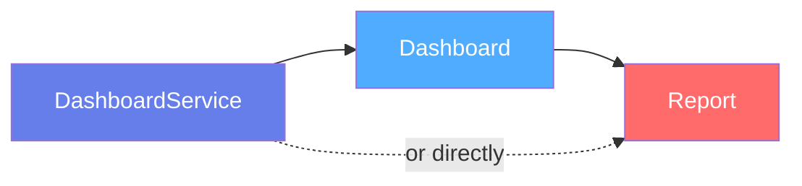
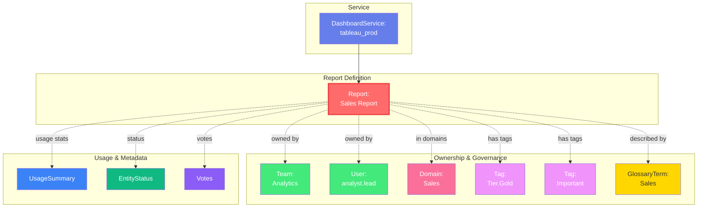

# Report

**Static information computed from data periodically**

---

## Overview

The **Report** entity represents reports that are static information computed from data periodically that includes data in text, table, and visual form. Reports capture metadata about data analysis outputs, dashboards exports, and analytical reports generated from business intelligence platforms.

**Hierarchy**:


---

## Relationships

Report has comprehensive relationships with entities across the metadata platform:



**Relationship Types**:

- **Solid lines (→)**: Hierarchical containment (Service hosts Report)
- **Dashed lines (-.->)**: References and associations (ownership, governance, usage)

---

### Parent Entities
- **DashboardService**: The BI platform hosting this report

### Associated Entities
- **Owners**: Users or teams owning this report
- **Domains**: Business domains this report belongs to
- **Tag**: Classification tags
- **GlossaryTerm**: Business terminology
- **UsageSummary**: Usage statistics
- **EntityStatus**: Current status of the report
- **Votes**: User votes on the report

---

## Schema Specifications

View the complete Report schema in your preferred format:

=== "JSON Schema"

    **Complete JSON Schema Definition**

    ```json
    {
      "$id": "https://open-metadata.org/schema/entity/data/report.json",
      "$schema": "http://json-schema.org/draft-07/schema#",
      "title": "Report",
      "description": "This schema defines the Report entity. `Reports` are static information computed from data periodically that includes data in text, table, and visual form.",
      "type": "object",
      "javaType": "org.openmetadata.schema.entity.data.Report",
      "javaInterfaces": ["org.openmetadata.schema.EntityInterface"],

      "properties": {
        "id": {
          "description": "Unique identifier that identifies this report.",
          "$ref": "../../type/basic.json#/definitions/uuid"
        },
        "name": {
          "description": "Name that identifies this report instance uniquely.",
          "$ref": "../../type/basic.json#/definitions/entityName"
        },
        "fullyQualifiedName": {
          "description": "A unique name that identifies a report in the format 'ServiceName.ReportName'.",
          "$ref": "../../type/basic.json#/definitions/fullyQualifiedEntityName"
        },
        "displayName": {
          "description": "Display Name that identifies this report. It could be title or label from the source services.",
          "type": "string"
        },
        "description": {
          "description": "Description of this report instance.",
          "$ref": "../../type/basic.json#/definitions/markdown"
        },
        "version": {
          "description": "Metadata version of the entity.",
          "$ref": "../../type/entityHistory.json#/definitions/entityVersion"
        },
        "updatedAt": {
          "description": "Last update time corresponding to the new version of the entity in Unix epoch time milliseconds.",
          "$ref": "../../type/basic.json#/definitions/timestamp"
        },
        "updatedBy": {
          "description": "User who made the update.",
          "type": "string"
        },
        "impersonatedBy": {
          "description": "Bot user that performed the action on behalf of the actual user.",
          "$ref": "../../type/basic.json#/definitions/impersonatedBy"
        },
        "href": {
          "description": "Link to the resource corresponding to this report.",
          "$ref": "../../type/basic.json#/definitions/href"
        },
        "owners": {
          "description": "Owners of this Report.",
          "$ref": "../../type/entityReferenceList.json"
        },
        "service": {
          "description": "Link to service where this report is hosted in.",
          "$ref": "../../type/entityReference.json"
        },
        "usageSummary": {
          "description": "Latest usage information for this database.",
          "$ref": "../../type/usageDetails.json",
          "default": null
        },
        "changeDescription": {
          "description": "Change that lead to this version of the entity.",
          "$ref": "../../type/entityHistory.json#/definitions/changeDescription"
        },
        "incrementalChangeDescription": {
          "description": "Change that lead to this version of the entity.",
          "$ref": "../../type/entityHistory.json#/definitions/changeDescription"
        },
        "deleted": {
          "description": "When `true` indicates the entity has been soft deleted.",
          "type": "boolean",
          "default": false
        },
        "votes": {
          "description": "Votes on the entity.",
          "$ref": "../../type/votes.json"
        },
        "domains": {
          "description": "Domains the asset belongs to. When not set, the asset inherits the domain from the parent it belongs to.",
          "$ref": "../../type/entityReferenceList.json"
        },
        "entityStatus": {
          "description": "Status of the Report.",
          "$ref": "../../type/status.json"
        }
      },

      "required": ["id", "name", "service"],
      "additionalProperties": false
    }
    ```

    **[View Full JSON Schema →](https://github.com/open-metadata/OpenMetadata/blob/main/openmetadata-spec/src/main/resources/json/schema/entity/data/report.json)**

=== "RDF"

    **RDF/OWL Ontology Definition**

    ```turtle
    @prefix om: <https://open-metadata.org/schema/> .
    @prefix rdfs: <http://www.w3.org/2000/01/rdf-schema#> .
    @prefix owl: <http://www.w3.org/2002/07/owl#> .
    @prefix xsd: <http://www.w3.org/2001/XMLSchema#> .

    # Report Class Definition
    om:Report a owl:Class ;
        rdfs:subClassOf om:DataAsset ;
        rdfs:label "Report" ;
        rdfs:comment "Static information computed from data periodically that includes data in text, table, and visual form" ;
        om:hierarchyLevel 2 .

    # Data Properties
    om:reportId a owl:DatatypeProperty ;
        rdfs:domain om:Report ;
        rdfs:range om:Uuid ;
        rdfs:label "id" ;
        rdfs:comment "Unique identifier that identifies this report" .

    om:reportName a owl:DatatypeProperty ;
        rdfs:domain om:Report ;
        rdfs:range xsd:string ;
        rdfs:label "name" ;
        rdfs:comment "Name that identifies this report instance uniquely" .

    om:fullyQualifiedName a owl:DatatypeProperty ;
        rdfs:domain om:Report ;
        rdfs:range xsd:string ;
        rdfs:label "fullyQualifiedName" ;
        rdfs:comment "A unique name in the format 'ServiceName.ReportName'" .

    om:displayName a owl:DatatypeProperty ;
        rdfs:domain om:Report ;
        rdfs:range xsd:string ;
        rdfs:label "displayName" ;
        rdfs:comment "Display name from the source services" .

    om:description a owl:DatatypeProperty ;
        rdfs:domain om:Report ;
        rdfs:range xsd:string ;
        rdfs:label "description" ;
        rdfs:comment "Description of this report instance" .

    om:updatedAt a owl:DatatypeProperty ;
        rdfs:domain om:Report ;
        rdfs:range xsd:long ;
        rdfs:label "updatedAt" ;
        rdfs:comment "Last update time in Unix epoch milliseconds" .

    om:updatedBy a owl:DatatypeProperty ;
        rdfs:domain om:Report ;
        rdfs:range xsd:string ;
        rdfs:label "updatedBy" ;
        rdfs:comment "User who made the update" .

    om:deleted a owl:DatatypeProperty ;
        rdfs:domain om:Report ;
        rdfs:range xsd:boolean ;
        rdfs:label "deleted" ;
        rdfs:comment "When true indicates the entity has been soft deleted" .

    # Object Properties
    om:belongsToService a owl:ObjectProperty ;
        rdfs:domain om:Report ;
        rdfs:range om:DashboardService ;
        rdfs:label "service" ;
        rdfs:comment "Link to service where this report is hosted in" .

    om:hasOwners a owl:ObjectProperty ;
        rdfs:domain om:Report ;
        rdfs:range om:EntityReferenceList ;
        rdfs:label "owners" ;
        rdfs:comment "Owners of this Report" .

    om:belongsToDomains a owl:ObjectProperty ;
        rdfs:domain om:Report ;
        rdfs:range om:EntityReferenceList ;
        rdfs:label "domains" ;
        rdfs:comment "Domains the asset belongs to" .

    om:hasUsageSummary a owl:ObjectProperty ;
        rdfs:domain om:Report ;
        rdfs:range om:UsageDetails ;
        rdfs:label "usageSummary" ;
        rdfs:comment "Latest usage information for this report" .

    om:hasVotes a owl:ObjectProperty ;
        rdfs:domain om:Report ;
        rdfs:range om:Votes ;
        rdfs:label "votes" ;
        rdfs:comment "Votes on the entity" .

    om:hasEntityStatus a owl:ObjectProperty ;
        rdfs:domain om:Report ;
        rdfs:range om:Status ;
        rdfs:label "entityStatus" ;
        rdfs:comment "Status of the Report" .

    # Example Instance
    ex:salesReport a om:Report ;
        om:reportId "7a8b9c0d-1e2f-3a4b-5c6d-7e8f9a0b1c2d"^^om:Uuid ;
        om:reportName "sales_report" ;
        om:fullyQualifiedName "tableau_prod.sales_report" ;
        om:displayName "Sales Report" ;
        om:description "Quarterly sales performance report" ;
        om:belongsToService ex:tableauProdService ;
        om:hasOwners ex:analyticsTeam ;
        om:belongsToDomains ex:salesDomain ;
        om:deleted false .
    ```

    **[View Full RDF Ontology →](https://github.com/open-metadata/OpenMetadataStandards/blob/main/rdf/ontology/openmetadata.ttl)**

=== "JSON-LD"

    **JSON-LD Context and Example**

    ```json
    {
      "@context": {
        "@vocab": "https://open-metadata.org/schema/",
        "om": "https://open-metadata.org/schema/",
        "rdfs": "http://www.w3.org/2000/01/rdf-schema#",
        "xsd": "http://www.w3.org/2001/XMLSchema#",

        "Report": "om:Report",
        "id": {
          "@id": "om:reportId",
          "@type": "om:Uuid"
        },
        "name": {
          "@id": "om:reportName",
          "@type": "xsd:string"
        },
        "fullyQualifiedName": {
          "@id": "om:fullyQualifiedName",
          "@type": "xsd:string"
        },
        "displayName": {
          "@id": "om:displayName",
          "@type": "xsd:string"
        },
        "description": {
          "@id": "om:description",
          "@type": "xsd:string"
        },
        "updatedAt": {
          "@id": "om:updatedAt",
          "@type": "xsd:long"
        },
        "updatedBy": {
          "@id": "om:updatedBy",
          "@type": "xsd:string"
        },
        "deleted": {
          "@id": "om:deleted",
          "@type": "xsd:boolean"
        },
        "service": {
          "@id": "om:belongsToService",
          "@type": "@id"
        },
        "owners": {
          "@id": "om:hasOwners",
          "@type": "@id"
        },
        "domains": {
          "@id": "om:belongsToDomains",
          "@type": "@id"
        },
        "usageSummary": {
          "@id": "om:hasUsageSummary",
          "@type": "@id"
        },
        "votes": {
          "@id": "om:hasVotes",
          "@type": "@id"
        },
        "entityStatus": {
          "@id": "om:hasEntityStatus",
          "@type": "@id"
        }
      }
    }
    ```

    **Example JSON-LD Instance**:

    ```json
    {
      "@context": "https://open-metadata.org/context/report.jsonld",
      "@type": "Report",
      "@id": "https://example.com/reports/sales_report",

      "id": "7a8b9c0d-1e2f-3a4b-5c6d-7e8f9a0b1c2d",
      "name": "sales_report",
      "fullyQualifiedName": "tableau_prod.sales_report",
      "displayName": "Sales Report",
      "description": "Quarterly sales performance report with revenue metrics and trends",
      "updatedAt": 1704240000000,
      "updatedBy": "analyst.lead",
      "deleted": false,

      "service": {
        "@id": "https://example.com/services/tableau_prod",
        "@type": "DashboardService",
        "name": "tableau_prod"
      },

      "owners": [
        {
          "@id": "https://example.com/teams/analytics",
          "@type": "Team",
          "name": "analytics"
        }
      ],

      "domains": [
        {
          "@id": "https://example.com/domains/sales",
          "@type": "Domain",
          "name": "Sales"
        }
      ],

      "entityStatus": {
        "@type": "Status",
        "status": "Active"
      }
    }
    ```

    **[View Full JSON-LD Context →](https://github.com/open-metadata/OpenMetadataStandards/blob/main/rdf/contexts/report.jsonld)**

---

## Use Cases

- Catalog reports from BI and analytics platforms
- Document report purpose, content, and metadata
- Track report ownership and governance
- Discover reports by business domain or topic
- Apply classification tags to reports
- Track report usage and engagement
- Enable discovery of existing reports to reduce duplication
- Manage report lifecycle and status

---

## JSON Schema Specification

### Core Properties

#### `id` (uuid)
**Type**: `string` (UUID format)
**Required**: Yes (system-generated)
**Description**: Unique identifier that identifies this report

```json
{
  "id": "7a8b9c0d-1e2f-3a4b-5c6d-7e8f9a0b1c2d"
}
```

---

#### `name` (entityName)
**Type**: `string`
**Required**: Yes
**Pattern**: `^[^.]*$` (no dots allowed)
**Min Length**: 1
**Max Length**: 256
**Description**: Name that identifies this report instance uniquely

```json
{
  "name": "sales_report"
}
```

---

#### `fullyQualifiedName` (fullyQualifiedEntityName)
**Type**: `string`
**Required**: No (system-generated)
**Pattern**: `^((?!::).)*$`
**Description**: A unique name that identifies a report in the format 'ServiceName.ReportName'

```json
{
  "fullyQualifiedName": "tableau_prod.sales_report"
}
```

---

#### `displayName`
**Type**: `string`
**Required**: No
**Description**: Display Name that identifies this report. It could be title or label from the source services

```json
{
  "displayName": "Sales Report"
}
```

---

#### `description` (markdown)
**Type**: `string` (Markdown format)
**Required**: No
**Description**: Description of this report instance

```json
{
  "description": "Quarterly sales performance report with revenue metrics and trends"
}
```

---

#### `version` (entityVersion)
**Type**: `number`
**Required**: No (system-managed)
**Description**: Metadata version of the entity

```json
{
  "version": 1.4
}
```

---

#### `updatedAt` (timestamp)
**Type**: `number` (Unix epoch milliseconds)
**Required**: No (system-managed)
**Description**: Last update time corresponding to the new version of the entity in Unix epoch time milliseconds

```json
{
  "updatedAt": 1704240000000
}
```

---

#### `updatedBy`
**Type**: `string`
**Required**: No (system-managed)
**Description**: User who made the update

```json
{
  "updatedBy": "analyst.lead"
}
```

---

#### `href` (href)
**Type**: `string` (URI format)
**Required**: No (system-generated)
**Description**: Link to the resource corresponding to this report

```json
{
  "href": "http://localhost:8585/api/v1/reports/7a8b9c0d-1e2f-3a4b-5c6d-7e8f9a0b1c2d"
}
```

---

#### `deleted`
**Type**: `boolean`
**Required**: No
**Default**: `false`
**Description**: When `true` indicates the entity has been soft deleted

```json
{
  "deleted": false
}
```

---

### Service Reference

#### `service` (EntityReference)
**Type**: `object`
**Required**: Yes
**Description**: Link to service where this report is hosted in

```json
{
  "service": {
    "id": "service-uuid",
    "type": "dashboardService",
    "name": "tableau_prod",
    "fullyQualifiedName": "tableau_prod"
  }
}
```

---

### Governance Properties

#### `owners` (EntityReferenceList)
**Type**: `array` of entity references
**Required**: No
**Description**: Owners of this Report (can be users or teams)

```json
{
  "owners": [
    {
      "id": "owner-uuid",
      "type": "team",
      "name": "analytics-team",
      "displayName": "Analytics Team"
    }
  ]
}
```

---

#### `domains` (EntityReferenceList)
**Type**: `array` of entity references
**Required**: No
**Description**: Domains the asset belongs to. When not set, the asset inherits the domain from the parent it belongs to

```json
{
  "domains": [
    {
      "id": "domain-uuid",
      "type": "domain",
      "name": "Sales",
      "fullyQualifiedName": "Sales"
    }
  ]
}
```

---

### Usage and Status

#### `usageSummary` (UsageDetails)
**Type**: `object`
**Required**: No
**Default**: `null`
**Description**: Latest usage information for this database

```json
{
  "usageSummary": {
    "dailyStats": {
      "count": 15,
      "percentileRank": 85.0
    },
    "weeklyStats": {
      "count": 102,
      "percentileRank": 88.0
    },
    "date": "2024-01-15"
  }
}
```

---

#### `votes` (Votes)
**Type**: `object`
**Required**: No
**Description**: Votes on the entity

```json
{
  "votes": {
    "upVotes": 12,
    "downVotes": 1,
    "upVoters": [
      {
        "id": "user-uuid-1",
        "type": "user",
        "name": "john.doe"
      }
    ]
  }
}
```

---

#### `entityStatus` (Status)
**Type**: `object`
**Required**: No
**Description**: Status of the Report

```json
{
  "entityStatus": {
    "status": "Active"
  }
}
```

---

## Complete Example

```json
{
  "id": "7a8b9c0d-1e2f-3a4b-5c6d-7e8f9a0b1c2d",
  "name": "sales_report",
  "fullyQualifiedName": "tableau_prod.sales_report",
  "displayName": "Sales Report",
  "description": "Quarterly sales performance report with revenue metrics and trends",
  "version": 1.4,
  "updatedAt": 1704240000000,
  "updatedBy": "analyst.lead",
  "href": "http://localhost:8585/api/v1/reports/7a8b9c0d-1e2f-3a4b-5c6d-7e8f9a0b1c2d",
  "deleted": false,
  "service": {
    "id": "service-uuid",
    "type": "dashboardService",
    "name": "tableau_prod",
    "fullyQualifiedName": "tableau_prod"
  },
  "owners": [
    {
      "id": "owner-uuid",
      "type": "team",
      "name": "analytics-team",
      "displayName": "Analytics Team"
    }
  ],
  "domains": [
    {
      "id": "domain-uuid",
      "type": "domain",
      "name": "Sales",
      "fullyQualifiedName": "Sales"
    }
  ],
  "usageSummary": {
    "dailyStats": {
      "count": 15,
      "percentileRank": 85.0
    },
    "weeklyStats": {
      "count": 102,
      "percentileRank": 88.0
    },
    "date": "2024-01-15"
  },
  "votes": {
    "upVotes": 12,
    "downVotes": 1
  },
  "entityStatus": {
    "status": "Active"
  }
}
```

---

## Examples by Type

### Executive Report

```json
{
  "name": "executive_summary",
  "fullyQualifiedName": "tableau_prod.executive_summary",
  "displayName": "Executive Summary Report",
  "description": "Comprehensive business performance report for executives",
  "service": {
    "type": "dashboardService",
    "name": "tableau_prod"
  },
  "owners": [
    {
      "type": "team",
      "name": "c-suite"
    }
  ],
  "domains": [
    {
      "type": "domain",
      "name": "Executive"
    }
  ],
  "entityStatus": {
    "status": "Active"
  }
}
```

---

### Regional Sales Report

```json
{
  "name": "regional_sales_report",
  "fullyQualifiedName": "looker_prod.regional_sales_report",
  "displayName": "Regional Sales Report",
  "description": "Detailed sales performance by region and product category",
  "service": {
    "type": "dashboardService",
    "name": "looker_prod"
  },
  "owners": [
    {
      "type": "team",
      "name": "sales-ops"
    }
  ],
  "domains": [
    {
      "type": "domain",
      "name": "Sales"
    }
  ],
  "usageSummary": {
    "dailyStats": {
      "count": 25,
      "percentileRank": 90.0
    }
  }
}
```

---

### Customer Analytics Report

```json
{
  "name": "customer_analytics",
  "fullyQualifiedName": "powerbi_prod.customer_analytics",
  "displayName": "Customer Analytics Report",
  "description": "Customer behavior and segmentation analysis",
  "service": {
    "type": "dashboardService",
    "name": "powerbi_prod"
  },
  "owners": [
    {
      "type": "team",
      "name": "analytics-team"
    }
  ],
  "domains": [
    {
      "type": "domain",
      "name": "Marketing"
    }
  ],
  "votes": {
    "upVotes": 18,
    "downVotes": 2
  }
}
```

---

## Custom Properties

This entity supports custom properties through the `extension` field.
Common custom properties include:

- **Data Classification**: Sensitivity level
- **Cost Center**: Billing allocation
- **Retention Period**: Data retention requirements
- **Application Owner**: Owning application/team

See [Custom Properties](../../metadata-specifications/custom-properties.md)
for details on defining and using custom properties.

---

## API Operations

### Create Report

```http
POST /api/v1/reports
Content-Type: application/json

{
  "name": "sales_report",
  "displayName": "Sales Report",
  "description": "Quarterly sales performance report",
  "service": "tableau_prod",
  "owners": [
    {
      "id": "team-uuid",
      "type": "team"
    }
  ],
  "domains": [
    {
      "id": "domain-uuid",
      "type": "domain"
    }
  ]
}
```

### Get Report

```http
GET /api/v1/reports/name/tableau_prod.sales_report?fields=owners,domains,usageSummary,votes
```

### Update Report

```http
PATCH /api/v1/reports/{id}
Content-Type: application/json-patch+json

[
  {
    "op": "replace",
    "path": "/description",
    "value": "Updated quarterly sales performance report with new metrics"
  },
  {
    "op": "add",
    "path": "/owners/-",
    "value": {
      "id": "user-uuid",
      "type": "user"
    }
  }
]
```

### Delete Report

```http
DELETE /api/v1/reports/{id}
```

### List Reports

```http
GET /api/v1/reports?service=tableau_prod&limit=10
```

---

## Related Documentation

- **[Dashboard Service](dashboard-service.md)** - Service configuration
- **[Dashboard](dashboard.md)** - Dashboard entity specification
- **[Chart](chart.md)** - Chart entity specification
- **[Owners](../../governance/ownership.md)** - Ownership management
- **[Domains](../../governance/domains.md)** - Domain management
- **[Entity References](../../types/entity-reference.md)** - Entity reference specification
- **[Governance](../../governance/overview.md)** - Governance policies
