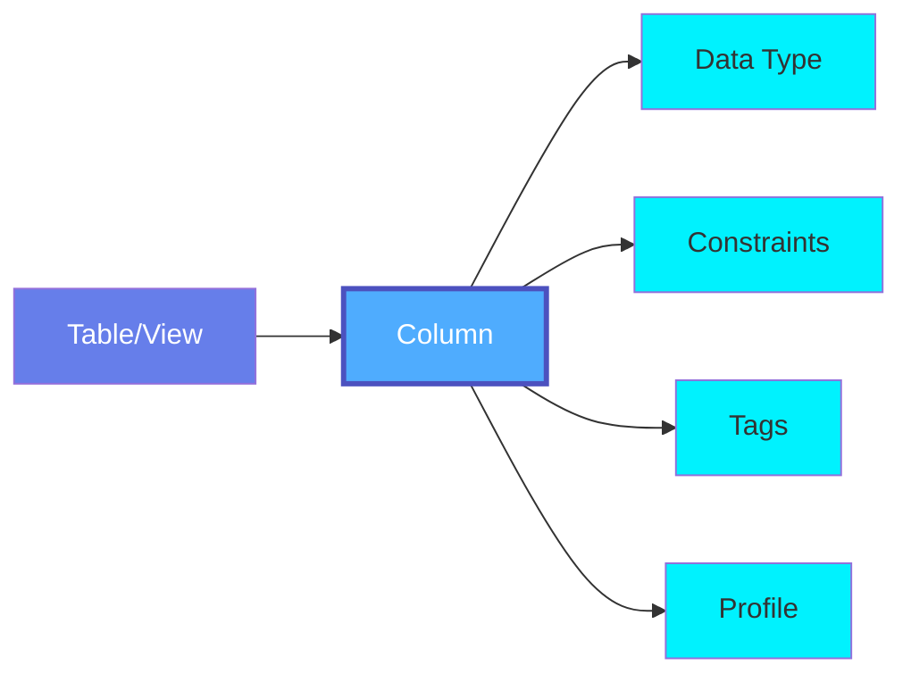

# Column

A **Column** represents an individual column or field within a database table, view, or stored procedure. While columns are typically modeled as properties of tables in OpenMetadata, this entity specification defines the comprehensive metadata model for column-level information.

## Overview

Columns in OpenMetadata capture detailed metadata about:

- **Schema Information**: Data type, length, precision, scale, nullability
- **Constraints**: Primary key, foreign key, unique, not null constraints
- **Semantics**: Business descriptions, glossary term mappings
- **Classification**: PII tags, sensitivity levels, data classifications
- **Lineage**: Column-level lineage showing data flow transformations
- **Quality**: Column-specific quality metrics and test results
- **Profiling**: Statistical profiles including distributions and patterns
- **Usage**: Query patterns, access frequency, popular joins

Columns are essential for:
- Data discovery and understanding
- Privacy and compliance management
- Data lineage and impact analysis
- Query optimization
- Data quality monitoring
- Semantic understanding

## Hierarchy



**Click on any node to learn more about that entity.**

## Relationships

Columns have relationships with various entities in the metadata ecosystem:

```mermaid
graph TD
    subgraph Column Structure
        A[Column:<br/>customer_email] --> B1[DataType:<br/>VARCHAR 255]
        A --> B2[Constraint:<br/>NOT NULL]
        A --> B3[Constraint:<br/>UNIQUE]
    end

    subgraph Parent Entity
        A -.->|belongs to| C1[Table:<br/>customers]
        C1 -.->|in schema| C2[Schema:<br/>public]
        C2 -.->|in database| C3[Database:<br/>production]
    end

    subgraph Relationships
        A -.->|foreign key to| D1[Column:<br/>account.email]
        A -.->|referenced by| D2[Column:<br/>orders.customer_email]
        A -.->|part of index| D3[Index:<br/>idx_customer_email]
    end

    subgraph Semantics
        A -.->|mapped to| E1[GlossaryTerm:<br/>Customer Email]
        A -.->|tagged with| E2[Tag:<br/>PII.Email]
        A -.->|tagged with| E3[Tag:<br/>GDPR]
        A -.->|described by| E4[Description]
    end

    subgraph Lineage
        A -.->|derived from| F1[Column:<br/>raw.user_email]
        A -.->|feeds into| F2[Column:<br/>analytics.email]
        A -.->|transformed by| F3[Query/Pipeline]
    end

    subgraph Quality & Profile
        A -.->|tested by| G1[TestCase:<br/>Email Format Check]
        A -.->|tested by| G2[TestCase:<br/>Uniqueness Check]
        A -.->|profiled in| G3[ColumnProfile:<br/>Statistics]
    end

    subgraph Usage
        A -.->|used in| H1[Query:<br/>Customer Report]
        A -.->|filtered by| H2[Dashboard Filter]
        A -.->|joined with| H3[Column:<br/>orders.id]
    end

    style A fill:#4facfe,color:#fff,stroke:#4c51bf,stroke-width:3px
    style B1 fill:#00f2fe,color:#333
    style B2 fill:#00f2fe,color:#333
    style B3 fill:#00f2fe,color:#333
    style C1 fill:#764ba2,color:#fff
    style C2 fill:#764ba2,color:#fff
    style C3 fill:#764ba2,color:#fff
    style D1 fill:#764ba2,color:#fff
    style D2 fill:#764ba2,color:#fff
    style D3 fill:#00f2fe,color:#333
    style E1 fill:#f093fb,color:#333
    style E2 fill:#fa709a,color:#fff
    style E3 fill:#fa709a,color:#fff
    style E4 fill:#ffd700,color:#333
    style F1 fill:#764ba2,color:#fff
    style F2 fill:#764ba2,color:#fff
    style F3 fill:#667eea,color:#fff
    style G1 fill:#f5576c,color:#fff
    style G2 fill:#f5576c,color:#fff
    style G3 fill:#ffd700,color:#333
    style H1 fill:#00f2fe,color:#333
    style H2 fill:#00f2fe,color:#333
    style H3 fill:#764ba2,color:#fff

    click A "#column" "Column"
    click C1 "./table/" "Table"
    click C2 "./database-schema/" "Schema"
    click C3 "./database/" "Database"
    click E1 "../../governance/glossary-term/" "Glossary Term"
    click E2 "../../governance/tag/" "Tag"
    click F3 "../../data-assets/pipelines/pipeline/" "Pipeline"
    click G1 "../../data-quality/test-case/" "Test Case"
    click G3 "../../data-quality/data-profile/" "Data Profile"
    click H1 "./query/" "Query"
```



**Key Relationships:**

- **Column Structure**: Data type, constraints, and properties
- **Parent Entity**: Table, Schema, and Database hierarchy
- **Relationships**: Foreign keys, references, and indexes
- **Semantics**: Glossary terms, tags, descriptions for business context
- **Lineage**: Source and target columns, transformation queries
- **Quality & Profile**: Test cases and statistical profiles
- **Usage**: Queries, dashboards, and joins using the column

## Schema Specifications

=== "JSON Schema"

    ```json
    {
      "$id": "https://open-metadata.org/schema/entity/data/table.json#/definitions/column",
      "$schema": "http://json-schema.org/draft-07/schema#",
      "title": "Column",
      "description": "This schema defines the type for a column in a table.",
      "type": "object",
      "javaType": "org.openmetadata.schema.type.Column",
      "javaInterfaces": ["org.openmetadata.schema.FieldInterface"],
      "definitions": {
        "columnName": {
          "description": "Local name (not fully qualified name) of the column. ColumnName is `-` when the column is not named in struct dataType. For example, BigQuery supports struct with unnamed fields.",
          "type": "string",
          "minLength": 1,
          "maxLength": 256,
          "pattern": "^((?!::).)*$"
        },
        "dataType": {
          "javaType": "org.openmetadata.schema.type.ColumnDataType",
          "description": "This enum defines the type of data stored in a column.",
          "type": "string",
          "enum": [
            "NUMBER", "TINYINT", "SMALLINT", "INT", "BIGINT", "BYTEINT", "BYTES",
            "FLOAT", "DOUBLE", "DECIMAL", "NUMERIC",
            "TIMESTAMP", "TIMESTAMPZ", "TIME", "DATE", "DATETIME", "INTERVAL",
            "STRING", "MEDIUMTEXT", "TEXT", "CHAR", "LONG", "VARCHAR",
            "BOOLEAN", "BINARY", "VARBINARY",
            "ARRAY", "BLOB", "LONGBLOB", "MEDIUMBLOB", "MAP", "STRUCT", "UNION", "SET",
            "GEOGRAPHY", "ENUM", "JSON", "UUID", "VARIANT", "GEOMETRY", "BYTEA",
            "AGGREGATEFUNCTION", "ERROR", "FIXED", "RECORD", "NULL", "SUPER",
            "HLLSKETCH", "PG_LSN", "PG_SNAPSHOT", "TSQUERY", "TXID_SNAPSHOT",
            "XML", "MACADDR", "TSVECTOR", "UNKNOWN", "CIDR", "INET", "CLOB",
            "ROWID", "LOWCARDINALITY", "YEAR", "POINT", "POLYGON", "TUPLE",
            "SPATIAL", "TABLE", "NTEXT", "IMAGE", "IPV4", "IPV6", "DATETIMERANGE",
            "HLL", "LARGEINT", "QUANTILE_STATE", "AGG_STATE", "BITMAP", "UINT",
            "BIT", "MONEY", "MEASURE HIDDEN", "MEASURE VISIBLE", "MEASURE",
            "KPI", "HEIRARCHY", "HIERARCHYID"
          ]
        },
        "constraint": {
          "javaType": "org.openmetadata.schema.type.ColumnConstraint",
          "description": "This enum defines the type for column constraint.",
          "type": "string",
          "enum": [
            "NULL",
            "NOT_NULL",
            "UNIQUE",
            "PRIMARY_KEY"
          ],
          "default": null,
          "additionalProperties": false
        },
        "columnProfile": {
          "type": "object",
          "javaType": "org.openmetadata.schema.type.ColumnProfile",
          "description": "This schema defines the type to capture the table's column profile.",
          "properties": {
            "name": {
              "description": "Column Name.",
              "type": "string"
            },
            "timestamp": {
              "description": "Timestamp on which profile is taken.",
              "$ref": "../../type/basic.json#/definitions/timestamp"
            },
            "valuesCount": {
              "description": "Total count of the values in this column.",
              "type": "number"
            },
            "valuesPercentage": {
              "description": "Percentage of values in this column with respect to row count.",
              "type": "number"
            },
            "validCount": {
              "description": "Total count of valid values in this column.",
              "type": "number"
            },
            "duplicateCount": {
              "description": "No.of Rows that contain duplicates in a column.",
              "type": "number"
            },
            "nullCount": {
              "description": "No.of null values in a column.",
              "type": "number"
            },
            "nullProportion": {
              "description": "No.of null value proportion in columns.",
              "type": "number"
            },
            "missingPercentage": {
              "description": "Missing Percentage is calculated by taking percentage of validCount/valuesCount.",
              "type": "number"
            },
            "missingCount": {
              "description": "Missing count is calculated by subtracting valuesCount - validCount.",
              "type": "number"
            },
            "uniqueCount": {
              "description": "No. of unique values in the column.",
              "type": "number"
            },
            "uniqueProportion": {
              "description": "Proportion of number of unique values in a column.",
              "type": "number"
            },
            "distinctCount": {
              "description": "Number of values that contain distinct values.",
              "type": "number"
            },
            "distinctProportion": {
              "description": "Proportion of distinct values in a column.",
              "type": "number"
            },
            "min": {
              "description": "Minimum value in a column.",
              "oneOf": [
                { "type": "number" },
                { "type": "integer" },
                { "$ref": "../../type/basic.json#/definitions/dateTime" },
                { "$ref": "../../type/basic.json#/definitions/time" },
                { "$ref": "../../type/basic.json#/definitions/date" },
                { "type": "string" }
              ]
            },
            "max": {
              "description": "Maximum value in a column.",
              "oneOf": [
                { "type": "number" },
                { "type": "integer" },
                { "$ref": "../../type/basic.json#/definitions/dateTime" },
                { "$ref": "../../type/basic.json#/definitions/time" },
                { "$ref": "../../type/basic.json#/definitions/date" },
                { "type": "string" }
              ]
            },
            "minLength": {
              "description": "Minimum string length in a column.",
              "type": "number"
            },
            "maxLength": {
              "description": "Maximum string length in a column.",
              "type": "number"
            },
            "mean": {
              "description": "Avg value in a column.",
              "type": "number"
            },
            "sum": {
              "description": "Median value in a column.",
              "type": "number"
            },
            "stddev": {
              "description": "Standard deviation of a column.",
              "type": "number"
            },
            "variance": {
              "description": "Variance of a column.",
              "type": "number"
            },
            "median": {
              "description": "Median of a column.",
              "type": "number"
            },
            "firstQuartile": {
              "description": "First quartile of a column.",
              "type": "number"
            },
            "thirdQuartile": {
              "description": "First quartile of a column.",
              "type": "number"
            },
            "interQuartileRange": {
              "description": "Inter quartile range of a column.",
              "type": "number"
            },
            "nonParametricSkew": {
              "description": "Non parametric skew of a column.",
              "type": "number"
            },
            "histogram": {
              "description": "Histogram of a column.",
              "properties": {
                "boundaries": {
                  "description": "Boundaries of Histogram.",
                  "type": "array"
                },
                "frequencies": {
                  "description": "Frequencies of Histogram.",
                  "type": "array"
                }
              },
              "additionalProperties": false
            },
            "customMetrics": {
              "description": "Custom Metrics profile list bound to a column.",
              "type": "array",
              "items": {
                "$ref": "#/definitions/customMetricProfile"
              },
              "default": null
            },
            "cardinalityDistribution": {
              "description": "Cardinality distribution showing top categories with an 'Others' bucket.",
              "type": "object",
              "properties": {
                "categories": {
                  "description": "List of category names including 'Others'.",
                  "type": "array",
                  "items": {
                    "type": "string"
                  }
                },
                "counts": {
                  "description": "List of counts corresponding to each category.",
                  "type": "array",
                  "items": {
                    "type": "integer"
                  }
                },
                "percentages": {
                  "description": "List of percentages corresponding to each category.",
                  "type": "array",
                  "items": {
                    "type": "number"
                  }
                },
                "allValuesUnique": {
                  "description": "Flag indicating that all values in the column are unique, so no distribution is calculated.",
                  "type": "boolean"
                }
              },
              "additionalProperties": false
            }
          },
          "required": ["name", "timestamp"],
          "additionalProperties": false
        }
      },
      "properties": {
        "name": {
          "$ref": "#/definitions/columnName"
        },
        "displayName": {
          "description": "Display Name that identifies this column name.",
          "type": "string"
        },
        "dataType": {
          "description": "Data type of the column (int, date etc.).",
          "$ref": "#/definitions/dataType"
        },
        "arrayDataType": {
          "description": "Data type used array in dataType. For example, `array<int>` has dataType as `array` and arrayDataType as `int`.",
          "$ref": "#/definitions/dataType"
        },
        "dataLength": {
          "description": "Length of `char`, `varchar`, `binary`, `varbinary` `dataTypes`, else null. For example, `varchar(20)` has dataType as `varchar` and dataLength as `20`.",
          "type": "integer"
        },
        "precision": {
          "description": "The precision of a numeric is the total count of significant digits in the whole number, that is, the number of digits to both sides of the decimal point. Precision is applicable Integer types, such as `INT`, `SMALLINT`, `BIGINT`, etc. It also applies to other Numeric types, such as `NUMBER`, `DECIMAL`, `DOUBLE`, `FLOAT`, etc.",
          "type": "integer"
        },
        "scale": {
          "description": "The scale of a numeric is the count of decimal digits in the fractional part, to the right of the decimal point. For Integer types, the scale is `0`. It mainly applies to non Integer Numeric types, such as `NUMBER`, `DECIMAL`, `DOUBLE`, `FLOAT`, etc.",
          "type": "integer"
        },
        "dataTypeDisplay": {
          "description": "Display name used for dataType. This is useful for complex types, such as `array<int>`, `map<int,string>`, `struct<>`, and union types.",
          "type": "string"
        },
        "description": {
          "description": "Description of the column.",
          "$ref": "../../type/basic.json#/definitions/markdown"
        },
        "fullyQualifiedName": {
          "$ref": "../../type/basic.json#/definitions/fullyQualifiedEntityName"
        },
        "tags": {
          "description": "Tags associated with the column.",
          "type": "array",
          "items": {
            "$ref": "../../type/tagLabel.json"
          },
          "default": []
        },
        "constraint": {
          "description": "Column level constraint.",
          "$ref": "#/definitions/constraint"
        },
        "ordinalPosition": {
          "description": "Ordinal position of the column.",
          "type": "integer"
        },
        "jsonSchema": {
          "description": "Json schema only if the dataType is JSON else null.",
          "type": "string"
        },
        "children": {
          "description": "Child columns if dataType or arrayDataType is `map`, `struct`, or `union` else `null`.",
          "type": "array",
          "items": {
            "$ref": "#/definitions/column"
          }
        },
        "profile": {
          "description": "Latest Data profile for a Column.",
          "$ref": "#/definitions/columnProfile",
          "default": null
        },
        "customMetrics": {
          "description": "List of Custom Metrics registered for a table.",
          "type": "array",
          "items": {
            "$ref": "../../tests/customMetric.json"
          },
          "default": null
        }
      },
      "required": [
        "name",
        "dataType"
      ],
      "additionalProperties": false
    }
    ```

=== "RDF (Turtle)"

    ```turtle
    @prefix om: <https://open-metadata.org/schema/> .
    @prefix om-entity: <https://open-metadata.org/schema/entity/> .
    @prefix om-type: <https://open-metadata.org/schema/type/> .
    @prefix rdf: <http://www.w3.org/1999/02/22-rdf-syntax-ns#> .
    @prefix rdfs: <http://www.w3.org/2000/01/rdf-schema#> .
    @prefix owl: <http://www.w3.org/2002/07/owl#> .
    @prefix xsd: <http://www.w3.org/2001/XMLSchema#> .
    @prefix dcterms: <http://purl.org/dc/terms/> .
    @prefix skos: <http://www.w3.org/2004/02/skos/core#> .

    # Column Type Definition
    om-type:Column a owl:Class ;
        rdfs:label "Column" ;
        rdfs:comment "This schema defines the type for a column in a table." ;
        rdfs:isDefinedBy <https://open-metadata.org/schema/entity/data/table.json#/definitions/column> .

    # Column Data Type
    om-type:ColumnDataType a owl:Class ;
        rdfs:label "Column Data Type" ;
        rdfs:comment "This enum defines the type of data stored in a column." ;
        rdfs:isDefinedBy om: .

    # Column Constraint Type
    om-type:ColumnConstraint a owl:Class ;
        rdfs:label "Column Constraint" ;
        rdfs:comment "This enum defines the type for column constraint." ;
        rdfs:isDefinedBy om: .

    # Column Profile Type
    om-type:ColumnProfile a owl:Class ;
        rdfs:label "Column Profile" ;
        rdfs:comment "This schema defines the type to capture the table's column profile." ;
        rdfs:isDefinedBy om: .

    # Properties
    om-type:name a owl:DatatypeProperty ;
        rdfs:label "name" ;
        rdfs:comment "Local name (not fully qualified name) of the column" ;
        rdfs:domain om-type:Column ;
        rdfs:range xsd:string .

    om-type:displayName a owl:DatatypeProperty ;
        rdfs:label "display name" ;
        rdfs:comment "Display Name that identifies this column name" ;
        rdfs:domain om-type:Column ;
        rdfs:range xsd:string .

    om-type:dataType a owl:ObjectProperty ;
        rdfs:label "data type" ;
        rdfs:comment "Data type of the column (int, date etc.)" ;
        rdfs:domain om-type:Column ;
        rdfs:range om-type:ColumnDataType .

    om-type:arrayDataType a owl:ObjectProperty ;
        rdfs:label "array data type" ;
        rdfs:comment "Data type used array in dataType" ;
        rdfs:domain om-type:Column ;
        rdfs:range om-type:ColumnDataType .

    om-type:dataTypeDisplay a owl:DatatypeProperty ;
        rdfs:label "data type display" ;
        rdfs:comment "Display name used for dataType" ;
        rdfs:domain om-type:Column ;
        rdfs:range xsd:string .

    om-type:dataLength a owl:DatatypeProperty ;
        rdfs:label "data length" ;
        rdfs:comment "Length of char, varchar, binary, varbinary dataTypes" ;
        rdfs:domain om-type:Column ;
        rdfs:range xsd:integer .

    om-type:precision a owl:DatatypeProperty ;
        rdfs:label "precision" ;
        rdfs:comment "The precision of a numeric is the total count of significant digits" ;
        rdfs:domain om-type:Column ;
        rdfs:range xsd:integer .

    om-type:scale a owl:DatatypeProperty ;
        rdfs:label "scale" ;
        rdfs:comment "The scale of a numeric is the count of decimal digits in the fractional part" ;
        rdfs:domain om-type:Column ;
        rdfs:range xsd:integer .

    om-type:constraint a owl:ObjectProperty ;
        rdfs:label "constraint" ;
        rdfs:comment "Column level constraint" ;
        rdfs:domain om-type:Column ;
        rdfs:range om-type:ColumnConstraint .

    om-type:ordinalPosition a owl:DatatypeProperty ;
        rdfs:label "ordinal position" ;
        rdfs:comment "Ordinal position of the column" ;
        rdfs:domain om-type:Column ;
        rdfs:range xsd:integer .

    om-type:jsonSchema a owl:DatatypeProperty ;
        rdfs:label "json schema" ;
        rdfs:comment "Json schema only if the dataType is JSON else null" ;
        rdfs:domain om-type:Column ;
        rdfs:range xsd:string .

    om-type:children a owl:ObjectProperty ;
        rdfs:label "children" ;
        rdfs:comment "Child columns if dataType or arrayDataType is map, struct, or union" ;
        rdfs:domain om-type:Column ;
        rdfs:range om-type:Column .

    om-type:profile a owl:ObjectProperty ;
        rdfs:label "profile" ;
        rdfs:comment "Latest Data profile for a Column" ;
        rdfs:domain om-type:Column ;
        rdfs:range om-type:ColumnProfile .

    om-type:customMetrics a owl:ObjectProperty ;
        rdfs:label "custom metrics" ;
        rdfs:comment "List of Custom Metrics registered for a table" ;
        rdfs:domain om-type:Column .

    # Constraint Individuals (only those defined in the schema)
    om-type:NULL a om-type:ColumnConstraint ;
        rdfs:label "NULL" ;
        skos:definition "Column allows NULL values" .

    om-type:NOT_NULL a om-type:ColumnConstraint ;
        rdfs:label "NOT NULL" ;
        skos:definition "Column does not allow NULL values" .

    om-type:UNIQUE a om-type:ColumnConstraint ;
        rdfs:label "UNIQUE" ;
        skos:definition "Column values must be unique" .

    om-type:PRIMARY_KEY a om-type:ColumnConstraint ;
        rdfs:label "PRIMARY KEY" ;
        skos:definition "Column is part of the primary key" .
    ```

=== "JSON-LD Context"

    ```json
    {
      "@context": {
        "@vocab": "https://open-metadata.org/schema/type/",
        "rdf": "http://www.w3.org/1999/02/22-rdf-syntax-ns#",
        "rdfs": "http://www.w3.org/2000/01/rdf-schema#",
        "owl": "http://www.w3.org/2002/07/owl#",
        "xsd": "http://www.w3.org/2001/XMLSchema#",
        "dcterms": "http://purl.org/dc/terms/",
        "om": "https://open-metadata.org/schema/type/",

        "Column": {
          "@id": "om:Column",
          "@type": "@id"
        },
        "name": {
          "@id": "om:name",
          "@type": "xsd:string"
        },
        "displayName": {
          "@id": "om:displayName",
          "@type": "xsd:string"
        },
        "description": {
          "@id": "dcterms:description",
          "@type": "xsd:string"
        },
        "dataType": {
          "@id": "om:dataType",
          "@type": "@id"
        },
        "arrayDataType": {
          "@id": "om:arrayDataType",
          "@type": "@id"
        },
        "dataTypeDisplay": {
          "@id": "om:dataTypeDisplay",
          "@type": "xsd:string"
        },
        "dataLength": {
          "@id": "om:dataLength",
          "@type": "xsd:integer"
        },
        "precision": {
          "@id": "om:precision",
          "@type": "xsd:integer"
        },
        "scale": {
          "@id": "om:scale",
          "@type": "xsd:integer"
        },
        "fullyQualifiedName": {
          "@id": "om:fullyQualifiedName",
          "@type": "xsd:string"
        },
        "constraint": {
          "@id": "om:constraint",
          "@type": "@id"
        },
        "ordinalPosition": {
          "@id": "om:ordinalPosition",
          "@type": "xsd:integer"
        },
        "jsonSchema": {
          "@id": "om:jsonSchema",
          "@type": "xsd:string"
        },
        "tags": {
          "@id": "om:tags",
          "@type": "@id",
          "@container": "@set"
        },
        "profile": {
          "@id": "om:profile",
          "@type": "@id"
        },
        "children": {
          "@id": "om:children",
          "@type": "@id",
          "@container": "@set"
        },
        "customMetrics": {
          "@id": "om:customMetrics",
          "@type": "@id",
          "@container": "@set"
        }
      }
    }
    ```

## Use Cases

### Simple Column Definition

A basic varchar column with NOT NULL constraint:

```json
{
  "name": "customer_email",
  "displayName": "Customer Email",
  "dataType": "VARCHAR",
  "dataLength": 255,
  "constraint": "NOT_NULL",
  "ordinalPosition": 3,
  "description": "Email address of the customer",
  "tags": [
    {
      "tagFQN": "PII.Email"
    },
    {
      "tagFQN": "Compliance.GDPR"
    }
  ]
}
```

### Primary Key Column

An integer primary key column:

```json
{
  "name": "customer_id",
  "displayName": "Customer ID",
  "dataType": "BIGINT",
  "constraint": "PRIMARY_KEY",
  "ordinalPosition": 1,
  "description": "Unique identifier for customers"
}
```

### Decimal Column with Precision

A decimal column for monetary values:

```json
{
  "name": "total_amount",
  "displayName": "Total Amount",
  "dataType": "DECIMAL",
  "dataTypeDisplay": "decimal(10,2)",
  "precision": 10,
  "scale": 2,
  "constraint": "NOT_NULL",
  "ordinalPosition": 5,
  "description": "Total order amount in USD",
  "tags": [
    {
      "tagFQN": "BusinessCritical"
    }
  ]
}
```

### JSON Column

A JSON column with schema definition:

```json
{
  "name": "customer_metadata",
  "displayName": "Customer Metadata",
  "dataType": "JSON",
  "ordinalPosition": 10,
  "description": "Additional customer attributes in JSON format",
  "jsonSchema": "{\"type\": \"object\", \"properties\": {\"preferences\": {\"type\": \"object\"}, \"tags\": {\"type\": \"array\"}}}",
  "tags": [
    {
      "tagFQN": "SemiStructured"
    }
  ]
}
```

### Nested Struct Column

A struct/nested column (common in data warehouses):

```json
{
  "name": "address",
  "displayName": "Address",
  "dataType": "STRUCT",
  "dataTypeDisplay": "struct<street:string, city:string, state:string, zip:string>",
  "ordinalPosition": 4,
  "description": "Customer mailing address",
  "children": [
    {
      "name": "street",
      "dataType": "STRING",
      "ordinalPosition": 1
    },
    {
      "name": "city",
      "dataType": "STRING",
      "ordinalPosition": 2
    },
    {
      "name": "state",
      "dataType": "STRING",
      "dataLength": 2,
      "ordinalPosition": 3
    },
    {
      "name": "zip",
      "dataType": "STRING",
      "dataLength": 10,
      "ordinalPosition": 4
    }
  ],
  "tags": [
    {
      "tagFQN": "PII.Address"
    }
  ]
}
```

### Column with Profile

A column with statistical profile:

```json
{
  "name": "age",
  "displayName": "Age",
  "dataType": "INT",
  "ordinalPosition": 6,
  "description": "Customer age in years",
  "profile": {
    "name": "age",
    "valuesCount": 1000000,
    "nullCount": 5000,
    "nullProportion": 0.005,
    "uniqueCount": 80,
    "distinctCount": 80,
    "min": 18,
    "max": 95,
    "mean": 42.5,
    "median": 41,
    "stddev": 15.2,
    "timestamp": 1705320000000
  }
}
```

## Data Types

OpenMetadata supports a comprehensive set of data types across different database systems:

### Numeric Types
- **Integer Types**: `TINYINT`, `SMALLINT`, `INT`, `BIGINT`, `BYTEINT`, `LARGEINT`, `UINT`
- **Decimal Types**: `NUMBER`, `DECIMAL`, `NUMERIC`, `FLOAT`, `DOUBLE`
- **Special Numeric**: `BIT`, `MONEY`

### String Types
- **Character Types**: `STRING`, `TEXT`, `MEDIUMTEXT`, `CHAR`, `VARCHAR`, `LONG`, `NTEXT`, `CLOB`

### Date/Time Types
- `DATE`, `TIME`, `DATETIME`, `TIMESTAMP`, `TIMESTAMPZ`, `INTERVAL`, `DATETIMERANGE`, `YEAR`

### Boolean
- `BOOLEAN`

### Binary Types
- `BINARY`, `VARBINARY`, `BLOB`, `LONGBLOB`, `MEDIUMBLOB`, `BYTEA`, `BYTES`

### Complex Types
- `ARRAY`: Array of values
- `MAP`: Key-value pairs
- `STRUCT`: Nested structure
- `UNION`: Union type
- `RECORD`: Record type
- `TUPLE`: Tuple type
- `TABLE`: Table type

### Document & Semi-structured
- `JSON`: JSON documents
- `XML`: XML documents
- `VARIANT`: Variant/flexible type (Snowflake)

### Spatial & Geographic
- `GEOGRAPHY`: Geographic coordinates
- `GEOMETRY`: Geometric shapes
- `POINT`: Point coordinates
- `POLYGON`: Polygon shapes
- `SPATIAL`: General spatial data

### Specialized Types
- **Identifiers**: `UUID`, `ROWID`
- **Enumerations**: `ENUM`, `SET`
- **Network**: `IPV4`, `IPV6`, `INET`, `CIDR`, `MACADDR`
- **PostgreSQL-specific**: `PG_LSN`, `PG_SNAPSHOT`, `TSQUERY`, `TXID_SNAPSHOT`, `TSVECTOR`
- **Analytics**: `HLLSKETCH`, `HLL`, `QUANTILE_STATE`, `AGG_STATE`, `BITMAP`, `AGGREGATEFUNCTION`
- **Data Warehouse**: `SUPER` (Redshift), `LOWCARDINALITY` (ClickHouse)
- **Business Intelligence**: `MEASURE`, `MEASURE HIDDEN`, `MEASURE VISIBLE`, `KPI`, `HEIRARCHY`, `HIERARCHYID`
- **Special**: `NULL`, `UNKNOWN`, `ERROR`, `FIXED`, `IMAGE`

## Column Constraints

Column-level constraints define rules that apply to individual columns:

| Constraint | Description | Example |
|------------|-------------|---------|
| **NULL** | Column allows NULL values | Default for most columns |
| **NOT_NULL** | Column cannot be NULL | Required fields |
| **UNIQUE** | All values must be unique | Email addresses |
| **PRIMARY_KEY** | Uniquely identifies rows | Customer ID |

**Note:** Foreign key constraints are defined at the table level using `tableConstraints`, not as column-level constraints.

## Column Profiling

Column profiles provide statistical insights:

```json
{
  "profile": {
    "valuesCount": 1000000,
    "validCount": 995000,
    "nullCount": 5000,
    "nullProportion": 0.005,
    "uniqueCount": 50000,
    "uniqueProportion": 0.05,
    "distinctCount": 50000,
    "distinctProportion": 0.05,
    "duplicateCount": 945000,
    "min": 1,
    "max": 999999,
    "mean": 500000,
    "median": 498765,
    "stddev": 288675,
    "sum": 500000000000,
    "timestamp": 1705320000000
  }
}
```

## Column-Level Lineage

Columns can have lineage relationships showing data transformations:


## Best Practices

### 1. Descriptive Names
Use clear, descriptive column names that convey business meaning.

### 2. Data Type Precision
Choose appropriate data types with correct precision and scale.

### 3. Tag PII Data
Tag all personally identifiable information for compliance.

### 4. Document Business Logic
Provide clear descriptions explaining column purpose and business rules.

### 5. Map to Glossary
Link columns to glossary terms for semantic understanding.

### 6. Profile Regularly
Run column profiling to understand data distributions and quality.

### 7. Test Data Quality
Create test cases for critical columns (nullability, uniqueness, format).

### 8. Track Lineage
Maintain column-level lineage for impact analysis.

## Custom Properties

This entity supports custom properties through the `extension` field.
Common custom properties include:

- **Data Classification**: Sensitivity level
- **Cost Center**: Billing allocation
- **Retention Period**: Data retention requirements
- **Application Owner**: Owning application/team

See [Custom Properties](../../metadata-specifications/custom-properties.md)
for details on defining and using custom properties.

---

## Related Entities

- **[Table](./table.md)**: Parent table containing the column
- **[Database Schema](./database-schema.md)**: Schema containing the table
- **[Database](./database.md)**: Database containing the schema
- **[Glossary Term](../../governance/glossary-term.md)**: Business terms mapped to columns
- **[Tag](../../governance/tag.md)**: Tags for classification and compliance
- **[TestCase](../../data-quality/test-case.md)**: Quality tests for columns
- **[DataProfile](../../data-quality/data-profile.md)**: Statistical profiles of columns
- **[Query](./query.md)**: Queries accessing the column
