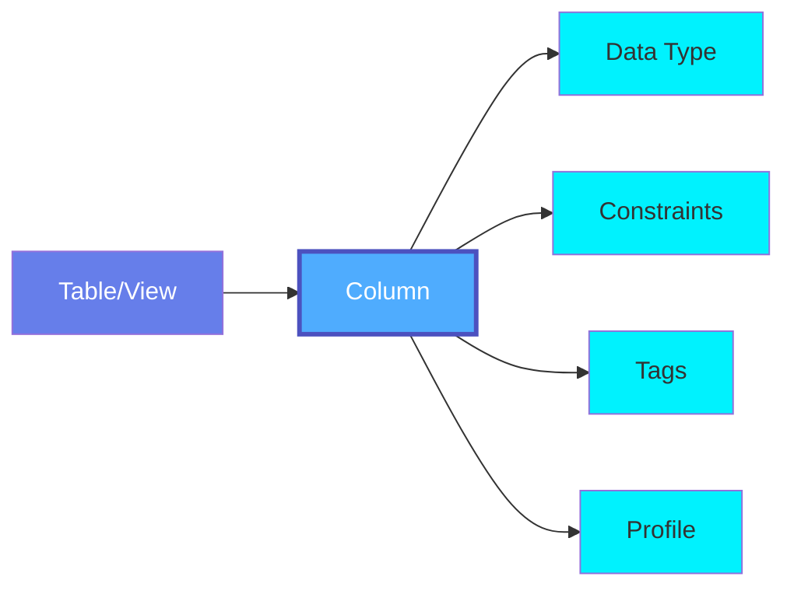

# Column

A **Column** represents an individual column or field within a database table, view, or stored procedure. While columns are typically modeled as properties of tables in OpenMetadata, this entity specification defines the comprehensive metadata model for column-level information.

## Overview

Columns in OpenMetadata capture detailed metadata about:

- **Schema Information**: Data type, length, precision, scale, nullability
- **Constraints**: Primary key, foreign key, unique, not null constraints
- **Semantics**: Business descriptions, glossary term mappings
- **Classification**: PII tags, sensitivity levels, data classifications
- **Lineage**: Column-level lineage showing data flow transformations
- **Quality**: Column-specific quality metrics and test results
- **Profiling**: Statistical profiles including distributions and patterns
- **Usage**: Query patterns, access frequency, popular joins

Columns are essential for:
- Data discovery and understanding
- Privacy and compliance management
- Data lineage and impact analysis
- Query optimization
- Data quality monitoring
- Semantic understanding

## Hierarchy



**Click on any node to learn more about that entity.**

## Relationships

Columns have relationships with various entities in the metadata ecosystem:

```mermaid
graph TD
    subgraph Column Structure
        A[Column:<br/>customer_email] --> B1[DataType:<br/>VARCHAR 255]
        A --> B2[Constraint:<br/>NOT NULL]
        A --> B3[Constraint:<br/>UNIQUE]
    end

    subgraph Parent Entity
        A -.->|belongs to| C1[Table:<br/>customers]
        C1 -.->|in schema| C2[Schema:<br/>public]
        C2 -.->|in database| C3[Database:<br/>production]
    end

    subgraph Relationships
        A -.->|foreign key to| D1[Column:<br/>account.email]
        A -.->|referenced by| D2[Column:<br/>orders.customer_email]
        A -.->|part of index| D3[Index:<br/>idx_customer_email]
    end

    subgraph Semantics
        A -.->|mapped to| E1[GlossaryTerm:<br/>Customer Email]
        A -.->|tagged with| E2[Tag:<br/>PII.Email]
        A -.->|tagged with| E3[Tag:<br/>GDPR]
        A -.->|described by| E4[Description]
    end

    subgraph Lineage
        A -.->|derived from| F1[Column:<br/>raw.user_email]
        A -.->|feeds into| F2[Column:<br/>analytics.email]
        A -.->|transformed by| F3[Query/Pipeline]
    end

    subgraph Quality & Profile
        A -.->|tested by| G1[TestCase:<br/>Email Format Check]
        A -.->|tested by| G2[TestCase:<br/>Uniqueness Check]
        A -.->|profiled in| G3[ColumnProfile:<br/>Statistics]
    end

    subgraph Usage
        A -.->|used in| H1[Query:<br/>Customer Report]
        A -.->|filtered by| H2[Dashboard Filter]
        A -.->|joined with| H3[Column:<br/>orders.id]
    end

    style A fill:#4facfe,color:#fff,stroke:#4c51bf,stroke-width:3px
    style B1 fill:#00f2fe,color:#333
    style B2 fill:#00f2fe,color:#333
    style B3 fill:#00f2fe,color:#333
    style C1 fill:#764ba2,color:#fff
    style C2 fill:#764ba2,color:#fff
    style C3 fill:#764ba2,color:#fff
    style D1 fill:#764ba2,color:#fff
    style D2 fill:#764ba2,color:#fff
    style D3 fill:#00f2fe,color:#333
    style E1 fill:#f093fb,color:#333
    style E2 fill:#fa709a,color:#fff
    style E3 fill:#fa709a,color:#fff
    style E4 fill:#ffd700,color:#333
    style F1 fill:#764ba2,color:#fff
    style F2 fill:#764ba2,color:#fff
    style F3 fill:#667eea,color:#fff
    style G1 fill:#f5576c,color:#fff
    style G2 fill:#f5576c,color:#fff
    style G3 fill:#ffd700,color:#333
    style H1 fill:#00f2fe,color:#333
    style H2 fill:#00f2fe,color:#333
    style H3 fill:#764ba2,color:#fff

    click A "#column" "Column"
    click C1 "./table/" "Table"
    click C2 "./database-schema/" "Schema"
    click C3 "./database/" "Database"
    click E1 "../../governance/glossary-term/" "Glossary Term"
    click E2 "../../governance/tag/" "Tag"
    click F3 "../../data-assets/pipelines/pipeline/" "Pipeline"
    click G1 "../../data-quality/test-case/" "Test Case"
    click G3 "../../data-quality/data-profile/" "Data Profile"
    click H1 "./query/" "Query"
```



**Key Relationships:**

- **Column Structure**: Data type, constraints, and properties
- **Parent Entity**: Table, Schema, and Database hierarchy
- **Relationships**: Foreign keys, references, and indexes
- **Semantics**: Glossary terms, tags, descriptions for business context
- **Lineage**: Source and target columns, transformation queries
- **Quality & Profile**: Test cases and statistical profiles
- **Usage**: Queries, dashboards, and joins using the column

## Schema Specifications

=== "JSON Schema"

    ```json
    {
      "$id": "https://open-metadata.org/schema/entity/data/column.json",
      "$schema": "http://json-schema.org/draft-07/schema#",
      "title": "Column",
      "description": "A Column represents a field within a database table or view.",
      "type": "object",
      "javaType": "org.openmetadata.schema.entity.data.Column",
      "definitions": {
        "dataType": {
          "description": "Data type of the column",
          "javaType": "org.openmetadata.schema.type.ColumnDataType",
          "type": "string",
          "enum": [
            "NUMBER",
            "TINYINT",
            "SMALLINT",
            "INT",
            "BIGINT",
            "FLOAT",
            "DOUBLE",
            "DECIMAL",
            "NUMERIC",
            "TIMESTAMP",
            "TIME",
            "DATE",
            "DATETIME",
            "INTERVAL",
            "STRING",
            "MEDIUMTEXT",
            "TEXT",
            "CHAR",
            "VARCHAR",
            "BOOLEAN",
            "BINARY",
            "VARBINARY",
            "ARRAY",
            "BLOB",
            "LONGBLOB",
            "MEDIUMBLOB",
            "MAP",
            "STRUCT",
            "UNION",
            "SET",
            "GEOGRAPHY",
            "ENUM",
            "JSON",
            "UUID",
            "BYTEA"
          ]
        },
        "constraint": {
          "description": "Column constraint type",
          "type": "string",
          "enum": [
            "NULL",
            "NOT_NULL",
            "UNIQUE",
            "PRIMARY_KEY",
            "FOREIGN_KEY"
          ]
        },
        "columnProfile": {
          "type": "object",
          "description": "Statistical profile of the column",
          "properties": {
            "name": {
              "description": "Column name",
              "type": "string"
            },
            "valuesCount": {
              "description": "Total count of values in the column",
              "type": "number"
            },
            "valuesPercentage": {
              "description": "Percentage of values in the column",
              "type": "number"
            },
            "validCount": {
              "description": "Count of valid values",
              "type": "number"
            },
            "duplicateCount": {
              "description": "Count of duplicate values",
              "type": "number"
            },
            "nullCount": {
              "description": "Count of null values",
              "type": "number"
            },
            "nullProportion": {
              "description": "Proportion of null values",
              "type": "number"
            },
            "uniqueCount": {
              "description": "Count of unique values",
              "type": "number"
            },
            "uniqueProportion": {
              "description": "Proportion of unique values",
              "type": "number"
            },
            "min": {
              "description": "Minimum value",
              "type": ["number", "string"]
            },
            "max": {
              "description": "Maximum value",
              "type": ["number", "string"]
            },
            "mean": {
              "description": "Mean value for numeric columns",
              "type": "number"
            },
            "median": {
              "description": "Median value",
              "type": "number"
            },
            "stddev": {
              "description": "Standard deviation",
              "type": "number"
            },
            "sum": {
              "description": "Sum of values for numeric columns",
              "type": "number"
            },
            "distinctCount": {
              "description": "Count of distinct values",
              "type": "number"
            },
            "distinctProportion": {
              "description": "Proportion of distinct values",
              "type": "number"
            },
            "histogram": {
              "description": "Histogram of value distribution",
              "type": "object"
            },
            "timestamp": {
              "description": "Timestamp of the profile",
              "$ref": "../../type/basic.json#/definitions/timestamp"
            }
          }
        },
        "dataTypeDisplay": {
          "description": "Display name for the data type (e.g., varchar(100), decimal(10,2))",
          "type": "string"
        },
        "columnConstraint": {
          "description": "Column constraint",
          "type": "object",
          "properties": {
            "constraintType": {
              "$ref": "#/definitions/constraint"
            },
            "columns": {
              "description": "List of columns involved in the constraint",
              "type": "array",
              "items": {
                "type": "string"
              }
            }
          }
        }
      },
      "properties": {
        "name": {
          "description": "Name of the column",
          "$ref": "../../type/basic.json#/definitions/entityName"
        },
        "displayName": {
          "description": "Display name for the column",
          "type": "string"
        },
        "dataType": {
          "$ref": "#/definitions/dataType"
        },
        "dataTypeDisplay": {
          "$ref": "#/definitions/dataTypeDisplay"
        },
        "arrayDataType": {
          "description": "Data type of array elements for ARRAY type",
          "$ref": "#/definitions/dataType"
        },
        "dataLength": {
          "description": "Length of the data type (for CHAR, VARCHAR)",
          "type": "integer"
        },
        "precision": {
          "description": "Precision for numeric types",
          "type": "integer"
        },
        "scale": {
          "description": "Scale for numeric types",
          "type": "integer"
        },
        "description": {
          "description": "Description of the column",
          "$ref": "../../type/basic.json#/definitions/markdown"
        },
        "fullyQualifiedName": {
          "description": "Fully qualified name of the column",
          "$ref": "../../type/basic.json#/definitions/fullyQualifiedEntityName"
        },
        "tags": {
          "description": "Tags associated with the column",
          "type": "array",
          "items": {
            "$ref": "../../type/tagLabel.json"
          }
        },
        "constraint": {
          "$ref": "#/definitions/constraint"
        },
        "ordinalPosition": {
          "description": "Ordinal position of the column in the table",
          "type": "integer"
        },
        "jsonSchema": {
          "description": "JSON schema for JSON data type",
          "type": "string"
        },
        "children": {
          "description": "Child columns for nested types (STRUCT, MAP)",
          "type": "array",
          "items": {
            "$ref": "#"
          }
        },
        "customMetrics": {
          "description": "Custom metrics for the column",
          "type": "array",
          "items": {
            "$ref": "../../type/customProperty.json"
          }
        },
        "profile": {
          "$ref": "#/definitions/columnProfile"
        }
      },
      "required": [
        "name",
        "dataType"
      ],
      "additionalProperties": false
    }
    ```

=== "RDF (Turtle)"

    ```turtle
    @prefix om: <https://open-metadata.org/schema/> .
    @prefix om-entity: <https://open-metadata.org/schema/entity/> .
    @prefix om-column: <https://open-metadata.org/schema/entity/data/> .
    @prefix rdf: <http://www.w3.org/1999/02/22-rdf-syntax-ns#> .
    @prefix rdfs: <http://www.w3.org/2000/01/rdf-schema#> .
    @prefix owl: <http://www.w3.org/2002/07/owl#> .
    @prefix xsd: <http://www.w3.org/2001/XMLSchema#> .
    @prefix dcterms: <http://purl.org/dc/terms/> .
    @prefix skos: <http://www.w3.org/2004/02/skos/core#> .

    # Column Class Definition
    om-column:Column a owl:Class ;
        rdfs:label "Column" ;
        rdfs:comment "A column or field within a database table or view" ;
        rdfs:subClassOf om-entity:Entity ;
        rdfs:isDefinedBy om: .

    # Data Type Class
    om-column:DataType a owl:Class ;
        rdfs:label "Data Type" ;
        rdfs:comment "Data type of a column" ;
        rdfs:isDefinedBy om: .

    # Constraint Class
    om-column:Constraint a owl:Class ;
        rdfs:label "Constraint" ;
        rdfs:comment "Constraint on a column" ;
        rdfs:isDefinedBy om: .

    # Column Profile Class
    om-column:ColumnProfile a owl:Class ;
        rdfs:label "Column Profile" ;
        rdfs:comment "Statistical profile of a column" ;
        rdfs:isDefinedBy om: .

    # Properties
    om-column:dataType a owl:ObjectProperty ;
        rdfs:label "data type" ;
        rdfs:comment "Data type of the column" ;
        rdfs:domain om-column:Column ;
        rdfs:range om-column:DataType .

    om-column:dataTypeDisplay a owl:DatatypeProperty ;
        rdfs:label "data type display" ;
        rdfs:comment "Display representation of the data type" ;
        rdfs:domain om-column:Column ;
        rdfs:range xsd:string .

    om-column:dataLength a owl:DatatypeProperty ;
        rdfs:label "data length" ;
        rdfs:comment "Length of the data type" ;
        rdfs:domain om-column:Column ;
        rdfs:range xsd:integer .

    om-column:precision a owl:DatatypeProperty ;
        rdfs:label "precision" ;
        rdfs:comment "Precision for numeric types" ;
        rdfs:domain om-column:Column ;
        rdfs:range xsd:integer .

    om-column:scale a owl:DatatypeProperty ;
        rdfs:label "scale" ;
        rdfs:comment "Scale for numeric types" ;
        rdfs:domain om-column:Column ;
        rdfs:range xsd:integer .

    om-column:constraint a owl:ObjectProperty ;
        rdfs:label "constraint" ;
        rdfs:comment "Constraint on the column" ;
        rdfs:domain om-column:Column ;
        rdfs:range om-column:Constraint .

    om-column:ordinalPosition a owl:DatatypeProperty ;
        rdfs:label "ordinal position" ;
        rdfs:comment "Position of the column in the table" ;
        rdfs:domain om-column:Column ;
        rdfs:range xsd:integer .

    om-column:belongsTo a owl:ObjectProperty ;
        rdfs:label "belongs to" ;
        rdfs:comment "Table to which the column belongs" ;
        rdfs:domain om-column:Column ;
        rdfs:range om-entity:Table .

    om-column:foreignKeyTo a owl:ObjectProperty ;
        rdfs:label "foreign key to" ;
        rdfs:comment "Column referenced by foreign key" ;
        rdfs:domain om-column:Column ;
        rdfs:range om-column:Column .

    om-column:derivedFrom a owl:ObjectProperty ;
        rdfs:label "derived from" ;
        rdfs:comment "Source column from which this column is derived" ;
        rdfs:domain om-column:Column ;
        rdfs:range om-column:Column .

    om-column:feedsInto a owl:ObjectProperty ;
        rdfs:label "feeds into" ;
        rdfs:comment "Target column that this column feeds" ;
        rdfs:domain om-column:Column ;
        rdfs:range om-column:Column .

    om-column:hasProfile a owl:ObjectProperty ;
        rdfs:label "has profile" ;
        rdfs:comment "Statistical profile of the column" ;
        rdfs:domain om-column:Column ;
        rdfs:range om-column:ColumnProfile .

    om-column:testedBy a owl:ObjectProperty ;
        rdfs:label "tested by" ;
        rdfs:comment "Test cases validating the column" ;
        rdfs:domain om-column:Column ;
        rdfs:range om-entity:TestCase .

    # Constraint Individuals
    om-column:NULL a om-column:Constraint ;
        rdfs:label "NULL" ;
        skos:definition "Column allows NULL values" .

    om-column:NOT_NULL a om-column:Constraint ;
        rdfs:label "NOT NULL" ;
        skos:definition "Column does not allow NULL values" .

    om-column:UNIQUE a om-column:Constraint ;
        rdfs:label "UNIQUE" ;
        skos:definition "Column values must be unique" .

    om-column:PRIMARY_KEY a om-column:Constraint ;
        rdfs:label "PRIMARY KEY" ;
        skos:definition "Column is part of the primary key" .

    om-column:FOREIGN_KEY a om-column:Constraint ;
        rdfs:label "FOREIGN KEY" ;
        skos:definition "Column is a foreign key reference" .
    ```

=== "JSON-LD Context"

    ```json
    {
      "@context": {
        "@vocab": "https://open-metadata.org/schema/entity/data/",
        "rdf": "http://www.w3.org/1999/02/22-rdf-syntax-ns#",
        "rdfs": "http://www.w3.org/2000/01/rdf-schema#",
        "owl": "http://www.w3.org/2002/07/owl#",
        "xsd": "http://www.w3.org/2001/XMLSchema#",
        "dcterms": "http://purl.org/dc/terms/",
        "skos": "http://www.w3.org/2004/02/skos/core#",
        "om": "https://open-metadata.org/schema/",

        "Column": {
          "@id": "om:Column",
          "@type": "@id"
        },
        "name": {
          "@id": "om:name",
          "@type": "xsd:string"
        },
        "displayName": {
          "@id": "om:displayName",
          "@type": "xsd:string"
        },
        "description": {
          "@id": "dcterms:description",
          "@type": "xsd:string"
        },
        "dataType": {
          "@id": "om:dataType",
          "@type": "@id"
        },
        "dataTypeDisplay": {
          "@id": "om:dataTypeDisplay",
          "@type": "xsd:string"
        },
        "dataLength": {
          "@id": "om:dataLength",
          "@type": "xsd:integer"
        },
        "precision": {
          "@id": "om:precision",
          "@type": "xsd:integer"
        },
        "scale": {
          "@id": "om:scale",
          "@type": "xsd:integer"
        },
        "constraint": {
          "@id": "om:constraint",
          "@type": "@id"
        },
        "ordinalPosition": {
          "@id": "om:ordinalPosition",
          "@type": "xsd:integer"
        },
        "belongsTo": {
          "@id": "om:belongsTo",
          "@type": "@id"
        },
        "foreignKeyTo": {
          "@id": "om:foreignKeyTo",
          "@type": "@id"
        },
        "derivedFrom": {
          "@id": "om:derivedFrom",
          "@type": "@id"
        },
        "feedsInto": {
          "@id": "om:feedsInto",
          "@type": "@id"
        },
        "tags": {
          "@id": "om:tags",
          "@type": "@id",
          "@container": "@set"
        },
        "profile": {
          "@id": "om:hasProfile",
          "@type": "@id"
        },
        "children": {
          "@id": "om:hasChild",
          "@type": "@id",
          "@container": "@set"
        }
      }
    }
    ```

## Use Cases

### Simple Column Definition

A basic varchar column with NOT NULL constraint:

```json
{
  "name": "customer_email",
  "displayName": "Customer Email",
  "dataType": "VARCHAR",
  "dataLength": 255,
  "constraint": "NOT_NULL",
  "ordinalPosition": 3,
  "description": "Email address of the customer",
  "tags": [
    {
      "tagFQN": "PII.Email"
    },
    {
      "tagFQN": "Compliance.GDPR"
    }
  ]
}
```

### Primary Key Column

An integer primary key column:

```json
{
  "name": "customer_id",
  "displayName": "Customer ID",
  "dataType": "BIGINT",
  "constraint": "PRIMARY_KEY",
  "ordinalPosition": 1,
  "description": "Unique identifier for customers"
}
```

### Decimal Column with Precision

A decimal column for monetary values:

```json
{
  "name": "total_amount",
  "displayName": "Total Amount",
  "dataType": "DECIMAL",
  "dataTypeDisplay": "decimal(10,2)",
  "precision": 10,
  "scale": 2,
  "constraint": "NOT_NULL",
  "ordinalPosition": 5,
  "description": "Total order amount in USD",
  "tags": [
    {
      "tagFQN": "BusinessCritical"
    }
  ]
}
```

### JSON Column

A JSON column with schema definition:

```json
{
  "name": "customer_metadata",
  "displayName": "Customer Metadata",
  "dataType": "JSON",
  "ordinalPosition": 10,
  "description": "Additional customer attributes in JSON format",
  "jsonSchema": "{\"type\": \"object\", \"properties\": {\"preferences\": {\"type\": \"object\"}, \"tags\": {\"type\": \"array\"}}}",
  "tags": [
    {
      "tagFQN": "SemiStructured"
    }
  ]
}
```

### Nested Struct Column

A struct/nested column (common in data warehouses):

```json
{
  "name": "address",
  "displayName": "Address",
  "dataType": "STRUCT",
  "dataTypeDisplay": "struct<street:string, city:string, state:string, zip:string>",
  "ordinalPosition": 4,
  "description": "Customer mailing address",
  "children": [
    {
      "name": "street",
      "dataType": "STRING",
      "ordinalPosition": 1
    },
    {
      "name": "city",
      "dataType": "STRING",
      "ordinalPosition": 2
    },
    {
      "name": "state",
      "dataType": "STRING",
      "dataLength": 2,
      "ordinalPosition": 3
    },
    {
      "name": "zip",
      "dataType": "STRING",
      "dataLength": 10,
      "ordinalPosition": 4
    }
  ],
  "tags": [
    {
      "tagFQN": "PII.Address"
    }
  ]
}
```

### Column with Profile

A column with statistical profile:

```json
{
  "name": "age",
  "displayName": "Age",
  "dataType": "INT",
  "ordinalPosition": 6,
  "description": "Customer age in years",
  "profile": {
    "name": "age",
    "valuesCount": 1000000,
    "nullCount": 5000,
    "nullProportion": 0.005,
    "uniqueCount": 80,
    "distinctCount": 80,
    "min": 18,
    "max": 95,
    "mean": 42.5,
    "median": 41,
    "stddev": 15.2,
    "timestamp": 1705320000000
  }
}
```

## Data Types

### Numeric Types
- `NUMBER`, `TINYINT`, `SMALLINT`, `INT`, `BIGINT`
- `FLOAT`, `DOUBLE`, `DECIMAL`, `NUMERIC`

### String Types
- `STRING`, `TEXT`, `MEDIUMTEXT`
- `CHAR`, `VARCHAR`

### Date/Time Types
- `DATE`, `TIME`, `DATETIME`, `TIMESTAMP`
- `INTERVAL`

### Boolean
- `BOOLEAN`

### Binary Types
- `BINARY`, `VARBINARY`, `BLOB`, `LONGBLOB`, `MEDIUMBLOB`, `BYTEA`

### Complex Types
- `ARRAY`: Array of values
- `MAP`: Key-value pairs
- `STRUCT`: Nested structure
- `UNION`: Union type
- `JSON`: JSON documents

### Special Types
- `UUID`: Universally unique identifier
- `GEOGRAPHY`: Geographic coordinates
- `ENUM`: Enumerated values
- `SET`: Set of values

## Column Constraints

| Constraint | Description | Example |
|------------|-------------|---------|
| **NULL** | Column allows NULL values | Default for most columns |
| **NOT_NULL** | Column cannot be NULL | Required fields |
| **UNIQUE** | All values must be unique | Email addresses |
| **PRIMARY_KEY** | Uniquely identifies rows | Customer ID |
| **FOREIGN_KEY** | References another table's primary key | Order customer_id → Customer id |

## Column Profiling

Column profiles provide statistical insights:

```json
{
  "profile": {
    "valuesCount": 1000000,
    "validCount": 995000,
    "nullCount": 5000,
    "nullProportion": 0.005,
    "uniqueCount": 50000,
    "uniqueProportion": 0.05,
    "distinctCount": 50000,
    "distinctProportion": 0.05,
    "duplicateCount": 945000,
    "min": 1,
    "max": 999999,
    "mean": 500000,
    "median": 498765,
    "stddev": 288675,
    "sum": 500000000000,
    "timestamp": 1705320000000
  }
}
```

## Column-Level Lineage

Columns can have lineage relationships showing data transformations:


## Best Practices

### 1. Descriptive Names
Use clear, descriptive column names that convey business meaning.

### 2. Data Type Precision
Choose appropriate data types with correct precision and scale.

### 3. Tag PII Data
Tag all personally identifiable information for compliance.

### 4. Document Business Logic
Provide clear descriptions explaining column purpose and business rules.

### 5. Map to Glossary
Link columns to glossary terms for semantic understanding.

### 6. Profile Regularly
Run column profiling to understand data distributions and quality.

### 7. Test Data Quality
Create test cases for critical columns (nullability, uniqueness, format).

### 8. Track Lineage
Maintain column-level lineage for impact analysis.

## Custom Properties

This entity supports custom properties through the `extension` field.
Common custom properties include:

- **Data Classification**: Sensitivity level
- **Cost Center**: Billing allocation
- **Retention Period**: Data retention requirements
- **Application Owner**: Owning application/team

See [Custom Properties](../../metadata-specifications/custom-properties.md)
for details on defining and using custom properties.

---

## Related Entities

- **[Table](./table.md)**: Parent table containing the column
- **[Database Schema](./database-schema.md)**: Schema containing the table
- **[Database](./database.md)**: Database containing the schema
- **[Glossary Term](../../governance/glossary-term.md)**: Business terms mapped to columns
- **[Tag](../../governance/tag.md)**: Tags for classification and compliance
- **[TestCase](../../data-quality/test-case.md)**: Quality tests for columns
- **[DataProfile](../../data-quality/data-profile.md)**: Statistical profiles of columns
- **[Query](./query.md)**: Queries accessing the column
