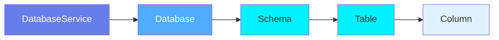
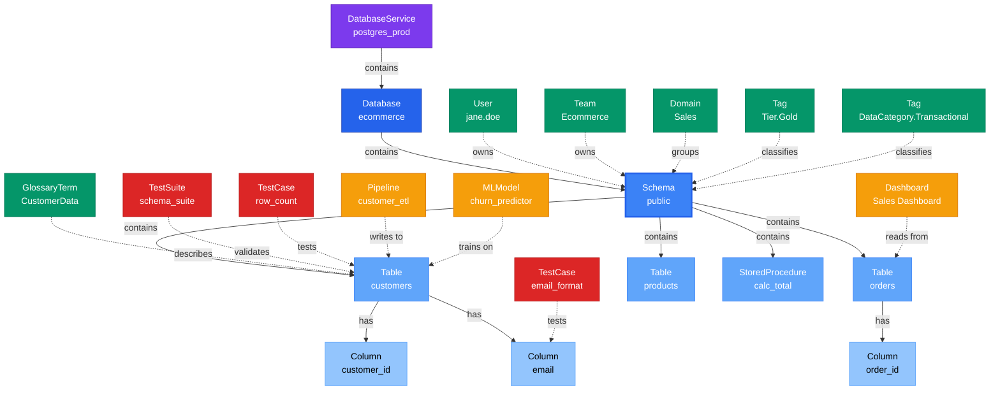

# DatabaseSchema

**Database schemas - logical namespaces for organizing tables**

---

## Overview

The **DatabaseSchema** entity represents a logical namespace within a database that groups related tables, views, and stored procedures. In PostgreSQL, these are schemas like `public` or `analytics`. In MySQL, the database itself acts as the schema. In Snowflake, these are schemas within a database.

**Hierarchy**:


---

## Relationships

### Parent Entities
- **Database**: The database containing this schema
- **DatabaseService**: The service hosting the database

### Child Entities
- **Table**: Tables within this schema
- **StoredProcedure**: Stored procedures in this schema

### Associated Entities
- **Owner**: User or team owning this schema
- **Domain**: Business domain assignment
- **Tag**: Classification tags

### Relationship Diagram



---

## Schema Specifications

View the complete DatabaseSchema schema in your preferred format:

=== "JSON Schema"

    **Complete JSON Schema Definition**

    ```json
    {
      "$id": "https://open-metadata.org/schema/entity/data/databaseSchema.json",
      "$schema": "http://json-schema.org/draft-07/schema#",
      "title": "DatabaseSchema",
      "description": "A `DatabaseSchema` entity is a logical namespace within a database that groups tables, views, and stored procedures.",
      "type": "object",
      "javaType": "org.openmetadata.schema.entity.data.DatabaseSchema",

      "definitions": {
        "schemaType": {
          "description": "Type or purpose of schema",
          "type": "string",
          "enum": [
            "Application", "Analytics", "Reporting",
            "Staging", "Audit", "Archive", "Public"
          ]
        }
      },

      "properties": {
        "id": {
          "description": "Unique identifier",
          "$ref": "../../type/basic.json#/definitions/uuid"
        },
        "name": {
          "description": "Schema name",
          "$ref": "../../type/basic.json#/definitions/entityName"
        },
        "fullyQualifiedName": {
          "description": "Fully qualified name: service.database.schema",
          "$ref": "../../type/basic.json#/definitions/fullyQualifiedEntityName"
        },
        "displayName": {
          "description": "Display name",
          "type": "string"
        },
        "description": {
          "description": "Markdown description",
          "$ref": "../../type/basic.json#/definitions/markdown"
        },
        "schemaType": {
          "$ref": "#/definitions/schemaType"
        },
        "database": {
          "description": "Parent database",
          "$ref": "../../type/entityReference.json"
        },
        "service": {
          "description": "Database service",
          "$ref": "../../type/entityReference.json"
        },
        "tables": {
          "description": "Tables in this schema",
          "type": "array",
          "items": {
            "$ref": "../../type/entityReference.json"
          }
        },
        "storedProcedures": {
          "description": "Stored procedures in this schema",
          "type": "array",
          "items": {
            "$ref": "../../type/entityReference.json"
          }
        },
        "owner": {
          "description": "Owner (user or team)",
          "$ref": "../../type/entityReference.json"
        },
        "domain": {
          "description": "Data domain",
          "$ref": "../../type/entityReference.json"
        },
        "tags": {
          "description": "Classification tags",
          "type": "array",
          "items": {
            "$ref": "../../type/tagLabel.json"
          }
        },
        "retentionPeriod": {
          "description": "Data retention period in days",
          "type": "number"
        },
        "version": {
          "description": "Metadata version",
          "$ref": "../../type/entityHistory.json#/definitions/entityVersion"
        }
      },

      "required": ["id", "name", "database"]
    }
    ```

    **[View Full JSON Schema →](https://github.com/open-metadata/OpenMetadataStandards/blob/main/schemas/entity/data/databaseSchema.json)**

=== "RDF"

    **RDF/OWL Ontology Definition**

    ```turtle
    @prefix om: <https://open-metadata.org/schema/> .
    @prefix rdfs: <http://www.w3.org/2000/01/rdf-schema#> .
    @prefix owl: <http://www.w3.org/2001/XMLSchema#> .
    @prefix xsd: <http://www.w3.org/2001/XMLSchema#> .

    # DatabaseSchema Class Definition
    om:DatabaseSchema a owl:Class ;
        rdfs:subClassOf om:DataAsset ;
        rdfs:label "DatabaseSchema" ;
        rdfs:comment "A logical namespace within a database that groups related tables and objects" ;
        om:hierarchyLevel 3 .

    # Properties
    om:schemaName a owl:DatatypeProperty ;
        rdfs:domain om:DatabaseSchema ;
        rdfs:range xsd:string ;
        rdfs:label "name" ;
        rdfs:comment "Name of the database schema" .

    om:fullyQualifiedName a owl:DatatypeProperty ;
        rdfs:domain om:DatabaseSchema ;
        rdfs:range xsd:string ;
        rdfs:label "fullyQualifiedName" ;
        rdfs:comment "Complete hierarchical name: service.database.schema" .

    om:schemaType a owl:DatatypeProperty ;
        rdfs:domain om:DatabaseSchema ;
        rdfs:range om:SchemaType ;
        rdfs:label "schemaType" ;
        rdfs:comment "Type of schema: Application, Analytics, Reporting, etc." .

    om:retentionPeriod a owl:DatatypeProperty ;
        rdfs:domain om:DatabaseSchema ;
        rdfs:range xsd:integer ;
        rdfs:label "retentionPeriod" ;
        rdfs:comment "Data retention period in days" .

    om:hasTable a owl:ObjectProperty ;
        rdfs:domain om:DatabaseSchema ;
        rdfs:range om:Table ;
        rdfs:label "hasTable" ;
        rdfs:comment "Tables in this schema" .

    om:hasStoredProcedure a owl:ObjectProperty ;
        rdfs:domain om:DatabaseSchema ;
        rdfs:range om:StoredProcedure ;
        rdfs:label "hasStoredProcedure" ;
        rdfs:comment "Stored procedures in this schema" .

    om:belongsToDatabase a owl:ObjectProperty ;
        rdfs:domain om:DatabaseSchema ;
        rdfs:range om:Database ;
        rdfs:label "belongsToDatabase" ;
        rdfs:comment "Parent database" .

    om:ownedBy a owl:ObjectProperty ;
        rdfs:domain om:DatabaseSchema ;
        rdfs:range om:Owner ;
        rdfs:label "ownedBy" ;
        rdfs:comment "User or team that owns this schema" .

    om:hasTag a owl:ObjectProperty ;
        rdfs:domain om:DatabaseSchema ;
        rdfs:range om:Tag ;
        rdfs:label "hasTag" ;
        rdfs:comment "Classification tags applied to schema" .

    # SchemaType Enumeration
    om:SchemaType a owl:Class ;
        owl:oneOf (
            om:Application
            om:Analytics
            om:Reporting
            om:Staging
            om:Public
        ) .

    # Example Instance
    ex:publicSchema a om:DatabaseSchema ;
        om:schemaName "public" ;
        om:fullyQualifiedName "postgres_prod.ecommerce.public" ;
        om:schemaType om:Application ;
        om:belongsToDatabase ex:ecommerceDb ;
        om:ownedBy ex:ecommerceTeam ;
        om:hasTag ex:tierGold ;
        om:hasTable ex:customersTable ;
        om:hasTable ex:ordersTable ;
        om:retentionPeriod 2555 .
    ```

    **[View Full RDF Ontology →](https://github.com/open-metadata/OpenMetadataStandards/blob/main/rdf/ontology/openmetadata.ttl)**

=== "JSON-LD"

    **JSON-LD Context and Example**

    ```json
    {
      "@context": {
        "@vocab": "https://open-metadata.org/schema/",
        "om": "https://open-metadata.org/schema/",
        "rdfs": "http://www.w3.org/2000/01/rdf-schema#",
        "xsd": "http://www.w3.org/2001/XMLSchema#",

        "DatabaseSchema": "om:DatabaseSchema",
        "name": {
          "@id": "om:schemaName",
          "@type": "xsd:string"
        },
        "fullyQualifiedName": {
          "@id": "om:fullyQualifiedName",
          "@type": "xsd:string"
        },
        "displayName": {
          "@id": "om:displayName",
          "@type": "xsd:string"
        },
        "description": {
          "@id": "om:description",
          "@type": "xsd:string"
        },
        "schemaType": {
          "@id": "om:schemaType",
          "@type": "@vocab"
        },
        "retentionPeriod": {
          "@id": "om:retentionPeriod",
          "@type": "xsd:integer"
        },
        "database": {
          "@id": "om:belongsToDatabase",
          "@type": "@id"
        },
        "service": {
          "@id": "om:belongsToService",
          "@type": "@id"
        },
        "tables": {
          "@id": "om:hasTable",
          "@type": "@id",
          "@container": "@set"
        },
        "storedProcedures": {
          "@id": "om:hasStoredProcedure",
          "@type": "@id",
          "@container": "@set"
        },
        "owner": {
          "@id": "om:ownedBy",
          "@type": "@id"
        },
        "domain": {
          "@id": "om:inDomain",
          "@type": "@id"
        },
        "tags": {
          "@id": "om:hasTag",
          "@type": "@id",
          "@container": "@set"
        }
      }
    }
    ```

    **Example JSON-LD Instance**:

    ```json
    {
      "@context": "https://open-metadata.org/context/databaseSchema.jsonld",
      "@type": "DatabaseSchema",
      "@id": "https://example.com/data/schemas/public",

      "name": "public",
      "fullyQualifiedName": "postgres_prod.ecommerce.public",
      "displayName": "Public Schema",
      "description": "Main application schema containing customer, order, and product tables",
      "schemaType": "Application",
      "retentionPeriod": 2555,

      "database": {
        "@id": "https://example.com/data/databases/ecommerce",
        "@type": "Database",
        "name": "ecommerce"
      },

      "service": {
        "@id": "https://example.com/services/postgres_prod",
        "@type": "DatabaseService",
        "name": "postgres_prod"
      },

      "tables": [
        {
          "@id": "https://example.com/data/tables/customers",
          "@type": "Table",
          "name": "customers"
        },
        {
          "@id": "https://example.com/data/tables/orders",
          "@type": "Table",
          "name": "orders"
        }
      ],

      "owner": {
        "@id": "https://example.com/teams/ecommerce",
        "@type": "Team",
        "name": "ecommerce",
        "displayName": "E-commerce Team"
      },

      "domain": {
        "@id": "https://example.com/domains/sales",
        "@type": "Domain",
        "name": "Sales"
      },

      "tags": [
        {
          "@id": "https://open-metadata.org/tags/Tier/Gold",
          "tagFQN": "Tier.Gold"
        }
      ]
    }
    ```

    **[View Full JSON-LD Context →](https://github.com/open-metadata/OpenMetadataStandards/blob/main/rdf/contexts/databaseSchema.jsonld)**

---

## Use Cases

- Organize tables by application, function, or purpose
- Separate transactional tables from analytics views
- Isolate staging data from production tables
- Apply schema-level access controls and permissions
- Track schema-level ownership
- Document schema purpose and usage guidelines
- Manage data retention policies by schema
- Group related database objects together

---

## JSON Schema Specification

### Core Properties

#### `id` (uuid)
**Type**: `string` (UUID format)
**Required**: Yes (system-generated)
**Description**: Unique identifier for this database schema instance

```json
{
  "id": "c3d4e5f6-a7b8-4c9d-0e1f-2a3b4c5d6e7f"
}
```

---

#### `name` (entityName)
**Type**: `string`
**Required**: Yes
**Pattern**: `^[^.]*$` (no dots allowed)
**Min Length**: 1
**Max Length**: 256
**Description**: Name of the schema

```json
{
  "name": "public"
}
```

---

#### `fullyQualifiedName` (fullyQualifiedEntityName)
**Type**: `string`
**Required**: Yes (system-generated)
**Pattern**: `^((?!::).)*$`
**Description**: Fully qualified name in the format `service.database.schema`

```json
{
  "fullyQualifiedName": "postgres_prod.ecommerce.public"
}
```

---

#### `displayName`
**Type**: `string`
**Required**: No
**Description**: Human-readable display name

```json
{
  "displayName": "Public Schema"
}
```

---

#### `description` (markdown)
**Type**: `string` (Markdown format)
**Required**: No
**Description**: Rich text description of the schema's purpose and usage

```json
{
  "description": "# Public Schema\n\nMain application schema for e-commerce platform.\n\n## Tables\n- **customers**: Customer master data\n- **orders**: Order transactions\n- **products**: Product catalog\n\n## Usage\nAll application tables should be created in this schema."
}
```

---

### Classification Properties

#### `schemaType` (SchemaType enum)
**Type**: `string` enum
**Required**: No
**Allowed Values**:

- `Application` - Application/transactional tables
- `Analytics` - Analytics and reporting objects
- `Reporting` - Reporting views and aggregates
- `Staging` - Staging/ETL tables
- `Audit` - Audit logs and history
- `Archive` - Archive/historical data
- `Public` - Default/public schema

```json
{
  "schemaType": "Application"
}
```

---

#### `retentionPeriod` (number)
**Type**: `number`
**Required**: No
**Description**: Data retention period in days for tables in this schema

```json
{
  "retentionPeriod": 2555
}
```

---

### Location Properties

#### `database` (EntityReference)
**Type**: `object`
**Required**: Yes
**Description**: Reference to parent database

```json
{
  "database": {
    "id": "b2c3d4e5-f6a7-4b8c-9d0e-1f2a3b4c5d6e",
    "type": "database",
    "name": "ecommerce",
    "fullyQualifiedName": "postgres_prod.ecommerce"
  }
}
```

---

#### `service` (EntityReference)
**Type**: `object`
**Required**: Yes
**Description**: Reference to database service

```json
{
  "service": {
    "id": "a1b2c3d4-e5f6-4a7b-8c9d-0e1f2a3b4c5d",
    "type": "databaseService",
    "name": "postgres_prod",
    "fullyQualifiedName": "postgres_prod"
  }
}
```

---

#### `tables[]` (EntityReference[])
**Type**: `array`
**Required**: No (system-populated)
**Description**: List of tables in this schema

```json
{
  "tables": [
    {
      "id": "d4e5f6a7-b8c9-4d0e-1f2a-3b4c5d6e7f8a",
      "type": "table",
      "name": "customers",
      "fullyQualifiedName": "postgres_prod.ecommerce.public.customers"
    },
    {
      "id": "e5f6a7b8-c9d0-4e1f-2a3b-4c5d6e7f8a9b",
      "type": "table",
      "name": "orders",
      "fullyQualifiedName": "postgres_prod.ecommerce.public.orders"
    }
  ]
}
```

---

#### `storedProcedures[]` (EntityReference[])
**Type**: `array`
**Required**: No (system-populated)
**Description**: List of stored procedures in this schema

```json
{
  "storedProcedures": [
    {
      "id": "f6a7b8c9-d0e1-4f2a-3b4c-5d6e7f8a9b0c",
      "type": "storedProcedure",
      "name": "calculate_order_total",
      "fullyQualifiedName": "postgres_prod.ecommerce.public.calculate_order_total"
    }
  ]
}
```

---

### Governance Properties

#### `owner` (EntityReference)
**Type**: `object`
**Required**: No
**Description**: User or team that owns this schema

```json
{
  "owner": {
    "id": "e5f6a7b8-c9d0-4e1f-2a3b-4c5d6e7f8a9b",
    "type": "team",
    "name": "ecommerce",
    "displayName": "E-commerce Team"
  }
}
```

---

#### `domain` (EntityReference)
**Type**: `object`
**Required**: No
**Description**: Data domain this schema belongs to

```json
{
  "domain": {
    "id": "f6a7b8c9-d0e1-4f2a-3b4c-5d6e7f8a9b0c",
    "type": "domain",
    "name": "Sales",
    "fullyQualifiedName": "Sales"
  }
}
```

---

#### `tags[]` (TagLabel[])
**Type**: `array`
**Required**: No
**Description**: Classification tags applied to the schema

```json
{
  "tags": [
    {
      "tagFQN": "Tier.Gold",
      "description": "Critical production schema",
      "source": "Classification",
      "labelType": "Manual",
      "state": "Confirmed"
    },
    {
      "tagFQN": "DataCategory.Transactional",
      "source": "Classification",
      "labelType": "Automated",
      "state": "Confirmed"
    }
  ]
}
```

---

### Versioning Properties

#### `version` (entityVersion)
**Type**: `number`
**Required**: Yes (system-managed)
**Description**: Metadata version number

```json
{
  "version": 1.3
}
```

---

#### `updatedAt` (timestamp)
**Type**: `integer` (Unix epoch milliseconds)
**Required**: Yes (system-managed)
**Description**: Last update timestamp

```json
{
  "updatedAt": 1704240000000
}
```

---

#### `updatedBy` (string)
**Type**: `string`
**Required**: Yes (system-managed)
**Description**: User who made the update

```json
{
  "updatedBy": "jane.doe"
}
```

---

## Complete Example

```json
{
  "id": "c3d4e5f6-a7b8-4c9d-0e1f-2a3b4c5d6e7f",
  "name": "public",
  "fullyQualifiedName": "postgres_prod.ecommerce.public",
  "displayName": "Public Schema",
  "description": "# Public Schema\n\nMain application schema containing customer, order, and product tables.",
  "schemaType": "Application",
  "retentionPeriod": 2555,
  "database": {
    "id": "b2c3d4e5-f6a7-4b8c-9d0e-1f2a3b4c5d6e",
    "type": "database",
    "name": "ecommerce"
  },
  "service": {
    "id": "a1b2c3d4-e5f6-4a7b-8c9d-0e1f2a3b4c5d",
    "type": "databaseService",
    "name": "postgres_prod"
  },
  "tables": [
    {
      "id": "d4e5f6a7-b8c9-4d0e-1f2a-3b4c5d6e7f8a",
      "type": "table",
      "name": "customers"
    },
    {
      "id": "e5f6a7b8-c9d0-4e1f-2a3b-4c5d6e7f8a9b",
      "type": "table",
      "name": "orders"
    }
  ],
  "storedProcedures": [
    {
      "id": "f6a7b8c9-d0e1-4f2a-3b4c-5d6e7f8a9b0c",
      "type": "storedProcedure",
      "name": "calculate_order_total"
    }
  ],
  "owner": {
    "id": "e5f6a7b8-c9d0-4e1f-2a3b-4c5d6e7f8a9b",
    "type": "team",
    "name": "ecommerce"
  },
  "domain": {
    "id": "f6a7b8c9-d0e1-4f2a-3b4c-5d6e7f8a9b0c",
    "type": "domain",
    "name": "Sales"
  },
  "tags": [
    {"tagFQN": "Tier.Gold"},
    {"tagFQN": "DataCategory.Transactional"}
  ],
  "version": 1.3,
  "updatedAt": 1704240000000,
  "updatedBy": "jane.doe"
}
```

---

## Custom Properties

This entity supports custom properties through the `extension` field.
Common custom properties include:

- **Data Classification**: Sensitivity level
- **Cost Center**: Billing allocation
- **Retention Period**: Data retention requirements
- **Application Owner**: Owning application/team

See [Custom Properties](../../metadata-specifications/custom-properties.md)
for details on defining and using custom properties.

---

## API Operations

### Create Database Schema

```http
POST /api/v1/databaseSchemas
Content-Type: application/json

{
  "name": "public",
  "database": "postgres_prod.ecommerce",
  "description": "Main application schema"
}
```

### Get Database Schema

```http
GET /api/v1/databaseSchemas/name/postgres_prod.ecommerce.public?fields=tables,storedProcedures,owner,tags
```

### Update Database Schema

```http
PATCH /api/v1/databaseSchemas/{id}
Content-Type: application/json-patch+json

[
  {
    "op": "add",
    "path": "/tags/-",
    "value": {"tagFQN": "DataCategory.Transactional"}
  }
]
```

### List Schemas in Database

```http
GET /api/v1/databaseSchemas?database=postgres_prod.ecommerce
```

---

## Related Documentation

- **[Database Service](database-service.md)** - Parent service entity
- **[Database](database.md)** - Parent database entity
- **[Table](table.md)** - Child table entity
- **[Stored Procedure](stored-procedure.md)** - Child stored procedure entity
- **[Access Control](../../security/access-control.md)** - Schema-level permissions
