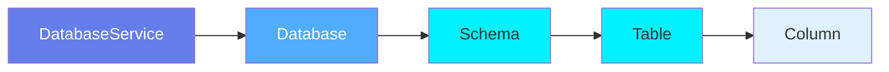
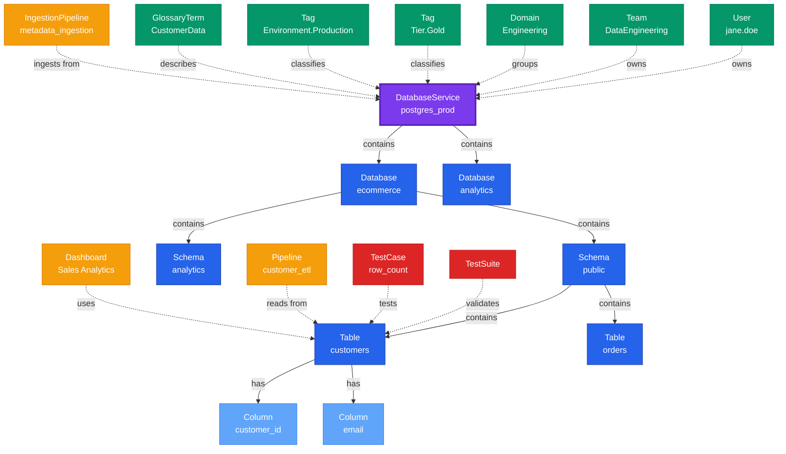

# DatabaseService

**Database service connections - the entry point for database metadata**

---

## Overview

The **DatabaseService** entity represents a connection to a database system. It is the top-level container in the database hierarchy, managing authentication, connection details, and metadata ingestion configuration for database platforms like PostgreSQL, MySQL, Snowflake, BigQuery, and others.

**Hierarchy**:


---

## Schema Specifications

View the complete DatabaseService schema in your preferred format:

=== "JSON Schema"

    **Complete JSON Schema Definition**

    ```json
    {
      "$id": "https://open-metadata.org/schema/entity/services/databaseService.json",
      "$schema": "http://json-schema.org/draft-07/schema#",
      "title": "Database Service",
      "description": "This schema defines the `Database Service` is a service such as MySQL, BigQuery, Redshift, Postgres, or Snowflake. Alternative terms such as Database Cluster, Database Server instance are also used for database service.",
      "type": "object",
      "javaType": "org.openmetadata.schema.entity.services.DatabaseService",
      "javaInterfaces": [
        "org.openmetadata.schema.EntityInterface",
        "org.openmetadata.schema.ServiceEntityInterface"
      ],

      "definitions": {
        "databaseServiceType": {
          "description": "Type of database service such as MySQL, BigQuery, Snowflake, Redshift, Postgres...",
          "javaInterfaces": ["org.openmetadata.schema.EnumInterface"],
          "type": "string",
          "enum": [
            "BigQuery", "BigTable", "Mysql", "Redshift", "Snowflake",
            "Postgres", "Timescale", "Mssql", "Oracle", "Athena",
            "Hive", "Impala", "Presto", "Trino", "Vertica",
            "Glue", "MariaDB", "Druid", "Db2", "Clickhouse",
            "Databricks", "AzureSQL", "DynamoDB", "SingleStore", "SQLite",
            "DeltaLake", "Salesforce", "PinotDB", "Datalake", "DomoDatabase",
            "QueryLog", "CustomDatabase", "Dbt", "SapHana", "MongoDB",
            "Cassandra", "Couchbase", "Greenplum", "Doris", "UnityCatalog",
            "SAS", "Iceberg", "Teradata", "SapErp", "Synapse",
            "Exasol", "Cockroach", "SSAS", "Epic", "ServiceNow"
          ]
        },
        "databaseConnection": {
          "type": "object",
          "description": "Database Connection.",
          "javaInterfaces": [
            "org.openmetadata.schema.ServiceConnectionEntityInterface"
          ],
          "properties": {
            "config": {
              "mask": true,
              "oneOf": [
                {"$ref": "./connections/database/bigQueryConnection.json"},
                {"$ref": "./connections/database/bigTableConnection.json"},
                {"$ref": "./connections/database/athenaConnection.json"},
                {"$ref": "./connections/database/azureSQLConnection.json"},
                {"$ref": "./connections/database/clickhouseConnection.json"},
                {"$ref": "./connections/database/databricksConnection.json"},
                {"$ref": "./connections/database/db2Connection.json"},
                {"$ref": "./connections/database/deltaLakeConnection.json"},
                {"$ref": "./connections/database/druidConnection.json"},
                {"$ref": "./connections/database/dynamoDBConnection.json"},
                {"$ref": "./connections/database/glueConnection.json"},
                {"$ref": "./connections/database/hiveConnection.json"},
                {"$ref": "./connections/database/impalaConnection.json"},
                {"$ref": "./connections/database/mariaDBConnection.json"},
                {"$ref": "./connections/database/mssqlConnection.json"},
                {"$ref": "./connections/database/mysqlConnection.json"},
                {"$ref": "./connections/database/sqliteConnection.json"},
                {"$ref": "./connections/database/oracleConnection.json"},
                {"$ref": "./connections/database/postgresConnection.json"},
                {"$ref": "./connections/database/timescaleConnection.json"},
                {"$ref": "./connections/database/prestoConnection.json"},
                {"$ref": "./connections/database/redshiftConnection.json"},
                {"$ref": "./connections/database/salesforceConnection.json"},
                {"$ref": "./connections/database/singleStoreConnection.json"},
                {"$ref": "./connections/database/snowflakeConnection.json"},
                {"$ref": "./connections/database/trinoConnection.json"},
                {"$ref": "./connections/database/verticaConnection.json"},
                {"$ref": "./connections/database/pinotDBConnection.json"},
                {"$ref": "./connections/database/datalakeConnection.json"},
                {"$ref": "./connections/database/domoDatabaseConnection.json"},
                {"$ref": "./connections/database/customDatabaseConnection.json"},
                {"$ref": "./connections/database/sapHanaConnection.json"},
                {"$ref": "./connections/database/mongoDBConnection.json"},
                {"$ref": "./connections/database/cassandraConnection.json"},
                {"$ref": "./connections/database/couchbaseConnection.json"},
                {"$ref": "./connections/database/greenplumConnection.json"},
                {"$ref": "./connections/database/dorisConnection.json"},
                {"$ref": "./connections/database/unityCatalogConnection.json"},
                {"$ref": "./connections/database/sasConnection.json"},
                {"$ref": "./connections/database/icebergConnection.json"},
                {"$ref": "./connections/database/teradataConnection.json"},
                {"$ref": "./connections/database/sapErpConnection.json"},
                {"$ref": "./connections/database/synapseConnection.json"},
                {"$ref": "./connections/database/exasolConnection.json"},
                {"$ref": "./connections/database/cockroachConnection.json"},
                {"$ref": "./connections/database/ssasConnection.json"},
                {"$ref": "./connections/database/epicConnection.json"},
                {"$ref": "./connections/database/serviceNowConnection.json"}
              ]
            }
          },
          "additionalProperties": false
        }
      },

      "properties": {
        "id": {
          "description": "Unique identifier of this database service instance.",
          "$ref": "../../type/basic.json#/definitions/uuid"
        },
        "name": {
          "description": "Name that identifies this database service.",
          "$ref": "../../type/basic.json#/definitions/entityName"
        },
        "fullyQualifiedName": {
          "description": "FullyQualifiedName same as `name`.",
          "$ref": "../../type/basic.json#/definitions/fullyQualifiedEntityName"
        },
        "displayName": {
          "description": "Display Name that identifies this database service.",
          "type": "string"
        },
        "serviceType": {
          "description": "Type of database service such as MySQL, BigQuery, Snowflake, Redshift, Postgres...",
          "$ref": "#/definitions/databaseServiceType"
        },
        "description": {
          "description": "Description of a database service instance.",
          "$ref": "../../type/basic.json#/definitions/markdown"
        },
        "connection": {
          "$ref": "#/definitions/databaseConnection"
        },
        "pipelines": {
          "description": "References to pipelines deployed for this database service to extract metadata, usage, lineage etc..",
          "$ref": "../../type/entityReferenceList.json"
        },
        "testConnectionResult": {
          "description": "Last test connection results for this service",
          "$ref": "connections/testConnectionResult.json"
        },
        "tags": {
          "description": "Tags for this Database Service.",
          "type": "array",
          "items": {
            "$ref": "../../type/tagLabel.json"
          },
          "default": []
        },
        "version": {
          "description": "Metadata version of the entity.",
          "$ref": "../../type/entityHistory.json#/definitions/entityVersion"
        },
        "updatedAt": {
          "description": "Last update time corresponding to the new version of the entity in Unix epoch time milliseconds.",
          "$ref": "../../type/basic.json#/definitions/timestamp"
        },
        "updatedBy": {
          "description": "User who made the update.",
          "type": "string"
        },
        "impersonatedBy": {
          "description": "Bot user that performed the action on behalf of the actual user.",
          "$ref": "../../type/basic.json#/definitions/impersonatedBy"
        },
        "owners": {
          "description": "Owners of this database service.",
          "$ref": "../../type/entityReferenceList.json"
        },
        "href": {
          "description": "Link to the resource corresponding to this database service.",
          "$ref": "../../type/basic.json#/definitions/href"
        },
        "followers": {
          "description": "Followers of this entity.",
          "$ref": "../../type/entityReferenceList.json"
        },
        "changeDescription": {
          "description": "Change that lead to this version of the entity.",
          "$ref": "../../type/entityHistory.json#/definitions/changeDescription"
        },
        "incrementalChangeDescription": {
          "description": "Change that lead to this version of the entity.",
          "$ref": "../../type/entityHistory.json#/definitions/changeDescription"
        },
        "deleted": {
          "description": "When `true` indicates the entity has been soft deleted.",
          "type": "boolean",
          "default": false
        },
        "dataProducts": {
          "description": "List of data products this entity is part of.",
          "$ref": "../../type/entityReferenceList.json"
        },
        "domains": {
          "description": "Domains the Database service belongs to.",
          "$ref": "../../type/entityReferenceList.json"
        },
        "ingestionRunner": {
          "description": "The ingestion agent responsible for executing the ingestion pipeline.",
          "$ref": "../../type/entityReference.json"
        }
      },

      "required": ["id", "name", "serviceType"],
      "additionalProperties": false
    }
    ```

    **[View Full JSON Schema →](https://github.com/open-metadata/OpenMetadataStandards/blob/main/schemas/entity/services/databaseService.json)**

=== "RDF"

    **RDF/OWL Ontology Definition**

    ```turtle
    @prefix om: <https://open-metadata.org/schema/> .
    @prefix rdfs: <http://www.w3.org/2000/01/rdf-schema#> .
    @prefix owl: <http://www.w3.org/2001/XMLSchema#> .
    @prefix xsd: <http://www.w3.org/2001/XMLSchema#> .

    # DatabaseService Class Definition
    om:DatabaseService a owl:Class ;
        rdfs:subClassOf om:Service ;
        rdfs:label "DatabaseService" ;
        rdfs:comment "A database service connection managing authentication and metadata ingestion" ;
        om:hierarchyLevel 1 .

    # Properties
    om:serviceName a owl:DatatypeProperty ;
        rdfs:domain om:DatabaseService ;
        rdfs:range xsd:string ;
        rdfs:label "name" ;
        rdfs:comment "Name of the database service" .

    om:serviceType a owl:DatatypeProperty ;
        rdfs:domain om:DatabaseService ;
        rdfs:range om:DatabaseServiceType ;
        rdfs:label "serviceType" ;
        rdfs:comment "Type of database platform: PostgreSQL, MySQL, Snowflake, etc." .

    om:hostPort a owl:DatatypeProperty ;
        rdfs:domain om:DatabaseService ;
        rdfs:range xsd:string ;
        rdfs:label "hostPort" ;
        rdfs:comment "Host and port of the database service" .

    om:hasDatabase a owl:ObjectProperty ;
        rdfs:domain om:DatabaseService ;
        rdfs:range om:Database ;
        rdfs:label "hasDatabase" ;
        rdfs:comment "Databases in this service" .

    om:hasOwners a owl:ObjectProperty ;
        rdfs:domain om:DatabaseService ;
        rdfs:range om:EntityReferenceList ;
        rdfs:label "hasOwners" ;
        rdfs:comment "Users or teams that own this service" .

    om:hasDomains a owl:ObjectProperty ;
        rdfs:domain om:DatabaseService ;
        rdfs:range om:EntityReferenceList ;
        rdfs:label "hasDomains" ;
        rdfs:comment "Domains this service belongs to" .

    om:hasFollowers a owl:ObjectProperty ;
        rdfs:domain om:DatabaseService ;
        rdfs:range om:EntityReferenceList ;
        rdfs:label "hasFollowers" ;
        rdfs:comment "Followers of this entity" .

    om:hasPipelines a owl:ObjectProperty ;
        rdfs:domain om:DatabaseService ;
        rdfs:range om:EntityReferenceList ;
        rdfs:label "hasPipelines" ;
        rdfs:comment "References to pipelines for metadata extraction" .

    om:hasDataProducts a owl:ObjectProperty ;
        rdfs:domain om:DatabaseService ;
        rdfs:range om:EntityReferenceList ;
        rdfs:label "hasDataProducts" ;
        rdfs:comment "Data products this entity is part of" .

    om:hasIngestionRunner a owl:ObjectProperty ;
        rdfs:domain om:DatabaseService ;
        rdfs:range om:EntityReference ;
        rdfs:label "hasIngestionRunner" ;
        rdfs:comment "The ingestion agent for executing pipelines" .

    om:hasTag a owl:ObjectProperty ;
        rdfs:domain om:DatabaseService ;
        rdfs:range om:Tag ;
        rdfs:label "hasTag" ;
        rdfs:comment "Classification tags applied to service" .

    # DatabaseServiceType Enumeration (partial list)
    om:DatabaseServiceType a owl:Class ;
        owl:oneOf (
            om:BigQuery
            om:BigTable
            om:Mysql
            om:Postgres
            om:Snowflake
            om:Redshift
            om:Oracle
            om:Mssql
            om:Athena
            om:Hive
            om:Databricks
            om:MongoDB
            # ... and 55+ more types
        ) .

    # Example Instance
    ex:postgresProdService a om:DatabaseService ;
        om:serviceName "postgres_prod" ;
        om:fullyQualifiedName "postgres_prod" ;
        om:serviceType om:Postgres ;
        om:hasConnection ex:postgresConnection ;
        om:hasOwners ex:dataEngineeringTeamList ;
        om:hasDomains ex:engineeringDomainList ;
        om:hasTag ex:tierGold ;
        om:hasDatabase ex:ecommerceDb ;
        om:hasDatabase ex:analyticsDb ;
        om:hasPipelines ex:metadataPipelineList ;
        om:hasFollowers ex:followersList .
    ```

    **[View Full RDF Ontology →](https://github.com/open-metadata/OpenMetadataStandards/blob/main/rdf/ontology/openmetadata.ttl)**

=== "JSON-LD"

    **JSON-LD Context and Example**

    ```json
    {
      "@context": {
        "@vocab": "https://open-metadata.org/schema/",
        "om": "https://open-metadata.org/schema/",
        "rdfs": "http://www.w3.org/2000/01/rdf-schema#",
        "xsd": "http://www.w3.org/2001/XMLSchema#",

        "DatabaseService": "om:DatabaseService",
        "name": {
          "@id": "om:serviceName",
          "@type": "xsd:string"
        },
        "fullyQualifiedName": {
          "@id": "om:fullyQualifiedName",
          "@type": "xsd:string"
        },
        "displayName": {
          "@id": "om:displayName",
          "@type": "xsd:string"
        },
        "description": {
          "@id": "om:description",
          "@type": "xsd:string"
        },
        "serviceType": {
          "@id": "om:serviceType",
          "@type": "@vocab"
        },
        "connection": {
          "@id": "om:hasConnection",
          "@type": "@id"
        },
        "owners": {
          "@id": "om:hasOwners",
          "@type": "@id",
          "@container": "@set"
        },
        "domains": {
          "@id": "om:hasDomains",
          "@type": "@id",
          "@container": "@set"
        },
        "followers": {
          "@id": "om:hasFollowers",
          "@type": "@id",
          "@container": "@set"
        },
        "pipelines": {
          "@id": "om:hasPipelines",
          "@type": "@id",
          "@container": "@set"
        },
        "dataProducts": {
          "@id": "om:hasDataProducts",
          "@type": "@id",
          "@container": "@set"
        },
        "ingestionRunner": {
          "@id": "om:hasIngestionRunner",
          "@type": "@id"
        },
        "tags": {
          "@id": "om:hasTag",
          "@type": "@id",
          "@container": "@set"
        }
      }
    }
    ```

    **Example JSON-LD Instance**:

    ```json
    {
      "@context": "https://open-metadata.org/context/databaseService.jsonld",
      "@type": "DatabaseService",
      "@id": "https://example.com/services/postgres_prod",

      "name": "postgres_prod",
      "fullyQualifiedName": "postgres_prod",
      "displayName": "Production PostgreSQL",
      "description": "Primary PostgreSQL cluster for production workloads",
      "serviceType": "Postgres",

      "connection": {
        "config": {
          "type": "Postgres",
          "hostPort": "postgres.example.com:5432",
          "username": "metadata_user",
          "database": "postgres",
          "sslMode": "require",
          "connectionOptions": {
            "sslmode": "require"
          }
        }
      },

      "owners": [
        {
          "@id": "https://example.com/teams/data-engineering",
          "@type": "Team",
          "name": "DataEngineering",
          "displayName": "Data Engineering Team"
        }
      ],

      "domains": [
        {
          "@id": "https://example.com/domains/engineering",
          "@type": "Domain",
          "name": "Engineering"
        }
      ],

      "pipelines": [
        {
          "@id": "https://example.com/pipelines/postgres_prod_metadata",
          "@type": "Pipeline",
          "name": "postgres_prod_metadata_pipeline"
        }
      ],

      "followers": [
        {
          "@id": "https://example.com/users/jane.smith",
          "@type": "User",
          "name": "jane.smith"
        }
      ],

      "dataProducts": [
        {
          "@id": "https://example.com/dataProducts/CustomerAnalytics",
          "@type": "DataProduct",
          "name": "CustomerAnalytics"
        }
      ],

      "tags": [
        {
          "@id": "https://open-metadata.org/tags/Tier/Gold",
          "tagFQN": "Tier.Gold"
        },
        {
          "@id": "https://open-metadata.org/tags/Environment/Production",
          "tagFQN": "Environment.Production"
        }
      ]
    }
    ```

    **[View Full JSON-LD Context →](https://github.com/open-metadata/OpenMetadataStandards/blob/main/rdf/contexts/databaseService.jsonld)**

---

## Use Cases

- Connect to database platforms for metadata ingestion
- Manage authentication credentials for metadata extraction
- Configure scheduled metadata ingestion workflows
- Organize databases by service/cluster
- Track service-level ownership and governance
- Apply environment tags (Production, Staging, Development)
- Monitor connection health and ingestion status
- Manage service-level access controls

---

## JSON Schema Specification

### Core Properties

#### `id` (uuid)
**Type**: `string` (UUID format)
**Required**: Yes (system-generated)
**Description**: Unique identifier for this database service instance

```json
{
  "id": "a1b2c3d4-e5f6-4a7b-8c9d-0e1f2a3b4c5d"
}
```

---

#### `name` (entityName)
**Type**: `string`
**Required**: Yes
**Pattern**: `^[^.]*$` (no dots allowed)
**Min Length**: 1
**Max Length**: 256
**Description**: Name of the database service

```json
{
  "name": "postgres_prod"
}
```

---

#### `fullyQualifiedName` (fullyQualifiedEntityName)
**Type**: `string`
**Required**: Yes (system-generated)
**Description**: For services, this is the same as the name

```json
{
  "fullyQualifiedName": "postgres_prod"
}
```

---

#### `displayName`
**Type**: `string`
**Required**: No
**Description**: Human-readable display name

```json
{
  "displayName": "Production PostgreSQL"
}
```

---

#### `description` (markdown)
**Type**: `string` (Markdown format)
**Required**: No
**Description**: Rich text description of the service's purpose

```json
{
  "description": "# Production PostgreSQL Cluster\n\nPrimary PostgreSQL cluster for production workloads.\n\n## Databases\n- ecommerce: Customer and order data\n- analytics: Analytics and reporting\n\n## Connection\n- High availability setup with read replicas\n- Automated backups every 6 hours"
}
```

---

### Service Properties

#### `serviceType` (DatabaseServiceType enum)
**Type**: `string` enum
**Required**: Yes
**Allowed Values**:

- `BigQuery` - Google BigQuery
- `BigTable` - Google BigTable
- `Mysql` - MySQL database
- `Redshift` - Amazon Redshift
- `Snowflake` - Snowflake data warehouse
- `Postgres` - PostgreSQL database
- `Timescale` - Timescale database
- `Mssql` - Microsoft SQL Server
- `Oracle` - Oracle database
- `Athena` - Amazon Athena
- `Hive` - Apache Hive
- `Impala` - Apache Impala
- `Presto` - PrestoDB
- `Trino` - Trino query engine
- `Vertica` - Vertica
- `Glue` - AWS Glue
- `MariaDB` - MariaDB
- `Druid` - Apache Druid
- `Db2` - IBM Db2
- `Clickhouse` - ClickHouse OLAP database
- `Databricks` - Databricks SQL
- `AzureSQL` - Azure SQL Database
- `DynamoDB` - Amazon DynamoDB
- `SingleStore` - SingleStore (formerly MemSQL)
- `SQLite` - SQLite
- `DeltaLake` - Delta Lake
- `Salesforce` - Salesforce
- `PinotDB` - Apache Pinot
- `Datalake` - Data Lake
- `DomoDatabase` - Domo Database
- `QueryLog` - Query Log
- `CustomDatabase` - Custom Database
- `Dbt` - dbt (data build tool)
- `SapHana` - SAP HANA
- `MongoDB` - MongoDB NoSQL database
- `Cassandra` - Apache Cassandra
- `Couchbase` - Couchbase
- `Greenplum` - Greenplum
- `Doris` - Apache Doris
- `UnityCatalog` - Unity Catalog
- `SAS` - SAS
- `Iceberg` - Apache Iceberg
- `Teradata` - Teradata
- `SapErp` - SAP ERP
- `Synapse` - Azure Synapse
- `Exasol` - Exasol
- `Cockroach` - CockroachDB
- `SSAS` - SQL Server Analysis Services
- `Epic` - Epic
- `ServiceNow` - ServiceNow

```json
{
  "serviceType": "Postgres"
}
```

---

#### `connection` (databaseConnection)
**Type**: `object`
**Required**: No
**Description**: Database Connection configuration

**Connection Object Structure**:

The connection object contains a `config` property that uses oneOf to reference specific connection configurations for each database type:

| Property | Type | Required | Description |
|----------|------|----------|-------------|
| `config` | object | Yes | Database-specific connection configuration (oneOf 47 types) |

**Supported Connection Types**:

The `config` property can be one of 47 different database connection types:
- bigQueryConnection.json
- postgresConnection.json
- mysqlConnection.json
- snowflakeConnection.json
- redshiftConnection.json
- databricksConnection.json
- athenaConnection.json
- and 40+ more...

**Example (PostgreSQL)**:

```json
{
  "connection": {
    "config": {
      "type": "Postgres",
      "username": "metadata_user",
      "authType": {
        "password": "***ENCRYPTED***"
      },
      "hostPort": "postgres.example.com:5432",
      "database": "postgres",
      "sslMode": "require",
      "sslConfig": {
        "caCertificate": "-----BEGIN CERTIFICATE-----\n...\n-----END CERTIFICATE-----"
      },
      "connectionOptions": {
        "key1": "value1"
      },
      "connectionArguments": {
        "key1": "value1"
      },
      "supportsMetadataExtraction": true,
      "supportsUsageExtraction": true,
      "supportsLineageExtraction": true,
      "supportsDBTExtraction": true,
      "supportsProfiler": true,
      "supportsDatabase": true,
      "supportsQueryComment": true
    }
  }
}
```

---

#### `pipelines` (EntityReferenceList)
**Type**: `array`
**Required**: No
**Description**: References to pipelines deployed for this database service to extract metadata, usage, lineage etc.

```json
{
  "pipelines": [
    {
      "id": "f1a2b3c4-d5e6-4f7a-8b9c-0d1e2f3a4b5c",
      "type": "pipeline",
      "name": "postgres_prod_metadata_pipeline",
      "fullyQualifiedName": "postgres_prod.postgres_prod_metadata_pipeline"
    }
  ]
}
```

---

#### `testConnectionResult` (TestConnectionResult)
**Type**: `object`
**Required**: No
**Description**: Last test connection results for this service

```json
{
  "testConnectionResult": {
    "status": "Successful",
    "lastUpdatedAt": 1704240000000,
    "steps": [
      {
        "name": "CheckAccess",
        "mandatory": true,
        "passed": true
      },
      {
        "name": "GetDatabases",
        "mandatory": true,
        "passed": true
      }
    ]
  }
}
```

---

### Governance Properties

#### `owners` (EntityReferenceList)
**Type**: `array`
**Required**: No
**Description**: Owners of this database service

```json
{
  "owners": [
    {
      "id": "d4e5f6a7-b8c9-4d0e-1f2a-3b4c5d6e7f8a",
      "type": "team",
      "name": "DataEngineering",
      "displayName": "Data Engineering Team"
    },
    {
      "id": "a1b2c3d4-e5f6-4a7b-8c9d-0e1f2a3b4c5d",
      "type": "user",
      "name": "john.doe",
      "displayName": "John Doe"
    }
  ]
}
```

---

#### `domains` (EntityReferenceList)
**Type**: `array`
**Required**: No
**Description**: Domains the Database service belongs to

```json
{
  "domains": [
    {
      "id": "e5f6a7b8-c9d0-4e1f-2a3b-4c5d6e7f8a9b",
      "type": "domain",
      "name": "Engineering",
      "fullyQualifiedName": "Engineering"
    }
  ]
}
```

---

#### `followers` (EntityReferenceList)
**Type**: `array`
**Required**: No
**Description**: Followers of this entity

```json
{
  "followers": [
    {
      "id": "a1b2c3d4-e5f6-4a7b-8c9d-0e1f2a3b4c5d",
      "type": "user",
      "name": "jane.smith",
      "displayName": "Jane Smith"
    }
  ]
}
```

---

#### `dataProducts` (EntityReferenceList)
**Type**: `array`
**Required**: No
**Description**: List of data products this entity is part of

```json
{
  "dataProducts": [
    {
      "id": "b2c3d4e5-f6a7-4b8c-9d0e-1f2a3b4c5d6e",
      "type": "dataProduct",
      "name": "CustomerAnalytics",
      "fullyQualifiedName": "CustomerAnalytics"
    }
  ]
}
```

---

#### `ingestionRunner` (EntityReference)
**Type**: `object`
**Required**: No
**Description**: The ingestion agent responsible for executing the ingestion pipeline

```json
{
  "ingestionRunner": {
    "id": "c3d4e5f6-a7b8-4c9d-0e1f-2a3b4c5d6e7f",
    "type": "ingestionPipeline",
    "name": "openmetadata-ingestion-runner",
    "fullyQualifiedName": "openmetadata-ingestion-runner"
  }
}
```

---

#### `tags[]` (TagLabel[])
**Type**: `array`
**Required**: No
**Description**: Classification tags applied to the service

```json
{
  "tags": [
    {
      "tagFQN": "Tier.Gold",
      "description": "Critical production service",
      "source": "Classification",
      "labelType": "Manual",
      "state": "Confirmed"
    },
    {
      "tagFQN": "Environment.Production",
      "source": "Classification",
      "labelType": "Manual",
      "state": "Confirmed"
    }
  ]
}
```

---

### Versioning Properties

#### `version` (entityVersion)
**Type**: `number`
**Required**: Yes (system-managed)
**Description**: Metadata version number

```json
{
  "version": 1.2
}
```

---

#### `updatedAt` (timestamp)
**Type**: `integer` (Unix epoch milliseconds)
**Required**: Yes (system-managed)
**Description**: Last update timestamp

```json
{
  "updatedAt": 1704240000000
}
```

---

#### `updatedBy` (string)
**Type**: `string`
**Required**: Yes (system-managed)
**Description**: User who made the update

```json
{
  "updatedBy": "admin"
}
```

---

## Complete Example

```json
{
  "id": "a1b2c3d4-e5f6-4a7b-8c9d-0e1f2a3b4c5d",
  "name": "postgres_prod",
  "fullyQualifiedName": "postgres_prod",
  "displayName": "Production PostgreSQL",
  "description": "# Production PostgreSQL Cluster\n\nPrimary PostgreSQL cluster for production workloads.",
  "serviceType": "Postgres",
  "connection": {
    "config": {
      "type": "Postgres",
      "username": "metadata_user",
      "authType": {
        "password": "***ENCRYPTED***"
      },
      "hostPort": "postgres.example.com:5432",
      "database": "postgres",
      "sslMode": "require",
      "connectionOptions": {
        "sslmode": "require",
        "connect_timeout": "10"
      },
      "supportsMetadataExtraction": true,
      "supportsUsageExtraction": true,
      "supportsLineageExtraction": true,
      "supportsDBTExtraction": true,
      "supportsProfiler": true,
      "supportsDatabase": true,
      "supportsQueryComment": true
    }
  },
  "pipelines": [
    {
      "id": "f1a2b3c4-d5e6-4f7a-8b9c-0d1e2f3a4b5c",
      "type": "pipeline",
      "name": "postgres_prod_metadata_pipeline",
      "fullyQualifiedName": "postgres_prod.postgres_prod_metadata_pipeline"
    }
  ],
  "testConnectionResult": {
    "status": "Successful",
    "lastUpdatedAt": 1704240000000,
    "steps": [
      {
        "name": "CheckAccess",
        "mandatory": true,
        "passed": true
      },
      {
        "name": "GetDatabases",
        "mandatory": true,
        "passed": true
      }
    ]
  },
  "owners": [
    {
      "id": "d4e5f6a7-b8c9-4d0e-1f2a-3b4c5d6e7f8a",
      "type": "team",
      "name": "DataEngineering",
      "displayName": "Data Engineering Team"
    }
  ],
  "domains": [
    {
      "id": "e5f6a7b8-c9d0-4e1f-2a3b-4c5d6e7f8a9b",
      "type": "domain",
      "name": "Engineering",
      "fullyQualifiedName": "Engineering"
    }
  ],
  "followers": [
    {
      "id": "a1b2c3d4-e5f6-4a7b-8c9d-0e1f2a3b4c5d",
      "type": "user",
      "name": "jane.smith",
      "displayName": "Jane Smith"
    }
  ],
  "dataProducts": [
    {
      "id": "b2c3d4e5-f6a7-4b8c-9d0e-1f2a3b4c5d6e",
      "type": "dataProduct",
      "name": "CustomerAnalytics",
      "fullyQualifiedName": "CustomerAnalytics"
    }
  ],
  "ingestionRunner": {
    "id": "c3d4e5f6-a7b8-4c9d-0e1f-2a3b4c5d6e7f",
    "type": "ingestionPipeline",
    "name": "openmetadata-ingestion-runner",
    "fullyQualifiedName": "openmetadata-ingestion-runner"
  },
  "tags": [
    {
      "tagFQN": "Tier.Gold",
      "source": "Classification",
      "labelType": "Manual",
      "state": "Confirmed"
    },
    {
      "tagFQN": "Environment.Production",
      "source": "Classification",
      "labelType": "Manual",
      "state": "Confirmed"
    }
  ],
  "href": "http://localhost:8585/api/v1/services/databaseServices/a1b2c3d4-e5f6-4a7b-8c9d-0e1f2a3b4c5d",
  "version": 1.2,
  "updatedAt": 1704240000000,
  "updatedBy": "admin",
  "deleted": false
}
```

---

## Relationships

### Child Entities
- **Database**: Databases hosted by this service
- **DatabaseSchema**: All schemas across all databases in this service
- **Table**: All tables across all databases in this service

### Associated Entities
- **Owner**: User or team owning this service
- **Domain**: Business domain assignment
- **Tag**: Classification tags
- **IngestionPipeline**: Metadata ingestion workflows

### Relationship Diagram



---

## Custom Properties

This entity supports custom properties through the `extension` field.
Common custom properties include:

- **Data Classification**: Sensitivity level
- **Cost Center**: Billing allocation
- **Retention Period**: Data retention requirements
- **Application Owner**: Owning application/team

See [Custom Properties](../../metadata-specifications/custom-properties.md)
for details on defining and using custom properties.

---

## API Operations

### Create Database Service

```http
POST /api/v1/services/databaseServices
Content-Type: application/json

{
  "name": "postgres_prod",
  "serviceType": "PostgreSQL",
  "connection": {
    "hostPort": "postgres.example.com:5432",
    "username": "metadata_user",
    "password": "secure_password",
    "database": "postgres"
  }
}
```

### Get Database Service

```http
GET /api/v1/services/databaseServices/name/postgres_prod?fields=owner,tags,domain
```

### Update Database Service

```http
PATCH /api/v1/services/databaseServices/{id}
Content-Type: application/json-patch+json

[
  {
    "op": "add",
    "path": "/tags/-",
    "value": {"tagFQN": "Environment.Production"}
  }
]
```

### Test Connection

```http
POST /api/v1/services/databaseServices/testConnection
Content-Type: application/json

{
  "serviceType": "PostgreSQL",
  "connection": {
    "hostPort": "postgres.example.com:5432",
    "username": "metadata_user",
    "password": "secure_password"
  }
}
```

---

## Related Documentation

- **[Database](database.md)** - Database entity
- **[Database Schema](database-schema.md)** - Schema entity
- **[Table](table.md)** - Table entity
- **[Ingestion Pipelines](../../ingestion/overview.md)** - Metadata ingestion
- **[Service Configuration](../../configuration/services.md)** - Service setup
