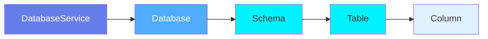
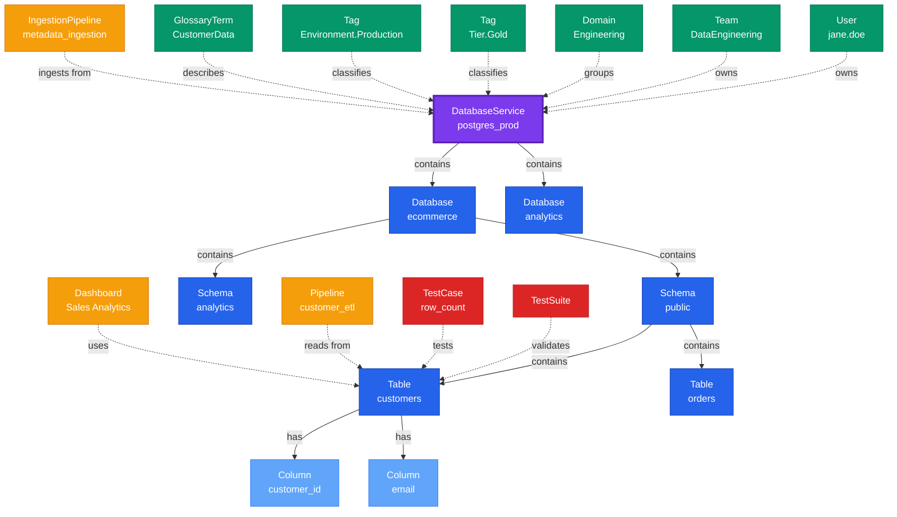

# DatabaseService

**Database service connections - the entry point for database metadata**

---

## Overview

The **DatabaseService** entity represents a connection to a database system. It is the top-level container in the database hierarchy, managing authentication, connection details, and metadata ingestion configuration for database platforms like PostgreSQL, MySQL, Snowflake, BigQuery, and others.

**Hierarchy**:


---

## Schema Specifications

View the complete DatabaseService schema in your preferred format:

=== "JSON Schema"

    **Complete JSON Schema Definition**

    ```json
    {
      "$id": "https://open-metadata.org/schema/entity/services/databaseService.json",
      "$schema": "http://json-schema.org/draft-07/schema#",
      "title": "DatabaseService",
      "description": "A `DatabaseService` entity represents a connection to a database platform, containing configuration for authentication, connection, and metadata ingestion.",
      "type": "object",
      "javaType": "org.openmetadata.schema.entity.services.DatabaseService",

      "definitions": {
        "databaseServiceType": {
          "description": "Type of database service",
          "type": "string",
          "enum": [
            "MySQL", "PostgreSQL", "Oracle", "SQLServer", "Snowflake",
            "BigQuery", "Redshift", "Databricks", "Athena", "Presto",
            "Trino", "Vertica", "Hive", "MariaDB", "DynamoDB",
            "ClickHouse", "Db2", "Druid", "SingleStore", "MongoDB"
          ]
        },
        "connectionConfig": {
          "type": "object",
          "properties": {
            "hostPort": {
              "description": "Host and port of the database service",
              "type": "string"
            },
            "username": {
              "description": "Username for authentication",
              "type": "string"
            },
            "password": {
              "description": "Password for authentication",
              "type": "string",
              "format": "password"
            },
            "database": {
              "description": "Default database name",
              "type": "string"
            },
            "connectionOptions": {
              "description": "Additional connection options",
              "type": "object"
            },
            "connectionArguments": {
              "description": "JDBC/connection string arguments",
              "type": "object"
            }
          }
        }
      },

      "properties": {
        "id": {
          "description": "Unique identifier",
          "$ref": "../../type/basic.json#/definitions/uuid"
        },
        "name": {
          "description": "Service name",
          "$ref": "../../type/basic.json#/definitions/entityName"
        },
        "fullyQualifiedName": {
          "description": "Fully qualified name: service name",
          "$ref": "../../type/basic.json#/definitions/fullyQualifiedEntityName"
        },
        "displayName": {
          "description": "Display name",
          "type": "string"
        },
        "description": {
          "description": "Markdown description",
          "$ref": "../../type/basic.json#/definitions/markdown"
        },
        "serviceType": {
          "$ref": "#/definitions/databaseServiceType"
        },
        "connection": {
          "description": "Connection configuration",
          "$ref": "#/definitions/connectionConfig"
        },
        "owner": {
          "description": "Owner (user or team)",
          "$ref": "../../type/entityReference.json"
        },
        "domain": {
          "description": "Data domain",
          "$ref": "../../type/entityReference.json"
        },
        "tags": {
          "description": "Classification tags",
          "type": "array",
          "items": {
            "$ref": "../../type/tagLabel.json"
          }
        },
        "version": {
          "description": "Metadata version",
          "$ref": "../../type/entityHistory.json#/definitions/entityVersion"
        }
      },

      "required": ["id", "name", "serviceType", "connection"]
    }
    ```

    **[View Full JSON Schema →](https://github.com/open-metadata/OpenMetadataStandards/blob/main/schemas/entity/services/databaseService.json)**

=== "RDF"

    **RDF/OWL Ontology Definition**

    ```turtle
    @prefix om: <https://open-metadata.org/schema/> .
    @prefix rdfs: <http://www.w3.org/2000/01/rdf-schema#> .
    @prefix owl: <http://www.w3.org/2001/XMLSchema#> .
    @prefix xsd: <http://www.w3.org/2001/XMLSchema#> .

    # DatabaseService Class Definition
    om:DatabaseService a owl:Class ;
        rdfs:subClassOf om:Service ;
        rdfs:label "DatabaseService" ;
        rdfs:comment "A database service connection managing authentication and metadata ingestion" ;
        om:hierarchyLevel 1 .

    # Properties
    om:serviceName a owl:DatatypeProperty ;
        rdfs:domain om:DatabaseService ;
        rdfs:range xsd:string ;
        rdfs:label "name" ;
        rdfs:comment "Name of the database service" .

    om:serviceType a owl:DatatypeProperty ;
        rdfs:domain om:DatabaseService ;
        rdfs:range om:DatabaseServiceType ;
        rdfs:label "serviceType" ;
        rdfs:comment "Type of database platform: PostgreSQL, MySQL, Snowflake, etc." .

    om:hostPort a owl:DatatypeProperty ;
        rdfs:domain om:DatabaseService ;
        rdfs:range xsd:string ;
        rdfs:label "hostPort" ;
        rdfs:comment "Host and port of the database service" .

    om:hasDatabase a owl:ObjectProperty ;
        rdfs:domain om:DatabaseService ;
        rdfs:range om:Database ;
        rdfs:label "hasDatabase" ;
        rdfs:comment "Databases in this service" .

    om:ownedBy a owl:ObjectProperty ;
        rdfs:domain om:DatabaseService ;
        rdfs:range om:Owner ;
        rdfs:label "ownedBy" ;
        rdfs:comment "User or team that owns this service" .

    om:hasTag a owl:ObjectProperty ;
        rdfs:domain om:DatabaseService ;
        rdfs:range om:Tag ;
        rdfs:label "hasTag" ;
        rdfs:comment "Classification tags applied to service" .

    # DatabaseServiceType Enumeration
    om:DatabaseServiceType a owl:Class ;
        owl:oneOf (
            om:PostgreSQL
            om:MySQL
            om:Snowflake
            om:BigQuery
            om:Redshift
            om:Oracle
        ) .

    # Example Instance
    ex:postgresProdService a om:DatabaseService ;
        om:serviceName "postgres_prod" ;
        om:fullyQualifiedName "postgres_prod" ;
        om:serviceType om:PostgreSQL ;
        om:hostPort "postgres.example.com:5432" ;
        om:ownedBy ex:dataEngineeringTeam ;
        om:hasTag ex:tierGold ;
        om:hasDatabase ex:ecommerceDb ;
        om:hasDatabase ex:analyticsDb .
    ```

    **[View Full RDF Ontology →](https://github.com/open-metadata/OpenMetadataStandards/blob/main/rdf/ontology/openmetadata.ttl)**

=== "JSON-LD"

    **JSON-LD Context and Example**

    ```json
    {
      "@context": {
        "@vocab": "https://open-metadata.org/schema/",
        "om": "https://open-metadata.org/schema/",
        "rdfs": "http://www.w3.org/2000/01/rdf-schema#",
        "xsd": "http://www.w3.org/2001/XMLSchema#",

        "DatabaseService": "om:DatabaseService",
        "name": {
          "@id": "om:serviceName",
          "@type": "xsd:string"
        },
        "fullyQualifiedName": {
          "@id": "om:fullyQualifiedName",
          "@type": "xsd:string"
        },
        "displayName": {
          "@id": "om:displayName",
          "@type": "xsd:string"
        },
        "description": {
          "@id": "om:description",
          "@type": "xsd:string"
        },
        "serviceType": {
          "@id": "om:serviceType",
          "@type": "@vocab"
        },
        "connection": {
          "@id": "om:hasConnection",
          "@type": "@id"
        },
        "owner": {
          "@id": "om:ownedBy",
          "@type": "@id"
        },
        "domain": {
          "@id": "om:inDomain",
          "@type": "@id"
        },
        "tags": {
          "@id": "om:hasTag",
          "@type": "@id",
          "@container": "@set"
        }
      }
    }
    ```

    **Example JSON-LD Instance**:

    ```json
    {
      "@context": "https://open-metadata.org/context/databaseService.jsonld",
      "@type": "DatabaseService",
      "@id": "https://example.com/services/postgres_prod",

      "name": "postgres_prod",
      "fullyQualifiedName": "postgres_prod",
      "displayName": "Production PostgreSQL",
      "description": "Primary PostgreSQL cluster for production workloads",
      "serviceType": "PostgreSQL",

      "connection": {
        "hostPort": "postgres.example.com:5432",
        "username": "metadata_user",
        "database": "postgres",
        "connectionOptions": {
          "sslmode": "require"
        }
      },

      "owner": {
        "@id": "https://example.com/teams/data-engineering",
        "@type": "Team",
        "name": "DataEngineering",
        "displayName": "Data Engineering Team"
      },

      "domain": {
        "@id": "https://example.com/domains/engineering",
        "@type": "Domain",
        "name": "Engineering"
      },

      "tags": [
        {
          "@id": "https://open-metadata.org/tags/Tier/Gold",
          "tagFQN": "Tier.Gold"
        },
        {
          "@id": "https://open-metadata.org/tags/Environment/Production",
          "tagFQN": "Environment.Production"
        }
      ]
    }
    ```

    **[View Full JSON-LD Context →](https://github.com/open-metadata/OpenMetadataStandards/blob/main/rdf/contexts/databaseService.jsonld)**

---

## Use Cases

- Connect to database platforms for metadata ingestion
- Manage authentication credentials for metadata extraction
- Configure scheduled metadata ingestion workflows
- Organize databases by service/cluster
- Track service-level ownership and governance
- Apply environment tags (Production, Staging, Development)
- Monitor connection health and ingestion status
- Manage service-level access controls

---

## JSON Schema Specification

### Core Properties

#### `id` (uuid)
**Type**: `string` (UUID format)
**Required**: Yes (system-generated)
**Description**: Unique identifier for this database service instance

```json
{
  "id": "a1b2c3d4-e5f6-4a7b-8c9d-0e1f2a3b4c5d"
}
```

---

#### `name` (entityName)
**Type**: `string`
**Required**: Yes
**Pattern**: `^[^.]*$` (no dots allowed)
**Min Length**: 1
**Max Length**: 256
**Description**: Name of the database service

```json
{
  "name": "postgres_prod"
}
```

---

#### `fullyQualifiedName` (fullyQualifiedEntityName)
**Type**: `string`
**Required**: Yes (system-generated)
**Description**: For services, this is the same as the name

```json
{
  "fullyQualifiedName": "postgres_prod"
}
```

---

#### `displayName`
**Type**: `string`
**Required**: No
**Description**: Human-readable display name

```json
{
  "displayName": "Production PostgreSQL"
}
```

---

#### `description` (markdown)
**Type**: `string` (Markdown format)
**Required**: No
**Description**: Rich text description of the service's purpose

```json
{
  "description": "# Production PostgreSQL Cluster\n\nPrimary PostgreSQL cluster for production workloads.\n\n## Databases\n- ecommerce: Customer and order data\n- analytics: Analytics and reporting\n\n## Connection\n- High availability setup with read replicas\n- Automated backups every 6 hours"
}
```

---

### Service Properties

#### `serviceType` (DatabaseServiceType enum)
**Type**: `string` enum
**Required**: Yes
**Allowed Values**:

- `PostgreSQL` - PostgreSQL database
- `MySQL` - MySQL database
- `Oracle` - Oracle database
- `SQLServer` - Microsoft SQL Server
- `Snowflake` - Snowflake data warehouse
- `BigQuery` - Google BigQuery
- `Redshift` - Amazon Redshift
- `Databricks` - Databricks SQL
- `Athena` - Amazon Athena
- `Presto` / `Trino` - Presto/Trino query engines
- `ClickHouse` - ClickHouse OLAP database
- `MongoDB` - MongoDB NoSQL database

```json
{
  "serviceType": "PostgreSQL"
}
```

---

#### `connection` (ConnectionConfig)
**Type**: `object`
**Required**: Yes
**Description**: Connection configuration for the database service

**Connection Object Properties**:

| Property | Type | Required | Description |
|----------|------|----------|-------------|
| `hostPort` | string | Yes | Host and port (e.g., "localhost:5432") |
| `username` | string | No | Username for authentication |
| `password` | string | No | Password (encrypted at rest) |
| `database` | string | No | Default database name |
| `sslMode` | string | No | SSL mode (disable, allow, prefer, require, verify-ca, verify-full) |
| `sslCA` | string | No | SSL CA certificate |
| `connectionOptions` | object | No | Additional connection parameters |
| `connectionArguments` | object | No | JDBC/driver-specific arguments |

**Example**:

```json
{
  "connection": {
    "hostPort": "postgres.example.com:5432",
    "username": "metadata_user",
    "password": "***ENCRYPTED***",
    "database": "postgres",
    "sslMode": "require",
    "connectionOptions": {
      "sslmode": "require",
      "connect_timeout": "10"
    },
    "connectionArguments": {
      "application_name": "OpenMetadata"
    }
  }
}
```

---

### Governance Properties

#### `owner` (EntityReference)
**Type**: `object`
**Required**: No
**Description**: User or team that owns this service

```json
{
  "owner": {
    "id": "d4e5f6a7-b8c9-4d0e-1f2a-3b4c5d6e7f8a",
    "type": "team",
    "name": "DataEngineering",
    "displayName": "Data Engineering Team"
  }
}
```

---

#### `domain` (EntityReference)
**Type**: `object`
**Required**: No
**Description**: Data domain this service belongs to

```json
{
  "domain": {
    "id": "e5f6a7b8-c9d0-4e1f-2a3b-4c5d6e7f8a9b",
    "type": "domain",
    "name": "Engineering",
    "fullyQualifiedName": "Engineering"
  }
}
```

---

#### `tags[]` (TagLabel[])
**Type**: `array`
**Required**: No
**Description**: Classification tags applied to the service

```json
{
  "tags": [
    {
      "tagFQN": "Tier.Gold",
      "description": "Critical production service",
      "source": "Classification",
      "labelType": "Manual",
      "state": "Confirmed"
    },
    {
      "tagFQN": "Environment.Production",
      "source": "Classification",
      "labelType": "Manual",
      "state": "Confirmed"
    }
  ]
}
```

---

### Versioning Properties

#### `version` (entityVersion)
**Type**: `number`
**Required**: Yes (system-managed)
**Description**: Metadata version number

```json
{
  "version": 1.2
}
```

---

#### `updatedAt` (timestamp)
**Type**: `integer` (Unix epoch milliseconds)
**Required**: Yes (system-managed)
**Description**: Last update timestamp

```json
{
  "updatedAt": 1704240000000
}
```

---

#### `updatedBy` (string)
**Type**: `string`
**Required**: Yes (system-managed)
**Description**: User who made the update

```json
{
  "updatedBy": "admin"
}
```

---

## Complete Example

```json
{
  "id": "a1b2c3d4-e5f6-4a7b-8c9d-0e1f2a3b4c5d",
  "name": "postgres_prod",
  "fullyQualifiedName": "postgres_prod",
  "displayName": "Production PostgreSQL",
  "description": "# Production PostgreSQL Cluster\n\nPrimary PostgreSQL cluster for production workloads.",
  "serviceType": "PostgreSQL",
  "connection": {
    "hostPort": "postgres.example.com:5432",
    "username": "metadata_user",
    "password": "***ENCRYPTED***",
    "database": "postgres",
    "sslMode": "require",
    "connectionOptions": {
      "sslmode": "require",
      "connect_timeout": "10"
    }
  },
  "owner": {
    "id": "d4e5f6a7-b8c9-4d0e-1f2a-3b4c5d6e7f8a",
    "type": "team",
    "name": "DataEngineering"
  },
  "domain": {
    "id": "e5f6a7b8-c9d0-4e1f-2a3b-4c5d6e7f8a9b",
    "type": "domain",
    "name": "Engineering"
  },
  "tags": [
    {"tagFQN": "Tier.Gold"},
    {"tagFQN": "Environment.Production"}
  ],
  "version": 1.2,
  "updatedAt": 1704240000000,
  "updatedBy": "admin"
}
```

---

## Relationships

### Child Entities
- **Database**: Databases hosted by this service
- **DatabaseSchema**: All schemas across all databases in this service
- **Table**: All tables across all databases in this service

### Associated Entities
- **Owner**: User or team owning this service
- **Domain**: Business domain assignment
- **Tag**: Classification tags
- **IngestionPipeline**: Metadata ingestion workflows

### Relationship Diagram



---

## Custom Properties

This entity supports custom properties through the `extension` field.
Common custom properties include:

- **Data Classification**: Sensitivity level
- **Cost Center**: Billing allocation
- **Retention Period**: Data retention requirements
- **Application Owner**: Owning application/team

See [Custom Properties](../../metadata-specifications/custom-properties.md)
for details on defining and using custom properties.

---

## API Operations

### Create Database Service

```http
POST /api/v1/services/databaseServices
Content-Type: application/json

{
  "name": "postgres_prod",
  "serviceType": "PostgreSQL",
  "connection": {
    "hostPort": "postgres.example.com:5432",
    "username": "metadata_user",
    "password": "secure_password",
    "database": "postgres"
  }
}
```

### Get Database Service

```http
GET /api/v1/services/databaseServices/name/postgres_prod?fields=owner,tags,domain
```

### Update Database Service

```http
PATCH /api/v1/services/databaseServices/{id}
Content-Type: application/json-patch+json

[
  {
    "op": "add",
    "path": "/tags/-",
    "value": {"tagFQN": "Environment.Production"}
  }
]
```

### Test Connection

```http
POST /api/v1/services/databaseServices/testConnection
Content-Type: application/json

{
  "serviceType": "PostgreSQL",
  "connection": {
    "hostPort": "postgres.example.com:5432",
    "username": "metadata_user",
    "password": "secure_password"
  }
}
```

---

## Related Documentation

- **[Database](database.md)** - Database entity
- **[Database Schema](database-schema.md)** - Schema entity
- **[Table](table.md)** - Table entity
- **[Ingestion Pipelines](../../ingestion/overview.md)** - Metadata ingestion
- **[Service Configuration](../../configuration/services.md)** - Service setup
