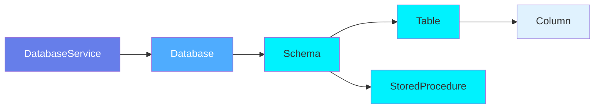
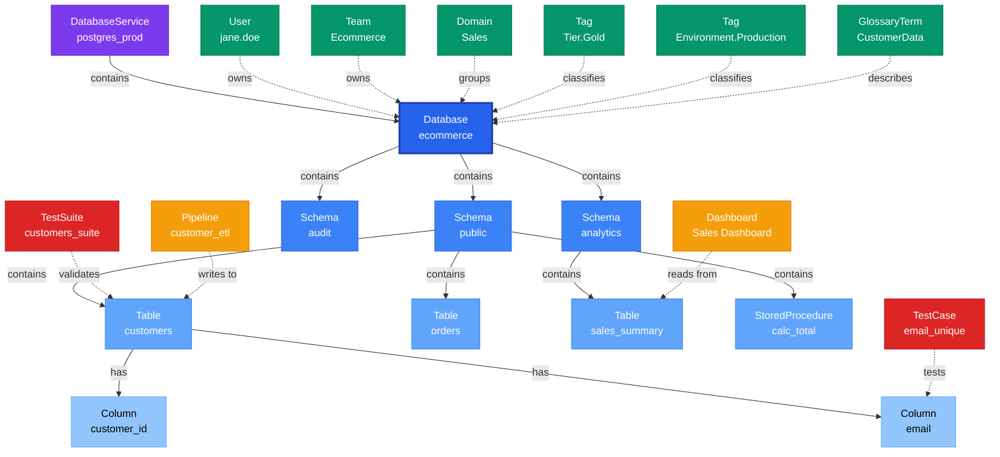

# Database

**Database containers - organizing schemas and tables**

---

## Overview

The **Database** entity represents a logical database within a database service. It acts as a container for database schemas and their tables, organizing data assets by application, business function, or environment.

**Hierarchy**:


---

## Relationships

### Parent Entities
- **DatabaseService**: The service hosting this database

### Child Entities
- **DatabaseSchema**: Schemas within this database
- **Table**: All tables across all schemas in this database
- **StoredProcedure**: All stored procedures across all schemas in this database

### Associated Entities
- **Owner**: User or team owning this database
- **Domain**: Business domain assignment
- **Tag**: Classification tags

### Relationship Diagram



---

## Schema Specifications

View the complete Database schema in your preferred format:

=== "JSON Schema"

    **Complete JSON Schema Definition**

    ```json
    {
      "$id": "https://open-metadata.org/schema/entity/data/database.json",
      "$schema": "http://json-schema.org/draft-07/schema#",
      "title": "Database",
      "$comment": "@om-entity-type",
      "description": "This schema defines the Database entity. A database also referred to as Database Catalog is a collection of schemas.",
      "type": "object",
      "javaType": "org.openmetadata.schema.entity.data.Database",
      "javaInterfaces": ["org.openmetadata.schema.EntityInterface"],

      "definitions": {},

      "properties": {
        "id": {
          "description": "Unique identifier that identifies this database instance.",
          "$ref": "../../type/basic.json#/definitions/uuid"
        },
        "name": {
          "description": "Name that identifies the database.",
          "$ref": "../../type/basic.json#/definitions/entityName"
        },
        "fullyQualifiedName": {
          "description": "Name that uniquely identifies a database in the format 'ServiceName.DatabaseName'.",
          "$ref": "../../type/basic.json#/definitions/fullyQualifiedEntityName"
        },
        "displayName": {
          "description": "Display Name that identifies this database.",
          "type": "string"
        },
        "description": {
          "description": "Description of the database instance.",
          "$ref": "../../type/basic.json#/definitions/markdown"
        },
        "dataProducts": {
          "description": "List of data products this entity is part of.",
          "$ref": "../../type/entityReferenceList.json"
        },
        "tags": {
          "description": "Tags for this Database.",
          "type": "array",
          "items": {
            "$ref": "../../type/tagLabel.json"
          },
          "default": []
        },
        "version": {
          "description": "Metadata version of the entity.",
          "$ref": "../../type/entityHistory.json#/definitions/entityVersion"
        },
        "updatedAt": {
          "description": "Last update time corresponding to the new version of the entity in Unix epoch time milliseconds.",
          "$ref": "../../type/basic.json#/definitions/timestamp"
        },
        "updatedBy": {
          "description": "User who made the update.",
          "type": "string"
        },
        "impersonatedBy": {
          "description": "Bot user that performed the action on behalf of the actual user.",
          "$ref": "../../type/basic.json#/definitions/impersonatedBy"
        },
        "href": {
          "description": "Link to the resource corresponding to this entity.",
          "$ref": "../../type/basic.json#/definitions/href"
        },
        "owners": {
          "description": "Owners of this database.",
          "$ref": "../../type/entityReferenceList.json"
        },
        "service": {
          "description": "Link to the database cluster/service where this database is hosted in.",
          "$ref": "../../type/entityReference.json"
        },
        "serviceType": {
          "description": "Service type where this database is hosted in.",
          "$ref": "../services/databaseService.json#/definitions/databaseServiceType"
        },
        "location": {
          "description": "Reference to the Location that contains this database.",
          "$ref": "../../type/entityReference.json"
        },
        "usageSummary": {
          "description": "Latest usage information for this database.",
          "$ref": "../../type/usageDetails.json",
          "default": null
        },
        "databaseSchemas": {
          "description": "References to schemas in the database.",
          "$ref": "../../type/entityReferenceList.json"
        },
        "changeDescription": {
          "description": "Change that lead to this version of the entity.",
          "$ref": "../../type/entityHistory.json#/definitions/changeDescription"
        },
        "incrementalChangeDescription": {
          "description": "Change that lead to this version of the entity.",
          "$ref": "../../type/entityHistory.json#/definitions/changeDescription"
        },
        "default": {
          "description": "Some databases don't support a database/catalog in the hierarchy and use default database. For example, `MySql`. For such databases, set this flag to true to indicate that this is a default database.",
          "type": "boolean",
          "default": false
        },
        "deleted": {
          "description": "When `true` indicates the entity has been soft deleted.",
          "type": "boolean",
          "default": false
        },
        "retentionPeriod": {
          "description": "Retention period of the data in the database. Period is expressed as duration in ISO 8601 format in UTC. Example - `P23DT23H`.",
          "$ref": "../../type/basic.json#/definitions/duration"
        },
        "extension": {
          "description": "Entity extension data with custom attributes added to the entity.",
          "$ref": "../../type/basic.json#/definitions/entityExtension"
        },
        "sourceUrl": {
          "description": "Source URL of database.",
          "$ref": "../../type/basic.json#/definitions/sourceUrl"
        },
        "domains": {
          "description": "Domains the Database belongs to. When not set, the Database inherits the domain from the database service it belongs to.",
          "$ref": "../../type/entityReferenceList.json"
        },
        "votes": {
          "description": "Votes on the entity.",
          "$ref": "../../type/votes.json"
        },
        "lifeCycle": {
          "description": "Life Cycle properties of the entity",
          "$ref": "../../type/lifeCycle.json"
        },
        "certification": {
          "$ref": "../../type/assetCertification.json"
        },
        "followers": {
          "description": "Followers of this entity.",
          "$ref": "../../type/entityReferenceList.json"
        },
        "sourceHash": {
          "description": "Source hash of the entity",
          "type": "string",
          "minLength": 1,
          "maxLength": 32
        },
        "databaseProfilerConfig": {
          "type": "object",
          "javaType": "org.openmetadata.schema.type.DatabaseProfilerConfig",
          "description": "This schema defines the type for Database profile config.",
          "properties": {
            "profileSample": {
              "description": "Percentage of data or no. of rows we want to execute the profiler and tests on",
              "type": "number",
              "default": null
            },
            "profileSampleType": {
              "$ref": "./table.json#/definitions/profileSampleType"
            },
            "sampleDataCount": {
              "description": "Number of row of sample data to be generated",
              "type": "integer",
              "default": 50,
              "title": "Sample Data Rows Count"
            },
            "samplingMethodType": {
              "$ref": "./table.json#/definitions/samplingMethodType"
            },
            "sampleDataStorageConfig": {
              "title": "Storage Config for Sample Data",
              "$ref": "../services/connections/connectionBasicType.json#/definitions/sampleDataStorageConfig"
            },
            "randomizedSample": {
              "description": "Whether to randomize the sample data or not.",
              "type": "boolean",
              "default": true
            }
          }
        },
        "entityStatus": {
          "description": "Status of the Database.",
          "$ref": "../../type/status.json"
        }
      },

      "required": ["id", "name", "service"],
      "additionalProperties": false
    }
    ```

    **[View Full JSON Schema →](https://github.com/open-metadata/OpenMetadataStandards/blob/main/schemas/entity/data/database.json)**

=== "RDF"

    **RDF/OWL Ontology Definition**

    ```turtle
    @prefix om: <https://open-metadata.org/schema/> .
    @prefix rdfs: <http://www.w3.org/2000/01/rdf-schema#> .
    @prefix owl: <http://www.w3.org/2002/07/owl#> .
    @prefix xsd: <http://www.w3.org/2001/XMLSchema#> .
    @prefix dcat: <http://www.w3.org/ns/dcat#> .

    # Database Class Definition
    om:Database a owl:Class ;
        rdfs:subClassOf om:DataAsset, dcat:Catalog ;
        rdfs:label "Database" ;
        rdfs:comment "This schema defines the Database entity. A database also referred to as Database Catalog is a collection of schemas." .

    # Core Identity Properties
    om:id a owl:DatatypeProperty ;
        rdfs:domain om:Database ;
        rdfs:range xsd:string ;
        rdfs:label "id" ;
        rdfs:comment "Unique identifier that identifies this database instance." .

    om:name a owl:DatatypeProperty ;
        rdfs:domain om:Database ;
        rdfs:range xsd:string ;
        rdfs:label "name" ;
        rdfs:comment "Name that identifies the database." .

    om:fullyQualifiedName a owl:DatatypeProperty ;
        rdfs:domain om:Database ;
        rdfs:range xsd:string ;
        rdfs:label "fullyQualifiedName" ;
        rdfs:comment "Name that uniquely identifies a database in the format 'ServiceName.DatabaseName'." .

    om:displayName a owl:DatatypeProperty ;
        rdfs:domain om:Database ;
        rdfs:range xsd:string ;
        rdfs:label "displayName" ;
        rdfs:comment "Display Name that identifies this database." .

    om:description a owl:DatatypeProperty ;
        rdfs:domain om:Database ;
        rdfs:range xsd:string ;
        rdfs:label "description" ;
        rdfs:comment "Description of the database instance." .

    # Relationship Properties
    om:belongsToService a owl:ObjectProperty ;
        rdfs:domain om:Database ;
        rdfs:range om:DatabaseService ;
        rdfs:label "service" ;
        rdfs:comment "Link to the database cluster/service where this database is hosted in." .

    om:hasServiceType a owl:DatatypeProperty ;
        rdfs:domain om:Database ;
        rdfs:range xsd:string ;
        rdfs:label "serviceType" ;
        rdfs:comment "Service type where this database is hosted in." .

    om:hasSchema a owl:ObjectProperty ;
        rdfs:domain om:Database ;
        rdfs:range om:DatabaseSchema ;
        rdfs:label "databaseSchemas" ;
        rdfs:comment "References to schemas in the database." .

    om:hasLocation a owl:ObjectProperty ;
        rdfs:domain om:Database ;
        rdfs:range om:Location ;
        rdfs:label "location" ;
        rdfs:comment "Reference to the Location that contains this database." .

    # Governance Properties
    om:hasOwners a owl:ObjectProperty ;
        rdfs:domain om:Database ;
        rdfs:range om:EntityReference ;
        rdfs:label "owners" ;
        rdfs:comment "Owners of this database." .

    om:hasDomains a owl:ObjectProperty ;
        rdfs:domain om:Database ;
        rdfs:range om:Domain ;
        rdfs:label "domains" ;
        rdfs:comment "Domains the Database belongs to." .

    om:hasTag a owl:ObjectProperty ;
        rdfs:domain om:Database ;
        rdfs:range om:TagLabel ;
        rdfs:label "tags" ;
        rdfs:comment "Tags for this Database." .

    om:hasDataProducts a owl:ObjectProperty ;
        rdfs:domain om:Database ;
        rdfs:range om:DataProduct ;
        rdfs:label "dataProducts" ;
        rdfs:comment "List of data products this entity is part of." .

    om:hasFollowers a owl:ObjectProperty ;
        rdfs:domain om:Database ;
        rdfs:range om:EntityReference ;
        rdfs:label "followers" ;
        rdfs:comment "Followers of this entity." .

    # Operational Properties
    om:isDefault a owl:DatatypeProperty ;
        rdfs:domain om:Database ;
        rdfs:range xsd:boolean ;
        rdfs:label "default" ;
        rdfs:comment "Some databases don't support a database/catalog in the hierarchy and use default database." .

    om:isDeleted a owl:DatatypeProperty ;
        rdfs:domain om:Database ;
        rdfs:range xsd:boolean ;
        rdfs:label "deleted" ;
        rdfs:comment "When true indicates the entity has been soft deleted." .

    om:retentionPeriod a owl:DatatypeProperty ;
        rdfs:domain om:Database ;
        rdfs:range xsd:duration ;
        rdfs:label "retentionPeriod" ;
        rdfs:comment "Retention period of the data in the database. Period is expressed as duration in ISO 8601 format." .

    om:hasUsageSummary a owl:ObjectProperty ;
        rdfs:domain om:Database ;
        rdfs:range om:UsageDetails ;
        rdfs:label "usageSummary" ;
        rdfs:comment "Latest usage information for this database." .

    om:hasProfilerConfig a owl:ObjectProperty ;
        rdfs:domain om:Database ;
        rdfs:range om:DatabaseProfilerConfig ;
        rdfs:label "databaseProfilerConfig" ;
        rdfs:comment "Database profiler configuration." .

    # Versioning Properties
    om:version a owl:DatatypeProperty ;
        rdfs:domain om:Database ;
        rdfs:range xsd:decimal ;
        rdfs:label "version" ;
        rdfs:comment "Metadata version of the entity." .

    om:updatedAt a owl:DatatypeProperty ;
        rdfs:domain om:Database ;
        rdfs:range xsd:long ;
        rdfs:label "updatedAt" ;
        rdfs:comment "Last update time in Unix epoch time milliseconds." .

    om:updatedBy a owl:DatatypeProperty ;
        rdfs:domain om:Database ;
        rdfs:range xsd:string ;
        rdfs:label "updatedBy" ;
        rdfs:comment "User who made the update." .

    om:hasChangeDescription a owl:ObjectProperty ;
        rdfs:domain om:Database ;
        rdfs:range om:ChangeDescription ;
        rdfs:label "changeDescription" ;
        rdfs:comment "Change that lead to this version of the entity." .

    # Additional Properties
    om:sourceUrl a owl:DatatypeProperty ;
        rdfs:domain om:Database ;
        rdfs:range xsd:anyURI ;
        rdfs:label "sourceUrl" ;
        rdfs:comment "Source URL of database." .

    om:sourceHash a owl:DatatypeProperty ;
        rdfs:domain om:Database ;
        rdfs:range xsd:string ;
        rdfs:label "sourceHash" ;
        rdfs:comment "Source hash of the entity." .

    om:hasVotes a owl:ObjectProperty ;
        rdfs:domain om:Database ;
        rdfs:range om:Votes ;
        rdfs:label "votes" ;
        rdfs:comment "Votes on the entity." .

    om:hasLifeCycle a owl:ObjectProperty ;
        rdfs:domain om:Database ;
        rdfs:range om:LifeCycle ;
        rdfs:label "lifeCycle" ;
        rdfs:comment "Life Cycle properties of the entity." .

    om:hasCertification a owl:ObjectProperty ;
        rdfs:domain om:Database ;
        rdfs:range om:AssetCertification ;
        rdfs:label "certification" ;
        rdfs:comment "Certification status of the entity." .

    om:hasEntityStatus a owl:ObjectProperty ;
        rdfs:domain om:Database ;
        rdfs:range om:Status ;
        rdfs:label "entityStatus" ;
        rdfs:comment "Status of the Database." .

    om:hasExtension a owl:DatatypeProperty ;
        rdfs:domain om:Database ;
        rdfs:range xsd:string ;
        rdfs:label "extension" ;
        rdfs:comment "Entity extension data with custom attributes added to the entity." .

    # Example Instance
    ex:ecommerceDb a om:Database ;
        om:id "b2c3d4e5-f6a7-4b8c-9d0e-1f2a3b4c5d6e" ;
        om:name "ecommerce" ;
        om:fullyQualifiedName "postgres_prod.ecommerce" ;
        om:displayName "E-commerce Database" ;
        om:description "Main database for e-commerce application" ;
        om:belongsToService ex:postgresProd ;
        om:hasOwners ex:ecommerceTeam ;
        om:hasTag ex:tierGold ;
        om:hasSchema ex:publicSchema, ex:analyticsSchema ;
        om:isDefault false ;
        om:isDeleted false ;
        om:version 1.5 .
    ```

    **[View Full RDF Ontology →](https://github.com/open-metadata/OpenMetadataStandards/blob/main/rdf/ontology/openmetadata.ttl)**

=== "JSON-LD"

    **JSON-LD Context and Example**

    ```json
    {
      "@context": {
        "@vocab": "https://open-metadata.org/schema/",
        "om": "https://open-metadata.org/schema/",
        "rdfs": "http://www.w3.org/2000/01/rdf-schema#",
        "xsd": "http://www.w3.org/2001/XMLSchema#",
        "dcat": "http://www.w3.org/ns/dcat#",

        "Database": {
          "@id": "om:Database",
          "@type": ["om:DataAsset", "dcat:Catalog"]
        },
        "id": {
          "@id": "om:id",
          "@type": "xsd:string"
        },
        "name": {
          "@id": "om:name",
          "@type": "xsd:string"
        },
        "fullyQualifiedName": {
          "@id": "om:fullyQualifiedName",
          "@type": "xsd:string"
        },
        "displayName": {
          "@id": "om:displayName",
          "@type": "xsd:string"
        },
        "description": {
          "@id": "om:description",
          "@type": "xsd:string"
        },
        "service": {
          "@id": "om:belongsToService",
          "@type": "@id"
        },
        "serviceType": {
          "@id": "om:hasServiceType",
          "@type": "xsd:string"
        },
        "databaseSchemas": {
          "@id": "om:hasSchema",
          "@type": "@id",
          "@container": "@set"
        },
        "location": {
          "@id": "om:hasLocation",
          "@type": "@id"
        },
        "owners": {
          "@id": "om:hasOwners",
          "@type": "@id",
          "@container": "@set"
        },
        "domains": {
          "@id": "om:hasDomains",
          "@type": "@id",
          "@container": "@set"
        },
        "tags": {
          "@id": "om:hasTag",
          "@type": "@id",
          "@container": "@set"
        },
        "dataProducts": {
          "@id": "om:hasDataProducts",
          "@type": "@id",
          "@container": "@set"
        },
        "followers": {
          "@id": "om:hasFollowers",
          "@type": "@id",
          "@container": "@set"
        },
        "default": {
          "@id": "om:isDefault",
          "@type": "xsd:boolean"
        },
        "deleted": {
          "@id": "om:isDeleted",
          "@type": "xsd:boolean"
        },
        "retentionPeriod": {
          "@id": "om:retentionPeriod",
          "@type": "xsd:duration"
        },
        "usageSummary": {
          "@id": "om:hasUsageSummary",
          "@type": "@json"
        },
        "databaseProfilerConfig": {
          "@id": "om:hasProfilerConfig",
          "@type": "@json"
        },
        "version": {
          "@id": "om:version",
          "@type": "xsd:decimal"
        },
        "updatedAt": {
          "@id": "om:updatedAt",
          "@type": "xsd:long"
        },
        "updatedBy": {
          "@id": "om:updatedBy",
          "@type": "xsd:string"
        },
        "impersonatedBy": {
          "@id": "om:impersonatedBy",
          "@type": "xsd:string"
        },
        "changeDescription": {
          "@id": "om:hasChangeDescription",
          "@type": "@json"
        },
        "incrementalChangeDescription": {
          "@id": "om:hasIncrementalChangeDescription",
          "@type": "@json"
        },
        "sourceUrl": {
          "@id": "om:sourceUrl",
          "@type": "xsd:anyURI"
        },
        "sourceHash": {
          "@id": "om:sourceHash",
          "@type": "xsd:string"
        },
        "votes": {
          "@id": "om:hasVotes",
          "@type": "@json"
        },
        "lifeCycle": {
          "@id": "om:hasLifeCycle",
          "@type": "@json"
        },
        "certification": {
          "@id": "om:hasCertification",
          "@type": "@json"
        },
        "entityStatus": {
          "@id": "om:hasEntityStatus",
          "@type": "@json"
        },
        "extension": {
          "@id": "om:hasExtension",
          "@type": "@json"
        },
        "href": {
          "@id": "om:href",
          "@type": "xsd:anyURI"
        }
      }
    }
    ```

    **Example JSON-LD Instance**:

    ```json
    {
      "@context": "https://open-metadata.org/context/dataAsset.jsonld",
      "@type": "Database",
      "@id": "https://example.com/data/databases/ecommerce",

      "id": "b2c3d4e5-f6a7-4b8c-9d0e-1f2a3b4c5d6e",
      "name": "ecommerce",
      "fullyQualifiedName": "postgres_prod.ecommerce",
      "displayName": "E-commerce Database",
      "description": "Main database for e-commerce application containing customer, order, and product data",
      "default": false,
      "deleted": false,
      "retentionPeriod": "P365D",

      "service": {
        "@id": "https://example.com/services/postgres_prod",
        "@type": "DatabaseService",
        "id": "a1b2c3d4-e5f6-4a7b-8c9d-0e1f2a3b4c5d",
        "name": "postgres_prod",
        "type": "databaseService"
      },
      "serviceType": "Postgres",

      "databaseSchemas": [
        {
          "@id": "https://example.com/data/schemas/public",
          "@type": "DatabaseSchema",
          "id": "c3d4e5f6-a7b8-4c9d-0e1f-2a3b4c5d6e7f",
          "name": "public",
          "type": "databaseSchema"
        },
        {
          "@id": "https://example.com/data/schemas/analytics",
          "@type": "DatabaseSchema",
          "id": "d4e5f6a7-b8c9-4d0e-1f2a-3b4c5d6e7f8a",
          "name": "analytics",
          "type": "databaseSchema"
        }
      ],

      "owners": [
        {
          "@id": "https://example.com/teams/ecommerce",
          "@type": "Team",
          "id": "e5f6a7b8-c9d0-4e1f-2a3b-4c5d6e7f8a9b",
          "name": "ecommerce",
          "displayName": "E-commerce Team",
          "type": "team"
        }
      ],

      "domains": [
        {
          "@id": "https://example.com/domains/sales",
          "@type": "Domain",
          "id": "f6a7b8c9-d0e1-4f2a-3b4c-5d6e7f8a9b0c",
          "name": "Sales",
          "type": "domain"
        }
      ],

      "tags": [
        {
          "tagFQN": "Tier.Gold",
          "source": "Classification",
          "labelType": "Manual",
          "state": "Confirmed"
        },
        {
          "tagFQN": "Environment.Production",
          "source": "Classification",
          "labelType": "Manual",
          "state": "Confirmed"
        }
      ],

      "followers": [],
      "dataProducts": [],

      "usageSummary": {
        "dailyStats": {
          "count": 150,
          "percentileRank": 85.0
        },
        "weeklyStats": {
          "count": 1050,
          "percentileRank": 82.0
        },
        "monthlyStats": {
          "count": 4500,
          "percentileRank": 80.0
        },
        "date": "2024-01-03"
      },

      "databaseProfilerConfig": {
        "profileSample": 50,
        "profileSampleType": "PERCENTAGE",
        "sampleDataCount": 50,
        "randomizedSample": true
      },

      "votes": {
        "upVotes": 12,
        "downVotes": 1,
        "upVoters": [],
        "downVoters": []
      },

      "lifeCycle": {
        "created": {
          "timestamp": 1704067200000,
          "accessedBy": "admin"
        }
      },

      "version": 1.5,
      "updatedAt": 1704240000000,
      "updatedBy": "jane.doe",
      "sourceUrl": "https://postgres-prod.example.com/ecommerce",
      "href": "https://openmetadata.example.com/api/v1/databases/b2c3d4e5-f6a7-4b8c-9d0e-1f2a3b4c5d6e"
    }
    ```

    **[View Full JSON-LD Context →](https://github.com/open-metadata/OpenMetadataStandards/blob/main/rdf/contexts/dataAsset.jsonld)**

---

## Use Cases

- Organize schemas and tables by application or business function
- Separate production, staging, and development databases
- Track database-level ownership and governance
- Apply database-wide classification tags
- Manage database-level access controls
- Document database purpose and usage
- Create logical boundaries for data governance
- Group related data assets together

---

## JSON Schema Specification

### Core Properties

#### `id` (uuid)
**Type**: `string` (UUID format)
**Required**: Yes (system-generated)
**Description**: Unique identifier for this database instance

```json
{
  "id": "b2c3d4e5-f6a7-4b8c-9d0e-1f2a3b4c5d6e"
}
```

---

#### `name` (entityName)
**Type**: `string`
**Required**: Yes
**Pattern**: `^[^.]*$` (no dots allowed)
**Min Length**: 1
**Max Length**: 256
**Description**: Name of the database

```json
{
  "name": "ecommerce"
}
```

---

#### `fullyQualifiedName` (fullyQualifiedEntityName)
**Type**: `string`
**Required**: Yes (system-generated)
**Pattern**: `^((?!::).)*$`
**Description**: Fully qualified name in the format `service.database`

```json
{
  "fullyQualifiedName": "postgres_prod.ecommerce"
}
```

---

#### `displayName`
**Type**: `string`
**Required**: No
**Description**: Human-readable display name

```json
{
  "displayName": "E-commerce Database"
}
```

---

#### `description` (markdown)
**Type**: `string` (Markdown format)
**Required**: No
**Description**: Rich text description of the database's purpose and usage

```json
{
  "description": "# E-commerce Database\n\nMain database for e-commerce application.\n\n## Schemas\n- **public**: Customer and order tables\n- **analytics**: Analytics and reporting views\n- **audit**: Audit logs and history\n\n## Usage\nPrimary operational database for the e-commerce platform."
}
```

---

### Operational Properties

#### `default` (boolean)
**Type**: `boolean`
**Required**: No (default: `false`)
**Description**: Some databases don't support a database/catalog in the hierarchy and use default database. For example, `MySql`. For such databases, set this flag to true to indicate that this is a default database.

```json
{
  "default": false
}
```

---

#### `deleted` (boolean)
**Type**: `boolean`
**Required**: No (default: `false`)
**Description**: When `true` indicates the entity has been soft deleted.

```json
{
  "deleted": false
}
```

---

#### `retentionPeriod` (duration)
**Type**: `string` (ISO 8601 duration format)
**Required**: No
**Description**: Retention period of the data in the database. Period is expressed as duration in ISO 8601 format in UTC. Example - `P23DT23H`.

```json
{
  "retentionPeriod": "P365D"
}
```

---

### Relationship Properties

#### `service` (EntityReference)
**Type**: `object`
**Required**: Yes
**Description**: Link to the database cluster/service where this database is hosted in.

```json
{
  "service": {
    "id": "a1b2c3d4-e5f6-4a7b-8c9d-0e1f2a3b4c5d",
    "type": "databaseService",
    "name": "postgres_prod",
    "fullyQualifiedName": "postgres_prod"
  }
}
```

---

#### `serviceType` (databaseServiceType)
**Type**: `string`
**Required**: No (system-populated)
**Description**: Service type where this database is hosted in.

```json
{
  "serviceType": "Postgres"
}
```

---

#### `databaseSchemas` (EntityReferenceList)
**Type**: `array`
**Required**: No (system-populated)
**Description**: References to schemas in the database.

```json
{
  "databaseSchemas": [
    {
      "id": "c3d4e5f6-a7b8-4c9d-0e1f-2a3b4c5d6e7f",
      "type": "databaseSchema",
      "name": "public",
      "fullyQualifiedName": "postgres_prod.ecommerce.public"
    },
    {
      "id": "d4e5f6a7-b8c9-4d0e-1f2a-3b4c5d6e7f8a",
      "type": "databaseSchema",
      "name": "analytics",
      "fullyQualifiedName": "postgres_prod.ecommerce.analytics"
    }
  ]
}
```

---

#### `location` (EntityReference)
**Type**: `object`
**Required**: No
**Description**: Reference to the Location that contains this database.

```json
{
  "location": {
    "id": "g7h8i9j0-k1l2-4m3n-4o5p-6q7r8s9t0u1v",
    "type": "location",
    "name": "us-east-1",
    "fullyQualifiedName": "aws.us-east-1"
  }
}
```

---

### Governance Properties

#### `owners` (EntityReferenceList)
**Type**: `array`
**Required**: No
**Description**: Owners of this database.

```json
{
  "owners": [
    {
      "id": "e5f6a7b8-c9d0-4e1f-2a3b-4c5d6e7f8a9b",
      "type": "team",
      "name": "ecommerce",
      "displayName": "E-commerce Team"
    }
  ]
}
```

---

#### `domains` (EntityReferenceList)
**Type**: `array`
**Required**: No
**Description**: Domains the Database belongs to. When not set, the Database inherits the domain from the database service it belongs to.

```json
{
  "domains": [
    {
      "id": "f6a7b8c9-d0e1-4f2a-3b4c-5d6e7f8a9b0c",
      "type": "domain",
      "name": "Sales",
      "fullyQualifiedName": "Sales"
    }
  ]
}
```

---

#### `tags` (TagLabel[])
**Type**: `array`
**Required**: No (default: `[]`)
**Description**: Tags for this Database.

```json
{
  "tags": [
    {
      "tagFQN": "Tier.Gold",
      "description": "Critical production database",
      "source": "Classification",
      "labelType": "Manual",
      "state": "Confirmed"
    },
    {
      "tagFQN": "Environment.Production",
      "source": "Classification",
      "labelType": "Manual",
      "state": "Confirmed"
    }
  ]
}
```

---

#### `dataProducts` (EntityReferenceList)
**Type**: `array`
**Required**: No
**Description**: List of data products this entity is part of.

```json
{
  "dataProducts": [
    {
      "id": "h8i9j0k1-l2m3-4n5o-6p7q-8r9s0t1u2v3w",
      "type": "dataProduct",
      "name": "customer-360",
      "fullyQualifiedName": "customer-360"
    }
  ]
}
```

---

#### `followers` (EntityReferenceList)
**Type**: `array`
**Required**: No
**Description**: Followers of this entity.

```json
{
  "followers": [
    {
      "id": "i9j0k1l2-m3n4-5o6p-7q8r-9s0t1u2v3w4x",
      "type": "user",
      "name": "john.doe"
    }
  ]
}
```

---

#### `votes` (Votes)
**Type**: `object`
**Required**: No
**Description**: Votes on the entity.

```json
{
  "votes": {
    "upVotes": 12,
    "downVotes": 1,
    "upVoters": [],
    "downVoters": []
  }
}
```

---

#### `lifeCycle` (LifeCycle)
**Type**: `object`
**Required**: No
**Description**: Life Cycle properties of the entity.

```json
{
  "lifeCycle": {
    "created": {
      "timestamp": 1704067200000,
      "accessedBy": "admin"
    }
  }
}
```

---

#### `certification` (AssetCertification)
**Type**: `object`
**Required**: No
**Description**: Certification status of the entity.

```json
{
  "certification": {
    "tagLabel": {
      "tagFQN": "Certification.Certified",
      "source": "Classification"
    }
  }
}
```

---

### Usage & Profiling Properties

#### `usageSummary` (UsageDetails)
**Type**: `object`
**Required**: No (default: `null`)
**Description**: Latest usage information for this database.

```json
{
  "usageSummary": {
    "dailyStats": {
      "count": 150,
      "percentileRank": 85.0
    },
    "weeklyStats": {
      "count": 1050,
      "percentileRank": 82.0
    },
    "monthlyStats": {
      "count": 4500,
      "percentileRank": 80.0
    },
    "date": "2024-01-03"
  }
}
```

---

#### `databaseProfilerConfig` (DatabaseProfilerConfig)
**Type**: `object`
**Required**: No
**Description**: This schema defines the type for Database profile config.

```json
{
  "databaseProfilerConfig": {
    "profileSample": 50,
    "profileSampleType": "PERCENTAGE",
    "sampleDataCount": 50,
    "samplingMethodType": "SYSTEM",
    "randomizedSample": true
  }
}
```

---

### Versioning Properties

#### `version` (entityVersion)
**Type**: `number`
**Required**: Yes (system-managed)
**Description**: Metadata version number

```json
{
  "version": 1.5
}
```

---

#### `updatedAt` (timestamp)
**Type**: `integer` (Unix epoch milliseconds)
**Required**: Yes (system-managed)
**Description**: Last update timestamp

```json
{
  "updatedAt": 1704240000000
}
```

---

#### `updatedBy` (string)
**Type**: `string`
**Required**: No (system-managed)
**Description**: User who made the update.

```json
{
  "updatedBy": "jane.doe"
}
```

---

#### `impersonatedBy` (string)
**Type**: `string`
**Required**: No
**Description**: Bot user that performed the action on behalf of the actual user.

```json
{
  "impersonatedBy": "ingestion-bot"
}
```

---

#### `changeDescription` (ChangeDescription)
**Type**: `object`
**Required**: No (system-managed)
**Description**: Change that lead to this version of the entity.

```json
{
  "changeDescription": {
    "fieldsAdded": [],
    "fieldsUpdated": [
      {
        "name": "description",
        "oldValue": "Old description",
        "newValue": "New description"
      }
    ],
    "fieldsDeleted": [],
    "previousVersion": 1.4
  }
}
```

---

#### `incrementalChangeDescription` (ChangeDescription)
**Type**: `object`
**Required**: No (system-managed)
**Description**: Change that lead to this version of the entity.

```json
{
  "incrementalChangeDescription": {
    "fieldsAdded": [],
    "fieldsUpdated": [],
    "fieldsDeleted": [],
    "previousVersion": 1.4
  }
}
```

---

### Additional Properties

#### `href` (href)
**Type**: `string` (URI format)
**Required**: No (system-generated)
**Description**: Link to the resource corresponding to this entity.

```json
{
  "href": "https://openmetadata.example.com/api/v1/databases/b2c3d4e5-f6a7-4b8c-9d0e-1f2a3b4c5d6e"
}
```

---

#### `sourceUrl` (sourceUrl)
**Type**: `string` (URI format)
**Required**: No
**Description**: Source URL of database.

```json
{
  "sourceUrl": "https://postgres-prod.example.com/ecommerce"
}
```

---

#### `sourceHash` (string)
**Type**: `string`
**Required**: No
**Min Length**: 1
**Max Length**: 32
**Description**: Source hash of the entity.

```json
{
  "sourceHash": "abc123def456"
}
```

---

#### `extension` (entityExtension)
**Type**: `object`
**Required**: No
**Description**: Entity extension data with custom attributes added to the entity.

```json
{
  "extension": {
    "costCenter": "CC-1234",
    "dataClassification": "Internal"
  }
}
```

---

#### `entityStatus` (Status)
**Type**: `object`
**Required**: No
**Description**: Status of the Database.

```json
{
  "entityStatus": {
    "status": "Active"
  }
}
```

---

## Complete Example

```json
{
  "id": "b2c3d4e5-f6a7-4b8c-9d0e-1f2a3b4c5d6e",
  "name": "ecommerce",
  "fullyQualifiedName": "postgres_prod.ecommerce",
  "displayName": "E-commerce Database",
  "description": "Main database for e-commerce application containing customer, order, and product data.",
  "default": false,
  "deleted": false,
  "retentionPeriod": "P365D",
  "service": {
    "id": "a1b2c3d4-e5f6-4a7b-8c9d-0e1f2a3b4c5d",
    "type": "databaseService",
    "name": "postgres_prod",
    "fullyQualifiedName": "postgres_prod"
  },
  "serviceType": "Postgres",
  "databaseSchemas": [
    {
      "id": "c3d4e5f6-a7b8-4c9d-0e1f-2a3b4c5d6e7f",
      "type": "databaseSchema",
      "name": "public",
      "fullyQualifiedName": "postgres_prod.ecommerce.public"
    },
    {
      "id": "d4e5f6a7-b8c9-4d0e-1f2a-3b4c5d6e7f8a",
      "type": "databaseSchema",
      "name": "analytics",
      "fullyQualifiedName": "postgres_prod.ecommerce.analytics"
    }
  ],
  "owners": [
    {
      "id": "e5f6a7b8-c9d0-4e1f-2a3b-4c5d6e7f8a9b",
      "type": "team",
      "name": "ecommerce",
      "displayName": "E-commerce Team"
    }
  ],
  "domains": [
    {
      "id": "f6a7b8c9-d0e1-4f2a-3b4c-5d6e7f8a9b0c",
      "type": "domain",
      "name": "Sales",
      "fullyQualifiedName": "Sales"
    }
  ],
  "tags": [
    {
      "tagFQN": "Tier.Gold",
      "source": "Classification",
      "labelType": "Manual",
      "state": "Confirmed"
    },
    {
      "tagFQN": "Environment.Production",
      "source": "Classification",
      "labelType": "Manual",
      "state": "Confirmed"
    }
  ],
  "dataProducts": [],
  "followers": [],
  "usageSummary": {
    "dailyStats": {
      "count": 150,
      "percentileRank": 85.0
    },
    "weeklyStats": {
      "count": 1050,
      "percentileRank": 82.0
    },
    "monthlyStats": {
      "count": 4500,
      "percentileRank": 80.0
    },
    "date": "2024-01-03"
  },
  "databaseProfilerConfig": {
    "profileSample": 50,
    "profileSampleType": "PERCENTAGE",
    "sampleDataCount": 50,
    "randomizedSample": true
  },
  "votes": {
    "upVotes": 12,
    "downVotes": 1,
    "upVoters": [],
    "downVoters": []
  },
  "lifeCycle": {
    "created": {
      "timestamp": 1704067200000,
      "accessedBy": "admin"
    }
  },
  "version": 1.5,
  "updatedAt": 1704240000000,
  "updatedBy": "jane.doe",
  "sourceUrl": "https://postgres-prod.example.com/ecommerce",
  "href": "https://openmetadata.example.com/api/v1/databases/b2c3d4e5-f6a7-4b8c-9d0e-1f2a3b4c5d6e"
}
```

---

## Custom Properties

This entity supports custom properties through the `extension` field.
Common custom properties include:

- **Data Classification**: Sensitivity level
- **Cost Center**: Billing allocation
- **Retention Period**: Data retention requirements
- **Application Owner**: Owning application/team

See [Custom Properties](../../metadata-specifications/custom-properties.md)
for details on defining and using custom properties.

---

## Followers

Users can follow databases to receive notifications about changes such as schema updates, governance changes, or deprecation notices. See **[Followers](../../metadata-specifications/followers.md)** for details.

---

## API Operations

All Database operations are available under the `/v1/databases` endpoint.

### List Databases

Get a list of databases, optionally filtered by service.

```http
GET /v1/databases
Query Parameters:
  - fields: Fields to include (databaseSchemas, owners, tags, domains, followers, etc.)
  - service: Filter by database service name
  - limit: Number of results (1-1000000, default 10)
  - before/after: Cursor-based pagination
  - include: all | deleted | non-deleted (default: non-deleted)

Response: DatabaseList
```

### Create Database

Create a new database under a database service.

```http
POST /v1/databases
Content-Type: application/json

{
  "name": "ecommerce",
  "service": "postgres_prod",
  "description": "E-commerce production database",
  "owners": [
    {
      "id": "...",
      "type": "team"
    }
  ],
  "tags": [
    {"tagFQN": "Environment.Production"}
  ]
}

Response: Database
```

### Get Database by Name

Get a database by its fully qualified name.

```http
GET /v1/databases/name/{fqn}
Query Parameters:
  - fields: Fields to include (databaseSchemas, owners, tags, domains, followers, etc.)
  - include: all | deleted | non-deleted

Example:
GET /v1/databases/name/postgres_prod.ecommerce?fields=databaseSchemas,owners,tags,domains

Response: Database
```

### Get Database by ID

Get a database by its unique identifier.

```http
GET /v1/databases/{id}
Query Parameters:
  - fields: Fields to include
  - include: all | deleted | non-deleted

Response: Database
```

### Update Database

Update a database using JSON Patch.

```http
PATCH /v1/databases/name/{fqn}
Content-Type: application/json-patch+json

[
  {"op": "add", "path": "/tags/-", "value": {"tagFQN": "Tier.Gold"}},
  {"op": "replace", "path": "/description", "value": "Updated description"},
  {"op": "add", "path": "/owners/-", "value": {"id": "...", "type": "team"}}
]

Response: Database
```

### Create or Update Database

Create a new database or update if it exists.

```http
PUT /v1/databases
Content-Type: application/json

{
  "name": "analytics",
  "service": "snowflake_prod",
  "description": "Analytics database"
}

Response: Database
```

### Delete Database

Delete a database by fully qualified name.

```http
DELETE /v1/databases/name/{fqn}
Query Parameters:
  - recursive: Delete schemas and tables recursively (default: false)
  - hardDelete: Permanently delete (default: false)

Response: 200 OK
```

### Get Database Versions

Get all versions of a database.

```http
GET /v1/databases/{id}/versions

Response: EntityHistory
```

### Follow Database

Add a follower to a database.

```http
PUT /v1/databases/{id}/followers/{userId}

Response: ChangeEvent
```

### Get Followers

Get all followers of a database.

```http
GET /v1/databases/{id}/followers

Response: EntityReference[]
```

### Bulk Operations

Create or update multiple databases.

```http
PUT /v1/databases/bulk
Content-Type: application/json

{
  "entities": [...]
}

Response: BulkOperationResult
```

---

## Related Documentation

- **[Database Service](database-service.md)** - Parent service entity
- **[Database Schema](database-schema.md)** - Child schema entity
- **[Table](table.md)** - Table entity
- **[Data Governance](../../governance/overview.md)** - Governance policies
