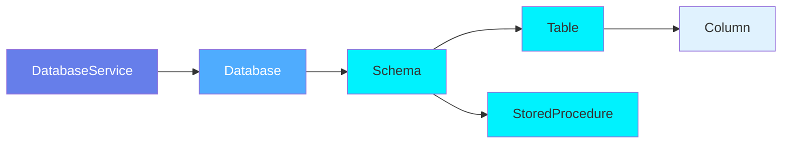
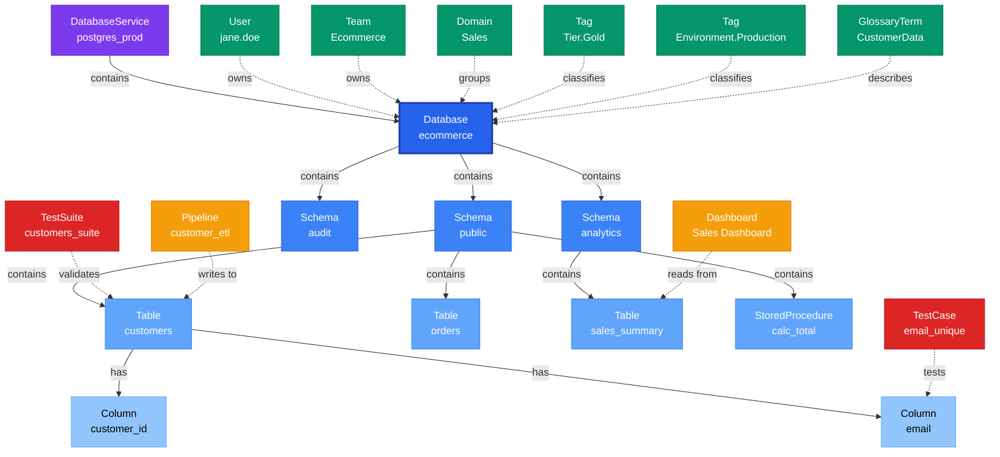

# Database

**Database containers - organizing schemas and tables**

---

## Overview

The **Database** entity represents a logical database within a database service. It acts as a container for database schemas and their tables, organizing data assets by application, business function, or environment.

**Hierarchy**:


---

## Relationships

### Parent Entities
- **DatabaseService**: The service hosting this database

### Child Entities
- **DatabaseSchema**: Schemas within this database
- **Table**: All tables across all schemas in this database
- **StoredProcedure**: All stored procedures across all schemas in this database

### Associated Entities
- **Owner**: User or team owning this database
- **Domain**: Business domain assignment
- **Tag**: Classification tags

### Relationship Diagram



---

## Schema Specifications

View the complete Database schema in your preferred format:

=== "JSON Schema"

    **Complete JSON Schema Definition**

    ```json
    {
      "$id": "https://open-metadata.org/schema/entity/data/database.json",
      "$schema": "http://json-schema.org/draft-07/schema#",
      "title": "Database",
      "description": "A `Database` entity is a logical container for database schemas within a database service.",
      "type": "object",
      "javaType": "org.openmetadata.schema.entity.data.Database",

      "definitions": {
        "databaseType": {
          "description": "Type or classification of database",
          "type": "string",
          "enum": [
            "Operational", "Analytical", "DataWarehouse",
            "DataLake", "Staging", "Archive"
          ]
        }
      },

      "properties": {
        "id": {
          "description": "Unique identifier",
          "$ref": "../../type/basic.json#/definitions/uuid"
        },
        "name": {
          "description": "Database name",
          "$ref": "../../type/basic.json#/definitions/entityName"
        },
        "fullyQualifiedName": {
          "description": "Fully qualified name: service.database",
          "$ref": "../../type/basic.json#/definitions/fullyQualifiedEntityName"
        },
        "displayName": {
          "description": "Display name",
          "type": "string"
        },
        "description": {
          "description": "Markdown description",
          "$ref": "../../type/basic.json#/definitions/markdown"
        },
        "databaseType": {
          "$ref": "#/definitions/databaseType"
        },
        "service": {
          "description": "Database service",
          "$ref": "../../type/entityReference.json"
        },
        "databaseSchemas": {
          "description": "Schemas in this database",
          "type": "array",
          "items": {
            "$ref": "../../type/entityReference.json"
          }
        },
        "owner": {
          "description": "Owner (user or team)",
          "$ref": "../../type/entityReference.json"
        },
        "domain": {
          "description": "Data domain",
          "$ref": "../../type/entityReference.json"
        },
        "tags": {
          "description": "Classification tags",
          "type": "array",
          "items": {
            "$ref": "../../type/tagLabel.json"
          }
        },
        "default": {
          "description": "Is this the default database",
          "type": "boolean",
          "default": false
        },
        "version": {
          "description": "Metadata version",
          "$ref": "../../type/entityHistory.json#/definitions/entityVersion"
        }
      },

      "required": ["id", "name", "service"]
    }
    ```

    **[View Full JSON Schema →](https://github.com/open-metadata/OpenMetadataStandards/blob/main/schemas/entity/data/database.json)**

=== "RDF"

    **RDF/OWL Ontology Definition**

    ```turtle
    @prefix om: <https://open-metadata.org/schema/> .
    @prefix rdfs: <http://www.w3.org/2000/01/rdf-schema#> .
    @prefix owl: <http://www.w3.org/2001/XMLSchema#> .
    @prefix xsd: <http://www.w3.org/2001/XMLSchema#> .

    # Database Class Definition
    om:Database a owl:Class ;
        rdfs:subClassOf om:DataAsset ;
        rdfs:label "Database" ;
        rdfs:comment "A logical database container for schemas and tables within a database service" ;
        om:hierarchyLevel 2 .

    # Properties
    om:databaseName a owl:DatatypeProperty ;
        rdfs:domain om:Database ;
        rdfs:range xsd:string ;
        rdfs:label "name" ;
        rdfs:comment "Name of the database" .

    om:fullyQualifiedName a owl:DatatypeProperty ;
        rdfs:domain om:Database ;
        rdfs:range xsd:string ;
        rdfs:label "fullyQualifiedName" ;
        rdfs:comment "Complete hierarchical name: service.database" .

    om:databaseType a owl:DatatypeProperty ;
        rdfs:domain om:Database ;
        rdfs:range om:DatabaseType ;
        rdfs:label "databaseType" ;
        rdfs:comment "Type of database: Operational, Analytical, DataWarehouse, etc." .

    om:isDefault a owl:DatatypeProperty ;
        rdfs:domain om:Database ;
        rdfs:range xsd:boolean ;
        rdfs:label "default" ;
        rdfs:comment "Whether this is the default database" .

    om:hasSchema a owl:ObjectProperty ;
        rdfs:domain om:Database ;
        rdfs:range om:DatabaseSchema ;
        rdfs:label "hasSchema" ;
        rdfs:comment "Schemas in this database" .

    om:belongsToService a owl:ObjectProperty ;
        rdfs:domain om:Database ;
        rdfs:range om:DatabaseService ;
        rdfs:label "belongsToService" ;
        rdfs:comment "Parent database service" .

    om:ownedBy a owl:ObjectProperty ;
        rdfs:domain om:Database ;
        rdfs:range om:Owner ;
        rdfs:label "ownedBy" ;
        rdfs:comment "User or team that owns this database" .

    om:hasTag a owl:ObjectProperty ;
        rdfs:domain om:Database ;
        rdfs:range om:Tag ;
        rdfs:label "hasTag" ;
        rdfs:comment "Classification tags applied to database" .

    # DatabaseType Enumeration
    om:DatabaseType a owl:Class ;
        owl:oneOf (
            om:Operational
            om:Analytical
            om:DataWarehouse
            om:DataLake
            om:Staging
        ) .

    # Example Instance
    ex:ecommerceDb a om:Database ;
        om:databaseName "ecommerce" ;
        om:fullyQualifiedName "postgres_prod.ecommerce" ;
        om:databaseType om:Operational ;
        om:belongsToService ex:postgresProd ;
        om:ownedBy ex:ecommerceTeam ;
        om:hasTag ex:tierGold ;
        om:hasSchema ex:publicSchema ;
        om:hasSchema ex:analyticsSchema .
    ```

    **[View Full RDF Ontology →](https://github.com/open-metadata/OpenMetadataStandards/blob/main/rdf/ontology/openmetadata.ttl)**

=== "JSON-LD"

    **JSON-LD Context and Example**

    ```json
    {
      "@context": {
        "@vocab": "https://open-metadata.org/schema/",
        "om": "https://open-metadata.org/schema/",
        "rdfs": "http://www.w3.org/2000/01/rdf-schema#",
        "xsd": "http://www.w3.org/2001/XMLSchema#",

        "Database": "om:Database",
        "name": {
          "@id": "om:databaseName",
          "@type": "xsd:string"
        },
        "fullyQualifiedName": {
          "@id": "om:fullyQualifiedName",
          "@type": "xsd:string"
        },
        "displayName": {
          "@id": "om:displayName",
          "@type": "xsd:string"
        },
        "description": {
          "@id": "om:description",
          "@type": "xsd:string"
        },
        "databaseType": {
          "@id": "om:databaseType",
          "@type": "@vocab"
        },
        "default": {
          "@id": "om:isDefault",
          "@type": "xsd:boolean"
        },
        "service": {
          "@id": "om:belongsToService",
          "@type": "@id"
        },
        "databaseSchemas": {
          "@id": "om:hasSchema",
          "@type": "@id",
          "@container": "@set"
        },
        "owner": {
          "@id": "om:ownedBy",
          "@type": "@id"
        },
        "domain": {
          "@id": "om:inDomain",
          "@type": "@id"
        },
        "tags": {
          "@id": "om:hasTag",
          "@type": "@id",
          "@container": "@set"
        }
      }
    }
    ```

    **Example JSON-LD Instance**:

    ```json
    {
      "@context": "https://open-metadata.org/context/database.jsonld",
      "@type": "Database",
      "@id": "https://example.com/data/databases/ecommerce",

      "name": "ecommerce",
      "fullyQualifiedName": "postgres_prod.ecommerce",
      "displayName": "E-commerce Database",
      "description": "Main database for e-commerce application containing customer, order, and product data",
      "databaseType": "Operational",
      "default": false,

      "service": {
        "@id": "https://example.com/services/postgres_prod",
        "@type": "DatabaseService",
        "name": "postgres_prod"
      },

      "databaseSchemas": [
        {
          "@id": "https://example.com/data/schemas/public",
          "@type": "DatabaseSchema",
          "name": "public"
        },
        {
          "@id": "https://example.com/data/schemas/analytics",
          "@type": "DatabaseSchema",
          "name": "analytics"
        }
      ],

      "owner": {
        "@id": "https://example.com/teams/ecommerce",
        "@type": "Team",
        "name": "ecommerce",
        "displayName": "E-commerce Team"
      },

      "domain": {
        "@id": "https://example.com/domains/sales",
        "@type": "Domain",
        "name": "Sales"
      },

      "tags": [
        {
          "@id": "https://open-metadata.org/tags/Tier/Gold",
          "tagFQN": "Tier.Gold"
        },
        {
          "@id": "https://open-metadata.org/tags/Environment/Production",
          "tagFQN": "Environment.Production"
        }
      ]
    }
    ```

    **[View Full JSON-LD Context →](https://github.com/open-metadata/OpenMetadataStandards/blob/main/rdf/contexts/database.jsonld)**

---

## Use Cases

- Organize schemas and tables by application or business function
- Separate production, staging, and development databases
- Track database-level ownership and governance
- Apply database-wide classification tags
- Manage database-level access controls
- Document database purpose and usage
- Create logical boundaries for data governance
- Group related data assets together

---

## JSON Schema Specification

### Core Properties

#### `id` (uuid)
**Type**: `string` (UUID format)
**Required**: Yes (system-generated)
**Description**: Unique identifier for this database instance

```json
{
  "id": "b2c3d4e5-f6a7-4b8c-9d0e-1f2a3b4c5d6e"
}
```

---

#### `name` (entityName)
**Type**: `string`
**Required**: Yes
**Pattern**: `^[^.]*$` (no dots allowed)
**Min Length**: 1
**Max Length**: 256
**Description**: Name of the database

```json
{
  "name": "ecommerce"
}
```

---

#### `fullyQualifiedName` (fullyQualifiedEntityName)
**Type**: `string`
**Required**: Yes (system-generated)
**Pattern**: `^((?!::).)*$`
**Description**: Fully qualified name in the format `service.database`

```json
{
  "fullyQualifiedName": "postgres_prod.ecommerce"
}
```

---

#### `displayName`
**Type**: `string`
**Required**: No
**Description**: Human-readable display name

```json
{
  "displayName": "E-commerce Database"
}
```

---

#### `description` (markdown)
**Type**: `string` (Markdown format)
**Required**: No
**Description**: Rich text description of the database's purpose and usage

```json
{
  "description": "# E-commerce Database\n\nMain database for e-commerce application.\n\n## Schemas\n- **public**: Customer and order tables\n- **analytics**: Analytics and reporting views\n- **audit**: Audit logs and history\n\n## Usage\nPrimary operational database for the e-commerce platform."
}
```

---

### Classification Properties

#### `databaseType` (DatabaseType enum)
**Type**: `string` enum
**Required**: No
**Allowed Values**:

- `Operational` - Transactional database for applications
- `Analytical` - Analytics and reporting database
- `DataWarehouse` - Data warehouse
- `DataLake` - Data lake storage
- `Staging` - Staging/ETL database
- `Archive` - Archive database

```json
{
  "databaseType": "Operational"
}
```

---

#### `default` (boolean)
**Type**: `boolean`
**Required**: No (default: `false`)
**Description**: Whether this is the default database for the service

```json
{
  "default": false
}
```

---

### Location Properties

#### `service` (EntityReference)
**Type**: `object`
**Required**: Yes
**Description**: Reference to parent database service

```json
{
  "service": {
    "id": "a1b2c3d4-e5f6-4a7b-8c9d-0e1f2a3b4c5d",
    "type": "databaseService",
    "name": "postgres_prod",
    "fullyQualifiedName": "postgres_prod"
  }
}
```

---

#### `databaseSchemas[]` (EntityReference[])
**Type**: `array`
**Required**: No (system-populated)
**Description**: List of schemas in this database

```json
{
  "databaseSchemas": [
    {
      "id": "c3d4e5f6-a7b8-4c9d-0e1f-2a3b4c5d6e7f",
      "type": "databaseSchema",
      "name": "public",
      "fullyQualifiedName": "postgres_prod.ecommerce.public"
    },
    {
      "id": "d4e5f6a7-b8c9-4d0e-1f2a-3b4c5d6e7f8a",
      "type": "databaseSchema",
      "name": "analytics",
      "fullyQualifiedName": "postgres_prod.ecommerce.analytics"
    }
  ]
}
```

---

### Governance Properties

#### `owner` (EntityReference)
**Type**: `object`
**Required**: No
**Description**: User or team that owns this database

```json
{
  "owner": {
    "id": "e5f6a7b8-c9d0-4e1f-2a3b-4c5d6e7f8a9b",
    "type": "team",
    "name": "ecommerce",
    "displayName": "E-commerce Team"
  }
}
```

---

#### `domain` (EntityReference)
**Type**: `object`
**Required**: No
**Description**: Data domain this database belongs to

```json
{
  "domain": {
    "id": "f6a7b8c9-d0e1-4f2a-3b4c-5d6e7f8a9b0c",
    "type": "domain",
    "name": "Sales",
    "fullyQualifiedName": "Sales"
  }
}
```

---

#### `tags[]` (TagLabel[])
**Type**: `array`
**Required**: No
**Description**: Classification tags applied to the database

```json
{
  "tags": [
    {
      "tagFQN": "Tier.Gold",
      "description": "Critical production database",
      "source": "Classification",
      "labelType": "Manual",
      "state": "Confirmed"
    },
    {
      "tagFQN": "Environment.Production",
      "source": "Classification",
      "labelType": "Manual",
      "state": "Confirmed"
    }
  ]
}
```

---

### Versioning Properties

#### `version` (entityVersion)
**Type**: `number`
**Required**: Yes (system-managed)
**Description**: Metadata version number

```json
{
  "version": 1.5
}
```

---

#### `updatedAt` (timestamp)
**Type**: `integer` (Unix epoch milliseconds)
**Required**: Yes (system-managed)
**Description**: Last update timestamp

```json
{
  "updatedAt": 1704240000000
}
```

---

#### `updatedBy` (string)
**Type**: `string`
**Required**: Yes (system-managed)
**Description**: User who made the update

```json
{
  "updatedBy": "jane.doe"
}
```

---

## Complete Example

```json
{
  "id": "b2c3d4e5-f6a7-4b8c-9d0e-1f2a3b4c5d6e",
  "name": "ecommerce",
  "fullyQualifiedName": "postgres_prod.ecommerce",
  "displayName": "E-commerce Database",
  "description": "# E-commerce Database\n\nMain database for e-commerce application containing customer, order, and product data.",
  "databaseType": "Operational",
  "default": false,
  "service": {
    "id": "a1b2c3d4-e5f6-4a7b-8c9d-0e1f2a3b4c5d",
    "type": "databaseService",
    "name": "postgres_prod"
  },
  "databaseSchemas": [
    {
      "id": "c3d4e5f6-a7b8-4c9d-0e1f-2a3b4c5d6e7f",
      "type": "databaseSchema",
      "name": "public"
    },
    {
      "id": "d4e5f6a7-b8c9-4d0e-1f2a-3b4c5d6e7f8a",
      "type": "databaseSchema",
      "name": "analytics"
    }
  ],
  "owner": {
    "id": "e5f6a7b8-c9d0-4e1f-2a3b-4c5d6e7f8a9b",
    "type": "team",
    "name": "ecommerce"
  },
  "domain": {
    "id": "f6a7b8c9-d0e1-4f2a-3b4c-5d6e7f8a9b0c",
    "type": "domain",
    "name": "Sales"
  },
  "tags": [
    {"tagFQN": "Tier.Gold"},
    {"tagFQN": "Environment.Production"}
  ],
  "version": 1.5,
  "updatedAt": 1704240000000,
  "updatedBy": "jane.doe"
}
```

---

## Custom Properties

This entity supports custom properties through the `extension` field.
Common custom properties include:

- **Data Classification**: Sensitivity level
- **Cost Center**: Billing allocation
- **Retention Period**: Data retention requirements
- **Application Owner**: Owning application/team

See [Custom Properties](../../metadata-specifications/custom-properties.md)
for details on defining and using custom properties.

---

## Followers

Users can follow databases to receive notifications about changes such as schema updates, governance changes, or deprecation notices. See **[Followers](../../metadata-specifications/followers.md)** for details.

---

## API Operations

All Database operations are available under the `/v1/databases` endpoint.

### List Databases

Get a list of databases, optionally filtered by service.

```http
GET /v1/databases
Query Parameters:
  - fields: Fields to include (databaseSchemas, owner, tags, domain, etc.)
  - service: Filter by database service name
  - limit: Number of results (1-1000000, default 10)
  - before/after: Cursor-based pagination
  - include: all | deleted | non-deleted (default: non-deleted)

Response: DatabaseList
```

### Create Database

Create a new database under a database service.

```http
POST /v1/databases
Content-Type: application/json

{
  "name": "ecommerce",
  "service": "postgres_prod",
  "description": "E-commerce production database",
  "owner": {
    "id": "...",
    "type": "team"
  },
  "tags": [
    {"tagFQN": "Environment.Production"}
  ]
}

Response: Database
```

### Get Database by Name

Get a database by its fully qualified name.

```http
GET /v1/databases/name/{fqn}
Query Parameters:
  - fields: Fields to include (databaseSchemas, owner, tags, domain, etc.)
  - include: all | deleted | non-deleted

Example:
GET /v1/databases/name/postgres_prod.ecommerce?fields=databaseSchemas,owner,tags,domain

Response: Database
```

### Get Database by ID

Get a database by its unique identifier.

```http
GET /v1/databases/{id}
Query Parameters:
  - fields: Fields to include
  - include: all | deleted | non-deleted

Response: Database
```

### Update Database

Update a database using JSON Patch.

```http
PATCH /v1/databases/name/{fqn}
Content-Type: application/json-patch+json

[
  {"op": "add", "path": "/tags/-", "value": {"tagFQN": "Tier.Gold"}},
  {"op": "replace", "path": "/description", "value": "Updated description"},
  {"op": "add", "path": "/owner", "value": {"id": "...", "type": "team"}}
]

Response: Database
```

### Create or Update Database

Create a new database or update if it exists.

```http
PUT /v1/databases
Content-Type: application/json

{
  "name": "analytics",
  "service": "snowflake_prod",
  "description": "Analytics database"
}

Response: Database
```

### Delete Database

Delete a database by fully qualified name.

```http
DELETE /v1/databases/name/{fqn}
Query Parameters:
  - recursive: Delete schemas and tables recursively (default: false)
  - hardDelete: Permanently delete (default: false)

Response: 200 OK
```

### Get Database Versions

Get all versions of a database.

```http
GET /v1/databases/{id}/versions

Response: EntityHistory
```

### Follow Database

Add a follower to a database.

```http
PUT /v1/databases/{id}/followers/{userId}

Response: ChangeEvent
```

### Get Followers

Get all followers of a database.

```http
GET /v1/databases/{id}/followers

Response: EntityReference[]
```

### Bulk Operations

Create or update multiple databases.

```http
PUT /v1/databases/bulk
Content-Type: application/json

{
  "entities": [...]
}

Response: BulkOperationResult
```

---

## Related Documentation

- **[Database Service](database-service.md)** - Parent service entity
- **[Database Schema](database-schema.md)** - Child schema entity
- **[Table](table.md)** - Table entity
- **[Data Governance](../../governance/overview.md)** - Governance policies
