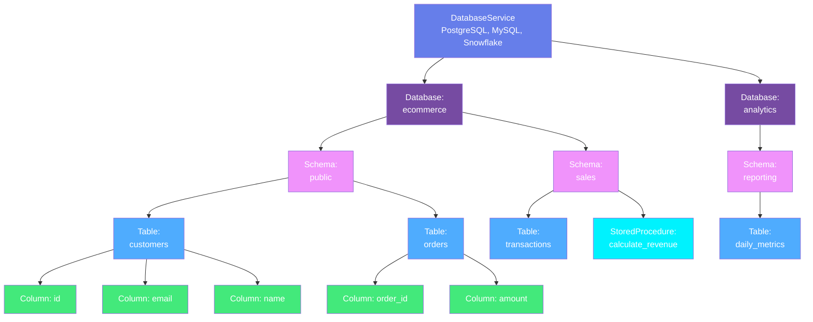
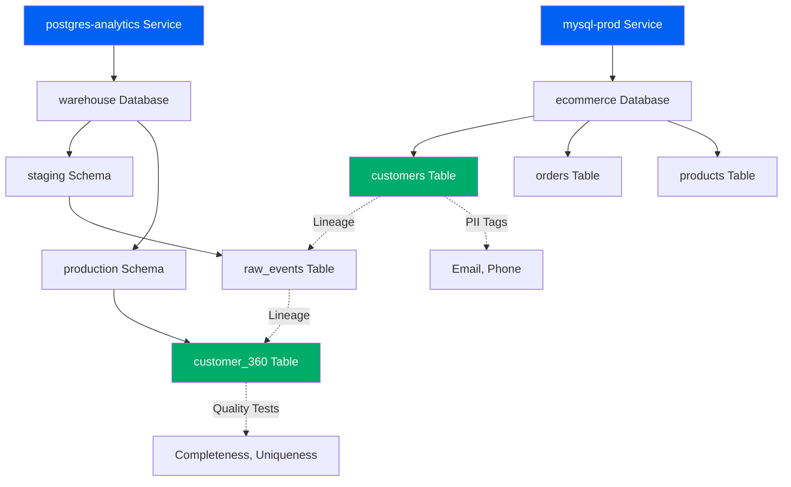

# Database Assets

**Hierarchical organization of relational and NoSQL database metadata**

Database assets in OpenMetadata follow a four-level hierarchy that mirrors how databases are organized in the real world. This structure enables precise metadata tracking from the service level down to individual tables and stored procedures.

---

## Hierarchy Overview



---

## Why This Hierarchy?

### Database Service
**Purpose**: Groups all databases from a single database platform or cluster

A Database Service represents the connection to a database system. It contains configuration details like connection URLs, credentials, and service-specific settings.

**Examples**:

- `mysql-prod` - Production MySQL cluster
- `snowflake-analytics` - Snowflake data warehouse
- `postgres-staging` - Staging PostgreSQL instance

**Why needed**: In an organization, you typically have multiple database platforms (MySQL, PostgreSQL, Snowflake, BigQuery, etc.) and multiple instances of each. The service level allows you to organize and manage these connections separately.

[**View Database Service Specification →**](database-service.md){ .md-button }

---

### Database
**Purpose**: Represents a logical database within a service

A Database is a collection of schemas (or tables directly for databases without schema support). It represents a logical grouping of data within the database service.

**Examples**:

- `ecommerce` - E-commerce application database
- `analytics` - Analytics database
- `customer_data` - Customer information database

**Why needed**: A single database service often hosts multiple databases for different applications, teams, or purposes. The database level provides logical separation.

[**View Database Specification →**](database.md){ .md-button }

---

### Database Schema
**Purpose**: Organizes tables and stored procedures within a database

A Schema is a namespace that contains tables, views, and stored procedures. Not all databases support schemas (e.g., MySQL uses databases as the top-level namespace), but for those that do (PostgreSQL, Snowflake, Oracle), schemas provide an additional layer of organization.

**Examples**:

- `public` - Default schema in PostgreSQL
- `sales` - Sales department schema
- `reporting` - Reporting and analytics schema

**Why needed**: Schemas allow multiple teams or applications to share a database while keeping their objects separate. They also enable fine-grained access control.

[**View Database Schema Specification →**](database-schema.md){ .md-button }

---

### Table
**Purpose**: The fundamental data storage unit with rows and columns

A Table organizes data in rows and columns. Each table has a schema definition (column names, types, constraints), ownership, tags, quality tests, and lineage.

**Examples**:

- `customers` - Customer information
- `orders` - Order transactions
- `products` - Product catalog

Tables are the most important metadata entities. They include:
- Column definitions with types and constraints
- Data quality tests and profiling results
- Tags and classifications (PII, sensitive data)
- Lineage (upstream sources, downstream consumers)
- Ownership and documentation

[**View Table Specification →**](table.md){ .md-button }

---

### Stored Procedure
**Purpose**: Executable code stored in the database

A Stored Procedure is a set of SQL statements that can be executed as a unit. Stored procedures contain business logic and data transformations.

**Examples**:

- `calculate_monthly_revenue` - Revenue calculation procedure
- `update_customer_segment` - Customer segmentation logic
- `clean_duplicate_records` - Data cleanup routine

**Why needed**: Stored procedures are part of your data processing logic. Tracking them as metadata entities enables:
- Understanding data transformations
- Lineage from source tables to target tables
- Impact analysis when procedures change

[**View Stored Procedure Specification →**](stored-procedure.md){ .md-button }

---

## Common Patterns

### Pattern 1: Single Schema Database (MySQL)
```
MySQL Service → ecommerce database → customers table
                                   → orders table
                                   → products table
```

MySQL treats the database as the schema level, so tables are directly under databases.

### Pattern 2: Multi-Schema Database (PostgreSQL)
```
PostgreSQL Service → app database → public schema → users table
                                                  → sessions table
                                  → analytics schema → events table
                                                     → metrics table
```

PostgreSQL uses schemas to organize tables within a database.

### Pattern 3: Data Warehouse (Snowflake)
```
Snowflake Service → ANALYTICS database → RAW schema → landing_customers table
                                                     → landing_orders table
                                      → CURATED schema → dim_customers table
                                                        → fact_orders table
                                      → REPORTING schema → customer_metrics view
```

Data warehouses often use schemas to separate data by processing stage (raw, curated, reporting).

---

## Real-World Example

Here's how an e-commerce company might organize their database metadata:



**Flow**:
1. **Operational Database**: MySQL service hosts the `ecommerce` database with transactional tables
2. **Analytics Warehouse**: PostgreSQL service hosts the `warehouse` database with staging and production schemas
3. **Lineage**: Customer data flows from MySQL → Staging → Production analytics table
4. **Governance**: Customers table tagged with PII classifications
5. **Quality**: Production table has quality tests for completeness and uniqueness

---

## Entity Specifications

Each entity in the database hierarchy has complete specifications in JSON Schema, RDF, and JSON-LD:

| Entity | Description | Specification |
|--------|-------------|---------------|
| **Database Service** | Platform/cluster connection | [View Spec](database-service.md) |
| **Database** | Logical database grouping | [View Spec](database.md) |
| **Database Schema** | Namespace for tables | [View Spec](database-schema.md) |
| **Table** | Data in rows and columns | [View Spec](table.md) |
| **Stored Procedure** | Executable database code | [View Spec](stored-procedure.md) |

Each specification page includes:
- Complete field reference
- JSON Schema definition
- RDF/OWL ontology representation
- JSON-LD context and examples
- Real-world use cases

---

## Next Steps

1. **Explore the hierarchy** - Click through each entity specification above
2. **See examples** - Check out real-world [examples](../../examples/index.md)
3. **Understand standards** - Learn about [JSON Schema, RDF, and JSON-LD](../../metadata-standards/overview.md)
