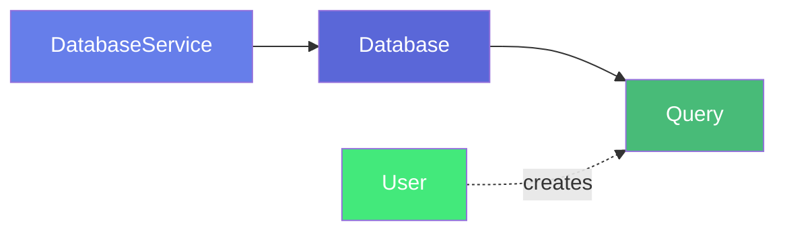

# Query

**Saved SQL queries and query templates**

---

## Overview

The **Query** entity represents saved SQL queries, query templates, and frequently-used data extraction scripts. It captures query metadata, SQL code, execution history, performance metrics, and relationships to source tables and users. Queries enable knowledge sharing, code reuse, and discovery of common data access patterns across the organization.

**Hierarchy**:


---

## Relationships

Query has comprehensive relationships with entities across the metadata platform:

```mermaid
graph TD
    subgraph Query Definition
        Q[Query:<br/>Monthly Sales Report]
    end

    subgraph Database Context
        DB[Database:<br/>analytics_db] -.->|contains| Q
        SVC[DatabaseService:<br/>postgres_prod] -.->|hosts| DB
    end

    subgraph Query Sources
        Q -.->|queries| T1[Table:<br/>sales.orders]
        Q -.->|queries| T2[Table:<br/>sales.customers]
        Q -.->|queries| T3[Table:<br/>sales.products]

        Q -.->|uses column| C1[Column:<br/>order_date]
        Q -.->|uses column| C2[Column:<br/>order_amount]
        Q -.->|uses column| C3[Column:<br/>customer_name]
    end

    subgraph Query Code
        Q -.->|has SQL| SQL[SQL Code:<br/>SELECT o.order_date...]
        Q -.->|parameterized| PARAM1[Parameter:<br/>start_date]
        Q -.->|parameterized| PARAM2[Parameter:<br/>end_date]
    end

    subgraph Authorship & Ownership
        Q -.->|created by| U1[User:<br/>analyst.team]
        Q -.->|owned by| O1[Team:<br/>Analytics]
        Q -.->|modified by| U2[User:<br/>data.engineer]
    end

    subgraph Governance
        Q -.->|in domain| DOM[Domain:<br/>Sales]
        Q -.->|has tags| TAG1[Tag:<br/>Tier.Silver]
        Q -.->|has tags| TAG2[Tag:<br/>Reporting]
        Q -.->|has tags| TAG3[Tag:<br/>PII.Sensitive]

        Q -.->|described by| GT1[GlossaryTerm:<br/>Sales]
        Q -.->|described by| GT2[GlossaryTerm:<br/>Revenue]
    end

    subgraph Execution & Usage
        Q -.->|execution history| QH1[QueryHistory:<br/>2024-01-15 09:30]
        Q -.->|execution history| QH2[QueryHistory:<br/>2024-01-16 09:30]
        Q -.->|execution history| QH3[QueryHistory:<br/>2024-01-17 09:30]

        Q -.->|usage stats| STATS[UsageStats:<br/>120 executions/month]
    end

    subgraph Related Queries
        Q -.->|similar to| RQ1[Query:<br/>Weekly Sales Report]
        Q -.->|related to| RQ2[Query:<br/>Sales by Region]
    end

    subgraph Downstream Usage
        Q -.->|used in| D1[Dashboard:<br/>Sales Dashboard]
        Q -.->|feeds| R1[Report:<br/>Monthly Report]
        Q -.->|scheduled in| P1[Pipeline:<br/>sales_report_job]
    end

    subgraph Quality & Performance
        Q -.->|performance metrics| PERF[Performance:<br/>avg 2.3s]
        Q -.->|validated by| TC[TestCase:<br/>query_results_check]
    end

    subgraph Access Control
        U3[User:<br/>sales.team] -.->|can view| Q
        U4[User:<br/>exec.team] -.->|can execute| Q
    end

    style Q fill:#48bb78,color:#fff,stroke:#38a169,stroke-width:3px
    style DB fill:#5a67d8,color:#fff
    style SVC fill:#667eea,color:#fff
    style T1 fill:#764ba2,color:#fff
    style T2 fill:#764ba2,color:#fff
    style T3 fill:#764ba2,color:#fff
    style C1 fill:#9b59b6,color:#fff
    style C2 fill:#9b59b6,color:#fff
    style C3 fill:#9b59b6,color:#fff
    style SQL fill:#34495e,color:#fff
    style PARAM1 fill:#2c3e50,color:#fff
    style PARAM2 fill:#2c3e50,color:#fff
    style U1 fill:#43e97b,color:#fff
    style O1 fill:#43e97b,color:#fff
    style U2 fill:#43e97b,color:#fff
    style DOM fill:#fa709a,color:#fff
    style TAG1 fill:#f093fb,color:#fff
    style TAG2 fill:#f093fb,color:#fff
    style TAG3 fill:#f093fb,color:#fff
    style GT1 fill:#ffd700,color:#333
    style GT2 fill:#ffd700,color:#333
    style QH1 fill:#3498db,color:#fff
    style QH2 fill:#3498db,color:#fff
    style QH3 fill:#3498db,color:#fff
    style STATS fill:#16a085,color:#fff
    style RQ1 fill:#52c41a,color:#fff
    style RQ2 fill:#52c41a,color:#fff
    style D1 fill:#4facfe,color:#fff
    style R1 fill:#ff6b6b,color:#fff
    style P1 fill:#f5576c,color:#fff
    style PERF fill:#f39c12,color:#fff
    style TC fill:#9b59b6,color:#fff
    style U3 fill:#ff6b6b,color:#fff
    style U4 fill:#ff6b6b,color:#fff
```



**Relationship Types**:

- **Solid lines (→)**: Hierarchical containment (Database contains Query)
- **Dashed lines (-.->)**: References and associations (ownership, governance, data sources, usage, lineage)

---

### Parent Entities
- **DatabaseService**: The database service hosting this query
- **Database**: The database this query belongs to

### Child Entities
- **QueryHistory**: Execution history records

### Associated Entities
- **User**: Query creator and users who have executed the query
- **Owner**: User or team owning this query
- **Domain**: Business domain assignment
- **Tag**: Classification tags
- **GlossaryTerm**: Business terminology
- **Table**: Tables queried by this SQL
- **Column**: Specific columns referenced
- **Dashboard**: Dashboards using this query
- **Report**: Reports using this query
- **Pipeline**: Pipelines executing this query
- **TestCase**: Data quality tests validating query results

---

## Schema Specifications

View the complete Query schema in your preferred format:

=== "JSON Schema"

    **Complete JSON Schema Definition**

    ```json
    {
      "$id": "https://open-metadata.org/schema/entity/data/query.json",
      "$schema": "http://json-schema.org/draft-07/schema#",
      "title": "Query",
      "description": "A `Query` represents a saved SQL query or query template.",
      "type": "object",
      "javaType": "org.openmetadata.schema.entity.data.Query",

      "definitions": {
        "queryType": {
          "description": "Type of query",
          "type": "string",
          "enum": [
            "SELECT", "INSERT", "UPDATE", "DELETE",
            "CREATE", "ALTER", "DROP", "OTHER"
          ]
        },
        "queryUsageType": {
          "description": "Purpose of the query",
          "type": "string",
          "enum": [
            "REPORTING", "ANALYSIS", "ETL", "MONITORING",
            "ADMIN", "TESTING", "OTHER"
          ]
        },
        "queryParameter": {
          "description": "A query parameter",
          "type": "object",
          "properties": {
            "name": {
              "type": "string"
            },
            "dataType": {
              "type": "string"
            },
            "description": {
              "type": "string"
            },
            "defaultValue": {
              "type": "string"
            },
            "required": {
              "type": "boolean"
            }
          },
          "required": ["name"]
        }
      },

      "properties": {
        "id": {
          "description": "Unique identifier",
          "$ref": "../../type/basic.json#/definitions/uuid"
        },
        "name": {
          "description": "Query name",
          "$ref": "../../type/basic.json#/definitions/entityName"
        },
        "fullyQualifiedName": {
          "description": "Fully qualified name: service.database.query",
          "$ref": "../../type/basic.json#/definitions/fullyQualifiedEntityName"
        },
        "displayName": {
          "description": "Display name",
          "type": "string"
        },
        "description": {
          "description": "Markdown description",
          "$ref": "../../type/basic.json#/definitions/markdown"
        },
        "queryType": {
          "$ref": "#/definitions/queryType"
        },
        "queryUsageType": {
          "$ref": "#/definitions/queryUsageType"
        },
        "query": {
          "description": "SQL query text",
          "type": "string"
        },
        "checksum": {
          "description": "Query checksum for deduplication",
          "type": "string"
        },
        "duration": {
          "description": "Average execution duration in milliseconds",
          "type": "number"
        },
        "service": {
          "description": "Database service",
          "$ref": "../../type/entityReference.json"
        },
        "database": {
          "description": "Database",
          "$ref": "../../type/entityReference.json"
        },
        "tables": {
          "description": "Tables queried",
          "type": "array",
          "items": {
            "$ref": "../../type/entityReference.json"
          }
        },
        "columns": {
          "description": "Columns referenced",
          "type": "array",
          "items": {
            "$ref": "../../type/entityReference.json"
          }
        },
        "parameters": {
          "description": "Query parameters",
          "type": "array",
          "items": {
            "$ref": "#/definitions/queryParameter"
          }
        },
        "users": {
          "description": "Users who have executed this query",
          "type": "array",
          "items": {
            "$ref": "../../type/entityReference.json"
          }
        },
        "usedBy": {
          "description": "Dashboards, reports, or pipelines using this query",
          "type": "array",
          "items": {
            "$ref": "../../type/entityReference.json"
          }
        },
        "queryDate": {
          "description": "Last execution date",
          "type": "string",
          "format": "date-time"
        },
        "owner": {
          "description": "Owner (user or team)",
          "$ref": "../../type/entityReference.json"
        },
        "domain": {
          "description": "Data domain",
          "$ref": "../../type/entityReference.json"
        },
        "tags": {
          "description": "Classification tags",
          "type": "array",
          "items": {
            "$ref": "../../type/tagLabel.json"
          }
        },
        "glossaryTerms": {
          "description": "Business glossary terms",
          "type": "array",
          "items": {
            "$ref": "../../type/entityReference.json"
          }
        },
        "votes": {
          "description": "Vote summary",
          "$ref": "../../type/votes.json"
        },
        "version": {
          "description": "Metadata version",
          "$ref": "../../type/entityHistory.json#/definitions/entityVersion"
        }
      },

      "required": ["id", "name", "query"]
    }
    ```

    **[View Full JSON Schema →](https://github.com/open-metadata/OpenMetadataStandards/blob/main/schemas/entity/data/query.json)**

=== "RDF"

    **RDF/OWL Ontology Definition**

    ```turtle
    @prefix om: <https://open-metadata.org/schema/> .
    @prefix rdfs: <http://www.w3.org/2000/01/rdf-schema#> .
    @prefix owl: <http://www.w3.org/2001/XMLSchema#> .
    @prefix xsd: <http://www.w3.org/2001/XMLSchema#> .

    # Query Class Definition
    om:Query a owl:Class ;
        rdfs:subClassOf om:DataAsset ;
        rdfs:label "Query" ;
        rdfs:comment "A saved SQL query or query template" ;
        om:hierarchyLevel 3 .

    # Properties
    om:queryName a owl:DatatypeProperty ;
        rdfs:domain om:Query ;
        rdfs:range xsd:string ;
        rdfs:label "name" ;
        rdfs:comment "Name of the query" .

    om:queryText a owl:DatatypeProperty ;
        rdfs:domain om:Query ;
        rdfs:range xsd:string ;
        rdfs:label "query" ;
        rdfs:comment "SQL query text" .

    om:queryType a owl:DatatypeProperty ;
        rdfs:domain om:Query ;
        rdfs:range om:QueryType ;
        rdfs:label "queryType" ;
        rdfs:comment "Type: SELECT, INSERT, UPDATE, etc." .

    om:queryDuration a owl:DatatypeProperty ;
        rdfs:domain om:Query ;
        rdfs:range xsd:decimal ;
        rdfs:label "duration" ;
        rdfs:comment "Average execution duration in milliseconds" .

    om:belongsToDatabase a owl:ObjectProperty ;
        rdfs:domain om:Query ;
        rdfs:range om:Database ;
        rdfs:label "belongsToDatabase" ;
        rdfs:comment "Database this query belongs to" .

    om:queriesTable a owl:ObjectProperty ;
        rdfs:domain om:Query ;
        rdfs:range om:Table ;
        rdfs:label "queriesTable" ;
        rdfs:comment "Tables queried by this SQL" .

    om:referencesColumn a owl:ObjectProperty ;
        rdfs:domain om:Query ;
        rdfs:range om:Column ;
        rdfs:label "referencesColumn" ;
        rdfs:comment "Columns referenced in query" .

    om:createdBy a owl:ObjectProperty ;
        rdfs:domain om:Query ;
        rdfs:range om:User ;
        rdfs:label "createdBy" ;
        rdfs:comment "User who created this query" .

    om:executedBy a owl:ObjectProperty ;
        rdfs:domain om:Query ;
        rdfs:range om:User ;
        rdfs:label "executedBy" ;
        rdfs:comment "Users who have executed this query" .

    om:usedByDashboard a owl:ObjectProperty ;
        rdfs:domain om:Query ;
        rdfs:range om:Dashboard ;
        rdfs:label "usedByDashboard" ;
        rdfs:comment "Dashboards using this query" .

    # Query Type Enumeration
    om:QueryType a owl:Class ;
        owl:oneOf (
            om:QueryType_SELECT
            om:QueryType_INSERT
            om:QueryType_UPDATE
            om:QueryType_DELETE
        ) .

    # Example Instance
    ex:salesReportQuery a om:Query ;
        om:queryName "monthly_sales_report" ;
        om:fullyQualifiedName "postgres_prod.analytics_db.monthly_sales_report" ;
        om:displayName "Monthly Sales Report" ;
        om:queryText "SELECT order_date, SUM(order_amount) FROM orders GROUP BY order_date" ;
        om:queryType om:QueryType_SELECT ;
        om:belongsToDatabase ex:analyticsDB ;
        om:queriesTable ex:ordersTable ;
        om:createdBy ex:analystUser ;
        om:ownedBy ex:analyticsTeam .
    ```

    **[View Full RDF Ontology →](https://github.com/open-metadata/OpenMetadataStandards/blob/main/rdf/ontology/openmetadata.ttl)**

=== "JSON-LD"

    **JSON-LD Context and Example**

    ```json
    {
      "@context": {
        "@vocab": "https://open-metadata.org/schema/",
        "om": "https://open-metadata.org/schema/",
        "rdfs": "http://www.w3.org/2000/01/rdf-schema#",
        "xsd": "http://www.w3.org/2001/XMLSchema#",

        "Query": "om:Query",
        "name": {
          "@id": "om:queryName",
          "@type": "xsd:string"
        },
        "fullyQualifiedName": {
          "@id": "om:fullyQualifiedName",
          "@type": "xsd:string"
        },
        "displayName": {
          "@id": "om:displayName",
          "@type": "xsd:string"
        },
        "description": {
          "@id": "om:description",
          "@type": "xsd:string"
        },
        "query": {
          "@id": "om:queryText",
          "@type": "xsd:string"
        },
        "queryType": {
          "@id": "om:queryType",
          "@type": "@vocab"
        },
        "duration": {
          "@id": "om:queryDuration",
          "@type": "xsd:decimal"
        },
        "database": {
          "@id": "om:belongsToDatabase",
          "@type": "@id"
        },
        "service": {
          "@id": "om:belongsToService",
          "@type": "@id"
        },
        "tables": {
          "@id": "om:queriesTable",
          "@type": "@id",
          "@container": "@set"
        },
        "columns": {
          "@id": "om:referencesColumn",
          "@type": "@id",
          "@container": "@set"
        },
        "users": {
          "@id": "om:executedBy",
          "@type": "@id",
          "@container": "@set"
        },
        "owner": {
          "@id": "om:ownedBy",
          "@type": "@id"
        }
      }
    }
    ```

    **Example JSON-LD Instance**:

    ```json
    {
      "@context": "https://open-metadata.org/context/query.jsonld",
      "@type": "Query",
      "@id": "https://example.com/queries/monthly_sales_report",

      "name": "monthly_sales_report",
      "fullyQualifiedName": "postgres_prod.analytics_db.monthly_sales_report",
      "displayName": "Monthly Sales Report",
      "description": "# Monthly Sales Report\n\nGenerates monthly sales summary by product category.",
      "queryType": "SELECT",
      "queryUsageType": "REPORTING",
      "query": "SELECT\n  DATE_TRUNC('month', order_date) AS month,\n  product_category,\n  SUM(order_amount) AS total_revenue,\n  COUNT(DISTINCT customer_id) AS customer_count\nFROM orders\nWHERE order_date >= :start_date\n  AND order_date < :end_date\nGROUP BY 1, 2\nORDER BY 1 DESC, 3 DESC",

      "database": {
        "@id": "https://example.com/databases/analytics_db",
        "@type": "Database",
        "name": "analytics_db"
      },

      "service": {
        "@id": "https://example.com/services/postgres_prod",
        "@type": "DatabaseService",
        "name": "postgres_prod"
      },

      "tables": [
        {
          "@id": "https://example.com/tables/orders",
          "@type": "Table",
          "fullyQualifiedName": "postgres_prod.analytics_db.sales.orders"
        }
      ],

      "parameters": [
        {
          "name": "start_date",
          "dataType": "DATE",
          "description": "Report start date",
          "required": true
        },
        {
          "name": "end_date",
          "dataType": "DATE",
          "description": "Report end date",
          "required": true
        }
      ],

      "owner": {
        "@id": "https://example.com/teams/analytics",
        "@type": "Team",
        "name": "analytics"
      }
    }
    ```

    **[View Full JSON-LD Context →](https://github.com/open-metadata/OpenMetadataStandards/blob/main/rdf/contexts/query.jsonld)**

---

## Use Cases

- Catalog frequently-used SQL queries across the organization
- Enable discovery and reuse of common data extraction patterns
- Document query purpose and usage guidelines
- Track query authorship and ownership
- Capture lineage from source tables to queries to reports
- Monitor query performance and execution frequency
- Share parameterized query templates across teams
- Apply governance tags to queries accessing sensitive data
- Track query changes and version history
- Support query optimization through usage analytics

---

## JSON Schema Specification

### Core Properties

#### `id` (uuid)
**Type**: `string` (UUID format)
**Required**: Yes (system-generated)
**Description**: Unique identifier for this query instance

```json
{
  "id": "6f7a8b9c-0d1e-2f3a-4b5c-6d7e8f9a0b1c"
}
```

---

#### `name` (entityName)
**Type**: `string`
**Required**: Yes
**Pattern**: `^[^.]*$` (no dots allowed)
**Min Length**: 1
**Max Length**: 256
**Description**: Name of the query (unqualified)

```json
{
  "name": "monthly_sales_report"
}
```

---

#### `fullyQualifiedName` (fullyQualifiedEntityName)
**Type**: `string`
**Required**: Yes (system-generated)
**Pattern**: `^((?!::).)*$`
**Description**: Fully qualified name in the format `service.database.query`

```json
{
  "fullyQualifiedName": "postgres_prod.analytics_db.monthly_sales_report"
}
```

---

#### `displayName`
**Type**: `string`
**Required**: No
**Description**: Human-readable display name

```json
{
  "displayName": "Monthly Sales Report"
}
```

---

#### `description` (markdown)
**Type**: `string` (Markdown format)
**Required**: No
**Description**: Rich text description of the query's purpose and usage

```json
{
  "description": "# Monthly Sales Report\n\nGenerates monthly sales summary by product category.\n\n## Parameters\n- `start_date`: Report start date (DATE)\n- `end_date`: Report end date (DATE)\n\n## Output Columns\n- `month`: Month of sale\n- `product_category`: Product category name\n- `total_revenue`: Sum of order amounts\n- `customer_count`: Distinct customer count\n\n## Usage\nRun at the beginning of each month for the previous month's data."
}
```

---

### Query Configuration

#### `queryType` (QueryType enum)
**Type**: `string` enum
**Required**: No
**Allowed Values**:

- `SELECT` - Data retrieval query
- `INSERT` - Data insertion query
- `UPDATE` - Data update query
- `DELETE` - Data deletion query
- `CREATE` - DDL create statement
- `ALTER` - DDL alter statement
- `DROP` - DDL drop statement
- `OTHER` - Other query type

```json
{
  "queryType": "SELECT"
}
```

---

#### `queryUsageType` (QueryUsageType enum)
**Type**: `string` enum
**Required**: No
**Allowed Values**:

- `REPORTING` - For generating reports
- `ANALYSIS` - For data analysis
- `ETL` - For ETL processes
- `MONITORING` - For monitoring/alerting
- `ADMIN` - For administrative tasks
- `TESTING` - For testing purposes
- `OTHER` - Other usage

```json
{
  "queryUsageType": "REPORTING"
}
```

---

### Query Definition

#### `query` (string)
**Type**: `string`
**Required**: Yes
**Description**: SQL query text

```json
{
  "query": "SELECT\n  DATE_TRUNC('month', order_date) AS month,\n  product_category,\n  SUM(order_amount) AS total_revenue,\n  COUNT(DISTINCT customer_id) AS customer_count\nFROM orders\nWHERE order_date >= :start_date\n  AND order_date < :end_date\nGROUP BY 1, 2\nORDER BY 1 DESC, 3 DESC"
}
```

---

#### `checksum` (string)
**Type**: `string`
**Required**: No (system-generated)
**Description**: Query checksum for deduplication and change detection

```json
{
  "checksum": "md5:a1b2c3d4e5f6g7h8i9j0k1l2m3n4o5p6"
}
```

---

#### `parameters[]` (QueryParameter[])
**Type**: `array` of QueryParameter objects
**Required**: No
**Description**: Query parameters for parameterized queries

**QueryParameter Object**:

| Property | Type | Required | Description |
|----------|------|----------|-------------|
| `name` | string | Yes | Parameter name |
| `dataType` | string | No | Data type |
| `description` | string | No | Parameter description |
| `defaultValue` | string | No | Default value |
| `required` | boolean | No | Is required |

```json
{
  "parameters": [
    {
      "name": "start_date",
      "dataType": "DATE",
      "description": "Report start date (inclusive)",
      "required": true
    },
    {
      "name": "end_date",
      "dataType": "DATE",
      "description": "Report end date (exclusive)",
      "required": true
    },
    {
      "name": "min_amount",
      "dataType": "DECIMAL",
      "description": "Minimum order amount to include",
      "defaultValue": "0",
      "required": false
    }
  ]
}
```

---

### Performance Properties

#### `duration` (number)
**Type**: `number`
**Required**: No (system-generated)
**Description**: Average execution duration in milliseconds

```json
{
  "duration": 2345.67
}
```

---

#### `queryDate` (datetime)
**Type**: `string` (ISO 8601 datetime)
**Required**: No (system-generated)
**Description**: Last execution date

```json
{
  "queryDate": "2024-01-15T09:30:00Z"
}
```

---

### Data Source Properties

#### `service` (EntityReference)
**Type**: `object`
**Required**: No
**Description**: Reference to database service

```json
{
  "service": {
    "id": "service-uuid",
    "type": "databaseService",
    "name": "postgres_prod",
    "fullyQualifiedName": "postgres_prod"
  }
}
```

---

#### `database` (EntityReference)
**Type**: `object`
**Required**: No
**Description**: Reference to database

```json
{
  "database": {
    "id": "database-uuid",
    "type": "database",
    "name": "analytics_db",
    "fullyQualifiedName": "postgres_prod.analytics_db"
  }
}
```

---

#### `tables[]` (Table[])
**Type**: `array` of Table entity references
**Required**: No
**Description**: Tables queried by this SQL

```json
{
  "tables": [
    {
      "id": "table-uuid",
      "type": "table",
      "name": "orders",
      "fullyQualifiedName": "postgres_prod.analytics_db.sales.orders"
    },
    {
      "id": "table-uuid-2",
      "type": "table",
      "name": "customers",
      "fullyQualifiedName": "postgres_prod.analytics_db.sales.customers"
    }
  ]
}
```

---

#### `columns[]` (Column[])
**Type**: `array` of Column entity references
**Required**: No
**Description**: Columns referenced in the query

```json
{
  "columns": [
    {
      "id": "column-uuid",
      "type": "column",
      "name": "order_date",
      "fullyQualifiedName": "postgres_prod.analytics_db.sales.orders.order_date"
    },
    {
      "id": "column-uuid-2",
      "type": "column",
      "name": "order_amount",
      "fullyQualifiedName": "postgres_prod.analytics_db.sales.orders.order_amount"
    }
  ]
}
```

---

### Usage Properties

#### `users[]` (User[])
**Type**: `array` of User entity references
**Required**: No (system-generated)
**Description**: Users who have executed this query

```json
{
  "users": [
    {
      "id": "user-uuid",
      "type": "user",
      "name": "analyst.team",
      "displayName": "Analytics Team Member"
    },
    {
      "id": "user-uuid-2",
      "type": "user",
      "name": "data.engineer",
      "displayName": "Data Engineer"
    }
  ]
}
```

---

#### `usedBy[]` (EntityReference[])
**Type**: `array` of entity references
**Required**: No
**Description**: Dashboards, reports, or pipelines using this query

```json
{
  "usedBy": [
    {
      "id": "dashboard-uuid",
      "type": "dashboard",
      "name": "sales_dashboard",
      "fullyQualifiedName": "tableau_prod.sales_dashboard"
    },
    {
      "id": "report-uuid",
      "type": "report",
      "name": "monthly_sales_report",
      "fullyQualifiedName": "looker_prod.monthly_sales_report"
    }
  ]
}
```

---

### Governance Properties

#### `owner` (EntityReference)
**Type**: `object`
**Required**: No
**Description**: User or team that owns this query

```json
{
  "owner": {
    "id": "owner-uuid",
    "type": "team",
    "name": "analytics-team",
    "displayName": "Analytics Team"
  }
}
```

---

#### `domain` (EntityReference)
**Type**: `object`
**Required**: No
**Description**: Data domain this query belongs to

```json
{
  "domain": {
    "id": "domain-uuid",
    "type": "domain",
    "name": "Sales",
    "fullyQualifiedName": "Sales"
  }
}
```

---

#### `tags[]` (TagLabel[])
**Type**: `array`
**Required**: No
**Description**: Classification tags applied to the query

```json
{
  "tags": [
    {
      "tagFQN": "Tier.Silver",
      "source": "Classification",
      "labelType": "Manual",
      "state": "Confirmed"
    },
    {
      "tagFQN": "PII.Sensitive",
      "description": "Query accesses customer PII",
      "source": "Classification",
      "labelType": "Automated",
      "state": "Confirmed"
    }
  ]
}
```

---

#### `glossaryTerms[]` (GlossaryTerm[])
**Type**: `array`
**Required**: No
**Description**: Business glossary terms linked to this query

```json
{
  "glossaryTerms": [
    {
      "fullyQualifiedName": "BusinessGlossary.Sales"
    },
    {
      "fullyQualifiedName": "BusinessGlossary.Revenue"
    }
  ]
}
```

---

#### `votes` (Votes)
**Type**: `object`
**Required**: No (system-generated)
**Description**: User votes/ratings for query usefulness

```json
{
  "votes": {
    "upVotes": 15,
    "downVotes": 2,
    "upVoters": ["user1", "user2"],
    "downVoters": ["user3"]
  }
}
```

---

## Complete Example

```json
{
  "id": "6f7a8b9c-0d1e-2f3a-4b5c-6d7e8f9a0b1c",
  "name": "monthly_sales_report",
  "fullyQualifiedName": "postgres_prod.analytics_db.monthly_sales_report",
  "displayName": "Monthly Sales Report",
  "description": "# Monthly Sales Report\n\nGenerates monthly sales summary by product category.",
  "queryType": "SELECT",
  "queryUsageType": "REPORTING",
  "query": "SELECT\n  DATE_TRUNC('month', order_date) AS month,\n  product_category,\n  SUM(order_amount) AS total_revenue,\n  COUNT(DISTINCT customer_id) AS customer_count\nFROM orders\nWHERE order_date >= :start_date\n  AND order_date < :end_date\nGROUP BY 1, 2\nORDER BY 1 DESC, 3 DESC",
  "checksum": "md5:a1b2c3d4e5f6g7h8i9j0k1l2m3n4o5p6",
  "duration": 2345.67,
  "queryDate": "2024-01-15T09:30:00Z",
  "service": {
    "id": "service-uuid",
    "type": "databaseService",
    "name": "postgres_prod"
  },
  "database": {
    "id": "database-uuid",
    "type": "database",
    "name": "analytics_db"
  },
  "tables": [
    {
      "id": "table-uuid",
      "type": "table",
      "name": "orders",
      "fullyQualifiedName": "postgres_prod.analytics_db.sales.orders"
    }
  ],
  "parameters": [
    {
      "name": "start_date",
      "dataType": "DATE",
      "description": "Report start date",
      "required": true
    },
    {
      "name": "end_date",
      "dataType": "DATE",
      "description": "Report end date",
      "required": true
    }
  ],
  "users": [
    {
      "id": "user-uuid",
      "type": "user",
      "name": "analyst.team"
    }
  ],
  "usedBy": [
    {
      "id": "dashboard-uuid",
      "type": "dashboard",
      "name": "sales_dashboard"
    }
  ],
  "owner": {
    "id": "owner-uuid",
    "type": "team",
    "name": "analytics-team"
  },
  "domain": {
    "id": "domain-uuid",
    "type": "domain",
    "name": "Sales"
  },
  "tags": [
    {"tagFQN": "Tier.Silver"},
    {"tagFQN": "Reporting"}
  ],
  "votes": {
    "upVotes": 15,
    "downVotes": 2
  },
  "version": 1.3,
  "updatedAt": 1704240000000,
  "updatedBy": "analyst.team"
}
```

---

## Examples by Purpose

### Reporting Query

```json
{
  "name": "weekly_revenue_by_region",
  "displayName": "Weekly Revenue by Region",
  "description": "Weekly revenue breakdown by sales region",
  "queryType": "SELECT",
  "queryUsageType": "REPORTING",
  "query": "SELECT\n  region,\n  DATE_TRUNC('week', sale_date) AS week,\n  SUM(revenue) AS total_revenue\nFROM sales\nWHERE sale_date >= :start_date\nGROUP BY 1, 2\nORDER BY 2 DESC, 3 DESC",
  "parameters": [
    {
      "name": "start_date",
      "dataType": "DATE",
      "defaultValue": "CURRENT_DATE - INTERVAL '90 days'",
      "required": false
    }
  ]
}
```

---

### Data Extraction Query

```json
{
  "name": "customer_export",
  "displayName": "Customer Data Export",
  "description": "Export customer data for CRM integration",
  "queryType": "SELECT",
  "queryUsageType": "ETL",
  "query": "SELECT\n  customer_id,\n  email,\n  first_name,\n  last_name,\n  created_at,\n  last_purchase_date\nFROM customers\nWHERE created_at >= :last_sync_date",
  "parameters": [
    {
      "name": "last_sync_date",
      "dataType": "TIMESTAMP",
      "required": true
    }
  ],
  "tags": [
    {"tagFQN": "PII.Sensitive"},
    {"tagFQN": "ETL"}
  ]
}
```

---

### Analysis Query

```json
{
  "name": "customer_cohort_retention",
  "displayName": "Customer Cohort Retention Analysis",
  "description": "Analyze customer retention by cohort",
  "queryType": "SELECT",
  "queryUsageType": "ANALYSIS",
  "query": "WITH cohorts AS (\n  SELECT\n    customer_id,\n    DATE_TRUNC('month', first_purchase_date) AS cohort_month\n  FROM customers\n)\nSELECT\n  cohort_month,\n  COUNT(DISTINCT customer_id) AS cohort_size,\n  COUNT(DISTINCT CASE WHEN months_since_first = 1 THEN customer_id END) AS month_1_retained\nFROM cohorts\nGROUP BY 1",
  "usedBy": [
    {
      "type": "dashboard",
      "name": "retention_analysis"
    }
  ]
}
```

---

## Custom Properties

This entity supports custom properties through the `extension` field.
Common custom properties include:

- **Data Classification**: Sensitivity level
- **Cost Center**: Billing allocation
- **Retention Period**: Data retention requirements
- **Application Owner**: Owning application/team

See [Custom Properties](../../metadata-specifications/custom-properties.md)
for details on defining and using custom properties.

---

## API Operations

### Create Query

```http
POST /api/v1/queries
Content-Type: application/json

{
  "name": "monthly_sales_report",
  "displayName": "Monthly Sales Report",
  "description": "Generates monthly sales summary",
  "queryType": "SELECT",
  "query": "SELECT DATE_TRUNC('month', order_date) AS month, SUM(order_amount) FROM orders GROUP BY 1"
}
```

### Get Query

```http
GET /api/v1/queries/name/postgres_prod.analytics_db.monthly_sales_report?fields=tables,columns,users,usedBy,owner
```

### Update Query

```http
PATCH /api/v1/queries/{id}
Content-Type: application/json-patch+json

[
  {
    "op": "replace",
    "path": "/query",
    "value": "SELECT DATE_TRUNC('month', order_date) AS month, SUM(order_amount) AS revenue FROM orders GROUP BY 1"
  },
  {
    "op": "add",
    "path": "/tags/-",
    "value": {"tagFQN": "Tier.Gold"}
  }
]
```

### Get Query Lineage

```http
GET /api/v1/queries/{id}/lineage?upstreamDepth=3&downstreamDepth=2
```

### Vote on Query

```http
PUT /api/v1/queries/{id}/vote
Content-Type: application/json

{
  "vote": "upVote"
}
```

---

## Related Documentation

- **[Database Service](database-service.md)** - Service configuration
- **[Database](database.md)** - Database entity specification
- **[Table](table.md)** - Table entity specification
- **[Dashboard](../dashboards/dashboard.md)** - Dashboard entity specification
- **[Lineage](../../lineage/overview.md)** - Data lineage tracking
- **[Governance](../../governance/overview.md)** - Governance policies
