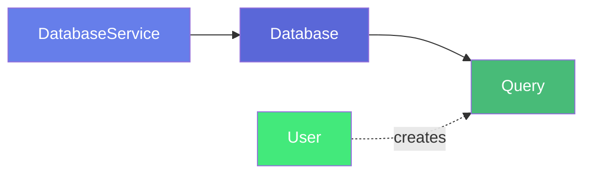

# Query

**Data asset queries and SQL query metadata**

---

## Overview

The **Query** entity captures any data asset's queries, including SQL queries, execution metadata, performance metrics, and relationships to users and data assets. It tracks query execution history, ownership, usage patterns, and lineage information to enable knowledge sharing, code reuse, and discovery of common data access patterns across the organization.

**Hierarchy**:


---

## Relationships

Query has comprehensive relationships with entities across the metadata platform:

```mermaid
graph TD
    subgraph Query Definition
        Q[Query:<br/>Monthly Sales Report]
    end

    subgraph Database Context
        DB[Database:<br/>analytics_db] -.->|contains| Q
        SVC[DatabaseService:<br/>postgres_prod] -.->|hosts| DB
    end

    subgraph Query Sources
        Q -.->|queries| T1[Table:<br/>sales.orders]
        Q -.->|queries| T2[Table:<br/>sales.customers]
        Q -.->|queries| T3[Table:<br/>sales.products]

        Q -.->|uses column| C1[Column:<br/>order_date]
        Q -.->|uses column| C2[Column:<br/>order_amount]
        Q -.->|uses column| C3[Column:<br/>customer_name]
    end

    subgraph Query Code
        Q -.->|has SQL| SQL[SQL Code:<br/>SELECT o.order_date...]
        Q -.->|parameterized| PARAM1[Parameter:<br/>start_date]
        Q -.->|parameterized| PARAM2[Parameter:<br/>end_date]
    end

    subgraph Authorship & Ownership
        Q -.->|created by| U1[User:<br/>analyst.team]
        Q -.->|owned by| O1[Team:<br/>Analytics]
        Q -.->|modified by| U2[User:<br/>data.engineer]
        Q -.->|followed by| F1[User:<br/>data.analyst]
    end

    subgraph Governance
        Q -.->|in domains| DOM[Domain:<br/>Sales]
        Q -.->|has tags| TAG1[Tag:<br/>Tier.Silver]
        Q -.->|has tags| TAG2[Tag:<br/>Reporting]
        Q -.->|has tags| TAG3[Tag:<br/>PII.Sensitive]
    end

    subgraph Execution & Usage
        Q -.->|execution history| QH1[QueryHistory:<br/>2024-01-15 09:30]
        Q -.->|execution history| QH2[QueryHistory:<br/>2024-01-16 09:30]
        Q -.->|execution history| QH3[QueryHistory:<br/>2024-01-17 09:30]

        Q -.->|usage stats| STATS[UsageStats:<br/>120 executions/month]
    end

    subgraph Related Queries
        Q -.->|similar to| RQ1[Query:<br/>Weekly Sales Report]
        Q -.->|related to| RQ2[Query:<br/>Sales by Region]
    end

    subgraph Downstream Usage
        Q -.->|used in| D1[Dashboard:<br/>Sales Dashboard]
        Q -.->|feeds| R1[Report:<br/>Monthly Report]
        Q -.->|scheduled in| P1[Pipeline:<br/>sales_report_job]
    end

    subgraph Quality & Performance
        Q -.->|performance metrics| PERF[Performance:<br/>avg 2.3s]
        Q -.->|validated by| TC[TestCase:<br/>query_results_check]
    end

    subgraph Access Control
        U3[User:<br/>sales.team] -.->|can view| Q
        U4[User:<br/>exec.team] -.->|can execute| Q
    end

    style Q fill:#48bb78,color:#fff,stroke:#38a169,stroke-width:3px
    style DB fill:#5a67d8,color:#fff
    style SVC fill:#667eea,color:#fff
    style T1 fill:#764ba2,color:#fff
    style T2 fill:#764ba2,color:#fff
    style T3 fill:#764ba2,color:#fff
    style C1 fill:#9b59b6,color:#fff
    style C2 fill:#9b59b6,color:#fff
    style C3 fill:#9b59b6,color:#fff
    style SQL fill:#34495e,color:#fff
    style PARAM1 fill:#2c3e50,color:#fff
    style PARAM2 fill:#2c3e50,color:#fff
    style U1 fill:#43e97b,color:#fff
    style O1 fill:#43e97b,color:#fff
    style U2 fill:#43e97b,color:#fff
    style DOM fill:#fa709a,color:#fff
    style TAG1 fill:#f093fb,color:#fff
    style TAG2 fill:#f093fb,color:#fff
    style TAG3 fill:#f093fb,color:#fff
    style GT1 fill:#ffd700,color:#333
    style GT2 fill:#ffd700,color:#333
    style QH1 fill:#3498db,color:#fff
    style QH2 fill:#3498db,color:#fff
    style QH3 fill:#3498db,color:#fff
    style STATS fill:#16a085,color:#fff
    style RQ1 fill:#52c41a,color:#fff
    style RQ2 fill:#52c41a,color:#fff
    style D1 fill:#4facfe,color:#fff
    style R1 fill:#ff6b6b,color:#fff
    style P1 fill:#f5576c,color:#fff
    style PERF fill:#f39c12,color:#fff
    style TC fill:#9b59b6,color:#fff
    style U3 fill:#ff6b6b,color:#fff
    style U4 fill:#ff6b6b,color:#fff
```



**Relationship Types**:

- **Solid lines (→)**: Hierarchical containment (Database contains Query)
- **Dashed lines (-.->)**: References and associations (ownership, governance, data sources, usage, lineage)

---

### Parent Entities
- **DatabaseService**: The database service hosting this query
- **Database**: The database this query belongs to

### Child Entities
- **QueryHistory**: Execution history records

### Associated Entities
- **User**: Query creator and users who have executed the query
- **Owners**: Users or teams owning this query
- **Followers**: Users following this query
- **Domains**: Business domain assignments
- **Tag**: Classification tags
- **Service**: Database service hosting this query
- **QueryUsedIn**: Entities using this query (dashboards, reports, pipelines)
- **TriggeredBy**: Entity that triggered the query (stored procedure, pipeline task)
- **UsedBy**: List of users who ran the query but don't exist in OpenMetadata

---

## Schema Specifications

View the complete Query schema in your preferred format:

=== "JSON Schema"

    **Complete JSON Schema Definition**

    ```json
    {
      "$id": "https://open-metadata.org/schema/entity/data/Query.json",
      "$schema": "http://json-schema.org/draft-07/schema#",
      "title": "Query",
      "description": "This schema defines the type to capture any data asset's queries.",
      "type": "object",
      "javaType": "org.openmetadata.schema.entity.data.Query",
      "javaInterfaces": ["org.openmetadata.schema.EntityInterface"],

      "properties": {
        "id": {
          "description": "Unique identifier of the query.",
          "$ref": "../../type/basic.json#/definitions/uuid"
        },
        "name": {
          "description": "Name of an entity to which the query belongs to",
          "$ref": "../../type/basic.json#/definitions/entityName"
        },
        "fullyQualifiedName": {
          "description": "Fully qualified name of a query.",
          "$ref": "../../type/basic.json#/definitions/fullyQualifiedEntityName"
        },
        "displayName": {
          "description": "Display Name that identifies this Query. It could be title or label.",
          "type": "string"
        },
        "description": {
          "description": "Description of a query.",
          "$ref": "../../type/basic.json#/definitions/markdown"
        },
        "version": {
          "description": "Metadata version of the entity.",
          "$ref": "../../type/entityHistory.json#/definitions/entityVersion"
        },
        "updatedAt": {
          "description": "Last update time corresponding to the new version of the entity in Unix epoch time milliseconds.",
          "$ref": "../../type/basic.json#/definitions/timestamp"
        },
        "updatedBy": {
          "description": "User who made the query.",
          "type": "string"
        },
        "impersonatedBy": {
          "description": "Bot user that performed the action on behalf of the actual user.",
          "$ref": "../../type/basic.json#/definitions/impersonatedBy"
        },
        "href": {
          "description": "Link to this Query resource.",
          "$ref": "../../type/basic.json#/definitions/href"
        },
        "changeDescription": {
          "description": "Change that lead to this version of the entity.",
          "$ref": "../../type/entityHistory.json#/definitions/changeDescription"
        },
        "incrementalChangeDescription": {
          "description": "Change that lead to this version of the entity.",
          "$ref": "../../type/entityHistory.json#/definitions/changeDescription"
        },
        "owners": {
          "description": "Owners of this Query.",
          "$ref": "../../type/entityReferenceList.json",
          "default": null
        },
        "duration": {
          "description": "How long did the query took to run in milliseconds.",
          "type": "number"
        },
        "users": {
          "description": "List of users who ran this query.",
          "type": "array",
          "items": {
            "$ref": "../../type/entityReference.json"
          },
          "default": null
        },
        "followers": {
          "description": "Followers of this Query.",
          "$ref": "../../type/entityReferenceList.json"
        },
        "votes": {
          "description": "Votes on the entity.",
          "$ref": "../../type/votes.json"
        },
        "query": {
          "description": "SQL Query definition.",
          "$ref": "../../type/basic.json#/definitions/sqlQuery"
        },
        "query_type": {
          "description": "SQL query type",
          "type": "string"
        },
        "exclude_usage": {
          "description": "Flag to check if query is to be excluded while processing usage",
          "type": "boolean"
        },
        "checksum": {
          "description": "Checksum to avoid registering duplicate queries.",
          "type": "string"
        },
        "queryDate": {
          "description": "Date on which the query ran.",
          "$ref": "../../type/basic.json#/definitions/timestamp"
        },
        "usedBy": {
          "description": "List of users who ran the query but does not exist in OpenMetadata.",
          "type": "array",
          "items": {
            "type": "string"
          },
          "uniqueItems": true
        },
        "tags": {
          "description": "Tags for this SQL query.",
          "type": "array",
          "items": {
            "$ref": "../../type/tagLabel.json"
          },
          "default": []
        },
        "queryUsedIn": {
          "description": "Entities that are using this query",
          "$ref": "../../type/entityReferenceList.json"
        },
        "triggeredBy": {
          "description": "Entity that triggered the query. E.g., a Stored Procedure or a Pipeline Task.",
          "$ref": "../../type/entityReference.json"
        },
        "processedLineage": {
          "description": "Flag if this query has already been successfully processed for lineage",
          "type": "boolean",
          "default": false
        },
        "service": {
          "description": "Link to the service this query belongs to.",
          "$ref": "../../type/entityReference.json"
        },
        "domains": {
          "description": "Domains the asset belongs to. When not set, the asset inherits the domain from the parent it belongs to.",
          "$ref": "../../type/entityReferenceList.json"
        },
        "entityStatus": {
          "description": "Status of the Query.",
          "$ref": "../../type/status.json"
        }
      },

      "required": ["id", "name", "query", "service"],
      "additionalProperties": false
    }
    ```

    **[View Full JSON Schema →](https://github.com/open-metadata/OpenMetadataStandards/blob/main/schemas/entity/data/query.json)**

=== "RDF"

    **RDF/OWL Ontology Definition**

    ```turtle
    @prefix om: <https://open-metadata.org/schema/> .
    @prefix rdfs: <http://www.w3.org/2000/01/rdf-schema#> .
    @prefix owl: <http://www.w3.org/2002/07/owl#> .
    @prefix xsd: <http://www.w3.org/2001/XMLSchema#> .

    # Query Class Definition
    om:Query a owl:Class ;
        rdfs:subClassOf om:DataAsset ;
        rdfs:label "Query" ;
        rdfs:comment "This schema defines the type to capture any data asset's queries." ;
        om:hierarchyLevel 3 .

    # Datatype Properties
    om:queryName a owl:DatatypeProperty ;
        rdfs:domain om:Query ;
        rdfs:range xsd:string ;
        rdfs:label "name" ;
        rdfs:comment "Name of an entity to which the query belongs to" .

    om:queryText a owl:DatatypeProperty ;
        rdfs:domain om:Query ;
        rdfs:range xsd:string ;
        rdfs:label "query" ;
        rdfs:comment "SQL Query definition" .

    om:queryType a owl:DatatypeProperty ;
        rdfs:domain om:Query ;
        rdfs:range xsd:string ;
        rdfs:label "query_type" ;
        rdfs:comment "SQL query type" .

    om:queryChecksum a owl:DatatypeProperty ;
        rdfs:domain om:Query ;
        rdfs:range xsd:string ;
        rdfs:label "checksum" ;
        rdfs:comment "Checksum to avoid registering duplicate queries" .

    om:queryDuration a owl:DatatypeProperty ;
        rdfs:domain om:Query ;
        rdfs:range xsd:decimal ;
        rdfs:label "duration" ;
        rdfs:comment "How long did the query took to run in milliseconds" .

    om:queryDate a owl:DatatypeProperty ;
        rdfs:domain om:Query ;
        rdfs:range xsd:dateTime ;
        rdfs:label "queryDate" ;
        rdfs:comment "Date on which the query ran" .

    om:excludeUsage a owl:DatatypeProperty ;
        rdfs:domain om:Query ;
        rdfs:range xsd:boolean ;
        rdfs:label "exclude_usage" ;
        rdfs:comment "Flag to check if query is to be excluded while processing usage" .

    om:processedLineage a owl:DatatypeProperty ;
        rdfs:domain om:Query ;
        rdfs:range xsd:boolean ;
        rdfs:label "processedLineage" ;
        rdfs:comment "Flag if this query has already been successfully processed for lineage" .

    # Object Properties
    om:belongsToService a owl:ObjectProperty ;
        rdfs:domain om:Query ;
        rdfs:range om:DatabaseService ;
        rdfs:label "service" ;
        rdfs:comment "Link to the service this query belongs to" .

    om:hasOwners a owl:ObjectProperty ;
        rdfs:domain om:Query ;
        rdfs:range om:EntityReference ;
        rdfs:label "owners" ;
        rdfs:comment "Owners of this Query" .

    om:executedByUsers a owl:ObjectProperty ;
        rdfs:domain om:Query ;
        rdfs:range om:User ;
        rdfs:label "users" ;
        rdfs:comment "List of users who ran this query" .

    om:hasFollowers a owl:ObjectProperty ;
        rdfs:domain om:Query ;
        rdfs:range om:User ;
        rdfs:label "followers" ;
        rdfs:comment "Followers of this Query" .

    om:hasVotes a owl:ObjectProperty ;
        rdfs:domain om:Query ;
        rdfs:range om:Votes ;
        rdfs:label "votes" ;
        rdfs:comment "Votes on the entity" .

    om:queryUsedIn a owl:ObjectProperty ;
        rdfs:domain om:Query ;
        rdfs:range om:EntityReference ;
        rdfs:label "queryUsedIn" ;
        rdfs:comment "Entities that are using this query" .

    om:triggeredBy a owl:ObjectProperty ;
        rdfs:domain om:Query ;
        rdfs:range om:EntityReference ;
        rdfs:label "triggeredBy" ;
        rdfs:comment "Entity that triggered the query. E.g., a Stored Procedure or a Pipeline Task" .

    om:belongsToDomains a owl:ObjectProperty ;
        rdfs:domain om:Query ;
        rdfs:range om:Domain ;
        rdfs:label "domains" ;
        rdfs:comment "Domains the asset belongs to. When not set, the asset inherits the domain from the parent it belongs to" .

    om:hasEntityStatus a owl:ObjectProperty ;
        rdfs:domain om:Query ;
        rdfs:range om:Status ;
        rdfs:label "entityStatus" ;
        rdfs:comment "Status of the Query" .

    # Example Instance
    ex:salesReportQuery a om:Query ;
        om:queryName "monthly_sales_report" ;
        om:fullyQualifiedName "postgres_prod.analytics_db.monthly_sales_report" ;
        om:displayName "Monthly Sales Report" ;
        om:queryText "SELECT order_date, SUM(order_amount) FROM orders GROUP BY order_date" ;
        om:queryType "SELECT" ;
        om:queryDuration 2345.67 ;
        om:belongsToService ex:postgresService ;
        om:executedByUsers ex:analystUser ;
        om:hasOwners ex:analyticsTeam .
    ```

    **[View Full RDF Ontology →](https://github.com/open-metadata/OpenMetadataStandards/blob/main/rdf/ontology/openmetadata.ttl)**

=== "JSON-LD"

    **JSON-LD Context and Example**

    ```json
    {
      "@context": {
        "@vocab": "https://open-metadata.org/schema/",
        "om": "https://open-metadata.org/schema/",
        "rdfs": "http://www.w3.org/2000/01/rdf-schema#",
        "xsd": "http://www.w3.org/2001/XMLSchema#",

        "Query": "om:Query",
        "name": {
          "@id": "om:queryName",
          "@type": "xsd:string"
        },
        "fullyQualifiedName": {
          "@id": "om:fullyQualifiedName",
          "@type": "xsd:string"
        },
        "displayName": {
          "@id": "om:displayName",
          "@type": "xsd:string"
        },
        "description": {
          "@id": "om:description",
          "@type": "xsd:string"
        },
        "query": {
          "@id": "om:queryText",
          "@type": "xsd:string"
        },
        "query_type": {
          "@id": "om:queryType",
          "@type": "xsd:string"
        },
        "checksum": {
          "@id": "om:queryChecksum",
          "@type": "xsd:string"
        },
        "duration": {
          "@id": "om:queryDuration",
          "@type": "xsd:decimal"
        },
        "queryDate": {
          "@id": "om:queryDate",
          "@type": "xsd:dateTime"
        },
        "exclude_usage": {
          "@id": "om:excludeUsage",
          "@type": "xsd:boolean"
        },
        "processedLineage": {
          "@id": "om:processedLineage",
          "@type": "xsd:boolean"
        },
        "service": {
          "@id": "om:belongsToService",
          "@type": "@id"
        },
        "owners": {
          "@id": "om:hasOwners",
          "@type": "@id",
          "@container": "@set"
        },
        "users": {
          "@id": "om:executedByUsers",
          "@type": "@id",
          "@container": "@set"
        },
        "followers": {
          "@id": "om:hasFollowers",
          "@type": "@id",
          "@container": "@set"
        },
        "votes": {
          "@id": "om:hasVotes",
          "@type": "@id"
        },
        "usedBy": {
          "@id": "om:usedBy",
          "@type": "xsd:string",
          "@container": "@set"
        },
        "queryUsedIn": {
          "@id": "om:queryUsedIn",
          "@type": "@id",
          "@container": "@set"
        },
        "triggeredBy": {
          "@id": "om:triggeredBy",
          "@type": "@id"
        },
        "domains": {
          "@id": "om:belongsToDomains",
          "@type": "@id",
          "@container": "@set"
        },
        "entityStatus": {
          "@id": "om:hasEntityStatus",
          "@type": "@id"
        }
      }
    }
    ```

    **Example JSON-LD Instance**:

    ```json
    {
      "@context": "https://open-metadata.org/context/query.jsonld",
      "@type": "Query",
      "@id": "https://example.com/queries/monthly_sales_report",

      "name": "monthly_sales_report",
      "fullyQualifiedName": "postgres_prod.analytics_db.monthly_sales_report",
      "displayName": "Monthly Sales Report",
      "description": "# Monthly Sales Report\n\nGenerates monthly sales summary by product category.",
      "query": "SELECT\n  DATE_TRUNC('month', order_date) AS month,\n  product_category,\n  SUM(order_amount) AS total_revenue,\n  COUNT(DISTINCT customer_id) AS customer_count\nFROM orders\nWHERE order_date >= :start_date\n  AND order_date < :end_date\nGROUP BY 1, 2\nORDER BY 1 DESC, 3 DESC",
      "query_type": "SELECT",
      "checksum": "md5:a1b2c3d4e5f6g7h8i9j0k1l2m3n4o5p6",
      "duration": 2345.67,
      "queryDate": "2024-01-15T09:30:00Z",
      "exclude_usage": false,
      "processedLineage": true,

      "service": {
        "@id": "https://example.com/services/postgres_prod",
        "@type": "DatabaseService",
        "name": "postgres_prod"
      },

      "owners": [
        {
          "@id": "https://example.com/teams/analytics",
          "@type": "Team",
          "name": "analytics"
        }
      ],

      "users": [
        {
          "@id": "https://example.com/users/analyst_team",
          "@type": "User",
          "name": "analyst.team"
        }
      ],

      "followers": [
        {
          "@id": "https://example.com/users/data_analyst",
          "@type": "User",
          "name": "data.analyst"
        }
      ],

      "votes": {
        "@type": "Votes",
        "upVotes": 15,
        "downVotes": 2
      },

      "queryUsedIn": [
        {
          "@id": "https://example.com/dashboards/sales_dashboard",
          "@type": "Dashboard",
          "name": "sales_dashboard"
        }
      ],

      "domains": [
        {
          "@id": "https://example.com/domains/sales",
          "@type": "Domain",
          "name": "Sales"
        }
      ]
    }
    ```

    **[View Full JSON-LD Context →](https://github.com/open-metadata/OpenMetadataStandards/blob/main/rdf/contexts/query.jsonld)**

---

## Use Cases

- Catalog frequently-used SQL queries across the organization
- Enable discovery and reuse of common data extraction patterns
- Document query purpose and usage guidelines
- Track query authorship and ownership
- Capture lineage from source tables to queries to reports
- Monitor query performance and execution frequency
- Share parameterized query templates across teams
- Apply governance tags to queries accessing sensitive data
- Track query changes and version history
- Support query optimization through usage analytics

---

## JSON Schema Specification

### Core Properties

#### `id` (uuid)
**Type**: `string` (UUID format)
**Required**: Yes (system-generated)
**Description**: Unique identifier for this query instance

```json
{
  "id": "6f7a8b9c-0d1e-2f3a-4b5c-6d7e8f9a0b1c"
}
```

---

#### `name` (entityName)
**Type**: `string`
**Required**: Yes
**Pattern**: `^[^.]*$` (no dots allowed)
**Min Length**: 1
**Max Length**: 256
**Description**: Name of an entity to which the query belongs to

```json
{
  "name": "monthly_sales_report"
}
```

---

#### `fullyQualifiedName` (fullyQualifiedEntityName)
**Type**: `string`
**Required**: Yes (system-generated)
**Pattern**: `^((?!::).)*$`
**Description**: Fully qualified name of a query

```json
{
  "fullyQualifiedName": "postgres_prod.analytics_db.monthly_sales_report"
}
```

---

#### `displayName`
**Type**: `string`
**Required**: No
**Description**: Display Name that identifies this Query. It could be title or label

```json
{
  "displayName": "Monthly Sales Report"
}
```

---

#### `description` (markdown)
**Type**: `string` (Markdown format)
**Required**: No
**Description**: Description of a query

```json
{
  "description": "# Monthly Sales Report\n\nGenerates monthly sales summary by product category.\n\n## Parameters\n- `start_date`: Report start date (DATE)\n- `end_date`: Report end date (DATE)\n\n## Output Columns\n- `month`: Month of sale\n- `product_category`: Product category name\n- `total_revenue`: Sum of order amounts\n- `customer_count`: Distinct customer count\n\n## Usage\nRun at the beginning of each month for the previous month's data."
}
```

---

### Query Definition

#### `query` (sqlQuery)
**Type**: `string`
**Required**: Yes
**Description**: SQL Query definition

```json
{
  "query": "SELECT\n  DATE_TRUNC('month', order_date) AS month,\n  product_category,\n  SUM(order_amount) AS total_revenue,\n  COUNT(DISTINCT customer_id) AS customer_count\nFROM orders\nWHERE order_date >= :start_date\n  AND order_date < :end_date\nGROUP BY 1, 2\nORDER BY 1 DESC, 3 DESC"
}
```

---

#### `query_type` (string)
**Type**: `string`
**Required**: No
**Description**: SQL query type

```json
{
  "query_type": "SELECT"
}
```

---

#### `checksum` (string)
**Type**: `string`
**Required**: No (system-generated)
**Description**: Checksum to avoid registering duplicate queries

```json
{
  "checksum": "md5:a1b2c3d4e5f6g7h8i9j0k1l2m3n4o5p6"
}
```

---

#### `exclude_usage` (boolean)
**Type**: `boolean`
**Required**: No
**Description**: Flag to check if query is to be excluded while processing usage

```json
{
  "exclude_usage": false
}
```

---

### Performance Properties

#### `duration` (number)
**Type**: `number`
**Required**: No (system-generated)
**Description**: How long did the query took to run in milliseconds

```json
{
  "duration": 2345.67
}
```

---

#### `queryDate` (timestamp)
**Type**: `number` (Unix epoch time milliseconds)
**Required**: No (system-generated)
**Description**: Date on which the query ran

```json
{
  "queryDate": "2024-01-15T09:30:00Z"
}
```

---

### Data Source Properties

#### `service` (EntityReference)
**Type**: `object`
**Required**: Yes
**Description**: Link to the service this query belongs to

```json
{
  "service": {
    "id": "service-uuid",
    "type": "databaseService",
    "name": "postgres_prod",
    "fullyQualifiedName": "postgres_prod"
  }
}
```

---

### Usage Properties

#### `users[]` (User[])
**Type**: `array` of User entity references
**Required**: No (system-generated)
**Default**: `null`
**Description**: List of users who ran this query

```json
{
  "users": [
    {
      "id": "user-uuid",
      "type": "user",
      "name": "analyst.team",
      "displayName": "Analytics Team Member"
    },
    {
      "id": "user-uuid-2",
      "type": "user",
      "name": "data.engineer",
      "displayName": "Data Engineer"
    }
  ]
}
```

---

#### `usedBy[]` (string[])
**Type**: `array` of strings
**Required**: No
**Description**: List of users who ran the query but does not exist in OpenMetadata

```json
{
  "usedBy": ["external_user_1", "external_user_2"]
}
```

---

#### `queryUsedIn` (EntityReferenceList)
**Type**: `array` of entity references
**Required**: No
**Description**: Entities that are using this query

```json
{
  "queryUsedIn": [
    {
      "id": "dashboard-uuid",
      "type": "dashboard",
      "name": "sales_dashboard",
      "fullyQualifiedName": "tableau_prod.sales_dashboard"
    },
    {
      "id": "pipeline-uuid",
      "type": "pipeline",
      "name": "sales_etl_pipeline",
      "fullyQualifiedName": "airflow_prod.sales_etl_pipeline"
    }
  ]
}
```

---

#### `triggeredBy` (EntityReference)
**Type**: `object`
**Required**: No
**Description**: Entity that triggered the query. E.g., a Stored Procedure or a Pipeline Task

```json
{
  "triggeredBy": {
    "id": "procedure-uuid",
    "type": "storedProcedure",
    "name": "generate_sales_report",
    "fullyQualifiedName": "postgres_prod.analytics_db.generate_sales_report"
  }
}
```

---

#### `processedLineage` (boolean)
**Type**: `boolean`
**Required**: No
**Default**: `false`
**Description**: Flag if this query has already been successfully processed for lineage

```json
{
  "processedLineage": true
}
```

---

### Governance Properties

#### `owners` (EntityReferenceList)
**Type**: `array` of entity references
**Required**: No
**Default**: `null`
**Description**: Owners of this Query

```json
{
  "owners": [
    {
      "id": "owner-uuid",
      "type": "team",
      "name": "analytics-team",
      "displayName": "Analytics Team"
    }
  ]
}
```

---

#### `followers` (EntityReferenceList)
**Type**: `array` of entity references
**Required**: No
**Description**: Followers of this Query

```json
{
  "followers": [
    {
      "id": "user-uuid",
      "type": "user",
      "name": "data.analyst",
      "displayName": "Data Analyst"
    }
  ]
}
```

---

#### `domains` (EntityReferenceList)
**Type**: `array` of entity references
**Required**: No
**Description**: Domains the asset belongs to. When not set, the asset inherits the domain from the parent it belongs to

```json
{
  "domains": [
    {
      "id": "domain-uuid",
      "type": "domain",
      "name": "Sales",
      "fullyQualifiedName": "Sales"
    }
  ]
}
```

---

#### `tags[]` (TagLabel[])
**Type**: `array`
**Required**: No
**Default**: `[]`
**Description**: Tags for this SQL query

```json
{
  "tags": [
    {
      "tagFQN": "Tier.Silver",
      "source": "Classification",
      "labelType": "Manual",
      "state": "Confirmed"
    },
    {
      "tagFQN": "PII.Sensitive",
      "description": "Query accesses customer PII",
      "source": "Classification",
      "labelType": "Automated",
      "state": "Confirmed"
    }
  ]
}
```

---

#### `votes` (Votes)
**Type**: `object`
**Required**: No (system-generated)
**Description**: Votes on the entity

```json
{
  "votes": {
    "upVotes": 15,
    "downVotes": 2,
    "upVoters": [
      {
        "id": "user-uuid-1",
        "type": "user",
        "name": "user1"
      }
    ],
    "downVoters": [
      {
        "id": "user-uuid-2",
        "type": "user",
        "name": "user2"
      }
    ]
  }
}
```

---

#### `entityStatus` (Status)
**Type**: `object`
**Required**: No
**Description**: Status of the Query

```json
{
  "entityStatus": {
    "status": "Active"
  }
}
```

---

## Complete Example

```json
{
  "id": "6f7a8b9c-0d1e-2f3a-4b5c-6d7e8f9a0b1c",
  "name": "monthly_sales_report",
  "fullyQualifiedName": "postgres_prod.analytics_db.monthly_sales_report",
  "displayName": "Monthly Sales Report",
  "description": "# Monthly Sales Report\n\nGenerates monthly sales summary by product category.",
  "version": 1.3,
  "updatedAt": 1704240000000,
  "updatedBy": "analyst.team",
  "href": "https://example.com/api/v1/queries/6f7a8b9c-0d1e-2f3a-4b5c-6d7e8f9a0b1c",
  "owners": [
    {
      "id": "owner-uuid",
      "type": "team",
      "name": "analytics-team"
    }
  ],
  "duration": 2345.67,
  "users": [
    {
      "id": "user-uuid",
      "type": "user",
      "name": "analyst.team"
    }
  ],
  "followers": [
    {
      "id": "follower-uuid",
      "type": "user",
      "name": "data.analyst"
    }
  ],
  "votes": {
    "upVotes": 15,
    "downVotes": 2
  },
  "query": "SELECT\n  DATE_TRUNC('month', order_date) AS month,\n  product_category,\n  SUM(order_amount) AS total_revenue,\n  COUNT(DISTINCT customer_id) AS customer_count\nFROM orders\nWHERE order_date >= :start_date\n  AND order_date < :end_date\nGROUP BY 1, 2\nORDER BY 1 DESC, 3 DESC",
  "query_type": "SELECT",
  "exclude_usage": false,
  "checksum": "md5:a1b2c3d4e5f6g7h8i9j0k1l2m3n4o5p6",
  "queryDate": 1705315800000,
  "usedBy": ["external_user_1", "external_user_2"],
  "tags": [
    {"tagFQN": "Tier.Silver"},
    {"tagFQN": "Reporting"}
  ],
  "queryUsedIn": [
    {
      "id": "dashboard-uuid",
      "type": "dashboard",
      "name": "sales_dashboard"
    }
  ],
  "triggeredBy": {
    "id": "procedure-uuid",
    "type": "storedProcedure",
    "name": "generate_sales_report"
  },
  "processedLineage": true,
  "service": {
    "id": "service-uuid",
    "type": "databaseService",
    "name": "postgres_prod"
  },
  "domains": [
    {
      "id": "domain-uuid",
      "type": "domain",
      "name": "Sales"
    }
  ],
  "entityStatus": {
    "status": "Active"
  }
}
```

---

## Examples by Purpose

### Reporting Query

```json
{
  "name": "weekly_revenue_by_region",
  "displayName": "Weekly Revenue by Region",
  "description": "Weekly revenue breakdown by sales region",
  "query": "SELECT\n  region,\n  DATE_TRUNC('week', sale_date) AS week,\n  SUM(revenue) AS total_revenue\nFROM sales\nWHERE sale_date >= CURRENT_DATE - INTERVAL '90 days'\nGROUP BY 1, 2\nORDER BY 2 DESC, 3 DESC",
  "query_type": "SELECT",
  "service": {
    "id": "service-uuid",
    "type": "databaseService",
    "name": "postgres_prod"
  },
  "tags": [
    {"tagFQN": "Reporting"}
  ]
}
```

---

### Data Extraction Query

```json
{
  "name": "customer_export",
  "displayName": "Customer Data Export",
  "description": "Export customer data for CRM integration",
  "query": "SELECT\n  customer_id,\n  email,\n  first_name,\n  last_name,\n  created_at,\n  last_purchase_date\nFROM customers\nWHERE created_at >= CURRENT_DATE - INTERVAL '1 day'",
  "query_type": "SELECT",
  "service": {
    "id": "service-uuid",
    "type": "databaseService",
    "name": "postgres_prod"
  },
  "tags": [
    {"tagFQN": "PII.Sensitive"},
    {"tagFQN": "ETL"}
  ],
  "triggeredBy": {
    "type": "pipeline",
    "name": "crm_sync_pipeline"
  }
}
```

---

### Analysis Query

```json
{
  "name": "customer_cohort_retention",
  "displayName": "Customer Cohort Retention Analysis",
  "description": "Analyze customer retention by cohort",
  "query": "WITH cohorts AS (\n  SELECT\n    customer_id,\n    DATE_TRUNC('month', first_purchase_date) AS cohort_month\n  FROM customers\n)\nSELECT\n  cohort_month,\n  COUNT(DISTINCT customer_id) AS cohort_size,\n  COUNT(DISTINCT CASE WHEN months_since_first = 1 THEN customer_id END) AS month_1_retained\nFROM cohorts\nGROUP BY 1",
  "query_type": "SELECT",
  "service": {
    "id": "service-uuid",
    "type": "databaseService",
    "name": "postgres_prod"
  },
  "queryUsedIn": [
    {
      "type": "dashboard",
      "name": "retention_analysis"
    }
  ]
}
```

---

## Custom Properties

This entity supports custom properties through the `extension` field.
Common custom properties include:

- **Data Classification**: Sensitivity level
- **Cost Center**: Billing allocation
- **Retention Period**: Data retention requirements
- **Application Owner**: Owning application/team

See [Custom Properties](../../metadata-specifications/custom-properties.md)
for details on defining and using custom properties.

---

## API Operations

### Create Query

```http
POST /api/v1/queries
Content-Type: application/json

{
  "name": "monthly_sales_report",
  "displayName": "Monthly Sales Report",
  "description": "Generates monthly sales summary",
  "query": "SELECT DATE_TRUNC('month', order_date) AS month, SUM(order_amount) FROM orders GROUP BY 1",
  "query_type": "SELECT",
  "service": {
    "id": "service-uuid",
    "type": "databaseService"
  }
}
```

### Get Query

```http
GET /api/v1/queries/name/postgres_prod.analytics_db.monthly_sales_report?fields=owners,users,followers,queryUsedIn,triggeredBy,domains
```

### Update Query

```http
PATCH /api/v1/queries/{id}
Content-Type: application/json-patch+json

[
  {
    "op": "replace",
    "path": "/query",
    "value": "SELECT DATE_TRUNC('month', order_date) AS month, SUM(order_amount) AS revenue FROM orders GROUP BY 1"
  },
  {
    "op": "add",
    "path": "/tags/-",
    "value": {"tagFQN": "Tier.Gold"}
  }
]
```

### Get Query Lineage

```http
GET /api/v1/queries/{id}/lineage?upstreamDepth=3&downstreamDepth=2
```

### Vote on Query

```http
PUT /api/v1/queries/{id}/vote
Content-Type: application/json

{
  "vote": "votedUp"
}
```

---

## Related Documentation

- **[Database Service](database-service.md)** - Service configuration
- **[Database](database.md)** - Database entity specification
- **[Table](table.md)** - Table entity specification
- **[Dashboard](../dashboards/dashboard.md)** - Dashboard entity specification
- **[Lineage](../../lineage/overview.md)** - Data lineage tracking
- **[Governance](../../governance/overview.md)** - Governance policies
