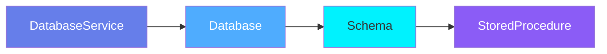
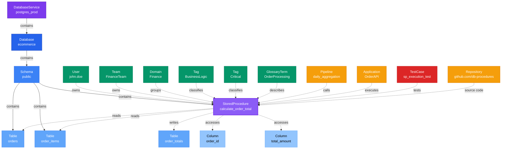

# StoredProcedure

**Stored procedures - executable database logic and transformations**

---

## Overview

The **StoredProcedure** entity represents stored procedures, functions, and other executable database objects that encapsulate business logic, data transformations, and complex queries within the database.

**Hierarchy**:


---

## Relationships

### Parent Entities
- **DatabaseSchema**: The schema containing this stored procedure
- **Database**: The database containing this stored procedure
- **DatabaseService**: The service hosting the database

### Dependencies
- **Table**: Tables read or modified by the procedure
- **Column**: Specific columns accessed

### Associated Entities
- **Owner**: User or team owning this stored procedure
- **Domain**: Business domain assignment
- **Tag**: Classification tags

### Relationship Diagram



---

## Schema Specifications

View the complete StoredProcedure schema in your preferred format:

=== "JSON Schema"

    **Complete JSON Schema Definition**

    ```json
    {
      "$id": "https://open-metadata.org/schema/entity/data/storedProcedure.json",
      "$schema": "http://json-schema.org/draft-07/schema#",
      "title": "StoredProcedure",
      "$comment": "@om-entity-type",
      "description": "A `StoredProcedure` entity that contains the set of code statements with an assigned name and is defined in a `Database Schema`.",
      "type": "object",
      "javaType": "org.openmetadata.schema.entity.data.StoredProcedure",
      "javaInterfaces": [
        "org.openmetadata.schema.EntityInterface"
      ],

      "definitions": {
        "storedProcedureType": {
          "javaType": "org.openmetadata.schema.type.StoredProcedureType",
          "description": "This schema defines the type of the type of Procedures",
          "type": "string",
          "default": "StoredProcedure",
          "enum": [
            "StoredProcedure",
            "UDF",
            "StoredPackage",
            "Function"
          ]
        },
        "storedProcedureCode": {
          "properties": {
            "language": {
              "javaType": "org.openmetadata.schema.type.StoredProcedureLanguage",
              "description": "This schema defines the type of the language used for Stored Procedure's Code.",
              "type": "string",
              "enum": [
                "SQL",
                "Java",
                "JavaScript",
                "Python",
                "External"
              ]
            },
            "code": {
              "javaType": "org.openmetadata.schema.type.StoredProcedureCode",
              "description": "This schema defines the type of the language used for Stored Procedure's Code.",
              "type": "string"
            }
          }
        }
      },

      "properties": {
        "id": {
          "description": "Unique identifier of the StoredProcedure.",
          "$ref": "../../type/basic.json#/definitions/uuid"
        },
        "name": {
          "description": "Name of Stored Procedure.",
          "$ref": "../../type/basic.json#/definitions/entityName"
        },
        "fullyQualifiedName": {
          "description": "Fully qualified name of a Stored Procedure.",
          "$ref": "../../type/basic.json#/definitions/fullyQualifiedEntityName"
        },
        "displayName": {
          "description": "Display Name that identifies this Stored Procedure.",
          "type": "string"
        },
        "description": {
          "description": "Description of a Stored Procedure.",
          "$ref": "../../type/basic.json#/definitions/markdown"
        },
        "storedProcedureCode": {
          "description": "Stored Procedure Code.",
          "$ref": "#/definitions/storedProcedureCode"
        },
        "version": {
          "description": "Metadata version of the Stored Procedure.",
          "$ref": "../../type/entityHistory.json#/definitions/entityVersion"
        },
        "dataProducts": {
          "description": "List of data products this entity is part of.",
          "$ref": "../../type/entityReferenceList.json"
        },
        "updatedAt": {
          "description": "Last update time corresponding to the new version of the entity in Unix epoch time milliseconds.",
          "$ref": "../../type/basic.json#/definitions/timestamp"
        },
        "storedProcedureType": {
          "description": "Type of the Stored Procedure.",
          "$ref": "#/definitions/storedProcedureType",
          "default": "StoredProcedure"
        },
        "updatedBy": {
          "description": "User who made the query.",
          "type": "string"
        },
        "impersonatedBy": {
          "description": "Bot user that performed the action on behalf of the actual user.",
          "$ref": "../../type/basic.json#/definitions/impersonatedBy"
        },
        "href": {
          "description": "Link to this Query resource.",
          "$ref": "../../type/basic.json#/definitions/href"
        },
        "changeDescription": {
          "description": "Change that lead to this version of the entity.",
          "$ref": "../../type/entityHistory.json#/definitions/changeDescription"
        },
        "incrementalChangeDescription": {
          "description": "Change that lead to this version of the entity.",
          "$ref": "../../type/entityHistory.json#/definitions/changeDescription"
        },
        "databaseSchema": {
          "description": "Reference to Database Schema that contains this stored procedure.",
          "$ref": "../../type/entityReference.json"
        },
        "database": {
          "description": "Reference to Database that contains this stored procedure.",
          "$ref": "../../type/entityReference.json"
        },
        "service": {
          "description": "Link to Database service this table is hosted in.",
          "$ref": "../../type/entityReference.json"
        },
        "serviceType": {
          "description": "Service type this table is hosted in.",
          "$ref": "../services/databaseService.json#/definitions/databaseServiceType"
        },
        "deleted": {
          "description": "When `true` indicates the entity has been soft deleted.",
          "type": "boolean",
          "default": false
        },
        "owners": {
          "description": "Owners of this Stored Procedure.",
          "$ref": "../../type/entityReferenceList.json",
          "default": null
        },
        "followers": {
          "description": "Followers of this Stored Procedure.",
          "$ref": "../../type/entityReferenceList.json"
        },
        "votes": {
          "description": "Votes on the entity.",
          "$ref": "../../type/votes.json"
        },
        "code": {
          "description": "SQL Query definition.",
          "$ref": "../../type/basic.json#/definitions/sqlQuery"
        },
        "tags": {
          "description": "Tags for this SQL query.",
          "type": "array",
          "items": {
            "$ref": "../../type/tagLabel.json"
          },
          "default": []
        },
        "extension": {
          "description": "Entity extension data with custom attributes added to the entity.",
          "$ref": "../../type/basic.json#/definitions/entityExtension"
        },
        "sourceUrl": {
          "description": "Source URL of database schema.",
          "$ref": "../../type/basic.json#/definitions/sourceUrl"
        },
        "domains": {
          "description": "Domains the Stored Procedure belongs to. When not set, the Stored Procedure inherits the domain from the database schemna it belongs to.",
          "$ref": "../../type/entityReferenceList.json"
        },
        "lifeCycle": {
          "description": "Life Cycle properties of the entity",
          "$ref": "../../type/lifeCycle.json"
        },
        "certification": {
          "$ref": "../../type/assetCertification.json"
        },
        "sourceHash": {
          "description": "Source hash of the entity",
          "type": "string",
          "minLength": 1,
          "maxLength": 32
        },
        "processedLineage": {
          "description": "Processed lineage for the stored procedure",
          "type": "boolean",
          "default": false
        },
        "entityStatus": {
          "description": "Status of the StoredProcedure.",
          "$ref": "../../type/status.json"
        }
      },

      "required": ["id", "name", "storedProcedureCode"]
    }
    ```

    **[View Full JSON Schema →](https://github.com/open-metadata/OpenMetadataStandards/blob/main/schemas/entity/data/storedProcedure.json)**

=== "RDF"

    **RDF/OWL Ontology Definition**

    ```turtle
    @prefix om: <https://open-metadata.org/schema/> .
    @prefix rdfs: <http://www.w3.org/2000/01/rdf-schema#> .
    @prefix owl: <http://www.w3.org/2001/XMLSchema#> .
    @prefix xsd: <http://www.w3.org/2001/XMLSchema#> .

    # StoredProcedure Class Definition
    om:StoredProcedure a owl:Class ;
        rdfs:subClassOf om:DataAsset ;
        rdfs:label "StoredProcedure" ;
        rdfs:comment "Executable database logic including procedures, functions, and routines" ;
        om:hierarchyLevel 4 .

    # Properties
    om:storedProcedureName a owl:DatatypeProperty ;
        rdfs:domain om:StoredProcedure ;
        rdfs:range xsd:string ;
        rdfs:label "name" ;
        rdfs:comment "Name of the stored procedure" .

    om:fullyQualifiedName a owl:DatatypeProperty ;
        rdfs:domain om:StoredProcedure ;
        rdfs:range xsd:string ;
        rdfs:label "fullyQualifiedName" ;
        rdfs:comment "Complete hierarchical name: service.database.schema.storedProcedure" .

    om:storedProcedureType a owl:DatatypeProperty ;
        rdfs:domain om:StoredProcedure ;
        rdfs:range om:StoredProcedureType ;
        rdfs:label "storedProcedureType" ;
        rdfs:comment "Type: StoredProcedure, UDF, StoredPackage, Function" .

    om:storedProcedureCode a owl:ObjectProperty ;
        rdfs:domain om:StoredProcedure ;
        rdfs:range om:StoredProcedureCodeObject ;
        rdfs:label "storedProcedureCode" ;
        rdfs:comment "Stored procedure code with language and code properties" .

    om:storedProcedureLanguage a owl:DatatypeProperty ;
        rdfs:domain om:StoredProcedureCodeObject ;
        rdfs:range om:StoredProcedureLanguage ;
        rdfs:label "language" ;
        rdfs:comment "Programming language: SQL, Java, JavaScript, Python, External" .

    om:code a owl:DatatypeProperty ;
        rdfs:domain om:StoredProcedureCodeObject ;
        rdfs:range xsd:string ;
        rdfs:label "code" ;
        rdfs:comment "The actual code content" .

    om:hasFollowers a owl:ObjectProperty ;
        rdfs:domain om:StoredProcedure ;
        rdfs:range om:EntityReferenceList ;
        rdfs:label "followers" ;
        rdfs:comment "Followers of this Stored Procedure" .

    om:hasVotes a owl:ObjectProperty ;
        rdfs:domain om:StoredProcedure ;
        rdfs:range om:Votes ;
        rdfs:label "votes" ;
        rdfs:comment "Votes on the entity" .

    om:hasLifeCycle a owl:ObjectProperty ;
        rdfs:domain om:StoredProcedure ;
        rdfs:range om:LifeCycle ;
        rdfs:label "lifeCycle" ;
        rdfs:comment "Life Cycle properties of the entity" .

    om:hasCertification a owl:ObjectProperty ;
        rdfs:domain om:StoredProcedure ;
        rdfs:range om:AssetCertification ;
        rdfs:label "certification" ;
        rdfs:comment "Certification of the entity" .

    om:processedLineage a owl:DatatypeProperty ;
        rdfs:domain om:StoredProcedure ;
        rdfs:range xsd:boolean ;
        rdfs:label "processedLineage" ;
        rdfs:comment "Processed lineage for the stored procedure" .

    om:entityStatus a owl:ObjectProperty ;
        rdfs:domain om:StoredProcedure ;
        rdfs:range om:Status ;
        rdfs:label "entityStatus" ;
        rdfs:comment "Status of the StoredProcedure" .

    om:belongsToSchema a owl:ObjectProperty ;
        rdfs:domain om:StoredProcedure ;
        rdfs:range om:DatabaseSchema ;
        rdfs:label "belongsToSchema" ;
        rdfs:comment "Parent database schema" .

    om:ownedBy a owl:ObjectProperty ;
        rdfs:domain om:StoredProcedure ;
        rdfs:range om:EntityReferenceList ;
        rdfs:label "owners" ;
        rdfs:comment "Owners of this Stored Procedure" .

    om:inDomains a owl:ObjectProperty ;
        rdfs:domain om:StoredProcedure ;
        rdfs:range om:EntityReferenceList ;
        rdfs:label "domains" ;
        rdfs:comment "Domains the Stored Procedure belongs to" .

    om:hasTag a owl:ObjectProperty ;
        rdfs:domain om:StoredProcedure ;
        rdfs:range om:Tag ;
        rdfs:label "hasTag" ;
        rdfs:comment "Classification tags applied to stored procedure" .

    # StoredProcedureType Enumeration
    om:StoredProcedureType a owl:Class ;
        owl:oneOf (
            om:StoredProcedureType_StoredProcedure
            om:StoredProcedureType_UDF
            om:StoredProcedureType_StoredPackage
            om:StoredProcedureType_Function
        ) .

    # StoredProcedureLanguage Enumeration
    om:StoredProcedureLanguage a owl:Class ;
        owl:oneOf (
            om:StoredProcedureLanguage_SQL
            om:StoredProcedureLanguage_Java
            om:StoredProcedureLanguage_JavaScript
            om:StoredProcedureLanguage_Python
            om:StoredProcedureLanguage_External
        ) .

    # Example Instance
    ex:calculateOrderTotal a om:StoredProcedure ;
        om:storedProcedureName "calculate_order_total" ;
        om:fullyQualifiedName "postgres_prod.ecommerce.public.calculate_order_total" ;
        om:storedProcedureType om:StoredProcedureType_Function ;
        om:storedProcedureCode [
            om:storedProcedureLanguage om:StoredProcedureLanguage_SQL ;
            om:code "CREATE OR REPLACE FUNCTION..."
        ] ;
        om:belongsToSchema ex:publicSchema ;
        om:ownedBy ex:ownersReference ;
        om:inDomains ex:domainsReference ;
        om:hasTag ex:tierGold ;
        om:hasFollowers ex:followersReference ;
        om:processedLineage false .
    ```

    **[View Full RDF Ontology →](https://github.com/open-metadata/OpenMetadataStandards/blob/main/rdf/ontology/openmetadata.ttl)**

=== "JSON-LD"

    **JSON-LD Context and Example**

    ```json
    {
      "@context": {
        "@vocab": "https://open-metadata.org/schema/",
        "om": "https://open-metadata.org/schema/",
        "rdfs": "http://www.w3.org/2000/01/rdf-schema#",
        "xsd": "http://www.w3.org/2001/XMLSchema#",

        "StoredProcedure": "om:StoredProcedure",
        "name": {
          "@id": "om:storedProcedureName",
          "@type": "xsd:string"
        },
        "fullyQualifiedName": {
          "@id": "om:fullyQualifiedName",
          "@type": "xsd:string"
        },
        "displayName": {
          "@id": "om:displayName",
          "@type": "xsd:string"
        },
        "description": {
          "@id": "om:description",
          "@type": "xsd:string"
        },
        "storedProcedureType": {
          "@id": "om:storedProcedureType",
          "@type": "@vocab"
        },
        "storedProcedureCode": {
          "@id": "om:storedProcedureCode",
          "@type": "@id"
        },
        "language": {
          "@id": "om:storedProcedureLanguage",
          "@type": "@vocab"
        },
        "code": {
          "@id": "om:code",
          "@type": "xsd:string"
        },
        "databaseSchema": {
          "@id": "om:belongsToSchema",
          "@type": "@id"
        },
        "database": {
          "@id": "om:belongsToDatabase",
          "@type": "@id"
        },
        "service": {
          "@id": "om:belongsToService",
          "@type": "@id"
        },
        "owners": {
          "@id": "om:ownedBy",
          "@type": "@id"
        },
        "domains": {
          "@id": "om:inDomains",
          "@type": "@id"
        },
        "followers": {
          "@id": "om:hasFollowers",
          "@type": "@id"
        },
        "votes": {
          "@id": "om:hasVotes",
          "@type": "@id"
        },
        "lifeCycle": {
          "@id": "om:hasLifeCycle",
          "@type": "@id"
        },
        "certification": {
          "@id": "om:hasCertification",
          "@type": "@id"
        },
        "processedLineage": {
          "@id": "om:processedLineage",
          "@type": "xsd:boolean"
        },
        "entityStatus": {
          "@id": "om:entityStatus",
          "@type": "@id"
        },
        "tags": {
          "@id": "om:hasTag",
          "@type": "@id",
          "@container": "@set"
        }
      }
    }
    ```

    **Example JSON-LD Instance**:

    ```json
    {
      "@context": "https://open-metadata.org/context/storedProcedure.jsonld",
      "@type": "StoredProcedure",
      "@id": "https://example.com/data/procedures/calculate_order_total",

      "name": "calculate_order_total",
      "fullyQualifiedName": "postgres_prod.ecommerce.public.calculate_order_total",
      "displayName": "Calculate Order Total",
      "description": "Calculates the total amount for an order including tax and shipping",
      "storedProcedureType": "Function",

      "storedProcedureCode": {
        "language": "SQL",
        "code": "CREATE OR REPLACE FUNCTION calculate_order_total(p_order_id BIGINT)\nRETURNS NUMERIC AS $$\nDECLARE\n    v_total NUMERIC;\nBEGIN\n    SELECT SUM(quantity * price) + tax + shipping\n    INTO v_total\n    FROM order_items\n    WHERE order_id = p_order_id;\n    \n    RETURN v_total;\nEND;\n$$ LANGUAGE plpgsql;"
      },

      "databaseSchema": {
        "@id": "https://example.com/data/schemas/public",
        "@type": "DatabaseSchema",
        "name": "public"
      },

      "database": {
        "@id": "https://example.com/data/databases/ecommerce",
        "@type": "Database",
        "name": "ecommerce"
      },

      "service": {
        "@id": "https://example.com/services/postgres_prod",
        "@type": "DatabaseService",
        "name": "postgres_prod"
      },

      "owners": [
        {
          "@id": "https://example.com/users/john.smith",
          "@type": "User",
          "name": "john.smith",
          "displayName": "John Smith"
        }
      ],

      "domains": [
        {
          "@id": "https://example.com/domains/sales",
          "@type": "Domain",
          "name": "Sales"
        }
      ],

      "followers": [],
      "processedLineage": false,

      "tags": [
        {
          "@id": "https://open-metadata.org/tags/BusinessLogic/Critical",
          "tagFQN": "BusinessLogic.Critical"
        }
      ]
    }
    ```

    **[View Full JSON-LD Context →](https://github.com/open-metadata/OpenMetadataStandards/blob/main/rdf/contexts/storedProcedure.jsonld)**

---

## Use Cases

- Document business logic encapsulated in database procedures
- Catalog database functions and their parameters
- Track dependencies on tables and views used by procedures
- Understand data transformations performed by stored code
- Version control for database logic changes
- Apply governance tags to sensitive business logic
- Document trigger behavior and event handlers
- Create lineage from procedures to tables they modify

---

## JSON Schema Specification

### Core Properties

#### `id` (uuid)
**Type**: `string` (UUID format)
**Required**: Yes (system-generated)
**Description**: Unique identifier for this stored procedure instance

```json
{
  "id": "f6a7b8c9-d0e1-4f2a-3b4c-5d6e7f8a9b0c"
}
```

---

#### `name` (entityName)
**Type**: `string`
**Required**: Yes
**Pattern**: `^[^.]*$` (no dots allowed)
**Min Length**: 1
**Max Length**: 256
**Description**: Name of the stored procedure

```json
{
  "name": "calculate_order_total"
}
```

---

#### `fullyQualifiedName` (fullyQualifiedEntityName)
**Type**: `string`
**Required**: Yes (system-generated)
**Pattern**: `^((?!::).)*$`
**Description**: Fully qualified name in the format `service.database.schema.storedProcedure`

```json
{
  "fullyQualifiedName": "postgres_prod.ecommerce.public.calculate_order_total"
}
```

---

#### `displayName`
**Type**: `string`
**Required**: No
**Description**: Human-readable display name

```json
{
  "displayName": "Calculate Order Total"
}
```

---

#### `description` (markdown)
**Type**: `string` (Markdown format)
**Required**: No
**Description**: Rich text description of the procedure's purpose and logic

```json
{
  "description": "# Calculate Order Total\n\nCalculates the total amount for an order including:\n- Line item subtotals\n- Applicable taxes\n- Shipping costs\n- Discounts\n\n## Usage\n```sql\nSELECT calculate_order_total(12345);\n```\n\n## Returns\nNUMERIC value representing the final order total"
}
```

---

### Procedure Properties

#### `storedProcedureType` (StoredProcedureType enum)
**Type**: `string` enum
**Required**: Yes
**Default**: `StoredProcedure`
**Allowed Values**:

- `StoredProcedure` - Standard stored procedure
- `UDF` - User Defined Function
- `StoredPackage` - Stored package
- `Function` - Database function

```json
{
  "storedProcedureType": "Function"
}
```

---

#### `storedProcedureCode` (storedProcedureCode object)
**Type**: `object`
**Required**: Yes
**Description**: Stored procedure code with language and code content

**storedProcedureCode Object Properties**:

| Property | Type | Required | Description |
|----------|------|----------|-------------|
| `language` | enum | No | Programming language (SQL, Java, JavaScript, Python, External) |
| `code` | string | No | The actual code content |

**Language Enum Values**:
- `SQL` - Standard SQL
- `Java` - Java
- `JavaScript` - JavaScript
- `Python` - Python
- `External` - External language

**Example**:

```json
{
  "storedProcedureCode": {
    "language": "SQL",
    "code": "CREATE OR REPLACE FUNCTION calculate_order_total(p_order_id BIGINT)\nRETURNS NUMERIC AS $$\nDECLARE\n    v_total NUMERIC;\nBEGIN\n    SELECT SUM(quantity * price) + tax + shipping\n    INTO v_total\n    FROM order_items\n    WHERE order_id = p_order_id;\n    \n    RETURN v_total;\nEND;\n$$ LANGUAGE plpgsql;"
  }
}
```

---

#### `code` (sqlQuery)
**Type**: `string`
**Required**: No
**Description**: SQL Query definition

```json
{
  "code": "SELECT * FROM orders WHERE id = 123"
}
```

---

### Location Properties

#### `databaseSchema` (EntityReference)
**Type**: `object`
**Required**: No
**Description**: Reference to parent schema

```json
{
  "databaseSchema": {
    "id": "c3d4e5f6-a7b8-4c9d-0e1f-2a3b4c5d6e7f",
    "type": "databaseSchema",
    "name": "public",
    "fullyQualifiedName": "postgres_prod.ecommerce.public"
  }
}
```

---

#### `database` (EntityReference)
**Type**: `object`
**Required**: No
**Description**: Reference to parent database

```json
{
  "database": {
    "id": "b2c3d4e5-f6a7-4b8c-9d0e-1f2a3b4c5d6e",
    "type": "database",
    "name": "ecommerce",
    "fullyQualifiedName": "postgres_prod.ecommerce"
  }
}
```

---

#### `service` (EntityReference)
**Type**: `object`
**Required**: No
**Description**: Reference to database service

```json
{
  "service": {
    "id": "a1b2c3d4-e5f6-4a7b-8c9d-0e1f2a3b4c5d",
    "type": "databaseService",
    "name": "postgres_prod"
  }
}
```

---

#### `serviceType` (databaseServiceType)
**Type**: `string` enum
**Required**: No
**Description**: Service type this stored procedure is hosted in

```json
{
  "serviceType": "Postgres"
}
```

---

### Governance Properties

#### `owners` (EntityReferenceList)
**Type**: `array` of EntityReference
**Required**: No
**Default**: `null`
**Description**: Owners of this stored procedure

```json
{
  "owners": [
    {
      "id": "a7b8c9d0-e1f2-4a3b-4c5d-6e7f8a9b0c1d",
      "type": "user",
      "name": "john.smith",
      "displayName": "John Smith"
    }
  ]
}
```

---

#### `domains` (EntityReferenceList)
**Type**: `array` of EntityReference
**Required**: No
**Description**: Domains the Stored Procedure belongs to. When not set, the Stored Procedure inherits the domain from the database schema it belongs to.

```json
{
  "domains": [
    {
      "id": "f6a7b8c9-d0e1-4f2a-3b4c-5d6e7f8a9b0c",
      "type": "domain",
      "name": "Sales",
      "fullyQualifiedName": "Sales"
    }
  ]
}
```

---

#### `followers` (EntityReferenceList)
**Type**: `array` of EntityReference
**Required**: No
**Description**: Followers of this Stored Procedure

```json
{
  "followers": [
    {
      "id": "user-id-1",
      "type": "user",
      "name": "jane.doe"
    }
  ]
}
```

---

#### `votes` (Votes)
**Type**: `object`
**Required**: No
**Description**: Votes on the entity

```json
{
  "votes": {
    "upVotes": 5,
    "downVotes": 1
  }
}
```

---

#### `dataProducts` (EntityReferenceList)
**Type**: `array` of EntityReference
**Required**: No
**Description**: List of data products this entity is part of

```json
{
  "dataProducts": [
    {
      "id": "product-id",
      "type": "dataProduct",
      "name": "CustomerAnalytics"
    }
  ]
}
```

---

#### `tags[]` (TagLabel[])
**Type**: `array`
**Required**: No
**Description**: Classification tags applied to the stored procedure

```json
{
  "tags": [
    {
      "tagFQN": "BusinessLogic.Critical",
      "description": "Critical business logic",
      "source": "Classification",
      "labelType": "Manual",
      "state": "Confirmed"
    },
    {
      "tagFQN": "CodeQuality.Reviewed",
      "source": "Classification",
      "labelType": "Manual",
      "state": "Confirmed"
    }
  ]
}
```

---

#### `lifeCycle` (LifeCycle)
**Type**: `object`
**Required**: No
**Description**: Life Cycle properties of the entity

```json
{
  "lifeCycle": {
    "created": {
      "timestamp": 1704067200000,
      "user": "admin"
    },
    "updated": {
      "timestamp": 1704240000000,
      "user": "john.smith"
    }
  }
}
```

---

#### `certification` (AssetCertification)
**Type**: `object`
**Required**: No
**Description**: Certification status and details of the stored procedure

```json
{
  "certification": {
    "certifiedBy": "Data Governance Team",
    "certifiedAt": 1704067200000,
    "expiresAt": 1735689600000
  }
}
```

---

#### `processedLineage` (boolean)
**Type**: `boolean`
**Required**: No
**Default**: `false`
**Description**: Processed lineage for the stored procedure

```json
{
  "processedLineage": true
}
```

---

#### `entityStatus` (Status)
**Type**: `object`
**Required**: No
**Description**: Status of the StoredProcedure

```json
{
  "entityStatus": {
    "status": "Active"
  }
}
```

---

#### `sourceUrl` (sourceUrl)
**Type**: `string` (URL format)
**Required**: No
**Description**: Source URL of database schema

```json
{
  "sourceUrl": "https://github.com/myorg/db-procedures/blob/main/calculate_order_total.sql"
}
```

---

#### `sourceHash` (string)
**Type**: `string`
**Required**: No
**Min Length**: 1
**Max Length**: 32
**Description**: Source hash of the entity

```json
{
  "sourceHash": "abc123def456"
}
```

---

#### `deleted` (boolean)
**Type**: `boolean`
**Required**: No
**Default**: `false`
**Description**: When `true` indicates the entity has been soft deleted

```json
{
  "deleted": false
}
```

---

#### `impersonatedBy` (impersonatedBy)
**Type**: `string`
**Required**: No
**Description**: Bot user that performed the action on behalf of the actual user

```json
{
  "impersonatedBy": "ingestion-bot"
}
```

---

#### `href` (href)
**Type**: `string` (URL format)
**Required**: No
**Description**: Link to this Query resource

```json
{
  "href": "https://api.example.com/api/v1/storedProcedures/f6a7b8c9-d0e1-4f2a-3b4c-5d6e7f8a9b0c"
}
```

---

#### `changeDescription` (ChangeDescription)
**Type**: `object`
**Required**: No
**Description**: Change that lead to this version of the entity

```json
{
  "changeDescription": {
    "fieldsAdded": ["tags"],
    "fieldsUpdated": ["description"],
    "fieldsDeleted": [],
    "previousVersion": 1.0
  }
}
```

---

#### `incrementalChangeDescription` (ChangeDescription)
**Type**: `object`
**Required**: No
**Description**: Change that lead to this version of the entity

```json
{
  "incrementalChangeDescription": {
    "fieldsAdded": [],
    "fieldsUpdated": ["storedProcedureCode"],
    "fieldsDeleted": []
  }
}
```

---

#### `extension` (entityExtension)
**Type**: `object`
**Required**: No
**Description**: Entity extension data with custom attributes added to the entity

```json
{
  "extension": {
    "costCenter": "CC-12345",
    "businessUnit": "Finance"
  }
}
```

---

### Versioning Properties

#### `version` (entityVersion)
**Type**: `number`
**Required**: Yes (system-managed)
**Description**: Metadata version number

```json
{
  "version": 2.1
}
```

---

#### `updatedAt` (timestamp)
**Type**: `integer` (Unix epoch milliseconds)
**Required**: Yes (system-managed)
**Description**: Last update timestamp

```json
{
  "updatedAt": 1704240000000
}
```

---

#### `updatedBy` (string)
**Type**: `string`
**Required**: Yes (system-managed)
**Description**: User who made the update

```json
{
  "updatedBy": "john.smith"
}
```

---

## Complete Example

```json
{
  "id": "f6a7b8c9-d0e1-4f2a-3b4c-5d6e7f8a9b0c",
  "name": "calculate_order_total",
  "fullyQualifiedName": "postgres_prod.ecommerce.public.calculate_order_total",
  "displayName": "Calculate Order Total",
  "description": "# Calculate Order Total\n\nCalculates the total amount for an order including tax and shipping.",
  "storedProcedureType": "Function",
  "storedProcedureCode": {
    "language": "SQL",
    "code": "CREATE OR REPLACE FUNCTION calculate_order_total(p_order_id BIGINT)\nRETURNS NUMERIC AS $$\nDECLARE\n    v_total NUMERIC;\nBEGIN\n    SELECT SUM(quantity * price) + tax + shipping\n    INTO v_total\n    FROM order_items\n    WHERE order_id = p_order_id;\n    \n    RETURN v_total;\nEND;\n$$ LANGUAGE plpgsql;"
  },
  "code": "SELECT calculate_order_total(123);",
  "databaseSchema": {
    "id": "c3d4e5f6-a7b8-4c9d-0e1f-2a3b4c5d6e7f",
    "type": "databaseSchema",
    "name": "public",
    "fullyQualifiedName": "postgres_prod.ecommerce.public"
  },
  "database": {
    "id": "b2c3d4e5-f6a7-4b8c-9d0e-1f2a3b4c5d6e",
    "type": "database",
    "name": "ecommerce",
    "fullyQualifiedName": "postgres_prod.ecommerce"
  },
  "service": {
    "id": "a1b2c3d4-e5f6-4a7b-8c9d-0e1f2a3b4c5d",
    "type": "databaseService",
    "name": "postgres_prod"
  },
  "serviceType": "Postgres",
  "owners": [
    {
      "id": "a7b8c9d0-e1f2-4a3b-4c5d-6e7f8a9b0c1d",
      "type": "user",
      "name": "john.smith",
      "displayName": "John Smith"
    }
  ],
  "followers": [
    {
      "id": "user-id-1",
      "type": "user",
      "name": "jane.doe"
    }
  ],
  "votes": {
    "upVotes": 5,
    "downVotes": 1
  },
  "domains": [
    {
      "id": "f6a7b8c9-d0e1-4f2a-3b4c-5d6e7f8a9b0c",
      "type": "domain",
      "name": "Sales",
      "fullyQualifiedName": "Sales"
    }
  ],
  "dataProducts": [
    {
      "id": "product-id",
      "type": "dataProduct",
      "name": "CustomerAnalytics"
    }
  ],
  "tags": [
    {
      "tagFQN": "BusinessLogic.Critical",
      "source": "Classification",
      "labelType": "Manual",
      "state": "Confirmed"
    }
  ],
  "lifeCycle": {
    "created": {
      "timestamp": 1704067200000,
      "user": "admin"
    },
    "updated": {
      "timestamp": 1704240000000,
      "user": "john.smith"
    }
  },
  "certification": {
    "certifiedBy": "Data Governance Team",
    "certifiedAt": 1704067200000,
    "expiresAt": 1735689600000
  },
  "processedLineage": false,
  "entityStatus": {
    "status": "Active"
  },
  "sourceUrl": "https://github.com/myorg/db-procedures/blob/main/calculate_order_total.sql",
  "sourceHash": "abc123def456",
  "extension": {
    "costCenter": "CC-12345",
    "businessUnit": "Finance"
  },
  "deleted": false,
  "version": 2.1,
  "updatedAt": 1704240000000,
  "updatedBy": "john.smith",
  "href": "https://api.example.com/api/v1/storedProcedures/f6a7b8c9-d0e1-4f2a-3b4c-5d6e7f8a9b0c"
}
```

---

## Custom Properties

This entity supports custom properties through the `extension` field.
Common custom properties include:

- **Data Classification**: Sensitivity level
- **Cost Center**: Billing allocation
- **Retention Period**: Data retention requirements
- **Application Owner**: Owning application/team

See [Custom Properties](../../metadata-specifications/custom-properties.md)
for details on defining and using custom properties.

---

## API Operations

### Create Stored Procedure

```http
POST /api/v1/storedProcedures
Content-Type: application/json

{
  "name": "calculate_order_total",
  "databaseSchema": "postgres_prod.ecommerce.public",
  "storedProcedureType": "Function",
  "storedProcedureLanguage": "PL/pgSQL",
  "description": "Calculates order total"
}
```

### Get Stored Procedure

```http
GET /api/v1/storedProcedures/name/postgres_prod.ecommerce.public.calculate_order_total?fields=storedProcedureCode,parameters,owner,tags
```

### Update Stored Procedure

```http
PATCH /api/v1/storedProcedures/{id}
Content-Type: application/json-patch+json

[
  {
    "op": "add",
    "path": "/tags/-",
    "value": {"tagFQN": "CodeQuality.Reviewed"}
  }
]
```

### List Stored Procedures in Schema

```http
GET /api/v1/storedProcedures?databaseSchema=postgres_prod.ecommerce.public
```

---

## Related Documentation

- **[Database Service](database-service.md)** - Parent service entity
- **[Database](database.md)** - Parent database entity
- **[Database Schema](database-schema.md)** - Parent schema entity
- **[Table](table.md)** - Tables used by procedures
- **[Lineage](../../lineage/overview.md)** - Procedure lineage tracking
