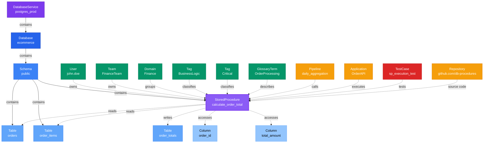

# StoredProcedure

**Stored procedures - executable database logic and transformations**

---

## Overview

The **StoredProcedure** entity represents stored procedures, functions, and other executable database objects that encapsulate business logic, data transformations, and complex queries within the database.

**Hierarchy**:


---

## Relationships

### Parent Entities
- **DatabaseSchema**: The schema containing this stored procedure
- **Database**: The database containing this stored procedure
- **DatabaseService**: The service hosting the database

### Dependencies
- **Table**: Tables read or modified by the procedure
- **Column**: Specific columns accessed

### Associated Entities
- **Owner**: User or team owning this stored procedure
- **Domain**: Business domain assignment
- **Tag**: Classification tags

### Relationship Diagram



---

## Schema Specifications

View the complete StoredProcedure schema in your preferred format:

=== "JSON Schema"

    **Complete JSON Schema Definition**

    ```json
    {
      "$id": "https://open-metadata.org/schema/entity/data/storedProcedure.json",
      "$schema": "http://json-schema.org/draft-07/schema#",
      "title": "StoredProcedure",
      "description": "A `StoredProcedure` entity represents executable database logic including stored procedures, functions, and database routines.",
      "type": "object",
      "javaType": "org.openmetadata.schema.entity.data.StoredProcedure",

      "definitions": {
        "storedProcedureType": {
          "description": "Type of stored procedure",
          "type": "string",
          "enum": [
            "StoredProcedure", "Function", "Trigger",
            "AggregateFunction", "TableFunction", "ScalarFunction"
          ]
        },
        "storedProcedureLanguage": {
          "description": "Programming language",
          "type": "string",
          "enum": [
            "SQL", "PLSQL", "TSQL", "PL/pgSQL",
            "JavaScript", "Python", "Java", "Scala"
          ]
        },
        "parameter": {
          "type": "object",
          "properties": {
            "name": {
              "description": "Parameter name",
              "type": "string"
            },
            "dataType": {
              "description": "Data type",
              "type": "string"
            },
            "parameterMode": {
              "description": "Parameter mode",
              "type": "string",
              "enum": ["IN", "OUT", "INOUT"]
            },
            "description": {
              "description": "Parameter description",
              "type": "string"
            }
          }
        }
      },

      "properties": {
        "id": {
          "description": "Unique identifier",
          "$ref": "../../type/basic.json#/definitions/uuid"
        },
        "name": {
          "description": "Stored procedure name",
          "$ref": "../../type/basic.json#/definitions/entityName"
        },
        "fullyQualifiedName": {
          "description": "Fully qualified name: service.database.schema.storedProcedure",
          "$ref": "../../type/basic.json#/definitions/fullyQualifiedEntityName"
        },
        "displayName": {
          "description": "Display name",
          "type": "string"
        },
        "description": {
          "description": "Markdown description",
          "$ref": "../../type/basic.json#/definitions/markdown"
        },
        "storedProcedureType": {
          "$ref": "#/definitions/storedProcedureType"
        },
        "storedProcedureLanguage": {
          "$ref": "#/definitions/storedProcedureLanguage"
        },
        "storedProcedureCode": {
          "description": "Source code of the stored procedure",
          "$ref": "../../type/basic.json#/definitions/sqlQuery"
        },
        "parameters": {
          "description": "Input/output parameters",
          "type": "array",
          "items": {
            "$ref": "#/definitions/parameter"
          }
        },
        "returnType": {
          "description": "Return data type",
          "type": "string"
        },
        "databaseSchema": {
          "description": "Parent schema",
          "$ref": "../../type/entityReference.json"
        },
        "database": {
          "description": "Parent database",
          "$ref": "../../type/entityReference.json"
        },
        "service": {
          "description": "Database service",
          "$ref": "../../type/entityReference.json"
        },
        "owner": {
          "description": "Owner (user or team)",
          "$ref": "../../type/entityReference.json"
        },
        "domain": {
          "description": "Data domain",
          "$ref": "../../type/entityReference.json"
        },
        "tags": {
          "description": "Classification tags",
          "type": "array",
          "items": {
            "$ref": "../../type/tagLabel.json"
          }
        },
        "version": {
          "description": "Metadata version",
          "$ref": "../../type/entityHistory.json#/definitions/entityVersion"
        }
      },

      "required": ["id", "name", "databaseSchema"]
    }
    ```

    **[View Full JSON Schema →](https://github.com/open-metadata/OpenMetadataStandards/blob/main/schemas/entity/data/storedProcedure.json)**

=== "RDF"

    **RDF/OWL Ontology Definition**

    ```turtle
    @prefix om: <https://open-metadata.org/schema/> .
    @prefix rdfs: <http://www.w3.org/2000/01/rdf-schema#> .
    @prefix owl: <http://www.w3.org/2001/XMLSchema#> .
    @prefix xsd: <http://www.w3.org/2001/XMLSchema#> .

    # StoredProcedure Class Definition
    om:StoredProcedure a owl:Class ;
        rdfs:subClassOf om:DataAsset ;
        rdfs:label "StoredProcedure" ;
        rdfs:comment "Executable database logic including procedures, functions, and routines" ;
        om:hierarchyLevel 4 .

    # Properties
    om:storedProcedureName a owl:DatatypeProperty ;
        rdfs:domain om:StoredProcedure ;
        rdfs:range xsd:string ;
        rdfs:label "name" ;
        rdfs:comment "Name of the stored procedure" .

    om:fullyQualifiedName a owl:DatatypeProperty ;
        rdfs:domain om:StoredProcedure ;
        rdfs:range xsd:string ;
        rdfs:label "fullyQualifiedName" ;
        rdfs:comment "Complete hierarchical name: service.database.schema.storedProcedure" .

    om:storedProcedureType a owl:DatatypeProperty ;
        rdfs:domain om:StoredProcedure ;
        rdfs:range om:StoredProcedureType ;
        rdfs:label "storedProcedureType" ;
        rdfs:comment "Type: StoredProcedure, Function, Trigger, etc." .

    om:storedProcedureLanguage a owl:DatatypeProperty ;
        rdfs:domain om:StoredProcedure ;
        rdfs:range om:ProgrammingLanguage ;
        rdfs:label "storedProcedureLanguage" ;
        rdfs:comment "Programming language: SQL, PL/SQL, T-SQL, etc." .

    om:storedProcedureCode a owl:DatatypeProperty ;
        rdfs:domain om:StoredProcedure ;
        rdfs:range xsd:string ;
        rdfs:label "storedProcedureCode" ;
        rdfs:comment "Source code of the stored procedure" .

    om:returnType a owl:DatatypeProperty ;
        rdfs:domain om:StoredProcedure ;
        rdfs:range xsd:string ;
        rdfs:label "returnType" ;
        rdfs:comment "Return data type" .

    om:hasParameter a owl:ObjectProperty ;
        rdfs:domain om:StoredProcedure ;
        rdfs:range om:Parameter ;
        rdfs:label "hasParameter" ;
        rdfs:comment "Input/output parameters" .

    om:belongsToSchema a owl:ObjectProperty ;
        rdfs:domain om:StoredProcedure ;
        rdfs:range om:DatabaseSchema ;
        rdfs:label "belongsToSchema" ;
        rdfs:comment "Parent database schema" .

    om:ownedBy a owl:ObjectProperty ;
        rdfs:domain om:StoredProcedure ;
        rdfs:range om:Owner ;
        rdfs:label "ownedBy" ;
        rdfs:comment "User or team that owns this stored procedure" .

    om:hasTag a owl:ObjectProperty ;
        rdfs:domain om:StoredProcedure ;
        rdfs:range om:Tag ;
        rdfs:label "hasTag" ;
        rdfs:comment "Classification tags applied to stored procedure" .

    # StoredProcedureType Enumeration
    om:StoredProcedureType a owl:Class ;
        owl:oneOf (
            om:StoredProcedureType_StoredProcedure
            om:StoredProcedureType_Function
            om:StoredProcedureType_Trigger
            om:StoredProcedureType_TableFunction
        ) .

    # Example Instance
    ex:calculateOrderTotal a om:StoredProcedure ;
        om:storedProcedureName "calculate_order_total" ;
        om:fullyQualifiedName "postgres_prod.ecommerce.public.calculate_order_total" ;
        om:storedProcedureType om:StoredProcedureType_Function ;
        om:storedProcedureLanguage om:PLPGSQL ;
        om:returnType "NUMERIC" ;
        om:belongsToSchema ex:publicSchema ;
        om:ownedBy ex:ecommerceTeam ;
        om:hasTag ex:tierGold ;
        om:hasParameter ex:orderIdParam .
    ```

    **[View Full RDF Ontology →](https://github.com/open-metadata/OpenMetadataStandards/blob/main/rdf/ontology/openmetadata.ttl)**

=== "JSON-LD"

    **JSON-LD Context and Example**

    ```json
    {
      "@context": {
        "@vocab": "https://open-metadata.org/schema/",
        "om": "https://open-metadata.org/schema/",
        "rdfs": "http://www.w3.org/2000/01/rdf-schema#",
        "xsd": "http://www.w3.org/2001/XMLSchema#",

        "StoredProcedure": "om:StoredProcedure",
        "name": {
          "@id": "om:storedProcedureName",
          "@type": "xsd:string"
        },
        "fullyQualifiedName": {
          "@id": "om:fullyQualifiedName",
          "@type": "xsd:string"
        },
        "displayName": {
          "@id": "om:displayName",
          "@type": "xsd:string"
        },
        "description": {
          "@id": "om:description",
          "@type": "xsd:string"
        },
        "storedProcedureType": {
          "@id": "om:storedProcedureType",
          "@type": "@vocab"
        },
        "storedProcedureLanguage": {
          "@id": "om:storedProcedureLanguage",
          "@type": "@vocab"
        },
        "storedProcedureCode": {
          "@id": "om:storedProcedureCode",
          "@type": "xsd:string"
        },
        "returnType": {
          "@id": "om:returnType",
          "@type": "xsd:string"
        },
        "parameters": {
          "@id": "om:hasParameter",
          "@type": "@id",
          "@container": "@list"
        },
        "databaseSchema": {
          "@id": "om:belongsToSchema",
          "@type": "@id"
        },
        "database": {
          "@id": "om:belongsToDatabase",
          "@type": "@id"
        },
        "service": {
          "@id": "om:belongsToService",
          "@type": "@id"
        },
        "owner": {
          "@id": "om:ownedBy",
          "@type": "@id"
        },
        "domain": {
          "@id": "om:inDomain",
          "@type": "@id"
        },
        "tags": {
          "@id": "om:hasTag",
          "@type": "@id",
          "@container": "@set"
        }
      }
    }
    ```

    **Example JSON-LD Instance**:

    ```json
    {
      "@context": "https://open-metadata.org/context/storedProcedure.jsonld",
      "@type": "StoredProcedure",
      "@id": "https://example.com/data/procedures/calculate_order_total",

      "name": "calculate_order_total",
      "fullyQualifiedName": "postgres_prod.ecommerce.public.calculate_order_total",
      "displayName": "Calculate Order Total",
      "description": "Calculates the total amount for an order including tax and shipping",
      "storedProcedureType": "Function",
      "storedProcedureLanguage": "PL/pgSQL",
      "returnType": "NUMERIC",

      "storedProcedureCode": "CREATE OR REPLACE FUNCTION calculate_order_total(p_order_id BIGINT)\nRETURNS NUMERIC AS $$\nDECLARE\n    v_total NUMERIC;\nBEGIN\n    SELECT SUM(quantity * price) + tax + shipping\n    INTO v_total\n    FROM order_items\n    WHERE order_id = p_order_id;\n    \n    RETURN v_total;\nEND;\n$$ LANGUAGE plpgsql;",

      "parameters": [
        {
          "name": "p_order_id",
          "dataType": "BIGINT",
          "parameterMode": "IN",
          "description": "Order ID to calculate total for"
        }
      ],

      "databaseSchema": {
        "@id": "https://example.com/data/schemas/public",
        "@type": "DatabaseSchema",
        "name": "public"
      },

      "database": {
        "@id": "https://example.com/data/databases/ecommerce",
        "@type": "Database",
        "name": "ecommerce"
      },

      "service": {
        "@id": "https://example.com/services/postgres_prod",
        "@type": "DatabaseService",
        "name": "postgres_prod"
      },

      "owner": {
        "@id": "https://example.com/users/john.smith",
        "@type": "User",
        "name": "john.smith",
        "displayName": "John Smith"
      },

      "domain": {
        "@id": "https://example.com/domains/sales",
        "@type": "Domain",
        "name": "Sales"
      },

      "tags": [
        {
          "@id": "https://open-metadata.org/tags/BusinessLogic/Critical",
          "tagFQN": "BusinessLogic.Critical"
        }
      ]
    }
    ```

    **[View Full JSON-LD Context →](https://github.com/open-metadata/OpenMetadataStandards/blob/main/rdf/contexts/storedProcedure.jsonld)**

---

## Use Cases

- Document business logic encapsulated in database procedures
- Catalog database functions and their parameters
- Track dependencies on tables and views used by procedures
- Understand data transformations performed by stored code
- Version control for database logic changes
- Apply governance tags to sensitive business logic
- Document trigger behavior and event handlers
- Create lineage from procedures to tables they modify

---

## JSON Schema Specification

### Core Properties

#### `id` (uuid)
**Type**: `string` (UUID format)
**Required**: Yes (system-generated)
**Description**: Unique identifier for this stored procedure instance

```json
{
  "id": "f6a7b8c9-d0e1-4f2a-3b4c-5d6e7f8a9b0c"
}
```

---

#### `name` (entityName)
**Type**: `string`
**Required**: Yes
**Pattern**: `^[^.]*$` (no dots allowed)
**Min Length**: 1
**Max Length**: 256
**Description**: Name of the stored procedure

```json
{
  "name": "calculate_order_total"
}
```

---

#### `fullyQualifiedName` (fullyQualifiedEntityName)
**Type**: `string`
**Required**: Yes (system-generated)
**Pattern**: `^((?!::).)*$`
**Description**: Fully qualified name in the format `service.database.schema.storedProcedure`

```json
{
  "fullyQualifiedName": "postgres_prod.ecommerce.public.calculate_order_total"
}
```

---

#### `displayName`
**Type**: `string`
**Required**: No
**Description**: Human-readable display name

```json
{
  "displayName": "Calculate Order Total"
}
```

---

#### `description` (markdown)
**Type**: `string` (Markdown format)
**Required**: No
**Description**: Rich text description of the procedure's purpose and logic

```json
{
  "description": "# Calculate Order Total\n\nCalculates the total amount for an order including:\n- Line item subtotals\n- Applicable taxes\n- Shipping costs\n- Discounts\n\n## Usage\n```sql\nSELECT calculate_order_total(12345);\n```\n\n## Returns\nNUMERIC value representing the final order total"
}
```

---

### Procedure Properties

#### `storedProcedureType` (StoredProcedureType enum)
**Type**: `string` enum
**Required**: No (default: `StoredProcedure`)
**Allowed Values**:

- `StoredProcedure` - Standard stored procedure
- `Function` - Database function
- `Trigger` - Database trigger
- `AggregateFunction` - Aggregate function
- `TableFunction` - Table-valued function
- `ScalarFunction` - Scalar function

```json
{
  "storedProcedureType": "Function"
}
```

---

#### `storedProcedureLanguage` (StoredProcedureLanguage enum)
**Type**: `string` enum
**Required**: No
**Allowed Values**:

- `SQL` - Standard SQL
- `PLSQL` - Oracle PL/SQL
- `TSQL` - Microsoft T-SQL
- `PL/pgSQL` - PostgreSQL procedural language
- `JavaScript` - JavaScript (MongoDB, Snowflake)
- `Python` - Python (Snowflake, BigQuery)
- `Java` - Java (Oracle, Snowflake)
- `Scala` - Scala (Databricks)

```json
{
  "storedProcedureLanguage": "PL/pgSQL"
}
```

---

#### `storedProcedureCode` (sqlQuery)
**Type**: `string`
**Required**: No
**Description**: Full source code of the stored procedure

```json
{
  "storedProcedureCode": "CREATE OR REPLACE FUNCTION calculate_order_total(p_order_id BIGINT)\nRETURNS NUMERIC AS $$\nDECLARE\n    v_total NUMERIC;\nBEGIN\n    SELECT SUM(quantity * price) + tax + shipping\n    INTO v_total\n    FROM order_items\n    WHERE order_id = p_order_id;\n    \n    RETURN v_total;\nEND;\n$$ LANGUAGE plpgsql;"
}
```

---

#### `parameters[]` (Parameter[])
**Type**: `array`
**Required**: No
**Description**: Input, output, and input/output parameters

**Parameter Object Properties**:

| Property | Type | Required | Description |
|----------|------|----------|-------------|
| `name` | string | Yes | Parameter name |
| `dataType` | string | Yes | Data type (e.g., BIGINT, VARCHAR) |
| `parameterMode` | enum | No | IN, OUT, or INOUT |
| `description` | string | No | Parameter description |

**Example**:

```json
{
  "parameters": [
    {
      "name": "p_order_id",
      "dataType": "BIGINT",
      "parameterMode": "IN",
      "description": "Order ID to calculate total for"
    },
    {
      "name": "p_include_tax",
      "dataType": "BOOLEAN",
      "parameterMode": "IN",
      "description": "Whether to include tax in calculation"
    },
    {
      "name": "p_result",
      "dataType": "NUMERIC",
      "parameterMode": "OUT",
      "description": "Calculated order total"
    }
  ]
}
```

---

#### `returnType` (string)
**Type**: `string`
**Required**: No
**Description**: Return data type for functions

```json
{
  "returnType": "NUMERIC"
}
```

---

### Location Properties

#### `databaseSchema` (EntityReference)
**Type**: `object`
**Required**: Yes
**Description**: Reference to parent schema

```json
{
  "databaseSchema": {
    "id": "c3d4e5f6-a7b8-4c9d-0e1f-2a3b4c5d6e7f",
    "type": "databaseSchema",
    "name": "public",
    "fullyQualifiedName": "postgres_prod.ecommerce.public"
  }
}
```

---

#### `database` (EntityReference)
**Type**: `object`
**Required**: Yes
**Description**: Reference to parent database

```json
{
  "database": {
    "id": "b2c3d4e5-f6a7-4b8c-9d0e-1f2a3b4c5d6e",
    "type": "database",
    "name": "ecommerce",
    "fullyQualifiedName": "postgres_prod.ecommerce"
  }
}
```

---

#### `service` (EntityReference)
**Type**: `object`
**Required**: Yes
**Description**: Reference to database service

```json
{
  "service": {
    "id": "a1b2c3d4-e5f6-4a7b-8c9d-0e1f2a3b4c5d",
    "type": "databaseService",
    "name": "postgres_prod"
  }
}
```

---

### Governance Properties

#### `owner` (EntityReference)
**Type**: `object`
**Required**: No
**Description**: User or team that owns this stored procedure

```json
{
  "owner": {
    "id": "a7b8c9d0-e1f2-4a3b-4c5d-6e7f8a9b0c1d",
    "type": "user",
    "name": "john.smith",
    "displayName": "John Smith"
  }
}
```

---

#### `domain` (EntityReference)
**Type**: `object`
**Required**: No
**Description**: Data domain this stored procedure belongs to

```json
{
  "domain": {
    "id": "f6a7b8c9-d0e1-4f2a-3b4c-5d6e7f8a9b0c",
    "type": "domain",
    "name": "Sales",
    "fullyQualifiedName": "Sales"
  }
}
```

---

#### `tags[]` (TagLabel[])
**Type**: `array`
**Required**: No
**Description**: Classification tags applied to the stored procedure

```json
{
  "tags": [
    {
      "tagFQN": "BusinessLogic.Critical",
      "description": "Critical business logic",
      "source": "Classification",
      "labelType": "Manual",
      "state": "Confirmed"
    },
    {
      "tagFQN": "CodeQuality.Reviewed",
      "source": "Classification",
      "labelType": "Manual",
      "state": "Confirmed"
    }
  ]
}
```

---

### Versioning Properties

#### `version` (entityVersion)
**Type**: `number`
**Required**: Yes (system-managed)
**Description**: Metadata version number

```json
{
  "version": 2.1
}
```

---

#### `updatedAt` (timestamp)
**Type**: `integer` (Unix epoch milliseconds)
**Required**: Yes (system-managed)
**Description**: Last update timestamp

```json
{
  "updatedAt": 1704240000000
}
```

---

#### `updatedBy` (string)
**Type**: `string`
**Required**: Yes (system-managed)
**Description**: User who made the update

```json
{
  "updatedBy": "john.smith"
}
```

---

## Complete Example

```json
{
  "id": "f6a7b8c9-d0e1-4f2a-3b4c-5d6e7f8a9b0c",
  "name": "calculate_order_total",
  "fullyQualifiedName": "postgres_prod.ecommerce.public.calculate_order_total",
  "displayName": "Calculate Order Total",
  "description": "# Calculate Order Total\n\nCalculates the total amount for an order including tax and shipping.",
  "storedProcedureType": "Function",
  "storedProcedureLanguage": "PL/pgSQL",
  "returnType": "NUMERIC",
  "storedProcedureCode": "CREATE OR REPLACE FUNCTION calculate_order_total(p_order_id BIGINT)\nRETURNS NUMERIC AS $$\nDECLARE\n    v_total NUMERIC;\nBEGIN\n    SELECT SUM(quantity * price) + tax + shipping\n    INTO v_total\n    FROM order_items\n    WHERE order_id = p_order_id;\n    \n    RETURN v_total;\nEND;\n$$ LANGUAGE plpgsql;",
  "parameters": [
    {
      "name": "p_order_id",
      "dataType": "BIGINT",
      "parameterMode": "IN",
      "description": "Order ID to calculate total for"
    }
  ],
  "databaseSchema": {
    "id": "c3d4e5f6-a7b8-4c9d-0e1f-2a3b4c5d6e7f",
    "type": "databaseSchema",
    "name": "public"
  },
  "database": {
    "id": "b2c3d4e5-f6a7-4b8c-9d0e-1f2a3b4c5d6e",
    "type": "database",
    "name": "ecommerce"
  },
  "service": {
    "id": "a1b2c3d4-e5f6-4a7b-8c9d-0e1f2a3b4c5d",
    "type": "databaseService",
    "name": "postgres_prod"
  },
  "owner": {
    "id": "a7b8c9d0-e1f2-4a3b-4c5d-6e7f8a9b0c1d",
    "type": "user",
    "name": "john.smith"
  },
  "domain": {
    "id": "f6a7b8c9-d0e1-4f2a-3b4c-5d6e7f8a9b0c",
    "type": "domain",
    "name": "Sales"
  },
  "tags": [
    {"tagFQN": "BusinessLogic.Critical"},
    {"tagFQN": "CodeQuality.Reviewed"}
  ],
  "version": 2.1,
  "updatedAt": 1704240000000,
  "updatedBy": "john.smith"
}
```

---

## Custom Properties

This entity supports custom properties through the `extension` field.
Common custom properties include:

- **Data Classification**: Sensitivity level
- **Cost Center**: Billing allocation
- **Retention Period**: Data retention requirements
- **Application Owner**: Owning application/team

See [Custom Properties](../../metadata-specifications/custom-properties.md)
for details on defining and using custom properties.

---

## API Operations

### Create Stored Procedure

```http
POST /api/v1/storedProcedures
Content-Type: application/json

{
  "name": "calculate_order_total",
  "databaseSchema": "postgres_prod.ecommerce.public",
  "storedProcedureType": "Function",
  "storedProcedureLanguage": "PL/pgSQL",
  "description": "Calculates order total"
}
```

### Get Stored Procedure

```http
GET /api/v1/storedProcedures/name/postgres_prod.ecommerce.public.calculate_order_total?fields=storedProcedureCode,parameters,owner,tags
```

### Update Stored Procedure

```http
PATCH /api/v1/storedProcedures/{id}
Content-Type: application/json-patch+json

[
  {
    "op": "add",
    "path": "/tags/-",
    "value": {"tagFQN": "CodeQuality.Reviewed"}
  }
]
```

### List Stored Procedures in Schema

```http
GET /api/v1/storedProcedures?databaseSchema=postgres_prod.ecommerce.public
```

---

## Related Documentation

- **[Database Service](database-service.md)** - Parent service entity
- **[Database](database.md)** - Parent database entity
- **[Database Schema](database-schema.md)** - Parent schema entity
- **[Table](table.md)** - Tables used by procedures
- **[Lineage](../../lineage/overview.md)** - Procedure lineage tracking
