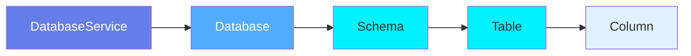

# Table

**Database tables and views - the foundation of structured data**

---

## Overview

The **Table** entity represents database tables, views, and other tabular structures across all database systems. It is the most fundamental data asset in OpenMetadata, capturing schema, constraints, relationships, and metadata.

**Hierarchy**:


---

## Schema Specifications

View the complete Table schema in your preferred format:

=== "JSON Schema"

    **Complete JSON Schema Definition**

    ```json
    {
      "$id": "https://open-metadata.org/schema/entity/data/table.json",
      "$schema": "http://json-schema.org/draft-07/schema#",
      "title": "Table",
      "description": "A `Table` entity organizes data in rows and columns and is defined in a `Database Schema`.",
      "type": "object",
      "javaType": "org.openmetadata.schema.entity.data.Table",

      "definitions": {
        "tableType": {
          "description": "Type of table",
          "type": "string",
          "enum": [
            "Regular", "External", "Dynamic", "View", "SecureView",
            "MaterializedView", "Iceberg", "Local", "Partitioned",
            "Foreign", "Transient", "Stream"
          ]
        },
        "tableConstraint": {
          "type": "object",
          "properties": {
            "constraintType": {
              "type": "string",
              "enum": ["UNIQUE", "PRIMARY_KEY", "FOREIGN_KEY", "SORT_KEY", "DIST_KEY", "CLUSTER_KEY"]
            },
            "columns": {
              "type": "array",
              "items": {"type": "string"}
            },
            "referredColumns": {
              "type": "array",
              "items": {"type": "string"}
            },
            "relationshipType": {
              "type": "string",
              "enum": ["ONE_TO_ONE", "ONE_TO_MANY", "MANY_TO_ONE", "MANY_TO_MANY"]
            }
          }
        }
      },

      "properties": {
        "id": {
          "description": "Unique identifier",
          "$ref": "../../type/basic.json#/definitions/uuid"
        },
        "name": {
          "description": "Table name",
          "$ref": "../../type/basic.json#/definitions/entityName"
        },
        "fullyQualifiedName": {
          "description": "Fully qualified name: service.database.schema.table",
          "$ref": "../../type/basic.json#/definitions/fullyQualifiedEntityName"
        },
        "displayName": {
          "description": "Display name",
          "type": "string"
        },
        "description": {
          "description": "Markdown description",
          "$ref": "../../type/basic.json#/definitions/markdown"
        },
        "tableType": {
          "$ref": "#/definitions/tableType"
        },
        "columns": {
          "description": "Table columns",
          "type": "array",
          "items": {
            "$ref": "../../type/entityReference.json"
          }
        },
        "tableConstraints": {
          "type": "array",
          "items": {
            "$ref": "#/definitions/tableConstraint"
          }
        },
        "databaseSchema": {
          "description": "Parent schema",
          "$ref": "../../type/entityReference.json"
        },
        "database": {
          "description": "Parent database",
          "$ref": "../../type/entityReference.json"
        },
        "service": {
          "description": "Database service",
          "$ref": "../../type/entityReference.json"
        },
        "owners": {
          "description": "Owners of this table",
          "$ref": "../../type/entityReferenceList.json"
        },
        "domains": {
          "description": "Domains the asset belongs to",
          "$ref": "../../type/entityReferenceList.json"
        },
        "dataProducts": {
          "description": "List of data products this entity is part of",
          "$ref": "../../type/entityReferenceList.json"
        },
        "tags": {
          "description": "Classification tags",
          "type": "array",
          "items": {
            "$ref": "../../type/tagLabel.json"
          }
        },
        "followers": {
          "description": "Followers of this table",
          "$ref": "../../type/entityReferenceList.json"
        },
        "votes": {
          "description": "Votes on the entity",
          "$ref": "../../type/votes.json"
        },
        "lifeCycle": {
          "description": "Life Cycle of the entity",
          "$ref": "../../type/lifeCycle.json"
        },
        "certification": {
          "description": "Asset certification",
          "$ref": "../../type/assetCertification.json"
        },
        "version": {
          "description": "Metadata version",
          "$ref": "../../type/entityHistory.json#/definitions/entityVersion"
        }
      },

      "required": ["id", "name", "columns"]
    }
    ```

    **[View Full JSON Schema →](https://github.com/open-metadata/OpenMetadataStandards/blob/main/schemas/entity/data/table.json)**

=== "RDF"

    **RDF/OWL Ontology Definition**

    ```turtle
    @prefix om: <https://open-metadata.org/schema/> .
    @prefix rdfs: <http://www.w3.org/2000/01/rdf-schema#> .
    @prefix owl: <http://www.w3.org/2001/XMLSchema#> .
    @prefix xsd: <http://www.w3.org/2001/XMLSchema#> .

    # Table Class Definition
    om:Table a owl:Class ;
        rdfs:subClassOf om:DataAsset ;
        rdfs:label "Table" ;
        rdfs:comment "A database table or view containing structured data in rows and columns" ;
        om:hierarchyLevel 4 .

    # Properties
    om:tableName a owl:DatatypeProperty ;
        rdfs:domain om:Table ;
        rdfs:range xsd:string ;
        rdfs:label "name" ;
        rdfs:comment "Name of the table" .

    om:fullyQualifiedName a owl:DatatypeProperty ;
        rdfs:domain om:Table ;
        rdfs:range xsd:string ;
        rdfs:label "fullyQualifiedName" ;
        rdfs:comment "Complete hierarchical name: service.database.schema.table" .

    om:tableType a owl:DatatypeProperty ;
        rdfs:domain om:Table ;
        rdfs:range om:TableType ;
        rdfs:label "tableType" ;
        rdfs:comment "Type of table: Regular, View, MaterializedView, etc." .

    om:hasColumn a owl:ObjectProperty ;
        rdfs:domain om:Table ;
        rdfs:range om:Column ;
        rdfs:label "hasColumn" ;
        rdfs:comment "Columns in this table" .

    om:belongsToSchema a owl:ObjectProperty ;
        rdfs:domain om:Table ;
        rdfs:range om:DatabaseSchema ;
        rdfs:label "belongsToSchema" ;
        rdfs:comment "Parent database schema" .

    om:hasOwner a owl:ObjectProperty ;
        rdfs:domain om:Table ;
        rdfs:range om:Owner ;
        rdfs:label "hasOwner" ;
        rdfs:comment "Users or teams that own this table" .

    om:hasTag a owl:ObjectProperty ;
        rdfs:domain om:Table ;
        rdfs:range om:Tag ;
        rdfs:label "hasTag" ;
        rdfs:comment "Classification tags applied to table" .

    om:linkedToGlossaryTerm a owl:ObjectProperty ;
        rdfs:domain om:Table ;
        rdfs:range om:GlossaryTerm ;
        rdfs:label "linkedToGlossaryTerm" ;
        rdfs:comment "Business glossary terms" .

    om:followedBy a owl:ObjectProperty ;
        rdfs:domain om:Table ;
        rdfs:range om:User ;
        rdfs:label "followedBy" ;
        rdfs:comment "Users following this table" .

    om:hasDomain a owl:ObjectProperty ;
        rdfs:domain om:Table ;
        rdfs:range om:Domain ;
        rdfs:label "hasDomain" ;
        rdfs:comment "Domains the asset belongs to" .

    om:hasVotes a owl:ObjectProperty ;
        rdfs:domain om:Table ;
        rdfs:range om:Votes ;
        rdfs:label "hasVotes" ;
        rdfs:comment "Votes on the entity" .

    om:hasLifeCycle a owl:ObjectProperty ;
        rdfs:domain om:Table ;
        rdfs:range om:LifeCycle ;
        rdfs:label "hasLifeCycle" ;
        rdfs:comment "Life cycle of the entity" .

    om:hasCertification a owl:ObjectProperty ;
        rdfs:domain om:Table ;
        rdfs:range om:AssetCertification ;
        rdfs:label "hasCertification" ;
        rdfs:comment "Certification status of the table" .

    # Table Type Enumeration
    om:TableType a owl:Class ;
        owl:oneOf (
            om:RegularTable
            om:ExternalTable
            om:DynamicTable
            om:ViewTable
            om:SecureViewTable
            om:MaterializedViewTable
            om:IcebergTable
            om:LocalTable
            om:PartitionedTable
            om:ForeignTable
            om:TransientTable
            om:StreamTable
        ) .

    # Example Instance
    ex:customersTable a om:Table ;
        om:tableName "customers" ;
        om:fullyQualifiedName "postgres_prod.ecommerce.public.customers" ;
        om:tableType om:RegularTable ;
        om:belongsToSchema ex:publicSchema ;
        om:hasOwner ex:janeDoe ;
        om:hasOwner ex:dataEngineeringTeam ;
        om:hasDomain ex:salesDomain ;
        om:hasTag ex:tierGold ;
        om:hasTag ex:complianceGDPR ;
        om:linkedToGlossaryTerm ex:customerTerm ;
        om:followedBy ex:johnSmith ;
        om:followedBy ex:aliceWilliams ;
        om:hasColumn ex:customerIdColumn ;
        om:hasColumn ex:emailColumn .
    ```

    **[View Full RDF Ontology →](https://github.com/open-metadata/OpenMetadataStandards/blob/main/rdf/ontology/openmetadata.ttl)**

=== "JSON-LD"

    **JSON-LD Context and Example**

    ```json
    {
      "@context": {
        "@vocab": "https://open-metadata.org/schema/",
        "om": "https://open-metadata.org/schema/",
        "rdfs": "http://www.w3.org/2000/01/rdf-schema#",
        "xsd": "http://www.w3.org/2001/XMLSchema#",

        "Table": "om:Table",
        "name": {
          "@id": "om:tableName",
          "@type": "xsd:string"
        },
        "fullyQualifiedName": {
          "@id": "om:fullyQualifiedName",
          "@type": "xsd:string"
        },
        "displayName": {
          "@id": "om:displayName",
          "@type": "xsd:string"
        },
        "description": {
          "@id": "om:description",
          "@type": "xsd:string"
        },
        "tableType": {
          "@id": "om:tableType",
          "@type": "@vocab"
        },
        "columns": {
          "@id": "om:hasColumn",
          "@type": "@id",
          "@container": "@list"
        },
        "databaseSchema": {
          "@id": "om:belongsToSchema",
          "@type": "@id"
        },
        "database": {
          "@id": "om:belongsToDatabase",
          "@type": "@id"
        },
        "service": {
          "@id": "om:belongsToService",
          "@type": "@id"
        },
        "owners": {
          "@id": "om:hasOwner",
          "@type": "@id",
          "@container": "@set"
        },
        "domains": {
          "@id": "om:hasDomain",
          "@type": "@id",
          "@container": "@set"
        },
        "dataProducts": {
          "@id": "om:partOfDataProduct",
          "@type": "@id",
          "@container": "@set"
        },
        "tags": {
          "@id": "om:hasTag",
          "@type": "@id",
          "@container": "@set"
        },
        "followers": {
          "@id": "om:followedBy",
          "@type": "@id",
          "@container": "@set"
        },
        "votes": {
          "@id": "om:hasVotes",
          "@type": "@id"
        },
        "lifeCycle": {
          "@id": "om:hasLifeCycle",
          "@type": "@id"
        },
        "certification": {
          "@id": "om:hasCertification",
          "@type": "@id"
        }
      }
    }
    ```

    **Example JSON-LD Instance**:

    ```json
    {
      "@context": "https://open-metadata.org/context/table.jsonld",
      "@type": "Table",
      "@id": "https://example.com/data/tables/customers",

      "name": "customers",
      "fullyQualifiedName": "postgres_prod.ecommerce.public.customers",
      "displayName": "Customer Master Table",
      "description": "Contains all customer records with contact information",
      "tableType": "Regular",

      "databaseSchema": {
        "@id": "https://example.com/data/schemas/public",
        "@type": "DatabaseSchema",
        "name": "public"
      },

      "database": {
        "@id": "https://example.com/data/databases/ecommerce",
        "@type": "Database",
        "name": "ecommerce"
      },

      "service": {
        "@id": "https://example.com/services/postgres_prod",
        "@type": "DatabaseService",
        "name": "postgres_prod"
      },

      "owners": [
        {
          "@id": "https://example.com/users/jane.doe",
          "@type": "User",
          "name": "jane.doe",
          "displayName": "Jane Doe"
        },
        {
          "@id": "https://example.com/teams/data-engineering",
          "@type": "Team",
          "name": "data-engineering",
          "displayName": "Data Engineering"
        }
      ],

      "domains": [
        {
          "@id": "https://example.com/domains/Sales",
          "@type": "Domain",
          "name": "Sales"
        }
      ],

      "followers": [
        {
          "@id": "https://example.com/users/john.smith",
          "@type": "User",
          "name": "john.smith"
        }
      ],

      "tags": [
        {
          "@id": "https://open-metadata.org/tags/Tier/Gold",
          "tagFQN": "Tier.Gold"
        },
        {
          "@id": "https://open-metadata.org/tags/Compliance/GDPR",
          "tagFQN": "Compliance.GDPR"
        }
      ],

      "columns": [
        {
          "@type": "Column",
          "@id": "https://example.com/data/tables/customers/columns/customer_id",
          "name": "customer_id",
          "dataType": "BIGINT",
          "constraint": "PRIMARY_KEY"
        },
        {
          "@type": "Column",
          "@id": "https://example.com/data/tables/customers/columns/email",
          "name": "email",
          "dataType": "VARCHAR",
          "dataLength": 255,
          "tags": [
            {
              "@id": "https://open-metadata.org/tags/PII/Sensitive/Email"
            }
          ]
        }
      ]
    }
    ```

    **[View Full JSON-LD Context →](https://github.com/open-metadata/OpenMetadataStandards/blob/main/rdf/contexts/table.jsonld)**

---

## Use Cases

- Catalog all tables across databases (PostgreSQL, MySQL, Snowflake, BigQuery, etc.)
- Document table purpose, columns, and relationships
- Track table ownership and domain assignment
- Apply governance tags (PII, PHI, Compliance)
- Run data quality tests
- Capture lineage from source to consumption
- Profile table statistics
- Define data contracts

---

## JSON Schema Specification

### Core Properties

#### `id` (uuid)
**Type**: `string` (UUID format)
**Required**: Yes (system-generated)
**Description**: Unique identifier for this table instance

```json
{
  "id": "8f6a9c7e-3b2d-4a1f-9e5c-6d8b4f2a1e9c"
}
```

---

#### `name` (entityName)
**Type**: `string`
**Required**: Yes
**Pattern**: `^[^.]*$` (no dots allowed)
**Min Length**: 1
**Max Length**: 256
**Description**: Name of the table (unqualified)

```json
{
  "name": "customers"
}
```

---

#### `fullyQualifiedName` (fullyQualifiedEntityName)
**Type**: `string`
**Required**: Yes (system-generated)
**Pattern**: `^((?!::).)*$`
**Description**: Fully qualified name in the format `service.database.schema.table`

```json
{
  "fullyQualifiedName": "postgres_prod.ecommerce.public.customers"
}
```

---

#### `displayName`
**Type**: `string`
**Required**: No
**Description**: Human-readable display name

```json
{
  "displayName": "Customer Master Table"
}
```

---

#### `description` (markdown)
**Type**: `string` (Markdown format)
**Required**: No
**Description**: Rich text description of the table's purpose and usage

```json
{
  "description": "# Customer Master Table\n\nContains all customer records with contact information, preferences, and lifecycle status.\n\n## Usage\n- Primary source for customer data\n- Updated nightly via `customer_etl` pipeline\n- Used by Customer Analytics dashboard"
}
```

---

### Structure Properties

#### `columns[]` (Column[])
**Type**: `array` of Column objects
**Required**: Yes
**Description**: List of columns in the table

**Column Object Properties**:

| Property | Type | Required | Description |
|----------|------|----------|-------------|
| `name` | string | Yes | Column name |
| `displayName` | string | No | Display name |
| `dataType` | DataType enum | Yes | Column data type |
| `dataTypeDisplay` | string | No | Formatted type (e.g., "varchar(255)") |
| `description` | markdown | No | Column description |
| `dataLength` | integer | No | Length for string types |
| `precision` | integer | No | Precision for numeric types |
| `scale` | integer | No | Scale for numeric types |
| `ordinalPosition` | integer | No | Position in table |
| `constraint` | Constraint enum | No | NULL, NOT_NULL, UNIQUE, PRIMARY_KEY |
| `tags` | TagLabel[] | No | Tags applied to column |
| `customMetrics` | CustomMetric[] | No | Custom column metrics |

**Example**:

```json
{
  "columns": [
    {
      "name": "customer_id",
      "dataType": "BIGINT",
      "dataTypeDisplay": "bigint",
      "description": "Unique identifier for the customer",
      "ordinalPosition": 1,
      "constraint": "PRIMARY_KEY",
      "tags": [
        {
          "tagFQN": "Tier.Gold",
          "source": "Classification"
        }
      ]
    },
    {
      "name": "email",
      "dataType": "VARCHAR",
      "dataLength": 255,
      "dataTypeDisplay": "varchar(255)",
      "description": "Customer email address",
      "ordinalPosition": 2,
      "constraint": "UNIQUE",
      "tags": [
        {
          "tagFQN": "PII.Sensitive.Email",
          "source": "Classification"
        },
        {
          "tagFQN": "Compliance.GDPR",
          "source": "Classification"
        }
      ]
    },
    {
      "name": "first_name",
      "dataType": "VARCHAR",
      "dataLength": 100,
      "dataTypeDisplay": "varchar(100)",
      "ordinalPosition": 3,
      "tags": [
        {
          "tagFQN": "PII.NonSensitive.Name",
          "source": "Classification"
        }
      ]
    },
    {
      "name": "created_at",
      "dataType": "TIMESTAMP",
      "dataTypeDisplay": "timestamp",
      "description": "Account creation timestamp",
      "ordinalPosition": 4,
      "constraint": "NOT_NULL"
    }
  ]
}
```

---

#### `tableType` (TableType enum)
**Type**: `string` enum
**Required**: No (default: `Regular`)
**Allowed Values**:

- `Regular` - Standard database table
- `External` - External table (e.g., Hive external table)
- `Dynamic` - Dynamic table (Snowflake)
- `View` - SQL view
- `SecureView` - Secure view (Snowflake)
- `MaterializedView` - Materialized view with physical storage
- `Iceberg` - Apache Iceberg table
- `Local` - Local table
- `Partitioned` - Partitioned table
- `Foreign` - Foreign table
- `Transient` - Transient table (Snowflake)
- `Stream` - Stream table (Snowflake)

```json
{
  "tableType": "Regular"
}
```

---

#### `tableConstraints[]` (TableConstraint[])
**Type**: `array`
**Required**: No
**Description**: Primary keys, foreign keys, and other table-level constraints

**TableConstraint Object**:

```json
{
  "tableConstraints": [
    {
      "constraintType": "PRIMARY_KEY",
      "columns": ["customer_id"]
    },
    {
      "constraintType": "FOREIGN_KEY",
      "columns": ["country_id"],
      "referredColumns": ["postgres_prod.ecommerce.public.countries.country_id"],
      "relationshipType": "MANY_TO_ONE"
    },
    {
      "constraintType": "UNIQUE",
      "columns": ["email"]
    }
  ]
}
```

---

#### `dataModel` (DataModel)
**Type**: `object`
**Required**: No (required for views)
**Description**: SQL query defining the view

```json
{
  "dataModel": {
    "isPartitioned": false,
    "sql": "SELECT c.customer_id, c.email, c.first_name, o.order_count FROM customers c LEFT JOIN (SELECT customer_id, COUNT(*) as order_count FROM orders GROUP BY customer_id) o ON c.customer_id = o.customer_id",
    "columns": ["customer_id", "email", "first_name", "order_count"],
    "rawDataModel": "..."
  }
}
```

---

### Location Properties

#### `database` (EntityReference)
**Type**: `object`
**Required**: Yes
**Description**: Reference to parent database

```json
{
  "database": {
    "id": "a1b2c3d4-e5f6-4a7b-8c9d-0e1f2a3b4c5d",
    "type": "database",
    "name": "ecommerce",
    "fullyQualifiedName": "postgres_prod.ecommerce"
  }
}
```

---

#### `databaseSchema` (EntityReference)
**Type**: `object`
**Required**: Yes
**Description**: Reference to parent schema

```json
{
  "databaseSchema": {
    "id": "b2c3d4e5-f6a7-4b8c-9d0e-1f2a3b4c5d6e",
    "type": "databaseSchema",
    "name": "public",
    "fullyQualifiedName": "postgres_prod.ecommerce.public"
  }
}
```

---

#### `service` (EntityReference)
**Type**: `object`
**Required**: Yes
**Description**: Reference to database service

```json
{
  "service": {
    "id": "c3d4e5f6-a7b8-4c9d-0e1f-2a3b4c5d6e7f",
    "type": "databaseService",
    "name": "postgres_prod"
  }
}
```

---

### Governance Properties

#### `owners` (EntityReferenceList)
**Type**: `array` of EntityReference
**Required**: No
**Description**: Users or teams that own this table

```json
{
  "owners": [
    {
      "id": "d4e5f6a7-b8c9-4d0e-1f2a-3b4c5d6e7f8a",
      "type": "user",
      "name": "jane.doe",
      "displayName": "Jane Doe"
    },
    {
      "id": "e5f6a7b8-c9d0-4e1f-2a3b-4c5d6e7f8a9b",
      "type": "team",
      "name": "data-engineering",
      "displayName": "Data Engineering"
    }
  ]
}
```

---

#### `domains` (EntityReferenceList)
**Type**: `array` of EntityReference
**Required**: No
**Description**: Data domains this table belongs to

```json
{
  "domains": [
    {
      "id": "e5f6a7b8-c9d0-4e1f-2a3b-4c5d6e7f8a9b",
      "type": "domain",
      "name": "Sales",
      "fullyQualifiedName": "Sales"
    }
  ]
}
```

---

#### `dataProducts` (EntityReferenceList)
**Type**: `array` of EntityReference
**Required**: No
**Description**: List of data products this entity is part of

```json
{
  "dataProducts": [
    {
      "id": "f6a7b8c9-d0e1-4f2a-3b4c-5d6e7f8a9b0c",
      "type": "dataProduct",
      "name": "customer-360",
      "fullyQualifiedName": "customer-360"
    }
  ]
}
```

---

#### `followers` (EntityReferenceList)
**Type**: `array` of EntityReference
**Required**: No (system-managed)
**Description**: Users following this table

```json
{
  "followers": [
    {
      "id": "a1b2c3d4-e5f6-4a7b-8c9d-0e1f2a3b4c5d",
      "type": "user",
      "name": "john.smith",
      "displayName": "John Smith"
    }
  ]
}
```

---

#### `votes` (Votes)
**Type**: `object`
**Required**: No (system-managed)
**Description**: Votes on the entity

```json
{
  "votes": {
    "upVotes": 12,
    "downVotes": 2,
    "upVoters": [
      {
        "id": "user-1-uuid",
        "type": "user",
        "name": "alice.johnson"
      }
    ],
    "downVoters": []
  }
}
```

---

#### `lifeCycle` (LifeCycle)
**Type**: `object`
**Required**: No
**Description**: Life cycle of the entity

```json
{
  "lifeCycle": {
    "created": {
      "timestamp": 1609459200000,
      "user": {
        "id": "user-uuid",
        "type": "user",
        "name": "jane.doe"
      }
    },
    "updated": {
      "timestamp": 1704240000000,
      "user": {
        "id": "user-uuid",
        "type": "user",
        "name": "jane.doe"
      }
    }
  }
}
```

---

#### `certification` (AssetCertification)
**Type**: `object`
**Required**: No
**Description**: Asset certification status

```json
{
  "certification": {
    "tagLabel": {
      "tagFQN": "Certification.Gold",
      "source": "Classification"
    }
  }
}
```

---

#### `tags[]` (TagLabel[])
**Type**: `array`
**Required**: No
**Description**: Classification tags applied to the table

```json
{
  "tags": [
    {
      "tagFQN": "Tier.Gold",
      "description": "Critical business data",
      "source": "Classification",
      "labelType": "Manual",
      "state": "Confirmed"
    },
    {
      "tagFQN": "Compliance.GDPR",
      "source": "Classification",
      "labelType": "Manual",
      "state": "Confirmed"
    }
  ]
}
```

---

---

### Data Quality Properties

#### `testSuite` (EntityReference)
**Type**: `object`
**Required**: No
**Description**: Test suite for this table's quality tests

```json
{
  "testSuite": {
    "id": "f6a7b8c9-d0e1-4f2a-3b4c-5d6e7f8a9b0c",
    "type": "testSuite",
    "name": "customers_test_suite",
    "fullyQualifiedName": "postgres_prod.ecommerce.public.customers.testSuite"
  }
}
```

---

#### `dataQualityTests[]` (TestCase[])
**Type**: `array`
**Required**: No
**Description**: List of quality tests applied to this table

```json
{
  "dataQualityTests": [
    {
      "id": "test-1-uuid",
      "type": "testCase",
      "name": "customer_id_unique",
      "testDefinition": "columnValuesToBeUnique"
    }
  ]
}
```

---

### Profiling Properties

#### `tableProfilerConfig` (TableProfilerConfig)
**Type**: `object`
**Required**: No
**Description**: Configuration for data profiling

```json
{
  "tableProfilerConfig": {
    "profileSample": 100,
    "profileSampleType": "PERCENTAGE",
    "sampleDataCount": 50,
    "excludeColumns": ["internal_notes"],
    "includeColumns": [
      {
        "columnName": "email",
        "metrics": ["DISTINCT_COUNT", "NULL_COUNT", "UNIQUE_COUNT"]
      }
    ],
    "partitionConfig": {
      "enablePartitioning": true,
      "partitionColumnName": "created_date",
      "partitionIntervalType": "COLUMN-VALUE"
    }
  }
}
```

---

#### `profile` (TableProfile)
**Type**: `object`
**Required**: No (system-generated)
**Description**: Latest profiling results

```json
{
  "profile": {
    "timestamp": 1704240000000,
    "rowCount": 125430,
    "columnCount": 12,
    "sizeInByte": 45678901,
    "profileSample": 100.0,
    "profileSampleType": "PERCENTAGE"
  }
}
```

---

### Lineage Properties

#### `upstream` (EntityLineage)
**Type**: `array`
**Required**: No
**Description**: Upstream tables/assets that feed into this table

```json
{
  "upstream": [
    {
      "id": "source-table-uuid",
      "type": "table",
      "name": "raw_customers",
      "fullyQualifiedName": "postgres_prod.staging.raw_customers"
    }
  ]
}
```

---

#### `downstream` (EntityLineage)
**Type**: `array`
**Required**: No
**Description**: Downstream assets that consume this table

```json
{
  "downstream": [
    {
      "id": "dashboard-uuid",
      "type": "dashboard",
      "name": "Customer Analytics",
      "fullyQualifiedName": "tableau.CustomerAnalytics"
    },
    {
      "id": "mlmodel-uuid",
      "type": "mlmodel",
      "name": "churn_predictor_v2"
    }
  ]
}
```

---

### Versioning Properties

#### `version` (entityVersion)
**Type**: `number`
**Required**: Yes (system-managed)
**Description**: Metadata version number, incremented on changes

```json
{
  "version": 2.3
}
```

---

#### `updatedAt` (timestamp)
**Type**: `integer` (Unix epoch milliseconds)
**Required**: Yes (system-managed)
**Description**: Last update timestamp

```json
{
  "updatedAt": 1704240000000
}
```

---

#### `updatedBy` (string)
**Type**: `string`
**Required**: Yes (system-managed)
**Description**: User who made the update

```json
{
  "updatedBy": "jane.doe"
}
```

---

#### `changeDescription` (ChangeDescription)
**Type**: `object`
**Required**: No
**Description**: Details of what changed in this version

```json
{
  "changeDescription": {
    "fieldsAdded": [
      {
        "name": "columns.loyalty_tier",
        "newValue": "varchar(50)"
      }
    ],
    "fieldsUpdated": [
      {
        "name": "description",
        "oldValue": "Customer table",
        "newValue": "# Customer Master Table\n\nContains all customer records..."
      }
    ],
    "fieldsDeleted": [],
    "previousVersion": 2.2
  }
}
```

---

## Complete Example

```json
{
  "id": "8f6a9c7e-3b2d-4a1f-9e5c-6d8b4f2a1e9c",
  "name": "customers",
  "fullyQualifiedName": "postgres_prod.ecommerce.public.customers",
  "displayName": "Customer Master Table",
  "description": "# Customer Master Table\n\nContains all customer records with contact information, preferences, and lifecycle status.",
  "tableType": "Regular",
  "columns": [
    {
      "name": "customer_id",
      "dataType": "BIGINT",
      "dataTypeDisplay": "bigint",
      "description": "Unique identifier for the customer",
      "ordinalPosition": 1,
      "constraint": "PRIMARY_KEY"
    },
    {
      "name": "email",
      "dataType": "VARCHAR",
      "dataLength": 255,
      "dataTypeDisplay": "varchar(255)",
      "description": "Customer email address",
      "ordinalPosition": 2,
      "constraint": "UNIQUE",
      "tags": [
        {"tagFQN": "PII.Sensitive.Email"},
        {"tagFQN": "Compliance.GDPR"}
      ]
    },
    {
      "name": "first_name",
      "dataType": "VARCHAR",
      "dataLength": 100,
      "dataTypeDisplay": "varchar(100)",
      "ordinalPosition": 3,
      "tags": [{"tagFQN": "PII.NonSensitive.Name"}]
    },
    {
      "name": "created_at",
      "dataType": "TIMESTAMP",
      "dataTypeDisplay": "timestamp",
      "description": "Account creation timestamp",
      "ordinalPosition": 4,
      "constraint": "NOT_NULL"
    }
  ],
  "tableConstraints": [
    {
      "constraintType": "PRIMARY_KEY",
      "columns": ["customer_id"]
    }
  ],
  "database": {
    "id": "a1b2c3d4-e5f6-4a7b-8c9d-0e1f2a3b4c5d",
    "type": "database",
    "name": "ecommerce"
  },
  "databaseSchema": {
    "id": "b2c3d4e5-f6a7-4b8c-9d0e-1f2a3b4c5d6e",
    "type": "databaseSchema",
    "name": "public"
  },
  "service": {
    "id": "c3d4e5f6-a7b8-4c9d-0e1f-2a3b4c5d6e7f",
    "type": "databaseService",
    "name": "postgres_prod"
  },
  "owners": [
    {
      "id": "d4e5f6a7-b8c9-4d0e-1f2a-3b4c5d6e7f8a",
      "type": "user",
      "name": "jane.doe"
    }
  ],
  "domains": [
    {
      "id": "e5f6a7b8-c9d0-4e1f-2a3b-4c5d6e7f8a9b",
      "type": "domain",
      "name": "Sales"
    }
  ],
  "followers": [
    {
      "id": "f6a7b8c9-d0e1-4f2a-3b4c-5d6e7f8a9b0c",
      "type": "user",
      "name": "john.smith"
    }
  ],
  "tags": [
    {"tagFQN": "Tier.Gold"},
    {"tagFQN": "Compliance.GDPR"}
  ],
  "version": 2.3,
  "updatedAt": 1704240000000,
  "updatedBy": "jane.doe"
}
```

---

## RDF Representation

### Ontology Class

```turtle
@prefix om: <https://open-metadata.org/schema/> .
@prefix rdfs: <http://www.w3.org/2000/01/rdf-schema#> .
@prefix owl: <http://www.w3.org/2001/XMLSchema#> .

om:Table a owl:Class ;
    rdfs:subClassOf om:DataAsset ;
    rdfs:label "Table" ;
    rdfs:comment "A database table or view containing structured data" ;
    om:hasProperties [
        om:name "string" ;
        om:columns "Column[]" ;
        om:tableType "TableType" ;
        om:databaseSchema "DatabaseSchema" ;
        om:owner "Owner" ;
        om:tags "Tag[]" ;
    ] .
```

### Instance Example

```turtle
@prefix om: <https://open-metadata.org/schema/> .
@prefix ex: <https://example.com/data/> .

ex:customers a om:Table ;
    om:name "customers" ;
    om:fullyQualifiedName "postgres_prod.ecommerce.public.customers" ;
    om:displayName "Customer Master Table" ;
    om:description "Contains all customer records" ;
    om:tableType "Regular" ;
    om:belongsTo ex:public_schema ;
    om:hasOwner ex:jane_doe ;
    om:hasOwner ex:data_engineering_team ;
    om:hasDomain ex:sales_domain ;
    om:followedBy ex:john_smith ;
    om:hasTag ex:tier_gold ;
    om:hasTag ex:compliance_gdpr ;
    om:linkedToGlossaryTerm ex:customer_term ;
    om:hasColumn ex:customer_id ;
    om:hasColumn ex:email ;
    om:hasColumn ex:first_name .
```

---

## JSON-LD Context

```json
{
  "@context": {
    "@vocab": "https://open-metadata.org/schema/",
    "om": "https://open-metadata.org/schema/",
    "rdfs": "http://www.w3.org/2000/01/rdf-schema#",
    "Table": "om:Table",
    "name": "om:name",
    "fullyQualifiedName": "om:fullyQualifiedName",
    "displayName": "om:displayName",
    "description": "om:description",
    "columns": {
      "@id": "om:hasColumn",
      "@type": "@id",
      "@container": "@list"
    },
    "databaseSchema": {
      "@id": "om:belongsTo",
      "@type": "@id"
    },
    "owners": {
      "@id": "om:hasOwner",
      "@type": "@id",
      "@container": "@set"
    },
    "domains": {
      "@id": "om:hasDomain",
      "@type": "@id",
      "@container": "@set"
    },
    "followers": {
      "@id": "om:followedBy",
      "@type": "@id",
      "@container": "@set"
    },
    "tags": {
      "@id": "om:hasTag",
      "@type": "@id",
      "@container": "@set"
    }
  }
}
```

### JSON-LD Example

```json
{
  "@context": "https://open-metadata.org/context/table.jsonld",
  "@type": "Table",
  "@id": "https://example.com/data/customers",
  "name": "customers",
  "fullyQualifiedName": "postgres_prod.ecommerce.public.customers",
  "displayName": "Customer Master Table",
  "tableType": "Regular",
  "databaseSchema": {
    "@id": "https://example.com/data/public_schema",
    "@type": "DatabaseSchema"
  },
  "owners": [
    {
      "@id": "https://example.com/users/jane_doe",
      "@type": "User"
    }
  ],
  "domains": [
    {
      "@id": "https://example.com/domains/Sales",
      "@type": "Domain"
    }
  ],
  "followers": [
    {
      "@id": "https://example.com/users/john_smith",
      "@type": "User"
    }
  ],
  "tags": [
    {"@id": "https://open-metadata.org/tags/Tier/Gold"},
    {"@id": "https://open-metadata.org/tags/Compliance/GDPR"}
  ],
  "columns": [
    {
      "@type": "Column",
      "name": "customer_id",
      "dataType": "BIGINT",
      "constraint": "PRIMARY_KEY"
    },
    {
      "@type": "Column",
      "name": "email",
      "dataType": "VARCHAR",
      "dataLength": 255,
      "tags": [
        {"@id": "https://open-metadata.org/tags/PII/Sensitive/Email"}
      ]
    }
  ]
}
```

---

## Relationships

### Parent Entities
- **DatabaseSchema**: The schema this table belongs to
- **Database**: The database containing this table
- **DatabaseService**: The service hosting the database

### Child Entities
- **Column**: Individual columns within the table
- **TestCase**: Data quality tests on this table

### Associated Entities
- **Owners**: Users or teams owning this table
- **Domains**: Business domain assignments
- **DataProducts**: Data products this table is part of
- **Followers**: Users following this table
- **Tags**: Classification tags
- **Votes**: User votes on this table
- **LifeCycle**: Lifecycle information
- **Certification**: Asset certification status
- **Dashboard**: Dashboards using this table
- **MLModel**: ML models trained on this table
- **Pipeline**: Pipelines reading/writing this table

### Relationship Diagram

```mermaid
graph TD
    %% Hierarchical relationships - Up and down the hierarchy
    SVC[DatabaseService<br/>postgres_prod] -->|contains| DB[Database<br/>ecommerce]
    DB -->|contains| SCH[Schema<br/>public]
    SCH -->|contains| TBL[Table<br/>customers]
    TBL -->|has| COL1[Column<br/>customer_id]
    TBL -->|has| COL2[Column<br/>email]
    TBL -->|has| COL3[Column<br/>first_name]
    TBL -->|has| COL4[Column<br/>created_at]

    %% Cross-entity relationships - Ownership
    USR[User<br/>jane.doe] -.->|owns| TBL
    TEAM[Team<br/>DataEngineering] -.->|owns| TBL

    %% Cross-entity relationships - Following
    FOLL1[User<br/>john.smith] -.->|follows| TBL
    FOLL2[User<br/>alice.williams] -.->|follows| TBL

    %% Cross-entity relationships - Governance
    DOM[Domain<br/>Sales] -.->|groups| TBL
    DP[DataProduct<br/>Customer360] -.->|includes| TBL
    TAG1[Tag<br/>Tier.Gold] -.->|classifies| TBL
    TAG2[Tag<br/>Compliance.GDPR] -.->|classifies| TBL
    TAG3[Tag<br/>PII.Sensitive.Email] -.->|classifies| COL2
    TAG4[Tag<br/>PII.NonSensitive.Name] -.->|classifies| COL3
    GT[GlossaryTerm<br/>Customer] -.->|describes| TBL
    VOTES[Votes<br/>12 up, 2 down] -.->|rates| TBL
    LC[LifeCycle<br/>Active] -.->|tracks| TBL
    CERT[Certification<br/>Gold] -.->|certifies| TBL

    %% Cross-entity relationships - Quality
    TS[TestSuite<br/>customers_suite] -.->|validates| TBL
    TC1[TestCase<br/>row_count_check] -.->|tests| TBL
    TC2[TestCase<br/>customer_id_unique] -.->|tests| COL1
    TC3[TestCase<br/>email_format] -.->|tests| COL2

    %% Cross-entity relationships - Lineage
    SRC1[Table<br/>raw_customers] -.->|upstream| TBL
    PIPE[Pipeline<br/>customer_etl] -.->|writes to| TBL
    TBL -.->|downstream| DASH[Dashboard<br/>Customer Analytics]
    TBL -.->|downstream| ML[MLModel<br/>churn_predictor]
    TBL -.->|downstream| TGT[Table<br/>customer_summary]

    %% Cross-entity relationships - Usage
    QUERY[Query<br/>top_customers] -.->|uses| TBL
    JOIN[JoinInfo] -.->|links| TBL

    %% Data Profiling
    PROF[TableProfile<br/>statistics] -.->|profiles| TBL

    %% Styling
    classDef service fill:#7C3AED,stroke:#5B21B6,color:#fff
    classDef data fill:#2563EB,stroke:#1E40AF,color:#fff,stroke-width:3px
    classDef column fill:#60A5FA,stroke:#3B82F6,color:#fff
    classDef governance fill:#059669,stroke:#047857,color:#fff
    classDef quality fill:#DC2626,stroke:#B91C1C,color:#fff
    classDef lineage fill:#F59E0B,stroke:#D97706,color:#fff
    classDef usage fill:#8B5CF6,stroke:#7C3AED,color:#fff

    class SVC service
    class DB,SCH,TBL,SRC1,TGT data
    class COL1,COL2,COL3,COL4 column
    class USR,TEAM,DOM,TAG1,TAG2,TAG3,TAG4,GT governance
    class TS,TC1,TC2,TC3 quality
    class PIPE,DASH,ML lineage
    class QUERY,JOIN,PROF usage
```



---

## Custom Properties

This entity supports custom properties through the `extension` field.
Common custom properties include:

- **Data Classification**: Sensitivity level
- **Cost Center**: Billing allocation
- **Application Owner**: Owning application/team

Additional standard properties available:

- **retentionPeriod**: Data retention period (ISO 8601 duration format)
- **compressionEnabled**: Whether compression is enabled
- **compressionCodec**: Compression algorithm (LZ4, ZSTD, Snappy, etc.)
- **compressionStrategy**: Compression configuration including type, segment/order columns, and level
- **fileFormat**: File format for file/datalake tables (csv, parquet, json, avro, etc.)
- **sourceUrl**: Source URL of table
- **sourceHash**: Source hash of the entity
- **processedLineage**: Whether lineage has been processed
- **entityStatus**: Status of the table

See [Custom Properties](../../metadata-specifications/custom-properties.md)
for details on defining and using custom properties.

---

## Followers

Users can follow tables to receive notifications about schema changes, data quality issues, profiling anomalies, and ownership updates. See **[Followers](../../metadata-specifications/followers.md)** for details.

---

## API Operations

All Table operations are available under the `/v1/tables` endpoint.

### List Tables

Get a list of tables, optionally filtered by database or schema.

```http
GET /v1/tables
Query Parameters:
  - fields: Fields to include (columns, tags, owners, profile, joins, etc.)
  - database: Filter by database FQN (e.g., snowflakeWestCoast.financeDB)
  - databaseSchema: Filter by schema FQN
  - includeEmptyTestSuite: Include tables without test cases (default: true)
  - limit: Number of results (1-1000000, default 10)
  - before/after: Cursor-based pagination
  - include: all | deleted | non-deleted (default: non-deleted)

Response: TableList
```

### Create Table

Create a new table under a database schema.

```http
POST /v1/tables
Content-Type: application/json

{
  "name": "customers",
  "databaseSchema": "postgres_prod.ecommerce.public",
  "description": "Customer master table",
  "columns": [
    {
      "name": "customer_id",
      "dataType": "BIGINT",
      "description": "Unique customer identifier",
      "constraint": "PRIMARY_KEY"
    },
    {
      "name": "email",
      "dataType": "VARCHAR",
      "dataLength": 255,
      "tags": [{"tagFQN": "PII.Email"}]
    },
    {
      "name": "created_at",
      "dataType": "TIMESTAMP"
    }
  ],
  "tableConstraints": [
    {
      "constraintType": "PRIMARY_KEY",
      "columns": ["customer_id"]
    }
  ]
}

Response: Table
```

### Get Table by Name

Get a table by its fully qualified name.

```http
GET /v1/tables/name/{fqn}
Query Parameters:
  - fields: Fields to include
  - include: all | deleted | non-deleted

Example:
GET /v1/tables/name/postgres_prod.ecommerce.public.customers?fields=columns,tags,owner,profile,joins

Response: Table
```

### Get Table by ID

Get a table by its unique identifier.

```http
GET /v1/tables/{id}
Query Parameters:
  - fields: Fields to include
  - include: all | deleted | non-deleted

Response: Table
```

### Update Table

Update a table using JSON Patch.

```http
PATCH /v1/tables/name/{fqn}
Content-Type: application/json-patch+json

[
  {"op": "add", "path": "/tags/-", "value": {"tagFQN": "Tier.Gold"}},
  {"op": "replace", "path": "/description", "value": "Updated customer master table"},
  {"op": "add", "path": "/owner", "value": {"id": "...", "type": "team"}}
]

Response: Table
```

### Create or Update Table

Create a new table or update if it exists.

```http
PUT /v1/tables
Content-Type: application/json

{
  "name": "orders",
  "databaseSchema": "postgres_prod.ecommerce.public",
  "columns": [...]
}

Response: Table
```

### Delete Table

Delete a table by fully qualified name.

```http
DELETE /v1/tables/name/{fqn}
Query Parameters:
  - recursive: Delete with constraints (default: false)
  - hardDelete: Permanently delete (default: false)

Response: 200 OK
```

### Update Columns

Update table column definitions.

```http
PUT /v1/tables/{id}/columns
Content-Type: application/json

{
  "columns": [
    {
      "name": "loyalty_tier",
      "dataType": "VARCHAR",
      "dataLength": 50,
      "description": "Customer loyalty tier",
      "tags": [{"tagFQN": "BusinessCritical"}]
    }
  ]
}

Response: Table
```

### Get Table Profile

Get the latest data profile for a table.

```http
GET /v1/tables/{fqn}/tableProfile/latest

Response: TableProfile (row count, column stats, etc.)
```

### Get Table Sample Data

Get sample data from a table.

```http
GET /v1/tables/{id}/sampleData

Response: TableData (sample rows)
```

### Add Custom Metric

Add a custom metric to track for this table.

```http
PUT /v1/tables/{id}/customMetric
Content-Type: application/json

{
  "name": "revenue_per_customer",
  "expression": "SUM(order_amount) / COUNT(DISTINCT customer_id)",
  "columnName": "order_amount"
}

Response: CustomMetric
```

### Get Table Joins

Get join information (tables joined with this table).

```http
GET /v1/tables/{id}/joins

Response: JoinInfo[] (frequently joined tables)
```

### Get Table Versions

Get all versions of a table.

```http
GET /v1/tables/{id}/versions

Response: EntityHistory
```

### Follow Table

Add a follower to a table.

```http
PUT /v1/tables/{id}/followers/{userId}

Response: ChangeEvent
```

### Get Followers

Get all followers of a table.

```http
GET /v1/tables/{id}/followers

Response: EntityReference[]
```

### Export Table Metadata

Export table metadata including schema and lineage.

```http
GET /v1/tables/name/{name}/export

Response: CSV file with table metadata
```

### Bulk Operations

Create or update multiple tables.

```http
PUT /v1/tables/bulk
Content-Type: application/json

{
  "entities": [...]
}

Response: BulkOperationResult
```

---

## Related Documentation

- **[Database Service](../services/database-service.md)** - Service configuration
- **[Database](database.md)** - Database container
- **[Schema](schema.md)** - Schema namespace
- **[Column](column.md)** - Column specification
- **[Data Quality](../../data-quality/overview.md)** - Testing tables
- **[Lineage](../../lineage/overview.md)** - Table lineage
- **[Profiling](../../data-quality/profiling.md)** - Table profiling
