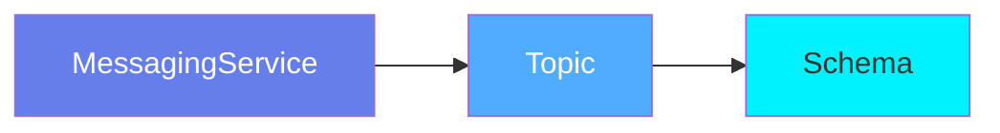

# MessagingService

**Event streaming and message broker platforms - the backbone of event-driven architecture**

---

## Overview

The **MessagingService** entity represents message broker and event streaming platforms like Apache Kafka, Amazon Kinesis, Apache Pulsar, RabbitMQ, and Google Pub/Sub. It serves as the top-level container for organizing topics, queues, and event streams.

**Hierarchy**:


---

## Relationships

MessagingService has comprehensive relationships with entities across the metadata platform:

```mermaid
graph TD
    subgraph Service Layer
        A[MessagingService<br/>kafka_prod]
    end

    subgraph Topics & Schemas
        A --> B1[Topic:<br/>customer.events]
        A --> B2[Topic:<br/>order.events]
        A --> B3[Topic:<br/>payment.events]

        B1 --> C1[Schema:<br/>CustomerEvent v2<br/>Avro]
        B1 --> C2[Partition: 0-9<br/>Replicas: 3]

        B2 --> C3[Schema:<br/>OrderEvent v3<br/>JSON]
        B2 --> C4[Partition: 0-15<br/>Replicas: 3]

        B3 --> C5[Schema:<br/>PaymentEvent v1<br/>Protobuf]
        B3 --> C6[Partition: 0-5<br/>Replicas: 5]
    end

    subgraph Ownership
        A -.->|owned by| D1[Team:<br/>Data Platform]
        A -.->|owned by| D2[User:<br/>kafka.admin]
    end

    subgraph Governance
        A -.->|in domain| E[Domain:<br/>Event Streaming]
        A -.->|has tags| F1[Tag:<br/>Production]
        A -.->|has tags| F2[Tag:<br/>Real-time]
        A -.->|has tags| F3[Tag:<br/>Tier.Gold]
    end

    subgraph Producers
        G1[Pipeline:<br/>customer_cdc] -.->|produces to| B1
        G2[Application:<br/>Order Service] -.->|produces to| B2
        G3[Pipeline:<br/>payment_processor] -.->|produces to| B3

        H1[Table:<br/>customers] -.->|CDC to| B1
        H2[Table:<br/>orders] -.->|CDC to| B2
    end

    subgraph Consumers
        I1[Pipeline:<br/>customer_analytics] -.->|consumes from| B1
        I2[Pipeline:<br/>order_enrichment] -.->|consumes from| B2
        I3[Application:<br/>Fraud Detection] -.->|consumes from| B3

        B1 -.->|writes to| J1[Table:<br/>customer_events_history]
        B2 -.->|writes to| J2[Table:<br/>order_events_history]
        B3 -.->|writes to| J3[Table:<br/>payment_events_history]
    end

    subgraph Monitoring
        K1[Dashboard:<br/>Kafka Monitoring] -.->|monitors| A
        K2[Dashboard:<br/>Topic Lag Monitor] -.->|tracks| B1
        K3[Dashboard:<br/>Event Analytics] -.->|analyzes| B2
    end

    subgraph Data Quality
        L1[TestCase:<br/>schema_validation] -.->|validates| C1
        L2[TestCase:<br/>message_lag_check] -.->|monitors| B1
        L3[TestCase:<br/>partition_balance] -.->|checks| B2
    end

    style A fill:#667eea,color:#fff,stroke:#4c51bf,stroke-width:3px
    style B1 fill:#4facfe,color:#fff
    style B2 fill:#4facfe,color:#fff
    style B3 fill:#4facfe,color:#fff
    style C1 fill:#00f2fe,color:#333
    style C2 fill:#00f2fe,color:#333
    style C3 fill:#00f2fe,color:#333
    style C4 fill:#00f2fe,color:#333
    style C5 fill:#00f2fe,color:#333
    style C6 fill:#00f2fe,color:#333
    style D1 fill:#43e97b,color:#fff
    style D2 fill:#43e97b,color:#fff
    style E fill:#fa709a,color:#fff
    style F1 fill:#f093fb,color:#fff
    style F2 fill:#f093fb,color:#fff
    style F3 fill:#f093fb,color:#fff
    style G1 fill:#00ac69,color:#fff
    style G2 fill:#00ac69,color:#fff
    style G3 fill:#00ac69,color:#fff
    style H1 fill:#764ba2,color:#fff
    style H2 fill:#764ba2,color:#fff
    style I1 fill:#f5576c,color:#fff
    style I2 fill:#f5576c,color:#fff
    style I3 fill:#f5576c,color:#fff
    style J1 fill:#ff6b6b,color:#fff
    style J2 fill:#ff6b6b,color:#fff
    style J3 fill:#ff6b6b,color:#fff
    style K1 fill:#ffd700,color:#333
    style K2 fill:#ffd700,color:#333
    style K3 fill:#ffd700,color:#333
    style L1 fill:#9b59b6,color:#fff
    style L2 fill:#9b59b6,color:#fff
    style L3 fill:#9b59b6,color:#fff
```



**Relationship Types**:

- **Solid lines (→)**: Hierarchical containment (Service manages Topics, Topics have Schemas and Partitions)
- **Dashed lines (-.->)**: References and associations (ownership, governance, producers, consumers, monitoring, quality)

---

### Child Entities
- **Topic**: Event streams and message topics managed by this service

### Associated Entities
- **Owner**: User or team owning this service
- **Domain**: Business domain assignment
- **Tag**: Classification tags
- **Pipeline**: Data pipelines producing/consuming events
- **Dashboard**: Dashboards monitoring event streams
- **Table**: Source tables (via CDC) and sink tables (event history)
- **Application**: Producer and consumer applications
- **TestCase**: Data quality tests for schema validation, lag monitoring, partition balance

---

## Schema Specifications

View the complete MessagingService schema in your preferred format:

=== "JSON Schema"

    **Complete JSON Schema Definition**

    ```json
    {
      "$id": "https://open-metadata.org/schema/entity/services/messagingService.json",
      "$schema": "http://json-schema.org/draft-07/schema#",
      "title": "MessagingService",
      "description": "A `MessagingService` represents a message broker or event streaming platform that manages topics and event streams.",
      "type": "object",
      "javaType": "org.openmetadata.schema.entity.services.MessagingService",

      "definitions": {
        "messagingServiceType": {
          "description": "Type of messaging service",
          "type": "string",
          "enum": [
            "Kafka", "Pulsar", "Kinesis", "Redpanda",
            "RabbitMQ", "ActiveMQ", "AzureEventHub",
            "GooglePubSub", "Confluent"
          ]
        },
        "messagingConnection": {
          "type": "object",
          "properties": {
            "type": {
              "$ref": "#/definitions/messagingServiceType"
            },
            "brokerUrl": {
              "type": "string",
              "description": "Broker connection URL"
            },
            "schemaRegistry": {
              "type": "string",
              "description": "Schema registry URL"
            },
            "securityProtocol": {
              "type": "string",
              "enum": ["PLAINTEXT", "SSL", "SASL_PLAINTEXT", "SASL_SSL"]
            },
            "saslMechanism": {
              "type": "string",
              "enum": ["PLAIN", "SCRAM-SHA-256", "SCRAM-SHA-512", "GSSAPI", "OAUTHBEARER"]
            }
          },
          "required": ["type", "brokerUrl"]
        }
      },

      "properties": {
        "id": {
          "description": "Unique identifier",
          "$ref": "../../type/basic.json#/definitions/uuid"
        },
        "name": {
          "description": "Service name",
          "$ref": "../../type/basic.json#/definitions/entityName"
        },
        "fullyQualifiedName": {
          "description": "Fully qualified name: service_name",
          "$ref": "../../type/basic.json#/definitions/fullyQualifiedEntityName"
        },
        "displayName": {
          "description": "Display name",
          "type": "string"
        },
        "description": {
          "description": "Markdown description",
          "$ref": "../../type/basic.json#/definitions/markdown"
        },
        "serviceType": {
          "$ref": "#/definitions/messagingServiceType"
        },
        "connection": {
          "description": "Connection configuration",
          "$ref": "#/definitions/messagingConnection"
        },
        "topics": {
          "description": "Topics in this service",
          "type": "array",
          "items": {
            "$ref": "../../type/entityReference.json"
          }
        },
        "owner": {
          "description": "Owner (user or team)",
          "$ref": "../../type/entityReference.json"
        },
        "domain": {
          "description": "Data domain",
          "$ref": "../../type/entityReference.json"
        },
        "tags": {
          "description": "Classification tags",
          "type": "array",
          "items": {
            "$ref": "../../type/tagLabel.json"
          }
        },
        "version": {
          "description": "Metadata version",
          "$ref": "../../type/entityHistory.json#/definitions/entityVersion"
        }
      },

      "required": ["id", "name", "serviceType", "connection"]
    }
    ```

    **[View Full JSON Schema →](https://github.com/open-metadata/OpenMetadataStandards/blob/main/schemas/entity/services/messagingService.json)**

=== "RDF"

    **RDF/OWL Ontology Definition**

    ```turtle
    @prefix om: <https://open-metadata.org/schema/> .
    @prefix rdfs: <http://www.w3.org/2000/01/rdf-schema#> .
    @prefix owl: <http://www.w3.org/2001/XMLSchema#> .
    @prefix xsd: <http://www.w3.org/2001/XMLSchema#> .

    # MessagingService Class Definition
    om:MessagingService a owl:Class ;
        rdfs:subClassOf om:Service ;
        rdfs:label "MessagingService" ;
        rdfs:comment "A message broker or event streaming platform managing topics and event streams" ;
        om:hierarchyLevel 1 .

    # Properties
    om:serviceName a owl:DatatypeProperty ;
        rdfs:domain om:MessagingService ;
        rdfs:range xsd:string ;
        rdfs:label "name" ;
        rdfs:comment "Name of the messaging service" .

    om:serviceType a owl:DatatypeProperty ;
        rdfs:domain om:MessagingService ;
        rdfs:range om:MessagingServiceType ;
        rdfs:label "serviceType" ;
        rdfs:comment "Type: Kafka, Pulsar, Kinesis, etc." .

    om:brokerUrl a owl:DatatypeProperty ;
        rdfs:domain om:MessagingService ;
        rdfs:range xsd:anyURI ;
        rdfs:label "brokerUrl" ;
        rdfs:comment "Broker connection URL" .

    om:schemaRegistryUrl a owl:DatatypeProperty ;
        rdfs:domain om:MessagingService ;
        rdfs:range xsd:anyURI ;
        rdfs:label "schemaRegistry" ;
        rdfs:comment "Schema registry endpoint URL" .

    om:hasTopic a owl:ObjectProperty ;
        rdfs:domain om:MessagingService ;
        rdfs:range om:Topic ;
        rdfs:label "hasTopic" ;
        rdfs:comment "Topics managed by this service" .

    om:ownedBy a owl:ObjectProperty ;
        rdfs:domain om:MessagingService ;
        rdfs:range om:Owner ;
        rdfs:label "ownedBy" ;
        rdfs:comment "User or team that owns this service" .

    om:hasTag a owl:ObjectProperty ;
        rdfs:domain om:MessagingService ;
        rdfs:range om:Tag ;
        rdfs:label "hasTag" ;
        rdfs:comment "Classification tags applied to service" .

    # MessagingServiceType Enumeration
    om:MessagingServiceType a owl:Class ;
        owl:oneOf (
            om:KafkaService
            om:PulsarService
            om:KinesisService
            om:RedpandaService
            om:RabbitMQService
            om:GooglePubSubService
        ) .

    # Example Instance
    ex:kafkaProduction a om:MessagingService ;
        om:serviceName "kafka_prod" ;
        om:fullyQualifiedName "kafka_prod" ;
        om:serviceType om:KafkaService ;
        om:brokerUrl "kafka-prod.example.com:9092" ;
        om:schemaRegistryUrl "https://schema-registry.example.com" ;
        om:ownedBy ex:dataEngineeringTeam ;
        om:hasTag ex:tierCritical ;
        om:hasTopic ex:userEventsTopic ;
        om:hasTopic ex:orderEventsTopic .
    ```

    **[View Full RDF Ontology →](https://github.com/open-metadata/OpenMetadataStandards/blob/main/rdf/ontology/openmetadata.ttl)**

=== "JSON-LD"

    **JSON-LD Context and Example**

    ```json
    {
      "@context": {
        "@vocab": "https://open-metadata.org/schema/",
        "om": "https://open-metadata.org/schema/",
        "rdfs": "http://www.w3.org/2000/01/rdf-schema#",
        "xsd": "http://www.w3.org/2001/XMLSchema#",

        "MessagingService": "om:MessagingService",
        "name": {
          "@id": "om:serviceName",
          "@type": "xsd:string"
        },
        "fullyQualifiedName": {
          "@id": "om:fullyQualifiedName",
          "@type": "xsd:string"
        },
        "displayName": {
          "@id": "om:displayName",
          "@type": "xsd:string"
        },
        "description": {
          "@id": "om:description",
          "@type": "xsd:string"
        },
        "serviceType": {
          "@id": "om:serviceType",
          "@type": "@vocab"
        },
        "connection": {
          "@id": "om:hasConnection",
          "@type": "@id"
        },
        "topics": {
          "@id": "om:hasTopic",
          "@type": "@id",
          "@container": "@set"
        },
        "owner": {
          "@id": "om:ownedBy",
          "@type": "@id"
        },
        "domain": {
          "@id": "om:inDomain",
          "@type": "@id"
        },
        "tags": {
          "@id": "om:hasTag",
          "@type": "@id",
          "@container": "@set"
        }
      }
    }
    ```

    **Example JSON-LD Instance**:

    ```json
    {
      "@context": "https://open-metadata.org/context/messagingService.jsonld",
      "@type": "MessagingService",
      "@id": "https://example.com/services/kafka_prod",

      "name": "kafka_prod",
      "fullyQualifiedName": "kafka_prod",
      "displayName": "Kafka Production Cluster",
      "description": "Production Kafka cluster for real-time event streaming",
      "serviceType": "Kafka",

      "connection": {
        "type": "Kafka",
        "brokerUrl": "kafka-prod.example.com:9092",
        "schemaRegistry": "https://schema-registry.example.com",
        "securityProtocol": "SASL_SSL",
        "saslMechanism": "SCRAM-SHA-256"
      },

      "owner": {
        "@id": "https://example.com/teams/data-engineering",
        "@type": "Team",
        "name": "DataEngineering"
      },

      "domain": {
        "@id": "https://example.com/domains/Engineering",
        "@type": "Domain",
        "name": "Engineering"
      },

      "tags": [
        {
          "@id": "https://open-metadata.org/tags/Tier/Critical",
          "tagFQN": "Tier.Critical"
        },
        {
          "@id": "https://open-metadata.org/tags/Environment/Production",
          "tagFQN": "Environment.Production"
        }
      ],

      "topics": [
        {
          "@id": "https://example.com/topics/user_events",
          "@type": "Topic",
          "name": "user_events",
          "fullyQualifiedName": "kafka_prod.user_events"
        },
        {
          "@id": "https://example.com/topics/order_events",
          "@type": "Topic",
          "name": "order_events",
          "fullyQualifiedName": "kafka_prod.order_events"
        }
      ]
    }
    ```

    **[View Full JSON-LD Context →](https://github.com/open-metadata/OpenMetadataStandards/blob/main/rdf/contexts/messagingService.jsonld)**

---

## Use Cases

- Catalog Kafka, Pulsar, Kinesis, and other messaging platforms
- Document event streaming architecture and topology
- Track topic ownership and governance
- Monitor schema evolution across topics
- Discover event-driven data flows
- Apply compliance tags to sensitive event streams
- Integrate with schema registries (Confluent, Apicurio)
- Map event lineage from producers to consumers
- Manage real-time data pipelines

---

## JSON Schema Specification

### Core Properties

#### `id` (uuid)
**Type**: `string` (UUID format)
**Required**: Yes (system-generated)
**Description**: Unique identifier for this messaging service instance

```json
{
  "id": "a1b2c3d4-e5f6-7g8h-9i0j-k1l2m3n4o5p6"
}
```

---

#### `name` (entityName)
**Type**: `string`
**Required**: Yes
**Pattern**: `^[^.]*$` (no dots allowed)
**Min Length**: 1
**Max Length**: 256
**Description**: Name of the messaging service

```json
{
  "name": "kafka_prod"
}
```

---

#### `fullyQualifiedName` (fullyQualifiedEntityName)
**Type**: `string`
**Required**: Yes (system-generated)
**Pattern**: `^((?!::).)*$`
**Description**: Fully qualified name (same as name for services)

```json
{
  "fullyQualifiedName": "kafka_prod"
}
```

---

#### `displayName`
**Type**: `string`
**Required**: No
**Description**: Human-readable display name

```json
{
  "displayName": "Kafka Production Cluster"
}
```

---

#### `description` (markdown)
**Type**: `string` (Markdown format)
**Required**: No
**Description**: Rich text description of the service's purpose and configuration

```json
{
  "description": "# Kafka Production Cluster\n\nProduction Kafka cluster for real-time event streaming.\n\n## Configuration\n- 12 brokers across 3 availability zones\n- Replication factor: 3\n- Min ISR: 2\n\n## Usage\n- User activity events\n- Order transaction streams\n- Audit logs"
}
```

---

### Service Configuration

#### `serviceType` (messagingServiceType)
**Type**: `string` enum
**Required**: Yes
**Allowed Values**:

- `Kafka` - Apache Kafka
- `Pulsar` - Apache Pulsar
- `Kinesis` - Amazon Kinesis
- `Redpanda` - Redpanda
- `RabbitMQ` - RabbitMQ
- `ActiveMQ` - Apache ActiveMQ
- `AzureEventHub` - Azure Event Hubs
- `GooglePubSub` - Google Cloud Pub/Sub
- `Confluent` - Confluent Cloud

```json
{
  "serviceType": "Kafka"
}
```

---

#### `connection` (messagingConnection)
**Type**: `object`
**Required**: Yes
**Description**: Connection configuration for the messaging platform

**Connection Properties**:

| Property | Type | Required | Description |
|----------|------|----------|-------------|
| `type` | messagingServiceType | Yes | Service type |
| `brokerUrl` | string | Yes | Broker connection URL |
| `schemaRegistry` | string | No | Schema registry URL |
| `securityProtocol` | enum | No | PLAINTEXT, SSL, SASL_PLAINTEXT, SASL_SSL |
| `saslMechanism` | enum | No | PLAIN, SCRAM-SHA-256, SCRAM-SHA-512, GSSAPI, OAUTHBEARER |
| `consumerConfig` | object | No | Additional consumer configuration |
| `producerConfig` | object | No | Additional producer configuration |

**Example**:

```json
{
  "connection": {
    "type": "Kafka",
    "brokerUrl": "kafka-prod.example.com:9092",
    "schemaRegistry": "https://schema-registry.example.com",
    "securityProtocol": "SASL_SSL",
    "saslMechanism": "SCRAM-SHA-256",
    "consumerConfig": {
      "auto.offset.reset": "earliest",
      "enable.auto.commit": "false"
    },
    "producerConfig": {
      "compression.type": "snappy",
      "acks": "all"
    }
  }
}
```

---

### Child Resources

#### `topics[]` (Topic[])
**Type**: `array` of Topic references
**Required**: No (populated by discovery)
**Description**: Topics managed by this service

```json
{
  "topics": [
    {
      "id": "topic-uuid-1",
      "type": "topic",
      "name": "user_events",
      "fullyQualifiedName": "kafka_prod.user_events"
    },
    {
      "id": "topic-uuid-2",
      "type": "topic",
      "name": "order_events",
      "fullyQualifiedName": "kafka_prod.order_events"
    }
  ]
}
```

---

### Governance Properties

#### `owner` (EntityReference)
**Type**: `object`
**Required**: No
**Description**: User or team that owns this service

```json
{
  "owner": {
    "id": "team-uuid",
    "type": "team",
    "name": "DataEngineering",
    "displayName": "Data Engineering Team"
  }
}
```

---

#### `domain` (EntityReference)
**Type**: `object`
**Required**: No
**Description**: Data domain this service belongs to

```json
{
  "domain": {
    "id": "domain-uuid",
    "type": "domain",
    "name": "Engineering",
    "fullyQualifiedName": "Engineering"
  }
}
```

---

#### `tags[]` (TagLabel[])
**Type**: `array`
**Required**: No
**Description**: Classification tags applied to the service

```json
{
  "tags": [
    {
      "tagFQN": "Tier.Critical",
      "description": "Critical infrastructure",
      "source": "Classification",
      "labelType": "Manual",
      "state": "Confirmed"
    },
    {
      "tagFQN": "Environment.Production",
      "source": "Classification",
      "labelType": "Manual",
      "state": "Confirmed"
    }
  ]
}
```

---

### Versioning Properties

#### `version` (entityVersion)
**Type**: `number`
**Required**: Yes (system-managed)
**Description**: Metadata version number, incremented on changes

```json
{
  "version": 1.2
}
```

---

#### `updatedAt` (timestamp)
**Type**: `integer` (Unix epoch milliseconds)
**Required**: Yes (system-managed)
**Description**: Last update timestamp

```json
{
  "updatedAt": 1704240000000
}
```

---

#### `updatedBy` (string)
**Type**: `string`
**Required**: Yes (system-managed)
**Description**: User who made the update

```json
{
  "updatedBy": "admin"
}
```

---

## Complete Example

```json
{
  "id": "a1b2c3d4-e5f6-7g8h-9i0j-k1l2m3n4o5p6",
  "name": "kafka_prod",
  "fullyQualifiedName": "kafka_prod",
  "displayName": "Kafka Production Cluster",
  "description": "# Kafka Production Cluster\n\nProduction Kafka cluster for real-time event streaming.",
  "serviceType": "Kafka",
  "connection": {
    "type": "Kafka",
    "brokerUrl": "kafka-prod.example.com:9092",
    "schemaRegistry": "https://schema-registry.example.com",
    "securityProtocol": "SASL_SSL",
    "saslMechanism": "SCRAM-SHA-256"
  },
  "topics": [
    {
      "id": "topic-uuid-1",
      "type": "topic",
      "name": "user_events",
      "fullyQualifiedName": "kafka_prod.user_events"
    }
  ],
  "owner": {
    "id": "team-uuid",
    "type": "team",
    "name": "DataEngineering"
  },
  "domain": {
    "id": "domain-uuid",
    "type": "domain",
    "name": "Engineering"
  },
  "tags": [
    {"tagFQN": "Tier.Critical"},
    {"tagFQN": "Environment.Production"}
  ],
  "version": 1.2,
  "updatedAt": 1704240000000,
  "updatedBy": "admin"
}
```

---

## RDF Representation

### Ontology Class

```turtle
@prefix om: <https://open-metadata.org/schema/> .
@prefix rdfs: <http://www.w3.org/2000/01/rdf-schema#> .
@prefix owl: <http://www.w3.org/2001/XMLSchema#> .

om:MessagingService a owl:Class ;
    rdfs:subClassOf om:Service ;
    rdfs:label "MessagingService" ;
    rdfs:comment "A message broker or event streaming platform" ;
    om:hasProperties [
        om:name "string" ;
        om:serviceType "MessagingServiceType" ;
        om:brokerUrl "URI" ;
        om:topics "Topic[]" ;
        om:owner "Owner" ;
        om:tags "Tag[]" ;
    ] .
```

### Instance Example

```turtle
@prefix om: <https://open-metadata.org/schema/> .
@prefix ex: <https://example.com/services/> .

ex:kafka_prod a om:MessagingService ;
    om:name "kafka_prod" ;
    om:fullyQualifiedName "kafka_prod" ;
    om:displayName "Kafka Production Cluster" ;
    om:description "Production Kafka cluster for real-time event streaming" ;
    om:serviceType "Kafka" ;
    om:brokerUrl "kafka-prod.example.com:9092" ;
    om:schemaRegistryUrl "https://schema-registry.example.com" ;
    om:ownedBy ex:dataEngineeringTeam ;
    om:hasTag ex:tierCritical ;
    om:hasTopic ex:userEventsTopic ;
    om:hasTopic ex:orderEventsTopic .
```

---

## JSON-LD Context

```json
{
  "@context": {
    "@vocab": "https://open-metadata.org/schema/",
    "om": "https://open-metadata.org/schema/",
    "MessagingService": "om:MessagingService",
    "name": "om:name",
    "fullyQualifiedName": "om:fullyQualifiedName",
    "displayName": "om:displayName",
    "serviceType": "om:serviceType",
    "connection": {
      "@id": "om:hasConnection",
      "@type": "@id"
    },
    "topics": {
      "@id": "om:hasTopic",
      "@type": "@id",
      "@container": "@set"
    },
    "owner": {
      "@id": "om:ownedBy",
      "@type": "@id"
    },
    "tags": {
      "@id": "om:hasTag",
      "@type": "@id",
      "@container": "@set"
    }
  }
}
```

### JSON-LD Example

```json
{
  "@context": "https://open-metadata.org/context/messagingService.jsonld",
  "@type": "MessagingService",
  "@id": "https://example.com/services/kafka_prod",
  "name": "kafka_prod",
  "serviceType": "Kafka",
  "connection": {
    "brokerUrl": "kafka-prod.example.com:9092",
    "schemaRegistry": "https://schema-registry.example.com"
  },
  "owner": {
    "@id": "https://example.com/teams/data-engineering",
    "@type": "Team"
  },
  "topics": [
    {
      "@id": "https://example.com/topics/user_events",
      "@type": "Topic"
    }
  ]
}
```

---

## Custom Properties

This entity supports custom properties through the `extension` field.
Common custom properties include:

- **Data Classification**: Sensitivity level
- **Cost Center**: Billing allocation
- **Retention Period**: Data retention requirements
- **Application Owner**: Owning application/team

See [Custom Properties](../../metadata-specifications/custom-properties.md)
for details on defining and using custom properties.

---

## API Operations

### Create MessagingService

```http
POST /api/v1/services/messagingServices
Content-Type: application/json

{
  "name": "kafka_prod",
  "serviceType": "Kafka",
  "connection": {
    "type": "Kafka",
    "brokerUrl": "kafka-prod.example.com:9092",
    "schemaRegistry": "https://schema-registry.example.com"
  }
}
```

### Get MessagingService

```http
GET /api/v1/services/messagingServices/name/kafka_prod?fields=topics,owner,tags
```

### Update MessagingService

```http
PATCH /api/v1/services/messagingServices/{id}
Content-Type: application/json-patch+json

[
  {
    "op": "add",
    "path": "/tags/-",
    "value": {"tagFQN": "Tier.Critical"}
  }
]
```

### Test Connection

```http
POST /api/v1/services/messagingServices/testConnection
Content-Type: application/json

{
  "connection": {
    "type": "Kafka",
    "brokerUrl": "kafka-prod.example.com:9092"
  }
}
```

---

## Related Documentation

- **[Topic](topic.md)** - Topic entity specification
- **[Messaging Overview](overview.md)** - Messaging assets overview
- **[Schema Registry Integration](../../integration/schema-registry.md)** - Schema management
- **[Event Lineage](../../lineage/event-lineage.md)** - Event-driven lineage
- **[Data Pipelines](../../orchestration/overview.md)** - Pipeline integration
