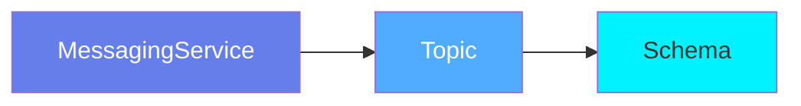

# MessagingService

**Event streaming and message broker platforms - the backbone of event-driven architecture**

---

## Overview

The **MessagingService** entity represents message broker and event streaming platforms like Apache Kafka, Amazon Kinesis, Apache Pulsar, RabbitMQ, and Google Pub/Sub. It serves as the top-level container for organizing topics, queues, and event streams.

**Hierarchy**:


---

## Relationships

MessagingService has comprehensive relationships with entities across the metadata platform:

```mermaid
graph TD
    subgraph Service Layer
        A[MessagingService<br/>kafka_prod]
    end

    subgraph Topics & Schemas
        A --> B1[Topic:<br/>customer.events]
        A --> B2[Topic:<br/>order.events]
        A --> B3[Topic:<br/>payment.events]

        B1 --> C1[Schema:<br/>CustomerEvent v2<br/>Avro]
        B1 --> C2[Partition: 0-9<br/>Replicas: 3]

        B2 --> C3[Schema:<br/>OrderEvent v3<br/>JSON]
        B2 --> C4[Partition: 0-15<br/>Replicas: 3]

        B3 --> C5[Schema:<br/>PaymentEvent v1<br/>Protobuf]
        B3 --> C6[Partition: 0-5<br/>Replicas: 5]
    end

    subgraph Ownership
        A -.->|owned by| D1[Team:<br/>Data Platform]
        A -.->|owned by| D2[User:<br/>kafka.admin]
    end

    subgraph Governance
        A -.->|in domain| E[Domain:<br/>Event Streaming]
        A -.->|has tags| F1[Tag:<br/>Production]
        A -.->|has tags| F2[Tag:<br/>Real-time]
        A -.->|has tags| F3[Tag:<br/>Tier.Gold]
    end

    subgraph Producers
        G1[Pipeline:<br/>customer_cdc] -.->|produces to| B1
        G2[Application:<br/>Order Service] -.->|produces to| B2
        G3[Pipeline:<br/>payment_processor] -.->|produces to| B3

        H1[Table:<br/>customers] -.->|CDC to| B1
        H2[Table:<br/>orders] -.->|CDC to| B2
    end

    subgraph Consumers
        I1[Pipeline:<br/>customer_analytics] -.->|consumes from| B1
        I2[Pipeline:<br/>order_enrichment] -.->|consumes from| B2
        I3[Application:<br/>Fraud Detection] -.->|consumes from| B3

        B1 -.->|writes to| J1[Table:<br/>customer_events_history]
        B2 -.->|writes to| J2[Table:<br/>order_events_history]
        B3 -.->|writes to| J3[Table:<br/>payment_events_history]
    end

    subgraph Monitoring
        K1[Dashboard:<br/>Kafka Monitoring] -.->|monitors| A
        K2[Dashboard:<br/>Topic Lag Monitor] -.->|tracks| B1
        K3[Dashboard:<br/>Event Analytics] -.->|analyzes| B2
    end

    subgraph Data Quality
        L1[TestCase:<br/>schema_validation] -.->|validates| C1
        L2[TestCase:<br/>message_lag_check] -.->|monitors| B1
        L3[TestCase:<br/>partition_balance] -.->|checks| B2
    end

    style A fill:#667eea,color:#fff,stroke:#4c51bf,stroke-width:3px
    style B1 fill:#4facfe,color:#fff
    style B2 fill:#4facfe,color:#fff
    style B3 fill:#4facfe,color:#fff
    style C1 fill:#00f2fe,color:#333
    style C2 fill:#00f2fe,color:#333
    style C3 fill:#00f2fe,color:#333
    style C4 fill:#00f2fe,color:#333
    style C5 fill:#00f2fe,color:#333
    style C6 fill:#00f2fe,color:#333
    style D1 fill:#43e97b,color:#fff
    style D2 fill:#43e97b,color:#fff
    style E fill:#fa709a,color:#fff
    style F1 fill:#f093fb,color:#fff
    style F2 fill:#f093fb,color:#fff
    style F3 fill:#f093fb,color:#fff
    style G1 fill:#00ac69,color:#fff
    style G2 fill:#00ac69,color:#fff
    style G3 fill:#00ac69,color:#fff
    style H1 fill:#764ba2,color:#fff
    style H2 fill:#764ba2,color:#fff
    style I1 fill:#f5576c,color:#fff
    style I2 fill:#f5576c,color:#fff
    style I3 fill:#f5576c,color:#fff
    style J1 fill:#ff6b6b,color:#fff
    style J2 fill:#ff6b6b,color:#fff
    style J3 fill:#ff6b6b,color:#fff
    style K1 fill:#ffd700,color:#333
    style K2 fill:#ffd700,color:#333
    style K3 fill:#ffd700,color:#333
    style L1 fill:#9b59b6,color:#fff
    style L2 fill:#9b59b6,color:#fff
    style L3 fill:#9b59b6,color:#fff
```



**Relationship Types**:

- **Solid lines (→)**: Hierarchical containment (Service manages Topics, Topics have Schemas and Partitions)
- **Dashed lines (-.->)**: References and associations (ownership, governance, producers, consumers, monitoring, quality)

---

### Child Entities
- **Pipeline**: Ingestion pipelines for extracting topic configs and schemas

### Associated Entities
- **Owners**: Users or teams owning this service (plural)
- **Domains**: Business domain assignments (plural)
- **DataProducts**: Data products this service is part of
- **Followers**: Users following this service
- **Tags**: Classification tags
- **IngestionRunner**: The ingestion agent responsible for executing pipelines
- **TestConnectionResult**: Connection test status and results

---

## Schema Specifications

View the complete MessagingService schema in your preferred format:

=== "JSON Schema"

    **Complete JSON Schema Definition**

    ```json
    {
      "$id": "https://open-metadata.org/schema/entity/services/messagingService.json",
      "$schema": "http://json-schema.org/draft-07/schema#",
      "title": "Messaging Service",
      "description": "This schema defines the Messaging Service entity, such as Kafka and Pulsar.",
      "type": "object",
      "javaType": "org.openmetadata.schema.entity.services.MessagingService",
      "javaInterfaces": [
        "org.openmetadata.schema.EntityInterface",
        "org.openmetadata.schema.ServiceEntityInterface"
      ],

      "definitions": {
        "messagingServiceType": {
          "description": "Type of messaging service - Kafka or Pulsar.",
          "type": "string",
          "javaInterfaces": ["org.openmetadata.schema.EnumInterface"],
          "enum": ["Kafka", "Redpanda", "Kinesis", "CustomMessaging"],
          "javaEnums": [
            { "name": "Kafka" },
            { "name": "Redpanda" },
            { "name": "Kinesis" },
            { "name": "CustomMessaging" }
          ]
        },
        "brokers": {
          "description": "Multiple bootstrap addresses for Kafka. Single proxy address for Pulsar.",
          "type": "array",
          "items": {
            "type": "string"
          },
          "default": null
        },
        "messagingConnection": {
          "type": "object",
          "javaType": "org.openmetadata.schema.type.MessagingConnection",
          "description": "Dashboard Connection.",
          "javaInterfaces": [
            "org.openmetadata.schema.ServiceConnectionEntityInterface"
          ],
          "properties": {
            "config": {
              "mask": true,
              "oneOf": [
                { "$ref": "./connections/messaging/kafkaConnection.json" },
                { "$ref": "./connections/messaging/redpandaConnection.json" },
                { "$ref": "./connections/messaging/kinesisConnection.json" },
                { "$ref": "connections/messaging/customMessagingConnection.json" }
              ]
            }
          },
          "additionalProperties": false
        }
      },

      "properties": {
        "id": {
          "description": "Unique identifier of this messaging service instance.",
          "$ref": "../../type/basic.json#/definitions/uuid"
        },
        "name": {
          "description": "Name that identifies this messaging service.",
          "$ref": "../../type/basic.json#/definitions/entityName"
        },
        "fullyQualifiedName": {
          "description": "FullyQualifiedName same as `name`.",
          "$ref": "../../type/basic.json#/definitions/fullyQualifiedEntityName"
        },
        "serviceType": {
          "description": "Type of messaging service such as Kafka or Pulsar...",
          "$ref": "#/definitions/messagingServiceType"
        },
        "description": {
          "description": "Description of a messaging service instance.",
          "$ref": "../../type/basic.json#/definitions/markdown"
        },
        "displayName": {
          "description": "Display Name that identifies this messaging service. It could be title or label from the source services.",
          "type": "string"
        },
        "connection": {
          "$ref": "#/definitions/messagingConnection"
        },
        "pipelines": {
          "description": "References to pipelines deployed for this messaging service to extract topic configs and schemas.",
          "$ref": "../../type/entityReferenceList.json"
        },
        "testConnectionResult": {
          "description": "Last test connection results for this service",
          "$ref": "connections/testConnectionResult.json"
        },
        "tags": {
          "description": "Tags for this Message Service.",
          "type": "array",
          "items": {
            "$ref": "../../type/tagLabel.json"
          },
          "default": []
        },
        "version": {
          "description": "Metadata version of the entity.",
          "$ref": "../../type/entityHistory.json#/definitions/entityVersion"
        },
        "updatedAt": {
          "description": "Last update time corresponding to the new version of the entity in Unix epoch time milliseconds.",
          "$ref": "../../type/basic.json#/definitions/timestamp"
        },
        "updatedBy": {
          "description": "User who made the update.",
          "type": "string"
        },
        "impersonatedBy": {
          "description": "Bot user that performed the action on behalf of the actual user.",
          "$ref": "../../type/basic.json#/definitions/impersonatedBy"
        },
        "owners": {
          "description": "Owners of this messaging service.",
          "$ref": "../../type/entityReferenceList.json"
        },
        "href": {
          "description": "Link to the resource corresponding to this messaging service.",
          "$ref": "../../type/basic.json#/definitions/href"
        },
        "changeDescription": {
          "description": "Change that lead to this version of the entity.",
          "$ref": "../../type/entityHistory.json#/definitions/changeDescription"
        },
        "incrementalChangeDescription": {
          "description": "Change that lead to this version of the entity.",
          "$ref": "../../type/entityHistory.json#/definitions/changeDescription"
        },
        "deleted": {
          "description": "When `true` indicates the entity has been soft deleted.",
          "type": "boolean",
          "default": false
        },
        "dataProducts": {
          "description": "List of data products this entity is part of.",
          "$ref": "../../type/entityReferenceList.json"
        },
        "domains": {
          "description": "Domains the Messaging service belongs to.",
          "$ref": "../../type/entityReferenceList.json"
        },
        "followers": {
          "description": "Followers of this entity.",
          "$ref": "../../type/entityReferenceList.json"
        },
        "ingestionRunner": {
          "description": "The ingestion agent responsible for executing the ingestion pipeline.",
          "$ref": "../../type/entityReference.json"
        }
      },

      "required": ["id", "name", "serviceType"],
      "additionalProperties": false
    }
    ```

    **[View Full JSON Schema →](https://github.com/open-metadata/OpenMetadataStandards/blob/main/schemas/entity/services/messagingService.json)**

=== "RDF"

    **RDF/OWL Ontology Definition**

    ```turtle
    @prefix om: <https://open-metadata.org/schema/> .
    @prefix rdfs: <http://www.w3.org/2000/01/rdf-schema#> .
    @prefix owl: <http://www.w3.org/2002/07/owl#> .
    @prefix xsd: <http://www.w3.org/2001/XMLSchema#> .

    # MessagingService Class Definition
    om:MessagingService a owl:Class ;
        rdfs:subClassOf om:Service ;
        rdfs:label "MessagingService" ;
        rdfs:comment "This schema defines the Messaging Service entity, such as Kafka and Pulsar." ;
        om:hierarchyLevel 1 .

    # Datatype Properties
    om:serviceName a owl:DatatypeProperty ;
        rdfs:domain om:MessagingService ;
        rdfs:range xsd:string ;
        rdfs:label "name" ;
        rdfs:comment "Name that identifies this messaging service" .

    om:fullyQualifiedName a owl:DatatypeProperty ;
        rdfs:domain om:MessagingService ;
        rdfs:range xsd:string ;
        rdfs:label "fullyQualifiedName" ;
        rdfs:comment "FullyQualifiedName same as name" .

    om:displayName a owl:DatatypeProperty ;
        rdfs:domain om:MessagingService ;
        rdfs:range xsd:string ;
        rdfs:label "displayName" ;
        rdfs:comment "Display Name that identifies this messaging service" .

    om:description a owl:DatatypeProperty ;
        rdfs:domain om:MessagingService ;
        rdfs:range xsd:string ;
        rdfs:label "description" ;
        rdfs:comment "Description of a messaging service instance" .

    om:serviceType a owl:DatatypeProperty ;
        rdfs:domain om:MessagingService ;
        rdfs:range om:MessagingServiceType ;
        rdfs:label "serviceType" ;
        rdfs:comment "Type of messaging service such as Kafka or Pulsar" .

    om:deleted a owl:DatatypeProperty ;
        rdfs:domain om:MessagingService ;
        rdfs:range xsd:boolean ;
        rdfs:label "deleted" ;
        rdfs:comment "When true indicates the entity has been soft deleted" .

    # Object Properties
    om:hasConnection a owl:ObjectProperty ;
        rdfs:domain om:MessagingService ;
        rdfs:range om:MessagingConnection ;
        rdfs:label "connection" ;
        rdfs:comment "Connection configuration for the messaging service" .

    om:hasPipeline a owl:ObjectProperty ;
        rdfs:domain om:MessagingService ;
        rdfs:range om:Pipeline ;
        rdfs:label "pipelines" ;
        rdfs:comment "References to pipelines deployed for this messaging service" .

    om:hasOwner a owl:ObjectProperty ;
        rdfs:domain om:MessagingService ;
        rdfs:range om:EntityReference ;
        rdfs:label "owners" ;
        rdfs:comment "Owners of this messaging service" .

    om:hasTag a owl:ObjectProperty ;
        rdfs:domain om:MessagingService ;
        rdfs:range om:TagLabel ;
        rdfs:label "tags" ;
        rdfs:comment "Tags for this Message Service" .

    om:inDomain a owl:ObjectProperty ;
        rdfs:domain om:MessagingService ;
        rdfs:range om:Domain ;
        rdfs:label "domains" ;
        rdfs:comment "Domains the Messaging service belongs to" .

    om:hasDataProduct a owl:ObjectProperty ;
        rdfs:domain om:MessagingService ;
        rdfs:range om:DataProduct ;
        rdfs:label "dataProducts" ;
        rdfs:comment "List of data products this entity is part of" .

    om:hasFollower a owl:ObjectProperty ;
        rdfs:domain om:MessagingService ;
        rdfs:range om:EntityReference ;
        rdfs:label "followers" ;
        rdfs:comment "Followers of this entity" .

    om:hasIngestionRunner a owl:ObjectProperty ;
        rdfs:domain om:MessagingService ;
        rdfs:range om:EntityReference ;
        rdfs:label "ingestionRunner" ;
        rdfs:comment "The ingestion agent responsible for executing the ingestion pipeline" .

    # MessagingServiceType Enumeration
    om:MessagingServiceType a owl:Class ;
        owl:oneOf (
            om:Kafka
            om:Redpanda
            om:Kinesis
            om:CustomMessaging
        ) .

    # Example Instance
    ex:kafkaProduction a om:MessagingService ;
        om:serviceName "kafka_prod" ;
        om:fullyQualifiedName "kafka_prod" ;
        om:displayName "Kafka Production Cluster" ;
        om:description "Production Kafka cluster for real-time event streaming" ;
        om:serviceType om:Kafka ;
        om:hasConnection ex:kafkaProdConnection ;
        om:hasOwner ex:dataEngineeringTeam ;
        om:hasTag ex:tierCritical ;
        om:inDomain ex:engineeringDomain ;
        om:deleted false .
    ```

    **[View Full RDF Ontology →](https://github.com/open-metadata/OpenMetadataStandards/blob/main/rdf/ontology/openmetadata.ttl)**

=== "JSON-LD"

    **JSON-LD Context and Example**

    ```json
    {
      "@context": {
        "@vocab": "https://open-metadata.org/schema/",
        "om": "https://open-metadata.org/schema/",
        "rdfs": "http://www.w3.org/2000/01/rdf-schema#",
        "xsd": "http://www.w3.org/2001/XMLSchema#",

        "MessagingService": "om:MessagingService",
        "name": {
          "@id": "om:serviceName",
          "@type": "xsd:string"
        },
        "fullyQualifiedName": {
          "@id": "om:fullyQualifiedName",
          "@type": "xsd:string"
        },
        "displayName": {
          "@id": "om:displayName",
          "@type": "xsd:string"
        },
        "description": {
          "@id": "om:description",
          "@type": "xsd:string"
        },
        "serviceType": {
          "@id": "om:serviceType",
          "@type": "@vocab"
        },
        "connection": {
          "@id": "om:hasConnection",
          "@type": "@id"
        },
        "pipelines": {
          "@id": "om:hasPipeline",
          "@type": "@id",
          "@container": "@set"
        },
        "owners": {
          "@id": "om:hasOwner",
          "@type": "@id",
          "@container": "@set"
        },
        "domains": {
          "@id": "om:inDomain",
          "@type": "@id",
          "@container": "@set"
        },
        "dataProducts": {
          "@id": "om:hasDataProduct",
          "@type": "@id",
          "@container": "@set"
        },
        "followers": {
          "@id": "om:hasFollower",
          "@type": "@id",
          "@container": "@set"
        },
        "tags": {
          "@id": "om:hasTag",
          "@type": "@id",
          "@container": "@set"
        },
        "ingestionRunner": {
          "@id": "om:hasIngestionRunner",
          "@type": "@id"
        },
        "deleted": {
          "@id": "om:deleted",
          "@type": "xsd:boolean"
        }
      }
    }
    ```

    **Example JSON-LD Instance**:

    ```json
    {
      "@context": "https://open-metadata.org/context/messagingService.jsonld",
      "@type": "MessagingService",
      "@id": "https://example.com/services/kafka_prod",

      "name": "kafka_prod",
      "fullyQualifiedName": "kafka_prod",
      "displayName": "Kafka Production Cluster",
      "description": "Production Kafka cluster for real-time event streaming",
      "serviceType": "Kafka",

      "connection": {
        "@id": "https://example.com/connections/kafka_prod_conn",
        "config": {
          "@type": "KafkaConnection",
          "bootstrapServers": "kafka-prod.example.com:9092",
          "schemaRegistryURL": "https://schema-registry.example.com"
        }
      },

      "owners": [
        {
          "@id": "https://example.com/teams/data-engineering",
          "@type": "Team",
          "name": "DataEngineering"
        }
      ],

      "domains": [
        {
          "@id": "https://example.com/domains/Engineering",
          "@type": "Domain",
          "name": "Engineering"
        }
      ],

      "tags": [
        {
          "@id": "https://open-metadata.org/tags/Tier/Critical",
          "tagFQN": "Tier.Critical"
        },
        {
          "@id": "https://open-metadata.org/tags/Environment/Production",
          "tagFQN": "Environment.Production"
        }
      ],

      "pipelines": [
        {
          "@id": "https://example.com/pipelines/kafka_ingestion",
          "@type": "Pipeline",
          "name": "kafka_ingestion"
        }
      ],

      "deleted": false
    }
    ```

    **[View Full JSON-LD Context →](https://github.com/open-metadata/OpenMetadataStandards/blob/main/rdf/contexts/messagingService.jsonld)**

---

## Use Cases

- Catalog Kafka, Pulsar, Kinesis, and other messaging platforms
- Document event streaming architecture and topology
- Track topic ownership and governance
- Monitor schema evolution across topics
- Discover event-driven data flows
- Apply compliance tags to sensitive event streams
- Integrate with schema registries (Confluent, Apicurio)
- Map event lineage from producers to consumers
- Manage real-time data pipelines

---

## JSON Schema Specification

### Core Properties

#### `id` (uuid)
**Type**: `string` (UUID format)
**Required**: Yes (system-generated)
**Description**: Unique identifier for this messaging service instance

```json
{
  "id": "a1b2c3d4-e5f6-7g8h-9i0j-k1l2m3n4o5p6"
}
```

---

#### `name` (entityName)
**Type**: `string`
**Required**: Yes
**Pattern**: `^[^.]*$` (no dots allowed)
**Min Length**: 1
**Max Length**: 256
**Description**: Name of the messaging service

```json
{
  "name": "kafka_prod"
}
```

---

#### `fullyQualifiedName` (fullyQualifiedEntityName)
**Type**: `string`
**Required**: Yes (system-generated)
**Pattern**: `^((?!::).)*$`
**Description**: Fully qualified name (same as name for services)

```json
{
  "fullyQualifiedName": "kafka_prod"
}
```

---

#### `displayName`
**Type**: `string`
**Required**: No
**Description**: Human-readable display name

```json
{
  "displayName": "Kafka Production Cluster"
}
```

---

#### `description` (markdown)
**Type**: `string` (Markdown format)
**Required**: No
**Description**: Rich text description of the service's purpose and configuration

```json
{
  "description": "# Kafka Production Cluster\n\nProduction Kafka cluster for real-time event streaming.\n\n## Configuration\n- 12 brokers across 3 availability zones\n- Replication factor: 3\n- Min ISR: 2\n\n## Usage\n- User activity events\n- Order transaction streams\n- Audit logs"
}
```

---

### Service Configuration

#### `serviceType` (messagingServiceType)
**Type**: `string` enum
**Required**: Yes
**Allowed Values**:

- `Kafka` - Apache Kafka
- `Redpanda` - Redpanda
- `Kinesis` - Amazon Kinesis
- `CustomMessaging` - Custom messaging service

```json
{
  "serviceType": "Kafka"
}
```

---

#### `connection` (messagingConnection)
**Type**: `object`
**Required**: No
**Description**: Connection configuration for the messaging platform

The connection object contains a `config` property that uses `oneOf` to specify the connection type. The config can be one of:

- `kafkaConnection.json` - Apache Kafka connection configuration
- `redpandaConnection.json` - Redpanda connection configuration
- `kinesisConnection.json` - Amazon Kinesis connection configuration
- `customMessagingConnection.json` - Custom messaging service connection

**Example**:

```json
{
  "connection": {
    "config": {
      "type": "Kafka",
      "bootstrapServers": "kafka-prod.example.com:9092",
      "schemaRegistryURL": "https://schema-registry.example.com",
      "securityProtocol": "SASL_SSL",
      "saslMechanism": "SCRAM-SHA-256"
    }
  }
}
```

---

### Child Resources

#### `pipelines` (EntityReferenceList)
**Type**: `array` of Pipeline references
**Required**: No
**Description**: References to pipelines deployed for this messaging service to extract topic configs and schemas

```json
{
  "pipelines": [
    {
      "id": "pipeline-uuid-1",
      "type": "pipeline",
      "name": "kafka_metadata_ingestion",
      "fullyQualifiedName": "kafka_prod.kafka_metadata_ingestion"
    }
  ]
}
```

---

### Governance Properties

#### `owners` (EntityReferenceList)
**Type**: `array` of EntityReference
**Required**: No
**Description**: Owners of this messaging service

```json
{
  "owners": [
    {
      "id": "team-uuid",
      "type": "team",
      "name": "DataEngineering",
      "displayName": "Data Engineering Team"
    },
    {
      "id": "user-uuid",
      "type": "user",
      "name": "john.doe",
      "displayName": "John Doe"
    }
  ]
}
```

---

#### `domains` (EntityReferenceList)
**Type**: `array` of EntityReference
**Required**: No
**Description**: Domains the Messaging service belongs to

```json
{
  "domains": [
    {
      "id": "domain-uuid",
      "type": "domain",
      "name": "Engineering",
      "fullyQualifiedName": "Engineering"
    }
  ]
}
```

---

#### `tags[]` (TagLabel[])
**Type**: `array`
**Required**: No
**Default**: `[]`
**Description**: Tags for this Message Service

```json
{
  "tags": [
    {
      "tagFQN": "Tier.Critical",
      "description": "Critical infrastructure",
      "source": "Classification",
      "labelType": "Manual",
      "state": "Confirmed"
    },
    {
      "tagFQN": "Environment.Production",
      "source": "Classification",
      "labelType": "Manual",
      "state": "Confirmed"
    }
  ]
}
```

---

#### `dataProducts` (EntityReferenceList)
**Type**: `array` of EntityReference
**Required**: No
**Description**: List of data products this entity is part of

```json
{
  "dataProducts": [
    {
      "id": "dataproduct-uuid",
      "type": "dataProduct",
      "name": "CustomerDataProduct",
      "fullyQualifiedName": "CustomerDataProduct"
    }
  ]
}
```

---

#### `followers` (EntityReferenceList)
**Type**: `array` of EntityReference
**Required**: No
**Description**: Followers of this entity

```json
{
  "followers": [
    {
      "id": "user-uuid",
      "type": "user",
      "name": "jane.smith",
      "displayName": "Jane Smith"
    }
  ]
}
```

---

### Connection and Runtime Properties

#### `testConnectionResult` (TestConnectionResult)
**Type**: `object`
**Required**: No
**Description**: Last test connection results for this service

```json
{
  "testConnectionResult": {
    "status": "successful",
    "timestamp": 1704240000000,
    "message": "Connection test successful"
  }
}
```

---

#### `ingestionRunner` (EntityReference)
**Type**: `object`
**Required**: No
**Description**: The ingestion agent responsible for executing the ingestion pipeline

```json
{
  "ingestionRunner": {
    "id": "runner-uuid",
    "type": "ingestionPipeline",
    "name": "kafka_ingestion_runner"
  }
}
```

---

### System Properties

#### `href` (string)
**Type**: `string` (URI)
**Required**: No (system-generated)
**Description**: Link to the resource corresponding to this messaging service

```json
{
  "href": "https://openmetadata.example.com/api/v1/services/messagingServices/a1b2c3d4-e5f6-7g8h-9i0j-k1l2m3n4o5p6"
}
```

---

#### `deleted` (boolean)
**Type**: `boolean`
**Required**: No
**Default**: `false`
**Description**: When `true` indicates the entity has been soft deleted

```json
{
  "deleted": false
}
```

---

### Versioning Properties

#### `version` (entityVersion)
**Type**: `number`
**Required**: Yes (system-managed)
**Description**: Metadata version number, incremented on changes

```json
{
  "version": 1.2
}
```

---

#### `updatedAt` (timestamp)
**Type**: `integer` (Unix epoch milliseconds)
**Required**: Yes (system-managed)
**Description**: Last update timestamp

```json
{
  "updatedAt": 1704240000000
}
```

---

#### `updatedBy` (string)
**Type**: `string`
**Required**: No (system-managed)
**Description**: User who made the update

```json
{
  "updatedBy": "admin"
}
```

---

#### `impersonatedBy` (EntityReference)
**Type**: `object`
**Required**: No
**Description**: Bot user that performed the action on behalf of the actual user

```json
{
  "impersonatedBy": {
    "id": "bot-uuid",
    "type": "bot",
    "name": "ingestion-bot"
  }
}
```

---

#### `changeDescription` (ChangeDescription)
**Type**: `object`
**Required**: No (system-managed)
**Description**: Change that lead to this version of the entity

```json
{
  "changeDescription": {
    "fieldsAdded": [],
    "fieldsUpdated": [
      {
        "name": "tags",
        "oldValue": [],
        "newValue": [{"tagFQN": "Tier.Critical"}]
      }
    ],
    "fieldsDeleted": [],
    "previousVersion": 1.1
  }
}
```

---

#### `incrementalChangeDescription` (ChangeDescription)
**Type**: `object`
**Required**: No (system-managed)
**Description**: Change that lead to this version of the entity (incremental)

```json
{
  "incrementalChangeDescription": {
    "fieldsAdded": [],
    "fieldsUpdated": [
      {
        "name": "displayName",
        "oldValue": "Kafka Prod",
        "newValue": "Kafka Production Cluster"
      }
    ],
    "fieldsDeleted": [],
    "previousVersion": 1.1
  }
}
```

---

## Complete Example

```json
{
  "id": "a1b2c3d4-e5f6-7g8h-9i0j-k1l2m3n4o5p6",
  "name": "kafka_prod",
  "fullyQualifiedName": "kafka_prod",
  "displayName": "Kafka Production Cluster",
  "description": "Production Kafka cluster for real-time event streaming",
  "serviceType": "Kafka",
  "connection": {
    "config": {
      "type": "Kafka",
      "bootstrapServers": "kafka-prod.example.com:9092",
      "schemaRegistryURL": "https://schema-registry.example.com",
      "securityProtocol": "SASL_SSL",
      "saslMechanism": "SCRAM-SHA-256"
    }
  },
  "pipelines": [
    {
      "id": "pipeline-uuid-1",
      "type": "pipeline",
      "name": "kafka_metadata_ingestion",
      "fullyQualifiedName": "kafka_prod.kafka_metadata_ingestion"
    }
  ],
  "testConnectionResult": {
    "status": "successful",
    "timestamp": 1704240000000
  },
  "owners": [
    {
      "id": "team-uuid",
      "type": "team",
      "name": "DataEngineering",
      "displayName": "Data Engineering Team"
    }
  ],
  "domains": [
    {
      "id": "domain-uuid",
      "type": "domain",
      "name": "Engineering",
      "fullyQualifiedName": "Engineering"
    }
  ],
  "dataProducts": [
    {
      "id": "dataproduct-uuid",
      "type": "dataProduct",
      "name": "CustomerDataProduct"
    }
  ],
  "followers": [
    {
      "id": "user-uuid",
      "type": "user",
      "name": "jane.smith"
    }
  ],
  "tags": [
    {"tagFQN": "Tier.Critical"},
    {"tagFQN": "Environment.Production"}
  ],
  "href": "https://openmetadata.example.com/api/v1/services/messagingServices/a1b2c3d4-e5f6-7g8h-9i0j-k1l2m3n4o5p6",
  "deleted": false,
  "version": 1.2,
  "updatedAt": 1704240000000,
  "updatedBy": "admin"
}
```

---

## RDF Representation

### Ontology Class

```turtle
@prefix om: <https://open-metadata.org/schema/> .
@prefix rdfs: <http://www.w3.org/2000/01/rdf-schema#> .
@prefix owl: <http://www.w3.org/2002/07/owl#> .
@prefix xsd: <http://www.w3.org/2001/XMLSchema#> .

om:MessagingService a owl:Class ;
    rdfs:subClassOf om:Service ;
    rdfs:label "MessagingService" ;
    rdfs:comment "This schema defines the Messaging Service entity, such as Kafka and Pulsar." .
```

### Instance Example

```turtle
@prefix om: <https://open-metadata.org/schema/> .
@prefix ex: <https://example.com/services/> .
@prefix xsd: <http://www.w3.org/2001/XMLSchema#> .

ex:kafka_prod a om:MessagingService ;
    om:serviceName "kafka_prod" ;
    om:fullyQualifiedName "kafka_prod" ;
    om:displayName "Kafka Production Cluster" ;
    om:description "Production Kafka cluster for real-time event streaming" ;
    om:serviceType om:Kafka ;
    om:hasConnection ex:kafkaProdConnection ;
    om:hasPipeline ex:kafkaMetadataIngestion ;
    om:hasOwner ex:dataEngineeringTeam ;
    om:inDomain ex:engineeringDomain ;
    om:hasDataProduct ex:customerDataProduct ;
    om:hasFollower ex:janeSmith ;
    om:hasTag ex:tierCritical ;
    om:hasTag ex:envProduction ;
    om:deleted "false"^^xsd:boolean .
```

---

## JSON-LD Context

```json
{
  "@context": {
    "@vocab": "https://open-metadata.org/schema/",
    "om": "https://open-metadata.org/schema/",
    "xsd": "http://www.w3.org/2001/XMLSchema#",
    "MessagingService": "om:MessagingService",
    "name": {
      "@id": "om:serviceName",
      "@type": "xsd:string"
    },
    "fullyQualifiedName": {
      "@id": "om:fullyQualifiedName",
      "@type": "xsd:string"
    },
    "displayName": {
      "@id": "om:displayName",
      "@type": "xsd:string"
    },
    "description": {
      "@id": "om:description",
      "@type": "xsd:string"
    },
    "serviceType": {
      "@id": "om:serviceType",
      "@type": "@vocab"
    },
    "connection": {
      "@id": "om:hasConnection",
      "@type": "@id"
    },
    "pipelines": {
      "@id": "om:hasPipeline",
      "@type": "@id",
      "@container": "@set"
    },
    "owners": {
      "@id": "om:hasOwner",
      "@type": "@id",
      "@container": "@set"
    },
    "domains": {
      "@id": "om:inDomain",
      "@type": "@id",
      "@container": "@set"
    },
    "dataProducts": {
      "@id": "om:hasDataProduct",
      "@type": "@id",
      "@container": "@set"
    },
    "followers": {
      "@id": "om:hasFollower",
      "@type": "@id",
      "@container": "@set"
    },
    "tags": {
      "@id": "om:hasTag",
      "@type": "@id",
      "@container": "@set"
    },
    "deleted": {
      "@id": "om:deleted",
      "@type": "xsd:boolean"
    }
  }
}
```

### JSON-LD Example

```json
{
  "@context": "https://open-metadata.org/context/messagingService.jsonld",
  "@type": "MessagingService",
  "@id": "https://example.com/services/kafka_prod",
  "name": "kafka_prod",
  "fullyQualifiedName": "kafka_prod",
  "displayName": "Kafka Production Cluster",
  "description": "Production Kafka cluster for real-time event streaming",
  "serviceType": "Kafka",
  "connection": {
    "@id": "https://example.com/connections/kafka_prod_conn",
    "config": {
      "@type": "KafkaConnection",
      "bootstrapServers": "kafka-prod.example.com:9092",
      "schemaRegistryURL": "https://schema-registry.example.com"
    }
  },
  "owners": [
    {
      "@id": "https://example.com/teams/data-engineering",
      "@type": "Team",
      "name": "DataEngineering"
    }
  ],
  "domains": [
    {
      "@id": "https://example.com/domains/Engineering",
      "@type": "Domain",
      "name": "Engineering"
    }
  ],
  "tags": [
    {
      "@id": "https://open-metadata.org/tags/Tier/Critical",
      "tagFQN": "Tier.Critical"
    }
  ],
  "pipelines": [
    {
      "@id": "https://example.com/pipelines/kafka_ingestion",
      "@type": "Pipeline",
      "name": "kafka_ingestion"
    }
  ],
  "deleted": false
}
```

---

## Custom Properties

This entity supports custom properties through the `extension` field.
Common custom properties include:

- **Data Classification**: Sensitivity level
- **Cost Center**: Billing allocation
- **Retention Period**: Data retention requirements
- **Application Owner**: Owning application/team

See [Custom Properties](../../metadata-specifications/custom-properties.md)
for details on defining and using custom properties.

---

## API Operations

### Create MessagingService

```http
POST /api/v1/services/messagingServices
Content-Type: application/json

{
  "name": "kafka_prod",
  "serviceType": "Kafka",
  "connection": {
    "type": "Kafka",
    "brokerUrl": "kafka-prod.example.com:9092",
    "schemaRegistry": "https://schema-registry.example.com"
  }
}
```

### Get MessagingService

```http
GET /api/v1/services/messagingServices/name/kafka_prod?fields=topics,owner,tags
```

### Update MessagingService

```http
PATCH /api/v1/services/messagingServices/{id}
Content-Type: application/json-patch+json

[
  {
    "op": "add",
    "path": "/tags/-",
    "value": {"tagFQN": "Tier.Critical"}
  }
]
```

### Test Connection

```http
POST /api/v1/services/messagingServices/testConnection
Content-Type: application/json

{
  "connection": {
    "type": "Kafka",
    "brokerUrl": "kafka-prod.example.com:9092"
  }
}
```

---

## Related Documentation

- **[Topic](topic.md)** - Topic entity specification
- **[Messaging Overview](overview.md)** - Messaging assets overview
- **[Schema Registry Integration](../../integrations/schema-registry.md)** - Schema management
- **[Event Lineage](../../lineage/event-lineage.md)** - Event-driven lineage
- **[Data Pipelines](../../orchestration/overview.md)** - Pipeline integration
