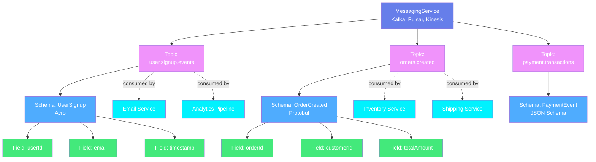
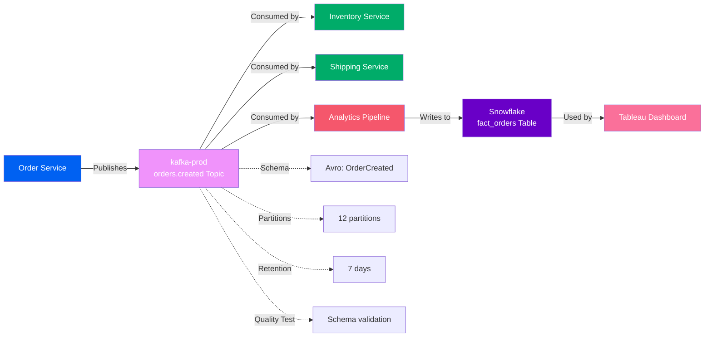
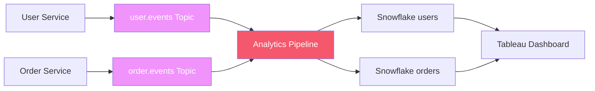

# Messaging Assets

**Event streams and pub/sub systems**

Messaging assets represent real-time event streams and message queues that enable asynchronous communication between services. OpenMetadata models messaging with a two-level hierarchy for event-driven architectures.

---

## Hierarchy Overview



---

## Why This Hierarchy?

### Messaging Service
**Purpose**: Represents the message broker or streaming platform

A Messaging Service is the platform that manages event streams and message queues. It contains configuration for connecting to the broker and discovering topics.

**Examples**:

- `kafka-prod` - Production Kafka cluster
- `confluent-cloud` - Confluent Cloud managed Kafka
- `pulsar-events` - Apache Pulsar for event streaming
- `kinesis-clickstream` - AWS Kinesis for clickstream data
- `rabbitmq-tasks` - RabbitMQ for task queues

**Why needed**: Organizations use different messaging platforms for different use cases (Kafka for high-throughput events, RabbitMQ for task queues, Kinesis for AWS-native streaming). The service level groups topics by platform and manages connections.

**Supported Platforms**: Apache Kafka, Confluent, AWS Kinesis, Azure Event Hubs, Google Pub/Sub, Apache Pulsar, RabbitMQ, Amazon SQS, ActiveMQ

[**View Messaging Service Specification →**](messaging-service.md){ .md-button }

---

### Topic
**Purpose**: Represents an event stream or message queue

A Topic is a stream of events or messages. It has a schema (event structure), partitions, retention policy, and consumers/producers.

**Examples**:

- `user.signup.events` - User registration events
- `orders.created` - New order notifications
- `clickstream.raw` - Website click events
- `payment.transactions` - Payment processing events

**Key Metadata**:

- **Schema**: Structure of messages (Avro, Protobuf, JSON Schema)
- **Partitions**: Number of parallel processing streams
- **Retention**: How long messages are kept
- **Producers**: Services that write to the topic
- **Consumers**: Services that read from the topic
- **Sample Messages**: Example events for understanding
- **Quality Tests**: Schema validation, message rate monitoring

**Why needed**: Topics are critical data assets in event-driven architectures. Tracking them enables:
- Understanding event flows between services
- Schema evolution management
- Impact analysis (who consumes this event?)
- Data quality monitoring

[**View Topic Specification →**](topic.md){ .md-button }

---

## Event Schemas

Topics often have formal schemas that define the structure of events:

### Avro Schema Example
```json
{
  "type": "record",
  "name": "UserSignup",
  "namespace": "com.company.events",
  "fields": [
    {"name": "userId", "type": "string"},
    {"name": "email", "type": "string"},
    {"name": "signupTimestamp", "type": "long"},
    {"name": "source", "type": "string"}
  ]
}
```

### Protobuf Schema Example
```protobuf
message OrderCreated {
  string order_id = 1;
  string customer_id = 2;
  double total_amount = 3;
  int64 created_at = 4;
  repeated OrderItem items = 5;
}
```

**Schema Registry Integration**: OpenMetadata integrates with schema registries (Confluent Schema Registry, AWS Glue Schema Registry) to automatically discover and version event schemas.

---

## Common Patterns

### Pattern 1: Kafka Event Streaming
```
Kafka Service → user.signup.events Topic → Schema: UserSignup (Avro)
                                         → Producers: [auth-service]
                                         → Consumers: [email-service, analytics-pipeline]
```

User service publishes signup events, consumed by email notifications and analytics.

### Pattern 2: Kinesis Clickstream
```
Kinesis Service → clickstream.raw Topic → Schema: ClickEvent (JSON)
                                        → Producer: [web-frontend]
                                        → Consumer: [firehose-to-s3, real-time-analytics]
```

Website publishes click events, consumed by archival and real-time dashboards.

### Pattern 3: Pub/Sub Microservices
```
GCP Pub/Sub → orders.created Topic → Consumers: [inventory-service, shipping-service, email-service]
```

Order service publishes events, consumed by multiple downstream services.

---

## Real-World Example

Here's how an e-commerce platform uses messaging for order processing:



**Flow**:
1. **Producer**: Order Service publishes `orders.created` events to Kafka
2. **Topic**: `orders.created` with Avro schema, 12 partitions, 7-day retention
3. **Consumers**:
   - **Inventory Service**: Updates stock levels
   - **Shipping Service**: Initiates fulfillment
   - **Analytics Pipeline**: Loads events into data warehouse
4. **Downstream**: Snowflake table feeds Tableau dashboard
5. **Quality**: Schema validation ensures all events match the Avro schema

**Benefits**:

- **Decoupling**: Services communicate asynchronously
- **Lineage**: Trace order data from creation → Kafka → warehouse → dashboard
- **Schema Management**: Track schema evolution and compatibility
- **Impact Analysis**: Know which services break if topic schema changes

---

## Messaging Lineage

Topics create lineage connections between microservices and data systems:



**Service-to-Service Lineage**: Understand how microservices communicate through events

**Event-to-Table Lineage**: Track events from topics into analytical tables

---

## Schema Evolution

Topics evolve over time. OpenMetadata tracks schema versions:

**Version 1.0**: Initial schema
```json
{
  "type": "record",
  "name": "UserSignup",
  "fields": [
    {"name": "userId", "type": "string"},
    {"name": "email", "type": "string"}
  ]
}
```

**Version 2.0**: Add optional field (backward compatible)
```json
{
  "type": "record",
  "name": "UserSignup",
  "fields": [
    {"name": "userId", "type": "string"},
    {"name": "email", "type": "string"},
    {"name": "referralCode", "type": ["null", "string"], "default": null}
  ]
}
```

**Schema Compatibility**:

- **Backward**: New consumers can read old events
- **Forward**: Old consumers can read new events
- **Full**: Both backward and forward compatible

---

## Entity Specifications

| Entity | Description | Specification |
|--------|-------------|---------------|
| **Messaging Service** | Message broker platform | [View Spec](messaging-service.md) |
| **Topic** | Event stream or queue | [View Spec](topic.md) |

Each specification includes:
- Complete field reference
- JSON Schema definition
- RDF/OWL ontology representation
- JSON-LD context and examples
- Schema formats (Avro, Protobuf, JSON Schema)

---

## Supported Messaging Platforms

OpenMetadata supports metadata extraction from:

- **Apache Kafka** - Distributed event streaming
- **Confluent Platform** - Enterprise Kafka with Schema Registry
- **AWS Kinesis** - Managed streaming service
- **Azure Event Hubs** - Cloud event ingestion service
- **Google Cloud Pub/Sub** - Asynchronous messaging
- **Apache Pulsar** - Cloud-native messaging and streaming
- **RabbitMQ** - Message broker
- **Amazon SQS** - Message queuing service
- **Amazon MSK** - Managed Kafka
- **RedPanda** - Kafka-compatible streaming

---

## Next Steps

1. **Explore specifications** - Click through each entity above
2. **See event lineage** - Check out [lineage documentation](../../lineage/overview.md)
3. **Schema management** - Learn about schema evolution best practices
