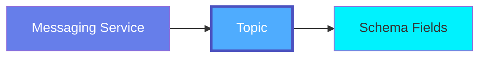

# Topic

**Event streams with structured schemas - the foundation of event-driven architecture**

---

## Overview

The **Topic** entity represents event streams, message topics, and queues across messaging platforms. Topics contain structured events with schemas defined in Avro, Protobuf, JSON Schema, or other formats, enabling type-safe event-driven communication.

**Hierarchy**:



---

## Relationships

Topic has comprehensive relationships with entities across the metadata platform:

```mermaid
graph TD
    subgraph Hierarchy
        SVC[MessagingService<br/>kafka_prod]
        SVC --> TOPIC[Topic<br/>customer_events]
    end

    subgraph Schema
        TOPIC --> SCH[Schema<br/>Avro/Protobuf]
        SCH --> F1[Field<br/>customer_id]
        SCH --> F2[Field<br/>event_type]
        SCH --> F3[Field<br/>timestamp]
        SCH --> F4[Field<br/>payload]
    end

    subgraph Producers
        PROD1[Service<br/>customer_service] -.->|publishes to| TOPIC
        PROD2[Pipeline<br/>cdc_pipeline] -.->|publishes to| TOPIC
        PROD3[Application<br/>web_app] -.->|publishes to| TOPIC
    end

    subgraph Consumers
        TOPIC -.->|consumed by| CONS1[Service<br/>analytics_service]
        TOPIC -.->|consumed by| CONS2[Pipeline<br/>realtime_etl]
        TOPIC -.->|consumed by| CONS3[Application<br/>notification_service]
    end

    subgraph Data Lineage
        TBL1[Table<br/>customers] -.->|changes tracked in| TOPIC
        TOPIC -.->|materialized to| TBL2[Table<br/>customer_events_log]
        TOPIC -.->|feeds| TBL3[Table<br/>customer_aggregates]
    end

    subgraph Ownership
        TOPIC -.->|owned by| TEAM[Team<br/>Platform Team]
        TOPIC -.->|owned by| USER[User<br/>stream.admin]
    end

    subgraph Governance
        TOPIC -.->|in domain| DOM[Domain<br/>Customer Platform]
        TOPIC -.->|tagged| TAG1[Tag<br/>Tier.Gold]
        TOPIC -.->|tagged| TAG2[Tag<br/>PII.Sensitive]
        TOPIC -.->|tagged| TAG3[Tag<br/>RealTime]
        TOPIC -.->|linked to| GT[GlossaryTerm<br/>Customer Events]
    end

    subgraph Quality
        TC1[TestCase<br/>schema_validation] -.->|validates| SCH
        TC2[TestCase<br/>message_throughput] -.->|monitors| TOPIC
        TC3[TestCase<br/>lag_check] -.->|monitors| CONS1
    end

    subgraph Pipelines
        PIPE1[Pipeline<br/>stream_processor] -.->|transforms| TOPIC
        TOPIC -.->|feeds| PIPE2[Pipeline<br/>sink_connector]
    end

    style SVC fill:#667eea,color:#fff
    style TOPIC fill:#4facfe,color:#fff,stroke:#4c51bf,stroke-width:3px
    style SCH fill:#00f2fe,color:#333
    style F1 fill:#00f2fe,color:#333
    style F2 fill:#00f2fe,color:#333
    style F3 fill:#00f2fe,color:#333
    style F4 fill:#00f2fe,color:#333
    style PROD1 fill:#00ac69,color:#fff
    style PROD2 fill:#00ac69,color:#fff
    style PROD3 fill:#00ac69,color:#fff
    style CONS1 fill:#f5576c,color:#fff
    style CONS2 fill:#f5576c,color:#fff
    style CONS3 fill:#f5576c,color:#fff
    style TBL1 fill:#764ba2,color:#fff
    style TBL2 fill:#764ba2,color:#fff
    style TBL3 fill:#764ba2,color:#fff
    style TEAM fill:#43e97b,color:#fff
    style USER fill:#43e97b,color:#fff
    style DOM fill:#fa709a,color:#fff
    style TAG1 fill:#f093fb,color:#fff
    style TAG2 fill:#f093fb,color:#fff
    style TAG3 fill:#f093fb,color:#fff
    style GT fill:#ffd700,color:#333
    style TC1 fill:#9b59b6,color:#fff
    style TC2 fill:#9b59b6,color:#fff
    style TC3 fill:#9b59b6,color:#fff
    style PIPE1 fill:#ff6b6b,color:#fff
    style PIPE2 fill:#ff6b6b,color:#fff
```



**Relationship Types**:

- **Solid lines (→)**: Hierarchical containment (Service contains Topic, Topic contains Schema)
- **Dashed lines (-.->)**: References and associations (ownership, governance, lineage, producers/consumers)

### Parent Entities
- **MessagingService**: The messaging platform service hosting this topic

### Child Entities
- **Schema**: Event schema (Avro, Protobuf, JSON Schema)
- **Field**: Schema fields defining event structure

### Associated Entities
- **Owner**: User or team owning this topic
- **Domain**: Business domain assignment
- **Tag**: Classification tags
- **GlossaryTerm**: Business terminology
- **Table**: Source tables (CDC) and target tables (materialization)
- **Pipeline**: Stream processing pipelines, CDC pipelines, sink connectors
- **Service**: Producer and consumer microservices
- **TestCase**: Schema validation, throughput monitoring, consumer lag checks

---

## Schema Specifications

View the complete Topic schema in your preferred format:

=== "JSON Schema"

    **Complete JSON Schema Definition**

    ```json
    {
      "$id": "https://open-metadata.org/schema/entity/data/topic.json",
      "$schema": "http://json-schema.org/draft-07/schema#",
      "title": "Topic",
      "description": "A `Topic` entity represents an event stream or message topic with a defined schema.",
      "type": "object",
      "javaType": "org.openmetadata.schema.entity.data.Topic",

      "definitions": {
        "topicSchemaType": {
          "description": "Schema format for topic messages",
          "type": "string",
          "enum": [
            "Avro", "Protobuf", "JSON", "None"
          ]
        },
        "cleanupPolicy": {
          "description": "Topic retention policy",
          "type": "string",
          "enum": ["delete", "compact", "compact,delete"]
        },
        "partitionInfo": {
          "type": "object",
          "properties": {
            "partitions": {
              "type": "integer",
              "description": "Number of partitions"
            },
            "replicationFactor": {
              "type": "integer",
              "description": "Replication factor"
            }
          }
        },
        "schemaField": {
          "type": "object",
          "properties": {
            "name": {
              "type": "string",
              "description": "Field name"
            },
            "dataType": {
              "type": "string",
              "description": "Field data type"
            },
            "description": {
              "type": "string",
              "description": "Field description"
            },
            "children": {
              "type": "array",
              "items": {"$ref": "#/definitions/schemaField"}
            },
            "tags": {
              "type": "array",
              "items": {"$ref": "../../type/tagLabel.json"}
            }
          },
          "required": ["name", "dataType"]
        }
      },

      "properties": {
        "id": {
          "description": "Unique identifier",
          "$ref": "../../type/basic.json#/definitions/uuid"
        },
        "name": {
          "description": "Topic name",
          "$ref": "../../type/basic.json#/definitions/entityName"
        },
        "fullyQualifiedName": {
          "description": "Fully qualified name: service.topic",
          "$ref": "../../type/basic.json#/definitions/fullyQualifiedEntityName"
        },
        "displayName": {
          "description": "Display name",
          "type": "string"
        },
        "description": {
          "description": "Markdown description",
          "$ref": "../../type/basic.json#/definitions/markdown"
        },
        "schemaType": {
          "$ref": "#/definitions/topicSchemaType"
        },
        "schemaText": {
          "description": "Schema definition (Avro, Protobuf, JSON Schema)",
          "type": "string"
        },
        "messageSchema": {
          "description": "Parsed schema fields",
          "type": "array",
          "items": {
            "$ref": "#/definitions/schemaField"
          }
        },
        "partitions": {
          "$ref": "#/definitions/partitionInfo"
        },
        "cleanupPolicies": {
          "type": "array",
          "items": {
            "$ref": "#/definitions/cleanupPolicy"
          }
        },
        "retentionSize": {
          "description": "Maximum size in bytes before old data is deleted",
          "type": "integer"
        },
        "retentionTime": {
          "description": "Time in milliseconds to retain data",
          "type": "integer"
        },
        "maximumMessageSize": {
          "description": "Maximum message size in bytes",
          "type": "integer"
        },
        "service": {
          "description": "Parent messaging service",
          "$ref": "../../type/entityReference.json"
        },
        "owner": {
          "description": "Owner (user or team)",
          "$ref": "../../type/entityReference.json"
        },
        "domain": {
          "description": "Data domain",
          "$ref": "../../type/entityReference.json"
        },
        "tags": {
          "description": "Classification tags",
          "type": "array",
          "items": {
            "$ref": "../../type/tagLabel.json"
          }
        },
        "glossaryTerms": {
          "description": "Business glossary terms",
          "type": "array",
          "items": {
            "$ref": "../../type/entityReference.json"
          }
        },
        "version": {
          "description": "Metadata version",
          "$ref": "../../type/entityHistory.json#/definitions/entityVersion"
        }
      },

      "required": ["id", "name", "service"]
    }
    ```

    **[View Full JSON Schema →](https://github.com/open-metadata/OpenMetadataStandards/blob/main/schemas/entity/data/topic.json)**

=== "RDF"

    **RDF/OWL Ontology Definition**

    ```turtle
    @prefix om: <https://open-metadata.org/schema/> .
    @prefix rdfs: <http://www.w3.org/2000/01/rdf-schema#> .
    @prefix owl: <http://www.w3.org/2001/XMLSchema#> .
    @prefix xsd: <http://www.w3.org/2001/XMLSchema#> .

    # Topic Class Definition
    om:Topic a owl:Class ;
        rdfs:subClassOf om:DataAsset ;
        rdfs:label "Topic" ;
        rdfs:comment "An event stream or message topic with a defined schema" ;
        om:hierarchyLevel 2 .

    # Properties
    om:topicName a owl:DatatypeProperty ;
        rdfs:domain om:Topic ;
        rdfs:range xsd:string ;
        rdfs:label "name" ;
        rdfs:comment "Name of the topic" .

    om:fullyQualifiedName a owl:DatatypeProperty ;
        rdfs:domain om:Topic ;
        rdfs:range xsd:string ;
        rdfs:label "fullyQualifiedName" ;
        rdfs:comment "Complete hierarchical name: service.topic" .

    om:schemaType a owl:DatatypeProperty ;
        rdfs:domain om:Topic ;
        rdfs:range om:SchemaType ;
        rdfs:label "schemaType" ;
        rdfs:comment "Schema format: Avro, Protobuf, JSON, etc." .

    om:schemaText a owl:DatatypeProperty ;
        rdfs:domain om:Topic ;
        rdfs:range xsd:string ;
        rdfs:label "schemaText" ;
        rdfs:comment "Full schema definition" .

    om:partitionCount a owl:DatatypeProperty ;
        rdfs:domain om:Topic ;
        rdfs:range xsd:integer ;
        rdfs:label "partitions" ;
        rdfs:comment "Number of partitions" .

    om:replicationFactor a owl:DatatypeProperty ;
        rdfs:domain om:Topic ;
        rdfs:range xsd:integer ;
        rdfs:label "replicationFactor" ;
        rdfs:comment "Replication factor" .

    om:hasSchemaField a owl:ObjectProperty ;
        rdfs:domain om:Topic ;
        rdfs:range om:SchemaField ;
        rdfs:label "hasSchemaField" ;
        rdfs:comment "Fields in the message schema" .

    om:belongsToService a owl:ObjectProperty ;
        rdfs:domain om:Topic ;
        rdfs:range om:MessagingService ;
        rdfs:label "belongsToService" ;
        rdfs:comment "Parent messaging service" .

    om:ownedBy a owl:ObjectProperty ;
        rdfs:domain om:Topic ;
        rdfs:range om:Owner ;
        rdfs:label "ownedBy" ;
        rdfs:comment "User or team that owns this topic" .

    om:hasTag a owl:ObjectProperty ;
        rdfs:domain om:Topic ;
        rdfs:range om:Tag ;
        rdfs:label "hasTag" ;
        rdfs:comment "Classification tags applied to topic" .

    om:linkedToGlossaryTerm a owl:ObjectProperty ;
        rdfs:domain om:Topic ;
        rdfs:range om:GlossaryTerm ;
        rdfs:label "linkedToGlossaryTerm" ;
        rdfs:comment "Business glossary terms" .

    # SchemaType Enumeration
    om:SchemaType a owl:Class ;
        owl:oneOf (
            om:AvroSchema
            om:ProtobufSchema
            om:JSONSchema
            om:NoSchema
        ) .

    # Example Instance
    ex:userEventsTopic a om:Topic ;
        om:topicName "user_events" ;
        om:fullyQualifiedName "kafka_prod.user_events" ;
        om:schemaType om:AvroSchema ;
        om:partitionCount 12 ;
        om:replicationFactor 3 ;
        om:belongsToService ex:kafkaProduction ;
        om:ownedBy ex:analyticsTeam ;
        om:hasTag ex:tierGold ;
        om:hasTag ex:complianceGDPR ;
        om:linkedToGlossaryTerm ex:userEventTerm ;
        om:hasSchemaField ex:userIdField ;
        om:hasSchemaField ex:eventTypeField ;
        om:hasSchemaField ex:timestampField .
    ```

    **[View Full RDF Ontology →](https://github.com/open-metadata/OpenMetadataStandards/blob/main/rdf/ontology/openmetadata.ttl)**

=== "JSON-LD"

    **JSON-LD Context and Example**

    ```json
    {
      "@context": {
        "@vocab": "https://open-metadata.org/schema/",
        "om": "https://open-metadata.org/schema/",
        "rdfs": "http://www.w3.org/2000/01/rdf-schema#",
        "xsd": "http://www.w3.org/2001/XMLSchema#",

        "Topic": "om:Topic",
        "name": {
          "@id": "om:topicName",
          "@type": "xsd:string"
        },
        "fullyQualifiedName": {
          "@id": "om:fullyQualifiedName",
          "@type": "xsd:string"
        },
        "displayName": {
          "@id": "om:displayName",
          "@type": "xsd:string"
        },
        "description": {
          "@id": "om:description",
          "@type": "xsd:string"
        },
        "schemaType": {
          "@id": "om:schemaType",
          "@type": "@vocab"
        },
        "schemaText": {
          "@id": "om:schemaText",
          "@type": "xsd:string"
        },
        "messageSchema": {
          "@id": "om:hasSchemaField",
          "@type": "@id",
          "@container": "@list"
        },
        "service": {
          "@id": "om:belongsToService",
          "@type": "@id"
        },
        "owner": {
          "@id": "om:ownedBy",
          "@type": "@id"
        },
        "domain": {
          "@id": "om:inDomain",
          "@type": "@id"
        },
        "tags": {
          "@id": "om:hasTag",
          "@type": "@id",
          "@container": "@set"
        },
        "glossaryTerms": {
          "@id": "om:linkedToGlossaryTerm",
          "@type": "@id",
          "@container": "@set"
        }
      }
    }
    ```

    **Example JSON-LD Instance**:

    ```json
    {
      "@context": "https://open-metadata.org/context/topic.jsonld",
      "@type": "Topic",
      "@id": "https://example.com/topics/user_events",

      "name": "user_events",
      "fullyQualifiedName": "kafka_prod.user_events",
      "displayName": "User Activity Events",
      "description": "Real-time user activity event stream",
      "schemaType": "Avro",

      "partitions": {
        "partitions": 12,
        "replicationFactor": 3
      },

      "cleanupPolicies": ["delete"],
      "retentionTime": 604800000,

      "service": {
        "@id": "https://example.com/services/kafka_prod",
        "@type": "MessagingService",
        "name": "kafka_prod"
      },

      "owner": {
        "@id": "https://example.com/teams/analytics",
        "@type": "Team",
        "name": "Analytics"
      },

      "tags": [
        {
          "@id": "https://open-metadata.org/tags/Tier/Gold",
          "tagFQN": "Tier.Gold"
        },
        {
          "@id": "https://open-metadata.org/tags/Compliance/GDPR",
          "tagFQN": "Compliance.GDPR"
        }
      ],

      "glossaryTerms": [
        {
          "@id": "https://example.com/glossary/UserEvent",
          "@type": "GlossaryTerm",
          "fullyQualifiedName": "BusinessGlossary.UserEvent"
        }
      ],

      "messageSchema": [
        {
          "@type": "SchemaField",
          "name": "user_id",
          "dataType": "string",
          "description": "Unique user identifier",
          "tags": [
            {
              "@id": "https://open-metadata.org/tags/PII/Sensitive/UserID"
            }
          ]
        },
        {
          "@type": "SchemaField",
          "name": "event_type",
          "dataType": "string",
          "description": "Type of user event"
        },
        {
          "@type": "SchemaField",
          "name": "timestamp",
          "dataType": "long",
          "description": "Event timestamp in milliseconds"
        }
      ]
    }
    ```

    **[View Full JSON-LD Context →](https://github.com/open-metadata/OpenMetadataStandards/blob/main/rdf/contexts/topic.jsonld)**

---

## Use Cases

- Catalog Kafka topics, Kinesis streams, Pulsar topics
- Document event schemas (Avro, Protobuf, JSON Schema)
- Track schema evolution and compatibility
- Apply governance tags to event fields (PII, PHI)
- Map event lineage from producers to consumers
- Discover event-driven data flows
- Monitor topic configuration (partitions, retention, replication)
- Integrate with schema registries
- Define data contracts for event streams
- Track event volume and lag metrics

---

## JSON Schema Specification

### Core Properties

#### `id` (uuid)
**Type**: `string` (UUID format)
**Required**: Yes (system-generated)
**Description**: Unique identifier for this topic instance

```json
{
  "id": "t1o2p3i4-c5u6-7u8i-9d0a-b1c2d3e4f5g6"
}
```

---

#### `name` (entityName)
**Type**: `string`
**Required**: Yes
**Pattern**: `^[^.]*$` (no dots allowed)
**Min Length**: 1
**Max Length**: 256
**Description**: Name of the topic (unqualified)

```json
{
  "name": "user_events"
}
```

---

#### `fullyQualifiedName` (fullyQualifiedEntityName)
**Type**: `string`
**Required**: Yes (system-generated)
**Pattern**: `^((?!::).)*$`
**Description**: Fully qualified name in the format `service.topic`

```json
{
  "fullyQualifiedName": "kafka_prod.user_events"
}
```

---

#### `displayName`
**Type**: `string`
**Required**: No
**Description**: Human-readable display name

```json
{
  "displayName": "User Activity Events"
}
```

---

#### `description` (markdown)
**Type**: `string` (Markdown format)
**Required**: No
**Description**: Rich text description of the topic's purpose and usage

```json
{
  "description": "# User Activity Events\n\nReal-time stream of user activity events from web and mobile applications.\n\n## Event Types\n- page_view\n- button_click\n- form_submit\n- session_start\n- session_end\n\n## Consumers\n- Analytics pipeline\n- Recommendation engine\n- Audit log system"
}
```

---

### Schema Properties

#### `schemaType` (topicSchemaType)
**Type**: `string` enum
**Required**: No
**Allowed Values**:

- `Avro` - Apache Avro schema
- `Protobuf` - Protocol Buffers schema
- `JSON` - JSON Schema
- `None` - No schema enforcement

```json
{
  "schemaType": "Avro"
}
```

---

#### `schemaText`
**Type**: `string`
**Required**: No
**Description**: Full schema definition in Avro, Protobuf, or JSON Schema format

**Avro Example**:

```json
{
  "schemaText": "{\"type\":\"record\",\"name\":\"UserEvent\",\"namespace\":\"com.example.events\",\"fields\":[{\"name\":\"user_id\",\"type\":\"string\",\"doc\":\"Unique user identifier\"},{\"name\":\"event_type\",\"type\":\"string\",\"doc\":\"Type of event\"},{\"name\":\"timestamp\",\"type\":\"long\",\"doc\":\"Event timestamp in milliseconds\"},{\"name\":\"properties\",\"type\":{\"type\":\"map\",\"values\":\"string\"},\"default\":{}}]}"
}
```

**Protobuf Example**:

```json
{
  "schemaText": "syntax = \"proto3\";\n\npackage com.example.events;\n\nmessage UserEvent {\n  string user_id = 1;\n  string event_type = 2;\n  int64 timestamp = 3;\n  map<string, string> properties = 4;\n}"
}
```

---

#### `messageSchema[]` (SchemaField[])
**Type**: `array` of SchemaField objects
**Required**: No (parsed from schemaText)
**Description**: Structured representation of message fields

**SchemaField Object Properties**:

| Property | Type | Required | Description |
|----------|------|----------|-------------|
| `name` | string | Yes | Field name |
| `dataType` | string | Yes | Field data type (string, int, long, double, boolean, record, array, map, etc.) |
| `dataTypeDisplay` | string | No | Formatted type display |
| `description` | markdown | No | Field description |
| `children` | SchemaField[] | No | Nested fields (for record/struct types) |
| `tags` | TagLabel[] | No | Tags applied to field |
| `glossaryTerms` | GlossaryTerm[] | No | Business terms |

**Example**:

```json
{
  "messageSchema": [
    {
      "name": "user_id",
      "dataType": "string",
      "dataTypeDisplay": "string",
      "description": "Unique user identifier (UUID format)",
      "tags": [
        {
          "tagFQN": "PII.Sensitive.UserID",
          "source": "Classification"
        }
      ]
    },
    {
      "name": "event_type",
      "dataType": "string",
      "dataTypeDisplay": "string",
      "description": "Type of user event (page_view, click, etc.)"
    },
    {
      "name": "timestamp",
      "dataType": "long",
      "dataTypeDisplay": "long",
      "description": "Event timestamp in milliseconds since epoch"
    },
    {
      "name": "user_profile",
      "dataType": "record",
      "dataTypeDisplay": "record",
      "description": "User profile information",
      "children": [
        {
          "name": "email",
          "dataType": "string",
          "description": "User email address",
          "tags": [
            {
              "tagFQN": "PII.Sensitive.Email",
              "source": "Classification"
            }
          ]
        },
        {
          "name": "country",
          "dataType": "string",
          "description": "User country code"
        }
      ]
    },
    {
      "name": "properties",
      "dataType": "map",
      "dataTypeDisplay": "map<string, string>",
      "description": "Additional event properties",
      "children": [
        {
          "name": "key",
          "dataType": "string"
        },
        {
          "name": "value",
          "dataType": "string"
        }
      ]
    }
  ]
}
```

---

### Configuration Properties

#### `partitions` (partitionInfo)
**Type**: `object`
**Required**: No
**Description**: Partition configuration for the topic

**PartitionInfo Properties**:

| Property | Type | Description |
|----------|------|-------------|
| `partitions` | integer | Number of partitions |
| `replicationFactor` | integer | Replication factor |

```json
{
  "partitions": {
    "partitions": 12,
    "replicationFactor": 3
  }
}
```

---

#### `cleanupPolicies[]` (cleanupPolicy[])
**Type**: `array` of enums
**Required**: No
**Allowed Values**:

- `delete` - Delete old segments based on retention
- `compact` - Keep only latest value per key
- `compact,delete` - Compact then delete

```json
{
  "cleanupPolicies": ["delete"]
}
```

---

#### `retentionSize`
**Type**: `integer` (bytes)
**Required**: No
**Description**: Maximum size in bytes before old data is deleted (-1 for unlimited)

```json
{
  "retentionSize": 10737418240
}
```

---

#### `retentionTime`
**Type**: `integer` (milliseconds)
**Required**: No
**Description**: Time in milliseconds to retain data (-1 for unlimited)

```json
{
  "retentionTime": 604800000
}
```

---

#### `maximumMessageSize`
**Type**: `integer` (bytes)
**Required**: No
**Description**: Maximum message size in bytes

```json
{
  "maximumMessageSize": 1048576
}
```

---

### Location Properties

#### `service` (EntityReference)
**Type**: `object`
**Required**: Yes
**Description**: Reference to parent messaging service

```json
{
  "service": {
    "id": "service-uuid",
    "type": "messagingService",
    "name": "kafka_prod",
    "fullyQualifiedName": "kafka_prod"
  }
}
```

---

### Governance Properties

#### `owner` (EntityReference)
**Type**: `object`
**Required**: No
**Description**: User or team that owns this topic

```json
{
  "owner": {
    "id": "team-uuid",
    "type": "team",
    "name": "Analytics",
    "displayName": "Analytics Team"
  }
}
```

---

#### `domain` (EntityReference)
**Type**: `object`
**Required**: No
**Description**: Data domain this topic belongs to

```json
{
  "domain": {
    "id": "domain-uuid",
    "type": "domain",
    "name": "UserEngagement",
    "fullyQualifiedName": "UserEngagement"
  }
}
```

---

#### `tags[]` (TagLabel[])
**Type**: `array`
**Required**: No
**Description**: Classification tags applied to the topic

```json
{
  "tags": [
    {
      "tagFQN": "Tier.Gold",
      "description": "Critical data stream",
      "source": "Classification",
      "labelType": "Manual",
      "state": "Confirmed"
    },
    {
      "tagFQN": "Compliance.GDPR",
      "source": "Classification",
      "labelType": "Automated",
      "state": "Confirmed"
    }
  ]
}
```

---

#### `glossaryTerms[]` (GlossaryTerm[])
**Type**: `array`
**Required**: No
**Description**: Business glossary terms linked to this topic

```json
{
  "glossaryTerms": [
    {
      "fullyQualifiedName": "BusinessGlossary.UserEvent"
    },
    {
      "fullyQualifiedName": "BusinessGlossary.RealTimeAnalytics"
    }
  ]
}
```

---

### Versioning Properties

#### `version` (entityVersion)
**Type**: `number`
**Required**: Yes (system-managed)
**Description**: Metadata version number, incremented on changes

```json
{
  "version": 3.1
}
```

---

#### `updatedAt` (timestamp)
**Type**: `integer` (Unix epoch milliseconds)
**Required**: Yes (system-managed)
**Description**: Last update timestamp

```json
{
  "updatedAt": 1704240000000
}
```

---

#### `updatedBy` (string)
**Type**: `string`
**Required**: Yes (system-managed)
**Description**: User who made the update

```json
{
  "updatedBy": "data.engineer"
}
```

---

## Complete Example

```json
{
  "id": "t1o2p3i4-c5u6-7u8i-9d0a-b1c2d3e4f5g6",
  "name": "user_events",
  "fullyQualifiedName": "kafka_prod.user_events",
  "displayName": "User Activity Events",
  "description": "# User Activity Events\n\nReal-time stream of user activity events.",
  "schemaType": "Avro",
  "schemaText": "{\"type\":\"record\",\"name\":\"UserEvent\",\"fields\":[{\"name\":\"user_id\",\"type\":\"string\"},{\"name\":\"event_type\",\"type\":\"string\"},{\"name\":\"timestamp\",\"type\":\"long\"}]}",
  "messageSchema": [
    {
      "name": "user_id",
      "dataType": "string",
      "description": "Unique user identifier",
      "tags": [
        {"tagFQN": "PII.Sensitive.UserID"}
      ]
    },
    {
      "name": "event_type",
      "dataType": "string",
      "description": "Type of user event"
    },
    {
      "name": "timestamp",
      "dataType": "long",
      "description": "Event timestamp in milliseconds"
    }
  ],
  "partitions": {
    "partitions": 12,
    "replicationFactor": 3
  },
  "cleanupPolicies": ["delete"],
  "retentionTime": 604800000,
  "maximumMessageSize": 1048576,
  "service": {
    "id": "service-uuid",
    "type": "messagingService",
    "name": "kafka_prod"
  },
  "owner": {
    "id": "team-uuid",
    "type": "team",
    "name": "Analytics"
  },
  "domain": {
    "id": "domain-uuid",
    "type": "domain",
    "name": "UserEngagement"
  },
  "tags": [
    {"tagFQN": "Tier.Gold"},
    {"tagFQN": "Compliance.GDPR"}
  ],
  "glossaryTerms": [
    {"fullyQualifiedName": "BusinessGlossary.UserEvent"}
  ],
  "version": 3.1,
  "updatedAt": 1704240000000,
  "updatedBy": "data.engineer"
}
```

---

## RDF Representation

### Ontology Class

```turtle
@prefix om: <https://open-metadata.org/schema/> .
@prefix rdfs: <http://www.w3.org/2000/01/rdf-schema#> .
@prefix owl: <http://www.w3.org/2001/XMLSchema#> .

om:Topic a owl:Class ;
    rdfs:subClassOf om:DataAsset ;
    rdfs:label "Topic" ;
    rdfs:comment "An event stream or message topic with a defined schema" ;
    om:hasProperties [
        om:name "string" ;
        om:schemaType "SchemaType" ;
        om:messageSchema "SchemaField[]" ;
        om:partitions "integer" ;
        om:service "MessagingService" ;
        om:owner "Owner" ;
        om:tags "Tag[]" ;
    ] .
```

### Instance Example

```turtle
@prefix om: <https://open-metadata.org/schema/> .
@prefix ex: <https://example.com/topics/> .

ex:user_events a om:Topic ;
    om:name "user_events" ;
    om:fullyQualifiedName "kafka_prod.user_events" ;
    om:displayName "User Activity Events" ;
    om:description "Real-time user activity event stream" ;
    om:schemaType "Avro" ;
    om:partitionCount 12 ;
    om:replicationFactor 3 ;
    om:belongsToService ex:kafka_prod ;
    om:ownedBy ex:analyticsTeam ;
    om:hasTag ex:tierGold ;
    om:hasTag ex:complianceGDPR ;
    om:linkedToGlossaryTerm ex:userEventTerm ;
    om:hasSchemaField ex:userIdField ;
    om:hasSchemaField ex:eventTypeField .
```

---

## JSON-LD Context

```json
{
  "@context": {
    "@vocab": "https://open-metadata.org/schema/",
    "om": "https://open-metadata.org/schema/",
    "Topic": "om:Topic",
    "name": "om:name",
    "fullyQualifiedName": "om:fullyQualifiedName",
    "displayName": "om:displayName",
    "schemaType": "om:schemaType",
    "messageSchema": {
      "@id": "om:hasSchemaField",
      "@type": "@id",
      "@container": "@list"
    },
    "service": {
      "@id": "om:belongsToService",
      "@type": "@id"
    },
    "owner": {
      "@id": "om:ownedBy",
      "@type": "@id"
    },
    "tags": {
      "@id": "om:hasTag",
      "@type": "@id",
      "@container": "@set"
    }
  }
}
```

### JSON-LD Example

```json
{
  "@context": "https://open-metadata.org/context/topic.jsonld",
  "@type": "Topic",
  "@id": "https://example.com/topics/user_events",
  "name": "user_events",
  "schemaType": "Avro",
  "partitions": {
    "partitions": 12,
    "replicationFactor": 3
  },
  "service": {
    "@id": "https://example.com/services/kafka_prod",
    "@type": "MessagingService"
  },
  "owner": {
    "@id": "https://example.com/teams/analytics",
    "@type": "Team"
  },
  "messageSchema": [
    {
      "@type": "SchemaField",
      "name": "user_id",
      "dataType": "string"
    }
  ]
}
```

---

## Relationships

### Parent Entities
- **MessagingService**: The messaging platform hosting this topic

### Associated Entities
- **Owner**: User or team owning this topic
- **Domain**: Business domain assignment
- **Tag**: Classification tags
- **GlossaryTerm**: Business terminology
- **Pipeline**: Data pipelines producing/consuming events
- **Dashboard**: Dashboards monitoring this topic
- **DataContract**: Schema contracts and SLAs

---

## Custom Properties

This entity supports custom properties through the `extension` field.
Common custom properties include:

- **Data Classification**: Sensitivity level
- **Cost Center**: Billing allocation
- **Retention Period**: Data retention requirements
- **Application Owner**: Owning application/team

See [Custom Properties](../../metadata-specifications/custom-properties.md)
for details on defining and using custom properties.

---

## API Operations

All Topic operations are available under the `/v1/topics` endpoint.

### List Topics

Get a list of topics, optionally filtered by service.

```http
GET /v1/topics
Query Parameters:
  - fields: Fields to include (messageSchema, tags, owner, sampleData, etc.)
  - service: Filter by messaging service name
  - limit: Number of results (1-1000000, default 10)
  - before/after: Cursor-based pagination
  - include: all | deleted | non-deleted (default: non-deleted)

Response: TopicList
```

### Create Topic

Create a new topic under a messaging service.

```http
POST /v1/topics
Content-Type: application/json

{
  "name": "user_events",
  "service": "kafka_prod",
  "description": "User activity event stream",
  "partitions": 12,
  "replicationFactor": 3,
  "retentionTime": 604800000,
  "schemaType": "Avro",
  "messageSchema": {
    "schemaText": "{\"type\":\"record\",\"name\":\"UserEvent\",\"fields\":[{\"name\":\"user_id\",\"type\":\"string\"},{\"name\":\"event_type\",\"type\":\"string\"},{\"name\":\"timestamp\",\"type\":\"long\"}]}",
    "schemaFields": [
      {
        "name": "user_id",
        "dataType": "STRING",
        "description": "User identifier",
        "tags": [{"tagFQN": "PII.UserId"}]
      },
      {
        "name": "event_type",
        "dataType": "STRING"
      },
      {
        "name": "timestamp",
        "dataType": "LONG"
      }
    ]
  },
  "topicConfig": {
    "cleanupPolicy": "delete",
    "compressionType": "snappy"
  }
}

Response: Topic
```

### Get Topic by Name

Get a topic by its fully qualified name.

```http
GET /v1/topics/name/{fqn}
Query Parameters:
  - fields: Fields to include (messageSchema, tags, owner, sampleData, etc.)
  - include: all | deleted | non-deleted

Example:
GET /v1/topics/name/kafka_prod.user_events?fields=messageSchema,tags,owner,topicConfig

Response: Topic
```

### Get Topic by ID

Get a topic by its unique identifier.

```http
GET /v1/topics/{id}
Query Parameters:
  - fields: Fields to include
  - include: all | deleted | non-deleted

Response: Topic
```

### Update Topic

Update a topic using JSON Patch.

```http
PATCH /v1/topics/name/{fqn}
Content-Type: application/json-patch+json

[
  {"op": "add", "path": "/tags/-", "value": {"tagFQN": "Tier.Gold"}},
  {"op": "replace", "path": "/partitions", "value": 24},
  {"op": "replace", "path": "/description", "value": "Updated event stream"}
]

Response: Topic
```

### Create or Update Topic

Create a new topic or update if it exists.

```http
PUT /v1/topics
Content-Type: application/json

{
  "name": "order_events",
  "service": "kafka_prod",
  "partitions": 6,
  "messageSchema": {...}
}

Response: Topic
```

### Delete Topic

Delete a topic by fully qualified name.

```http
DELETE /v1/topics/name/{fqn}
Query Parameters:
  - hardDelete: Permanently delete (default: false)

Response: 200 OK
```

### Update Message Schema

Update the schema for messages in the topic.

```http
PUT /v1/topics/{id}/messageSchema
Content-Type: application/json

{
  "schemaType": "Avro",
  "schemaText": "{\"type\":\"record\",\"name\":\"OrderEvent\",\"fields\":[...]}",
  "schemaFields": [...]
}

Response: Topic
```

### Get Topic Sample Data

Get sample messages from the topic.

```http
GET /v1/topics/{id}/sampleData

Response: TopicSampleData (sample messages)
```

### Get Topic Versions

Get all versions of a topic.

```http
GET /v1/topics/{id}/versions

Response: EntityHistory
```

### Follow Topic

Add a follower to a topic.

```http
PUT /v1/topics/{id}/followers/{userId}

Response: ChangeEvent
```

### Get Followers

Get all followers of a topic.

```http
GET /v1/topics/{id}/followers

Response: EntityReference[]
```

### Bulk Operations

Create or update multiple topics.

```http
PUT /v1/topics/bulk
Content-Type: application/json

{
  "entities": [...]
}

Response: BulkOperationResult
```

---

## Related Documentation

- **[MessagingService](messaging-service.md)** - Service configuration
- **[Messaging Overview](overview.md)** - Messaging assets overview
- **[Schema Registry](../../integration/schema-registry.md)** - Schema management
- **[Event Lineage](../../lineage/event-lineage.md)** - Event-driven lineage
- **[Data Quality](../../data-quality/overview.md)** - Event validation
- **[Data Contracts](../../governance/data-contracts.md)** - Schema contracts
