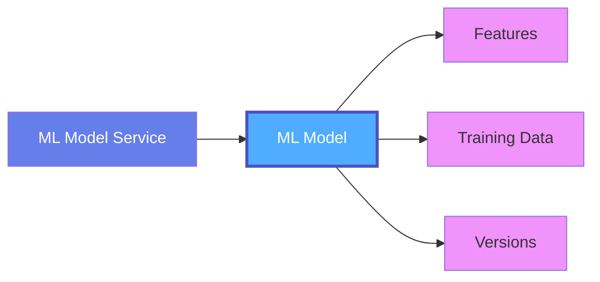
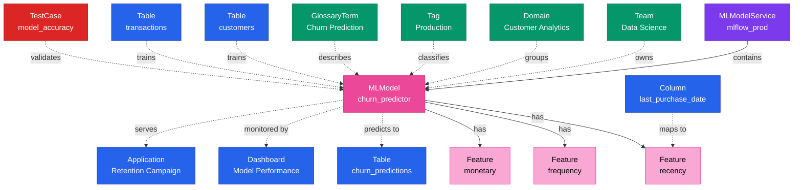

# ML Model

**Trained machine learning models - from features to predictions**

---

## Overview

The **MlModel** entity represents a trained machine learning model with its features, training data, hyperparameters, performance metrics, versions, and deployment information. It captures the complete lifecycle of an ML model from experimentation to production deployment.

**Hierarchy**:



---

## Relationships

MLModel has comprehensive relationships with entities across the metadata platform:

```mermaid
graph TD
    subgraph Hierarchy
        SVC[MLModelService<br/>sagemaker_prod]
        SVC --> MODEL[MLModel<br/>churn_predictor_v2]
    end

    subgraph Features
        MODEL --> F1[Feature<br/>customer_age]
        MODEL --> F2[Feature<br/>total_purchases]
        MODEL --> F3[Feature<br/>days_since_last_order]
        MODEL --> F4[Feature<br/>avg_order_value]
    end

    subgraph Training Data
        MODEL -.->|trained on| TRAIN1[Table<br/>training_data]
        MODEL -.->|trained on| TRAIN2[Table<br/>customer_features]
    end

    subgraph Prediction Data
        MODEL -.->|predicts on| PRED1[Table<br/>customers_current]
        MODEL -.->|outputs to| PRED2[Table<br/>churn_predictions]
    end

    subgraph Pipelines
        PIPE1[Pipeline<br/>feature_engineering] -.->|prepares| TRAIN1
        PIPE2[Pipeline<br/>model_training] -.->|trains| MODEL
        PIPE3[Pipeline<br/>batch_prediction] -.->|uses| MODEL
    end

    subgraph Ownership
        MODEL -.->|owned by| TEAM[Team<br/>Data Science]
        MODEL -.->|owned by| USER[User<br/>ml.engineer]
    end

    subgraph Governance
        MODEL -.->|in domain| DOM[Domain<br/>Customer Analytics]
        MODEL -.->|tagged| TAG1[Tag<br/>Tier.Gold]
        MODEL -.->|tagged| TAG2[Tag<br/>PII.Sensitive]
        MODEL -.->|linked to| GT[GlossaryTerm<br/>Churn Prediction]
    end

    subgraph Metrics
        MODEL --> M1[Metric<br/>Accuracy: 0.89]
        MODEL --> M2[Metric<br/>Precision: 0.87]
        MODEL --> M3[Metric<br/>Recall: 0.91]
        MODEL --> M4[Metric<br/>F1-Score: 0.89]
    end

    subgraph Quality
        TC1[TestCase<br/>model_accuracy_threshold] -.->|validates| MODEL
        TC2[TestCase<br/>prediction_drift_check] -.->|monitors| PRED2
    end

    subgraph Dashboards
        DASH[Dashboard<br/>Model Performance] -.->|monitors| MODEL
        DASH -.->|visualizes| M1
        DASH -.->|visualizes| M2
    end

    style SVC fill:#667eea,color:#fff
    style MODEL fill:#4facfe,color:#fff,stroke:#4c51bf,stroke-width:3px
    style F1 fill:#00f2fe,color:#333
    style F2 fill:#00f2fe,color:#333
    style F3 fill:#00f2fe,color:#333
    style F4 fill:#00f2fe,color:#333
    style TRAIN1 fill:#764ba2,color:#fff
    style TRAIN2 fill:#764ba2,color:#fff
    style PRED1 fill:#764ba2,color:#fff
    style PRED2 fill:#764ba2,color:#fff
    style PIPE1 fill:#f5576c,color:#fff
    style PIPE2 fill:#f5576c,color:#fff
    style PIPE3 fill:#f5576c,color:#fff
    style TEAM fill:#43e97b,color:#fff
    style USER fill:#43e97b,color:#fff
    style DOM fill:#fa709a,color:#fff
    style TAG1 fill:#f093fb,color:#fff
    style TAG2 fill:#f093fb,color:#fff
    style GT fill:#ffd700,color:#333
    style M1 fill:#00ac69,color:#fff
    style M2 fill:#00ac69,color:#fff
    style M3 fill:#00ac69,color:#fff
    style M4 fill:#00ac69,color:#fff
    style TC1 fill:#9b59b6,color:#fff
    style TC2 fill:#9b59b6,color:#fff
    style DASH fill:#ff6b6b,color:#fff
```



**Relationship Types**:

- **Solid lines (→)**: Hierarchical containment (Service contains MLModel, MLModel contains Features and Metrics)
- **Dashed lines (-.->)**: References and associations (ownership, governance, lineage)

### Parent Entities
- **MLModelService**: The ML platform service hosting this model

### Child Entities
- **Feature**: Input features used by the model
- **Metric**: Model performance metrics (accuracy, precision, recall, etc.)

### Associated Entities
- **Owner**: User or team owning this model
- **Domain**: Business domain assignment
- **Tag**: Classification tags
- **GlossaryTerm**: Business terminology
- **Table**: Training data tables, prediction input/output tables
- **Pipeline**: Feature engineering, training, and prediction pipelines
- **Dashboard**: Dashboards monitoring model performance
- **TestCase**: Model validation and drift monitoring tests

---

## Schema Specifications

View the complete ML Model schema in your preferred format:

=== "JSON Schema"

    **Complete JSON Schema Definition**

    ```json
    {
      "$id": "https://open-metadata.org/schema/entity/data/mlmodel.json",
      "$schema": "http://json-schema.org/draft-07/schema#",
      "title": "MlModel",
      "description": "This schema defines the Model entity. `Machine Learning Models` are algorithms trained on data to find patterns or make predictions.",
      "type": "object",
      "javaType": "org.openmetadata.schema.entity.data.MlModel",

      "definitions": {
        "featureType": {
          "description": "This enum defines the type of data stored in a ML Feature.",
          "type": "string",
          "enum": ["numerical", "categorical"]
        },
        "featureSourceDataType": {
          "description": "This enum defines the type of data of a ML Feature source.",
          "type": "string",
          "enum": [
            "integer",
            "number",
            "string",
            "array",
            "date",
            "timestamp",
            "object",
            "boolean"
          ]
        },
        "featureSource": {
          "type": "object",
          "description": "This schema defines the sources of a ML Feature.",
          "properties": {
            "name": {
              "$ref": "../../type/basic.json#/definitions/entityName"
            },
            "dataType": {
              "description": "Data type of the source (int, date etc.).",
              "$ref": "#/definitions/featureSourceDataType"
            },
            "description": {
              "description": "Description of the feature source.",
              "$ref": "../../type/basic.json#/definitions/markdown"
            },
            "fullyQualifiedName": {
              "$ref": "../../type/basic.json#/definitions/fullyQualifiedEntityName"
            },
            "dataSource": {
              "description": "Description of the Data Source (e.g., a Table).",
              "$ref": "../../type/entityReference.json"
            },
            "tags": {
              "description": "Tags associated with the feature source.",
              "type": "array",
              "items": {
                "$ref": "../../type/tagLabel.json"
              }
            }
          }
        },
        "mlFeature": {
          "type": "object",
          "description": "This schema defines the type for an ML Feature used in an ML Model.",
          "properties": {
            "name": {
              "$ref": "../../type/basic.json#/definitions/entityName"
            },
            "dataType": {
              "description": "Data type of the column (numerical vs. categorical).",
              "$ref": "#/definitions/featureType"
            },
            "description": {
              "description": "Description of the ML Feature.",
              "$ref": "../../type/basic.json#/definitions/markdown"
            },
            "fullyQualifiedName": {
              "$ref": "../../type/basic.json#/definitions/fullyQualifiedEntityName"
            },
            "featureSources": {
              "description": "Columns used to create the ML Feature.",
              "type": "array",
              "items": {
                "$ref": "#/definitions/featureSource"
              }
            },
            "featureAlgorithm": {
              "description": "Description of the algorithm used to compute the feature, e.g., PCA, bucketing...",
              "type": "string"
            },
            "tags": {
              "description": "Tags associated with the feature.",
              "type": "array",
              "items": {
                "$ref": "../../type/tagLabel.json"
              }
            }
          }
        },
        "mlHyperParameter": {
          "type": "object",
          "description": "This schema defines the type for an ML HyperParameter used in an ML Model.",
          "properties": {
            "name": {
              "description": "Hyper parameter name.",
              "type": "string"
            },
            "value": {
              "description": "Hyper parameter value.",
              "type": "string"
            },
            "description": {
              "description": "Description of the Hyper Parameter.",
              "$ref": "../../type/basic.json#/definitions/markdown"
            }
          }
        },
        "mlStore": {
          "type": "object",
          "description": "Location containing the ML Model. It can be a storage layer and/or a container repository.",
          "properties": {
            "storage": {
              "description": "Storage Layer containing the ML Model data.",
              "type": "string"
            },
            "imageRepository": {
              "description": "Container Repository with the ML Model image.",
              "type": "string"
            }
          }
        }
      },

      "properties": {
        "id": {
          "description": "Unique identifier of an ML Model instance.",
          "$ref": "../../type/basic.json#/definitions/uuid"
        },
        "name": {
          "description": "Name that identifies this ML Model.",
          "$ref": "../../type/basic.json#/definitions/entityName"
        },
        "fullyQualifiedName": {
          "description": "A unique name that identifies an ML Model.",
          "$ref": "../../type/basic.json#/definitions/fullyQualifiedEntityName"
        },
        "displayName": {
          "description": "Display Name that identifies this ML Model.",
          "type": "string"
        },
        "description": {
          "description": "Description of the ML Model, what it is, and how to use it.",
          "$ref": "../../type/basic.json#/definitions/markdown"
        },
        "algorithm": {
          "description": "Algorithm used to train the ML Model.",
          "type": "string"
        },
        "mlFeatures": {
          "description": "Features used to train the ML Model.",
          "type": "array",
          "items": {
            "$ref": "#/definitions/mlFeature"
          }
        },
        "mlHyperParameters": {
          "description": "Hyper Parameters used to train the ML Model.",
          "type": "array",
          "items": {
            "$ref": "#/definitions/mlHyperParameter"
          }
        },
        "target": {
          "description": "For supervised ML Models, the value to estimate.",
          "$ref": "../../type/basic.json#/definitions/entityName"
        },
        "dashboard": {
          "description": "Performance Dashboard URL to track metric evolution.",
          "$ref": "../../type/entityReference.json"
        },
        "mlStore": {
          "description": "Location containing the ML Model. It can be a storage layer and/or a container repository.",
          "$ref": "#/definitions/mlStore"
        },
        "server": {
          "description": "Endpoint that makes the ML Model available, e.g,. a REST API serving the data or computing predictions.",
          "$ref": "../../type/basic.json#/definitions/href"
        },
        "href": {
          "description": "Link to the resource corresponding to this entity.",
          "$ref": "../../type/basic.json#/definitions/href"
        },
        "owners": {
          "description": "Owners of this ML Model.",
          "$ref": "../../type/entityReferenceList.json"
        },
        "followers": {
          "description": "Followers of this ML Model.",
          "$ref": "../../type/entityReferenceList.json"
        },
        "tags": {
          "description": "Tags for this ML Model.",
          "type": "array",
          "items": {
            "$ref": "../../type/tagLabel.json"
          }
        },
        "usageSummary": {
          "description": "Latest usage information for this ML Model.",
          "$ref": "../../type/usageDetails.json"
        },
        "version": {
          "description": "Metadata version of the entity.",
          "$ref": "../../type/entityHistory.json#/definitions/entityVersion"
        },
        "updatedAt": {
          "description": "Last update time corresponding to the new version of the entity in Unix epoch time milliseconds.",
          "$ref": "../../type/basic.json#/definitions/timestamp"
        },
        "updatedBy": {
          "description": "User who made the update.",
          "type": "string"
        },
        "impersonatedBy": {
          "description": "Bot user that performed the action on behalf of the actual user.",
          "$ref": "../../type/basic.json#/definitions/impersonatedBy"
        },
        "service": {
          "description": "Link to service where this pipeline is hosted in.",
          "$ref": "../../type/entityReference.json"
        },
        "serviceType": {
          "description": "Service type where this pipeline is hosted in.",
          "$ref": "../services/mlmodelService.json#/definitions/mlModelServiceType"
        },
        "changeDescription": {
          "description": "Change that lead to this version of the entity.",
          "$ref": "../../type/entityHistory.json#/definitions/changeDescription"
        },
        "incrementalChangeDescription": {
          "description": "Change that lead to this version of the entity.",
          "$ref": "../../type/entityHistory.json#/definitions/changeDescription"
        },
        "deleted": {
          "description": "When `true` indicates the entity has been soft deleted.",
          "type": "boolean",
          "default": false
        },
        "extension": {
          "description": "Entity extension data with custom attributes added to the entity.",
          "$ref": "../../type/basic.json#/definitions/entityExtension"
        },
        "sourceUrl": {
          "description": "Source URL of mlModel.",
          "$ref": "../../type/basic.json#/definitions/sourceUrl"
        },
        "domains": {
          "description": "Domains the MLModel belongs to. When not set, the MLModel inherits the domain from the ML Model Service it belongs to.",
          "$ref": "../../type/entityReferenceList.json"
        },
        "dataProducts": {
          "description": "List of data products this entity is part of.",
          "$ref": "../../type/entityReferenceList.json"
        },
        "votes": {
          "description": "Votes on the entity.",
          "$ref": "../../type/votes.json"
        },
        "lifeCycle": {
          "description": "Life Cycle properties of the entity",
          "$ref": "../../type/lifeCycle.json"
        },
        "certification": {
          "$ref": "../../type/assetCertification.json"
        },
        "sourceHash": {
          "description": "Source hash of the entity",
          "type": "string",
          "minLength": 1,
          "maxLength": 32
        },
        "entityStatus": {
          "description": "Status of the MlModel.",
          "$ref": "../../type/status.json"
        }
      },

      "required": ["id", "name", "algorithm", "service"]
    }
    ```

    **[View Full JSON Schema →](https://github.com/open-metadata/OpenMetadataStandards/blob/main/schemas/entity/data/mlmodel.json)**

=== "RDF"

    **RDF/OWL Ontology Definition**

    ```turtle
    @prefix om: <https://open-metadata.org/schema/> .
    @prefix rdfs: <http://www.w3.org/2000/01/rdf-schema#> .
    @prefix owl: <http://www.w3.org/2001/XMLSchema#> .
    @prefix xsd: <http://www.w3.org/2001/XMLSchema#> .

    # MlModel Class Definition
    om:MlModel a owl:Class ;
        rdfs:subClassOf om:DataAsset ;
        rdfs:label "ML Model" ;
        rdfs:comment "A trained machine learning model with features, metrics, and deployment info" ;
        om:hierarchyLevel 2 .

    # Properties
    om:modelName a owl:DatatypeProperty ;
        rdfs:domain om:MlModel ;
        rdfs:range xsd:string ;
        rdfs:label "name" ;
        rdfs:comment "Name of the ML model" .

    om:fullyQualifiedName a owl:DatatypeProperty ;
        rdfs:domain om:MlModel ;
        rdfs:range xsd:string ;
        rdfs:label "fullyQualifiedName" ;
        rdfs:comment "Complete hierarchical name: service.model" .

    om:algorithm a owl:DatatypeProperty ;
        rdfs:domain om:MlModel ;
        rdfs:range xsd:string ;
        rdfs:label "algorithm" ;
        rdfs:comment "ML algorithm (RandomForest, XGBoost, LSTM, etc.)" .

    om:target a owl:DatatypeProperty ;
        rdfs:domain om:MlModel ;
        rdfs:range xsd:string ;
        rdfs:label "target" ;
        rdfs:comment "Target variable for supervised learning" .

    om:hasFeature a owl:ObjectProperty ;
        rdfs:domain om:MlModel ;
        rdfs:range om:MlFeature ;
        rdfs:label "hasFeature" ;
        rdfs:comment "Features used by this model" .

    om:hasHyperParameter a owl:ObjectProperty ;
        rdfs:domain om:MlModel ;
        rdfs:range om:MlHyperParameter ;
        rdfs:label "hasHyperParameter" ;
        rdfs:comment "Model hyperparameters" .

    om:trainedOn a owl:ObjectProperty ;
        rdfs:domain om:MlModel ;
        rdfs:range om:Table ;
        rdfs:label "trainedOn" ;
        rdfs:comment "Training dataset" .

    om:belongsToService a owl:ObjectProperty ;
        rdfs:domain om:MlModel ;
        rdfs:range om:MLModelService ;
        rdfs:label "belongsToService" ;
        rdfs:comment "Parent ML model service" .

    om:ownedBy a owl:ObjectProperty ;
        rdfs:domain om:MlModel ;
        rdfs:range om:Owner ;
        rdfs:label "ownedBy" ;
        rdfs:comment "Users or teams that own this model" .

    om:followedBy a owl:ObjectProperty ;
        rdfs:domain om:MlModel ;
        rdfs:range om:User ;
        rdfs:label "followedBy" ;
        rdfs:comment "Users following this model" .

    om:hasTag a owl:ObjectProperty ;
        rdfs:domain om:MlModel ;
        rdfs:range om:Tag ;
        rdfs:label "hasTag" ;
        rdfs:comment "Classification tags applied to model" .

    om:inDomain a owl:ObjectProperty ;
        rdfs:domain om:MlModel ;
        rdfs:range om:Domain ;
        rdfs:label "inDomain" ;
        rdfs:comment "Domains this model belongs to" .

    om:partOfDataProduct a owl:ObjectProperty ;
        rdfs:domain om:MlModel ;
        rdfs:range om:DataProduct ;
        rdfs:label "partOfDataProduct" ;
        rdfs:comment "Data products this model is part of" .

    om:hasVotes a owl:ObjectProperty ;
        rdfs:domain om:MlModel ;
        rdfs:range om:Votes ;
        rdfs:label "hasVotes" ;
        rdfs:comment "Votes on this model" .

    om:hasLifeCycle a owl:ObjectProperty ;
        rdfs:domain om:MlModel ;
        rdfs:range om:LifeCycle ;
        rdfs:label "hasLifeCycle" ;
        rdfs:comment "Life cycle properties" .

    om:hasCertification a owl:ObjectProperty ;
        rdfs:domain om:MlModel ;
        rdfs:range om:AssetCertification ;
        rdfs:label "hasCertification" ;
        rdfs:comment "Certification of this model" .

    # Feature Class
    om:MlFeature a owl:Class ;
        rdfs:label "ML Feature" ;
        rdfs:comment "A feature used by an ML model" .

    om:featureName a owl:DatatypeProperty ;
        rdfs:domain om:MlFeature ;
        rdfs:range xsd:string .

    om:featureDataType a owl:DatatypeProperty ;
        rdfs:domain om:MlFeature ;
        rdfs:range xsd:string .

    om:derivedFrom a owl:ObjectProperty ;
        rdfs:domain om:MlFeature ;
        rdfs:range om:Column ;
        rdfs:label "derivedFrom" ;
        rdfs:comment "Source column for this feature" .

    # Hyperparameter Class
    om:MlHyperParameter a owl:Class ;
        rdfs:label "ML Hyperparameter" ;
        rdfs:comment "A hyperparameter configuration" .

    # Example Instance
    ex:churnPredictor a om:MlModel ;
        om:modelName "customer_churn_predictor" ;
        om:fullyQualifiedName "mlflow_prod.customer_churn_predictor" ;
        om:algorithm "XGBoost" ;
        om:target "churn" ;
        om:belongsToService ex:mlflowProd ;
        om:ownedBy ex:dataScience ;
        om:hasTag ex:tierProduction ;
        om:hasFeature ex:recencyFeature ;
        om:hasFeature ex:frequencyFeature ;
        om:hasFeature ex:monetaryFeature ;
        om:trainedOn ex:customerFeaturesTable .
    ```

    **[View Full RDF Ontology →](https://github.com/open-metadata/OpenMetadataStandards/blob/main/rdf/ontology/openmetadata.ttl)**

=== "JSON-LD"

    **JSON-LD Context and Example**

    ```json
    {
      "@context": {
        "@vocab": "https://open-metadata.org/schema/",
        "om": "https://open-metadata.org/schema/",
        "rdfs": "http://www.w3.org/2000/01/rdf-schema#",
        "xsd": "http://www.w3.org/2001/XMLSchema#",

        "MlModel": "om:MlModel",
        "name": {
          "@id": "om:modelName",
          "@type": "xsd:string"
        },
        "fullyQualifiedName": {
          "@id": "om:fullyQualifiedName",
          "@type": "xsd:string"
        },
        "displayName": {
          "@id": "om:displayName",
          "@type": "xsd:string"
        },
        "description": {
          "@id": "om:description",
          "@type": "xsd:string"
        },
        "algorithm": {
          "@id": "om:algorithm",
          "@type": "xsd:string"
        },
        "target": {
          "@id": "om:target",
          "@type": "xsd:string"
        },
        "mlFeatures": {
          "@id": "om:hasFeature",
          "@type": "@id",
          "@container": "@list"
        },
        "mlHyperParameters": {
          "@id": "om:hasHyperParameter",
          "@type": "@id",
          "@container": "@list"
        },
        "service": {
          "@id": "om:belongsToService",
          "@type": "@id"
        },
        "owners": {
          "@id": "om:ownedBy",
          "@type": "@id",
          "@container": "@set"
        },
        "followers": {
          "@id": "om:followedBy",
          "@type": "@id",
          "@container": "@set"
        },
        "domains": {
          "@id": "om:inDomain",
          "@type": "@id",
          "@container": "@set"
        },
        "dataProducts": {
          "@id": "om:partOfDataProduct",
          "@type": "@id",
          "@container": "@set"
        },
        "tags": {
          "@id": "om:hasTag",
          "@type": "@id",
          "@container": "@set"
        },
        "votes": {
          "@id": "om:hasVotes",
          "@type": "@id"
        },
        "lifeCycle": {
          "@id": "om:hasLifeCycle",
          "@type": "@id"
        },
        "certification": {
          "@id": "om:hasCertification",
          "@type": "@id"
        }
      }
    }
    ```

    **Example JSON-LD Instance**:

    ```json
    {
      "@context": "https://open-metadata.org/context/mlmodel.jsonld",
      "@type": "MlModel",
      "@id": "https://example.com/models/customer_churn_predictor",

      "name": "customer_churn_predictor",
      "fullyQualifiedName": "mlflow_prod.customer_churn_predictor",
      "displayName": "Customer Churn Predictor",
      "description": "Predicts customer churn risk using RFM features and XGBoost",
      "algorithm": "XGBoost",
      "target": "churn",

      "service": {
        "@id": "https://example.com/services/mlflow_prod",
        "@type": "MLModelService",
        "name": "mlflow_prod"
      },

      "mlFeatures": [
        {
          "@type": "MlFeature",
          "name": "recency",
          "dataType": "integer",
          "description": "Days since last purchase",
          "featureSources": [
            {
              "@id": "https://example.com/tables/customers/columns/last_purchase_date",
              "@type": "Column"
            }
          ]
        },
        {
          "@type": "MlFeature",
          "name": "frequency",
          "dataType": "integer",
          "description": "Number of purchases in last 90 days"
        },
        {
          "@type": "MlFeature",
          "name": "monetary",
          "dataType": "float",
          "description": "Total spend in last 90 days"
        }
      ],

      "mlHyperParameters": [
        {"name": "max_depth", "value": "6"},
        {"name": "learning_rate", "value": "0.1"},
        {"name": "n_estimators", "value": "100"}
      ],

      "owners": [
        {
          "@id": "https://example.com/teams/data-science",
          "@type": "Team",
          "name": "data-science"
        }
      ],

      "domains": [
        {
          "@id": "https://example.com/domains/customer-analytics",
          "@type": "Domain",
          "name": "Customer Analytics"
        }
      ],

      "tags": [
        {
          "@id": "https://open-metadata.org/tags/Tier/Production",
          "tagFQN": "Tier.Production"
        },
        {
          "@id": "https://open-metadata.org/tags/ModelType/Classification",
          "tagFQN": "ModelType.Classification"
        }
      ]
    }
    ```

    **[View Full JSON-LD Context →](https://github.com/open-metadata/OpenMetadataStandards/blob/main/rdf/contexts/mlmodel.jsonld)**

---

## Use Cases

- Catalog ML models across MLflow, SageMaker, Vertex AI, etc.
- Document model algorithm, features, and purpose
- Track feature lineage from source tables to model inputs
- Monitor model performance metrics and drift
- Version models with training data snapshots
- Apply governance tags (bias-checked, production-ready, etc.)
- Link models to dashboards showing performance
- Capture model deployment endpoints and serving infrastructure
- Enable impact analysis (what breaks if training data changes?)
- Ensure reproducibility with hyperparameter tracking

---

## JSON Schema Specification

### Core Properties

#### `id` (uuid)
**Type**: `string` (UUID format)
**Required**: Yes (system-generated)
**Description**: Unique identifier for this ML model instance

```json
{
  "id": "1a2b3c4d-5e6f-7a8b-9c0d-1e2f3a4b5c6d"
}
```

---

#### `name` (entityName)
**Type**: `string`
**Required**: Yes
**Pattern**: `^[^.]*$` (no dots allowed)
**Min Length**: 1
**Max Length**: 256
**Description**: Name of the ML model (unqualified)

```json
{
  "name": "customer_churn_predictor"
}
```

---

#### `fullyQualifiedName` (fullyQualifiedEntityName)
**Type**: `string`
**Required**: Yes (system-generated)
**Pattern**: `^((?!::).)*$`
**Description**: Fully qualified name in the format `service.model`

```json
{
  "fullyQualifiedName": "mlflow_prod.customer_churn_predictor"
}
```

---

#### `displayName`
**Type**: `string`
**Required**: No
**Description**: Human-readable display name

```json
{
  "displayName": "Customer Churn Predictor v2"
}
```

---

#### `description` (markdown)
**Type**: `string` (Markdown format)
**Required**: No
**Description**: Rich text description of the model's purpose and usage

```json
{
  "description": "# Customer Churn Predictor\n\nPredicts customer churn risk using RFM (Recency, Frequency, Monetary) features.\n\n## Algorithm\nXGBoost classifier with hyperparameter tuning\n\n## Performance\n- AUC: 0.85\n- Precision: 0.78\n- Recall: 0.72\n\n## Usage\nUsed by Customer Success team to identify at-risk customers"
}
```

---

### Model Configuration

#### `algorithm` (string)
**Type**: `string`
**Required**: Yes
**Description**: ML algorithm or model type

**Common Values**:

- Classification: `LogisticRegression`, `RandomForest`, `XGBoost`, `LightGBM`, `CatBoost`, `NeuralNetwork`
- Regression: `LinearRegression`, `Ridge`, `Lasso`, `ElasticNet`, `GradientBoosting`
- Deep Learning: `CNN`, `RNN`, `LSTM`, `GRU`, `Transformer`, `BERT`, `GPT`
- Clustering: `KMeans`, `DBSCAN`, `HierarchicalClustering`
- Recommendation: `CollaborativeFiltering`, `MatrixFactorization`, `DeepRecommender`

```json
{
  "algorithm": "XGBoost"
}
```

---

#### `target` (string)
**Type**: `string`
**Required**: No (required for supervised learning)
**Description**: Target variable name for supervised learning models

```json
{
  "target": "churn"
}
```

---

### Features

#### `mlFeatures[]` (MlFeature[])
**Type**: `array` of MlFeature objects
**Required**: No
**Description**: List of features (input variables) used by the model

**MlFeature Object Properties**:

| Property | Type | Required | Description |
|----------|------|----------|-------------|
| `name` | string | Yes | Feature name |
| `dataType` | enum | Yes | Data type (numerical, categorical) |
| `description` | string | No | Feature description |
| `featureSources` | FeatureSource[] | No | Source columns/tables for this feature |
| `featureAlgorithm` | string | No | Algorithm used to compute feature |
| `tags` | TagLabel[] | No | Tags applied to feature |

**Example**:

```json
{
  "mlFeatures": [
    {
      "name": "recency",
      "dataType": "numerical",
      "description": "Days since last purchase",
      "featureSources": [
        {
          "name": "last_purchase_date",
          "dataType": "date",
          "fullyQualifiedName": "postgres_prod.ecommerce.public.customers.last_purchase_date",
          "dataSource": {
            "id": "col-uuid-1",
            "type": "column",
            "name": "last_purchase_date",
            "fullyQualifiedName": "postgres_prod.ecommerce.public.customers.last_purchase_date"
          }
        }
      ],
      "featureAlgorithm": "DATEDIFF(CURRENT_DATE, last_purchase_date)",
      "tags": [
        {"tagFQN": "FeatureType.Behavioral"}
      ]
    },
    {
      "name": "frequency",
      "dataType": "numerical",
      "description": "Number of orders in last 90 days",
      "featureSources": [
        {
          "name": "order_count",
          "dataType": "integer",
          "fullyQualifiedName": "postgres_prod.ecommerce.public.orders",
          "dataSource": {
            "id": "table-uuid-1",
            "type": "table",
            "name": "orders",
            "fullyQualifiedName": "postgres_prod.ecommerce.public.orders"
          }
        }
      ],
      "featureAlgorithm": "COUNT(*) WHERE order_date >= CURRENT_DATE - 90",
      "tags": [
        {"tagFQN": "FeatureType.Behavioral"}
      ]
    },
    {
      "name": "monetary",
      "dataType": "numerical",
      "description": "Total spend in last 90 days",
      "featureSources": [
        {
          "name": "total_amount",
          "dataType": "number",
          "fullyQualifiedName": "postgres_prod.ecommerce.public.orders.total_amount",
          "dataSource": {
            "id": "col-uuid-2",
            "type": "column",
            "name": "total_amount",
            "fullyQualifiedName": "postgres_prod.ecommerce.public.orders.total_amount"
          }
        }
      ],
      "featureAlgorithm": "SUM(total_amount) WHERE order_date >= CURRENT_DATE - 90",
      "tags": [
        {"tagFQN": "FeatureType.Monetary"}
      ]
    },
    {
      "name": "customer_segment",
      "dataType": "categorical",
      "description": "Customer segment (Premium, Standard, Basic)",
      "featureSources": [
        {
          "name": "segment",
          "dataType": "string",
          "fullyQualifiedName": "postgres_prod.ecommerce.public.customers.segment",
          "dataSource": {
            "id": "col-uuid-3",
            "type": "column",
            "name": "segment",
            "fullyQualifiedName": "postgres_prod.ecommerce.public.customers.segment"
          }
        }
      ]
    },
    {
      "name": "avg_order_value",
      "dataType": "numerical",
      "description": "Average order value",
      "featureAlgorithm": "monetary / frequency"
    }
  ]
}
```

---

### Hyperparameters

#### `mlHyperParameters[]` (MlHyperParameter[])
**Type**: `array` of MlHyperParameter objects
**Required**: No
**Description**: Model hyperparameters used for training

**MlHyperParameter Object**:

```json
{
  "mlHyperParameters": [
    {
      "name": "max_depth",
      "value": "6",
      "description": "Maximum tree depth"
    },
    {
      "name": "learning_rate",
      "value": "0.1",
      "description": "Learning rate for boosting"
    },
    {
      "name": "n_estimators",
      "value": "100",
      "description": "Number of boosting rounds"
    },
    {
      "name": "min_child_weight",
      "value": "1"
    },
    {
      "name": "gamma",
      "value": "0"
    },
    {
      "name": "subsample",
      "value": "0.8"
    },
    {
      "name": "colsample_bytree",
      "value": "0.8"
    },
    {
      "name": "objective",
      "value": "binary:logistic"
    },
    {
      "name": "eval_metric",
      "value": "auc"
    }
  ]
}
```

---

### Deployment Properties

#### `mlStore` (MlStore)
**Type**: `object`
**Required**: No
**Description**: Model storage location and artifacts

```json
{
  "mlStore": {
    "storage": "s3://ml-models/customer_churn_predictor/v2/",
    "imageRepository": "docker.company.com/ml-models/churn-predictor:v2.0"
  }
}
```

---

#### `server` (URI)
**Type**: `string` (URI format)
**Required**: No
**Description**: Endpoint URL where model is served for predictions

```json
{
  "server": "https://api.company.com/ml/churn-predictor/v2/predict"
}
```

---

#### `dashboard` (EntityReference)
**Type**: `object`
**Required**: No
**Description**: Dashboard showing model performance metrics

```json
{
  "dashboard": {
    "id": "dashboard-uuid",
    "type": "dashboard",
    "name": "churn_model_performance",
    "fullyQualifiedName": "tableau.ChurnModelPerformance"
  }
}
```

---

### Location Properties

#### `service` (EntityReference)
**Type**: `object`
**Required**: Yes
**Description**: Reference to parent ML model service

```json
{
  "service": {
    "id": "7a8b9c0d-1e2f-3a4b-5c6d-7e8f9a0b1c2d",
    "type": "mlmodelService",
    "name": "mlflow_prod",
    "fullyQualifiedName": "mlflow_prod"
  }
}
```

---

### Governance Properties

#### `owners` (EntityReferenceList)
**Type**: `array` of EntityReference
**Required**: No
**Description**: Owners of this ML Model

```json
{
  "owners": [
    {
      "id": "owner-uuid",
      "type": "team",
      "name": "data-science",
      "displayName": "Data Science Team"
    }
  ]
}
```

---

#### `followers` (EntityReferenceList)
**Type**: `array` of EntityReference
**Required**: No
**Description**: Followers of this ML Model

```json
{
  "followers": [
    {
      "id": "user-uuid-1",
      "type": "user",
      "name": "jane.smith"
    },
    {
      "id": "user-uuid-2",
      "type": "user",
      "name": "john.doe"
    }
  ]
}
```

---

#### `domains` (EntityReferenceList)
**Type**: `array` of EntityReference
**Required**: No
**Description**: Domains the MLModel belongs to. When not set, the MLModel inherits the domain from the ML Model Service it belongs to.

```json
{
  "domains": [
    {
      "id": "domain-uuid",
      "type": "domain",
      "name": "Customer Analytics",
      "fullyQualifiedName": "Customer Analytics"
    }
  ]
}
```

---

#### `dataProducts` (EntityReferenceList)
**Type**: `array` of EntityReference
**Required**: No
**Description**: List of data products this entity is part of

```json
{
  "dataProducts": [
    {
      "id": "product-uuid",
      "type": "dataProduct",
      "name": "Customer360",
      "fullyQualifiedName": "Customer360"
    }
  ]
}
```

---

#### `votes` (Votes)
**Type**: `object`
**Required**: No
**Description**: Votes on the entity

```json
{
  "votes": {
    "upVotes": 15,
    "downVotes": 2,
    "upVoters": [
      {"id": "user-uuid-1", "type": "user"}
    ]
  }
}
```

---

#### `lifeCycle` (LifeCycle)
**Type**: `object`
**Required**: No
**Description**: Life Cycle properties of the entity

```json
{
  "lifeCycle": {
    "created": {
      "timestamp": 1704067200000,
      "user": "jane.smith"
    },
    "updated": {
      "timestamp": 1704240000000,
      "user": "john.doe"
    }
  }
}
```

---

#### `certification` (AssetCertification)
**Type**: `object`
**Required**: No
**Description**: Certification of the ML Model

```json
{
  "certification": {
    "tagLabel": {
      "tagFQN": "Certified.Production"
    }
  }
}
```

---

#### `sourceUrl` (sourceUrl)
**Type**: `string` (URL format)
**Required**: No
**Description**: Source URL of mlModel

```json
{
  "sourceUrl": "https://github.com/company/ml-models/tree/main/churn-predictor"
}
```

---

#### `sourceHash` (string)
**Type**: `string`
**Required**: No
**Min Length**: 1
**Max Length**: 32
**Description**: Source hash of the entity

```json
{
  "sourceHash": "a1b2c3d4e5f6"
}
```

---

#### `entityStatus` (Status)
**Type**: `object`
**Required**: No
**Description**: Status of the MlModel

```json
{
  "entityStatus": "Active"
}
```

---

#### `tags[]` (TagLabel[])
**Type**: `array`
**Required**: No
**Description**: Classification tags applied to the model

```json
{
  "tags": [
    {
      "tagFQN": "Tier.Production",
      "description": "Production model",
      "source": "Classification",
      "labelType": "Manual",
      "state": "Confirmed"
    },
    {
      "tagFQN": "ModelType.Classification",
      "source": "Classification",
      "labelType": "Automated",
      "state": "Confirmed"
    },
    {
      "tagFQN": "Compliance.BiasChecked",
      "source": "Classification",
      "labelType": "Manual",
      "state": "Confirmed"
    }
  ]
}
```

---

### Versioning Properties

#### `version` (entityVersion)
**Type**: `number`
**Required**: Yes (system-managed)
**Description**: Metadata version number, incremented on changes

```json
{
  "version": 3.1
}
```

---

#### `updatedAt` (timestamp)
**Type**: `integer` (Unix epoch milliseconds)
**Required**: Yes (system-managed)
**Description**: Last update timestamp

```json
{
  "updatedAt": 1704240000000
}
```

---

#### `updatedBy` (string)
**Type**: `string`
**Required**: Yes (system-managed)
**Description**: User who made the update

```json
{
  "updatedBy": "jane.smith"
}
```

---

#### `impersonatedBy` (impersonatedBy)
**Type**: `string`
**Required**: No (system-managed)
**Description**: Bot user that performed the action on behalf of the actual user

```json
{
  "impersonatedBy": "automation-bot"
}
```

---

#### `serviceType` (mlModelServiceType)
**Type**: `string`
**Required**: No (system-managed)
**Description**: Service type where this pipeline is hosted in

```json
{
  "serviceType": "Mlflow"
}
```

---

#### `changeDescription` (changeDescription)
**Type**: `object`
**Required**: No (system-managed)
**Description**: Change that lead to this version of the entity

```json
{
  "changeDescription": {
    "fieldsAdded": [
      {
        "name": "mlHyperParameters",
        "newValue": "[{\"name\":\"max_depth\",\"value\":\"6\"}]"
      }
    ],
    "fieldsUpdated": [],
    "fieldsDeleted": [],
    "previousVersion": 2.0
  }
}
```

---

#### `deleted` (boolean)
**Type**: `boolean`
**Required**: No (system-managed)
**Default**: `false`
**Description**: When `true` indicates the entity has been soft deleted

```json
{
  "deleted": false
}
```

---

#### `extension` (entityExtension)
**Type**: `object`
**Required**: No
**Description**: Entity extension data with custom attributes added to the entity

```json
{
  "extension": {
    "customProperty1": "value1",
    "customProperty2": "value2"
  }
}
```

---

#### `href` (href)
**Type**: `string` (URL format)
**Required**: No (system-managed)
**Description**: Link to the resource corresponding to this entity

```json
{
  "href": "https://openmetadata.example.com/api/v1/mlmodels/1a2b3c4d-5e6f-7a8b-9c0d-1e2f3a4b5c6d"
}
```

---

#### `usageSummary` (usageDetails)
**Type**: `object`
**Required**: No (system-managed)
**Description**: Latest usage information for this ML Model

```json
{
  "usageSummary": {
    "dailyStats": {
      "count": 150,
      "percentileRank": 85.5
    },
    "weeklyStats": {
      "count": 950,
      "percentileRank": 82.3
    },
    "monthlyStats": {
      "count": 4200,
      "percentileRank": 79.8
    },
    "date": "2024-01-15"
  }
}
```

---

## Complete Example

### Customer Churn Predictor

```json
{
  "id": "1a2b3c4d-5e6f-7a8b-9c0d-1e2f3a4b5c6d",
  "name": "customer_churn_predictor",
  "fullyQualifiedName": "mlflow_prod.customer_churn_predictor",
  "displayName": "Customer Churn Predictor v2",
  "description": "# Customer Churn Predictor\n\nPredicts customer churn risk using RFM features and XGBoost.\n\n## Performance\n- AUC: 0.85\n- Precision: 0.78\n- Recall: 0.72",
  "algorithm": "XGBoost",
  "target": "churn",
  "mlFeatures": [
    {
      "name": "recency",
      "dataType": "numerical",
      "description": "Days since last purchase",
      "featureSources": [
        {
          "name": "last_purchase_date",
          "dataType": "date",
          "fullyQualifiedName": "postgres_prod.ecommerce.public.customers.last_purchase_date",
          "dataSource": {
            "id": "col-uuid-1",
            "type": "column",
            "name": "last_purchase_date",
            "fullyQualifiedName": "postgres_prod.ecommerce.public.customers.last_purchase_date"
          }
        }
      ],
      "featureAlgorithm": "DATEDIFF(CURRENT_DATE, last_purchase_date)"
    },
    {
      "name": "frequency",
      "dataType": "numerical",
      "description": "Number of orders in last 90 days"
    },
    {
      "name": "monetary",
      "dataType": "numerical",
      "description": "Total spend in last 90 days"
    }
  ],
  "mlHyperParameters": [
    {"name": "max_depth", "value": "6"},
    {"name": "learning_rate", "value": "0.1"},
    {"name": "n_estimators", "value": "100"},
    {"name": "objective", "value": "binary:logistic"}
  ],
  "mlStore": {
    "storage": "s3://ml-models/customer_churn_predictor/v2/",
    "imageRepository": "docker.company.com/ml-models/churn-predictor:v2.0"
  },
  "server": "https://api.company.com/ml/churn-predictor/v2/predict",
  "dashboard": {
    "id": "dashboard-uuid",
    "type": "dashboard",
    "name": "churn_model_performance",
    "fullyQualifiedName": "tableau.churn_model_performance"
  },
  "service": {
    "id": "7a8b9c0d-1e2f-3a4b-5c6d-7e8f9a0b1c2d",
    "type": "mlmodelService",
    "name": "mlflow_prod",
    "fullyQualifiedName": "mlflow_prod"
  },
  "owners": [
    {
      "id": "owner-uuid",
      "type": "team",
      "name": "data-science",
      "displayName": "Data Science Team"
    }
  ],
  "followers": [
    {
      "id": "user-uuid-1",
      "type": "user",
      "name": "jane.smith"
    }
  ],
  "domains": [
    {
      "id": "domain-uuid",
      "type": "domain",
      "name": "Customer Analytics",
      "fullyQualifiedName": "Customer Analytics"
    }
  ],
  "dataProducts": [
    {
      "id": "product-uuid",
      "type": "dataProduct",
      "name": "Customer360"
    }
  ],
  "tags": [
    {"tagFQN": "Tier.Production"},
    {"tagFQN": "ModelType.Classification"},
    {"tagFQN": "Compliance.BiasChecked"}
  ],
  "votes": {
    "upVotes": 15,
    "downVotes": 2
  },
  "lifeCycle": {
    "created": {
      "timestamp": 1704067200000,
      "user": "jane.smith"
    }
  },
  "certification": {
    "tagLabel": {
      "tagFQN": "Certified.Production"
    }
  },
  "version": 3.1,
  "updatedAt": 1704240000000,
  "updatedBy": "jane.smith"
}
```

### Product Recommendation Model

```json
{
  "id": "2b3c4d5e-6f7a-8b9c-0d1e-2f3a4b5c6d7e",
  "name": "product_recommendation",
  "fullyQualifiedName": "sagemaker_models.product_recommendation",
  "displayName": "Product Recommendation Engine",
  "description": "Collaborative filtering model for personalized product recommendations",
  "algorithm": "MatrixFactorization",
  "mlFeatures": [
    {
      "name": "user_id",
      "dataType": "numerical",
      "description": "User identifier"
    },
    {
      "name": "product_views",
      "dataType": "numerical",
      "description": "Recently viewed products count"
    },
    {
      "name": "purchase_history",
      "dataType": "numerical",
      "description": "Past purchases count"
    },
    {
      "name": "user_segment",
      "dataType": "categorical",
      "description": "User demographic segment"
    }
  ],
  "mlHyperParameters": [
    {"name": "n_factors", "value": "50"},
    {"name": "n_epochs", "value": "20"},
    {"name": "lr_all", "value": "0.005"},
    {"name": "reg_all", "value": "0.02"}
  ],
  "server": "https://runtime.sagemaker.us-west-2.amazonaws.com/endpoints/product-rec-v3/invocations",
  "service": {
    "id": "8b9c0d1e-2f3a-4b5c-6d7e-8f9a0b1c2d3e",
    "type": "mlmodelService",
    "name": "sagemaker_models",
    "fullyQualifiedName": "sagemaker_models"
  },
  "owners": [
    {
      "id": "team-uuid",
      "type": "team",
      "name": "ml-ops",
      "displayName": "ML Operations Team"
    }
  ],
  "tags": [
    {"tagFQN": "Tier.Production"},
    {"tagFQN": "ModelType.Recommendation"}
  ]
}
```

---

## RDF Representation

### Ontology Class

```turtle
@prefix om: <https://open-metadata.org/schema/> .
@prefix rdfs: <http://www.w3.org/2000/01/rdf-schema#> .
@prefix owl: <http://www.w3.org/2001/XMLSchema#> .

om:MlModel a owl:Class ;
    rdfs:subClassOf om:DataAsset ;
    rdfs:label "ML Model" ;
    rdfs:comment "A trained machine learning model" ;
    om:hasProperties [
        om:name "string" ;
        om:algorithm "string" ;
        om:features "MlFeature[]" ;
        om:hyperparameters "MlHyperParameter[]" ;
        om:service "MLModelService" ;
        om:owners "Owner[]" ;
        om:followers "User[]" ;
        om:domains "Domain[]" ;
        om:dataProducts "DataProduct[]" ;
        om:tags "Tag[]" ;
        om:votes "Votes" ;
        om:lifeCycle "LifeCycle" ;
        om:certification "AssetCertification" ;
    ] .
```

### Instance Example

```turtle
@prefix om: <https://open-metadata.org/schema/> .
@prefix ex: <https://example.com/models/> .

ex:churn_predictor a om:MlModel ;
    om:modelName "customer_churn_predictor" ;
    om:fullyQualifiedName "mlflow_prod.customer_churn_predictor" ;
    om:displayName "Customer Churn Predictor" ;
    om:algorithm "XGBoost" ;
    om:target "churn" ;
    om:belongsToService ex:mlflow_prod ;
    om:ownedBy ex:data_science ;
    om:hasTag ex:tier_production ;
    om:hasTag ex:model_type_classification ;
    om:hasFeature ex:recency_feature ;
    om:hasFeature ex:frequency_feature ;
    om:hasFeature ex:monetary_feature ;
    om:trainedOn ex:customer_features_table .
```

---

## JSON-LD Context

```json
{
  "@context": {
    "@vocab": "https://open-metadata.org/schema/",
    "om": "https://open-metadata.org/schema/",
    "MlModel": "om:MlModel",
    "name": "om:modelName",
    "fullyQualifiedName": "om:fullyQualifiedName",
    "algorithm": "om:algorithm",
    "target": "om:target",
    "mlFeatures": {
      "@id": "om:hasFeature",
      "@type": "@id",
      "@container": "@list"
    },
    "mlHyperParameters": {
      "@id": "om:hasHyperParameter",
      "@type": "@id",
      "@container": "@list"
    },
    "service": {
      "@id": "om:belongsToService",
      "@type": "@id"
    },
    "owners": {
      "@id": "om:ownedBy",
      "@type": "@id",
      "@container": "@set"
    },
    "followers": {
      "@id": "om:followedBy",
      "@type": "@id",
      "@container": "@set"
    },
    "domains": {
      "@id": "om:inDomain",
      "@type": "@id",
      "@container": "@set"
    },
    "dataProducts": {
      "@id": "om:partOfDataProduct",
      "@type": "@id",
      "@container": "@set"
    },
    "tags": {
      "@id": "om:hasTag",
      "@type": "@id",
      "@container": "@set"
    },
    "votes": {
      "@id": "om:hasVotes",
      "@type": "@id"
    },
    "lifeCycle": {
      "@id": "om:hasLifeCycle",
      "@type": "@id"
    },
    "certification": {
      "@id": "om:hasCertification",
      "@type": "@id"
    }
  }
}
```

### JSON-LD Example

```json
{
  "@context": "https://open-metadata.org/context/mlmodel.jsonld",
  "@type": "MlModel",
  "@id": "https://example.com/models/customer_churn_predictor",
  "name": "customer_churn_predictor",
  "fullyQualifiedName": "mlflow_prod.customer_churn_predictor",
  "displayName": "Customer Churn Predictor",
  "algorithm": "XGBoost",
  "target": "churn",
  "service": {
    "@id": "https://example.com/services/mlflow_prod",
    "@type": "MLModelService"
  },
  "mlFeatures": [
    {
      "@type": "MlFeature",
      "name": "recency",
      "dataType": "numerical"
    },
    {
      "@type": "MlFeature",
      "name": "frequency",
      "dataType": "numerical"
    }
  ],
  "owners": [
    {
      "@id": "https://example.com/teams/data-science",
      "@type": "Team"
    }
  ],
  "domains": [
    {
      "@id": "https://example.com/domains/customer-analytics",
      "@type": "Domain"
    }
  ],
  "tags": [
    {"@id": "https://open-metadata.org/tags/Tier/Production"}
  ]
}
```

---

## Relationships

### Parent Entities
- **MLModelService**: The service hosting this model

### Associated Entities
- **Owner**: User or team owning this model
- **Domain**: Business domain assignment
- **Tag**: Classification tags
- **GlossaryTerm**: Business terminology
- **Table**: Training data tables (via feature lineage)
- **Column**: Source columns for features
- **Dashboard**: Performance monitoring dashboard

### Lineage
- **Upstream**: Training tables, feature tables
- **Downstream**: Predictions tables, dashboards, applications

### Relationship Diagram



---

## Custom Properties

This entity supports custom properties through the `extension` field.
Common custom properties include:

- **Data Classification**: Sensitivity level
- **Cost Center**: Billing allocation
- **Retention Period**: Data retention requirements
- **Application Owner**: Owning application/team

See [Custom Properties](../../metadata-specifications/custom-properties.md)
for details on defining and using custom properties.

---

## Followers

Users can follow ML models to receive notifications about version updates, performance metrics, and deployment changes. See **[Followers](../../metadata-specifications/followers.md)** for details.

---

## API Operations

All ML Model operations are available under the `/v1/mlmodels` endpoint.

### List ML Models

Get a list of ML models, optionally filtered by service.

```http
GET /v1/mlmodels
Query Parameters:
  - fields: Fields to include (mlFeatures, mlHyperParameters, owners, tags, etc.)
  - service: Filter by ML model service name
  - limit: Number of results (1-1000000, default 10)
  - before/after: Cursor-based pagination
  - include: all | deleted | non-deleted (default: non-deleted)

Response: MlModelList
```

### Create ML Model

Create a new ML model under an ML model service.

```http
POST /v1/mlmodels
Content-Type: application/json

{
  "name": "customer_churn_predictor",
  "service": "mlflow_prod",
  "displayName": "Customer Churn Predictor",
  "description": "XGBoost model for predicting customer churn",
  "algorithm": "XGBoost",
  "mlFeatures": [
    {
      "name": "recency",
      "dataType": "integer",
      "description": "Days since last purchase",
      "featureSources": [
        {"name": "customer_activity", "dataType": "integer"}
      ]
    },
    {
      "name": "frequency",
      "dataType": "integer",
      "description": "Purchase frequency"
    },
    {
      "name": "monetary",
      "dataType": "numerical",
      "description": "Total spend"
    }
  ],
  "mlHyperParameters": [
    {"name": "max_depth", "value": "6"},
    {"name": "learning_rate", "value": "0.1"},
    {"name": "n_estimators", "value": "100"}
  ],
  "target": "churned",
  "dashboard": {"id": "dashboard-uuid", "type": "dashboard"}
}

Response: MlModel
```

### Get ML Model by Name

Get an ML model by its fully qualified name.

```http
GET /v1/mlmodels/name/{fqn}
Query Parameters:
  - fields: Fields to include (mlFeatures, mlHyperParameters, owners, tags, etc.)
  - include: all | deleted | non-deleted

Example:
GET /v1/mlmodels/name/mlflow_prod.customer_churn_predictor?fields=mlFeatures,mlHyperParameters,owners,tags

Response: MlModel
```

### Get ML Model by ID

Get an ML model by its unique identifier.

```http
GET /v1/mlmodels/{id}
Query Parameters:
  - fields: Fields to include
  - include: all | deleted | non-deleted

Response: MlModel
```

### Update ML Model

Update an ML model using JSON Patch.

```http
PATCH /v1/mlmodels/name/{fqn}
Content-Type: application/json-patch+json

[
  {"op": "add", "path": "/tags/-", "value": {"tagFQN": "Tier.Production"}},
  {"op": "replace", "path": "/algorithm", "value": "LightGBM"},
  {"op": "add", "path": "/mlHyperParameters/-", "value": {"name": "num_leaves", "value": "31"}}
]

Response: MlModel
```

### Create or Update ML Model

Create a new ML model or update if it exists.

```http
PUT /v1/mlmodels
Content-Type: application/json

{
  "name": "fraud_detector",
  "service": "sagemaker_prod",
  "algorithm": "RandomForest",
  "mlFeatures": [...]
}

Response: MlModel
```

### Delete ML Model

Delete an ML model by fully qualified name.

```http
DELETE /v1/mlmodels/name/{fqn}
Query Parameters:
  - hardDelete: Permanently delete (default: false)

Response: 200 OK
```

### Update ML Features

Update the features used by the ML model.

```http
PUT /v1/mlmodels/{id}/features
Content-Type: application/json

{
  "mlFeatures": [
    {
      "name": "customer_lifetime_value",
      "dataType": "numerical",
      "description": "Predicted customer lifetime value"
    }
  ]
}

Response: MlModel
```

### Get ML Model Versions

Get all versions of an ML model.

```http
GET /v1/mlmodels/{id}/versions

Response: EntityHistory
```

### Follow ML Model

Add a follower to an ML model.

```http
PUT /v1/mlmodels/{id}/followers/{userId}

Response: ChangeEvent
```

### Get Followers

Get all followers of an ML model.

```http
GET /v1/mlmodels/{id}/followers

Response: EntityReference[]
```

### Vote on ML Model

Upvote or downvote an ML model.

```http
PUT /v1/mlmodels/{id}/vote
Content-Type: application/json

{
  "vote": "upvote"
}

Response: ChangeEvent
```

### Bulk Operations

Create or update multiple ML models.

```http
PUT /v1/mlmodels/bulk
Content-Type: application/json

{
  "entities": [...]
}

Response: BulkOperationResult
    }
  }
}
```

---

## Related Documentation

- **[ML Model Service](mlmodel-service.md)** - Service configuration
- **[ML Overview](overview.md)** - ML assets hierarchy
- **[Lineage](../../lineage/overview.md)** - Model lineage tracking
- **[Data Quality](../../data-quality/overview.md)** - Model performance monitoring
- **[Governance](../../governance/overview.md)** - ML model governance
