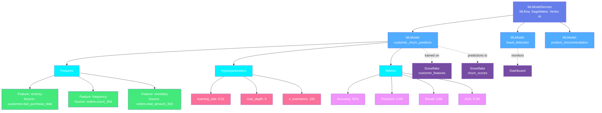
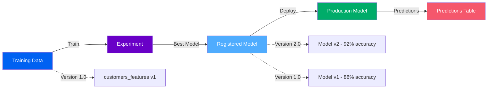
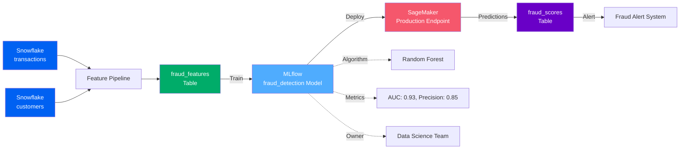
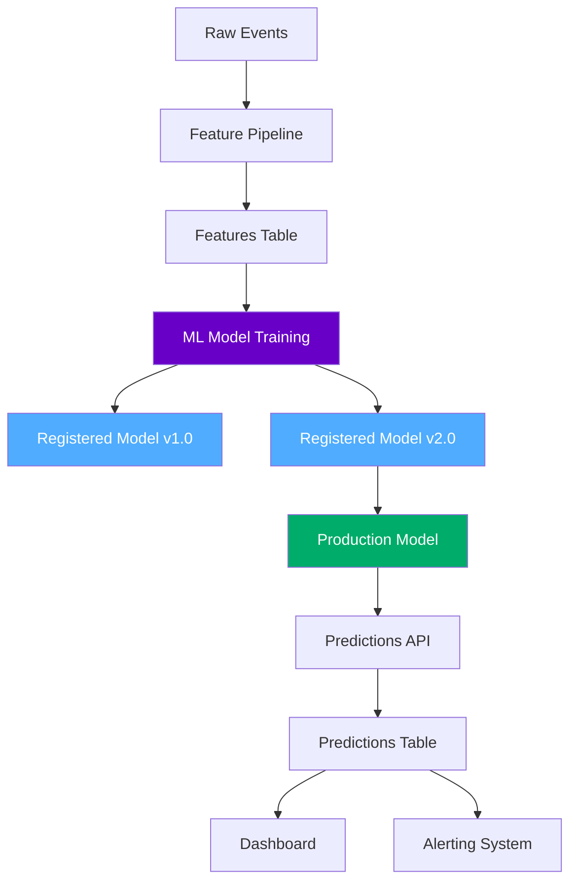

# ML Model Assets

**Machine learning models and AI systems**

ML Model assets represent machine learning models, training datasets, features, and experiments. OpenMetadata models ML assets with a two-level hierarchy for MLOps platforms.

---

## Hierarchy Overview



---

## Why This Hierarchy?

### ML Model Service
**Purpose**: Represents the ML platform or model registry

An ML Model Service is the platform that tracks and serves ML models. It contains configuration for connecting to the MLOps tool and discovering models.

**Examples**:

- `mlflow-prod` - Production MLflow instance
- `sagemaker-models` - AWS SageMaker model registry
- `vertex-ai` - Google Cloud Vertex AI
- `databricks-ml` - Databricks ML workspace

**Why needed**: Organizations use different ML platforms for different teams and use cases (MLflow for experimentation, SageMaker for production, Vertex AI for Google Cloud). The service level organizes models by platform.

**Supported Platforms**: MLflow, AWS SageMaker, Azure ML, Google Vertex AI, Databricks ML, Kubeflow, Weights & Biases, Neptune, H2O

[**View ML Model Service Specification →**](mlmodel-service.md){ .md-button }

---

### ML Model
**Purpose**: Represents a trained machine learning model

An ML Model is a trained algorithm that makes predictions. It has features, training data, performance metrics, versions, and deployment information.

**Examples**:

- `customer_churn_predictor` - Predicts customer churn risk
- `product_recommendation` - Recommends products to users
- `fraud_detection` - Identifies fraudulent transactions
- `demand_forecasting` - Forecasts product demand

**Key Metadata**:

- **Algorithm**: Model type (RandomForest, XGBoost, Neural Network, etc.)
- **Features**: Input variables used for predictions
- **Training Data**: Tables/datasets used for training
- **Performance Metrics**: Accuracy, precision, recall, AUC, etc.
- **Versions**: Model iterations with performance tracking
- **Deployment**: Where and how the model is served
- **Lineage**: Training data → Model → Predictions table
- **Owner**: Data science team or individual

**Why needed**: ML models are critical data assets. Tracking them enables:
- Understanding which data trains which models
- Impact analysis (what breaks if training data changes?)
- Model governance (bias detection, compliance)
- Performance monitoring and model drift detection
- Reproducibility and experiment tracking

[**View ML Model Specification →**](mlmodel.md){ .md-button }

---

## ML Model Lifecycle



**Stages**:
1. **Experimentation**: Train models on different datasets and hyperparameters
2. **Registration**: Register best-performing models in model registry
3. **Deployment**: Deploy models to production (API, batch scoring, edge)
4. **Monitoring**: Track predictions and model performance

---

## Common Patterns

### Pattern 1: MLflow Churn Prediction
```
MLflow Service → customer_churn_predictor Model → Algorithm: XGBoost
                                                 → Features: [recency, frequency, monetary]
                                                 → Training Data: customer_features table
                                                 → Metrics: AUC 0.85, Precision 0.78
```

Classification model predicting customer churn.

### Pattern 2: SageMaker Recommendation Engine
```
SageMaker Service → product_recommendation Model → Algorithm: Collaborative Filtering
                                                  → Features: [user_id, product_views, purchases]
                                                  → Training Data: user_product_interactions
                                                  → Deployment: Real-time endpoint
```

Recommendation model served via API.

### Pattern 3: Vertex AI Demand Forecasting
```
Vertex AI Service → demand_forecasting Model → Algorithm: LSTM Neural Network
                                              → Features: [historical_sales, seasonality, promotions]
                                              → Training Data: sales_history table
                                              → Predictions: future_demand table
```

Time series forecasting model for inventory planning.

---

## Real-World Example

Here's how a data science team builds a fraud detection model:



**Flow**:
1. **Feature Engineering**: Pipeline creates features from transactions and customer data
2. **Training**: Model trained on fraud_features table
3. **Registration**: Model registered in MLflow with metrics
4. **Deployment**: Model deployed to SageMaker endpoint
5. **Scoring**: Real-time predictions written to fraud_scores table
6. **Action**: Alerts trigger for high fraud scores

**Benefits**:

- **Lineage**: Trace predictions back to training data
- **Impact Analysis**: Know which models break if transactions table changes
- **Governance**: Track model performance and bias metrics
- **Reproducibility**: Know exact data and code used for training

---

## ML Model Lineage

ML models create complex lineage across the data platform:



**Data → Features → Model → Predictions → Decisions**

---

## Model Features

Features are the input variables for ML models. OpenMetadata tracks features and their sources:

```json
{
  "modelName": "customer_churn_predictor",
  "features": [
    {
      "name": "recency",
      "dataType": "integer",
      "source": "customers.last_purchase_date",
      "description": "Days since last purchase"
    },
    {
      "name": "frequency",
      "dataType": "integer",
      "source": "orders.count_30d",
      "description": "Number of orders in last 30 days"
    },
    {
      "name": "monetary",
      "dataType": "float",
      "source": "orders.total_amount_30d",
      "description": "Total spend in last 30 days"
    }
  ]
}
```

**Feature Lineage**: Track which table columns become which model features.

---

## Model Versions

ML models evolve over time. OpenMetadata tracks versions:

| Version | Algorithm | Training Data | Accuracy | Deployed | Date |
|---------|-----------|---------------|----------|----------|------|
| v1.0 | Logistic Regression | customers_2024_01 | 82% | No | 2024-01-15 |
| v2.0 | Random Forest | customers_2024_03 | 88% | No | 2024-03-10 |
| v3.0 | XGBoost | customers_2024_06 | 92% | Yes | 2024-06-20 |

**Version Metadata**: Each version has its own metrics, training data, and deployment status.

---

## Model Governance

Track important governance metadata:

- **Fairness Metrics**: Bias detection across demographic groups
- **Explainability**: SHAP values, feature importance
- **Compliance**: GDPR, model cards, audit logs
- **Data Lineage**: Ensure training data quality and provenance
- **Performance Monitoring**: Drift detection, accuracy over time

---

## Entity Specifications

| Entity | Description | Specification |
|--------|-------------|---------------|
| **ML Model Service** | MLOps platform | [View Spec](mlmodel-service.md) |
| **ML Model** | Trained model | [View Spec](mlmodel.md) |

Each specification includes:
- Complete field reference
- JSON Schema definition
- RDF/OWL ontology representation
- JSON-LD context and examples
- Integration with ML platforms

---

## Supported ML Platforms

OpenMetadata supports metadata extraction from:

- **MLflow** - Open-source ML lifecycle platform
- **AWS SageMaker** - Fully managed ML service
- **Azure Machine Learning** - Enterprise ML platform
- **Google Vertex AI** - Unified ML platform
- **Databricks ML** - ML on lakehouse platform
- **Kubeflow** - ML toolkit for Kubernetes
- **Weights & Biases** - ML experiment tracking
- **Neptune.ai** - ML metadata store
- **H2O.ai** - AutoML platform
- **Hugging Face** - Model hub for transformers

---

## Next Steps

1. **Explore specifications** - Click through ML Model entities above
2. **See ML lineage** - Check out [feature lineage to predictions](../../lineage/overview.md)
3. **ML governance** - Learn about model fairness and compliance
