# Notebook

**Jupyter notebooks, Databricks notebooks, and computational notebooks - interactive code, data, and analysis**

---

## Overview

The **Notebook** entity represents computational notebooks used for data exploration, analysis, machine learning development, and documentation. It captures notebook metadata, cells, execution history, dependencies, outputs, and relationships to data sources and ML models across platforms like Jupyter, Databricks, Google Colab, and others.

**Hierarchy**:
```
NotebookService → Notebook → Cells
       OR
User → Notebook → Cells
```

---

## Relationships

Notebook has comprehensive relationships with entities across the metadata platform:

```mermaid
graph TD
    subgraph Hierarchy
        SVC[NotebookService<br/>databricks_workspace]
        SVC --> NB[Notebook<br/>customer_churn_analysis]
    end

    subgraph Cells
        NB --> CELL1[Cell<br/>Data Loading]
        NB --> CELL2[Cell<br/>Feature Engineering]
        NB --> CELL3[Cell<br/>Model Training]
        NB --> CELL4[Cell<br/>Visualization]
    end

    subgraph Data Sources
        NB -.->|reads from| TBL1[Table<br/>customers]
        NB -.->|reads from| TBL2[Table<br/>transactions]
        NB -.->|writes to| TBL3[Table<br/>customer_features]
    end

    subgraph ML Models
        NB -.->|trains| ML1[MLModel<br/>churn_predictor]
        NB -.->|uses| ML2[MLModel<br/>segmentation_model]
    end

    subgraph Dependencies
        NB -.->|depends on| PKG1[Library<br/>pandas]
        NB -.->|depends on| PKG2[Library<br/>scikit-learn]
        NB -.->|depends on| PKG3[Library<br/>matplotlib]
    end

    subgraph Outputs
        NB -.->|generates| OUT1[Container<br/>visualizations/churn_plots.png]
        NB -.->|generates| OUT2[Container<br/>models/churn_model.pkl]
        NB -.->|generates| OUT3[Dashboard<br/>Churn Analysis]
    end

    subgraph Execution
        NB --> EX1[Execution<br/>2024-01-15 10:30]
        NB --> EX2[Execution<br/>2024-01-14 14:15]
        EX1 --> STATUS1[Status: Success]
        EX2 --> STATUS2[Status: Failed]
    end

    subgraph Ownership
        NB -.->|owned by| USER[User<br/>data.scientist]
        NB -.->|owned by| TEAM[Team<br/>Data Science]
        NB -.->|collaborated by| COLLAB1[User<br/>ml.engineer]
        NB -.->|collaborated by| COLLAB2[User<br/>analyst]
    end

    subgraph Governance
        NB -.->|in domain| DOM[Domain<br/>Customer Analytics]
        NB -.->|tagged| TAG1[Tag<br/>Tier.Gold]
        NB -.->|tagged| TAG2[Tag<br/>PII.Sensitive]
        NB -.->|tagged| TAG3[Tag<br/>NotebookType.Analysis]
        NB -.->|linked to| GT[GlossaryTerm<br/>Customer Churn]
    end

    subgraph Pipelines
        PIPE1[Pipeline<br/>scheduled_analysis] -.->|executes| NB
        NB -.->|triggers| PIPE2[Pipeline<br/>model_deployment]
    end

    subgraph Version Control
        NB -.->|stored in| REPO[Repository<br/>github.com/org/notebooks]
        NB --> VER1[Version<br/>v1.0]
        NB --> VER2[Version<br/>v1.1]
    end

    style SVC fill:#667eea,color:#fff
    style NB fill:#4facfe,color:#fff,stroke:#4c51bf,stroke-width:3px
    style CELL1 fill:#00f2fe,color:#333
    style CELL2 fill:#00f2fe,color:#333
    style CELL3 fill:#00f2fe,color:#333
    style CELL4 fill:#00f2fe,color:#333
    style TBL1 fill:#764ba2,color:#fff
    style TBL2 fill:#764ba2,color:#fff
    style TBL3 fill:#764ba2,color:#fff
    style ML1 fill:#f093fb,color:#fff
    style ML2 fill:#f093fb,color:#fff
    style PKG1 fill:#43e97b,color:#fff
    style PKG2 fill:#43e97b,color:#fff
    style PKG3 fill:#43e97b,color:#fff
    style OUT1 fill:#ffd700,color:#333
    style OUT2 fill:#ffd700,color:#333
    style OUT3 fill:#ff6b6b,color:#fff
    style EX1 fill:#00ac69,color:#fff
    style EX2 fill:#00ac69,color:#fff
    style STATUS1 fill:#00f2fe,color:#333
    style STATUS2 fill:#00f2fe,color:#333
    style USER fill:#43e97b,color:#fff
    style TEAM fill:#43e97b,color:#fff
    style COLLAB1 fill:#43e97b,color:#fff
    style COLLAB2 fill:#43e97b,color:#fff
    style DOM fill:#fa709a,color:#fff
    style TAG1 fill:#f093fb,color:#fff
    style TAG2 fill:#f093fb,color:#fff
    style TAG3 fill:#f093fb,color:#fff
    style GT fill:#ffd700,color:#333
    style PIPE1 fill:#f5576c,color:#fff
    style PIPE2 fill:#f5576c,color:#fff
    style REPO fill:#9b59b6,color:#fff
    style VER1 fill:#00f2fe,color:#333
    style VER2 fill:#00f2fe,color:#333
```



**Relationship Types**:

- **Solid lines (→)**: Hierarchical containment (Service contains Notebook, Notebook contains Cells)
- **Dashed lines (-.->)**: References and associations (ownership, governance, lineage, dependencies)

### Parent Entities
- **NotebookService**: The notebook platform hosting this notebook (Jupyter, Databricks, Colab)
- **User**: The creator/owner of the notebook

### Child Entities
- **Cell**: Individual code, markdown, or output cells within the notebook
- **Execution**: Historical execution records with timestamps and status

### Associated Entities
- **Owner**: User or team owning this notebook
- **Collaborator**: Users who have edited or contributed to the notebook
- **Domain**: Business domain assignment
- **Tag**: Classification tags
- **GlossaryTerm**: Business terminology
- **Table**: Tables used as data sources or written to
- **MLModel**: Models trained or used by this notebook
- **Container**: Storage containers for notebook outputs (files, images, data)
- **Dashboard**: Dashboards created or referenced
- **Pipeline**: Pipelines that execute or are triggered by the notebook
- **Repository**: Version control repository storing the notebook
- **Library/Package**: Code dependencies and libraries

---

## Schema Specifications

View the complete Notebook schema in your preferred format:

=== "JSON Schema"

    **Complete JSON Schema Definition**

    ```json
    {
      "$id": "https://open-metadata.org/schema/entity/data/notebook.json",
      "$schema": "http://json-schema.org/draft-07/schema#",
      "title": "Notebook",
      "description": "A `Notebook` represents a computational notebook (Jupyter, Databricks, etc.) containing code, documentation, and outputs.",
      "type": "object",
      "javaType": "org.openmetadata.schema.entity.data.Notebook",

      "definitions": {
        "notebookType": {
          "type": "string",
          "enum": [
            "Jupyter", "Databricks", "Colab", "Zeppelin",
            "DeepNote", "Kaggle", "SageMaker", "Other"
          ],
          "description": "Type of notebook platform"
        },
        "cellType": {
          "type": "string",
          "enum": ["code", "markdown", "raw", "sql"],
          "description": "Type of notebook cell"
        },
        "cell": {
          "type": "object",
          "properties": {
            "id": {
              "type": "string",
              "description": "Cell identifier"
            },
            "cellType": {
              "$ref": "#/definitions/cellType"
            },
            "source": {
              "type": "string",
              "description": "Cell source code or markdown"
            },
            "executionCount": {
              "type": "integer",
              "description": "Execution count for code cells"
            },
            "outputs": {
              "type": "array",
              "description": "Cell outputs",
              "items": {
                "type": "object"
              }
            },
            "metadata": {
              "type": "object",
              "description": "Cell metadata"
            }
          },
          "required": ["cellType", "source"]
        },
        "execution": {
          "type": "object",
          "properties": {
            "executionId": {
              "type": "string",
              "description": "Execution identifier"
            },
            "startTime": {
              "type": "integer",
              "description": "Execution start timestamp"
            },
            "endTime": {
              "type": "integer",
              "description": "Execution end timestamp"
            },
            "status": {
              "type": "string",
              "enum": ["success", "failed", "running", "cancelled"],
              "description": "Execution status"
            },
            "executedBy": {
              "$ref": "../../type/entityReference.json",
              "description": "User who executed the notebook"
            },
            "cluster": {
              "type": "string",
              "description": "Cluster or compute resource used"
            }
          },
          "required": ["executionId", "startTime", "status"]
        },
        "dependency": {
          "type": "object",
          "properties": {
            "library": {
              "type": "string",
              "description": "Library or package name"
            },
            "version": {
              "type": "string",
              "description": "Library version"
            },
            "type": {
              "type": "string",
              "enum": ["python", "r", "scala", "java", "julia"],
              "description": "Library type/language"
            }
          },
          "required": ["library"]
        }
      },

      "properties": {
        "id": {
          "description": "Unique identifier",
          "$ref": "../../type/basic.json#/definitions/uuid"
        },
        "name": {
          "description": "Notebook name",
          "$ref": "../../type/basic.json#/definitions/entityName"
        },
        "fullyQualifiedName": {
          "description": "Fully qualified name: service.notebook or user.notebook",
          "$ref": "../../type/basic.json#/definitions/fullyQualifiedEntityName"
        },
        "displayName": {
          "description": "Display name",
          "type": "string"
        },
        "description": {
          "description": "Markdown description",
          "$ref": "../../type/basic.json#/definitions/markdown"
        },
        "notebookType": {
          "description": "Type of notebook platform",
          "$ref": "#/definitions/notebookType"
        },
        "notebookUrl": {
          "description": "URL to access the notebook",
          "type": "string",
          "format": "uri"
        },
        "cells": {
          "description": "Notebook cells",
          "type": "array",
          "items": {
            "$ref": "#/definitions/cell"
          }
        },
        "kernelspec": {
          "description": "Kernel specification",
          "type": "object",
          "properties": {
            "name": {
              "type": "string",
              "description": "Kernel name (python3, ir, scala, etc.)"
            },
            "language": {
              "type": "string",
              "description": "Programming language"
            },
            "displayName": {
              "type": "string",
              "description": "Kernel display name"
            }
          }
        },
        "dependencies": {
          "description": "Library and package dependencies",
          "type": "array",
          "items": {
            "$ref": "#/definitions/dependency"
          }
        },
        "executions": {
          "description": "Execution history",
          "type": "array",
          "items": {
            "$ref": "#/definitions/execution"
          }
        },
        "outputs": {
          "description": "Generated outputs and artifacts",
          "type": "array",
          "items": {
            "$ref": "../../type/entityReference.json"
          }
        },
        "repository": {
          "description": "Source repository",
          "type": "object",
          "properties": {
            "url": {
              "type": "string",
              "format": "uri"
            },
            "branch": {
              "type": "string"
            },
            "path": {
              "type": "string"
            }
          }
        },
        "service": {
          "description": "Notebook service (Jupyter, Databricks, etc.)",
          "$ref": "../../type/entityReference.json"
        },
        "owner": {
          "description": "Owner (user or team)",
          "$ref": "../../type/entityReference.json"
        },
        "collaborators": {
          "description": "Users who have contributed to this notebook",
          "type": "array",
          "items": {
            "$ref": "../../type/entityReference.json"
          }
        },
        "domain": {
          "description": "Data domain",
          "$ref": "../../type/entityReference.json"
        },
        "tags": {
          "description": "Classification tags",
          "type": "array",
          "items": {
            "$ref": "../../type/tagLabel.json"
          }
        },
        "glossaryTerms": {
          "description": "Business glossary terms",
          "type": "array",
          "items": {
            "$ref": "../../type/entityReference.json"
          }
        },
        "version": {
          "description": "Metadata version",
          "$ref": "../../type/entityHistory.json#/definitions/entityVersion"
        }
      },

      "required": ["id", "name", "notebookType"]
    }
    ```

    **[View Full JSON Schema →](https://github.com/open-metadata/OpenMetadataStandards/blob/main/schemas/entity/data/notebook.json)**

=== "RDF"

    **RDF/OWL Ontology Definition**

    ```turtle
    @prefix om: <https://open-metadata.org/schema/> .
    @prefix rdfs: <http://www.w3.org/2000/01/rdf-schema#> .
    @prefix owl: <http://www.w3.org/2001/XMLSchema#> .
    @prefix xsd: <http://www.w3.org/2001/XMLSchema#> .

    # Notebook Class Definition
    om:Notebook a owl:Class ;
        rdfs:subClassOf om:DataAsset ;
        rdfs:label "Notebook" ;
        rdfs:comment "A computational notebook containing code, documentation, and outputs" ;
        om:hierarchyLevel 2 .

    # Properties
    om:notebookName a owl:DatatypeProperty ;
        rdfs:domain om:Notebook ;
        rdfs:range xsd:string ;
        rdfs:label "name" ;
        rdfs:comment "Name of the notebook" .

    om:fullyQualifiedName a owl:DatatypeProperty ;
        rdfs:domain om:Notebook ;
        rdfs:range xsd:string ;
        rdfs:label "fullyQualifiedName" ;
        rdfs:comment "Complete hierarchical name: service.notebook or user.notebook" .

    om:notebookType a owl:DatatypeProperty ;
        rdfs:domain om:Notebook ;
        rdfs:range om:NotebookType ;
        rdfs:label "notebookType" ;
        rdfs:comment "Platform type (Jupyter, Databricks, Colab, etc.)" .

    om:notebookUrl a owl:DatatypeProperty ;
        rdfs:domain om:Notebook ;
        rdfs:range xsd:anyURI ;
        rdfs:label "notebookUrl" ;
        rdfs:comment "URL to access the notebook" .

    om:hasCell a owl:ObjectProperty ;
        rdfs:domain om:Notebook ;
        rdfs:range om:Cell ;
        rdfs:label "hasCell" ;
        rdfs:comment "Cells contained in this notebook" .

    om:hasExecution a owl:ObjectProperty ;
        rdfs:domain om:Notebook ;
        rdfs:range om:Execution ;
        rdfs:label "hasExecution" ;
        rdfs:comment "Execution records for this notebook" .

    om:dependsOn a owl:ObjectProperty ;
        rdfs:domain om:Notebook ;
        rdfs:range om:Dependency ;
        rdfs:label "dependsOn" ;
        rdfs:comment "Library and package dependencies" .

    om:readsFrom a owl:ObjectProperty ;
        rdfs:domain om:Notebook ;
        rdfs:range om:Table ;
        rdfs:label "readsFrom" ;
        rdfs:comment "Tables read by this notebook" .

    om:writesTo a owl:ObjectProperty ;
        rdfs:domain om:Notebook ;
        rdfs:range om:Table ;
        rdfs:label "writesTo" ;
        rdfs:comment "Tables written by this notebook" .

    om:trains a owl:ObjectProperty ;
        rdfs:domain om:Notebook ;
        rdfs:range om:MlModel ;
        rdfs:label "trains" ;
        rdfs:comment "ML models trained in this notebook" .

    om:generates a owl:ObjectProperty ;
        rdfs:domain om:Notebook ;
        rdfs:range om:Container ;
        rdfs:label "generates" ;
        rdfs:comment "Output artifacts generated" .

    om:belongsToService a owl:ObjectProperty ;
        rdfs:domain om:Notebook ;
        rdfs:range om:NotebookService ;
        rdfs:label "belongsToService" ;
        rdfs:comment "Parent notebook service" .

    om:ownedBy a owl:ObjectProperty ;
        rdfs:domain om:Notebook ;
        rdfs:range om:Owner ;
        rdfs:label "ownedBy" ;
        rdfs:comment "User or team that owns this notebook" .

    om:collaboratedBy a owl:ObjectProperty ;
        rdfs:domain om:Notebook ;
        rdfs:range om:User ;
        rdfs:label "collaboratedBy" ;
        rdfs:comment "Users who have contributed" .

    om:hasTag a owl:ObjectProperty ;
        rdfs:domain om:Notebook ;
        rdfs:range om:Tag ;
        rdfs:label "hasTag" ;
        rdfs:comment "Classification tags applied to notebook" .

    # Cell Class
    om:Cell a owl:Class ;
        rdfs:label "Notebook Cell" ;
        rdfs:comment "A cell within a notebook" .

    om:cellType a owl:DatatypeProperty ;
        rdfs:domain om:Cell ;
        rdfs:range om:CellType .

    om:cellSource a owl:DatatypeProperty ;
        rdfs:domain om:Cell ;
        rdfs:range xsd:string .

    # Execution Class
    om:Execution a owl:Class ;
        rdfs:label "Notebook Execution" ;
        rdfs:comment "An execution record of a notebook" .

    om:executionStatus a owl:DatatypeProperty ;
        rdfs:domain om:Execution ;
        rdfs:range om:ExecutionStatus .

    # Example Instance
    ex:churn_analysis a om:Notebook ;
        om:notebookName "customer_churn_analysis" ;
        om:fullyQualifiedName "databricks_workspace.customer_churn_analysis" ;
        om:notebookType "Databricks" ;
        om:notebookUrl "https://databricks.example.com/notebooks/churn_analysis" ;
        om:belongsToService ex:databricksWorkspace ;
        om:ownedBy ex:dataScientist ;
        om:hasTag ex:tierGold ;
        om:hasTag ex:notebookTypeAnalysis ;
        om:hasCell ex:cell_data_loading ;
        om:hasCell ex:cell_feature_engineering ;
        om:readsFrom ex:customersTable ;
        om:readsFrom ex:transactionsTable ;
        om:trains ex:churnPredictorModel ;
        om:generates ex:churnPlotsOutput .
    ```

    **[View Full RDF Ontology →](https://github.com/open-metadata/OpenMetadataStandards/blob/main/rdf/ontology/openmetadata.ttl)**

=== "JSON-LD"

    **JSON-LD Context and Example**

    ```json
    {
      "@context": {
        "@vocab": "https://open-metadata.org/schema/",
        "om": "https://open-metadata.org/schema/",
        "rdfs": "http://www.w3.org/2000/01/rdf-schema#",
        "xsd": "http://www.w3.org/2001/XMLSchema#",

        "Notebook": "om:Notebook",
        "name": {
          "@id": "om:notebookName",
          "@type": "xsd:string"
        },
        "fullyQualifiedName": {
          "@id": "om:fullyQualifiedName",
          "@type": "xsd:string"
        },
        "displayName": {
          "@id": "om:displayName",
          "@type": "xsd:string"
        },
        "description": {
          "@id": "om:description",
          "@type": "xsd:string"
        },
        "notebookType": {
          "@id": "om:notebookType",
          "@type": "@vocab"
        },
        "notebookUrl": {
          "@id": "om:notebookUrl",
          "@type": "xsd:anyURI"
        },
        "cells": {
          "@id": "om:hasCell",
          "@type": "@id",
          "@container": "@list"
        },
        "executions": {
          "@id": "om:hasExecution",
          "@type": "@id",
          "@container": "@list"
        },
        "dependencies": {
          "@id": "om:dependsOn",
          "@type": "@id",
          "@container": "@set"
        },
        "service": {
          "@id": "om:belongsToService",
          "@type": "@id"
        },
        "owner": {
          "@id": "om:ownedBy",
          "@type": "@id"
        },
        "collaborators": {
          "@id": "om:collaboratedBy",
          "@type": "@id",
          "@container": "@set"
        },
        "domain": {
          "@id": "om:inDomain",
          "@type": "@id"
        },
        "tags": {
          "@id": "om:hasTag",
          "@type": "@id",
          "@container": "@set"
        },
        "glossaryTerms": {
          "@id": "om:linkedToGlossaryTerm",
          "@type": "@id",
          "@container": "@set"
        }
      }
    }
    ```

    **Example JSON-LD Instance**:

    ```json
    {
      "@context": "https://open-metadata.org/context/notebook.jsonld",
      "@type": "Notebook",
      "@id": "https://example.com/notebooks/customer_churn_analysis",

      "name": "customer_churn_analysis",
      "fullyQualifiedName": "databricks_workspace.customer_churn_analysis",
      "displayName": "Customer Churn Analysis",
      "description": "Comprehensive analysis of customer churn patterns using machine learning",
      "notebookType": "Databricks",
      "notebookUrl": "https://databricks.example.com/notebooks/churn_analysis",

      "service": {
        "@id": "https://example.com/services/databricks_workspace",
        "@type": "NotebookService",
        "name": "databricks_workspace"
      },

      "kernelspec": {
        "name": "python3",
        "language": "python",
        "displayName": "Python 3"
      },

      "cells": [
        {
          "@type": "Cell",
          "cellType": "markdown",
          "source": "# Customer Churn Analysis\nThis notebook analyzes customer behavior patterns to predict churn."
        },
        {
          "@type": "Cell",
          "cellType": "code",
          "source": "import pandas as pd\nimport numpy as np\nfrom sklearn.ensemble import RandomForest",
          "executionCount": 1
        },
        {
          "@type": "Cell",
          "cellType": "code",
          "source": "df = spark.table('customers')",
          "executionCount": 2
        }
      ],

      "dependencies": [
        {
          "library": "pandas",
          "version": "2.0.0",
          "type": "python"
        },
        {
          "library": "scikit-learn",
          "version": "1.3.0",
          "type": "python"
        },
        {
          "library": "matplotlib",
          "version": "3.7.0",
          "type": "python"
        }
      ],

      "executions": [
        {
          "executionId": "exec-2024-01-15-103045",
          "startTime": 1705315845000,
          "endTime": 1705316145000,
          "status": "success",
          "executedBy": {
            "@id": "https://example.com/users/data.scientist",
            "@type": "User"
          },
          "cluster": "ml-cluster-001"
        }
      ],

      "owner": {
        "@id": "https://example.com/users/data.scientist",
        "@type": "User",
        "name": "data.scientist"
      },

      "collaborators": [
        {
          "@id": "https://example.com/users/ml.engineer",
          "@type": "User",
          "name": "ml.engineer"
        }
      ],

      "tags": [
        {
          "@id": "https://open-metadata.org/tags/Tier/Gold",
          "tagFQN": "Tier.Gold"
        },
        {
          "@id": "https://open-metadata.org/tags/NotebookType/Analysis",
          "tagFQN": "NotebookType.Analysis"
        }
      ]
    }
    ```

    **[View Full JSON-LD Context →](https://github.com/open-metadata/OpenMetadataStandards/blob/main/rdf/contexts/notebook.jsonld)**

---

## Use Cases

- Catalog notebooks across Jupyter, Databricks, Colab, and other platforms
- Document analysis workflows and data science processes
- Track notebook lineage to source data and generated models
- Discover notebooks by author, topic, or data sources used
- Monitor notebook execution history and performance
- Apply governance tags (PII-sensitive, production-ready, experimental)
- Enable collaboration by tracking contributors
- Capture dependencies for reproducibility
- Link notebooks to ML models they train
- Track outputs and artifacts generated by notebooks
- Schedule and orchestrate notebook execution
- Version control integration and change tracking

---

## JSON Schema Specification

### Core Properties

#### `id` (uuid)
**Type**: `string` (UUID format)
**Required**: Yes (system-generated)
**Description**: Unique identifier for this notebook instance

```json
{
  "id": "3c4d5e6f-7a8b-9c0d-1e2f-3a4b5c6d7e8f"
}
```

---

#### `name` (entityName)
**Type**: `string`
**Required**: Yes
**Pattern**: `^[^.]*$` (no dots allowed)
**Min Length**: 1
**Max Length**: 256
**Description**: Name of the notebook (unqualified)

```json
{
  "name": "customer_churn_analysis"
}
```

---

#### `fullyQualifiedName` (fullyQualifiedEntityName)
**Type**: `string`
**Required**: Yes (system-generated)
**Pattern**: `^((?!::).)*$`
**Description**: Fully qualified name in the format `service.notebook` or `user.notebook`

```json
{
  "fullyQualifiedName": "databricks_workspace.customer_churn_analysis"
}
```

---

#### `displayName`
**Type**: `string`
**Required**: No
**Description**: Human-readable display name

```json
{
  "displayName": "Customer Churn Analysis"
}
```

---

#### `description` (markdown)
**Type**: `string` (Markdown format)
**Required**: No
**Description**: Rich text description of the notebook's purpose and methodology

```json
{
  "description": "# Customer Churn Analysis\n\nThis notebook performs comprehensive churn prediction analysis.\n\n## Objectives\n- Identify at-risk customers\n- Build predictive model\n- Generate actionable insights\n\n## Methodology\n1. Load customer and transaction data\n2. Engineer RFM features\n3. Train XGBoost classifier\n4. Evaluate model performance\n5. Generate visualizations"
}
```

---

### Notebook Configuration

#### `notebookType` (NotebookType enum)
**Type**: `string` enum
**Required**: Yes
**Allowed Values**:

- `Jupyter` - Jupyter Notebook/Lab
- `Databricks` - Databricks Notebook
- `Colab` - Google Colab
- `Zeppelin` - Apache Zeppelin
- `DeepNote` - DeepNote collaborative notebook
- `Kaggle` - Kaggle Kernel
- `SageMaker` - AWS SageMaker Notebook
- `Other` - Other notebook platform

```json
{
  "notebookType": "Databricks"
}
```

---

#### `notebookUrl` (uri)
**Type**: `string` (URI format)
**Required**: No
**Description**: External URL to access the notebook

```json
{
  "notebookUrl": "https://databricks.example.com/notebooks/churn_analysis"
}
```

---

#### `kernelspec` (object)
**Type**: `object`
**Required**: No
**Description**: Kernel specification for the notebook

**Properties**:

- `name` (string): Kernel name (python3, ir, scala, etc.)
- `language` (string): Programming language
- `displayName` (string): Kernel display name

```json
{
  "kernelspec": {
    "name": "python3",
    "language": "python",
    "displayName": "Python 3.10"
  }
}
```

---

### Content Properties

#### `cells[]` (Cell[])
**Type**: `array` of Cell objects
**Required**: No
**Description**: Cells contained in the notebook

**Cell Object Properties**:

| Property | Type | Required | Description |
|----------|------|----------|-------------|
| `id` | string | No | Cell identifier |
| `cellType` | enum | Yes | Type: code, markdown, raw, sql |
| `source` | string | Yes | Cell source code or markdown |
| `executionCount` | integer | No | Execution count for code cells |
| `outputs` | array | No | Cell outputs |
| `metadata` | object | No | Cell metadata |

**Example**:

```json
{
  "cells": [
    {
      "id": "cell-1",
      "cellType": "markdown",
      "source": "# Customer Churn Analysis\nThis notebook analyzes customer behavior patterns."
    },
    {
      "id": "cell-2",
      "cellType": "code",
      "source": "import pandas as pd\nimport numpy as np\nfrom sklearn.ensemble import RandomForestClassifier",
      "executionCount": 1,
      "outputs": [],
      "metadata": {
        "tags": ["imports"]
      }
    },
    {
      "id": "cell-3",
      "cellType": "code",
      "source": "# Load customer data\ndf = spark.table('ecommerce.customers')\nprint(f'Loaded {len(df)} customers')",
      "executionCount": 2,
      "outputs": [
        {
          "output_type": "stream",
          "text": "Loaded 125000 customers\n"
        }
      ]
    },
    {
      "id": "cell-4",
      "cellType": "sql",
      "source": "SELECT segment, COUNT(*) as count\nFROM ecommerce.customers\nGROUP BY segment",
      "executionCount": 3,
      "outputs": []
    }
  ]
}
```

---

### Dependencies

#### `dependencies[]` (Dependency[])
**Type**: `array` of Dependency objects
**Required**: No
**Description**: Libraries and packages required by the notebook

**Dependency Object**:

```json
{
  "dependencies": [
    {
      "library": "pandas",
      "version": "2.0.0",
      "type": "python"
    },
    {
      "library": "scikit-learn",
      "version": "1.3.0",
      "type": "python"
    },
    {
      "library": "matplotlib",
      "version": "3.7.0",
      "type": "python"
    },
    {
      "library": "seaborn",
      "version": "0.12.2",
      "type": "python"
    },
    {
      "library": "xgboost",
      "version": "2.0.0",
      "type": "python"
    }
  ]
}
```

---

### Execution History

#### `executions[]` (Execution[])
**Type**: `array` of Execution objects
**Required**: No
**Description**: Historical execution records

**Execution Object Properties**:

| Property | Type | Required | Description |
|----------|------|----------|-------------|
| `executionId` | string | Yes | Execution identifier |
| `startTime` | integer | Yes | Start timestamp (epoch ms) |
| `endTime` | integer | No | End timestamp (epoch ms) |
| `status` | enum | Yes | Status: success, failed, running, cancelled |
| `executedBy` | EntityReference | No | User who executed |
| `cluster` | string | No | Compute cluster used |

**Example**:

```json
{
  "executions": [
    {
      "executionId": "exec-2024-01-15-103045",
      "startTime": 1705315845000,
      "endTime": 1705316145000,
      "status": "success",
      "executedBy": {
        "id": "user-uuid",
        "type": "user",
        "name": "data.scientist"
      },
      "cluster": "ml-cluster-001"
    },
    {
      "executionId": "exec-2024-01-14-141530",
      "startTime": 1705245330000,
      "endTime": 1705245890000,
      "status": "failed",
      "executedBy": {
        "id": "user-uuid",
        "type": "user",
        "name": "data.scientist"
      },
      "cluster": "ml-cluster-001"
    }
  ]
}
```

---

### Outputs

#### `outputs[]` (EntityReference[])
**Type**: `array` of entity references
**Required**: No
**Description**: Artifacts and outputs generated by the notebook

```json
{
  "outputs": [
    {
      "id": "container-uuid-1",
      "type": "container",
      "name": "churn_plots.png",
      "fullyQualifiedName": "s3://artifacts/visualizations/churn_plots.png"
    },
    {
      "id": "container-uuid-2",
      "type": "container",
      "name": "churn_model.pkl",
      "fullyQualifiedName": "s3://models/churn/churn_model.pkl"
    },
    {
      "id": "dashboard-uuid",
      "type": "dashboard",
      "name": "churn_analysis_dashboard",
      "fullyQualifiedName": "tableau.churn_analysis_dashboard"
    }
  ]
}
```

---

### Version Control

#### `repository` (object)
**Type**: `object`
**Required**: No
**Description**: Source repository information

**Properties**:

- `url` (string, uri): Repository URL
- `branch` (string): Branch name
- `path` (string): Path to notebook in repository

```json
{
  "repository": {
    "url": "https://github.com/organization/data-science-notebooks",
    "branch": "main",
    "path": "churn-analysis/customer_churn_analysis.ipynb"
  }
}
```

---

### Location Properties

#### `service` (EntityReference)
**Type**: `object`
**Required**: No (one of service or owner required)
**Description**: Reference to parent notebook service

```json
{
  "service": {
    "id": "service-uuid",
    "type": "notebookService",
    "name": "databricks_workspace",
    "fullyQualifiedName": "databricks_workspace"
  }
}
```

---

### Governance Properties

#### `owner` (EntityReference)
**Type**: `object`
**Required**: No
**Description**: User or team that owns this notebook

```json
{
  "owner": {
    "id": "user-uuid",
    "type": "user",
    "name": "data.scientist",
    "displayName": "Jane Smith"
  }
}
```

---

#### `collaborators[]` (EntityReference[])
**Type**: `array` of user references
**Required**: No
**Description**: Users who have contributed to or collaborated on this notebook

```json
{
  "collaborators": [
    {
      "id": "user-uuid-1",
      "type": "user",
      "name": "ml.engineer",
      "displayName": "John Doe"
    },
    {
      "id": "user-uuid-2",
      "type": "user",
      "name": "data.analyst",
      "displayName": "Sarah Johnson"
    }
  ]
}
```

---

#### `domain` (EntityReference)
**Type**: `object`
**Required**: No
**Description**: Data domain this notebook belongs to

```json
{
  "domain": {
    "id": "domain-uuid",
    "type": "domain",
    "name": "Customer Analytics",
    "fullyQualifiedName": "Customer Analytics"
  }
}
```

---

#### `tags[]` (TagLabel[])
**Type**: `array`
**Required**: No
**Description**: Classification tags applied to the notebook

```json
{
  "tags": [
    {
      "tagFQN": "Tier.Gold",
      "description": "Production-quality notebook",
      "source": "Classification",
      "labelType": "Manual",
      "state": "Confirmed"
    },
    {
      "tagFQN": "NotebookType.Analysis",
      "source": "Classification",
      "labelType": "Automated",
      "state": "Confirmed"
    },
    {
      "tagFQN": "PII.Sensitive",
      "description": "Contains customer PII",
      "source": "Classification",
      "labelType": "Manual",
      "state": "Confirmed"
    }
  ]
}
```

---

#### `glossaryTerms[]` (GlossaryTerm[])
**Type**: `array`
**Required**: No
**Description**: Business glossary terms linked to this notebook

```json
{
  "glossaryTerms": [
    {
      "fullyQualifiedName": "BusinessGlossary.CustomerChurn"
    },
    {
      "fullyQualifiedName": "BusinessGlossary.MachineLearning"
    }
  ]
}
```

---

### Versioning Properties

#### `version` (entityVersion)
**Type**: `number`
**Required**: Yes (system-managed)
**Description**: Metadata version number, incremented on changes

```json
{
  "version": 2.4
}
```

---

#### `updatedAt` (timestamp)
**Type**: `integer` (Unix epoch milliseconds)
**Required**: Yes (system-managed)
**Description**: Last update timestamp

```json
{
  "updatedAt": 1705315845000
}
```

---

#### `updatedBy` (string)
**Type**: `string`
**Required**: Yes (system-managed)
**Description**: User who made the update

```json
{
  "updatedBy": "data.scientist"
}
```

---

## Complete Examples

### Example 1: Jupyter Notebook for ML Training

```json
{
  "id": "3c4d5e6f-7a8b-9c0d-1e2f-3a4b5c6d7e8f",
  "name": "customer_churn_predictor",
  "fullyQualifiedName": "jupyter_prod.customer_churn_predictor",
  "displayName": "Customer Churn Predictor",
  "description": "# ML Model Training\n\nTrains XGBoost model to predict customer churn.\n\n## Performance\n- AUC: 0.85\n- Precision: 0.78",
  "notebookType": "Jupyter",
  "notebookUrl": "https://jupyter.example.com/notebooks/churn_predictor.ipynb",
  "kernelspec": {
    "name": "python3",
    "language": "python",
    "displayName": "Python 3.10"
  },
  "cells": [
    {
      "cellType": "markdown",
      "source": "# Customer Churn Predictor"
    },
    {
      "cellType": "code",
      "source": "import pandas as pd\nimport xgboost as xgb",
      "executionCount": 1
    }
  ],
  "dependencies": [
    {"library": "pandas", "version": "2.0.0", "type": "python"},
    {"library": "xgboost", "version": "2.0.0", "type": "python"}
  ],
  "executions": [
    {
      "executionId": "exec-1",
      "startTime": 1705315845000,
      "endTime": 1705316145000,
      "status": "success",
      "executedBy": {
        "type": "user",
        "name": "data.scientist"
      }
    }
  ],
  "repository": {
    "url": "https://github.com/org/ml-notebooks",
    "branch": "main",
    "path": "churn/customer_churn_predictor.ipynb"
  },
  "owner": {
    "type": "user",
    "name": "data.scientist"
  },
  "domain": {
    "type": "domain",
    "name": "Customer Analytics"
  },
  "tags": [
    {"tagFQN": "Tier.Gold"},
    {"tagFQN": "NotebookType.MLTraining"}
  ]
}
```

### Example 2: Databricks ETL Notebook

```json
{
  "id": "4d5e6f7a-8b9c-0d1e-2f3a-4b5c6d7e8f9a",
  "name": "daily_sales_etl",
  "fullyQualifiedName": "databricks_workspace.daily_sales_etl",
  "displayName": "Daily Sales ETL",
  "description": "Extracts, transforms, and loads daily sales data",
  "notebookType": "Databricks",
  "notebookUrl": "https://databricks.example.com/notebooks/daily_sales_etl",
  "kernelspec": {
    "name": "python3",
    "language": "python"
  },
  "cells": [
    {
      "cellType": "sql",
      "source": "CREATE OR REPLACE TABLE sales_daily AS\nSELECT date, SUM(amount) as total\nFROM transactions\nWHERE date = CURRENT_DATE\nGROUP BY date",
      "executionCount": 1
    }
  ],
  "executions": [
    {
      "executionId": "exec-daily-001",
      "startTime": 1705315845000,
      "endTime": 1705315945000,
      "status": "success",
      "executedBy": {
        "type": "user",
        "name": "data.engineer"
      },
      "cluster": "etl-cluster-prod"
    }
  ],
  "service": {
    "type": "notebookService",
    "name": "databricks_workspace"
  },
  "owner": {
    "type": "team",
    "name": "data-engineering"
  },
  "tags": [
    {"tagFQN": "Tier.Production"},
    {"tagFQN": "NotebookType.ETL"}
  ]
}
```

### Example 3: Google Colab Analysis Notebook

```json
{
  "id": "5e6f7a8b-9c0d-1e2f-3a4b-5c6d7e8f9a0b",
  "name": "market_basket_analysis",
  "fullyQualifiedName": "sarah.johnson.market_basket_analysis",
  "displayName": "Market Basket Analysis",
  "description": "Analyzes product purchase patterns using association rules",
  "notebookType": "Colab",
  "notebookUrl": "https://colab.research.google.com/drive/abc123",
  "kernelspec": {
    "name": "python3",
    "language": "python"
  },
  "dependencies": [
    {"library": "pandas", "version": "2.0.0", "type": "python"},
    {"library": "mlxtend", "version": "0.22.0", "type": "python"}
  ],
  "owner": {
    "type": "user",
    "name": "sarah.johnson"
  },
  "collaborators": [
    {
      "type": "user",
      "name": "mike.chen"
    }
  ],
  "tags": [
    {"tagFQN": "NotebookType.Analysis"},
    {"tagFQN": "BusinessDomain.Retail"}
  ]
}
```

---

## Custom Properties

This entity supports custom properties through the `extension` field.
Common custom properties include:

- **Data Classification**: Sensitivity level
- **Cost Center**: Billing allocation
- **Retention Period**: Data retention requirements
- **Application Owner**: Owning application/team

See [Custom Properties](../../metadata-specifications/custom-properties.md)
for details on defining and using custom properties.

---

## Related Documentation

- **[Notebook Service](notebook-service.md)** - Service configuration
- **[ML Model](../ml/mlmodel.md)** - ML models trained in notebooks
- **[Table](../databases/table.md)** - Data sources and outputs
- **[Pipeline](../pipelines/pipeline.md)** - Notebook orchestration
- **[Container](../storage/container.md)** - Output artifacts
- **[Lineage](../../lineage/overview.md)** - Notebook lineage tracking
- **[Governance](../../governance/overview.md)** - Notebook governance
