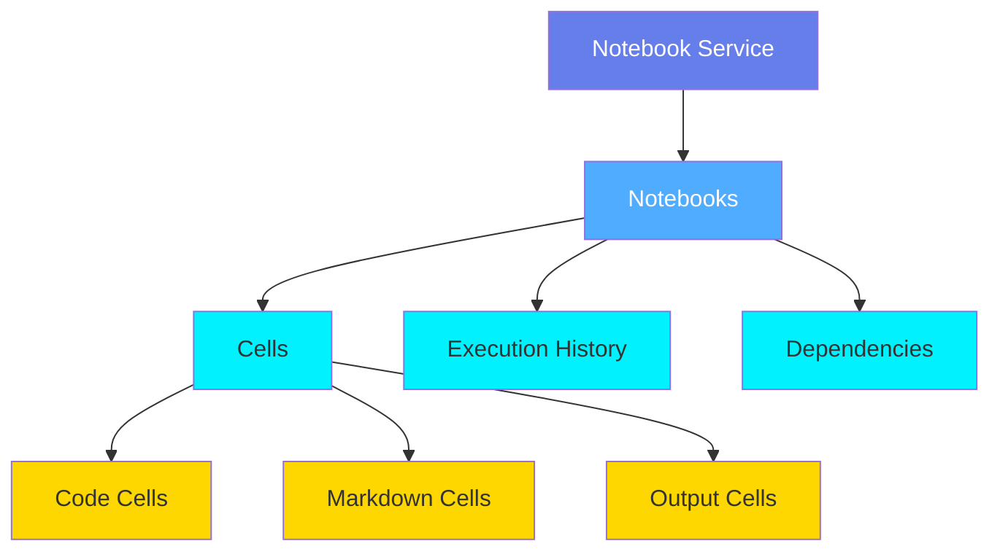
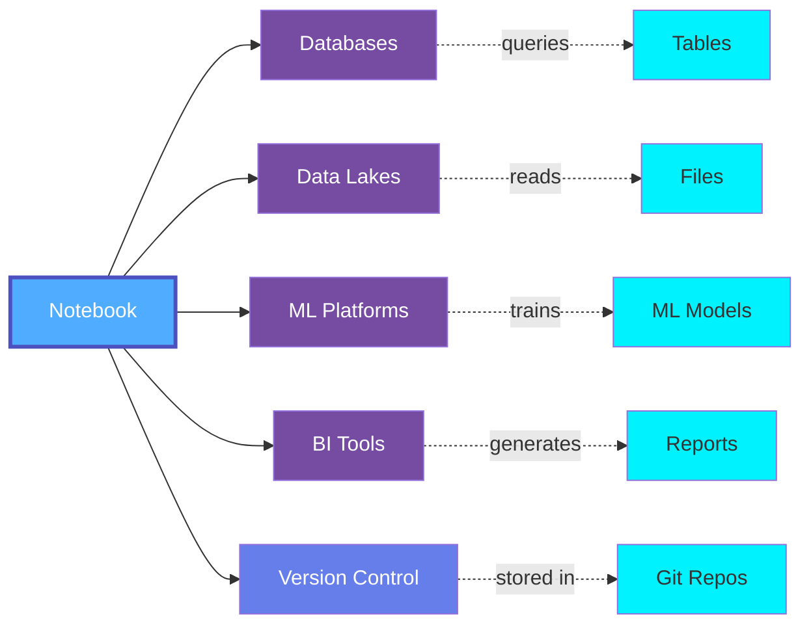

# Notebooks Overview

**Notebooks** in OpenMetadata represent interactive computational documents that combine code, visualizations, and narrative text. Notebooks are essential tools for data exploration, analysis, machine learning development, and collaborative data science.

## What are Notebooks?

Notebooks provide an interactive environment where data professionals can:

- **Explore Data**: Query databases, files, and APIs interactively
- **Develop Models**: Build and train machine learning models
- **Create Visualizations**: Generate charts and graphs inline
- **Document Analysis**: Combine code with explanatory text and findings
- **Share Insights**: Collaborate with teams on data analysis
- **Prototype Pipelines**: Develop and test data transformations

## Notebook Types

OpenMetadata supports various notebook platforms:

### Jupyter Notebooks
- Industry-standard notebooks for Python, R, Julia
- Rich visualization ecosystem
- Extensive library support
- Local and cloud-hosted (JupyterHub, JupyterLab)

### Databricks Notebooks
- Enterprise notebooks on Databricks platform
- Integrated with Apache Spark
- Collaborative editing
- Production-ready data pipelines

### Google Colab
- Cloud-based Jupyter notebooks
- Free GPU/TPU access
- Easy sharing and collaboration
- Integration with Google Drive

### Apache Zeppelin
- Web-based notebooks for big data
- Multi-language support
- Built-in visualization
- Integration with Hadoop ecosystem

### Azure Notebooks
- Cloud notebooks on Microsoft Azure
- Integration with Azure services
- Scalable compute resources

### Amazon SageMaker Notebooks
- AWS-managed Jupyter notebooks
- ML-optimized environments
- Integration with SageMaker services

## Notebook Entities

### Notebook Metadata

OpenMetadata captures:

- **Notebook Properties**: Name, path, version, last execution
- **Cell Structure**: Code cells, markdown cells, outputs
- **Data Dependencies**: Tables, files, APIs accessed by the notebook
- **Compute Resources**: Kernel type, cluster configuration
- **Execution History**: Run history, execution times, results
- **Collaboration**: Authors, contributors, reviewers
- **Lineage**: Data sources used and targets created
- **Tags & Classification**: Organization and discovery

## Use Cases

### Data Exploration
Analysts use notebooks to:
- Query databases interactively
- Explore data distributions
- Identify data quality issues
- Prototype analyses

### ML Development
Data scientists use notebooks to:
- Feature engineering
- Model training and evaluation
- Hyperparameter tuning
- Experiment tracking

### Reporting & Analytics
Teams use notebooks for:
- Ad-hoc analysis
- Business intelligence
- Automated reporting
- Data storytelling

### ETL Development
Engineers use notebooks to:
- Develop data transformations
- Test pipeline logic
- Prototype workflows
- Debug data issues

### Education & Documentation
Organizations use notebooks for:
- Training materials
- Code documentation
- Best practices sharing
- Reproducible research

## Notebook Governance

### Ownership & Access
- Clear ownership assignment
- Access control and permissions
- Sharing policies
- Version control integration

### Quality & Standards
- Code review processes
- Testing requirements
- Documentation standards
- Naming conventions

### Lineage Tracking
- Track data sources used
- Identify downstream consumers
- Understand impact of changes
- Map dependencies

### Security & Compliance
- Credential management
- PII data handling
- Audit logging
- Encryption requirements

## Integration Points

Notebooks integrate with:

## Best Practices

### 1. Version Control
Store notebooks in Git repositories for versioning and collaboration.

### 2. Modular Design
Break complex analyses into reusable functions and libraries.

### 3. Document Thoroughly
Use markdown cells to explain logic, assumptions, and findings.

### 4. Parameterize Notebooks
Make notebooks reusable with parameters instead of hardcoding values.

### 5. Test Code
Include assertions and tests to validate results.

### 6. Manage Dependencies
Document required libraries and versions.

### 7. Clean Outputs
Clear outputs before committing to version control.

### 8. Track Data Lineage
Document data sources and transformations clearly.

## Related Entities

- **[Notebook](./notebook.md)**: Individual notebook entity specification
- **[Table](../databases/table.md)**: Database tables accessed by notebooks
- **[File](../storage/file.md)**: Data files used in notebooks
- **[ML Model](../ml/mlmodel.md)**: Models trained in notebooks
- **[Pipeline](../pipelines/pipeline.md)**: Pipelines developed from notebooks
- **[User](../../teams-users/user.md)**: Notebook authors and contributors

## Next Steps

- **[Notebook Entity](./notebook.md)**: Detailed specification for notebook entities
- **[Application Overview](../applications/overview.md)**: Related application entity documentation
