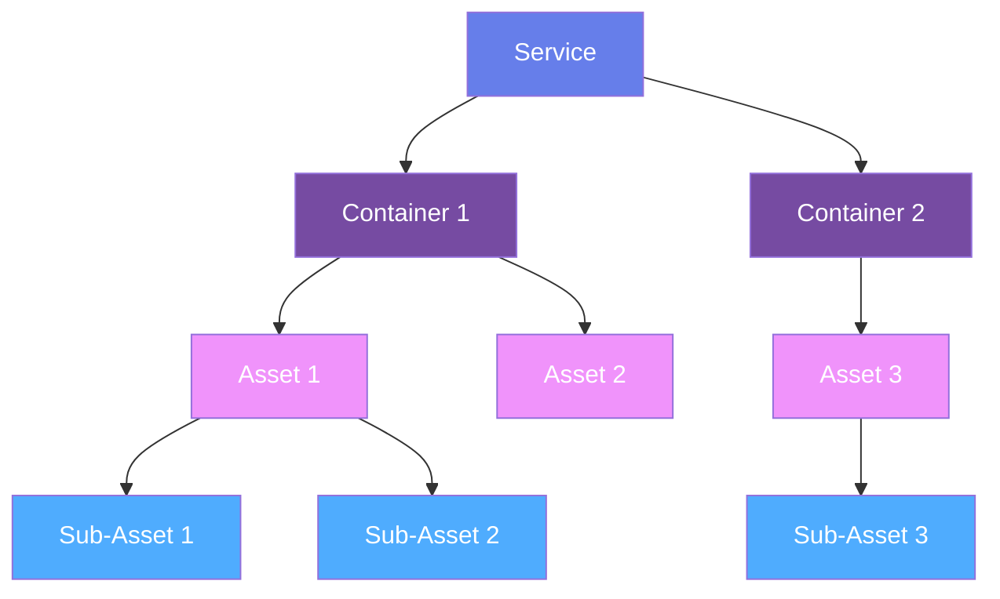
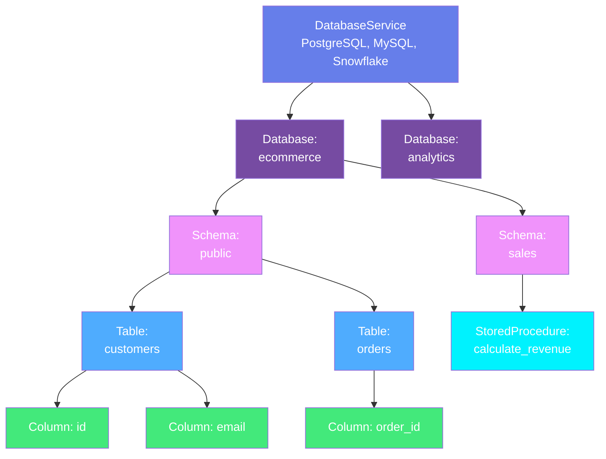
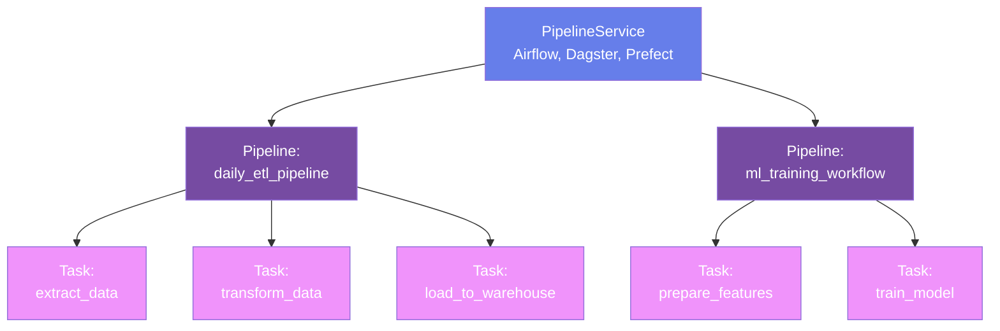
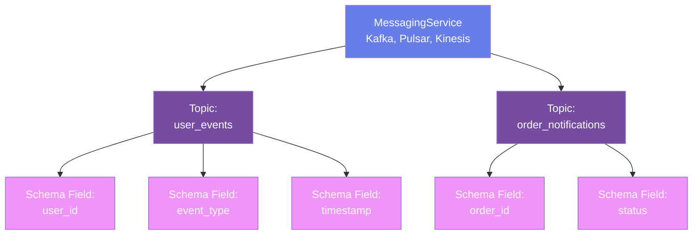
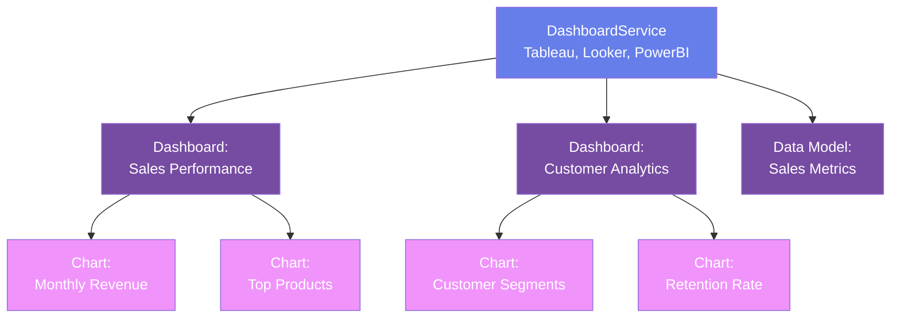
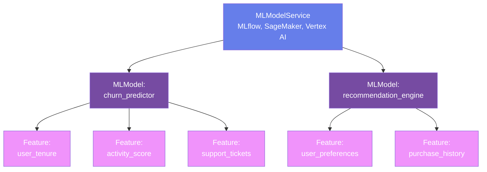
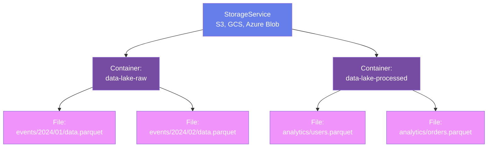
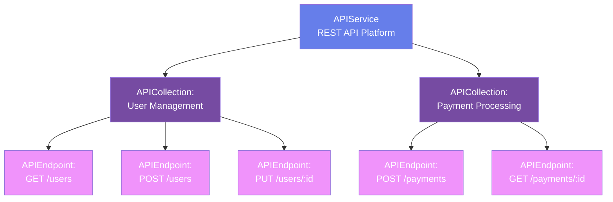
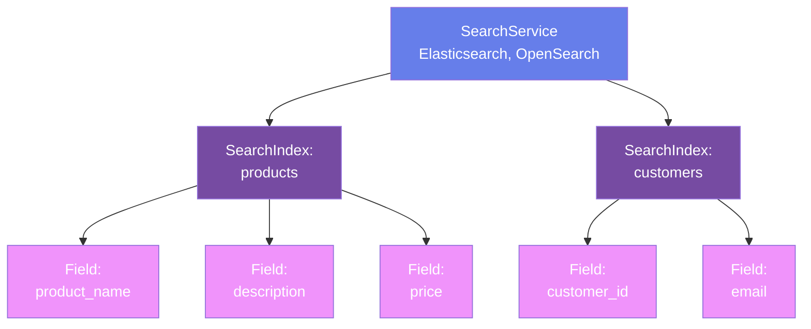

# Data Assets

**Comprehensive metadata models for all data resources in your organization**

## Overview

OpenMetadata Standards model **10+ data asset types** organized hierarchically by service type. Each service type contains specific asset entities that represent actual data resources.

---

## Service Hierarchy

All data assets follow a consistent pattern:



**Examples**:
```
DatabaseService → Database → Schema → Table → Column
PipelineService → Pipeline → Task
MessagingService → Topic → Schema Fields
StorageService → Container → Files
```

This hierarchical organization provides:
- **Consistent structure** across all asset types
- **Clear ownership** at the service level
- **Logical grouping** of related assets
- **Simplified navigation** and discovery

---

## Database Assets

**Service Type**: `DatabaseService`

Relational and analytical databases across all platforms.

### Hierarchy



### Entities

#### [Database Service](databases/database-service.md)
Connection to database systems - credentials, configuration, connection strings

**Supported Platforms**: PostgreSQL, MySQL, Oracle, SQL Server, Snowflake, BigQuery, Redshift, Databricks, Hive, Presto, Trino, ClickHouse, DynamoDB, MongoDB, Cassandra, and 50+ more

---

#### [Database](databases/database.md)
Database container grouping schemas

**Properties**: Name, description, owner, tags, retention policy

---

#### [Schema](databases/schema.md)
Namespace within a database containing tables and procedures

**Properties**: Name, database reference, contained tables, retention settings

---

#### [Table](databases/table.md) 📘 *Deep Dive*
Database tables, views, materialized views - the core data structure

**Properties**:

- Columns with types, constraints, descriptions
- Table type (Regular, View, MaterializedView, External, Temporary, SecureView, Transient)
- Primary/foreign keys
- Partitioning configuration
- Owner, domain, tags, glossary terms
- Data quality tests
- Lineage relationships
- Profiling results

**[View Complete Table Specification →](databases/table.md)**

---

#### [Stored Procedure](databases/stored-procedure.md)
Database procedures and functions

**Properties**: Procedure code, parameters, return type, language (SQL, PL/SQL, T-SQL), dependencies

---

## Pipeline Assets

**Service Type**: `PipelineService`

Data orchestration and transformation workflows.

### Hierarchy



### Entities

#### [Pipeline Service](pipelines/pipeline-service.md)
Connection to orchestration platforms

**Supported Platforms**: Airflow, Dagster, Prefect, Fivetran, dbt, Glue, Data Factory, NiFi, Airbyte

---

#### [Pipeline](pipelines/pipeline.md) 📘 *Deep Dive*
Complete data pipeline with tasks and dependencies

**Properties**:

- Pipeline schedule/trigger
- Tasks with DAG structure
- Upstream/downstream task dependencies
- Execution history and status
- Owner and tags
- Lineage to source and target tables

**[View Complete Pipeline Specification →](pipelines/pipeline.md)**

---

#### [Task](pipelines/task.md)
Individual task within a pipeline

**Properties**: Task type (SQL, Python, Spark, dbt, Shell, Container), dependencies, configuration

---

## Messaging Assets

**Service Type**: `MessagingService`

Event streaming and message queue platforms.

### Hierarchy



### Entities

#### [Messaging Service](messaging/messaging-service.md)
Connection to message brokers

**Supported Platforms**: Kafka, Pulsar, Kinesis, RabbitMQ, SQS, Azure Event Hub

---

#### [Topic](messaging/topic.md) 📘 *Deep Dive*
Message queue topic for event streaming

**Properties**:

- Partition count and replication factor
- Retention policy (time and size)
- Cleanup policy (delete, compact)
- Message schema (Avro, Protobuf, JSON Schema)
- Schema evolution and versions
- Consumer groups
- Owner and tags

**[View Complete Topic Specification →](messaging/topic.md)**

---

## Dashboard Assets

**Service Type**: `DashboardService`

Business intelligence and analytics platforms.

### Hierarchy



### Entities

#### [Dashboard Service](dashboards/dashboard-service.md)
Connection to BI platforms

**Supported Platforms**: Tableau, Looker, PowerBI, Superset, Metabase, Mode, QuickSight, Redash, Sigma

---

#### [Dashboard Data Model](dashboards/dashboard-data-model.md)
Semantic layer and data model (LookML, Tableau Data Source)

**Properties**: Model definition, dimensions, measures, relationships, SQL generation logic

---

#### [Dashboard](dashboards/dashboard.md) 📘 *Deep Dive*
Complete dashboard with visualizations

**Properties**:

- Dashboard URL and project
- Contained charts
- Data sources (lineage to tables)
- Dashboard-level filters
- View count and usage statistics
- Owner and tags

**[View Complete Dashboard Specification →](dashboards/dashboard.md)**

---

#### [Chart](dashboards/chart.md)
Individual visualization within dashboards

**Properties**: Chart type (Bar, Line, Pie, Table, Scatter), query, filters, configuration

---

## ML Assets

**Service Type**: `MLModelService`

Machine learning models and serving endpoints.

### Hierarchy



### Entities

#### [ML Model Service](ml/mlmodel-service.md)
Connection to ML platforms

**Supported Platforms**: MLflow, SageMaker, Vertex AI, Azure ML, Databricks ML

---

#### [ML Model](ml/mlmodel.md) 📘 *Deep Dive*
Trained machine learning model

**Properties**:

- Algorithm (XGBoost, Random Forest, Neural Network, etc.)
- Model type (Classification, Regression, Clustering, etc.)
- Features with sources (lineage to tables)
- Hyperparameters (learning rate, max depth, etc.)
- Performance metrics (accuracy, precision, recall, AUC, F1)
- Training data references
- Model version
- Dashboard for monitoring
- Owner and tags

**[View Complete ML Model Specification →](ml/mlmodel.md)**

---

## Storage Assets

**Service Type**: `StorageService`

Object storage and data lakes.

### Hierarchy



### Entities

#### [Storage Service](storage/storage-service.md)
Connection to object storage

**Supported Platforms**: S3, GCS, Azure Blob Storage, ADLS, MinIO

---

#### [Container](storage/container.md) 📘 *Deep Dive*
Storage bucket or container

**Properties**:

- Full path and naming
- File formats (Parquet, CSV, JSON, Avro, ORC)
- Schema information
- Partitioning scheme
- Object count and total size
- Access patterns
- Owner and tags

**[View Complete Container Specification →](storage/container.md)**

---

## API Assets

**Service Type**: `APIService`

REST APIs and endpoints.

### Hierarchy



### Entities

#### [API Service](apis/api-service.md)
Connection to API platforms

**Properties**: Base URL, authentication, version

---

#### [API Collection](apis/api-collection.md)
Group of related API endpoints

**Properties**: Collection name, description, endpoints

---

#### [API Endpoint](apis/api-endpoint.md) 📘 *Deep Dive*
Individual REST API endpoint

**Properties**:

- HTTP method (GET, POST, PUT, DELETE)
- Endpoint URL and path parameters
- Request schema (headers, body)
- Response schema (status codes, body)
- Authentication requirements
- Rate limits
- Owner and tags

**[View Complete API Endpoint Specification →](apis/api-endpoint.md)**

---

## Search Assets

**Service Type**: `SearchService`

Search indexes from Elasticsearch, OpenSearch.

### Hierarchy



### Entities

#### [Search Service](search/search-service.md)
Connection to search platforms

**Supported Platforms**: Elasticsearch, OpenSearch

---

#### [Search Index](search/search-index.md)
Search index with mappings and settings

**Properties**: Index name, field mappings, analyzers, document count, index settings, owner

---

## Cross-Asset Concepts

These entities apply across all asset types:

### [Data Contracts](../data-contracts/overview.md)
Formal SLA agreements for any data asset - tables, topics, dashboards, ML models, APIs

### [Lineage](../lineage/overview.md)
Relationships showing data flow between any assets

### [Data Quality](../data-quality/overview.md)
Tests and profiling applicable to tables, topics, containers

### [Governance](../governance/overview.md)
Tags, glossary terms, and classifications on all assets

### [Ownership](../teams-users/overview.md)
Users and teams owning any asset

---

## Common Properties

All data assets share these properties:

### Identity
- `id`: UUID
- `name`: Entity name
- `fullyQualifiedName`: Complete hierarchical name
- `displayName`: Human-readable name

### Documentation
- `description`: Markdown description
- `tags[]`: Classification tags
- `glossaryTerms[]`: Business definitions

### Ownership
- `owner`: User or team
- `domain`: Business domain
- `experts[]`: Subject matter experts

### Versioning
- `version`: Metadata version
- `updatedAt`: Last update timestamp
- `updatedBy`: User who updated
- `changeDescription`: Change details

### Lifecycle
- `deleted`: Soft delete flag
- `extension`: Custom properties
- `href`: API resource link

---

## Next Steps

### Explore by Service Type

Choose a service type to see detailed entity specifications:

- **[Databases](databases/table.md)** - Tables, schemas, stored procedures
- **[Pipelines](pipelines/pipeline.md)** - Workflows and tasks
- **[Messaging](messaging/topic.md)** - Topics and schemas
- **[Dashboards](dashboards/dashboard.md)** - Dashboards and charts
- **[ML Models](ml/mlmodel.md)** - Models and features
- **[Storage](storage/container.md)** - Buckets and containers
- **[APIs](apis/api-endpoint.md)** - REST endpoints

### Understand Cross-Cutting Concepts

Learn how these concepts apply to all assets:

- **[Lineage](../lineage/overview.md)** - Data flow tracking
- **[Governance](../governance/overview.md)** - Tags and glossaries
- **[Data Quality](../data-quality/overview.md)** - Testing and profiling
- **[Data Contracts](../data-contracts/overview.md)** - Formal agreements

### See Examples

View real-world examples:

- **[Examples](../examples/index.md)** - Complete use cases
