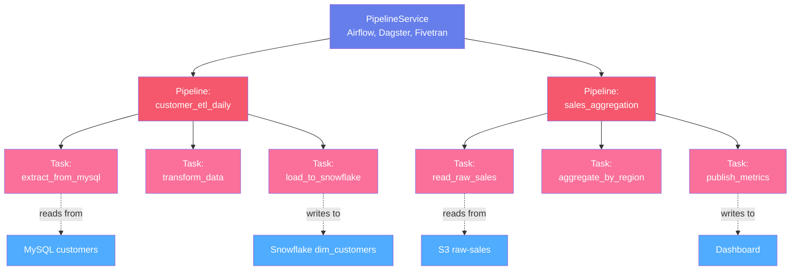
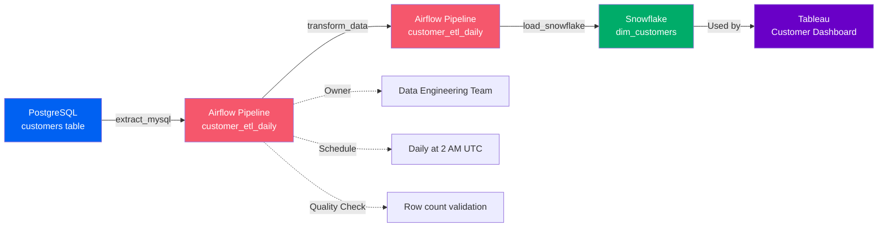
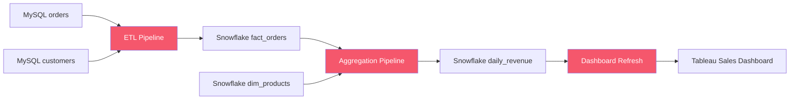

# Pipeline Assets

**Orchestration and data processing workflows**

Pipeline assets represent data processing workflows that extract, transform, and load data across your data ecosystem. OpenMetadata models pipelines with a three-level hierarchy that captures both the orchestration platform and the individual workflow tasks.

---

## Hierarchy Overview



---

## Why This Hierarchy?

### Pipeline Service
**Purpose**: Represents the orchestration platform or scheduling system

A Pipeline Service is the platform that executes and schedules data pipelines. It contains configuration for connecting to the orchestrator and discovering workflows.

**Examples**:

- `airflow-prod` - Production Airflow instance
- `dagster-analytics` - Dagster for analytics workflows
- `azure-datafactory` - Azure Data Factory
- `fivetran-ingestion` - Fivetran for data ingestion

**Why needed**: Organizations use multiple orchestration platforms (Airflow, Dagster, Prefect, Azure Data Factory, AWS Glue) for different use cases. The service level groups pipelines by platform, making it easy to manage connections and understand which platform runs which workflows.

**Supported Platforms**: Airflow, Dagster, Fivetran, Airbyte, Glue, Data Factory, dbt Cloud, Prefect, Databricks Workflows, and more

[**View Pipeline Service Specification →**](pipeline-service.md){ .md-button }

---

### Pipeline
**Purpose**: Represents a complete data processing workflow (DAG)

A Pipeline is a directed acyclic graph (DAG) of tasks that process data. It has a schedule, ownership, status, and contains multiple tasks that execute in a defined order.

**Examples**:

- `customer_etl_daily` - Daily ETL for customer data
- `sales_aggregation_hourly` - Hourly sales metrics calculation
- `ml_feature_engineering` - Feature preparation for ML models

**Key Metadata**:

- **Schedule**: Cron expression or interval (e.g., `0 2 * * *` for daily at 2 AM)
- **Tasks**: Individual processing steps
- **Lineage**: Source tables → Pipeline → Target tables
- **Status**: Active, inactive, failed
- **Ownership**: Team or user responsible
- **Documentation**: Purpose and implementation details

**Why needed**: Pipelines are the transformation layer in your data architecture. Tracking them enables:
- Understanding how data flows and transforms
- Impact analysis (what breaks if this pipeline fails?)
- Ownership and accountability
- Debugging and troubleshooting

[**View Pipeline Specification →**](pipeline.md){ .md-button }

---

### Task
**Purpose**: Individual processing step within a pipeline

A Task is a single unit of work within a pipeline. Tasks can read from sources, transform data, and write to targets. Tasks execute in dependency order.

**Examples**:

- `extract_from_mysql` - Extract data from MySQL
- `transform_customer_data` - Clean and enrich customer records
- `load_to_warehouse` - Load data into Snowflake

**Task Types**:

- **Extract**: Read from source systems (databases, APIs, files)
- **Transform**: Clean, aggregate, join, or enrich data
- **Load**: Write to target systems (warehouses, databases, files)
- **Validation**: Check data quality
- **Notification**: Send alerts or reports

**Why needed**: Tasks provide granular lineage. Instead of just knowing "Pipeline X processes Table Y," you can see exactly which task reads from which columns and writes to which tables.

[**View Task Specification →**](task.md){ .md-button }

---

## Common Patterns

### Pattern 1: Airflow ETL Pipeline
```
Airflow Service → customer_etl_daily Pipeline → extract_mysql Task
                                               → transform_data Task
                                               → load_snowflake Task
```

Classic extract-transform-load pattern with three sequential tasks.

### Pattern 2: Dagster Asset Pipeline
```
Dagster Service → analytics_pipeline Pipeline → raw_events Task
                                               → clean_events Task
                                               → aggregate_metrics Task
                                               → publish_dashboard Task
```

Dagster's software-defined assets pattern with data quality checks between stages.

### Pattern 3: Fivetran Managed Sync
```
Fivetran Service → salesforce_sync Pipeline → extract_accounts Task
                                             → extract_contacts Task
                                             → extract_opportunities Task
```

Managed connector extracting multiple objects from Salesforce.

---

## Real-World Example

Here's how a data team uses pipelines to build their analytics warehouse:



**Flow**:
1. **Source**: PostgreSQL `customers` table (operational database)
2. **Pipeline**: Airflow `customer_etl_daily` runs daily at 2 AM
3. **Tasks**:
   - Extract data from PostgreSQL
   - Transform (clean nulls, deduplicate, enrich with segments)
   - Load to Snowflake `dim_customers` table
4. **Consumer**: Tableau dashboard uses the Snowflake table
5. **Metadata**: Pipeline owned by Data Engineering, includes quality checks

**Benefits**:

- **Lineage**: See data flow from source → pipeline → warehouse → dashboard
- **Ownership**: Know who to contact if pipeline fails
- **Impact Analysis**: Understand what breaks if source table changes
- **Debugging**: View task logs and execution history

---

## Pipeline Lineage

Pipelines are central to data lineage. They create connections between data assets:

**Input → Pipeline → Output**



**Column-Level Lineage**: Tasks can specify which source columns map to which target columns, enabling precise impact analysis.

---

## Entity Specifications

Each entity in the pipeline hierarchy has complete specifications:

| Entity | Description | Specification |
|--------|-------------|---------------|
| **Pipeline Service** | Orchestration platform | [View Spec](pipeline-service.md) |
| **Pipeline** | Workflow/DAG | [View Spec](pipeline.md) |
| **Task** | Individual processing step | [View Spec](task.md) |

Each specification includes:
- Complete field reference
- JSON Schema definition
- RDF/OWL ontology representation
- JSON-LD context and examples
- Integration with popular platforms

---

## Supported Pipeline Platforms

OpenMetadata supports metadata extraction from:

- **Apache Airflow** - Open-source workflow orchestration
- **Dagster** - Data orchestrator for machine learning, analytics, and ETL
- **Prefect** - Modern workflow orchestration
- **Fivetran** - Automated data integration
- **Airbyte** - Open-source data integration
- **AWS Glue** - Serverless ETL service
- **Azure Data Factory** - Cloud ETL and data integration
- **Google Cloud Composer** - Managed Airflow
- **Databricks Workflows** - Job orchestration on Databricks
- **dbt Cloud** - Transformation workflows
- **Informatica** - Enterprise data integration
- **Talend** - Data integration and quality

---

## Next Steps

1. **Explore specifications** - Click through each entity above
2. **See lineage examples** - Check out [lineage documentation](../../lineage/overview.md)
3. **Integration guides** - Learn how to connect your pipeline platform
