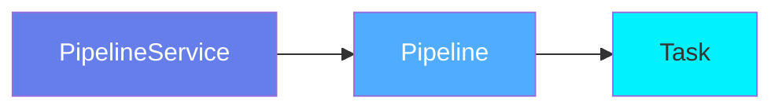
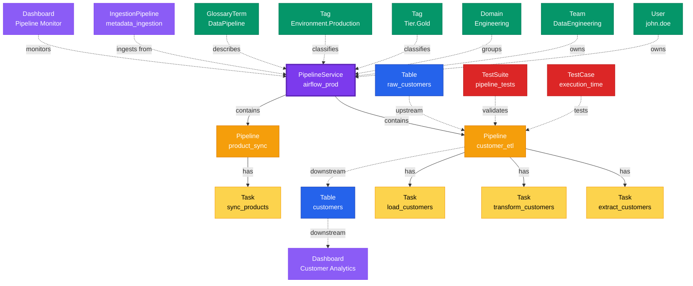

# Pipeline Service

**Orchestration platform connectors - the foundation of data pipeline management**

---

## Overview

The **PipelineService** entity represents orchestration and workflow platforms that execute data pipelines. It serves as the connection point to systems like Airflow, Dagster, Prefect, Glue, Azure Data Factory, and other pipeline orchestration tools.

**Hierarchy**:



---

## Relationships

### Parent Entities
- None (top-level service entity)

### Child Entities
- **Pipeline**: Data pipelines managed by this service

### Associated Entities
- **Owner**: User or team owning this service
- **Domain**: Business domain assignment
- **Tag**: Classification tags
- **Table**: Tables read/written by pipelines
- **Dashboard**: Dashboards monitoring pipelines

### Relationship Diagram



---

## Schema Specifications

View the complete PipelineService schema in your preferred format:

=== "JSON Schema"

    **Complete JSON Schema Definition**

    ```json
    {
      "$id": "https://open-metadata.org/schema/entity/services/pipelineService.json",
      "$schema": "http://json-schema.org/draft-07/schema#",
      "title": "PipelineService",
      "description": "A `PipelineService` entity represents an orchestration platform that executes data pipelines and workflows.",
      "type": "object",
      "javaType": "org.openmetadata.schema.entity.services.PipelineService",

      "definitions": {
        "pipelineServiceType": {
          "description": "Type of pipeline service",
          "type": "string",
          "enum": [
            "Airflow", "Dagster", "Prefect", "Glue",
            "AzureDataFactory", "Fivetran", "DBTCloud",
            "Airbyte", "Nifi", "DatabricksPipeline",
            "Flink", "Spark", "KafkaConnect", "CustomPipeline"
          ]
        },
        "pipelineConnection": {
          "type": "object",
          "properties": {
            "config": {
              "description": "Service-specific connection configuration",
              "type": "object"
            },
            "hostPort": {
              "description": "Service host and port",
              "type": "string",
              "format": "uri"
            }
          }
        }
      },

      "properties": {
        "id": {
          "description": "Unique identifier",
          "$ref": "../../type/basic.json#/definitions/uuid"
        },
        "name": {
          "description": "Service name",
          "$ref": "../../type/basic.json#/definitions/entityName"
        },
        "fullyQualifiedName": {
          "description": "Fully qualified name: service_name",
          "$ref": "../../type/basic.json#/definitions/fullyQualifiedEntityName"
        },
        "displayName": {
          "description": "Display name",
          "type": "string"
        },
        "description": {
          "description": "Markdown description",
          "$ref": "../../type/basic.json#/definitions/markdown"
        },
        "serviceType": {
          "$ref": "#/definitions/pipelineServiceType"
        },
        "connection": {
          "description": "Connection configuration",
          "$ref": "#/definitions/pipelineConnection"
        },
        "pipelines": {
          "description": "Pipelines in this service",
          "type": "array",
          "items": {
            "$ref": "../../type/entityReference.json"
          }
        },
        "owner": {
          "description": "Owner (user or team)",
          "$ref": "../../type/entityReference.json"
        },
        "domain": {
          "description": "Data domain",
          "$ref": "../../type/entityReference.json"
        },
        "tags": {
          "description": "Classification tags",
          "type": "array",
          "items": {
            "$ref": "../../type/tagLabel.json"
          }
        },
        "version": {
          "description": "Metadata version",
          "$ref": "../../type/entityHistory.json#/definitions/entityVersion"
        }
      },

      "required": ["id", "name", "serviceType"]
    }
    ```

    **[View Full JSON Schema →](https://github.com/open-metadata/OpenMetadataStandards/blob/main/schemas/entity/services/pipelineService.json)**

=== "RDF"

    **RDF/OWL Ontology Definition**

    ```turtle
    @prefix om: <https://open-metadata.org/schema/> .
    @prefix rdfs: <http://www.w3.org/2000/01/rdf-schema#> .
    @prefix owl: <http://www.w3.org/2001/XMLSchema#> .
    @prefix xsd: <http://www.w3.org/2001/XMLSchema#> .

    # PipelineService Class Definition
    om:PipelineService a owl:Class ;
        rdfs:subClassOf om:Service ;
        rdfs:label "PipelineService" ;
        rdfs:comment "An orchestration platform that executes data pipelines and workflows" ;
        om:hierarchyLevel 1 .

    # Properties
    om:pipelineServiceName a owl:DatatypeProperty ;
        rdfs:domain om:PipelineService ;
        rdfs:range xsd:string ;
        rdfs:label "name" ;
        rdfs:comment "Name of the pipeline service" .

    om:serviceType a owl:DatatypeProperty ;
        rdfs:domain om:PipelineService ;
        rdfs:range om:PipelineServiceType ;
        rdfs:label "serviceType" ;
        rdfs:comment "Type of pipeline service: Airflow, Dagster, Prefect, etc." .

    om:hostPort a owl:DatatypeProperty ;
        rdfs:domain om:PipelineService ;
        rdfs:range xsd:anyURI ;
        rdfs:label "hostPort" ;
        rdfs:comment "Service endpoint URL" .

    om:hasPipeline a owl:ObjectProperty ;
        rdfs:domain om:PipelineService ;
        rdfs:range om:Pipeline ;
        rdfs:label "hasPipeline" ;
        rdfs:comment "Pipelines managed by this service" .

    om:serviceOwnedBy a owl:ObjectProperty ;
        rdfs:domain om:PipelineService ;
        rdfs:range om:Owner ;
        rdfs:label "ownedBy" ;
        rdfs:comment "User or team that owns this service" .

    om:serviceHasTag a owl:ObjectProperty ;
        rdfs:domain om:PipelineService ;
        rdfs:range om:Tag ;
        rdfs:label "hasTag" ;
        rdfs:comment "Classification tags applied to service" .

    # PipelineService Type Enumeration
    om:PipelineServiceType a owl:Class ;
        owl:oneOf (
            om:Airflow
            om:Dagster
            om:Prefect
            om:Glue
            om:AzureDataFactory
            om:Fivetran
            om:DBTCloud
        ) .

    # Example Instance
    ex:airflowProdService a om:PipelineService ;
        om:pipelineServiceName "airflow_prod" ;
        om:serviceType om:Airflow ;
        om:hostPort "https://airflow.company.com"^^xsd:anyURI ;
        om:serviceOwnedBy ex:dataEngTeam ;
        om:serviceHasTag ex:tierGold ;
        om:hasPipeline ex:customerEtlPipeline ;
        om:hasPipeline ex:salesReportingPipeline .
    ```

    **[View Full RDF Ontology →](https://github.com/open-metadata/OpenMetadataStandards/blob/main/rdf/ontology/openmetadata.ttl)**

=== "JSON-LD"

    **JSON-LD Context and Example**

    ```json
    {
      "@context": {
        "@vocab": "https://open-metadata.org/schema/",
        "om": "https://open-metadata.org/schema/",
        "rdfs": "http://www.w3.org/2000/01/rdf-schema#",
        "xsd": "http://www.w3.org/2001/XMLSchema#",

        "PipelineService": "om:PipelineService",
        "name": {
          "@id": "om:pipelineServiceName",
          "@type": "xsd:string"
        },
        "fullyQualifiedName": {
          "@id": "om:fullyQualifiedName",
          "@type": "xsd:string"
        },
        "displayName": {
          "@id": "om:displayName",
          "@type": "xsd:string"
        },
        "description": {
          "@id": "om:description",
          "@type": "xsd:string"
        },
        "serviceType": {
          "@id": "om:serviceType",
          "@type": "@vocab"
        },
        "connection": {
          "@id": "om:connectionConfig",
          "@type": "@id"
        },
        "pipelines": {
          "@id": "om:hasPipeline",
          "@type": "@id",
          "@container": "@set"
        },
        "owner": {
          "@id": "om:serviceOwnedBy",
          "@type": "@id"
        },
        "domain": {
          "@id": "om:inDomain",
          "@type": "@id"
        },
        "tags": {
          "@id": "om:serviceHasTag",
          "@type": "@id",
          "@container": "@set"
        }
      }
    }
    ```

    **Example JSON-LD Instance**:

    ```json
    {
      "@context": "https://open-metadata.org/context/pipelineService.jsonld",
      "@type": "PipelineService",
      "@id": "https://example.com/services/airflow_prod",

      "name": "airflow_prod",
      "fullyQualifiedName": "airflow_prod",
      "displayName": "Production Airflow",
      "description": "Production Airflow instance for ETL workflows",
      "serviceType": "Airflow",

      "connection": {
        "config": {
          "hostPort": "https://airflow.company.com",
          "numberOfStatus": 10,
          "connection": {
            "type": "Backend"
          }
        }
      },

      "owner": {
        "@id": "https://example.com/teams/data-engineering",
        "@type": "Team",
        "name": "data-engineering",
        "displayName": "Data Engineering"
      },

      "tags": [
        {
          "@id": "https://open-metadata.org/tags/Tier/Gold",
          "tagFQN": "Tier.Gold"
        },
        {
          "@id": "https://open-metadata.org/tags/Environment/Production",
          "tagFQN": "Environment.Production"
        }
      ],

      "pipelines": [
        {
          "@id": "https://example.com/pipelines/customer_etl",
          "@type": "Pipeline",
          "name": "customer_etl"
        },
        {
          "@id": "https://example.com/pipelines/sales_reporting",
          "@type": "Pipeline",
          "name": "sales_reporting"
        }
      ]
    }
    ```

    **[View Full JSON-LD Context →](https://github.com/open-metadata/OpenMetadataStandards/blob/main/rdf/contexts/pipelineService.jsonld)**

---

## Use Cases

- Connect to orchestration platforms (Airflow, Dagster, Prefect, Glue, etc.)
- Discover and catalog all pipelines and workflows
- Track pipeline execution history and status
- Monitor pipeline health and performance
- Document pipeline ownership and dependencies
- Apply governance tags to pipeline assets
- Capture pipeline lineage across data assets
- Integrate with CI/CD for pipeline deployment

---

## JSON Schema Specification

### Core Properties

#### `id` (uuid)
**Type**: `string` (UUID format)
**Required**: Yes (system-generated)
**Description**: Unique identifier for this pipeline service instance

```json
{
  "id": "1a2b3c4d-5e6f-7a8b-9c0d-1e2f3a4b5c6d"
}
```

---

#### `name` (entityName)
**Type**: `string`
**Required**: Yes
**Pattern**: `^[^.]*$` (no dots allowed)
**Min Length**: 1
**Max Length**: 256
**Description**: Name of the pipeline service

```json
{
  "name": "airflow_prod"
}
```

---

#### `fullyQualifiedName` (fullyQualifiedEntityName)
**Type**: `string`
**Required**: Yes (system-generated)
**Pattern**: `^((?!::).)*$`
**Description**: Fully qualified name (same as name for services)

```json
{
  "fullyQualifiedName": "airflow_prod"
}
```

---

#### `displayName`
**Type**: `string`
**Required**: No
**Description**: Human-readable display name

```json
{
  "displayName": "Production Airflow"
}
```

---

#### `description` (markdown)
**Type**: `string` (Markdown format)
**Required**: No
**Description**: Rich text description of the service

```json
{
  "description": "# Production Airflow Instance\n\nMain orchestration platform for all ETL workflows.\n\n## Configuration\n- Executor: CeleryExecutor\n- Workers: 10\n- Scheduler: HA mode\n\n## Access\n- URL: https://airflow.company.com\n- Auth: SSO via Okta"
}
```

---

### Service Configuration Properties

#### `serviceType` (PipelineServiceType enum)
**Type**: `string` enum
**Required**: Yes
**Allowed Values**:

- `Airflow` - Apache Airflow
- `Dagster` - Dagster orchestration
- `Prefect` - Prefect workflow engine
- `Glue` - AWS Glue
- `AzureDataFactory` - Azure Data Factory
- `Fivetran` - Fivetran ELT platform
- `DBTCloud` - dbt Cloud
- `Airbyte` - Airbyte data integration
- `Nifi` - Apache NiFi
- `DatabricksPipeline` - Databricks workflows
- `Flink` - Apache Flink
- `Spark` - Apache Spark
- `KafkaConnect` - Kafka Connect
- `CustomPipeline` - Custom pipeline platform

```json
{
  "serviceType": "Airflow"
}
```

---

#### `connection` (Connection)
**Type**: `object`
**Required**: Yes
**Description**: Service connection configuration

**Connection Object Properties**:

| Property | Type | Required | Description |
|----------|------|----------|-------------|
| `config` | object | Yes | Service-specific configuration |
| `hostPort` | string (URI) | No | Service endpoint URL |

**Example - Airflow**:

```json
{
  "connection": {
    "config": {
      "type": "Airflow",
      "hostPort": "https://airflow.company.com",
      "numberOfStatus": 10,
      "connection": {
        "type": "Backend"
      }
    }
  }
}
```

**Example - Dagster**:

```json
{
  "connection": {
    "config": {
      "type": "Dagster",
      "host": "dagster.company.com",
      "port": 3000,
      "token": "dagster_token_***",
      "timeout": 120
    }
  }
}
```

**Example - AWS Glue**:

```json
{
  "connection": {
    "config": {
      "type": "Glue",
      "awsConfig": {
        "awsAccessKeyId": "AKIA***",
        "awsSecretAccessKey": "***",
        "awsRegion": "us-east-1"
      },
      "storageServiceName": "s3_prod"
    }
  }
}
```

---

### Related Entity Properties

#### `pipelines[]` (Pipeline[])
**Type**: `array` of EntityReference
**Required**: No (system-populated)
**Description**: List of pipelines in this service

```json
{
  "pipelines": [
    {
      "id": "2b3c4d5e-6f7a-8b9c-0d1e-2f3a4b5c6d7e",
      "type": "pipeline",
      "name": "customer_etl",
      "fullyQualifiedName": "airflow_prod.customer_etl"
    },
    {
      "id": "3c4d5e6f-7a8b-9c0d-1e2f-3a4b5c6d7e8f",
      "type": "pipeline",
      "name": "sales_reporting",
      "fullyQualifiedName": "airflow_prod.sales_reporting"
    }
  ]
}
```

---

### Governance Properties

#### `owner` (EntityReference)
**Type**: `object`
**Required**: No
**Description**: User or team that owns this service

```json
{
  "owner": {
    "id": "4d5e6f7a-8b9c-0d1e-2f3a-4b5c6d7e8f9a",
    "type": "team",
    "name": "data-engineering",
    "displayName": "Data Engineering Team"
  }
}
```

---

#### `domain` (EntityReference)
**Type**: `object`
**Required**: No
**Description**: Data domain this service belongs to

```json
{
  "domain": {
    "id": "5e6f7a8b-9c0d-1e2f-3a4b-5c6d7e8f9a0b",
    "type": "domain",
    "name": "Engineering",
    "fullyQualifiedName": "Engineering"
  }
}
```

---

#### `tags[]` (TagLabel[])
**Type**: `array`
**Required**: No
**Description**: Classification tags applied to the service

```json
{
  "tags": [
    {
      "tagFQN": "Tier.Gold",
      "description": "Critical production service",
      "source": "Classification",
      "labelType": "Manual",
      "state": "Confirmed"
    },
    {
      "tagFQN": "Environment.Production",
      "source": "Classification",
      "labelType": "Manual",
      "state": "Confirmed"
    }
  ]
}
```

---

### Versioning Properties

#### `version` (entityVersion)
**Type**: `number`
**Required**: Yes (system-managed)
**Description**: Metadata version number, incremented on changes

```json
{
  "version": 1.2
}
```

---

#### `updatedAt` (timestamp)
**Type**: `integer` (Unix epoch milliseconds)
**Required**: Yes (system-managed)
**Description**: Last update timestamp

```json
{
  "updatedAt": 1704240000000
}
```

---

#### `updatedBy` (string)
**Type**: `string`
**Required**: Yes (system-managed)
**Description**: User who made the update

```json
{
  "updatedBy": "admin"
}
```

---

#### `changeDescription` (ChangeDescription)
**Type**: `object`
**Required**: No
**Description**: Details of what changed in this version

```json
{
  "changeDescription": {
    "fieldsAdded": [],
    "fieldsUpdated": [
      {
        "name": "connection.config.hostPort",
        "oldValue": "http://airflow.company.com",
        "newValue": "https://airflow.company.com"
      }
    ],
    "fieldsDeleted": [],
    "previousVersion": 1.1
  }
}
```

---

## Complete Example

```json
{
  "id": "1a2b3c4d-5e6f-7a8b-9c0d-1e2f3a4b5c6d",
  "name": "airflow_prod",
  "fullyQualifiedName": "airflow_prod",
  "displayName": "Production Airflow",
  "description": "# Production Airflow Instance\n\nMain orchestration platform for all ETL workflows.",
  "serviceType": "Airflow",
  "connection": {
    "config": {
      "type": "Airflow",
      "hostPort": "https://airflow.company.com",
      "numberOfStatus": 10,
      "connection": {
        "type": "Backend"
      }
    }
  },
  "pipelines": [
    {
      "id": "2b3c4d5e-6f7a-8b9c-0d1e-2f3a4b5c6d7e",
      "type": "pipeline",
      "name": "customer_etl",
      "fullyQualifiedName": "airflow_prod.customer_etl"
    }
  ],
  "owner": {
    "id": "4d5e6f7a-8b9c-0d1e-2f3a-4b5c6d7e8f9a",
    "type": "team",
    "name": "data-engineering",
    "displayName": "Data Engineering Team"
  },
  "domain": {
    "id": "5e6f7a8b-9c0d-1e2f-3a4b-5c6d7e8f9a0b",
    "type": "domain",
    "name": "Engineering"
  },
  "tags": [
    {"tagFQN": "Tier.Gold"},
    {"tagFQN": "Environment.Production"}
  ],
  "version": 1.2,
  "updatedAt": 1704240000000,
  "updatedBy": "admin"
}
```

---

## RDF Representation

### Ontology Class

```turtle
@prefix om: <https://open-metadata.org/schema/> .
@prefix rdfs: <http://www.w3.org/2000/01/rdf-schema#> .
@prefix owl: <http://www.w3.org/2001/XMLSchema#> .

om:PipelineService a owl:Class ;
    rdfs:subClassOf om:Service ;
    rdfs:label "PipelineService" ;
    rdfs:comment "An orchestration platform that executes data pipelines" ;
    om:hasProperties [
        om:name "string" ;
        om:serviceType "PipelineServiceType" ;
        om:pipelines "Pipeline[]" ;
        om:owner "Owner" ;
        om:tags "Tag[]" ;
    ] .
```

### Instance Example

```turtle
@prefix om: <https://open-metadata.org/schema/> .
@prefix ex: <https://example.com/services/> .

ex:airflow_prod a om:PipelineService ;
    om:pipelineServiceName "airflow_prod" ;
    om:fullyQualifiedName "airflow_prod" ;
    om:displayName "Production Airflow" ;
    om:description "Main orchestration platform for ETL workflows" ;
    om:serviceType "Airflow" ;
    om:hostPort "https://airflow.company.com"^^xsd:anyURI ;
    om:serviceOwnedBy ex:data_engineering_team ;
    om:serviceHasTag ex:tier_gold ;
    om:serviceHasTag ex:env_production ;
    om:hasPipeline ex:customer_etl ;
    om:hasPipeline ex:sales_reporting .
```

---

## JSON-LD Context

```json
{
  "@context": {
    "@vocab": "https://open-metadata.org/schema/",
    "om": "https://open-metadata.org/schema/",
    "rdfs": "http://www.w3.org/2000/01/rdf-schema#",
    "PipelineService": "om:PipelineService",
    "name": "om:pipelineServiceName",
    "fullyQualifiedName": "om:fullyQualifiedName",
    "displayName": "om:displayName",
    "description": "om:description",
    "serviceType": {
      "@id": "om:serviceType",
      "@type": "@vocab"
    },
    "pipelines": {
      "@id": "om:hasPipeline",
      "@type": "@id",
      "@container": "@set"
    },
    "owner": {
      "@id": "om:serviceOwnedBy",
      "@type": "@id"
    },
    "tags": {
      "@id": "om:serviceHasTag",
      "@type": "@id",
      "@container": "@set"
    }
  }
}
```

### JSON-LD Example

```json
{
  "@context": "https://open-metadata.org/context/pipelineService.jsonld",
  "@type": "PipelineService",
  "@id": "https://example.com/services/airflow_prod",
  "name": "airflow_prod",
  "fullyQualifiedName": "airflow_prod",
  "displayName": "Production Airflow",
  "serviceType": "Airflow",
  "owner": {
    "@id": "https://example.com/teams/data-engineering",
    "@type": "Team"
  },
  "tags": [
    {"@id": "https://open-metadata.org/tags/Tier/Gold"},
    {"@id": "https://open-metadata.org/tags/Environment/Production"}
  ],
  "pipelines": [
    {
      "@id": "https://example.com/pipelines/customer_etl",
      "@type": "Pipeline",
      "name": "customer_etl"
    }
  ]
}
```

---

## Custom Properties

This entity supports custom properties through the `extension` field.
Common custom properties include:

- **Data Classification**: Sensitivity level
- **Cost Center**: Billing allocation
- **Retention Period**: Data retention requirements
- **Application Owner**: Owning application/team

See [Custom Properties](../../metadata-specifications/custom-properties.md)
for details on defining and using custom properties.

---

## API Operations

### Create Pipeline Service

```http
POST /api/v1/services/pipelineServices
Content-Type: application/json

{
  "name": "airflow_prod",
  "serviceType": "Airflow",
  "connection": {
    "config": {
      "type": "Airflow",
      "hostPort": "https://airflow.company.com",
      "connection": {
        "type": "Backend"
      }
    }
  }
}
```

### Get Pipeline Service

```http
GET /api/v1/services/pipelineServices/name/airflow_prod?fields=pipelines,owner,tags
```

### Update Pipeline Service

```http
PATCH /api/v1/services/pipelineServices/{id}
Content-Type: application/json-patch+json

[
  {
    "op": "add",
    "path": "/tags/-",
    "value": {"tagFQN": "Tier.Gold"}
  }
]
```

### List All Pipeline Services

```http
GET /api/v1/services/pipelineServices?limit=10
```

### Test Connection

```http
GET /api/v1/services/pipelineServices/name/airflow_prod/testConnection
```

---

## Related Documentation

- **[Pipeline](pipeline.md)** - Pipeline entity specification
- **[Task](task.md)** - Task entity specification
- **[Lineage](../../lineage/overview.md)** - Pipeline lineage tracking
- **[Connectors](../../connectors/pipeline-services.md)** - Service connector guides
