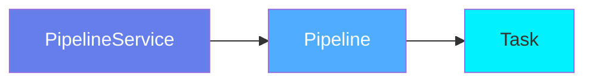
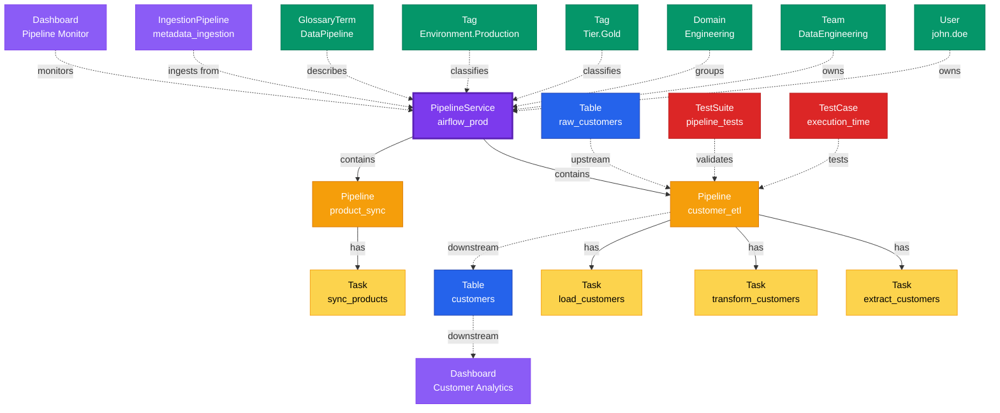

# Pipeline Service

**Orchestration platform connectors - the foundation of data pipeline management**

---

## Overview

The **PipelineService** entity represents orchestration and workflow platforms that execute data pipelines. It serves as the connection point to systems like Airflow, Dagster, Prefect, Glue, Azure Data Factory, and other pipeline orchestration tools.

**Hierarchy**:



---

## Relationships

### Parent Entities
- None (top-level service entity)

### Child Entities
- **Pipeline**: Data pipelines managed by this service

### Associated Entities
- **Owners**: Users or teams owning this service
- **Domains**: Business domain assignments
- **Tags**: Classification tags
- **Table**: Tables read/written by pipelines
- **Dashboard**: Dashboards monitoring pipelines
- **DataProducts**: Data products this service is part of
- **Followers**: Users following this service

### Relationship Diagram



---

## Schema Specifications

View the complete PipelineService schema in your preferred format:

=== "JSON Schema"

    **Complete JSON Schema Definition**

    ```json
    {
      "$id": "https://open-metadata.org/schema/entity/services/pipelineService.json",
      "$schema": "http://json-schema.org/draft-07/schema#",
      "title": "Pipeline Service",
      "description": "This schema defines the Pipeline Service entity, such as Airflow and Prefect.",
      "type": "object",
      "javaType": "org.openmetadata.schema.entity.services.PipelineService",
      "javaInterfaces": [
        "org.openmetadata.schema.EntityInterface",
        "org.openmetadata.schema.ServiceEntityInterface"
      ],

      "definitions": {
        "pipelineServiceType": {
          "description": "Type of pipeline service - Airflow or Prefect.",
          "type": "string",
          "javaInterfaces": [
            "org.openmetadata.schema.EnumInterface"
          ],
          "enum": [
            "Airflow", "GluePipeline", "KinesisFirehose",
            "Airbyte", "Fivetran", "Flink", "Dagster",
            "Nifi", "DomoPipeline", "CustomPipeline",
            "DatabricksPipeline", "Spline", "Spark",
            "OpenLineage", "KafkaConnect", "DBTCloud",
            "Matillion", "Stitch", "DataFactory",
            "Wherescape", "SSIS", "Snowplow"
          ]
        },
        "pipelineConnection": {
          "type": "object",
          "javaType": "org.openmetadata.schema.type.PipelineConnection",
          "description": "Pipeline Connection.",
          "javaInterfaces": [
            "org.openmetadata.schema.ServiceConnectionEntityInterface"
          ],
          "properties": {
            "config": {
              "mask": true,
              "oneOf": [
                {"$ref": "./connections/pipeline/airflowConnection.json"},
                {"$ref": "./connections/pipeline/wherescapeConnection.json"},
                {"$ref": "./connections/pipeline/ssisConnection.json"},
                {"$ref": "./connections/pipeline/gluePipelineConnection.json"},
                {"$ref": "./connections/pipeline/kinesisFirehoseConnection.json"},
                {"$ref": "./connections/pipeline/airbyteConnection.json"},
                {"$ref": "./connections/pipeline/fivetranConnection.json"},
                {"$ref": "./connections/pipeline/flinkConnection.json"},
                {"$ref": "./connections/pipeline/dagsterConnection.json"},
                {"$ref": "./connections/pipeline/nifiConnection.json"},
                {"$ref": "./connections/pipeline/domoPipelineConnection.json"},
                {"$ref": "./connections/pipeline/customPipelineConnection.json"},
                {"$ref": "./connections/pipeline/databricksPipelineConnection.json"},
                {"$ref": "./connections/pipeline/splineConnection.json"},
                {"$ref": "./connections/pipeline/sparkConnection.json"},
                {"$ref": "./connections/pipeline/openLineageConnection.json"},
                {"$ref": "./connections/pipeline/kafkaConnectConnection.json"},
                {"$ref": "./connections/pipeline/dbtCloudConnection.json"},
                {"$ref": "./connections/pipeline/matillionConnection.json"},
                {"$ref": "./connections/pipeline/datafactoryConnection.json"},
                {"$ref": "./connections/pipeline/stitchConnection.json"},
                {"$ref": "./connections/pipeline/snowplowConnection.json"}
              ]
            }
          },
          "additionalProperties": false
        }
      },

      "properties": {
        "id": {
          "description": "Unique identifier of this pipeline service instance.",
          "$ref": "../../type/basic.json#/definitions/uuid"
        },
        "name": {
          "description": "Name that identifies this pipeline service.",
          "$ref": "../../type/basic.json#/definitions/entityName"
        },
        "fullyQualifiedName": {
          "description": "FullyQualifiedName same as `name`.",
          "$ref": "../../type/basic.json#/definitions/fullyQualifiedEntityName"
        },
        "serviceType": {
          "description": "Type of pipeline service such as Airflow or Prefect...",
          "$ref": "#/definitions/pipelineServiceType"
        },
        "description": {
          "description": "Description of a pipeline service instance.",
          "type": "string"
        },
        "displayName": {
          "description": "Display Name that identifies this pipeline service.",
          "type": "string"
        },
        "version": {
          "description": "Metadata version of the entity.",
          "$ref": "../../type/entityHistory.json#/definitions/entityVersion"
        },
        "updatedAt": {
          "description": "Last update time corresponding to the new version of the entity in Unix epoch time milliseconds.",
          "$ref": "../../type/basic.json#/definitions/timestamp"
        },
        "updatedBy": {
          "description": "User who made the update.",
          "type": "string"
        },
        "impersonatedBy": {
          "description": "Bot user that performed the action on behalf of the actual user.",
          "$ref": "../../type/basic.json#/definitions/impersonatedBy"
        },
        "testConnectionResult": {
          "description": "Last test connection results for this service",
          "$ref": "connections/testConnectionResult.json"
        },
        "tags": {
          "description": "Tags for this Pipeline Service.",
          "type": "array",
          "items": {
            "$ref": "../../type/tagLabel.json"
          },
          "default": []
        },
        "pipelines": {
          "description": "References to pipelines deployed for this pipeline service to extract metadata",
          "$ref": "../../type/entityReferenceList.json"
        },
        "connection": {
          "$ref": "#/definitions/pipelineConnection"
        },
        "owners": {
          "description": "Owners of this pipeline service.",
          "$ref": "../../type/entityReferenceList.json"
        },
        "href": {
          "description": "Link to the resource corresponding to this pipeline service.",
          "$ref": "../../type/basic.json#/definitions/href"
        },
        "changeDescription": {
          "description": "Change that lead to this version of the entity.",
          "$ref": "../../type/entityHistory.json#/definitions/changeDescription"
        },
        "incrementalChangeDescription": {
          "description": "Change that lead to this version of the entity.",
          "$ref": "../../type/entityHistory.json#/definitions/changeDescription"
        },
        "deleted": {
          "description": "When `true` indicates the entity has been soft deleted.",
          "type": "boolean",
          "default": false
        },
        "dataProducts": {
          "description": "List of data products this entity is part of.",
          "$ref": "../../type/entityReferenceList.json"
        },
        "followers": {
          "description": "Followers of this entity.",
          "$ref": "../../type/entityReferenceList.json"
        },
        "domains": {
          "description": "Domains the Pipeline service belongs to.",
          "$ref": "../../type/entityReferenceList.json"
        },
        "ingestionRunner": {
          "description": "The ingestion agent responsible for executing the ingestion pipeline.",
          "$ref": "../../type/entityReference.json"
        }
      },

      "required": ["id", "name", "serviceType"],
      "additionalProperties": false
    }
    ```

    **[View Full JSON Schema →](https://github.com/open-metadata/OpenMetadataStandards/blob/main/schemas/entity/services/pipelineService.json)**

=== "RDF"

    **RDF/OWL Ontology Definition**

    ```turtle
    @prefix om: <https://open-metadata.org/schema/> .
    @prefix rdfs: <http://www.w3.org/2000/01/rdf-schema#> .
    @prefix owl: <http://www.w3.org/2002/07/owl#> .
    @prefix xsd: <http://www.w3.org/2001/XMLSchema#> .

    # PipelineService Class Definition
    om:PipelineService a owl:Class ;
        rdfs:subClassOf om:Service ;
        rdfs:label "PipelineService" ;
        rdfs:comment "This schema defines the Pipeline Service entity, such as Airflow and Prefect." ;
        om:hierarchyLevel 1 .

    # Datatype Properties
    om:pipelineServiceName a owl:DatatypeProperty ;
        rdfs:domain om:PipelineService ;
        rdfs:range xsd:string ;
        rdfs:label "name" ;
        rdfs:comment "Name that identifies this pipeline service" .

    om:fullyQualifiedName a owl:DatatypeProperty ;
        rdfs:domain om:PipelineService ;
        rdfs:range xsd:string ;
        rdfs:label "fullyQualifiedName" ;
        rdfs:comment "FullyQualifiedName same as name" .

    om:displayName a owl:DatatypeProperty ;
        rdfs:domain om:PipelineService ;
        rdfs:range xsd:string ;
        rdfs:label "displayName" ;
        rdfs:comment "Display Name that identifies this pipeline service" .

    om:description a owl:DatatypeProperty ;
        rdfs:domain om:PipelineService ;
        rdfs:range xsd:string ;
        rdfs:label "description" ;
        rdfs:comment "Description of a pipeline service instance" .

    om:serviceType a owl:DatatypeProperty ;
        rdfs:domain om:PipelineService ;
        rdfs:range om:PipelineServiceType ;
        rdfs:label "serviceType" ;
        rdfs:comment "Type of pipeline service such as Airflow or Prefect" .

    om:deleted a owl:DatatypeProperty ;
        rdfs:domain om:PipelineService ;
        rdfs:range xsd:boolean ;
        rdfs:label "deleted" ;
        rdfs:comment "When true indicates the entity has been soft deleted" .

    om:href a owl:DatatypeProperty ;
        rdfs:domain om:PipelineService ;
        rdfs:range xsd:anyURI ;
        rdfs:label "href" ;
        rdfs:comment "Link to the resource corresponding to this pipeline service" .

    # Object Properties
    om:hasPipeline a owl:ObjectProperty ;
        rdfs:domain om:PipelineService ;
        rdfs:range om:Pipeline ;
        rdfs:label "hasPipeline" ;
        rdfs:comment "References to pipelines deployed for this pipeline service" .

    om:hasOwner a owl:ObjectProperty ;
        rdfs:domain om:PipelineService ;
        rdfs:range om:Owner ;
        rdfs:label "hasOwner" ;
        rdfs:comment "Owners of this pipeline service" .

    om:belongsToDomain a owl:ObjectProperty ;
        rdfs:domain om:PipelineService ;
        rdfs:range om:Domain ;
        rdfs:label "belongsToDomain" ;
        rdfs:comment "Domains the Pipeline service belongs to" .

    om:hasTag a owl:ObjectProperty ;
        rdfs:domain om:PipelineService ;
        rdfs:range om:Tag ;
        rdfs:label "hasTag" ;
        rdfs:comment "Tags for this Pipeline Service" .

    om:partOfDataProduct a owl:ObjectProperty ;
        rdfs:domain om:PipelineService ;
        rdfs:range om:DataProduct ;
        rdfs:label "partOfDataProduct" ;
        rdfs:comment "List of data products this entity is part of" .

    om:hasFollower a owl:ObjectProperty ;
        rdfs:domain om:PipelineService ;
        rdfs:range om:User ;
        rdfs:label "hasFollower" ;
        rdfs:comment "Followers of this entity" .

    om:hasConnection a owl:ObjectProperty ;
        rdfs:domain om:PipelineService ;
        rdfs:range om:PipelineConnection ;
        rdfs:label "hasConnection" ;
        rdfs:comment "Connection configuration for the pipeline service" .

    om:hasIngestionRunner a owl:ObjectProperty ;
        rdfs:domain om:PipelineService ;
        rdfs:range om:IngestionRunner ;
        rdfs:label "hasIngestionRunner" ;
        rdfs:comment "The ingestion agent responsible for executing the ingestion pipeline" .

    # PipelineService Type Enumeration
    om:PipelineServiceType a owl:Class ;
        owl:oneOf (
            om:Airflow
            om:GluePipeline
            om:KinesisFirehose
            om:Airbyte
            om:Fivetran
            om:Flink
            om:Dagster
            om:Nifi
            om:DomoPipeline
            om:CustomPipeline
            om:DatabricksPipeline
            om:Spline
            om:Spark
            om:OpenLineage
            om:KafkaConnect
            om:DBTCloud
            om:Matillion
            om:Stitch
            om:DataFactory
            om:Wherescape
            om:SSIS
            om:Snowplow
        ) .

    # Example Instance
    ex:airflowProdService a om:PipelineService ;
        om:pipelineServiceName "airflow_prod" ;
        om:fullyQualifiedName "airflow_prod" ;
        om:displayName "Production Airflow" ;
        om:description "Production Airflow instance for ETL workflows" ;
        om:serviceType om:Airflow ;
        om:hasOwner ex:dataEngTeam ;
        om:belongsToDomain ex:engineeringDomain ;
        om:hasTag ex:tierGold ;
        om:hasTag ex:envProduction ;
        om:hasPipeline ex:customerEtlPipeline ;
        om:hasPipeline ex:salesReportingPipeline ;
        om:hasFollower ex:johnDoe ;
        om:deleted "false"^^xsd:boolean .
    ```

    **[View Full RDF Ontology →](https://github.com/open-metadata/OpenMetadataStandards/blob/main/rdf/ontology/openmetadata.ttl)**

=== "JSON-LD"

    **JSON-LD Context and Example**

    ```json
    {
      "@context": {
        "@vocab": "https://open-metadata.org/schema/",
        "om": "https://open-metadata.org/schema/",
        "rdfs": "http://www.w3.org/2000/01/rdf-schema#",
        "xsd": "http://www.w3.org/2001/XMLSchema#",

        "PipelineService": "om:PipelineService",
        "name": {
          "@id": "om:pipelineServiceName",
          "@type": "xsd:string"
        },
        "fullyQualifiedName": {
          "@id": "om:fullyQualifiedName",
          "@type": "xsd:string"
        },
        "displayName": {
          "@id": "om:displayName",
          "@type": "xsd:string"
        },
        "description": {
          "@id": "om:description",
          "@type": "xsd:string"
        },
        "serviceType": {
          "@id": "om:serviceType",
          "@type": "@vocab"
        },
        "connection": {
          "@id": "om:hasConnection",
          "@type": "@id"
        },
        "pipelines": {
          "@id": "om:hasPipeline",
          "@type": "@id",
          "@container": "@set"
        },
        "owners": {
          "@id": "om:hasOwner",
          "@type": "@id",
          "@container": "@set"
        },
        "domains": {
          "@id": "om:belongsToDomain",
          "@type": "@id",
          "@container": "@set"
        },
        "tags": {
          "@id": "om:hasTag",
          "@type": "@id",
          "@container": "@set"
        },
        "dataProducts": {
          "@id": "om:partOfDataProduct",
          "@type": "@id",
          "@container": "@set"
        },
        "followers": {
          "@id": "om:hasFollower",
          "@type": "@id",
          "@container": "@set"
        },
        "deleted": {
          "@id": "om:deleted",
          "@type": "xsd:boolean"
        },
        "href": {
          "@id": "om:href",
          "@type": "xsd:anyURI"
        },
        "ingestionRunner": {
          "@id": "om:hasIngestionRunner",
          "@type": "@id"
        }
      }
    }
    ```

    **Example JSON-LD Instance**:

    ```json
    {
      "@context": "https://open-metadata.org/context/pipelineService.jsonld",
      "@type": "PipelineService",
      "@id": "https://example.com/services/airflow_prod",

      "name": "airflow_prod",
      "fullyQualifiedName": "airflow_prod",
      "displayName": "Production Airflow",
      "description": "Production Airflow instance for ETL workflows",
      "serviceType": "Airflow",

      "connection": {
        "config": {
          "type": "Airflow",
          "hostPort": "https://airflow.company.com",
          "numberOfStatus": 10,
          "connection": {
            "type": "Backend"
          }
        }
      },

      "owners": [
        {
          "@id": "https://example.com/teams/data-engineering",
          "@type": "Team",
          "name": "data-engineering",
          "displayName": "Data Engineering"
        }
      ],

      "domains": [
        {
          "@id": "https://example.com/domains/engineering",
          "@type": "Domain",
          "name": "Engineering"
        }
      ],

      "tags": [
        {
          "@id": "https://open-metadata.org/tags/Tier/Gold",
          "tagFQN": "Tier.Gold"
        },
        {
          "@id": "https://open-metadata.org/tags/Environment/Production",
          "tagFQN": "Environment.Production"
        }
      ],

      "pipelines": [
        {
          "@id": "https://example.com/pipelines/customer_etl",
          "@type": "Pipeline",
          "name": "customer_etl"
        },
        {
          "@id": "https://example.com/pipelines/sales_reporting",
          "@type": "Pipeline",
          "name": "sales_reporting"
        }
      ],

      "followers": [
        {
          "@id": "https://example.com/users/john.doe",
          "@type": "User",
          "name": "john.doe"
        }
      ],

      "deleted": false
    }
    ```

    **[View Full JSON-LD Context →](https://github.com/open-metadata/OpenMetadataStandards/blob/main/rdf/contexts/pipelineService.jsonld)**

---

## Use Cases

- Connect to orchestration platforms (Airflow, Dagster, Prefect, Glue, etc.)
- Discover and catalog all pipelines and workflows
- Track pipeline execution history and status
- Monitor pipeline health and performance
- Document pipeline ownership and dependencies
- Apply governance tags to pipeline assets
- Capture pipeline lineage across data assets
- Integrate with CI/CD for pipeline deployment

---

## JSON Schema Specification

### Core Properties

#### `id` (uuid)
**Type**: `string` (UUID format)
**Required**: Yes (system-generated)
**Description**: Unique identifier for this pipeline service instance

```json
{
  "id": "1a2b3c4d-5e6f-7a8b-9c0d-1e2f3a4b5c6d"
}
```

---

#### `name` (entityName)
**Type**: `string`
**Required**: Yes
**Pattern**: `^[^.]*$` (no dots allowed)
**Min Length**: 1
**Max Length**: 256
**Description**: Name of the pipeline service

```json
{
  "name": "airflow_prod"
}
```

---

#### `fullyQualifiedName` (fullyQualifiedEntityName)
**Type**: `string`
**Required**: Yes (system-generated)
**Pattern**: `^((?!::).)*$`
**Description**: Fully qualified name (same as name for services)

```json
{
  "fullyQualifiedName": "airflow_prod"
}
```

---

#### `displayName`
**Type**: `string`
**Required**: No
**Description**: Human-readable display name

```json
{
  "displayName": "Production Airflow"
}
```

---

#### `description`
**Type**: `string`
**Required**: No
**Description**: Description of a pipeline service instance

```json
{
  "description": "Production Airflow instance for ETL workflows"
}
```

---

### Service Configuration Properties

#### `serviceType` (PipelineServiceType enum)
**Type**: `string` enum
**Required**: Yes
**Allowed Values**:

- `Airflow` - Apache Airflow
- `GluePipeline` - AWS Glue Pipeline
- `KinesisFirehose` - AWS Kinesis Firehose
- `Airbyte` - Airbyte data integration
- `Fivetran` - Fivetran ELT platform
- `Flink` - Apache Flink
- `Dagster` - Dagster orchestration
- `Nifi` - Apache NiFi
- `DomoPipeline` - Domo Pipeline
- `CustomPipeline` - Custom pipeline platform
- `DatabricksPipeline` - Databricks workflows
- `Spline` - Spline lineage
- `Spark` - Apache Spark
- `OpenLineage` - OpenLineage
- `KafkaConnect` - Kafka Connect
- `DBTCloud` - dbt Cloud
- `Matillion` - Matillion ETL
- `Stitch` - Stitch data pipeline
- `DataFactory` - Azure Data Factory
- `Wherescape` - WhereScape
- `SSIS` - SQL Server Integration Services
- `Snowplow` - Snowplow Analytics

```json
{
  "serviceType": "Airflow"
}
```

---

#### `connection` (Connection)
**Type**: `object`
**Required**: Yes
**Description**: Service connection configuration

**Connection Object Properties**:

| Property | Type | Required | Description |
|----------|------|----------|-------------|
| `config` | object | Yes | Service-specific configuration |
| `hostPort` | string (URI) | No | Service endpoint URL |

**Example - Airflow**:

```json
{
  "connection": {
    "config": {
      "type": "Airflow",
      "hostPort": "https://airflow.company.com",
      "numberOfStatus": 10,
      "connection": {
        "type": "Backend"
      }
    }
  }
}
```

**Example - Dagster**:

```json
{
  "connection": {
    "config": {
      "type": "Dagster",
      "host": "dagster.company.com",
      "port": 3000,
      "token": "dagster_token_***",
      "timeout": 120
    }
  }
}
```

**Example - AWS Glue**:

```json
{
  "connection": {
    "config": {
      "type": "Glue",
      "awsConfig": {
        "awsAccessKeyId": "AKIA***",
        "awsSecretAccessKey": "***",
        "awsRegion": "us-east-1"
      },
      "storageServiceName": "s3_prod"
    }
  }
}
```

---

### Related Entity Properties

#### `pipelines` (EntityReferenceList)
**Type**: `EntityReferenceList`
**Required**: No (system-populated)
**Description**: References to pipelines deployed for this pipeline service to extract metadata

```json
{
  "pipelines": [
    {
      "id": "2b3c4d5e-6f7a-8b9c-0d1e-2f3a4b5c6d7e",
      "type": "pipeline",
      "name": "customer_etl",
      "fullyQualifiedName": "airflow_prod.customer_etl"
    },
    {
      "id": "3c4d5e6f-7a8b-9c0d-1e2f-3a4b5c6d7e8f",
      "type": "pipeline",
      "name": "sales_reporting",
      "fullyQualifiedName": "airflow_prod.sales_reporting"
    }
  ]
}
```

---

### Governance Properties

#### `owners` (EntityReferenceList)
**Type**: `EntityReferenceList`
**Required**: No
**Description**: Owners of this pipeline service

```json
{
  "owners": [
    {
      "id": "4d5e6f7a-8b9c-0d1e-2f3a-4b5c6d7e8f9a",
      "type": "team",
      "name": "data-engineering",
      "displayName": "Data Engineering Team"
    }
  ]
}
```

---

#### `domains` (EntityReferenceList)
**Type**: `EntityReferenceList`
**Required**: No
**Description**: Domains the Pipeline service belongs to

```json
{
  "domains": [
    {
      "id": "5e6f7a8b-9c0d-1e2f-3a4b-5c6d7e8f9a0b",
      "type": "domain",
      "name": "Engineering",
      "fullyQualifiedName": "Engineering"
    }
  ]
}
```

---

#### `tags` (TagLabel[])
**Type**: `array`
**Required**: No
**Description**: Tags for this Pipeline Service

```json
{
  "tags": [
    {
      "tagFQN": "Tier.Gold",
      "description": "Critical production service",
      "source": "Classification",
      "labelType": "Manual",
      "state": "Confirmed"
    },
    {
      "tagFQN": "Environment.Production",
      "source": "Classification",
      "labelType": "Manual",
      "state": "Confirmed"
    }
  ]
}
```

---

#### `dataProducts` (EntityReferenceList)
**Type**: `EntityReferenceList`
**Required**: No
**Description**: List of data products this entity is part of

```json
{
  "dataProducts": [
    {
      "id": "6f7a8b9c-0d1e-2f3a-4b5c-6d7e8f9a0b1c",
      "type": "dataProduct",
      "name": "customer_analytics",
      "fullyQualifiedName": "customer_analytics"
    }
  ]
}
```

---

#### `followers` (EntityReferenceList)
**Type**: `EntityReferenceList`
**Required**: No
**Description**: Followers of this entity

```json
{
  "followers": [
    {
      "id": "7a8b9c0d-1e2f-3a4b-5c6d-7e8f9a0b1c2d",
      "type": "user",
      "name": "john.doe",
      "displayName": "John Doe"
    }
  ]
}
```

---

### System Properties

#### `href`
**Type**: `string` (URI format)
**Required**: No (system-generated)
**Description**: Link to the resource corresponding to this pipeline service

```json
{
  "href": "https://example.com/api/v1/services/pipelineServices/1a2b3c4d-5e6f-7a8b-9c0d-1e2f3a4b5c6d"
}
```

---

#### `deleted`
**Type**: `boolean`
**Required**: No (default: false)
**Description**: When `true` indicates the entity has been soft deleted

```json
{
  "deleted": false
}
```

---

#### `testConnectionResult`
**Type**: `object`
**Required**: No
**Description**: Last test connection results for this service

```json
{
  "testConnectionResult": {
    "status": "successful",
    "lastUpdatedAt": 1704240000000
  }
}
```

---

#### `impersonatedBy`
**Type**: `object`
**Required**: No
**Description**: Bot user that performed the action on behalf of the actual user

```json
{
  "impersonatedBy": {
    "id": "8b9c0d1e-2f3a-4b5c-6d7e-8f9a0b1c2d3e",
    "type": "bot",
    "name": "ingestion-bot"
  }
}
```

---

#### `ingestionRunner` (EntityReference)
**Type**: `EntityReference`
**Required**: No
**Description**: The ingestion agent responsible for executing the ingestion pipeline

```json
{
  "ingestionRunner": {
    "id": "9c0d1e2f-3a4b-5c6d-7e8f-9a0b1c2d3e4f",
    "type": "ingestionPipeline",
    "name": "metadata_ingestion"
  }
}
```

---

### Versioning Properties

#### `version` (entityVersion)
**Type**: `number`
**Required**: Yes (system-managed)
**Description**: Metadata version number, incremented on changes

```json
{
  "version": 1.2
}
```

---

#### `updatedAt` (timestamp)
**Type**: `integer` (Unix epoch milliseconds)
**Required**: Yes (system-managed)
**Description**: Last update timestamp

```json
{
  "updatedAt": 1704240000000
}
```

---

#### `updatedBy` (string)
**Type**: `string`
**Required**: Yes (system-managed)
**Description**: User who made the update

```json
{
  "updatedBy": "admin"
}
```

---

#### `changeDescription` (ChangeDescription)
**Type**: `object`
**Required**: No
**Description**: Change that lead to this version of the entity

```json
{
  "changeDescription": {
    "fieldsAdded": [],
    "fieldsUpdated": [
      {
        "name": "connection.config.hostPort",
        "oldValue": "http://airflow.company.com",
        "newValue": "https://airflow.company.com"
      }
    ],
    "fieldsDeleted": [],
    "previousVersion": 1.1
  }
}
```

---

#### `incrementalChangeDescription` (ChangeDescription)
**Type**: `object`
**Required**: No
**Description**: Change that lead to this version of the entity

```json
{
  "incrementalChangeDescription": {
    "fieldsAdded": [
      {
        "name": "tags",
        "newValue": "[{\"tagFQN\": \"Tier.Gold\"}]"
      }
    ],
    "fieldsUpdated": [],
    "fieldsDeleted": []
  }
}
```

---

## Complete Example

```json
{
  "id": "1a2b3c4d-5e6f-7a8b-9c0d-1e2f3a4b5c6d",
  "name": "airflow_prod",
  "fullyQualifiedName": "airflow_prod",
  "displayName": "Production Airflow",
  "description": "Production Airflow instance for ETL workflows",
  "serviceType": "Airflow",
  "connection": {
    "config": {
      "type": "Airflow",
      "hostPort": "https://airflow.company.com",
      "numberOfStatus": 10,
      "connection": {
        "type": "Backend"
      }
    }
  },
  "pipelines": [
    {
      "id": "2b3c4d5e-6f7a-8b9c-0d1e-2f3a4b5c6d7e",
      "type": "pipeline",
      "name": "customer_etl",
      "fullyQualifiedName": "airflow_prod.customer_etl"
    }
  ],
  "owners": [
    {
      "id": "4d5e6f7a-8b9c-0d1e-2f3a-4b5c6d7e8f9a",
      "type": "team",
      "name": "data-engineering",
      "displayName": "Data Engineering Team"
    }
  ],
  "domains": [
    {
      "id": "5e6f7a8b-9c0d-1e2f-3a4b-5c6d7e8f9a0b",
      "type": "domain",
      "name": "Engineering"
    }
  ],
  "tags": [
    {"tagFQN": "Tier.Gold"},
    {"tagFQN": "Environment.Production"}
  ],
  "followers": [
    {
      "id": "7a8b9c0d-1e2f-3a4b-5c6d-7e8f9a0b1c2d",
      "type": "user",
      "name": "john.doe"
    }
  ],
  "dataProducts": [],
  "href": "https://example.com/api/v1/services/pipelineServices/1a2b3c4d-5e6f-7a8b-9c0d-1e2f3a4b5c6d",
  "deleted": false,
  "version": 1.2,
  "updatedAt": 1704240000000,
  "updatedBy": "admin"
}
```

---

## RDF Representation

### Ontology Class

```turtle
@prefix om: <https://open-metadata.org/schema/> .
@prefix rdfs: <http://www.w3.org/2000/01/rdf-schema#> .
@prefix owl: <http://www.w3.org/2002/07/owl#> .

om:PipelineService a owl:Class ;
    rdfs:subClassOf om:Service ;
    rdfs:label "PipelineService" ;
    rdfs:comment "This schema defines the Pipeline Service entity, such as Airflow and Prefect." ;
    om:hasProperties [
        om:name "string" ;
        om:serviceType "PipelineServiceType" ;
        om:pipelines "EntityReferenceList" ;
        om:owners "EntityReferenceList" ;
        om:domains "EntityReferenceList" ;
        om:tags "TagLabel[]" ;
        om:dataProducts "EntityReferenceList" ;
        om:followers "EntityReferenceList" ;
        om:deleted "boolean" ;
    ] .
```

### Instance Example

```turtle
@prefix om: <https://open-metadata.org/schema/> .
@prefix ex: <https://example.com/services/> .
@prefix xsd: <http://www.w3.org/2001/XMLSchema#> .

ex:airflow_prod a om:PipelineService ;
    om:pipelineServiceName "airflow_prod" ;
    om:fullyQualifiedName "airflow_prod" ;
    om:displayName "Production Airflow" ;
    om:description "Production Airflow instance for ETL workflows" ;
    om:serviceType om:Airflow ;
    om:hasOwner ex:data_engineering_team ;
    om:belongsToDomain ex:engineering_domain ;
    om:hasTag ex:tier_gold ;
    om:hasTag ex:env_production ;
    om:hasPipeline ex:customer_etl ;
    om:hasPipeline ex:sales_reporting ;
    om:hasFollower ex:john_doe ;
    om:deleted "false"^^xsd:boolean ;
    om:href "https://example.com/api/v1/services/pipelineServices/1a2b3c4d-5e6f-7a8b-9c0d-1e2f3a4b5c6d"^^xsd:anyURI .
```

---

## JSON-LD Context

```json
{
  "@context": {
    "@vocab": "https://open-metadata.org/schema/",
    "om": "https://open-metadata.org/schema/",
    "rdfs": "http://www.w3.org/2000/01/rdf-schema#",
    "xsd": "http://www.w3.org/2001/XMLSchema#",
    "PipelineService": "om:PipelineService",
    "name": {
      "@id": "om:pipelineServiceName",
      "@type": "xsd:string"
    },
    "fullyQualifiedName": {
      "@id": "om:fullyQualifiedName",
      "@type": "xsd:string"
    },
    "displayName": {
      "@id": "om:displayName",
      "@type": "xsd:string"
    },
    "description": {
      "@id": "om:description",
      "@type": "xsd:string"
    },
    "serviceType": {
      "@id": "om:serviceType",
      "@type": "@vocab"
    },
    "pipelines": {
      "@id": "om:hasPipeline",
      "@type": "@id",
      "@container": "@set"
    },
    "owners": {
      "@id": "om:hasOwner",
      "@type": "@id",
      "@container": "@set"
    },
    "domains": {
      "@id": "om:belongsToDomain",
      "@type": "@id",
      "@container": "@set"
    },
    "tags": {
      "@id": "om:hasTag",
      "@type": "@id",
      "@container": "@set"
    },
    "dataProducts": {
      "@id": "om:partOfDataProduct",
      "@type": "@id",
      "@container": "@set"
    },
    "followers": {
      "@id": "om:hasFollower",
      "@type": "@id",
      "@container": "@set"
    },
    "deleted": {
      "@id": "om:deleted",
      "@type": "xsd:boolean"
    },
    "href": {
      "@id": "om:href",
      "@type": "xsd:anyURI"
    }
  }
}
```

### JSON-LD Example

```json
{
  "@context": "https://open-metadata.org/context/pipelineService.jsonld",
  "@type": "PipelineService",
  "@id": "https://example.com/services/airflow_prod",
  "name": "airflow_prod",
  "fullyQualifiedName": "airflow_prod",
  "displayName": "Production Airflow",
  "description": "Production Airflow instance for ETL workflows",
  "serviceType": "Airflow",
  "owners": [
    {
      "@id": "https://example.com/teams/data-engineering",
      "@type": "Team",
      "name": "data-engineering"
    }
  ],
  "domains": [
    {
      "@id": "https://example.com/domains/engineering",
      "@type": "Domain",
      "name": "Engineering"
    }
  ],
  "tags": [
    {"@id": "https://open-metadata.org/tags/Tier/Gold"},
    {"@id": "https://open-metadata.org/tags/Environment/Production"}
  ],
  "pipelines": [
    {
      "@id": "https://example.com/pipelines/customer_etl",
      "@type": "Pipeline",
      "name": "customer_etl"
    }
  ],
  "followers": [
    {
      "@id": "https://example.com/users/john.doe",
      "@type": "User",
      "name": "john.doe"
    }
  ],
  "deleted": false,
  "href": "https://example.com/api/v1/services/pipelineServices/1a2b3c4d-5e6f-7a8b-9c0d-1e2f3a4b5c6d"
}
```

---

## Custom Properties

This entity supports custom properties through the `extension` field.
Common custom properties include:

- **Data Classification**: Sensitivity level
- **Cost Center**: Billing allocation
- **Retention Period**: Data retention requirements
- **Application Owner**: Owning application/team

See [Custom Properties](../../metadata-specifications/custom-properties.md)
for details on defining and using custom properties.

---

## API Operations

### Create Pipeline Service

```http
POST /api/v1/services/pipelineServices
Content-Type: application/json

{
  "name": "airflow_prod",
  "serviceType": "Airflow",
  "connection": {
    "config": {
      "type": "Airflow",
      "hostPort": "https://airflow.company.com",
      "connection": {
        "type": "Backend"
      }
    }
  }
}
```

### Get Pipeline Service

```http
GET /api/v1/services/pipelineServices/name/airflow_prod?fields=pipelines,owner,tags
```

### Update Pipeline Service

```http
PATCH /api/v1/services/pipelineServices/{id}
Content-Type: application/json-patch+json

[
  {
    "op": "add",
    "path": "/tags/-",
    "value": {"tagFQN": "Tier.Gold"}
  }
]
```

### List All Pipeline Services

```http
GET /api/v1/services/pipelineServices?limit=10
```

### Test Connection

```http
GET /api/v1/services/pipelineServices/name/airflow_prod/testConnection
```

---

## Related Documentation

- **[Pipeline](pipeline.md)** - Pipeline entity specification
- **[Task](task.md)** - Task entity specification
- **[Lineage](../../lineage/overview.md)** - Pipeline lineage tracking
- **[Connectors](../../connectors/pipeline-services.md)** - Service connector guides
