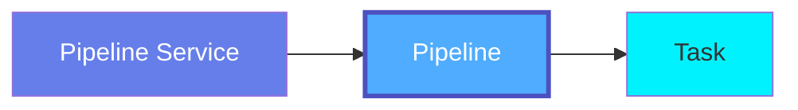

# Pipeline

**Data workflows and DAGs - orchestrating data transformations**

---

## Overview

The **Pipeline** entity represents data workflows, DAGs (Directed Acyclic Graphs), or data pipelines that orchestrate data processing tasks. Pipelines define the sequence and dependencies of tasks that move and transform data across systems.

**Hierarchy**:



---

## Schema Specifications

View the complete Pipeline schema in your preferred format:

=== "JSON Schema"

    **Complete JSON Schema Definition**

    ```json
    {
      "$id": "https://open-metadata.org/schema/entity/data/pipeline.json",
      "$schema": "http://json-schema.org/draft-07/schema#",
      "title": "Pipeline",
      "$comment": "@om-entity-type",
      "description": "This schema defines the Pipeline entity. A pipeline enables the flow of data from source to destination through a series of processing steps. ETL is a type of pipeline where the series of steps Extract, Transform and Load the data.",
      "type": "object",
      "javaType": "org.openmetadata.schema.entity.data.Pipeline",
      "javaInterfaces": ["org.openmetadata.schema.EntityInterface"],

      "definitions": {
        "statusType": {
          "javaType": "org.openmetadata.schema.type.StatusType",
          "description": "Enum defining the possible Status.",
          "type": "string",
          "enum": ["Successful", "Failed", "Pending", "Skipped"],
          "javaEnums": [
            {"name": "Successful"},
            {"name": "Failed"},
            {"name": "Pending"},
            {"name": "Skipped"}
          ]
        },
        "pipelineState": {
          "description": "Enum defining the possible Pipeline State.",
          "type": "string",
          "enum": ["Active", "Inactive"],
          "javaEnums": [
            {"name": "Active"},
            {"name": "Inactive"}
          ]
        },
        "taskStatus": {
          "type": "object",
          "javaType": "org.openmetadata.schema.type.Status",
          "description": "This schema defines a time series of the status of a Pipeline or Task.",
          "properties": {
            "name": {"description": "Name of the Task.", "type": "string"},
            "executionStatus": {"description": "Status at a specific execution date.", "$ref": "#/definitions/statusType"},
            "startTime": {"description": "Task start time", "$ref": "../../type/basic.json#/definitions/timestamp"},
            "endTime": {"description": "Task end time", "$ref": "../../type/basic.json#/definitions/timestamp"},
            "logLink": {"description": "Task end time", "type": "string", "format": "uri"},
            "taskId": {"description": "Task ID from orchestrator", "type": "string"},
            "transformationType": {"description": "Type of transformation", "type": "string", "enum": ["filter", "aggregate", "join", "pivot", "custom", "extract", "load"]},
            "transformationLogic": {"description": "SQL or code executed", "type": "string"},
            "inputs": {"description": "Task-specific inputs", "type": "array", "items": {"$ref": "#/definitions/datasetUsage"}},
            "outputs": {"description": "Task-specific outputs", "type": "array", "items": {"$ref": "#/definitions/datasetGeneration"}},
            "metrics": {"$ref": "#/definitions/taskMetrics"}
          },
          "required": ["name", "executionStatus"]
        },
        "task": {
          "type": "object",
          "javaType": "org.openmetadata.schema.type.Task",
          "properties": {
            "name": {"description": "Name that identifies this task instance uniquely.", "type": "string"},
            "displayName": {"description": "Display Name that identifies this Task.", "type": "string"},
            "fullyQualifiedName": {"description": "A unique name that identifies a pipeline in the format 'ServiceName.PipelineName.TaskName'.", "type": "string"},
            "description": {"description": "Description of this Task.", "$ref": "../../type/basic.json#/definitions/markdown"},
            "sourceUrl": {"description": "Task URL to visit/manage.", "$ref": "../../type/basic.json#/definitions/sourceUrl"},
            "downstreamTasks": {"description": "All the tasks that are downstream of this task.", "type": "array", "items": {"type": "string"}},
            "taskType": {"description": "Type of the Task.", "type": "string"},
            "taskSQL": {"description": "SQL used in the task.", "$ref": "../../type/basic.json#/definitions/sqlQuery"},
            "startDate": {"description": "start date for the task.", "type": "string"},
            "endDate": {"description": "end date for the task.", "type": "string"},
            "tags": {"description": "Tags for this task.", "type": "array", "items": {"$ref": "../../type/tagLabel.json"}},
            "owners": {"description": "Owners of this task.", "$ref": "../../type/entityReferenceList.json"}
          },
          "required": ["name"]
        },
        "pipelineStatus": {
          "description": "Series of pipeline executions, its status and task status.",
          "type": "object",
          "properties": {
            "timestamp": {"description": "Timestamp where the job was executed.", "$ref": "../../type/basic.json#/definitions/timestamp"},
            "executionStatus": {"description": "Status at a specific execution date.", "$ref": "#/definitions/statusType"},
            "taskStatus": {"description": "Series of task executions and its status.", "type": "array", "items": {"$ref": "#/definitions/taskStatus"}},
            "executionId": {"description": "External execution ID from the orchestrator", "type": "string"},
            "endTime": {"description": "Execution end time", "$ref": "../../type/basic.json#/definitions/timestamp"},
            "version": {"description": "Pipeline version that was executed", "type": "string"},
            "parameters": {"description": "Execution parameters/configuration", "type": "object"},
            "executedBy": {"description": "User or service that triggered the execution", "$ref": "../../type/entityReference.json"},
            "inputs": {"description": "Input datasets consumed by this execution", "type": "array", "items": {"$ref": "#/definitions/datasetUsage"}},
            "outputs": {"description": "Output datasets generated by this execution", "type": "array", "items": {"$ref": "#/definitions/datasetGeneration"}},
            "metrics": {"description": "Execution metrics", "$ref": "#/definitions/executionMetrics"},
            "error": {"description": "Error details if execution failed", "$ref": "#/definitions/executionError"}
          },
          "required": ["timestamp", "executionStatus"]
        }
      },

      "properties": {
        "id": {
          "description": "Unique identifier that identifies a pipeline instance.",
          "$ref": "../../type/basic.json#/definitions/uuid"
        },
        "name": {
          "description": "Name that identifies this pipeline instance uniquely.",
          "$ref": "../../type/basic.json#/definitions/entityName"
        },
        "displayName": {
          "description": "Display Name that identifies this Pipeline. It could be title or label from the source services.",
          "type": "string"
        },
        "fullyQualifiedName": {
          "description": "A unique name that identifies a pipeline in the format 'ServiceName.PipelineName'.",
          "$ref": "../../type/basic.json#/definitions/fullyQualifiedEntityName"
        },
        "description": {
          "description": "Description of this Pipeline.",
          "$ref": "../../type/basic.json#/definitions/markdown"
        },
        "dataProducts": {
          "description": "List of data products this entity is part of.",
          "$ref": "../../type/entityReferenceList.json"
        },
        "version": {
          "description": "Metadata version of the entity.",
          "$ref": "../../type/entityHistory.json#/definitions/entityVersion"
        },
        "updatedAt": {
          "description": "Last update time corresponding to the new version of the entity in Unix epoch time milliseconds.",
          "$ref": "../../type/basic.json#/definitions/timestamp"
        },
        "updatedBy": {
          "description": "User who made the update.",
          "type": "string"
        },
        "impersonatedBy": {
          "description": "Bot user that performed the action on behalf of the actual user.",
          "$ref": "../../type/basic.json#/definitions/impersonatedBy"
        },
        "sourceUrl": {
          "description": "Pipeline URL to visit/manage. This URL points to respective pipeline service UI.",
          "$ref": "../../type/basic.json#/definitions/sourceUrl"
        },
        "concurrency": {
          "description": "Concurrency of the Pipeline.",
          "type": "integer"
        },
        "pipelineLocation": {
          "description": "Pipeline Code Location.",
          "type": "string"
        },
        "startDate": {
          "description": "Start date of the workflow.",
          "$ref": "../../type/basic.json#/definitions/dateTime"
        },
        "endDate": {
          "description": "End date of the workflow.",
          "$ref": "../../type/basic.json#/definitions/dateTime"
        },
        "tasks": {
          "description": "All the tasks that are part of pipeline.",
          "type": "array",
          "items": {
            "$ref": "#/definitions/task"
          }
        },
        "pipelineStatus": {
          "description": "Latest Pipeline Status.",
          "$ref": "#/definitions/pipelineStatus"
        },
        "state": {
          "description": "State of the Pipeline.",
          "$ref": "#/definitions/pipelineState"
        },
        "followers": {
          "description": "Followers of this Pipeline.",
          "$ref": "../../type/entityReferenceList.json"
        },
        "tags": {
          "description": "Tags for this Pipeline.",
          "type": "array",
          "items": {
            "$ref": "../../type/tagLabel.json"
          }
        },
        "href": {
          "description": "Link to the resource corresponding to this entity.",
          "$ref": "../../type/basic.json#/definitions/href"
        },
        "owners": {
          "description": "Owners of this pipeline.",
          "$ref": "../../type/entityReferenceList.json"
        },
        "service": {
          "description": "Link to service where this pipeline is hosted in.",
          "$ref": "../../type/entityReference.json"
        },
        "serviceType": {
          "description": "Service type where this pipeline is hosted in.",
          "$ref": "../services/pipelineService.json#/definitions/pipelineServiceType"
        },
        "usageSummary": {
          "description": "Latest usage information for this pipeline.",
          "$ref": "../../type/usageDetails.json"
        },
        "changeDescription": {
          "description": "Change that lead to this version of the entity.",
          "$ref": "../../type/entityHistory.json#/definitions/changeDescription"
        },
        "incrementalChangeDescription": {
          "description": "Change that lead to this version of the entity.",
          "$ref": "../../type/entityHistory.json#/definitions/changeDescription"
        },
        "deleted": {
          "description": "When `true` indicates the entity has been soft deleted.",
          "type": "boolean",
          "default": false
        },
        "extension": {
          "description": "Entity extension data with custom attributes added to the entity.",
          "$ref": "../../type/basic.json#/definitions/entityExtension"
        },
        "scheduleInterval": {
          "description": "Scheduler Interval for the pipeline in cron format.",
          "type": "string"
        },
        "domains": {
          "description": "Domains the Pipeline belongs to. When not set, the pipeline inherits the domain from the Pipeline service it belongs to.",
          "$ref": "../../type/entityReferenceList.json"
        },
        "votes": {
          "description": "Votes on the entity.",
          "$ref": "../../type/votes.json"
        },
        "lifeCycle": {
          "description": "Life Cycle properties of the entity",
          "$ref": "../../type/lifeCycle.json"
        },
        "certification": {
          "$ref": "../../type/assetCertification.json"
        },
        "sourceHash": {
          "description": "Source hash of the entity",
          "type": "string",
          "minLength": 1,
          "maxLength": 32
        },
        "entityStatus": {
          "description": "Status of the Pipeline.",
          "$ref": "../../type/status.json"
        }
      },

      "required": ["id", "name", "service"],
      "additionalProperties": false
    }
    ```

    **[View Full JSON Schema →](https://github.com/open-metadata/OpenMetadataStandards/blob/main/schemas/entity/data/pipeline.json)**

=== "RDF"

    **RDF/OWL Ontology Definition**

    ```turtle
    @prefix om: <https://open-metadata.org/schema/> .
    @prefix rdfs: <http://www.w3.org/2000/01/rdf-schema#> .
    @prefix owl: <http://www.w3.org/2001/XMLSchema#> .
    @prefix xsd: <http://www.w3.org/2001/XMLSchema#> .

    # Pipeline Class Definition
    om:Pipeline a owl:Class ;
        rdfs:subClassOf om:DataAsset ;
        rdfs:label "Pipeline" ;
        rdfs:comment "A workflow or DAG that orchestrates data processing tasks" ;
        om:hierarchyLevel 2 .

    # Properties
    om:pipelineName a owl:DatatypeProperty ;
        rdfs:domain om:Pipeline ;
        rdfs:range xsd:string ;
        rdfs:label "name" ;
        rdfs:comment "Name of the pipeline" .

    om:fullyQualifiedName a owl:DatatypeProperty ;
        rdfs:domain om:Pipeline ;
        rdfs:range xsd:string ;
        rdfs:label "fullyQualifiedName" ;
        rdfs:comment "Complete hierarchical name: service.pipeline" .

    om:pipelineUrl a owl:DatatypeProperty ;
        rdfs:domain om:Pipeline ;
        rdfs:range xsd:anyURI ;
        rdfs:label "pipelineUrl" ;
        rdfs:comment "URL to pipeline in orchestration tool" .

    om:scheduleInterval a owl:DatatypeProperty ;
        rdfs:domain om:Pipeline ;
        rdfs:range xsd:string ;
        rdfs:label "scheduleInterval" ;
        rdfs:comment "Cron or rate expression for pipeline schedule" .

    om:pipelineStatus a owl:DatatypeProperty ;
        rdfs:domain om:Pipeline ;
        rdfs:range om:PipelineStatus ;
        rdfs:label "pipelineStatus" ;
        rdfs:comment "Current execution status" .

    om:hasTask a owl:ObjectProperty ;
        rdfs:domain om:Pipeline ;
        rdfs:range om:Task ;
        rdfs:label "hasTask" ;
        rdfs:comment "Tasks in this pipeline" .

    om:belongsToPipelineService a owl:ObjectProperty ;
        rdfs:domain om:Pipeline ;
        rdfs:range om:PipelineService ;
        rdfs:label "belongsToService" ;
        rdfs:comment "Service managing this pipeline" .

    om:pipelineOwnedBy a owl:ObjectProperty ;
        rdfs:domain om:Pipeline ;
        rdfs:range om:Owner ;
        rdfs:label "ownedBy" ;
        rdfs:comment "Owners of this pipeline" .

    om:pipelineHasTag a owl:ObjectProperty ;
        rdfs:domain om:Pipeline ;
        rdfs:range om:Tag ;
        rdfs:label "hasTag" ;
        rdfs:comment "Classification tags applied to pipeline" .

    om:pipelineInDomain a owl:ObjectProperty ;
        rdfs:domain om:Pipeline ;
        rdfs:range om:Domain ;
        rdfs:label "inDomain" ;
        rdfs:comment "Domains the pipeline belongs to" .

    om:pipelineFollowedBy a owl:ObjectProperty ;
        rdfs:domain om:Pipeline ;
        rdfs:range om:User ;
        rdfs:label "followedBy" ;
        rdfs:comment "Users following this pipeline" .

    om:pipelineState a owl:DatatypeProperty ;
        rdfs:domain om:Pipeline ;
        rdfs:range om:PipelineState ;
        rdfs:label "state" ;
        rdfs:comment "State of the pipeline (Active/Inactive)" .

    om:endDate a owl:DatatypeProperty ;
        rdfs:domain om:Pipeline ;
        rdfs:range xsd:dateTime ;
        rdfs:label "endDate" ;
        rdfs:comment "End date of the workflow" .

    # Pipeline Status Enumeration
    om:StatusType a owl:Class ;
        owl:oneOf (
            om:Successful
            om:Failed
            om:Pending
            om:Skipped
        ) .

    # Pipeline State Enumeration
    om:PipelineState a owl:Class ;
        owl:oneOf (
            om:Active
            om:Inactive
        ) .

    # Example Instance
    ex:customerEtlPipeline a om:Pipeline ;
        om:pipelineName "customer_etl" ;
        om:fullyQualifiedName "airflow_prod.customer_etl" ;
        om:displayName "Customer ETL Pipeline" ;
        om:scheduleInterval "0 2 * * *" ;
        om:pipelineState om:Active ;
        om:startDate "2024-01-01T00:00:00Z"^^xsd:dateTime ;
        om:endDate "2024-12-31T23:59:59Z"^^xsd:dateTime ;
        om:concurrency 1 ;
        om:belongsToPipelineService ex:airflowProdService ;
        om:pipelineOwnedBy ex:dataEngTeam ;
        om:pipelineInDomain ex:customerDataDomain ;
        om:pipelineHasTag ex:tierGold ;
        om:pipelineFollowedBy ex:johnDoe ;
        om:hasTask ex:extractCustomersTask ;
        om:hasTask ex:transformCustomersTask ;
        om:hasTask ex:loadCustomersTask .
    ```

    **[View Full RDF Ontology →](https://github.com/open-metadata/OpenMetadataStandards/blob/main/rdf/ontology/openmetadata.ttl)**

=== "JSON-LD"

    **JSON-LD Context and Example**

    ```json
    {
      "@context": {
        "@vocab": "https://open-metadata.org/schema/",
        "om": "https://open-metadata.org/schema/",
        "rdfs": "http://www.w3.org/2000/01/rdf-schema#",
        "xsd": "http://www.w3.org/2001/XMLSchema#",

        "Pipeline": "om:Pipeline",
        "name": {
          "@id": "om:pipelineName",
          "@type": "xsd:string"
        },
        "fullyQualifiedName": {
          "@id": "om:fullyQualifiedName",
          "@type": "xsd:string"
        },
        "displayName": {
          "@id": "om:displayName",
          "@type": "xsd:string"
        },
        "description": {
          "@id": "om:description",
          "@type": "xsd:string"
        },
        "pipelineUrl": {
          "@id": "om:pipelineUrl",
          "@type": "xsd:anyURI"
        },
        "scheduleInterval": {
          "@id": "om:scheduleInterval",
          "@type": "xsd:string"
        },
        "startDate": {
          "@id": "om:startDate",
          "@type": "xsd:dateTime"
        },
        "endDate": {
          "@id": "om:endDate",
          "@type": "xsd:dateTime"
        },
        "state": {
          "@id": "om:pipelineState",
          "@type": "@vocab"
        },
        "concurrency": {
          "@id": "om:concurrency",
          "@type": "xsd:integer"
        },
        "pipelineLocation": {
          "@id": "om:pipelineLocation",
          "@type": "xsd:string"
        },
        "pipelineStatus": {
          "@id": "om:pipelineStatus",
          "@type": "@id"
        },
        "tasks": {
          "@id": "om:hasTask",
          "@type": "@id",
          "@container": "@list"
        },
        "service": {
          "@id": "om:belongsToPipelineService",
          "@type": "@id"
        },
        "serviceType": {
          "@id": "om:serviceType",
          "@type": "xsd:string"
        },
        "owners": {
          "@id": "om:pipelineOwnedBy",
          "@type": "@id",
          "@container": "@set"
        },
        "domains": {
          "@id": "om:pipelineInDomain",
          "@type": "@id",
          "@container": "@set"
        },
        "followers": {
          "@id": "om:pipelineFollowedBy",
          "@type": "@id",
          "@container": "@set"
        },
        "tags": {
          "@id": "om:pipelineHasTag",
          "@type": "@id",
          "@container": "@set"
        },
        "dataProducts": {
          "@id": "om:partOfDataProduct",
          "@type": "@id",
          "@container": "@set"
        },
        "votes": {
          "@id": "om:hasVotes",
          "@type": "@id"
        },
        "lifeCycle": {
          "@id": "om:hasLifeCycle",
          "@type": "@id"
        },
        "certification": {
          "@id": "om:hasCertification",
          "@type": "@id"
        }
      }
    }
    ```

    **Example JSON-LD Instance**:

    ```json
    {
      "@context": "https://open-metadata.org/context/pipeline.jsonld",
      "@type": "Pipeline",
      "@id": "https://example.com/pipelines/customer_etl",

      "name": "customer_etl",
      "fullyQualifiedName": "airflow_prod.customer_etl",
      "displayName": "Customer ETL Pipeline",
      "description": "Daily ETL pipeline for customer data",
      "sourceUrl": "https://github.com/company/pipelines/blob/main/dags/customer_etl.py",

      "scheduleInterval": "0 2 * * *",
      "startDate": "2024-01-01T00:00:00Z",
      "endDate": "2024-12-31T23:59:59Z",
      "state": "Active",
      "concurrency": 1,
      "pipelineLocation": "/opt/airflow/dags/customer_etl.py",

      "pipelineStatus": {
        "timestamp": 1704240000000,
        "executionStatus": "Successful",
        "executionId": "manual__2024-01-03T02:00:00+00:00"
      },

      "service": {
        "@id": "https://example.com/services/airflow_prod",
        "@type": "PipelineService",
        "name": "airflow_prod"
      },

      "serviceType": "Airflow",

      "owners": [
        {
          "@id": "https://example.com/teams/data-engineering",
          "@type": "Team",
          "name": "data-engineering",
          "displayName": "Data Engineering"
        }
      ],

      "domains": [
        {
          "@id": "https://example.com/domains/CustomerData",
          "@type": "Domain",
          "name": "CustomerData"
        }
      ],

      "followers": [
        {
          "@id": "https://example.com/users/john.doe",
          "@type": "User",
          "name": "john.doe"
        }
      ],

      "dataProducts": [
        {
          "@id": "https://example.com/dataProducts/CustomerInsights",
          "@type": "DataProduct",
          "name": "CustomerInsights"
        }
      ],

      "tags": [
        {
          "@id": "https://open-metadata.org/tags/Tier/Gold",
          "tagFQN": "Tier.Gold"
        },
        {
          "@id": "https://open-metadata.org/tags/Schedule/Daily",
          "tagFQN": "Schedule.Daily"
        }
      ],

      "tasks": [
        {
          "@type": "Task",
          "@id": "https://example.com/pipelines/customer_etl/tasks/extract_customers",
          "name": "extract_customers",
          "taskType": "PythonOperator"
        },
        {
          "@type": "Task",
          "@id": "https://example.com/pipelines/customer_etl/tasks/transform_customers",
          "name": "transform_customers",
          "taskType": "SparkSubmitOperator"
        },
        {
          "@type": "Task",
          "@id": "https://example.com/pipelines/customer_etl/tasks/load_customers",
          "name": "load_customers",
          "taskType": "PostgresOperator"
        }
      ]
    }
    ```

    **[View Full JSON-LD Context →](https://github.com/open-metadata/OpenMetadataStandards/blob/main/rdf/contexts/pipeline.jsonld)**

---

## Use Cases

- Document ETL/ELT workflows and data pipelines
- Track pipeline schedules and execution history
- Monitor pipeline success rates and failures
- Capture data lineage through pipelines
- Define pipeline ownership and responsibilities
- Apply governance tags to critical pipelines
- Link pipelines to business processes
- Audit data transformation logic

---

## JSON Schema Specification

### Core Properties

#### `id` (uuid)
**Type**: `string` (UUID format)
**Required**: Yes (system-generated)
**Description**: Unique identifier for this pipeline instance

```json
{
  "id": "2a3b4c5d-6e7f-8a9b-0c1d-2e3f4a5b6c7d"
}
```

---

#### `name` (entityName)
**Type**: `string`
**Required**: Yes
**Pattern**: `^[^.]*$` (no dots allowed)
**Min Length**: 1
**Max Length**: 256
**Description**: Name of the pipeline (unqualified)

```json
{
  "name": "customer_etl"
}
```

---

#### `fullyQualifiedName` (fullyQualifiedEntityName)
**Type**: `string`
**Required**: Yes (system-generated)
**Pattern**: `^((?!::).)*$`
**Description**: Fully qualified name in the format `service.pipeline`

```json
{
  "fullyQualifiedName": "airflow_prod.customer_etl"
}
```

---

#### `displayName`
**Type**: `string`
**Required**: No
**Description**: Human-readable display name

```json
{
  "displayName": "Customer ETL Pipeline"
}
```

---

#### `description` (markdown)
**Type**: `string` (Markdown format)
**Required**: No
**Description**: Rich text description of the pipeline's purpose and logic

```json
{
  "description": "# Customer ETL Pipeline\n\nDaily pipeline that extracts customer data from MongoDB, transforms it, and loads into PostgreSQL.\n\n## Schedule\n- Runs daily at 2 AM UTC\n- Average duration: 45 minutes\n\n## Data Flow\n1. Extract from MongoDB `customers` collection\n2. Deduplicate and validate\n3. Enrich with geographic data\n4. Load to PostgreSQL `public.customers` table"
}
```

---

### Pipeline Configuration Properties

#### `pipelineUrl` (URI)
**Type**: `string` (URI format)
**Required**: No
**Description**: URL to view pipeline in orchestration tool

```json
{
  "pipelineUrl": "https://airflow.company.com/dags/customer_etl"
}
```

---

#### `sourceUrl` (URI)
**Type**: `string` (URI format)
**Required**: No
**Description**: URL to pipeline source code repository

```json
{
  "sourceUrl": "https://github.com/company/pipelines/blob/main/dags/customer_etl.py"
}
```

---

#### `scheduleInterval` (string)
**Type**: `string`
**Required**: No
**Description**: Scheduler Interval for the pipeline in cron format

**Example**:

```json
{
  "scheduleInterval": "0 2 * * *"
}
```

---

#### `pipelineStatus` (pipelineStatus)
**Type**: `object`
**Required**: No
**Description**: Latest Pipeline Status with execution details

**pipelineStatus Object Properties**:

| Property | Type | Required | Description |
|----------|------|----------|-------------|
| `timestamp` | timestamp | Yes | Timestamp where the job was executed |
| `executionStatus` | statusType | Yes | Status at a specific execution date |
| `taskStatus` | array | No | Series of task executions and its status |
| `executionId` | string | No | External execution ID from the orchestrator |
| `endTime` | timestamp | No | Execution end time |
| `version` | string | No | Pipeline version that was executed |
| `parameters` | object | No | Execution parameters/configuration |
| `executedBy` | entityReference | No | User or service that triggered the execution |
| `inputs` | array | No | Input datasets consumed by this execution |
| `outputs` | array | No | Output datasets generated by this execution |
| `metrics` | executionMetrics | No | Execution metrics |
| `error` | executionError | No | Error details if execution failed |

**statusType Enum Values**: `Successful`, `Failed`, `Pending`, `Skipped`

```json
{
  "pipelineStatus": {
    "timestamp": 1704240000000,
    "executionStatus": "Successful",
    "executionId": "manual__2024-01-03T02:00:00+00:00"
  }
}
```

---

#### `concurrency` (integer)
**Type**: `integer`
**Required**: No
**Description**: Maximum number of concurrent pipeline runs

```json
{
  "concurrency": 1
}
```

---

#### `pipelineLocation` (string)
**Type**: `string`
**Required**: No
**Description**: File path or location of pipeline definition

```json
{
  "pipelineLocation": "/opt/airflow/dags/customer_etl.py"
}
```

---

#### `startDate` (dateTime)
**Type**: `string` (ISO 8601 date-time)
**Required**: No
**Description**: Start date of the workflow

```json
{
  "startDate": "2024-01-01T00:00:00Z"
}
```

---

#### `endDate` (dateTime)
**Type**: `string` (ISO 8601 date-time)
**Required**: No
**Description**: End date of the workflow

```json
{
  "endDate": "2024-12-31T23:59:59Z"
}
```

---

#### `state` (pipelineState)
**Type**: `string` enum
**Required**: No
**Description**: State of the Pipeline
**Allowed Values**: `Active`, `Inactive`

```json
{
  "state": "Active"
}
```

---

### Structure Properties

#### `tasks[]` (Task[])
**Type**: `array` of task objects
**Required**: No
**Description**: All the tasks that are part of pipeline

**Task Object Properties**:

| Property | Type | Required | Description |
|----------|------|----------|-------------|
| `name` | string | Yes | Name that identifies this task instance uniquely |
| `displayName` | string | No | Display Name that identifies this Task |
| `fullyQualifiedName` | string | No | Format: ServiceName.PipelineName.TaskName |
| `description` | markdown | No | Description of this Task |
| `sourceUrl` | sourceUrl | No | Task URL to visit/manage |
| `downstreamTasks` | array | No | All the tasks that are downstream of this task |
| `taskType` | string | No | Type of the Task |
| `taskSQL` | sqlQuery | No | SQL used in the task |
| `startDate` | string | No | Start date for the task |
| `endDate` | string | No | End date for the task |
| `tags` | array | No | Tags for this task |
| `owners` | entityReferenceList | No | Owners of this task |

```json
{
  "tasks": [
    {
      "name": "extract_customers",
      "displayName": "Extract Customers",
      "taskType": "PythonOperator",
      "description": "Extract customer data from MongoDB"
    },
    {
      "name": "transform_customers",
      "displayName": "Transform Customers",
      "taskType": "SparkSubmitOperator",
      "downstreamTasks": ["extract_customers"]
    },
    {
      "name": "load_customers",
      "displayName": "Load Customers",
      "taskType": "PostgresOperator",
      "downstreamTasks": ["transform_customers"]
    }
  ]
}
```

---

### Location Properties

#### `service` (EntityReference)
**Type**: `object`
**Required**: Yes
**Description**: Link to service where this pipeline is hosted in

```json
{
  "service": {
    "id": "1a2b3c4d-5e6f-7a8b-9c0d-1e2f3a4b5c6d",
    "type": "pipelineService",
    "name": "airflow_prod",
    "fullyQualifiedName": "airflow_prod"
  }
}
```

---

#### `serviceType` (pipelineServiceType)
**Type**: `string` enum
**Required**: No
**Description**: Service type where this pipeline is hosted in

```json
{
  "serviceType": "Airflow"
}
```

---

### Governance Properties

#### `owners` (EntityReferenceList)
**Type**: `array` of EntityReference
**Required**: No
**Description**: Owners of this pipeline

```json
{
  "owners": [
    {
      "id": "6e7f8a9b-0c1d-2e3f-4a5b-6c7d8e9f0a1b",
      "type": "team",
      "name": "data-engineering",
      "displayName": "Data Engineering Team"
    }
  ]
}
```

---

#### `domains` (EntityReferenceList)
**Type**: `array` of EntityReference
**Required**: No
**Description**: Domains the Pipeline belongs to. When not set, the pipeline inherits the domain from the Pipeline service it belongs to

```json
{
  "domains": [
    {
      "id": "7f8a9b0c-1d2e-3f4a-5b6c-7d8e9f0a1b2c",
      "type": "domain",
      "name": "CustomerData",
      "fullyQualifiedName": "CustomerData"
    }
  ]
}
```

---

#### `followers` (EntityReferenceList)
**Type**: `array` of EntityReference
**Required**: No
**Description**: Followers of this Pipeline

```json
{
  "followers": [
    {
      "id": "8a9b0c1d-2e3f-4a5b-6c7d-8e9f0a1b2c3d",
      "type": "user",
      "name": "john.doe",
      "displayName": "John Doe"
    }
  ]
}
```

---

#### `votes` (Votes)
**Type**: `object`
**Required**: No
**Description**: Votes on the entity

```json
{
  "votes": {
    "upVotes": 5,
    "downVotes": 1,
    "upVoters": ["user1", "user2"]
  }
}
```

---

#### `lifeCycle` (LifeCycle)
**Type**: `object`
**Required**: No
**Description**: Life Cycle properties of the entity

```json
{
  "lifeCycle": {
    "created": {
      "timestamp": 1704067200000,
      "user": "admin"
    },
    "updated": {
      "timestamp": 1704240000000,
      "user": "john.doe"
    }
  }
}
```

---

#### `certification` (AssetCertification)
**Type**: `object`
**Required**: No
**Description**: Asset certification details

```json
{
  "certification": {
    "certifiedBy": "data-governance-team",
    "certifiedAt": 1704240000000
  }
}
```

---

#### `dataProducts` (EntityReferenceList)
**Type**: `array` of EntityReference
**Required**: No
**Description**: List of data products this entity is part of

```json
{
  "dataProducts": [
    {
      "id": "9b0c1d2e-3f4a-5b6c-7d8e-9f0a1b2c3d4e",
      "type": "dataProduct",
      "name": "CustomerInsights",
      "fullyQualifiedName": "CustomerInsights"
    }
  ]
}
```

---

#### `tags[]` (TagLabel[])
**Type**: `array`
**Required**: No
**Description**: Classification tags applied to the pipeline

```json
{
  "tags": [
    {
      "tagFQN": "Tier.Gold",
      "description": "Critical production pipeline",
      "source": "Classification",
      "labelType": "Manual",
      "state": "Confirmed"
    },
    {
      "tagFQN": "Schedule.Daily",
      "source": "Classification",
      "labelType": "Automated",
      "state": "Confirmed"
    }
  ]
}
```

---

### Lineage Properties

#### `upstream` (EntityLineage)
**Type**: `array`
**Required**: No (system-populated)
**Description**: Upstream data assets (tables, files, etc.)

```json
{
  "upstream": [
    {
      "id": "source-table-uuid",
      "type": "table",
      "name": "customers",
      "fullyQualifiedName": "mongodb_prod.crm.customers"
    }
  ]
}
```

---

#### `downstream` (EntityLineage)
**Type**: `array`
**Required**: No (system-populated)
**Description**: Downstream data assets

```json
{
  "downstream": [
    {
      "id": "target-table-uuid",
      "type": "table",
      "name": "customers",
      "fullyQualifiedName": "postgres_prod.ecommerce.public.customers"
    }
  ]
}
```

---

### Versioning Properties

#### `version` (entityVersion)
**Type**: `number`
**Required**: Yes (system-managed)
**Description**: Metadata version number, incremented on changes

```json
{
  "version": 3.1
}
```

---

#### `updatedAt` (timestamp)
**Type**: `integer` (Unix epoch milliseconds)
**Required**: Yes (system-managed)
**Description**: Last update timestamp

```json
{
  "updatedAt": 1704240000000
}
```

---

#### `updatedBy` (string)
**Type**: `string`
**Required**: Yes (system-managed)
**Description**: User who made the update

```json
{
  "updatedBy": "john.doe"
}
```

---

#### `changeDescription` (ChangeDescription)
**Type**: `object`
**Required**: No
**Description**: Details of what changed in this version

```json
{
  "changeDescription": {
    "fieldsAdded": [
      {
        "name": "tasks.data_quality_check",
        "newValue": "Task for validating data quality"
      }
    ],
    "fieldsUpdated": [
      {
        "name": "scheduleInterval.scheduleExpression",
        "oldValue": "0 1 * * *",
        "newValue": "0 2 * * *"
      }
    ],
    "fieldsDeleted": [],
    "previousVersion": 3.0
  }
}
```

---

## Complete Example

```json
{
  "id": "2a3b4c5d-6e7f-8a9b-0c1d-2e3f4a5b6c7d",
  "name": "customer_etl",
  "displayName": "Customer ETL Pipeline",
  "fullyQualifiedName": "airflow_prod.customer_etl",
  "description": "# Customer ETL Pipeline\n\nDaily pipeline that extracts customer data from MongoDB, transforms it, and loads into PostgreSQL.",
  "sourceUrl": "https://github.com/company/pipelines/blob/main/dags/customer_etl.py",
  "concurrency": 1,
  "pipelineLocation": "/opt/airflow/dags/customer_etl.py",
  "startDate": "2024-01-01T00:00:00Z",
  "endDate": "2024-12-31T23:59:59Z",
  "scheduleInterval": "0 2 * * *",
  "state": "Active",
  "tasks": [
    {
      "name": "extract_customers",
      "displayName": "Extract Customers",
      "taskType": "PythonOperator",
      "description": "Extract customer data from MongoDB"
    },
    {
      "name": "transform_customers",
      "displayName": "Transform Customers",
      "taskType": "SparkSubmitOperator",
      "downstreamTasks": ["extract_customers"]
    },
    {
      "name": "load_customers",
      "displayName": "Load Customers",
      "taskType": "PostgresOperator",
      "downstreamTasks": ["transform_customers"]
    }
  ],
  "pipelineStatus": {
    "timestamp": 1704240000000,
    "executionStatus": "Successful",
    "executionId": "manual__2024-01-03T02:00:00+00:00"
  },
  "service": {
    "id": "1a2b3c4d-5e6f-7a8b-9c0d-1e2f3a4b5c6d",
    "type": "pipelineService",
    "name": "airflow_prod",
    "fullyQualifiedName": "airflow_prod"
  },
  "serviceType": "Airflow",
  "owners": [
    {
      "id": "6e7f8a9b-0c1d-2e3f-4a5b-6c7d8e9f0a1b",
      "type": "team",
      "name": "data-engineering",
      "displayName": "Data Engineering Team"
    }
  ],
  "domains": [
    {
      "id": "7f8a9b0c-1d2e-3f4a-5b6c-7d8e9f0a1b2c",
      "type": "domain",
      "name": "CustomerData",
      "fullyQualifiedName": "CustomerData"
    }
  ],
  "followers": [
    {
      "id": "8a9b0c1d-2e3f-4a5b-6c7d-8e9f0a1b2c3d",
      "type": "user",
      "name": "john.doe"
    }
  ],
  "dataProducts": [
    {
      "id": "9b0c1d2e-3f4a-5b6c-7d8e-9f0a1b2c3d4e",
      "type": "dataProduct",
      "name": "CustomerInsights"
    }
  ],
  "tags": [
    {
      "tagFQN": "Tier.Gold",
      "source": "Classification",
      "labelType": "Manual",
      "state": "Confirmed"
    },
    {
      "tagFQN": "Schedule.Daily",
      "source": "Classification",
      "labelType": "Automated",
      "state": "Confirmed"
    }
  ],
  "votes": {
    "upVotes": 5,
    "downVotes": 1
  },
  "lifeCycle": {
    "created": {
      "timestamp": 1704067200000,
      "user": "admin"
    }
  },
  "certification": {
    "certifiedBy": "data-governance-team",
    "certifiedAt": 1704240000000
  },
  "version": 3.1,
  "updatedAt": 1704240000000,
  "updatedBy": "john.doe",
  "href": "https://open-metadata.org/api/v1/pipelines/2a3b4c5d-6e7f-8a9b-0c1d-2e3f4a5b6c7d",
  "deleted": false
}
```

---

## RDF Representation

### Ontology Class

```turtle
@prefix om: <https://open-metadata.org/schema/> .
@prefix rdfs: <http://www.w3.org/2000/01/rdf-schema#> .
@prefix owl: <http://www.w3.org/2001/XMLSchema#> .

om:Pipeline a owl:Class ;
    rdfs:subClassOf om:DataAsset ;
    rdfs:label "Pipeline" ;
    rdfs:comment "A workflow or DAG that orchestrates data processing" ;
    om:hasProperties [
        om:name "string" ;
        om:tasks "Task[]" ;
        om:scheduleInterval "string" ;
        om:service "PipelineService" ;
        om:owner "Owner" ;
        om:tags "Tag[]" ;
    ] .
```

### Instance Example

```turtle
@prefix om: <https://open-metadata.org/schema/> .
@prefix ex: <https://example.com/pipelines/> .
@prefix xsd: <http://www.w3.org/2001/XMLSchema#> .

ex:customer_etl a om:Pipeline ;
    om:pipelineName "customer_etl" ;
    om:fullyQualifiedName "airflow_prod.customer_etl" ;
    om:displayName "Customer ETL Pipeline" ;
    om:description "Daily pipeline that extracts customer data" ;
    om:sourceUrl "https://github.com/company/pipelines/blob/main/dags/customer_etl.py"^^xsd:anyURI ;
    om:scheduleInterval "0 2 * * *" ;
    om:startDate "2024-01-01T00:00:00Z"^^xsd:dateTime ;
    om:endDate "2024-12-31T23:59:59Z"^^xsd:dateTime ;
    om:pipelineState om:Active ;
    om:concurrency 1 ;
    om:pipelineLocation "/opt/airflow/dags/customer_etl.py" ;
    om:belongsToPipelineService ex:airflow_prod ;
    om:pipelineOwnedBy ex:data_engineering_team ;
    om:pipelineInDomain ex:customer_data_domain ;
    om:pipelineHasTag ex:tier_gold ;
    om:pipelineFollowedBy ex:john_doe ;
    om:hasTask ex:extract_customers ;
    om:hasTask ex:transform_customers ;
    om:hasTask ex:load_customers .
```

---

## JSON-LD Context

```json
{
  "@context": {
    "@vocab": "https://open-metadata.org/schema/",
    "om": "https://open-metadata.org/schema/",
    "rdfs": "http://www.w3.org/2000/01/rdf-schema#",
    "xsd": "http://www.w3.org/2001/XMLSchema#",
    "Pipeline": "om:Pipeline",
    "name": "om:pipelineName",
    "fullyQualifiedName": "om:fullyQualifiedName",
    "displayName": "om:displayName",
    "description": "om:description",
    "sourceUrl": "om:sourceUrl",
    "scheduleInterval": {
      "@id": "om:scheduleInterval",
      "@type": "xsd:string"
    },
    "startDate": {
      "@id": "om:startDate",
      "@type": "xsd:dateTime"
    },
    "endDate": {
      "@id": "om:endDate",
      "@type": "xsd:dateTime"
    },
    "state": {
      "@id": "om:pipelineState",
      "@type": "@vocab"
    },
    "concurrency": {
      "@id": "om:concurrency",
      "@type": "xsd:integer"
    },
    "pipelineLocation": "om:pipelineLocation",
    "pipelineStatus": {
      "@id": "om:pipelineStatus",
      "@type": "@id"
    },
    "tasks": {
      "@id": "om:hasTask",
      "@type": "@id",
      "@container": "@list"
    },
    "service": {
      "@id": "om:belongsToPipelineService",
      "@type": "@id"
    },
    "serviceType": "om:serviceType",
    "owners": {
      "@id": "om:pipelineOwnedBy",
      "@type": "@id",
      "@container": "@set"
    },
    "domains": {
      "@id": "om:pipelineInDomain",
      "@type": "@id",
      "@container": "@set"
    },
    "followers": {
      "@id": "om:pipelineFollowedBy",
      "@type": "@id",
      "@container": "@set"
    },
    "dataProducts": {
      "@id": "om:partOfDataProduct",
      "@type": "@id",
      "@container": "@set"
    },
    "tags": {
      "@id": "om:pipelineHasTag",
      "@type": "@id",
      "@container": "@set"
    },
    "votes": {
      "@id": "om:hasVotes",
      "@type": "@id"
    },
    "lifeCycle": {
      "@id": "om:hasLifeCycle",
      "@type": "@id"
    },
    "certification": {
      "@id": "om:hasCertification",
      "@type": "@id"
    }
  }
}
```

### JSON-LD Example

```json
{
  "@context": "https://open-metadata.org/context/pipeline.jsonld",
  "@type": "Pipeline",
  "@id": "https://example.com/pipelines/customer_etl",
  "name": "customer_etl",
  "fullyQualifiedName": "airflow_prod.customer_etl",
  "displayName": "Customer ETL Pipeline",
  "sourceUrl": "https://github.com/company/pipelines/blob/main/dags/customer_etl.py",
  "scheduleInterval": "0 2 * * *",
  "startDate": "2024-01-01T00:00:00Z",
  "endDate": "2024-12-31T23:59:59Z",
  "state": "Active",
  "concurrency": 1,
  "pipelineLocation": "/opt/airflow/dags/customer_etl.py",
  "service": {
    "@id": "https://example.com/services/airflow_prod",
    "@type": "PipelineService"
  },
  "serviceType": "Airflow",
  "owners": [
    {
      "@id": "https://example.com/teams/data-engineering",
      "@type": "Team"
    }
  ],
  "domains": [
    {
      "@id": "https://example.com/domains/CustomerData",
      "@type": "Domain"
    }
  ],
  "followers": [
    {
      "@id": "https://example.com/users/john.doe",
      "@type": "User"
    }
  ],
  "tags": [
    {"@id": "https://open-metadata.org/tags/Tier/Gold"}
  ]
}
```

---

## Relationships

Pipeline has comprehensive relationships with entities across the metadata platform:

```mermaid
graph TD
    subgraph Hierarchy
        SVC[PipelineService<br/>airflow_prod]
        SVC --> PIPE[Pipeline<br/>customer_etl]
    end

    subgraph Tasks
        PIPE --> TASK1[Task<br/>extract_customers]
        PIPE --> TASK2[Task<br/>transform_customers]
        PIPE --> TASK3[Task<br/>load_customers]
        PIPE --> TASK4[Task<br/>data_quality_check]
        TASK1 --> TASK2
        TASK2 --> TASK3
        TASK3 --> TASK4
    end

    subgraph Source Tables
        SRC1[Table<br/>mongodb.crm.customers] -.->|extracted by| PIPE
        SRC2[Table<br/>postgres.raw.customer_data] -.->|read by| PIPE
    end

    subgraph Target Tables
        PIPE -.->|loads to| TGT1[Table<br/>warehouse.customers]
        PIPE -.->|creates| TGT2[Table<br/>warehouse.customer_summary]
        PIPE -.->|updates| TGT3[Table<br/>warehouse.customer_metrics]
    end

    subgraph Downstream
        TGT1 -.->|feeds| DASH[Dashboard<br/>Customer Analytics]
        TGT1 -.->|trains| ML[MLModel<br/>churn_predictor]
        TGT2 -.->|consumed by| API[ApiEndpoint<br/>customer_stats]
    end

    subgraph Ownership
        PIPE -.->|owned by| TEAM[Team<br/>Data Engineering]
        PIPE -.->|owned by| USER[User<br/>etl.admin]
    end

    subgraph Governance
        PIPE -.->|in domain| DOM[Domain<br/>Customer Data]
        PIPE -.->|tagged| TAG1[Tag<br/>Tier.Gold]
        PIPE -.->|tagged| TAG2[Tag<br/>Schedule.Daily]
        PIPE -.->|tagged| TAG3[Tag<br/>Production]
        PIPE -.->|linked to| GT[GlossaryTerm<br/>ETL Process]
    end

    subgraph Quality
        TC1[TestCase<br/>execution_success] -.->|validates| PIPE
        TC2[TestCase<br/>data_freshness] -.->|monitors| TGT1
        TC3[TestCase<br/>row_count_check] -.->|validates| TGT1
        TC4[TestCase<br/>schema_validation] -.->|checks| TGT2
    end

    subgraph Monitoring
        MON[Dashboard<br/>Pipeline Monitor] -.->|tracks| PIPE
        ALERT[Alert<br/>failure_notification] -.->|watches| PIPE
        LOG[Logs<br/>execution_history] -.->|records| PIPE
    end

    subgraph Configuration
        REPO[Repository<br/>github.com/pipelines] -.->|source code| PIPE
        SCHED[Schedule<br/>Daily at 2 AM UTC] -.->|triggers| PIPE
        CONFIG[Config<br/>pipeline_config.yaml] -.->|configures| PIPE
    end

    style SVC fill:#667eea,color:#fff
    style PIPE fill:#4facfe,color:#fff,stroke:#4c51bf,stroke-width:3px
    style TASK1 fill:#00f2fe,color:#333
    style TASK2 fill:#00f2fe,color:#333
    style TASK3 fill:#00f2fe,color:#333
    style TASK4 fill:#00f2fe,color:#333
    style SRC1 fill:#764ba2,color:#fff
    style SRC2 fill:#764ba2,color:#fff
    style TGT1 fill:#764ba2,color:#fff
    style TGT2 fill:#764ba2,color:#fff
    style TGT3 fill:#764ba2,color:#fff
    style DASH fill:#ff6b6b,color:#fff
    style ML fill:#ff6b6b,color:#fff
    style API fill:#ff6b6b,color:#fff
    style TEAM fill:#43e97b,color:#fff
    style USER fill:#43e97b,color:#fff
    style DOM fill:#fa709a,color:#fff
    style TAG1 fill:#f093fb,color:#fff
    style TAG2 fill:#f093fb,color:#fff
    style TAG3 fill:#f093fb,color:#fff
    style GT fill:#ffd700,color:#333
    style TC1 fill:#9b59b6,color:#fff
    style TC2 fill:#9b59b6,color:#fff
    style TC3 fill:#9b59b6,color:#fff
    style TC4 fill:#9b59b6,color:#fff
    style MON fill:#00ac69,color:#fff
    style ALERT fill:#00ac69,color:#fff
    style LOG fill:#00ac69,color:#fff
    style REPO fill:#f5576c,color:#fff
    style SCHED fill:#f5576c,color:#fff
    style CONFIG fill:#f5576c,color:#fff
```



**Relationship Types**:

- **Solid lines (→)**: Hierarchical containment (Service contains Pipeline, Pipeline contains Tasks)
- **Dashed lines (-.->)**: References and associations (ownership, governance, lineage)

### Parent Entities
- **PipelineService**: The service managing this pipeline

### Child Entities
- **Task**: Individual tasks/steps within the pipeline

### Associated Entities
- **Owner**: User or team owning this pipeline
- **Domain**: Business domain assignment
- **Tag**: Classification tags
- **GlossaryTerm**: Business terminology
- **Table**: Source tables (upstream) and target tables (downstream)
- **Dashboard**: Dashboards consuming pipeline outputs or monitoring pipeline health
- **MLModel**: ML models trained on pipeline outputs
- **ApiEndpoint**: APIs serving pipeline outputs
- **TestCase**: Pipeline execution, data quality, and schema validation tests
- **Alert**: Failure notifications and monitoring alerts

---

## Custom Properties

This entity supports custom properties through the `extension` field.
Common custom properties include:

- **Data Classification**: Sensitivity level
- **Cost Center**: Billing allocation
- **Retention Period**: Data retention requirements
- **Application Owner**: Owning application/team

See [Custom Properties](../../metadata-specifications/custom-properties.md)
for details on defining and using custom properties.

---

## Followers

Users can follow pipelines to receive notifications about configuration changes, task modifications, and schedule updates. See **[Followers](../../metadata-specifications/followers.md)** for details.

---

## API Operations

All Pipeline operations are available under the `/v1/pipelines` endpoint.

### List Pipelines

Get a list of pipelines, optionally filtered by service.

```http
GET /v1/pipelines
Query Parameters:
  - fields: Fields to include (tasks, tags, owner, lineage, pipelineStatus, etc.)
  - service: Filter by pipeline service name
  - limit: Number of results (1-1000000, default 10)
  - before/after: Cursor-based pagination
  - include: all | deleted | non-deleted (default: non-deleted)

Response: PipelineList
```

### Create Pipeline

Create a new pipeline under a pipeline service.

```http
POST /v1/pipelines
Content-Type: application/json

{
  "name": "customer_etl",
  "service": "airflow_prod",
  "description": "Customer data ETL pipeline",
  "scheduleInterval": {
    "scheduleExpression": "0 2 * * *",
    "scheduleType": "CRON"
  },
  "tasks": [
    {
      "name": "extract_customers",
      "taskType": "PythonOperator",
      "description": "Extract customer data from source"
    },
    {
      "name": "transform_data",
      "taskType": "SparkSubmitOperator",
      "downstreamTasks": ["extract_customers"]
    },
    {
      "name": "load_to_warehouse",
      "taskType": "PostgresOperator",
      "downstreamTasks": ["transform_data"]
    }
  ]
}

Response: Pipeline
```

### Get Pipeline by Name

Get a pipeline by its fully qualified name.

```http
GET /v1/pipelines/name/{fqn}
Query Parameters:
  - fields: Fields to include (tasks, tags, owner, lineage, etc.)
  - include: all | deleted | non-deleted

Example:
GET /v1/pipelines/name/airflow_prod.customer_etl?fields=tasks,tags,owner,lineage,pipelineStatus

Response: Pipeline
```

### Get Pipeline by ID

Get a pipeline by its unique identifier.

```http
GET /v1/pipelines/{id}
Query Parameters:
  - fields: Fields to include
  - include: all | deleted | non-deleted

Response: Pipeline
```

### Update Pipeline

Update a pipeline using JSON Patch.

```http
PATCH /v1/pipelines/name/{fqn}
Content-Type: application/json-patch+json

[
  {"op": "replace", "path": "/scheduleInterval/scheduleExpression", "value": "0 3 * * *"},
  {"op": "add", "path": "/tags/-", "value": {"tagFQN": "Critical"}},
  {"op": "replace", "path": "/description", "value": "Updated ETL pipeline"}
]

Response: Pipeline
```

### Create or Update Pipeline

Create a new pipeline or update if it exists.

```http
PUT /v1/pipelines
Content-Type: application/json

{
  "name": "orders_pipeline",
  "service": "airflow_prod",
  "scheduleInterval": {...},
  "tasks": [...]
}

Response: Pipeline
```

### Delete Pipeline

Delete a pipeline by fully qualified name.

```http
DELETE /v1/pipelines/name/{fqn}
Query Parameters:
  - hardDelete: Permanently delete (default: false)

Response: 200 OK
```

### Update Pipeline Tasks

Update tasks in a pipeline.

```http
PUT /v1/pipelines/{id}/tasks
Content-Type: application/json

{
  "tasks": [
    {
      "name": "data_quality_check",
      "taskType": "PythonOperator",
      "description": "Run data quality tests"
    }
  ]
}

Response: Pipeline
```

### Get Pipeline Status

Get the execution status of a pipeline.

```http
GET /v1/pipelines/{id}/pipelineStatus

Response: PipelineStatus (latest runs, success/failure, execution time)
```

### Update Pipeline Status

Update the status of a pipeline execution.

```http
PUT /v1/pipelines/{id}/pipelineStatus
Content-Type: application/json

{
  "executionStatus": "Successful",
  "timestamp": 1700000000,
  "executionDate": "2024-01-15"
}

Response: PipelineStatus
```

### Get Pipeline Versions

Get all versions of a pipeline.

```http
GET /v1/pipelines/{id}/versions

Response: EntityHistory
```

### Follow Pipeline

Add a follower to a pipeline.

```http
PUT /v1/pipelines/{id}/followers/{userId}

Response: ChangeEvent
```

### Get Followers

Get all followers of a pipeline.

```http
GET /v1/pipelines/{id}/followers

Response: EntityReference[]
```

### Bulk Operations

Create or update multiple pipelines.

```http
PUT /v1/pipelines/bulk
Content-Type: application/json

{
  "entities": [...]
}

Response: BulkOperationResult
```

---

## Related Documentation

- **[Pipeline Service](pipeline-service.md)** - Service configuration
- **[Task](task.md)** - Task specification
- **[Lineage](../../lineage/overview.md)** - Pipeline lineage tracking
- **[Data Quality](../../data-quality/overview.md)** - Testing pipeline outputs
