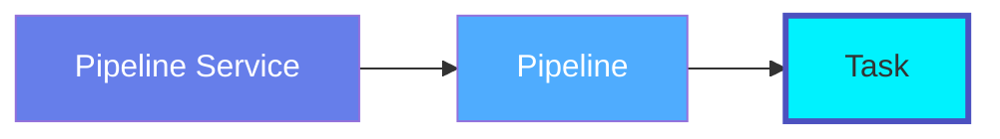

# Task

**Pipeline execution units - individual steps in data workflows**

---

## Overview

The **Task** entity represents individual units of work within a pipeline. Tasks are the atomic operations that perform specific actions like extracting data, transforming records, loading to destinations, or running quality checks.

**Hierarchy**:



---

## Schema Specifications

View the complete Task schema in your preferred format:

=== "JSON Schema"

    **Complete JSON Schema Definition**

    This schema is defined within the Pipeline schema at `definitions.task`:

    ```json
    {
      "task": {
        "type": "object",
        "javaType": "org.openmetadata.schema.type.Task",
        "properties": {
          "name": {
            "description": "Name that identifies this task instance uniquely.",
            "type": "string"
          },
          "displayName": {
            "description": "Display Name that identifies this Task. It could be title or label from the pipeline services.",
            "type": "string"
          },
          "fullyQualifiedName": {
            "description": "A unique name that identifies a pipeline in the format 'ServiceName.PipelineName.TaskName'.",
            "type": "string"
          },
          "description": {
            "description": "Description of this Task.",
            "$ref": "../../type/basic.json#/definitions/markdown"
          },
          "sourceUrl": {
            "description": "Task URL to visit/manage. This URL points to respective pipeline service UI.",
            "$ref": "../../type/basic.json#/definitions/sourceUrl"
          },
          "downstreamTasks": {
            "description": "All the tasks that are downstream of this task.",
            "type": "array",
            "items": {
              "type": "string"
            },
            "default": null
          },
          "taskType": {
            "description": "Type of the Task. Usually refers to the class it implements.",
            "type": "string"
          },
          "taskSQL": {
            "description": "SQL used in the task. Can be used to determine the lineage.",
            "$ref": "../../type/basic.json#/definitions/sqlQuery"
          },
          "startDate": {
            "description": "start date for the task.",
            "type": "string"
          },
          "endDate": {
            "description": "end date for the task.",
            "type": "string"
          },
          "tags": {
            "description": "Tags for this task.",
            "type": "array",
            "items": {
              "$ref": "../../type/tagLabel.json"
            },
            "default": []
          },
          "owners": {
            "description": "Owners of this task.",
            "$ref": "../../type/entityReferenceList.json"
          }
        },
        "required": ["name"],
        "additionalProperties": false
      }
    }
    ```

    **[View Full Pipeline Schema →](https://github.com/open-metadata/openmetadata-spec/blob/main/src/main/resources/json/schema/entity/data/pipeline.json)**

=== "RDF"

    **RDF/OWL Ontology Definition**

    ```turtle
    @prefix om: <https://open-metadata.org/schema/> .
    @prefix rdfs: <http://www.w3.org/2000/01/rdf-schema#> .
    @prefix owl: <http://www.w3.org/2002/07/owl#> .
    @prefix xsd: <http://www.w3.org/2001/XMLSchema#> .

    # Task Class Definition
    om:Task a owl:Class ;
        rdfs:subClassOf om:DataAsset ;
        rdfs:label "Task" ;
        rdfs:comment "A single unit of work within a pipeline workflow" ;
        om:hierarchyLevel 3 .

    # Properties
    om:taskName a owl:DatatypeProperty ;
        rdfs:domain om:Task ;
        rdfs:range xsd:string ;
        rdfs:label "name" ;
        rdfs:comment "Name that identifies this task instance uniquely" .

    om:displayName a owl:DatatypeProperty ;
        rdfs:domain om:Task ;
        rdfs:range xsd:string ;
        rdfs:label "displayName" ;
        rdfs:comment "Display name from the pipeline services" .

    om:fullyQualifiedName a owl:DatatypeProperty ;
        rdfs:domain om:Task ;
        rdfs:range xsd:string ;
        rdfs:label "fullyQualifiedName" ;
        rdfs:comment "Complete hierarchical name: service.pipeline.task" .

    om:description a owl:DatatypeProperty ;
        rdfs:domain om:Task ;
        rdfs:range xsd:string ;
        rdfs:label "description" ;
        rdfs:comment "Description of this task" .

    om:sourceUrl a owl:DatatypeProperty ;
        rdfs:domain om:Task ;
        rdfs:range xsd:anyURI ;
        rdfs:label "sourceUrl" ;
        rdfs:comment "Task URL to visit/manage in pipeline service UI" .

    om:taskType a owl:DatatypeProperty ;
        rdfs:domain om:Task ;
        rdfs:range xsd:string ;
        rdfs:label "taskType" ;
        rdfs:comment "Type of the task - usually refers to the class it implements" .

    om:taskSQL a owl:DatatypeProperty ;
        rdfs:domain om:Task ;
        rdfs:range xsd:string ;
        rdfs:label "taskSQL" ;
        rdfs:comment "SQL used in the task - can be used to determine lineage" .

    om:startDate a owl:DatatypeProperty ;
        rdfs:domain om:Task ;
        rdfs:range xsd:string ;
        rdfs:label "startDate" ;
        rdfs:comment "Start date for the task" .

    om:endDate a owl:DatatypeProperty ;
        rdfs:domain om:Task ;
        rdfs:range xsd:string ;
        rdfs:label "endDate" ;
        rdfs:comment "End date for the task" .

    om:hasDownstreamTask a owl:ObjectProperty ;
        rdfs:domain om:Task ;
        rdfs:range om:Task ;
        rdfs:label "hasDownstreamTask" ;
        rdfs:comment "All the tasks that are downstream of this task" .

    om:taskOwnedBy a owl:ObjectProperty ;
        rdfs:domain om:Task ;
        rdfs:range om:Owner ;
        rdfs:label "ownedBy" ;
        rdfs:comment "Owners of this task" .

    om:taskHasTag a owl:ObjectProperty ;
        rdfs:domain om:Task ;
        rdfs:range om:Tag ;
        rdfs:label "hasTag" ;
        rdfs:comment "Tags for this task" .

    # Example Instance
    ex:extractCustomersTask a om:Task ;
        om:taskName "extract_customers" ;
        om:fullyQualifiedName "airflow_prod.customer_etl.extract_customers" ;
        om:displayName "Extract Customers" ;
        om:description "Extracts customer records from MongoDB production cluster" ;
        om:taskType "Python" ;
        om:sourceUrl "https://airflow.company.com/dags/customer_etl/tasks/extract_customers"^^xsd:anyURI ;
        om:hasDownstreamTask ex:transformCustomersTask ;
        om:taskOwnedBy ex:dataEngTeam ;
        om:taskHasTag ex:tierGold .
    ```

    **[View Full RDF Ontology →](https://github.com/open-metadata/OpenMetadataStandards/blob/main/rdf/ontology/openmetadata.ttl)**

=== "JSON-LD"

    **JSON-LD Context and Example**

    ```json
    {
      "@context": {
        "@vocab": "https://open-metadata.org/schema/",
        "om": "https://open-metadata.org/schema/",
        "rdfs": "http://www.w3.org/2000/01/rdf-schema#",
        "xsd": "http://www.w3.org/2001/XMLSchema#",

        "Task": "om:Task",
        "name": {
          "@id": "om:taskName",
          "@type": "xsd:string"
        },
        "fullyQualifiedName": {
          "@id": "om:fullyQualifiedName",
          "@type": "xsd:string"
        },
        "displayName": {
          "@id": "om:displayName",
          "@type": "xsd:string"
        },
        "description": {
          "@id": "om:description",
          "@type": "xsd:string"
        },
        "sourceUrl": {
          "@id": "om:sourceUrl",
          "@type": "xsd:anyURI"
        },
        "taskType": {
          "@id": "om:taskType",
          "@type": "xsd:string"
        },
        "taskSQL": {
          "@id": "om:taskSQL",
          "@type": "xsd:string"
        },
        "startDate": {
          "@id": "om:startDate",
          "@type": "xsd:string"
        },
        "endDate": {
          "@id": "om:endDate",
          "@type": "xsd:string"
        },
        "downstreamTasks": {
          "@id": "om:hasDownstreamTask",
          "@type": "@id",
          "@container": "@set"
        },
        "owners": {
          "@id": "om:taskOwnedBy",
          "@type": "@id",
          "@container": "@set"
        },
        "tags": {
          "@id": "om:taskHasTag",
          "@type": "@id",
          "@container": "@set"
        }
      }
    }
    ```

    **Example JSON-LD Instance**:

    ```json
    {
      "@context": "https://open-metadata.org/context/task.jsonld",
      "@type": "Task",
      "@id": "https://example.com/pipelines/customer_etl/tasks/extract_customers",

      "name": "extract_customers",
      "fullyQualifiedName": "airflow_prod.customer_etl.extract_customers",
      "displayName": "Extract Customers from MongoDB",
      "description": "Extracts customer records from MongoDB and stages them for transformation",
      "taskType": "Python",
      "sourceUrl": "https://airflow.company.com/dags/customer_etl/tasks/extract_customers",

      "taskSQL": "SELECT * FROM customers WHERE status = 'active'",

      "startDate": "2024-01-01",
      "endDate": "2024-12-31",

      "downstreamTasks": [
        "transform_customers"
      ],

      "owners": [
        {
          "@id": "https://example.com/teams/data-engineering",
          "@type": "Team",
          "name": "data-engineering",
          "displayName": "Data Engineering"
        }
      ],

      "tags": [
        {
          "@id": "https://open-metadata.org/tags/Tier/Gold",
          "tagFQN": "Tier.Gold"
        },
        {
          "@id": "https://open-metadata.org/tags/Operation/Extract",
          "tagFQN": "Operation.Extract"
        }
      ]
    }
    ```

    **[View Full JSON-LD Context →](https://github.com/open-metadata/OpenMetadataStandards/blob/main/rdf/contexts/task.jsonld)**

---

## Use Cases

- Document individual pipeline task logic and dependencies
- Track task execution status and history
- Monitor task performance and duration
- Capture task-level lineage (tables/files read/written)
- Define task ownership and responsibilities
- Apply governance tags to sensitive operations
- Link tasks to business processes
- Audit data transformation steps

---

## JSON Schema Specification

### Core Properties

#### `name`
**Type**: `string`
**Required**: Yes
**Description**: Name that identifies this task instance uniquely

```json
{
  "name": "extract_customers"
}
```

---

#### `displayName`
**Type**: `string`
**Required**: No
**Description**: Display name that identifies this task. It could be title or label from the pipeline services.

```json
{
  "displayName": "Extract Customers from MongoDB"
}
```

---

#### `fullyQualifiedName`
**Type**: `string`
**Required**: No (system-generated)
**Description**: A unique name that identifies a pipeline in the format 'ServiceName.PipelineName.TaskName'

```json
{
  "fullyQualifiedName": "airflow_prod.customer_etl.extract_customers"
}
```

---

#### `description` (markdown)
**Type**: `string` (Markdown format)
**Required**: No
**Description**: Description of this task

```json
{
  "description": "# Extract Customers Task\n\nExtracts customer records from MongoDB production cluster.\n\n## Logic\n1. Connect to MongoDB `crm` database\n2. Query `customers` collection with filter for active customers\n3. Stage results in XCom for downstream processing"
}
```

---

### Task Configuration Properties

#### `sourceUrl`
**Type**: `string` (URI format - sourceUrl reference)
**Required**: No
**Description**: Task URL to visit/manage. This URL points to respective pipeline service UI.

```json
{
  "sourceUrl": "https://airflow.company.com/dags/customer_etl/tasks/extract_customers"
}
```

---

#### `taskType`
**Type**: `string`
**Required**: No
**Description**: Type of the task. Usually refers to the class it implements.

```json
{
  "taskType": "PythonOperator"
}
```

---

#### `taskSQL` (sqlQuery)
**Type**: `string`
**Required**: No
**Description**: SQL used in the task. Can be used to determine the lineage.

```json
{
  "taskSQL": "SELECT \n  customer_id,\n  email,\n  first_name,\n  last_name,\n  created_at\nFROM raw_customers\nWHERE status = 'active'\n  AND updated_at >= CURRENT_DATE - INTERVAL '1 day'"
}
```

---

### Dependency Properties

#### `downstreamTasks[]`
**Type**: `array` of strings
**Required**: No
**Default**: null
**Description**: All the tasks that are downstream of this task

```json
{
  "downstreamTasks": ["transform_customers", "data_quality_check"]
}
```

---

### Timing Properties

#### `startDate`
**Type**: `string`
**Required**: No
**Description**: Start date for the task

```json
{
  "startDate": "2024-01-01"
}
```

---

#### `endDate`
**Type**: `string`
**Required**: No
**Description**: End date for the task

```json
{
  "endDate": "2024-12-31"
}
```

---

### Governance Properties

#### `owners` (EntityReferenceList)
**Type**: `EntityReferenceList`
**Required**: No
**Description**: Owners of this task

```json
{
  "owners": [
    {
      "id": "8f9a0b1c-2d3e-4f5a-6b7c-8d9e0f1a2b3c",
      "type": "team",
      "name": "data-engineering",
      "displayName": "Data Engineering Team"
    }
  ]
}
```

---

#### `tags[]` (TagLabel[])
**Type**: `array`
**Required**: No
**Default**: []
**Description**: Tags for this task

```json
{
  "tags": [
    {
      "tagFQN": "Tier.Gold",
      "description": "Critical task",
      "source": "Classification",
      "labelType": "Manual",
      "state": "Confirmed"
    },
    {
      "tagFQN": "Operation.Extract",
      "source": "Classification",
      "labelType": "Automated",
      "state": "Confirmed"
    }
  ]
}
```

---

## Complete Example

```json
{
  "name": "extract_customers",
  "displayName": "Extract Customers from MongoDB",
  "fullyQualifiedName": "airflow_prod.customer_etl.extract_customers",
  "description": "# Extract Customers Task\n\nExtracts customer records from MongoDB production cluster.",
  "sourceUrl": "https://airflow.company.com/dags/customer_etl/tasks/extract_customers",
  "taskType": "PythonOperator",
  "taskSQL": "SELECT customer_id, email, first_name, last_name FROM customers WHERE status = 'active'",
  "downstreamTasks": ["transform_customers", "data_quality_check"],
  "startDate": "2024-01-01",
  "endDate": "2024-12-31",
  "owners": [
    {
      "id": "8f9a0b1c-2d3e-4f5a-6b7c-8d9e0f1a2b3c",
      "type": "team",
      "name": "data-engineering",
      "displayName": "Data Engineering Team"
    }
  ],
  "tags": [
    {"tagFQN": "Tier.Gold"},
    {"tagFQN": "Operation.Extract"}
  ]
}
```

---

## RDF Representation

### Ontology Class

```turtle
@prefix om: <https://open-metadata.org/schema/> .
@prefix rdfs: <http://www.w3.org/2000/01/rdf-schema#> .
@prefix owl: <http://www.w3.org/2002/07/owl#> .

om:Task a owl:Class ;
    rdfs:subClassOf om:DataAsset ;
    rdfs:label "Task" ;
    rdfs:comment "A single unit of work within a pipeline workflow" ;
    om:hasProperties [
        om:name "string" ;
        om:displayName "string" ;
        om:fullyQualifiedName "string" ;
        om:description "string" ;
        om:sourceUrl "anyURI" ;
        om:taskType "string" ;
        om:taskSQL "string" ;
        om:startDate "string" ;
        om:endDate "string" ;
        om:downstreamTasks "string[]" ;
        om:owners "EntityReferenceList" ;
        om:tags "TagLabel[]" ;
    ] .
```

### Instance Example

```turtle
@prefix om: <https://open-metadata.org/schema/> .
@prefix ex: <https://example.com/pipelines/> .
@prefix xsd: <http://www.w3.org/2001/XMLSchema#> .

ex:extract_customers a om:Task ;
    om:taskName "extract_customers" ;
    om:fullyQualifiedName "airflow_prod.customer_etl.extract_customers" ;
    om:displayName "Extract Customers from MongoDB" ;
    om:description "Extracts customer records from MongoDB" ;
    om:sourceUrl "https://airflow.company.com/dags/customer_etl/tasks/extract_customers"^^xsd:anyURI ;
    om:taskType "PythonOperator" ;
    om:taskSQL "SELECT * FROM customers WHERE status = 'active'" ;
    om:startDate "2024-01-01" ;
    om:endDate "2024-12-31" ;
    om:hasDownstreamTask ex:transform_customers ;
    om:taskOwnedBy ex:data_engineering_team ;
    om:taskHasTag ex:tier_gold ;
    om:taskHasTag ex:operation_extract .
```

---

## JSON-LD Context

```json
{
  "@context": {
    "@vocab": "https://open-metadata.org/schema/",
    "om": "https://open-metadata.org/schema/",
    "rdfs": "http://www.w3.org/2000/01/rdf-schema#",
    "xsd": "http://www.w3.org/2001/XMLSchema#",
    "Task": "om:Task",
    "name": "om:taskName",
    "fullyQualifiedName": "om:fullyQualifiedName",
    "displayName": "om:displayName",
    "description": "om:description",
    "sourceUrl": {
      "@id": "om:sourceUrl",
      "@type": "xsd:anyURI"
    },
    "taskType": "om:taskType",
    "taskSQL": "om:taskSQL",
    "startDate": "om:startDate",
    "endDate": "om:endDate",
    "downstreamTasks": {
      "@id": "om:hasDownstreamTask",
      "@type": "@id",
      "@container": "@set"
    },
    "owners": {
      "@id": "om:taskOwnedBy",
      "@type": "@id",
      "@container": "@set"
    },
    "tags": {
      "@id": "om:taskHasTag",
      "@type": "@id",
      "@container": "@set"
    }
  }
}
```

### JSON-LD Example

```json
{
  "@context": "https://open-metadata.org/context/task.jsonld",
  "@type": "Task",
  "@id": "https://example.com/pipelines/customer_etl/tasks/extract_customers",
  "name": "extract_customers",
  "fullyQualifiedName": "airflow_prod.customer_etl.extract_customers",
  "displayName": "Extract Customers from MongoDB",
  "description": "Extracts customer records from MongoDB",
  "sourceUrl": "https://airflow.company.com/dags/customer_etl/tasks/extract_customers",
  "taskType": "PythonOperator",
  "taskSQL": "SELECT * FROM customers WHERE status = 'active'",
  "startDate": "2024-01-01",
  "endDate": "2024-12-31",
  "downstreamTasks": ["transform_customers"],
  "owners": [
    {
      "@id": "https://example.com/teams/data-engineering",
      "@type": "Team",
      "name": "data-engineering"
    }
  ],
  "tags": [
    {"@id": "https://open-metadata.org/tags/Tier/Gold"}
  ]
}
```

---

## Relationships

Task has comprehensive relationships with entities across the metadata platform:

```mermaid
graph TD
    subgraph Hierarchy
        SVC[PipelineService<br/>airflow_prod]
        PIPE[Pipeline<br/>customer_etl]
        SVC --> PIPE
        PIPE --> TASK[Task<br/>transform_customers]
    end

    subgraph Task Dependencies
        TASK1[Task<br/>extract_customers] -->|upstream| TASK
        TASK -->|downstream| TASK2[Task<br/>load_customers]
        TASK -->|downstream| TASK3[Task<br/>data_quality_check]
    end

    subgraph Data Sources
        SRC1[Table<br/>raw_customers] -.->|reads from| TASK
        SRC2[Table<br/>customer_enrichment] -.->|joins| TASK
    end

    subgraph Data Targets
        TASK -.->|writes to| TGT1[Table<br/>transformed_customers]
        TASK -.->|creates| TGT2[Table<br/>customer_metrics]
    end

    subgraph Ownership
        TASK -.->|owned by| TEAM[Team<br/>Data Engineering]
        TASK -.->|owned by| USER[User<br/>pipeline.dev]
    end

    subgraph Governance
        TASK -.->|in domain| DOM[Domain<br/>Customer Data]
        TASK -.->|tagged| TAG1[Tag<br/>Transformation]
        TASK -.->|tagged| TAG2[Tag<br/>Critical]
        TASK -.->|linked to| GT[GlossaryTerm<br/>Data Transformation]
    end

    subgraph Quality
        TC1[TestCase<br/>output_schema_check] -.->|validates| TGT1
        TC2[TestCase<br/>row_count_validation] -.->|monitors| TASK
        TC3[TestCase<br/>data_quality_check] -.->|tests| TGT1
    end

    subgraph Execution
        STATUS[Status<br/>Success] -.->|tracks| TASK
        LOG[Logs<br/>execution_logs] -.->|records| TASK
        METRIC[Metrics<br/>duration: 45s] -.->|measures| TASK
    end

    subgraph Code
        REPO[Repository<br/>github.com/pipelines] -.->|source code| TASK
        CONFIG[Config<br/>transform_config.yaml] -.->|configures| TASK
        SQL[SQL<br/>transformation.sql] -.->|defines logic| TASK
    end

    style SVC fill:#667eea,color:#fff
    style PIPE fill:#4facfe,color:#fff
    style TASK fill:#00f2fe,color:#333,stroke:#4c51bf,stroke-width:3px
    style TASK1 fill:#00f2fe,color:#333
    style TASK2 fill:#00f2fe,color:#333
    style TASK3 fill:#00f2fe,color:#333
    style SRC1 fill:#764ba2,color:#fff
    style SRC2 fill:#764ba2,color:#fff
    style TGT1 fill:#764ba2,color:#fff
    style TGT2 fill:#764ba2,color:#fff
    style TEAM fill:#43e97b,color:#fff
    style USER fill:#43e97b,color:#fff
    style DOM fill:#fa709a,color:#fff
    style TAG1 fill:#f093fb,color:#fff
    style TAG2 fill:#f093fb,color:#fff
    style GT fill:#ffd700,color:#333
    style TC1 fill:#9b59b6,color:#fff
    style TC2 fill:#9b59b6,color:#fff
    style TC3 fill:#9b59b6,color:#fff
    style STATUS fill:#00ac69,color:#fff
    style LOG fill:#00ac69,color:#fff
    style METRIC fill:#00ac69,color:#fff
    style REPO fill:#f5576c,color:#fff
    style CONFIG fill:#f5576c,color:#fff
    style SQL fill:#f5576c,color:#fff
```



**Relationship Types**:

- **Solid lines (→)**: Hierarchical containment and task dependencies (Service → Pipeline → Task, Task → Task)
- **Dashed lines (-.->)**: References and associations (ownership, governance, lineage)

### Parent Entities
- **Pipeline**: The pipeline containing this task
- **PipelineService**: The service hosting the parent pipeline

### Child Entities
- None (leaf node in hierarchy)

### Associated Entities
- **Owner**: User or team owning this task
- **Domain**: Business domain assignment
- **Tag**: Classification tags
- **GlossaryTerm**: Business terminology
- **Table**: Source tables (reads) and target tables (writes)
- **Task**: Upstream and downstream task dependencies within the same pipeline
- **TestCase**: Output validation, data quality, and schema compliance tests
- **Repository**: Source code repository
- **Config**: Configuration files

---

## Custom Properties

This entity supports custom properties through the `extension` field.
Common custom properties include:

- **Data Classification**: Sensitivity level
- **Cost Center**: Billing allocation
- **Retention Period**: Data retention requirements
- **Application Owner**: Owning application/team

See [Custom Properties](../../metadata-specifications/custom-properties.md)
for details on defining and using custom properties.

---

## API Operations

### Create Task

```http
POST /api/v1/pipelines/{pipelineId}/tasks
Content-Type: application/json

{
  "name": "extract_customers",
  "taskType": "Python",
  "downstreamTasks": ["transform_customers"]
}
```

### Get Task

```http
GET /api/v1/pipelines/{pipelineId}/tasks/name/extract_customers?fields=tags,owner,lineage
```

### Update Task

```http
PATCH /api/v1/pipelines/{pipelineId}/tasks/{taskId}
Content-Type: application/json-patch+json

[
  {
    "op": "replace",
    "path": "/taskCode",
    "value": "# Updated Python code"
  }
]
```

### Get Task Status

```http
GET /api/v1/pipelines/{pipelineId}/tasks/{taskId}/status
```

### Get Task Lineage

```http
GET /api/v1/pipelines/{pipelineId}/tasks/{taskId}/lineage
```

---

## Related Documentation

- **[Pipeline Service](pipeline-service.md)** - Service configuration
- **[Pipeline](pipeline.md)** - Pipeline specification
- **[Lineage](../../lineage/overview.md)** - Task-level lineage tracking
- **[Data Quality](../../data-quality/overview.md)** - Testing task outputs
