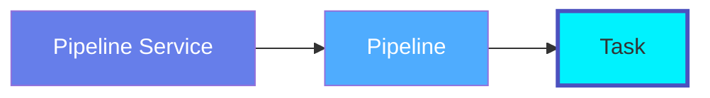

# Task

**Pipeline execution units - individual steps in data workflows**

---

## Overview

The **Task** entity represents individual units of work within a pipeline. Tasks are the atomic operations that perform specific actions like extracting data, transforming records, loading to destinations, or running quality checks.

**Hierarchy**:



---

## Schema Specifications

View the complete Task schema in your preferred format:

=== "JSON Schema"

    **Complete JSON Schema Definition**

    ```json
    {
      "$id": "https://open-metadata.org/schema/entity/data/task.json",
      "$schema": "http://json-schema.org/draft-07/schema#",
      "title": "Task",
      "description": "A `Task` entity represents a single unit of work within a pipeline workflow.",
      "type": "object",
      "javaType": "org.openmetadata.schema.entity.data.Task",

      "definitions": {
        "taskType": {
          "description": "Type of task operation",
          "type": "string",
          "enum": [
            "SQL", "Python", "Bash", "Spark", "DBT",
            "Custom", "Airflow", "Glue", "Lambda",
            "DataQuality", "Sensor", "BranchOperator"
          ]
        },
        "taskStatus": {
          "description": "Task execution status",
          "type": "string",
          "enum": [
            "Successful", "Failed", "Pending", "Running",
            "Stopped", "Skipped", "UpForRetry", "Queued",
            "Upstream_Failed"
          ]
        }
      },

      "properties": {
        "id": {
          "description": "Unique identifier",
          "$ref": "../../type/basic.json#/definitions/uuid"
        },
        "name": {
          "description": "Task name",
          "$ref": "../../type/basic.json#/definitions/entityName"
        },
        "fullyQualifiedName": {
          "description": "Fully qualified name: service.pipeline.task",
          "$ref": "../../type/basic.json#/definitions/fullyQualifiedEntityName"
        },
        "displayName": {
          "description": "Display name",
          "type": "string"
        },
        "description": {
          "description": "Markdown description",
          "$ref": "../../type/basic.json#/definitions/markdown"
        },
        "taskType": {
          "$ref": "#/definitions/taskType"
        },
        "taskUrl": {
          "description": "URL to task in orchestration tool",
          "type": "string",
          "format": "uri"
        },
        "sourceUrl": {
          "description": "URL to task source code",
          "type": "string",
          "format": "uri"
        },
        "taskStatus": {
          "$ref": "#/definitions/taskStatus"
        },
        "downstreamTasks": {
          "description": "Tasks that depend on this task",
          "type": "array",
          "items": {
            "type": "string"
          }
        },
        "upstreamTasks": {
          "description": "Tasks this task depends on",
          "type": "array",
          "items": {
            "type": "string"
          }
        },
        "taskSQL": {
          "description": "SQL query for SQL tasks",
          "type": "string"
        },
        "taskCode": {
          "description": "Code for Python/Bash tasks",
          "type": "string"
        },
        "startDate": {
          "description": "Task start date",
          "type": "string",
          "format": "date-time"
        },
        "endDate": {
          "description": "Task end date",
          "type": "string",
          "format": "date-time"
        },
        "pipeline": {
          "description": "Parent pipeline",
          "$ref": "../../type/entityReference.json"
        },
        "owner": {
          "description": "Owner (user or team)",
          "$ref": "../../type/entityReference.json"
        },
        "tags": {
          "description": "Classification tags",
          "type": "array",
          "items": {
            "$ref": "../../type/tagLabel.json"
          }
        },
        "glossaryTerms": {
          "description": "Business glossary terms",
          "type": "array",
          "items": {
            "$ref": "../../type/entityReference.json"
          }
        },
        "version": {
          "description": "Metadata version",
          "$ref": "../../type/entityHistory.json#/definitions/entityVersion"
        }
      },

      "required": ["id", "name", "pipeline"]
    }
    ```

    **[View Full JSON Schema →](https://github.com/open-metadata/OpenMetadataStandards/blob/main/schemas/entity/data/task.json)**

=== "RDF"

    **RDF/OWL Ontology Definition**

    ```turtle
    @prefix om: <https://open-metadata.org/schema/> .
    @prefix rdfs: <http://www.w3.org/2000/01/rdf-schema#> .
    @prefix owl: <http://www.w3.org/2001/XMLSchema#> .
    @prefix xsd: <http://www.w3.org/2001/XMLSchema#> .

    # Task Class Definition
    om:Task a owl:Class ;
        rdfs:subClassOf om:DataAsset ;
        rdfs:label "Task" ;
        rdfs:comment "A single unit of work within a pipeline workflow" ;
        om:hierarchyLevel 3 .

    # Properties
    om:taskName a owl:DatatypeProperty ;
        rdfs:domain om:Task ;
        rdfs:range xsd:string ;
        rdfs:label "name" ;
        rdfs:comment "Name of the task" .

    om:fullyQualifiedName a owl:DatatypeProperty ;
        rdfs:domain om:Task ;
        rdfs:range xsd:string ;
        rdfs:label "fullyQualifiedName" ;
        rdfs:comment "Complete hierarchical name: service.pipeline.task" .

    om:taskType a owl:DatatypeProperty ;
        rdfs:domain om:Task ;
        rdfs:range om:TaskType ;
        rdfs:label "taskType" ;
        rdfs:comment "Type of task: SQL, Python, Bash, etc." .

    om:taskStatus a owl:DatatypeProperty ;
        rdfs:domain om:Task ;
        rdfs:range om:TaskStatus ;
        rdfs:label "taskStatus" ;
        rdfs:comment "Current execution status" .

    om:taskUrl a owl:DatatypeProperty ;
        rdfs:domain om:Task ;
        rdfs:range xsd:anyURI ;
        rdfs:label "taskUrl" ;
        rdfs:comment "URL to task in orchestration tool" .

    om:taskSQL a owl:DatatypeProperty ;
        rdfs:domain om:Task ;
        rdfs:range xsd:string ;
        rdfs:label "taskSQL" ;
        rdfs:comment "SQL query executed by this task" .

    om:taskCode a owl:DatatypeProperty ;
        rdfs:domain om:Task ;
        rdfs:range xsd:string ;
        rdfs:label "taskCode" ;
        rdfs:comment "Python/Bash code executed by this task" .

    om:belongsToPipeline a owl:ObjectProperty ;
        rdfs:domain om:Task ;
        rdfs:range om:Pipeline ;
        rdfs:label "belongsToPipeline" ;
        rdfs:comment "Parent pipeline containing this task" .

    om:hasDownstreamTask a owl:ObjectProperty ;
        rdfs:domain om:Task ;
        rdfs:range om:Task ;
        rdfs:label "hasDownstreamTask" ;
        rdfs:comment "Tasks that depend on this task" .

    om:hasUpstreamTask a owl:ObjectProperty ;
        rdfs:domain om:Task ;
        rdfs:range om:Task ;
        rdfs:label "hasUpstreamTask" ;
        rdfs:comment "Tasks this task depends on" .

    om:taskOwnedBy a owl:ObjectProperty ;
        rdfs:domain om:Task ;
        rdfs:range om:Owner ;
        rdfs:label "ownedBy" ;
        rdfs:comment "User or team that owns this task" .

    om:taskHasTag a owl:ObjectProperty ;
        rdfs:domain om:Task ;
        rdfs:range om:Tag ;
        rdfs:label "hasTag" ;
        rdfs:comment "Classification tags applied to task" .

    # Task Type Enumeration
    om:TaskType a owl:Class ;
        owl:oneOf (
            om:SQL
            om:Python
            om:Bash
            om:Spark
            om:DBT
            om:Custom
        ) .

    # Task Status Enumeration
    om:TaskStatus a owl:Class ;
        owl:oneOf (
            om:Successful
            om:Failed
            om:Pending
            om:Running
            om:Stopped
        ) .

    # Example Instance
    ex:extractCustomersTask a om:Task ;
        om:taskName "extract_customers" ;
        om:fullyQualifiedName "airflow_prod.customer_etl.extract_customers" ;
        om:displayName "Extract Customers" ;
        om:taskType om:Python ;
        om:taskStatus om:Successful ;
        om:belongsToPipeline ex:customerEtlPipeline ;
        om:hasDownstreamTask ex:transformCustomersTask ;
        om:taskOwnedBy ex:dataEngTeam ;
        om:taskHasTag ex:tierGold .
    ```

    **[View Full RDF Ontology →](https://github.com/open-metadata/OpenMetadataStandards/blob/main/rdf/ontology/openmetadata.ttl)**

=== "JSON-LD"

    **JSON-LD Context and Example**

    ```json
    {
      "@context": {
        "@vocab": "https://open-metadata.org/schema/",
        "om": "https://open-metadata.org/schema/",
        "rdfs": "http://www.w3.org/2000/01/rdf-schema#",
        "xsd": "http://www.w3.org/2001/XMLSchema#",

        "Task": "om:Task",
        "name": {
          "@id": "om:taskName",
          "@type": "xsd:string"
        },
        "fullyQualifiedName": {
          "@id": "om:fullyQualifiedName",
          "@type": "xsd:string"
        },
        "displayName": {
          "@id": "om:displayName",
          "@type": "xsd:string"
        },
        "description": {
          "@id": "om:description",
          "@type": "xsd:string"
        },
        "taskType": {
          "@id": "om:taskType",
          "@type": "@vocab"
        },
        "taskStatus": {
          "@id": "om:taskStatus",
          "@type": "@vocab"
        },
        "taskUrl": {
          "@id": "om:taskUrl",
          "@type": "xsd:anyURI"
        },
        "taskSQL": {
          "@id": "om:taskSQL",
          "@type": "xsd:string"
        },
        "taskCode": {
          "@id": "om:taskCode",
          "@type": "xsd:string"
        },
        "downstreamTasks": {
          "@id": "om:hasDownstreamTask",
          "@type": "@id",
          "@container": "@set"
        },
        "upstreamTasks": {
          "@id": "om:hasUpstreamTask",
          "@type": "@id",
          "@container": "@set"
        },
        "pipeline": {
          "@id": "om:belongsToPipeline",
          "@type": "@id"
        },
        "owner": {
          "@id": "om:taskOwnedBy",
          "@type": "@id"
        },
        "tags": {
          "@id": "om:taskHasTag",
          "@type": "@id",
          "@container": "@set"
        },
        "glossaryTerms": {
          "@id": "om:taskLinkedToGlossaryTerm",
          "@type": "@id",
          "@container": "@set"
        }
      }
    }
    ```

    **Example JSON-LD Instance**:

    ```json
    {
      "@context": "https://open-metadata.org/context/task.jsonld",
      "@type": "Task",
      "@id": "https://example.com/pipelines/customer_etl/tasks/extract_customers",

      "name": "extract_customers",
      "fullyQualifiedName": "airflow_prod.customer_etl.extract_customers",
      "displayName": "Extract Customers from MongoDB",
      "description": "Extracts customer records from MongoDB and stages them for transformation",
      "taskType": "Python",
      "taskStatus": "Successful",
      "taskUrl": "https://airflow.company.com/dags/customer_etl/tasks/extract_customers",

      "taskCode": "from airflow.providers.mongo.hooks.mongo import MongoHook\n\ndef extract_customers(**context):\n    hook = MongoHook(conn_id='mongodb_prod')\n    customers = hook.find('crm', 'customers', {})\n    return list(customers)",

      "pipeline": {
        "@id": "https://example.com/pipelines/customer_etl",
        "@type": "Pipeline",
        "name": "customer_etl"
      },

      "downstreamTasks": [
        "transform_customers"
      ],

      "owner": {
        "@id": "https://example.com/teams/data-engineering",
        "@type": "Team",
        "name": "data-engineering",
        "displayName": "Data Engineering"
      },

      "tags": [
        {
          "@id": "https://open-metadata.org/tags/Tier/Gold",
          "tagFQN": "Tier.Gold"
        },
        {
          "@id": "https://open-metadata.org/tags/Operation/Extract",
          "tagFQN": "Operation.Extract"
        }
      ],

      "glossaryTerms": [
        {
          "@id": "https://example.com/glossary/DataExtraction",
          "@type": "GlossaryTerm",
          "fullyQualifiedName": "BusinessGlossary.DataExtraction"
        }
      ]
    }
    ```

    **[View Full JSON-LD Context →](https://github.com/open-metadata/OpenMetadataStandards/blob/main/rdf/contexts/task.jsonld)**

---

## Use Cases

- Document individual pipeline task logic and dependencies
- Track task execution status and history
- Monitor task performance and duration
- Capture task-level lineage (tables/files read/written)
- Define task ownership and responsibilities
- Apply governance tags to sensitive operations
- Link tasks to business processes
- Audit data transformation steps

---

## JSON Schema Specification

### Core Properties

#### `id` (uuid)
**Type**: `string` (UUID format)
**Required**: Yes (system-generated)
**Description**: Unique identifier for this task instance

```json
{
  "id": "3a4b5c6d-7e8f-9a0b-1c2d-3e4f5a6b7c8d"
}
```

---

#### `name` (entityName)
**Type**: `string`
**Required**: Yes
**Pattern**: `^[^.]*$` (no dots allowed)
**Min Length**: 1
**Max Length**: 256
**Description**: Name of the task (unqualified)

```json
{
  "name": "extract_customers"
}
```

---

#### `fullyQualifiedName` (fullyQualifiedEntityName)
**Type**: `string`
**Required**: Yes (system-generated)
**Pattern**: `^((?!::).)*$`
**Description**: Fully qualified name in the format `service.pipeline.task`

```json
{
  "fullyQualifiedName": "airflow_prod.customer_etl.extract_customers"
}
```

---

#### `displayName`
**Type**: `string`
**Required**: No
**Description**: Human-readable display name

```json
{
  "displayName": "Extract Customers from MongoDB"
}
```

---

#### `description` (markdown)
**Type**: `string` (Markdown format)
**Required**: No
**Description**: Rich text description of the task's purpose and logic

```json
{
  "description": "# Extract Customers Task\n\nExtracts customer records from MongoDB production cluster.\n\n## Logic\n1. Connect to MongoDB `crm` database\n2. Query `customers` collection with filter for active customers\n3. Stage results in XCom for downstream processing\n\n## Average Duration\n- 5-10 minutes for full extract"
}
```

---

### Task Configuration Properties

#### `taskType` (TaskType enum)
**Type**: `string` enum
**Required**: No
**Allowed Values**:

- `SQL` - SQL query execution
- `Python` - Python script/function
- `Bash` - Shell script
- `Spark` - Spark job
- `DBT` - dbt model run
- `Custom` - Custom operator
- `Airflow` - Airflow-specific operator
- `Glue` - AWS Glue job
- `Lambda` - AWS Lambda function
- `DataQuality` - Data quality check
- `Sensor` - Waiting/sensing task
- `BranchOperator` - Conditional branching

```json
{
  "taskType": "Python"
}
```

---

#### `taskStatus` (TaskStatus enum)
**Type**: `string` enum
**Required**: No (system-populated from latest run)
**Allowed Values**:

- `Successful` - Last run completed successfully
- `Failed` - Last run failed
- `Pending` - Waiting to start
- `Running` - Currently executing
- `Stopped` - Manually stopped
- `Skipped` - Skipped execution
- `UpForRetry` - Failed, waiting for retry
- `Queued` - In execution queue
- `Upstream_Failed` - Upstream task failed

```json
{
  "taskStatus": "Successful"
}
```

---

#### `taskUrl` (URI)
**Type**: `string` (URI format)
**Required**: No
**Description**: URL to view task in orchestration tool

```json
{
  "taskUrl": "https://airflow.company.com/dags/customer_etl/tasks/extract_customers"
}
```

---

#### `sourceUrl` (URI)
**Type**: `string` (URI format)
**Required**: No
**Description**: URL to task source code repository

```json
{
  "sourceUrl": "https://github.com/company/pipelines/blob/main/tasks/extract_customers.py"
}
```

---

#### `taskSQL` (string)
**Type**: `string`
**Required**: No (required for SQL tasks)
**Description**: SQL query executed by this task

```json
{
  "taskSQL": "SELECT \n  customer_id,\n  email,\n  first_name,\n  last_name,\n  created_at\nFROM raw_customers\nWHERE status = 'active'\n  AND updated_at >= CURRENT_DATE - INTERVAL '1 day'"
}
```

---

#### `taskCode` (string)
**Type**: `string`
**Required**: No (for Python/Bash tasks)
**Description**: Python or Bash code executed by this task

```json
{
  "taskCode": "from airflow.providers.mongo.hooks.mongo import MongoHook\n\ndef extract_customers(**context):\n    hook = MongoHook(conn_id='mongodb_prod')\n    customers = hook.find('crm', 'customers', {'status': 'active'})\n    return list(customers)"
}
```

---

### Dependency Properties

#### `upstreamTasks[]` (string[])
**Type**: `array` of strings
**Required**: No
**Description**: List of task names this task depends on

```json
{
  "upstreamTasks": ["check_mongodb_connection", "validate_schema"]
}
```

---

#### `downstreamTasks[]` (string[])
**Type**: `array` of strings
**Required**: No
**Description**: List of task names that depend on this task

```json
{
  "downstreamTasks": ["transform_customers", "data_quality_check"]
}
```

---

### Timing Properties

#### `startDate` (timestamp)
**Type**: `string` (ISO 8601 date-time)
**Required**: No
**Description**: Task creation or first run date

```json
{
  "startDate": "2024-01-01T00:00:00Z"
}
```

---

#### `endDate` (timestamp)
**Type**: `string` (ISO 8601 date-time)
**Required**: No
**Description**: Task deprecation or end date

```json
{
  "endDate": "2024-12-31T23:59:59Z"
}
```

---

### Location Properties

#### `pipeline` (EntityReference)
**Type**: `object`
**Required**: Yes
**Description**: Reference to parent pipeline

```json
{
  "pipeline": {
    "id": "2a3b4c5d-6e7f-8a9b-0c1d-2e3f4a5b6c7d",
    "type": "pipeline",
    "name": "customer_etl",
    "fullyQualifiedName": "airflow_prod.customer_etl"
  }
}
```

---

### Governance Properties

#### `owner` (EntityReference)
**Type**: `object`
**Required**: No
**Description**: User or team that owns this task

```json
{
  "owner": {
    "id": "8f9a0b1c-2d3e-4f5a-6b7c-8d9e0f1a2b3c",
    "type": "team",
    "name": "data-engineering",
    "displayName": "Data Engineering Team"
  }
}
```

---

#### `tags[]` (TagLabel[])
**Type**: `array`
**Required**: No
**Description**: Classification tags applied to the task

```json
{
  "tags": [
    {
      "tagFQN": "Tier.Gold",
      "description": "Critical task",
      "source": "Classification",
      "labelType": "Manual",
      "state": "Confirmed"
    },
    {
      "tagFQN": "Operation.Extract",
      "source": "Classification",
      "labelType": "Automated",
      "state": "Confirmed"
    }
  ]
}
```

---

#### `glossaryTerms[]` (GlossaryTerm[])
**Type**: `array`
**Required**: No
**Description**: Business glossary terms linked to this task

```json
{
  "glossaryTerms": [
    {
      "fullyQualifiedName": "BusinessGlossary.DataExtraction"
    }
  ]
}
```

---

### Lineage Properties

#### `upstream` (EntityLineage)
**Type**: `array`
**Required**: No (system-populated)
**Description**: Upstream data assets (tables, files, etc.) read by this task

```json
{
  "upstream": [
    {
      "id": "source-table-uuid",
      "type": "table",
      "name": "customers",
      "fullyQualifiedName": "mongodb_prod.crm.customers"
    }
  ]
}
```

---

#### `downstream` (EntityLineage)
**Type**: `array`
**Required**: No (system-populated)
**Description**: Downstream data assets written by this task

```json
{
  "downstream": [
    {
      "id": "staging-table-uuid",
      "type": "table",
      "name": "stg_customers",
      "fullyQualifiedName": "postgres_prod.staging.stg_customers"
    }
  ]
}
```

---

### Versioning Properties

#### `version` (entityVersion)
**Type**: `number`
**Required**: Yes (system-managed)
**Description**: Metadata version number, incremented on changes

```json
{
  "version": 2.5
}
```

---

#### `updatedAt` (timestamp)
**Type**: `integer` (Unix epoch milliseconds)
**Required**: Yes (system-managed)
**Description**: Last update timestamp

```json
{
  "updatedAt": 1704240000000
}
```

---

#### `updatedBy` (string)
**Type**: `string`
**Required**: Yes (system-managed)
**Description**: User who made the update

```json
{
  "updatedBy": "john.doe"
}
```

---

#### `changeDescription` (ChangeDescription)
**Type**: `object`
**Required**: No
**Description**: Details of what changed in this version

```json
{
  "changeDescription": {
    "fieldsAdded": [],
    "fieldsUpdated": [
      {
        "name": "taskCode",
        "oldValue": "# Old extraction logic",
        "newValue": "# Updated extraction logic with better error handling"
      }
    ],
    "fieldsDeleted": [],
    "previousVersion": 2.4
  }
}
```

---

## Complete Example

```json
{
  "id": "3a4b5c6d-7e8f-9a0b-1c2d-3e4f5a6b7c8d",
  "name": "extract_customers",
  "fullyQualifiedName": "airflow_prod.customer_etl.extract_customers",
  "displayName": "Extract Customers from MongoDB",
  "description": "# Extract Customers Task\n\nExtracts customer records from MongoDB production cluster.",
  "taskType": "Python",
  "taskStatus": "Successful",
  "taskUrl": "https://airflow.company.com/dags/customer_etl/tasks/extract_customers",
  "sourceUrl": "https://github.com/company/pipelines/blob/main/tasks/extract_customers.py",
  "taskCode": "from airflow.providers.mongo.hooks.mongo import MongoHook\n\ndef extract_customers(**context):\n    hook = MongoHook(conn_id='mongodb_prod')\n    customers = hook.find('crm', 'customers', {'status': 'active'})\n    return list(customers)",
  "upstreamTasks": ["check_mongodb_connection"],
  "downstreamTasks": ["transform_customers", "data_quality_check"],
  "startDate": "2024-01-01T00:00:00Z",
  "pipeline": {
    "id": "2a3b4c5d-6e7f-8a9b-0c1d-2e3f4a5b6c7d",
    "type": "pipeline",
    "name": "customer_etl",
    "fullyQualifiedName": "airflow_prod.customer_etl"
  },
  "owner": {
    "id": "8f9a0b1c-2d3e-4f5a-6b7c-8d9e0f1a2b3c",
    "type": "team",
    "name": "data-engineering",
    "displayName": "Data Engineering Team"
  },
  "tags": [
    {"tagFQN": "Tier.Gold"},
    {"tagFQN": "Operation.Extract"}
  ],
  "glossaryTerms": [
    {"fullyQualifiedName": "BusinessGlossary.DataExtraction"}
  ],
  "version": 2.5,
  "updatedAt": 1704240000000,
  "updatedBy": "john.doe"
}
```

---

## RDF Representation

### Ontology Class

```turtle
@prefix om: <https://open-metadata.org/schema/> .
@prefix rdfs: <http://www.w3.org/2000/01/rdf-schema#> .
@prefix owl: <http://www.w3.org/2001/XMLSchema#> .

om:Task a owl:Class ;
    rdfs:subClassOf om:DataAsset ;
    rdfs:label "Task" ;
    rdfs:comment "A single unit of work within a pipeline workflow" ;
    om:hasProperties [
        om:name "string" ;
        om:taskType "TaskType" ;
        om:taskStatus "TaskStatus" ;
        om:pipeline "Pipeline" ;
        om:downstreamTasks "Task[]" ;
        om:upstreamTasks "Task[]" ;
        om:owner "Owner" ;
        om:tags "Tag[]" ;
    ] .
```

### Instance Example

```turtle
@prefix om: <https://open-metadata.org/schema/> .
@prefix ex: <https://example.com/pipelines/> .

ex:extract_customers a om:Task ;
    om:taskName "extract_customers" ;
    om:fullyQualifiedName "airflow_prod.customer_etl.extract_customers" ;
    om:displayName "Extract Customers from MongoDB" ;
    om:description "Extracts customer records from MongoDB" ;
    om:taskType "Python" ;
    om:taskStatus "Successful" ;
    om:taskUrl "https://airflow.company.com/dags/customer_etl/tasks/extract_customers"^^xsd:anyURI ;
    om:belongsToPipeline ex:customer_etl ;
    om:hasDownstreamTask ex:transform_customers ;
    om:hasUpstreamTask ex:check_mongodb_connection ;
    om:taskOwnedBy ex:data_engineering_team ;
    om:taskHasTag ex:tier_gold ;
    om:taskHasTag ex:operation_extract .
```

---

## JSON-LD Context

```json
{
  "@context": {
    "@vocab": "https://open-metadata.org/schema/",
    "om": "https://open-metadata.org/schema/",
    "rdfs": "http://www.w3.org/2000/01/rdf-schema#",
    "Task": "om:Task",
    "name": "om:taskName",
    "fullyQualifiedName": "om:fullyQualifiedName",
    "displayName": "om:displayName",
    "description": "om:description",
    "taskType": {
      "@id": "om:taskType",
      "@type": "@vocab"
    },
    "taskStatus": {
      "@id": "om:taskStatus",
      "@type": "@vocab"
    },
    "taskUrl": "om:taskUrl",
    "taskSQL": "om:taskSQL",
    "taskCode": "om:taskCode",
    "downstreamTasks": {
      "@id": "om:hasDownstreamTask",
      "@type": "@id",
      "@container": "@set"
    },
    "upstreamTasks": {
      "@id": "om:hasUpstreamTask",
      "@type": "@id",
      "@container": "@set"
    },
    "pipeline": {
      "@id": "om:belongsToPipeline",
      "@type": "@id"
    },
    "owner": {
      "@id": "om:taskOwnedBy",
      "@type": "@id"
    },
    "tags": {
      "@id": "om:taskHasTag",
      "@type": "@id",
      "@container": "@set"
    }
  }
}
```

### JSON-LD Example

```json
{
  "@context": "https://open-metadata.org/context/task.jsonld",
  "@type": "Task",
  "@id": "https://example.com/pipelines/customer_etl/tasks/extract_customers",
  "name": "extract_customers",
  "fullyQualifiedName": "airflow_prod.customer_etl.extract_customers",
  "displayName": "Extract Customers from MongoDB",
  "taskType": "Python",
  "taskStatus": "Successful",
  "taskUrl": "https://airflow.company.com/dags/customer_etl/tasks/extract_customers",
  "pipeline": {
    "@id": "https://example.com/pipelines/customer_etl",
    "@type": "Pipeline"
  },
  "downstreamTasks": ["transform_customers"],
  "owner": {
    "@id": "https://example.com/teams/data-engineering",
    "@type": "Team"
  },
  "tags": [
    {"@id": "https://open-metadata.org/tags/Tier/Gold"}
  ]
}
```

---

## Relationships

Task has comprehensive relationships with entities across the metadata platform:

```mermaid
graph TD
    subgraph Hierarchy
        SVC[PipelineService<br/>airflow_prod]
        PIPE[Pipeline<br/>customer_etl]
        SVC --> PIPE
        PIPE --> TASK[Task<br/>transform_customers]
    end

    subgraph Task Dependencies
        TASK1[Task<br/>extract_customers] -->|upstream| TASK
        TASK -->|downstream| TASK2[Task<br/>load_customers]
        TASK -->|downstream| TASK3[Task<br/>data_quality_check]
    end

    subgraph Data Sources
        SRC1[Table<br/>raw_customers] -.->|reads from| TASK
        SRC2[Table<br/>customer_enrichment] -.->|joins| TASK
    end

    subgraph Data Targets
        TASK -.->|writes to| TGT1[Table<br/>transformed_customers]
        TASK -.->|creates| TGT2[Table<br/>customer_metrics]
    end

    subgraph Ownership
        TASK -.->|owned by| TEAM[Team<br/>Data Engineering]
        TASK -.->|owned by| USER[User<br/>pipeline.dev]
    end

    subgraph Governance
        TASK -.->|in domain| DOM[Domain<br/>Customer Data]
        TASK -.->|tagged| TAG1[Tag<br/>Transformation]
        TASK -.->|tagged| TAG2[Tag<br/>Critical]
        TASK -.->|linked to| GT[GlossaryTerm<br/>Data Transformation]
    end

    subgraph Quality
        TC1[TestCase<br/>output_schema_check] -.->|validates| TGT1
        TC2[TestCase<br/>row_count_validation] -.->|monitors| TASK
        TC3[TestCase<br/>data_quality_check] -.->|tests| TGT1
    end

    subgraph Execution
        STATUS[Status<br/>Success] -.->|tracks| TASK
        LOG[Logs<br/>execution_logs] -.->|records| TASK
        METRIC[Metrics<br/>duration: 45s] -.->|measures| TASK
    end

    subgraph Code
        REPO[Repository<br/>github.com/pipelines] -.->|source code| TASK
        CONFIG[Config<br/>transform_config.yaml] -.->|configures| TASK
        SQL[SQL<br/>transformation.sql] -.->|defines logic| TASK
    end

    style SVC fill:#667eea,color:#fff
    style PIPE fill:#4facfe,color:#fff
    style TASK fill:#00f2fe,color:#333,stroke:#4c51bf,stroke-width:3px
    style TASK1 fill:#00f2fe,color:#333
    style TASK2 fill:#00f2fe,color:#333
    style TASK3 fill:#00f2fe,color:#333
    style SRC1 fill:#764ba2,color:#fff
    style SRC2 fill:#764ba2,color:#fff
    style TGT1 fill:#764ba2,color:#fff
    style TGT2 fill:#764ba2,color:#fff
    style TEAM fill:#43e97b,color:#fff
    style USER fill:#43e97b,color:#fff
    style DOM fill:#fa709a,color:#fff
    style TAG1 fill:#f093fb,color:#fff
    style TAG2 fill:#f093fb,color:#fff
    style GT fill:#ffd700,color:#333
    style TC1 fill:#9b59b6,color:#fff
    style TC2 fill:#9b59b6,color:#fff
    style TC3 fill:#9b59b6,color:#fff
    style STATUS fill:#00ac69,color:#fff
    style LOG fill:#00ac69,color:#fff
    style METRIC fill:#00ac69,color:#fff
    style REPO fill:#f5576c,color:#fff
    style CONFIG fill:#f5576c,color:#fff
    style SQL fill:#f5576c,color:#fff
```



**Relationship Types**:

- **Solid lines (→)**: Hierarchical containment and task dependencies (Service → Pipeline → Task, Task → Task)
- **Dashed lines (-.->)**: References and associations (ownership, governance, lineage)

### Parent Entities
- **Pipeline**: The pipeline containing this task
- **PipelineService**: The service hosting the parent pipeline

### Child Entities
- None (leaf node in hierarchy)

### Associated Entities
- **Owner**: User or team owning this task
- **Domain**: Business domain assignment
- **Tag**: Classification tags
- **GlossaryTerm**: Business terminology
- **Table**: Source tables (reads) and target tables (writes)
- **Task**: Upstream and downstream task dependencies within the same pipeline
- **TestCase**: Output validation, data quality, and schema compliance tests
- **Repository**: Source code repository
- **Config**: Configuration files

---

## Custom Properties

This entity supports custom properties through the `extension` field.
Common custom properties include:

- **Data Classification**: Sensitivity level
- **Cost Center**: Billing allocation
- **Retention Period**: Data retention requirements
- **Application Owner**: Owning application/team

See [Custom Properties](../../metadata-specifications/custom-properties.md)
for details on defining and using custom properties.

---

## API Operations

### Create Task

```http
POST /api/v1/pipelines/{pipelineId}/tasks
Content-Type: application/json

{
  "name": "extract_customers",
  "taskType": "Python",
  "downstreamTasks": ["transform_customers"]
}
```

### Get Task

```http
GET /api/v1/pipelines/{pipelineId}/tasks/name/extract_customers?fields=tags,owner,lineage
```

### Update Task

```http
PATCH /api/v1/pipelines/{pipelineId}/tasks/{taskId}
Content-Type: application/json-patch+json

[
  {
    "op": "replace",
    "path": "/taskCode",
    "value": "# Updated Python code"
  }
]
```

### Get Task Status

```http
GET /api/v1/pipelines/{pipelineId}/tasks/{taskId}/status
```

### Get Task Lineage

```http
GET /api/v1/pipelines/{pipelineId}/tasks/{taskId}/lineage
```

---

## Related Documentation

- **[Pipeline Service](pipeline-service.md)** - Service configuration
- **[Pipeline](pipeline.md)** - Pipeline specification
- **[Lineage](../../lineage/overview.md)** - Task-level lineage tracking
- **[Data Quality](../../data-quality/overview.md)** - Testing task outputs
