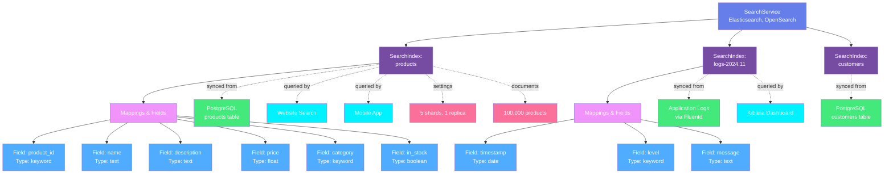
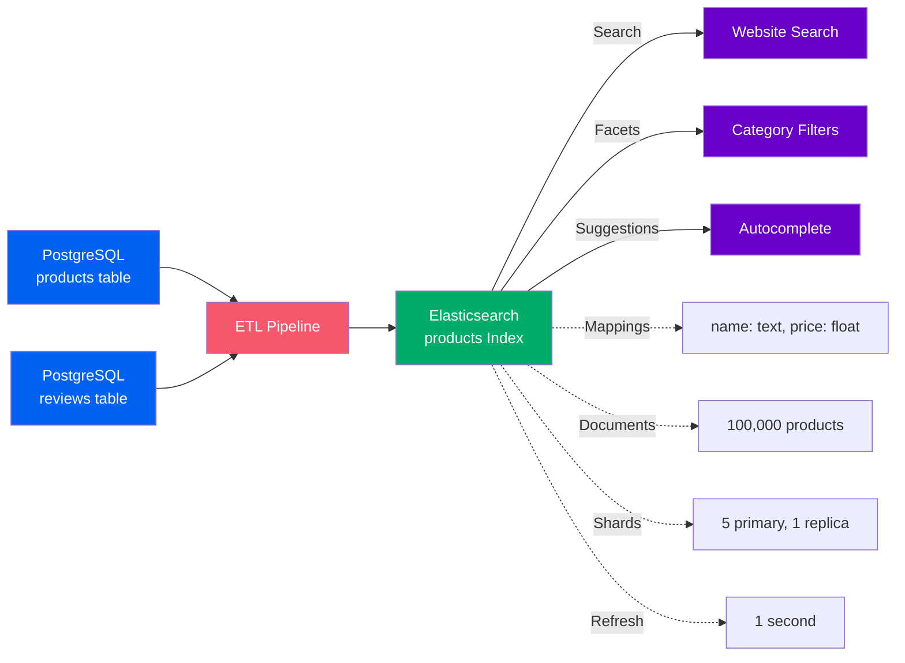
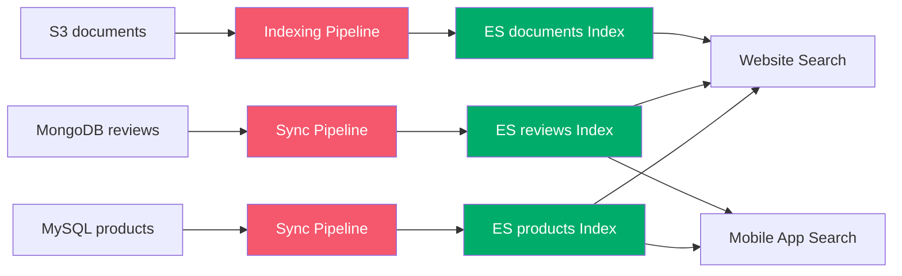

# Search Assets

**Search engines and index systems**

Search assets represent search indexes and full-text search systems that enable fast querying across large datasets. OpenMetadata models search with a two-level hierarchy for search platforms.

---

## Hierarchy Overview



---

## Why This Hierarchy?

### Search Service
**Purpose**: Represents the search platform or cluster

A Search Service is the platform that hosts search indexes and provides full-text search capabilities. It contains configuration for connecting to the search cluster and discovering indexes.

**Examples**:

- `elasticsearch-prod` - Production Elasticsearch cluster
- `opensearch-analytics` - OpenSearch for log analytics
- `solr-ecommerce` - Solr for product search
- `algolia-website` - Algolia for website search

**Why needed**: Organizations use different search platforms for different use cases (Elasticsearch for analytics, Solr for enterprise search, Algolia for website search). The service level groups indexes by platform and cluster, making it easy to manage connections and understand search infrastructure.

**Supported Platforms**: Elasticsearch, OpenSearch, Apache Solr, Algolia, Azure Cognitive Search, Amazon CloudSearch, Typesense

[**View Search Service Specification →**](search-service.md){ .md-button }

---

### Search Index
**Purpose**: Represents a searchable collection of documents

A Search Index is a collection of documents optimized for fast full-text search and filtering. It has mappings (field definitions), settings (analyzers, shards), and contains searchable data.

**Examples**:

- `products` - Product catalog search
- `logs-2024.11` - Application logs for November 2024
- `customers` - Customer data for support search
- `documents` - Content management system documents

**Key Metadata**:

- **Mappings**: Field names, types, and indexing settings
- **Settings**: Number of shards, replicas, analyzers
- **Aliases**: Alternative names for the index
- **Document Count**: Total documents in the index
- **Size**: Storage size of the index
- **Refresh Interval**: How often index updates are visible
- **Data Sources**: Tables or systems feeding the index
- **Lineage**: Source data → Index → Search applications
- **Query Patterns**: Common search queries and filters

**Why needed**: Search indexes are critical for application search functionality. Tracking them enables:
- Understanding search infrastructure and data flow
- Schema management for search fields and mappings
- Impact analysis (which applications depend on this index?)
- Performance optimization (shard sizing, replication)
- Data quality monitoring (indexing lag, completeness)

[**View Search Index Specification →**](search-index.md){ .md-button }

---

## Index Mapping and Fields

Search indexes define how documents are stored and queried:

### Elasticsearch Mapping Example
```json
{
  "mappings": {
    "properties": {
      "product_id": {
        "type": "keyword"
      },
      "name": {
        "type": "text",
        "analyzer": "standard"
      },
      "description": {
        "type": "text",
        "analyzer": "english"
      },
      "price": {
        "type": "float"
      },
      "category": {
        "type": "keyword"
      },
      "tags": {
        "type": "keyword"
      },
      "created_at": {
        "type": "date"
      },
      "in_stock": {
        "type": "boolean"
      }
    }
  }
}
```

### Field Types
- **Text**: Full-text searchable fields (analyzed)
- **Keyword**: Exact match fields (not analyzed)
- **Numeric**: Integer, long, float, double
- **Date**: Timestamp fields
- **Boolean**: True/false values
- **Nested**: Complex nested objects
- **Geo**: Geographic coordinates

---

## Common Patterns

### Pattern 1: Elasticsearch Product Search
```
Elasticsearch Service → products Index → Mappings: name (text), price (float), category (keyword)
                                       → Documents: 100,000 products
                                       → Shards: 5 primary, 1 replica
                                       → Source: PostgreSQL products table
```

E-commerce product catalog indexed for fast search and filtering.

### Pattern 2: OpenSearch Log Analytics
```
OpenSearch Service → logs-2024.11 Index → Mappings: timestamp (date), level (keyword), message (text)
                                         → Documents: 10M log entries
                                         → Time-based index (monthly rollover)
                                         → Source: Application logs via Fluentd
```

Time-series log data with automated index lifecycle management.

### Pattern 3: Solr Enterprise Search
```
Solr Service → documents Index → Mappings: title (text), content (text), author (keyword)
                                → Documents: 1M documents
                                → Facets: department, document_type, year
                                → Source: SharePoint, Confluence, file systems
```

Enterprise document search with faceted navigation.

---

## Real-World Example

Here's how an e-commerce platform uses search for product discovery:



**Flow**:
1. **Data Sources**: Product and review data from PostgreSQL
2. **ETL Pipeline**: Syncs data to Elasticsearch (real-time or batch)
3. **Search Index**: Products indexed with full-text search on name/description
4. **Search Features**:
   - **Search**: Full-text search across products
   - **Filters**: Faceted search by category, price, rating
   - **Autocomplete**: Search suggestions as users type
5. **Configuration**: 5 shards for scalability, 1 replica for availability

**Benefits**:

- **Lineage**: Trace search index back to source database tables
- **Schema Management**: Track field mappings, detect mapping changes
- **Impact Analysis**: Know which search features depend on which fields
- **Performance Monitoring**: Track indexing lag, query latency
- **Data Quality**: Validate completeness, monitor indexing errors

---

## Search Lineage

Search indexes create lineage connections from data sources to search applications:



**Database → Pipeline → Search Index → Application**

---

## Index Settings and Configuration

Search indexes have settings that control behavior and performance:

### Elasticsearch Settings
```json
{
  "settings": {
    "number_of_shards": 5,
    "number_of_replicas": 1,
    "refresh_interval": "1s",
    "max_result_window": 10000,
    "analysis": {
      "analyzer": {
        "custom_analyzer": {
          "type": "custom",
          "tokenizer": "standard",
          "filter": ["lowercase", "stop", "snowball"]
        }
      }
    }
  }
}
```

**Key Settings**:

- **Shards**: Partitions for horizontal scaling
- **Replicas**: Copies for high availability
- **Refresh Interval**: How often new documents are searchable
- **Analyzers**: Text processing (tokenization, stemming, stop words)

---

## Time-Series Index Patterns

Logs and events often use time-based indexes:

### Index Naming Convention
```
logs-2024.11.22  (Daily)
logs-2024.11     (Monthly)
metrics-2024-w47 (Weekly)
```

### Index Lifecycle Management
```json
{
  "policy": "logs-lifecycle",
  "phases": {
    "hot": {
      "min_age": "0ms",
      "actions": {
        "rollover": {
          "max_age": "1d",
          "max_size": "50gb"
        }
      }
    },
    "warm": {
      "min_age": "7d",
      "actions": {
        "shrink": {
          "number_of_shards": 1
        }
      }
    },
    "cold": {
      "min_age": "30d",
      "actions": {
        "freeze": {}
      }
    },
    "delete": {
      "min_age": "90d",
      "actions": {
        "delete": {}
      }
    }
  }
}
```

**Lifecycle Phases**:
1. **Hot**: Active indexing and querying
2. **Warm**: Read-only, less frequent queries
3. **Cold**: Rarely accessed, compressed
4. **Delete**: Automatically delete old data

---

## Search Query Patterns

Common search operations and their use cases:

### Full-Text Search
```json
{
  "query": {
    "match": {
      "name": {
        "query": "wireless headphones",
        "operator": "and"
      }
    }
  }
}
```
**Use Case**: Product search, document search

### Filtered Search
```json
{
  "query": {
    "bool": {
      "must": [
        {"match": {"category": "electronics"}}
      ],
      "filter": [
        {"range": {"price": {"gte": 50, "lte": 200}}},
        {"term": {"in_stock": true}}
      ]
    }
  }
}
```
**Use Case**: E-commerce filtering by price, category, availability

### Aggregations (Facets)
```json
{
  "aggs": {
    "categories": {
      "terms": {
        "field": "category.keyword",
        "size": 10
      }
    },
    "price_ranges": {
      "range": {
        "field": "price",
        "ranges": [
          {"to": 50},
          {"from": 50, "to": 100},
          {"from": 100}
        ]
      }
    }
  }
}
```
**Use Case**: Faceted navigation, analytics

### Autocomplete/Suggestions
```json
{
  "suggest": {
    "product_suggest": {
      "prefix": "wire",
      "completion": {
        "field": "suggest"
      }
    }
  }
}
```
**Use Case**: Search-as-you-type, autocomplete

---

## Index Aliases

Aliases provide indirection and zero-downtime reindexing:

```json
{
  "actions": [
    {
      "add": {
        "index": "products-v2",
        "alias": "products"
      }
    },
    {
      "remove": {
        "index": "products-v1",
        "alias": "products"
      }
    }
  ]
}
```

**Use Cases**:

- **Blue-Green Deployment**: Build new index, swap alias atomically
- **Versioning**: Maintain multiple index versions
- **Read/Write Separation**: Different aliases for read and write operations
- **Time-Series Rollup**: Single alias pointing to multiple time-based indexes

---

## Search Performance Optimization

Track and optimize search performance:

### Shard Sizing
```json
{
  "shards": {
    "optimal_size": "20-50GB per shard",
    "count": 5,
    "replicas": 1,
    "total": 10
  }
}
```

### Query Performance
```json
{
  "query_metrics": {
    "average_latency": "45ms",
    "p95_latency": "120ms",
    "p99_latency": "250ms",
    "queries_per_second": 500
  }
}
```

### Indexing Performance
```json
{
  "indexing_metrics": {
    "documents_per_second": 5000,
    "indexing_lag": "2s",
    "refresh_time": "1s",
    "bulk_size": 1000
  }
}
```

---

## Search Data Synchronization

Different strategies for keeping search indexes in sync:

### Real-Time Sync
```
Database → Change Data Capture → Kafka → Index Consumer → Elasticsearch
```
**Use Case**: E-commerce, social media (immediate consistency)

### Near-Real-Time Sync
```
Database → API → Elasticsearch Bulk API → Index
```
**Use Case**: Content management, customer data (eventual consistency)

### Batch Sync
```
Database → Scheduled ETL → Full Reindex → Elasticsearch
```
**Use Case**: Analytics, reports (daily/hourly updates)

### Event-Driven Sync
```
Application → Event Bus → Lambda/Function → Elasticsearch
```
**Use Case**: Microservices, event-driven architectures

---

## Search Analytics and Monitoring

Track search usage and effectiveness:

```json
{
  "index": "products",
  "analytics": {
    "top_searches": [
      {"query": "wireless headphones", "count": 5000},
      {"query": "laptop", "count": 3500},
      {"query": "phone case", "count": 2000}
    ],
    "zero_result_searches": [
      {"query": "productxyz", "count": 100}
    ],
    "average_results_per_query": 45,
    "click_through_rate": "15%",
    "search_to_purchase_rate": "8%"
  }
}
```

**Key Metrics**:

- **Top Searches**: Most common queries
- **Zero-Result Searches**: Queries with no results (improve content)
- **Click-Through Rate**: Users clicking on results
- **Conversion Rate**: Searches leading to actions

---

## Multi-Language Search

Support for multiple languages and localization:

```json
{
  "mappings": {
    "properties": {
      "name": {
        "type": "text",
        "fields": {
          "en": {
            "type": "text",
            "analyzer": "english"
          },
          "es": {
            "type": "text",
            "analyzer": "spanish"
          },
          "fr": {
            "type": "text",
            "analyzer": "french"
          }
        }
      }
    }
  }
}
```

**Language Features**:

- **Analyzers**: Language-specific stemming and stop words
- **Multi-Fields**: Same content indexed for different languages
- **Character Filters**: Unicode normalization, accent folding

---

## Entity Specifications

| Entity | Description | Specification |
|--------|-------------|---------------|
| **Search Service** | Search platform or cluster | [View Spec](search-service.md) |
| **Search Index** | Searchable document collection | [View Spec](search-index.md) |

Each specification includes:
- Complete field reference
- JSON Schema definition
- RDF/OWL ontology representation
- JSON-LD context and examples
- Integration with search platforms

---

## Supported Search Platforms

OpenMetadata supports metadata extraction from:

- **Elasticsearch** - Distributed search and analytics engine
- **OpenSearch** - Open-source Elasticsearch fork
- **Apache Solr** - Enterprise search platform
- **Algolia** - Managed search API
- **Azure Cognitive Search** - AI-powered cloud search
- **Amazon CloudSearch** - Managed search service
- **Typesense** - Fast, typo-tolerant search engine
- **Meilisearch** - Open-source instant search
- **Amazon Kendra** - Intelligent enterprise search
- **Google Cloud Search** - Enterprise search for G Suite

---

## Search Index Types

Different index patterns for different use cases:

### Product Catalog
```json
{
  "index": "products",
  "purpose": "E-commerce product search",
  "mappings": ["name:text", "price:float", "category:keyword"],
  "features": ["full-text search", "faceting", "autocomplete"],
  "update_frequency": "Real-time"
}
```

### Log Analytics
```json
{
  "index": "logs-*",
  "purpose": "Application log search and analysis",
  "mappings": ["timestamp:date", "level:keyword", "message:text"],
  "features": ["time-series", "aggregations", "alerts"],
  "lifecycle": "Daily rollover, 90-day retention"
}
```

### Document Search
```json
{
  "index": "documents",
  "purpose": "Enterprise document search",
  "mappings": ["title:text", "content:text", "author:keyword"],
  "features": ["full-text search", "highlighting", "relevance tuning"],
  "update_frequency": "Near real-time"
}
```

---

## Search Security and Access Control

Track security and access control metadata:

### Index-Level Security
```json
{
  "security": {
    "authentication": "SAML/OAuth",
    "field_level_security": {
      "hr_team": ["employee_id", "name", "salary"],
      "general": ["employee_id", "name"]
    },
    "document_level_security": {
      "filter": {
        "term": {"department": "user.department"}
      }
    }
  }
}
```

### Encryption
```json
{
  "encryption": {
    "at_rest": "AES-256",
    "in_transit": "TLS 1.3",
    "field_level": ["ssn", "credit_card"]
  }
}
```

---

## Next Steps

1. **Explore specifications** - Click through each entity above
2. **See search lineage** - Check out [lineage from databases to search to apps](../../lineage/overview.md)
3. **Search optimization** - Learn about query performance and index tuning
