# SearchIndex

**Search indices - structured data for full-text search and analytics**

---

## Overview

The **SearchIndex** entity represents search indices in search engines like Elasticsearch, OpenSearch, and Solr. It captures index mappings, field definitions, analyzers, settings, and the relationships between indexed data and source systems.

**Hierarchy**:
```
Search Service → Search Index → Fields
```

---

## Schema Specifications

View the complete SearchIndex schema in your preferred format:

=== "JSON Schema"

    **Complete JSON Schema Definition**

    ```json
    {
      "$id": "https://open-metadata.org/schema/entity/data/searchIndex.json",
      "$schema": "http://json-schema.org/draft-07/schema#",
      "title": "SearchIndex",
      "description": "A `SearchIndex` represents an index in a search engine with its mappings, settings, and fields.",
      "type": "object",
      "javaType": "org.openmetadata.schema.entity.data.SearchIndex",

      "definitions": {
        "searchIndexField": {
          "type": "object",
          "properties": {
            "name": {
              "type": "string",
              "description": "Field name"
            },
            "dataType": {
              "type": "string",
              "enum": [
                "text", "keyword", "long", "integer", "short", "byte",
                "double", "float", "half_float", "scaled_float",
                "date", "boolean", "binary", "integer_range",
                "float_range", "long_range", "double_range", "date_range",
                "object", "nested", "geo_point", "geo_shape", "ip",
                "completion", "token_count", "murmur3", "annotated_text"
              ]
            },
            "dataTypeDisplay": {
              "type": "string",
              "description": "Formatted field type display"
            },
            "description": {
              "type": "string",
              "description": "Field description"
            },
            "analyzer": {
              "type": "string",
              "description": "Analyzer used for the field"
            },
            "searchAnalyzer": {
              "type": "string",
              "description": "Search-time analyzer"
            },
            "normalizer": {
              "type": "string",
              "description": "Normalizer for keyword fields"
            },
            "fields": {
              "type": "array",
              "description": "Sub-fields (multi-fields)",
              "items": {
                "$ref": "#/definitions/searchIndexField"
              }
            },
            "properties": {
              "type": "object",
              "description": "Additional field properties"
            }
          },
          "required": ["name", "dataType"]
        },
        "indexSettings": {
          "type": "object",
          "properties": {
            "numberOfShards": {
              "type": "integer",
              "description": "Number of primary shards"
            },
            "numberOfReplicas": {
              "type": "integer",
              "description": "Number of replica shards"
            },
            "refreshInterval": {
              "type": "string",
              "description": "Refresh interval (e.g., '1s')"
            },
            "maxResultWindow": {
              "type": "integer",
              "description": "Maximum result window size"
            }
          }
        }
      },

      "properties": {
        "id": {
          "description": "Unique identifier",
          "$ref": "../../type/basic.json#/definitions/uuid"
        },
        "name": {
          "description": "Index name",
          "$ref": "../../type/basic.json#/definitions/entityName"
        },
        "fullyQualifiedName": {
          "description": "Fully qualified name: service.index",
          "$ref": "../../type/basic.json#/definitions/fullyQualifiedEntityName"
        },
        "displayName": {
          "description": "Display name",
          "type": "string"
        },
        "description": {
          "description": "Markdown description",
          "$ref": "../../type/basic.json#/definitions/markdown"
        },
        "fields": {
          "description": "Index fields",
          "type": "array",
          "items": {
            "$ref": "#/definitions/searchIndexField"
          }
        },
        "settings": {
          "description": "Index settings",
          "$ref": "#/definitions/indexSettings"
        },
        "service": {
          "description": "Search service",
          "$ref": "../../type/entityReference.json"
        },
        "owner": {
          "description": "Owner (user or team)",
          "$ref": "../../type/entityReference.json"
        },
        "domain": {
          "description": "Data domain",
          "$ref": "../../type/entityReference.json"
        },
        "tags": {
          "description": "Classification tags",
          "type": "array",
          "items": {
            "$ref": "../../type/tagLabel.json"
          }
        },
        "glossaryTerms": {
          "description": "Business glossary terms",
          "type": "array",
          "items": {
            "$ref": "../../type/entityReference.json"
          }
        },
        "version": {
          "description": "Metadata version",
          "$ref": "../../type/entityHistory.json#/definitions/entityVersion"
        }
      },

      "required": ["id", "name", "fields", "service"]
    }
    ```

    **[View Full JSON Schema →](https://github.com/open-metadata/OpenMetadataStandards/blob/main/schemas/entity/data/searchIndex.json)**

=== "RDF"

    **RDF/OWL Ontology Definition**

    ```turtle
    @prefix om: <https://open-metadata.org/schema/> .
    @prefix rdfs: <http://www.w3.org/2000/01/rdf-schema#> .
    @prefix owl: <http://www.w3.org/2001/XMLSchema#> .
    @prefix xsd: <http://www.w3.org/2001/XMLSchema#> .

    # SearchIndex Class Definition
    om:SearchIndex a owl:Class ;
        rdfs:subClassOf om:DataAsset ;
        rdfs:label "SearchIndex" ;
        rdfs:comment "A search index containing structured data for full-text search and analytics" ;
        om:hierarchyLevel 2 .

    # Properties
    om:indexName a owl:DatatypeProperty ;
        rdfs:domain om:SearchIndex ;
        rdfs:range xsd:string ;
        rdfs:label "name" ;
        rdfs:comment "Name of the search index" .

    om:fullyQualifiedName a owl:DatatypeProperty ;
        rdfs:domain om:SearchIndex ;
        rdfs:range xsd:string ;
        rdfs:label "fullyQualifiedName" ;
        rdfs:comment "Complete hierarchical name: service.index" .

    om:hasField a owl:ObjectProperty ;
        rdfs:domain om:SearchIndex ;
        rdfs:range om:SearchIndexField ;
        rdfs:label "hasField" ;
        rdfs:comment "Fields in this search index" .

    om:hasSettings a owl:ObjectProperty ;
        rdfs:domain om:SearchIndex ;
        rdfs:range om:IndexSettings ;
        rdfs:label "hasSettings" ;
        rdfs:comment "Index settings (shards, replicas, etc.)" .

    om:belongsToService a owl:ObjectProperty ;
        rdfs:domain om:SearchIndex ;
        rdfs:range om:SearchService ;
        rdfs:label "belongsToService" ;
        rdfs:comment "Parent search service" .

    om:ownedBy a owl:ObjectProperty ;
        rdfs:domain om:SearchIndex ;
        rdfs:range om:Owner ;
        rdfs:label "ownedBy" ;
        rdfs:comment "User or team that owns this index" .

    om:hasTag a owl:ObjectProperty ;
        rdfs:domain om:SearchIndex ;
        rdfs:range om:Tag ;
        rdfs:label "hasTag" ;
        rdfs:comment "Classification tags applied to index" .

    om:linkedToGlossaryTerm a owl:ObjectProperty ;
        rdfs:domain om:SearchIndex ;
        rdfs:range om:GlossaryTerm ;
        rdfs:label "linkedToGlossaryTerm" ;
        rdfs:comment "Business glossary terms" .

    # SearchIndexField Class
    om:SearchIndexField a owl:Class ;
        rdfs:label "SearchIndexField" ;
        rdfs:comment "A field in a search index with its mapping and analyzer configuration" .

    om:fieldDataType a owl:DatatypeProperty ;
        rdfs:domain om:SearchIndexField ;
        rdfs:range xsd:string ;
        rdfs:label "dataType" ;
        rdfs:comment "Data type: text, keyword, long, date, etc." .

    om:analyzer a owl:DatatypeProperty ;
        rdfs:domain om:SearchIndexField ;
        rdfs:range xsd:string ;
        rdfs:label "analyzer" ;
        rdfs:comment "Analyzer used for indexing" .

    # Example Instance
    ex:productsIndex a om:SearchIndex ;
        om:indexName "products" ;
        om:fullyQualifiedName "elasticsearch_prod.products" ;
        om:displayName "Product Catalog Index" ;
        om:belongsToService ex:elasticsearchProd ;
        om:ownedBy ex:searchTeam ;
        om:hasTag ex:tierGold ;
        om:hasField ex:productIdField ;
        om:hasField ex:productNameField ;
        om:hasField ex:descriptionField .
    ```

    **[View Full RDF Ontology →](https://github.com/open-metadata/OpenMetadataStandards/blob/main/rdf/ontology/openmetadata.ttl)**

=== "JSON-LD"

    **JSON-LD Context and Example**

    ```json
    {
      "@context": {
        "@vocab": "https://open-metadata.org/schema/",
        "om": "https://open-metadata.org/schema/",
        "rdfs": "http://www.w3.org/2000/01/rdf-schema#",
        "xsd": "http://www.w3.org/2001/XMLSchema#",

        "SearchIndex": "om:SearchIndex",
        "name": {
          "@id": "om:indexName",
          "@type": "xsd:string"
        },
        "fullyQualifiedName": {
          "@id": "om:fullyQualifiedName",
          "@type": "xsd:string"
        },
        "displayName": {
          "@id": "om:displayName",
          "@type": "xsd:string"
        },
        "description": {
          "@id": "om:description",
          "@type": "xsd:string"
        },
        "fields": {
          "@id": "om:hasField",
          "@type": "@id",
          "@container": "@list"
        },
        "settings": {
          "@id": "om:hasSettings",
          "@type": "@id"
        },
        "service": {
          "@id": "om:belongsToService",
          "@type": "@id"
        },
        "owner": {
          "@id": "om:ownedBy",
          "@type": "@id"
        },
        "domain": {
          "@id": "om:inDomain",
          "@type": "@id"
        },
        "tags": {
          "@id": "om:hasTag",
          "@type": "@id",
          "@container": "@set"
        },
        "glossaryTerms": {
          "@id": "om:linkedToGlossaryTerm",
          "@type": "@id",
          "@container": "@set"
        }
      }
    }
    ```

    **Example JSON-LD Instance**:

    ```json
    {
      "@context": "https://open-metadata.org/context/searchIndex.jsonld",
      "@type": "SearchIndex",
      "@id": "https://example.com/search/elasticsearch_prod/products",

      "name": "products",
      "fullyQualifiedName": "elasticsearch_prod.products",
      "displayName": "Product Catalog Index",
      "description": "Full-text search index for the product catalog with advanced filtering",

      "service": {
        "@id": "https://example.com/services/elasticsearch_prod",
        "@type": "SearchService",
        "name": "elasticsearch_prod"
      },

      "settings": {
        "@type": "IndexSettings",
        "numberOfShards": 5,
        "numberOfReplicas": 2,
        "refreshInterval": "1s"
      },

      "owner": {
        "@id": "https://example.com/teams/search-team",
        "@type": "Team",
        "name": "search-team",
        "displayName": "Search Team"
      },

      "tags": [
        {
          "@id": "https://open-metadata.org/tags/Tier/Gold",
          "tagFQN": "Tier.Gold"
        }
      ],

      "fields": [
        {
          "@type": "SearchIndexField",
          "name": "product_id",
          "dataType": "keyword",
          "description": "Unique product identifier"
        },
        {
          "@type": "SearchIndexField",
          "name": "product_name",
          "dataType": "text",
          "analyzer": "standard",
          "fields": [
            {
              "name": "keyword",
              "dataType": "keyword"
            }
          ]
        }
      ]
    }
    ```

    **[View Full JSON-LD Context →](https://github.com/open-metadata/OpenMetadataStandards/blob/main/rdf/contexts/searchIndex.jsonld)**

---

## Use Cases

- Catalog all search indices across Elasticsearch, OpenSearch, and Solr
- Document index mappings, field definitions, and analyzers
- Track ownership and responsibility for search indices
- Apply governance tags to search data
- Capture lineage from source tables to search indices
- Monitor index performance and storage
- Define data quality rules for indexed data
- Document search use cases and query patterns

---

## JSON Schema Specification

### Core Properties

#### `id` (uuid)
**Type**: `string` (UUID format)
**Required**: Yes (system-generated)
**Description**: Unique identifier for this search index instance

```json
{
  "id": "b2c3d4e5-f6a7-4b8c-9d0e-1f2a3b4c5d6e"
}
```

---

#### `name` (entityName)
**Type**: `string`
**Required**: Yes
**Pattern**: `^[^.]*$` (no dots allowed)
**Min Length**: 1
**Max Length**: 256
**Description**: Name of the search index (unqualified)

```json
{
  "name": "products"
}
```

---

#### `fullyQualifiedName` (fullyQualifiedEntityName)
**Type**: `string`
**Required**: Yes (system-generated)
**Pattern**: `^((?!::).)*$`
**Description**: Fully qualified name in the format `service.index`

```json
{
  "fullyQualifiedName": "elasticsearch_prod.products"
}
```

---

#### `displayName`
**Type**: `string`
**Required**: No
**Description**: Human-readable display name

```json
{
  "displayName": "Product Catalog Search Index"
}
```

---

#### `description` (markdown)
**Type**: `string` (Markdown format)
**Required**: No
**Description**: Rich text description of the index's purpose and usage

```json
{
  "description": "# Product Catalog Search Index\n\nFull-text search index for the product catalog with:\n- Advanced text analysis for product names and descriptions\n- Faceted search by category, brand, price\n- Autocomplete suggestions\n\n## Data Source\nIndexed from `postgres_prod.ecommerce.products` table\n\n## Update Frequency\nReal-time updates via Change Data Capture"
}
```

---

### Structure Properties

#### `fields[]` (SearchIndexField[])
**Type**: `array` of SearchIndexField objects
**Required**: Yes
**Description**: List of fields in the search index

**SearchIndexField Object Properties**:

| Property | Type | Required | Description |
|----------|------|----------|-------------|
| `name` | string | Yes | Field name |
| `dataType` | DataType enum | Yes | Field data type |
| `dataTypeDisplay` | string | No | Formatted type display |
| `description` | string | No | Field description |
| `analyzer` | string | No | Index-time analyzer |
| `searchAnalyzer` | string | No | Search-time analyzer |
| `normalizer` | string | No | Normalizer for keyword fields |
| `fields` | SearchIndexField[] | No | Multi-fields (sub-fields) |
| `properties` | object | No | Additional field properties |
| `tags` | TagLabel[] | No | Tags applied to field |

**Data Types** (Elasticsearch/OpenSearch):
- Text types: `text`, `keyword`, `annotated_text`
- Numeric types: `long`, `integer`, `short`, `byte`, `double`, `float`, `half_float`, `scaled_float`
- Date type: `date`
- Boolean type: `boolean`
- Binary type: `binary`
- Range types: `integer_range`, `float_range`, `long_range`, `double_range`, `date_range`
- Complex types: `object`, `nested`, `flattened`
- Geo types: `geo_point`, `geo_shape`
- Specialized types: `ip`, `completion`, `token_count`, `murmur3`

**Example**:

```json
{
  "fields": [
    {
      "name": "product_id",
      "dataType": "keyword",
      "dataTypeDisplay": "keyword",
      "description": "Unique product identifier",
      "properties": {
        "index": true,
        "store": true
      }
    },
    {
      "name": "product_name",
      "dataType": "text",
      "dataTypeDisplay": "text",
      "description": "Product name with full-text search",
      "analyzer": "standard",
      "searchAnalyzer": "standard",
      "fields": [
        {
          "name": "keyword",
          "dataType": "keyword",
          "description": "Exact match field"
        },
        {
          "name": "suggest",
          "dataType": "completion",
          "description": "Autocomplete suggestions"
        }
      ]
    },
    {
      "name": "description",
      "dataType": "text",
      "analyzer": "english",
      "searchAnalyzer": "english",
      "description": "Product description with English language analysis"
    },
    {
      "name": "price",
      "dataType": "scaled_float",
      "dataTypeDisplay": "scaled_float",
      "description": "Product price",
      "properties": {
        "scaling_factor": 100
      }
    },
    {
      "name": "categories",
      "dataType": "keyword",
      "description": "Product categories (array)"
    },
    {
      "name": "created_at",
      "dataType": "date",
      "dataTypeDisplay": "date",
      "description": "Product creation timestamp",
      "properties": {
        "format": "strict_date_optional_time||epoch_millis"
      }
    },
    {
      "name": "location",
      "dataType": "geo_point",
      "description": "Geographic location of product availability"
    },
    {
      "name": "attributes",
      "dataType": "nested",
      "description": "Product attributes as nested objects",
      "fields": [
        {
          "name": "name",
          "dataType": "keyword"
        },
        {
          "name": "value",
          "dataType": "text"
        }
      ]
    }
  ]
}
```

---

#### `settings` (IndexSettings)
**Type**: `object`
**Required**: No
**Description**: Index settings configuration

**IndexSettings Properties**:

| Property | Type | Description |
|----------|------|-------------|
| `numberOfShards` | integer | Number of primary shards |
| `numberOfReplicas` | integer | Number of replica shards |
| `refreshInterval` | string | How often the index is refreshed (e.g., "1s") |
| `maxResultWindow` | integer | Maximum pagination depth |
| `analysis` | object | Custom analyzers, tokenizers, filters |

**Example**:

```json
{
  "settings": {
    "numberOfShards": 5,
    "numberOfReplicas": 2,
    "refreshInterval": "1s",
    "maxResultWindow": 10000,
    "analysis": {
      "analyzer": {
        "custom_english": {
          "type": "custom",
          "tokenizer": "standard",
          "filter": ["lowercase", "english_stop", "english_stemmer"]
        },
        "autocomplete": {
          "type": "custom",
          "tokenizer": "standard",
          "filter": ["lowercase", "autocomplete_filter"]
        }
      },
      "filter": {
        "english_stop": {
          "type": "stop",
          "stopwords": "_english_"
        },
        "english_stemmer": {
          "type": "stemmer",
          "language": "english"
        },
        "autocomplete_filter": {
          "type": "edge_ngram",
          "min_gram": 2,
          "max_gram": 20
        }
      }
    }
  }
}
```

---

### Location Properties

#### `service` (EntityReference)
**Type**: `object`
**Required**: Yes
**Description**: Reference to parent search service

```json
{
  "service": {
    "id": "a1b2c3d4-e5f6-4a7b-8c9d-0e1f2a3b4c5d",
    "type": "searchService",
    "name": "elasticsearch_prod",
    "fullyQualifiedName": "elasticsearch_prod"
  }
}
```

---

### Governance Properties

#### `owner` (EntityReference)
**Type**: `object`
**Required**: No
**Description**: User or team that owns this search index

```json
{
  "owner": {
    "id": "d4e5f6a7-b8c9-4d0e-1f2a-3b4c5d6e7f8a",
    "type": "team",
    "name": "search-team",
    "displayName": "Search Team"
  }
}
```

---

#### `domain` (EntityReference)
**Type**: `object`
**Required**: No
**Description**: Data domain this search index belongs to

```json
{
  "domain": {
    "id": "e5f6a7b8-c9d0-4e1f-2a3b-4c5d6e7f8a9b",
    "type": "domain",
    "name": "Product",
    "fullyQualifiedName": "Product"
  }
}
```

---

#### `tags[]` (TagLabel[])
**Type**: `array`
**Required**: No
**Description**: Classification tags applied to the search index

```json
{
  "tags": [
    {
      "tagFQN": "Tier.Gold",
      "description": "Critical search index",
      "source": "Classification",
      "labelType": "Manual",
      "state": "Confirmed"
    },
    {
      "tagFQN": "PII.Sensitive",
      "source": "Classification",
      "labelType": "Automated",
      "state": "Confirmed"
    }
  ]
}
```

---

#### `glossaryTerms[]` (GlossaryTerm[])
**Type**: `array`
**Required**: No
**Description**: Business glossary terms linked to this search index

```json
{
  "glossaryTerms": [
    {
      "fullyQualifiedName": "BusinessGlossary.Product"
    }
  ]
}
```

---

### Lineage Properties

#### `sourceDataSets[]` (EntityReference[])
**Type**: `array`
**Required**: No
**Description**: Source tables or datasets that feed this index

```json
{
  "sourceDataSets": [
    {
      "id": "source-table-uuid",
      "type": "table",
      "name": "products",
      "fullyQualifiedName": "postgres_prod.ecommerce.products"
    }
  ]
}
```

---

### Versioning Properties

#### `version` (entityVersion)
**Type**: `number`
**Required**: Yes (system-managed)
**Description**: Metadata version number, incremented on changes

```json
{
  "version": 1.5
}
```

---

#### `updatedAt` (timestamp)
**Type**: `integer` (Unix epoch milliseconds)
**Required**: Yes (system-managed)
**Description**: Last update timestamp

```json
{
  "updatedAt": 1704240000000
}
```

---

#### `updatedBy` (string)
**Type**: `string`
**Required**: Yes (system-managed)
**Description**: User who made the update

```json
{
  "updatedBy": "search.admin"
}
```

---

## Complete Example

```json
{
  "id": "b2c3d4e5-f6a7-4b8c-9d0e-1f2a3b4c5d6e",
  "name": "products",
  "fullyQualifiedName": "elasticsearch_prod.products",
  "displayName": "Product Catalog Search Index",
  "description": "# Product Catalog Search Index\n\nFull-text search index for the product catalog.",
  "fields": [
    {
      "name": "product_id",
      "dataType": "keyword",
      "description": "Unique product identifier"
    },
    {
      "name": "product_name",
      "dataType": "text",
      "analyzer": "standard",
      "description": "Product name with full-text search",
      "fields": [
        {
          "name": "keyword",
          "dataType": "keyword"
        },
        {
          "name": "suggest",
          "dataType": "completion"
        }
      ]
    },
    {
      "name": "description",
      "dataType": "text",
      "analyzer": "english",
      "description": "Product description"
    },
    {
      "name": "price",
      "dataType": "scaled_float",
      "properties": {
        "scaling_factor": 100
      }
    },
    {
      "name": "categories",
      "dataType": "keyword",
      "description": "Product categories"
    },
    {
      "name": "created_at",
      "dataType": "date"
    }
  ],
  "settings": {
    "numberOfShards": 5,
    "numberOfReplicas": 2,
    "refreshInterval": "1s",
    "maxResultWindow": 10000
  },
  "service": {
    "id": "a1b2c3d4-e5f6-4a7b-8c9d-0e1f2a3b4c5d",
    "type": "searchService",
    "name": "elasticsearch_prod"
  },
  "owner": {
    "id": "d4e5f6a7-b8c9-4d0e-1f2a-3b4c5d6e7f8a",
    "type": "team",
    "name": "search-team"
  },
  "domain": {
    "id": "e5f6a7b8-c9d0-4e1f-2a3b-4c5d6e7f8a9b",
    "type": "domain",
    "name": "Product"
  },
  "tags": [
    {"tagFQN": "Tier.Gold"}
  ],
  "glossaryTerms": [
    {"fullyQualifiedName": "BusinessGlossary.Product"}
  ],
  "version": 1.5,
  "updatedAt": 1704240000000,
  "updatedBy": "search.admin"
}
```

---

## RDF Representation

### Ontology Class

```turtle
@prefix om: <https://open-metadata.org/schema/> .
@prefix rdfs: <http://www.w3.org/2000/01/rdf-schema#> .
@prefix owl: <http://www.w3.org/2001/XMLSchema#> .

om:SearchIndex a owl:Class ;
    rdfs:subClassOf om:DataAsset ;
    rdfs:label "SearchIndex" ;
    rdfs:comment "A search index containing structured data for full-text search" ;
    om:hasProperties [
        om:name "string" ;
        om:fields "SearchIndexField[]" ;
        om:settings "IndexSettings" ;
        om:service "SearchService" ;
        om:owner "Owner" ;
        om:tags "Tag[]" ;
    ] .
```

### Instance Example

```turtle
@prefix om: <https://open-metadata.org/schema/> .
@prefix ex: <https://example.com/> .

ex:products_index a om:SearchIndex ;
    om:name "products" ;
    om:fullyQualifiedName "elasticsearch_prod.products" ;
    om:displayName "Product Catalog Search Index" ;
    om:description "Full-text search index for products" ;
    om:belongsTo ex:elasticsearch_prod ;
    om:ownedBy ex:search_team ;
    om:hasTag ex:tier_gold ;
    om:linkedToGlossaryTerm ex:product_term ;
    om:hasField ex:product_id_field ;
    om:hasField ex:product_name_field ;
    om:hasField ex:description_field .
```

---

## JSON-LD Context

```json
{
  "@context": {
    "@vocab": "https://open-metadata.org/schema/",
    "om": "https://open-metadata.org/schema/",
    "rdfs": "http://www.w3.org/2000/01/rdf-schema#",
    "SearchIndex": "om:SearchIndex",
    "name": "om:name",
    "fullyQualifiedName": "om:fullyQualifiedName",
    "displayName": "om:displayName",
    "description": "om:description",
    "fields": {
      "@id": "om:hasField",
      "@type": "@id",
      "@container": "@list"
    },
    "settings": {
      "@id": "om:hasSettings",
      "@type": "@id"
    },
    "service": {
      "@id": "om:belongsTo",
      "@type": "@id"
    },
    "owner": {
      "@id": "om:ownedBy",
      "@type": "@id"
    },
    "tags": {
      "@id": "om:hasTag",
      "@type": "@id",
      "@container": "@set"
    }
  }
}
```

### JSON-LD Example

```json
{
  "@context": "https://open-metadata.org/context/searchIndex.jsonld",
  "@type": "SearchIndex",
  "@id": "https://example.com/search/elasticsearch_prod/products",
  "name": "products",
  "fullyQualifiedName": "elasticsearch_prod.products",
  "displayName": "Product Catalog Search Index",
  "service": {
    "@id": "https://example.com/services/elasticsearch_prod",
    "@type": "SearchService"
  },
  "owner": {
    "@id": "https://example.com/teams/search-team",
    "@type": "Team"
  },
  "tags": [
    {"@id": "https://open-metadata.org/tags/Tier/Gold"}
  ],
  "fields": [
    {
      "@type": "SearchIndexField",
      "name": "product_id",
      "dataType": "keyword"
    },
    {
      "@type": "SearchIndexField",
      "name": "product_name",
      "dataType": "text",
      "analyzer": "standard"
    }
  ]
}
```

---

## Relationships

SearchIndex has comprehensive relationships with entities across the metadata platform:

```mermaid
graph TD
    subgraph Hierarchy
        SVC[SearchService<br/>elasticsearch_prod]
        SVC --> IDX[SearchIndex<br/>products]
    end

    subgraph Fields
        IDX --> F1[Field<br/>product_id: keyword]
        IDX --> F2[Field<br/>product_name: text]
        IDX --> F3[Field<br/>description: text]
        IDX --> F4[Field<br/>price: scaled_float]
        IDX --> F5[Field<br/>categories: keyword]
        IDX --> F6[Field<br/>location: geo_point]
    end

    subgraph Source Data
        TBL1[Table<br/>products] -.->|indexed from| IDX
        TBL2[Table<br/>product_details] -.->|enriches| IDX
        TBL3[Table<br/>product_inventory] -.->|supplements| IDX
    end

    subgraph Pipelines
        PIPE1[Pipeline<br/>product_indexing] -.->|feeds| IDX
        PIPE2[Pipeline<br/>realtime_sync] -.->|updates| IDX
        CDC[Pipeline<br/>cdc_connector] -.->|streams to| IDX
    end

    subgraph Query Consumers
        APP1[Application<br/>search_ui] -.->|queries| IDX
        APP2[Application<br/>recommendation_engine] -.->|queries| IDX
        API[ApiEndpoint<br/>product_search] -.->|queries| IDX
    end

    subgraph Ownership
        IDX -.->|owned by| TEAM[Team<br/>Search Team]
        IDX -.->|owned by| USER[User<br/>search.admin]
    end

    subgraph Governance
        IDX -.->|in domain| DOM[Domain<br/>Product Catalog]
        IDX -.->|tagged| TAG1[Tag<br/>Tier.Gold]
        IDX -.->|tagged| TAG2[Tag<br/>Production]
        IDX -.->|tagged| TAG3[Tag<br/>PII.Sensitive]
        IDX -.->|linked to| GT[GlossaryTerm<br/>Product Search]
    end

    subgraph Quality
        TC1[TestCase<br/>index_freshness] -.->|monitors| IDX
        TC2[TestCase<br/>query_performance] -.->|tracks| IDX
        TC3[TestCase<br/>schema_validation] -.->|validates| F2
    end

    subgraph Monitoring
        DASH[Dashboard<br/>Search Metrics] -.->|monitors| IDX
        ALERT[Alert<br/>index_lag_alert] -.->|watches| IDX
    end

    style SVC fill:#667eea,color:#fff
    style IDX fill:#4facfe,color:#fff,stroke:#4c51bf,stroke-width:3px
    style F1 fill:#00f2fe,color:#333
    style F2 fill:#00f2fe,color:#333
    style F3 fill:#00f2fe,color:#333
    style F4 fill:#00f2fe,color:#333
    style F5 fill:#00f2fe,color:#333
    style F6 fill:#00f2fe,color:#333
    style TBL1 fill:#764ba2,color:#fff
    style TBL2 fill:#764ba2,color:#fff
    style TBL3 fill:#764ba2,color:#fff
    style PIPE1 fill:#f5576c,color:#fff
    style PIPE2 fill:#f5576c,color:#fff
    style CDC fill:#f5576c,color:#fff
    style APP1 fill:#00ac69,color:#fff
    style APP2 fill:#00ac69,color:#fff
    style API fill:#00ac69,color:#fff
    style TEAM fill:#43e97b,color:#fff
    style USER fill:#43e97b,color:#fff
    style DOM fill:#fa709a,color:#fff
    style TAG1 fill:#f093fb,color:#fff
    style TAG2 fill:#f093fb,color:#fff
    style TAG3 fill:#f093fb,color:#fff
    style GT fill:#ffd700,color:#333
    style TC1 fill:#9b59b6,color:#fff
    style TC2 fill:#9b59b6,color:#fff
    style TC3 fill:#9b59b6,color:#fff
    style DASH fill:#ff6b6b,color:#fff
    style ALERT fill:#ff6b6b,color:#fff
```



**Relationship Types**:

- **Solid lines (→)**: Hierarchical containment (Service contains SearchIndex, SearchIndex contains Fields)
- **Dashed lines (-.->)**: References and associations (ownership, governance, lineage)

### Parent Entities
- **SearchService**: The search service hosting this index

### Child Entities
- **SearchIndexField**: Individual fields within the index

### Associated Entities
- **Owner**: User or team owning this index
- **Domain**: Business domain assignment
- **Tag**: Classification tags
- **GlossaryTerm**: Business terminology
- **Table**: Source tables that feed this index
- **Pipeline**: ETL pipelines, real-time sync, CDC connectors loading data into this index
- **Application**: Applications querying the search index
- **ApiEndpoint**: API endpoints that query this index
- **Dashboard**: Dashboards monitoring search metrics
- **TestCase**: Index freshness, query performance, schema validation tests

---

## Custom Properties

This entity supports custom properties through the `extension` field.
Common custom properties include:

- **Data Classification**: Sensitivity level
- **Cost Center**: Billing allocation
- **Retention Period**: Data retention requirements
- **Application Owner**: Owning application/team

See [Custom Properties](../../metadata-specifications/custom-properties.md)
for details on defining and using custom properties.

---

## API Operations

### Create SearchIndex

```http
POST /api/v1/searchIndexes
Content-Type: application/json

{
  "name": "products",
  "service": "elasticsearch_prod",
  "fields": [
    {
      "name": "product_id",
      "dataType": "keyword"
    },
    {
      "name": "product_name",
      "dataType": "text",
      "analyzer": "standard"
    }
  ],
  "settings": {
    "numberOfShards": 5,
    "numberOfReplicas": 2
  }
}
```

### Get SearchIndex

```http
GET /api/v1/searchIndexes/name/elasticsearch_prod.products?fields=fields,tags,owner,settings
```

### Update SearchIndex

```http
PATCH /api/v1/searchIndexes/{id}
Content-Type: application/json-patch+json

[
  {
    "op": "add",
    "path": "/tags/-",
    "value": {"tagFQN": "Tier.Gold"}
  }
]
```

### Add Field

```http
PUT /api/v1/searchIndexes/{id}/fields
Content-Type: application/json

{
  "fields": [
    {
      "name": "new_field",
      "dataType": "text",
      "analyzer": "standard"
    }
  ]
}
```

### Get Index Mapping

```http
GET /api/v1/searchIndexes/{id}/mapping
```

### Get Index Statistics

```http
GET /api/v1/searchIndexes/{id}/stats
```

---

## Related Documentation

- **[SearchService](search-service.md)** - Search service configuration
- **[Data Lineage](../../lineage/overview.md)** - Tracking data flow to search indices
- **[Analyzers](../../search/analyzers.md)** - Text analysis configuration
- **[API Integration](../../apis/overview.md)** - REST API integration
