# SearchService

**Search engine services - powering full-text search and analytics**

---

## Overview

The **SearchService** entity represents search engine services like Elasticsearch, OpenSearch, Solr, and other search platforms. It is the root container for search indices and their configurations, providing full-text search capabilities, analytics, and real-time data exploration.

**Hierarchy**:


---

## Relationships

SearchService has comprehensive relationships with entities across the metadata platform:

```mermaid
graph TD
    subgraph Service Layer
        A[SearchService<br/>elasticsearch_prod]
    end

    subgraph Search Indices
        A --> B1[SearchIndex:<br/>products_idx]
        A --> B2[SearchIndex:<br/>customers_idx]
        A --> B3[SearchIndex:<br/>documents_idx]

        B1 --> C1[Field:<br/>product_name<br/>type: text, analyzed]
        B1 --> C2[Field:<br/>category<br/>type: keyword]
        B1 --> C3[Field:<br/>price<br/>type: float]

        B2 --> C4[Field:<br/>customer_name<br/>type: text]
        B2 --> C5[Field:<br/>email<br/>type: keyword]

        B3 --> C6[Field:<br/>content<br/>type: text]
        B3 --> C7[Field:<br/>tags<br/>type: keyword]
    end

    subgraph Ownership
        A -.->|owned by| D1[Team:<br/>Search Platform]
        A -.->|owned by| D2[User:<br/>search.admin]
    end

    subgraph Governance
        A -.->|in domain| E[Domain:<br/>Search Infrastructure]
        A -.->|has tags| F1[Tag:<br/>Production]
        A -.->|has tags| F2[Tag:<br/>Tier.Gold]
        A -.->|has tags| F3[Tag:<br/>Performance]
    end

    subgraph Source Data
        G1[Table:<br/>products] -.->|indexed into| B1
        G2[Table:<br/>customers] -.->|indexed into| B2
        G3[Table:<br/>documents] -.->|indexed into| B3

        H1[Pipeline:<br/>product_indexer] -.->|populates| B1
        H2[Pipeline:<br/>customer_indexer] -.->|populates| B2
        H3[Pipeline:<br/>document_indexer] -.->|populates| B3
    end

    subgraph Query Consumers
        I1[ApiEndpoint:<br/>GET /search/products] -.->|queries| B1
        I2[Dashboard:<br/>Search Analytics] -.->|monitors| A
        I3[Application:<br/>E-commerce Site] -.->|searches via| B1
        I4[Application:<br/>Customer Portal] -.->|searches via| B2
    end

    subgraph Index Configuration
        B1 -.->|settings| J1[Replicas: 2<br/>Shards: 5]
        B2 -.->|settings| J2[Replicas: 1<br/>Shards: 3]
        B3 -.->|settings| J3[Replicas: 2<br/>Shards: 5]
    end

    subgraph Data Quality
        K1[TestCase:<br/>index_freshness_check] -.->|validates| B1
        K2[TestCase:<br/>document_count_check] -.->|validates| B2
    end

    style A fill:#667eea,color:#fff,stroke:#4c51bf,stroke-width:3px
    style B1 fill:#4facfe,color:#fff
    style B2 fill:#4facfe,color:#fff
    style B3 fill:#4facfe,color:#fff
    style C1 fill:#00f2fe,color:#333
    style C2 fill:#00f2fe,color:#333
    style C3 fill:#00f2fe,color:#333
    style C4 fill:#00f2fe,color:#333
    style C5 fill:#00f2fe,color:#333
    style C6 fill:#00f2fe,color:#333
    style C7 fill:#00f2fe,color:#333
    style D1 fill:#43e97b,color:#fff
    style D2 fill:#43e97b,color:#fff
    style E fill:#fa709a,color:#fff
    style F1 fill:#f093fb,color:#fff
    style F2 fill:#f093fb,color:#fff
    style F3 fill:#f093fb,color:#fff
    style G1 fill:#764ba2,color:#fff
    style G2 fill:#764ba2,color:#fff
    style G3 fill:#764ba2,color:#fff
    style H1 fill:#00ac69,color:#fff
    style H2 fill:#00ac69,color:#fff
    style H3 fill:#00ac69,color:#fff
    style I1 fill:#ff6b6b,color:#fff
    style I2 fill:#ff6b6b,color:#fff
    style I3 fill:#ff6b6b,color:#fff
    style I4 fill:#ff6b6b,color:#fff
    style J1 fill:#ffd700,color:#333
    style J2 fill:#ffd700,color:#333
    style J3 fill:#ffd700,color:#333
    style K1 fill:#f5576c,color:#fff
    style K2 fill:#f5576c,color:#fff
```



**Relationship Types**:

- **Solid lines (→)**: Hierarchical containment (Service manages Indices, Indices contain Fields)
- **Dashed lines (-.->)**: References and associations (ownership, governance, data sources, queries, pipelines, quality)

---

### Child Entities
- **SearchIndex**: Search indices managed by this service

### Associated Entities
- **Owner**: User or team owning this service
- **Domain**: Business domain assignment
- **Tag**: Classification tags
- **Pipeline**: ETL pipelines loading data into search indices
- **Table**: Database tables indexed by search
- **ApiEndpoint**: API endpoints querying the search indices
- **Dashboard**: Monitoring dashboards for search analytics
- **TestCase**: Data quality tests for index freshness and completeness

---

## Schema Specifications

View the complete SearchService schema in your preferred format:

=== "JSON Schema"

    **Complete JSON Schema Definition**

    ```json
    {
      "$id": "https://open-metadata.org/schema/entity/services/searchService.json",
      "$schema": "http://json-schema.org/draft-07/schema#",
      "title": "SearchService",
      "description": "A `SearchService` represents a search engine service such as Elasticsearch, OpenSearch, or Solr.",
      "type": "object",
      "javaType": "org.openmetadata.schema.entity.services.SearchService",

      "definitions": {
        "searchServiceType": {
          "description": "Type of search service",
          "type": "string",
          "enum": [
            "Elasticsearch", "OpenSearch", "Solr",
            "Algolia", "AmazonOpenSearch", "CustomSearch"
          ]
        },
        "searchConnection": {
          "type": "object",
          "properties": {
            "hostPort": {
              "type": "string",
              "description": "Host and port of the search service"
            },
            "scheme": {
              "type": "string",
              "enum": ["http", "https"],
              "default": "https"
            },
            "username": {
              "type": "string",
              "description": "Username for authentication"
            },
            "password": {
              "type": "string",
              "description": "Password for authentication",
              "format": "password"
            },
            "apiKey": {
              "type": "string",
              "description": "API key for authentication",
              "format": "password"
            }
          },
          "required": ["hostPort"]
        }
      },

      "properties": {
        "id": {
          "description": "Unique identifier",
          "$ref": "../../type/basic.json#/definitions/uuid"
        },
        "name": {
          "description": "Service name",
          "$ref": "../../type/basic.json#/definitions/entityName"
        },
        "fullyQualifiedName": {
          "description": "Fully qualified name: service",
          "$ref": "../../type/basic.json#/definitions/fullyQualifiedEntityName"
        },
        "displayName": {
          "description": "Display name",
          "type": "string"
        },
        "description": {
          "description": "Markdown description",
          "$ref": "../../type/basic.json#/definitions/markdown"
        },
        "serviceType": {
          "$ref": "#/definitions/searchServiceType"
        },
        "connection": {
          "description": "Connection configuration",
          "$ref": "#/definitions/searchConnection"
        },
        "owner": {
          "description": "Owner (user or team)",
          "$ref": "../../type/entityReference.json"
        },
        "domain": {
          "description": "Data domain",
          "$ref": "../../type/entityReference.json"
        },
        "tags": {
          "description": "Classification tags",
          "type": "array",
          "items": {
            "$ref": "../../type/tagLabel.json"
          }
        },
        "version": {
          "description": "Metadata version",
          "$ref": "../../type/entityHistory.json#/definitions/entityVersion"
        }
      },

      "required": ["id", "name", "serviceType", "connection"]
    }
    ```

    **[View Full JSON Schema →](https://github.com/open-metadata/OpenMetadataStandards/blob/main/schemas/entity/services/searchService.json)**

=== "RDF"

    **RDF/OWL Ontology Definition**

    ```turtle
    @prefix om: <https://open-metadata.org/schema/> .
    @prefix rdfs: <http://www.w3.org/2000/01/rdf-schema#> .
    @prefix owl: <http://www.w3.org/2001/XMLSchema#> .
    @prefix xsd: <http://www.w3.org/2001/XMLSchema#> .

    # SearchService Class Definition
    om:SearchService a owl:Class ;
        rdfs:subClassOf om:Service ;
        rdfs:label "SearchService" ;
        rdfs:comment "A search engine service providing full-text search and analytics capabilities" ;
        om:hierarchyLevel 1 .

    # Properties
    om:serviceName a owl:DatatypeProperty ;
        rdfs:domain om:SearchService ;
        rdfs:range xsd:string ;
        rdfs:label "name" ;
        rdfs:comment "Name of the search service" .

    om:fullyQualifiedName a owl:DatatypeProperty ;
        rdfs:domain om:SearchService ;
        rdfs:range xsd:string ;
        rdfs:label "fullyQualifiedName" ;
        rdfs:comment "Fully qualified name of the service" .

    om:serviceType a owl:DatatypeProperty ;
        rdfs:domain om:SearchService ;
        rdfs:range om:SearchServiceType ;
        rdfs:label "serviceType" ;
        rdfs:comment "Type of search service: Elasticsearch, OpenSearch, Solr, etc." .

    om:hasConnection a owl:ObjectProperty ;
        rdfs:domain om:SearchService ;
        rdfs:range om:SearchConnection ;
        rdfs:label "hasConnection" ;
        rdfs:comment "Connection configuration for the search service" .

    om:hasSearchIndex a owl:ObjectProperty ;
        rdfs:domain om:SearchService ;
        rdfs:range om:SearchIndex ;
        rdfs:label "hasSearchIndex" ;
        rdfs:comment "Search indices in this service" .

    om:ownedBy a owl:ObjectProperty ;
        rdfs:domain om:SearchService ;
        rdfs:range om:Owner ;
        rdfs:label "ownedBy" ;
        rdfs:comment "User or team that owns this service" .

    om:hasTag a owl:ObjectProperty ;
        rdfs:domain om:SearchService ;
        rdfs:range om:Tag ;
        rdfs:label "hasTag" ;
        rdfs:comment "Classification tags applied to service" .

    # Service Type Enumeration
    om:SearchServiceType a owl:Class ;
        owl:oneOf (
            om:Elasticsearch
            om:OpenSearch
            om:Solr
            om:Algolia
            om:AmazonOpenSearch
        ) .

    # Example Instance
    ex:elasticsearchProd a om:SearchService ;
        om:serviceName "elasticsearch_prod" ;
        om:fullyQualifiedName "elasticsearch_prod" ;
        om:displayName "Production Elasticsearch" ;
        om:serviceType om:Elasticsearch ;
        om:ownedBy ex:dataTeam ;
        om:hasTag ex:tierProduction ;
        om:hasSearchIndex ex:productsIndex ;
        om:hasSearchIndex ex:customersIndex .
    ```

    **[View Full RDF Ontology →](https://github.com/open-metadata/OpenMetadataStandards/blob/main/rdf/ontology/openmetadata.ttl)**

=== "JSON-LD"

    **JSON-LD Context and Example**

    ```json
    {
      "@context": {
        "@vocab": "https://open-metadata.org/schema/",
        "om": "https://open-metadata.org/schema/",
        "rdfs": "http://www.w3.org/2000/01/rdf-schema#",
        "xsd": "http://www.w3.org/2001/XMLSchema#",

        "SearchService": "om:SearchService",
        "name": {
          "@id": "om:serviceName",
          "@type": "xsd:string"
        },
        "fullyQualifiedName": {
          "@id": "om:fullyQualifiedName",
          "@type": "xsd:string"
        },
        "displayName": {
          "@id": "om:displayName",
          "@type": "xsd:string"
        },
        "description": {
          "@id": "om:description",
          "@type": "xsd:string"
        },
        "serviceType": {
          "@id": "om:serviceType",
          "@type": "@vocab"
        },
        "connection": {
          "@id": "om:hasConnection",
          "@type": "@id"
        },
        "indices": {
          "@id": "om:hasSearchIndex",
          "@type": "@id",
          "@container": "@set"
        },
        "owner": {
          "@id": "om:ownedBy",
          "@type": "@id"
        },
        "domain": {
          "@id": "om:inDomain",
          "@type": "@id"
        },
        "tags": {
          "@id": "om:hasTag",
          "@type": "@id",
          "@container": "@set"
        }
      }
    }
    ```

    **Example JSON-LD Instance**:

    ```json
    {
      "@context": "https://open-metadata.org/context/searchService.jsonld",
      "@type": "SearchService",
      "@id": "https://example.com/services/elasticsearch_prod",

      "name": "elasticsearch_prod",
      "fullyQualifiedName": "elasticsearch_prod",
      "displayName": "Production Elasticsearch Cluster",
      "description": "Primary Elasticsearch cluster for product search and analytics",
      "serviceType": "Elasticsearch",

      "connection": {
        "@type": "SearchConnection",
        "hostPort": "elasticsearch.example.com:9200",
        "scheme": "https",
        "username": "search_user"
      },

      "owner": {
        "@id": "https://example.com/teams/data-platform",
        "@type": "Team",
        "name": "data-platform",
        "displayName": "Data Platform Team"
      },

      "tags": [
        {
          "@id": "https://open-metadata.org/tags/Tier/Production",
          "tagFQN": "Tier.Production"
        },
        {
          "@id": "https://open-metadata.org/tags/Environment/Prod",
          "tagFQN": "Environment.Prod"
        }
      ],

      "indices": [
        {
          "@id": "https://example.com/search/elasticsearch_prod/products",
          "@type": "SearchIndex",
          "name": "products"
        },
        {
          "@id": "https://example.com/search/elasticsearch_prod/customers",
          "@type": "SearchIndex",
          "name": "customers"
        }
      ]
    }
    ```

    **[View Full JSON-LD Context →](https://github.com/open-metadata/OpenMetadataStandards/blob/main/rdf/contexts/searchService.jsonld)**

---

## Use Cases

- Catalog search services across the organization (Elasticsearch, OpenSearch, Solr)
- Document search service configurations and connection details
- Track ownership and responsibility for search infrastructure
- Monitor search service health and performance
- Discover and inventory all search indices
- Apply governance policies to search services
- Track data lineage from source systems to search indices
- Manage access control and authentication

---

## JSON Schema Specification

### Core Properties

#### `id` (uuid)
**Type**: `string` (UUID format)
**Required**: Yes (system-generated)
**Description**: Unique identifier for this search service instance

```json
{
  "id": "a1b2c3d4-e5f6-4a7b-8c9d-0e1f2a3b4c5d"
}
```

---

#### `name` (entityName)
**Type**: `string`
**Required**: Yes
**Pattern**: `^[^.]*$` (no dots allowed)
**Min Length**: 1
**Max Length**: 256
**Description**: Name of the search service (unqualified)

```json
{
  "name": "elasticsearch_prod"
}
```

---

#### `fullyQualifiedName` (fullyQualifiedEntityName)
**Type**: `string`
**Required**: Yes (system-generated)
**Pattern**: `^((?!::).)*$`
**Description**: Fully qualified name (same as name for services)

```json
{
  "fullyQualifiedName": "elasticsearch_prod"
}
```

---

#### `displayName`
**Type**: `string`
**Required**: No
**Description**: Human-readable display name

```json
{
  "displayName": "Production Elasticsearch Cluster"
}
```

---

#### `description` (markdown)
**Type**: `string` (Markdown format)
**Required**: No
**Description**: Rich text description of the search service's purpose and usage

```json
{
  "description": "# Production Elasticsearch Cluster\n\nPrimary search infrastructure for:\n- Product catalog search\n- Customer data analytics\n- Log aggregation and analysis\n\n## Configuration\n- **Cluster size**: 12 nodes (3 master, 9 data)\n- **Version**: 8.11.0\n- **Data retention**: 90 days\n- **Replication factor**: 2"
}
```

---

### Service Properties

#### `serviceType` (SearchServiceType enum)
**Type**: `string` enum
**Required**: Yes
**Allowed Values**:

- `Elasticsearch` - Elastic Elasticsearch
- `OpenSearch` - Amazon OpenSearch / OpenSearch
- `Solr` - Apache Solr
- `Algolia` - Algolia Search
- `AmazonOpenSearch` - Amazon OpenSearch Service
- `CustomSearch` - Custom search implementation

```json
{
  "serviceType": "Elasticsearch"
}
```

---

#### `connection` (SearchConnection)
**Type**: `object`
**Required**: Yes
**Description**: Connection configuration for the search service

**SearchConnection Properties**:

| Property | Type | Required | Description |
|----------|------|----------|-------------|
| `hostPort` | string | Yes | Host and port (e.g., "localhost:9200") |
| `scheme` | string enum | No | "http" or "https" (default: "https") |
| `username` | string | No | Username for authentication |
| `password` | string | No | Password (encrypted) |
| `apiKey` | string | No | API key for authentication |
| `cloudId` | string | No | Elastic Cloud ID |
| `region` | string | No | AWS region for Amazon OpenSearch |
| `timeout` | integer | No | Connection timeout in seconds |
| `useSSL` | boolean | No | Enable SSL/TLS |
| `verifyCerts` | boolean | No | Verify SSL certificates |

**Example**:

```json
{
  "connection": {
    "hostPort": "elasticsearch.example.com:9200",
    "scheme": "https",
    "username": "search_user",
    "password": "encrypted_password",
    "useSSL": true,
    "verifyCerts": true,
    "timeout": 30
  }
}
```

**Elasticsearch Cloud Example**:

```json
{
  "connection": {
    "cloudId": "production:dXMtZWFzdC0xLmF3cy5mb3VuZC5pbyQ...",
    "apiKey": "VnVhQ2ZHY0JDZGJrU...",
    "scheme": "https"
  }
}
```

**Amazon OpenSearch Example**:

```json
{
  "connection": {
    "hostPort": "search-domain-abc123.us-east-1.es.amazonaws.com:443",
    "scheme": "https",
    "region": "us-east-1",
    "useSSL": true
  }
}
```

---

### Governance Properties

#### `owner` (EntityReference)
**Type**: `object`
**Required**: No
**Description**: User or team that owns this search service

```json
{
  "owner": {
    "id": "d4e5f6a7-b8c9-4d0e-1f2a-3b4c5d6e7f8a",
    "type": "team",
    "name": "data-platform",
    "displayName": "Data Platform Team"
  }
}
```

---

#### `domain` (EntityReference)
**Type**: `object`
**Required**: No
**Description**: Data domain this search service belongs to

```json
{
  "domain": {
    "id": "e5f6a7b8-c9d0-4e1f-2a3b-4c5d6e7f8a9b",
    "type": "domain",
    "name": "Engineering",
    "fullyQualifiedName": "Engineering"
  }
}
```

---

#### `tags[]` (TagLabel[])
**Type**: `array`
**Required**: No
**Description**: Classification tags applied to the search service

```json
{
  "tags": [
    {
      "tagFQN": "Tier.Production",
      "description": "Production-grade service",
      "source": "Classification",
      "labelType": "Manual",
      "state": "Confirmed"
    },
    {
      "tagFQN": "Environment.Prod",
      "source": "Classification",
      "labelType": "Manual",
      "state": "Confirmed"
    }
  ]
}
```

---

### Versioning Properties

#### `version` (entityVersion)
**Type**: `number`
**Required**: Yes (system-managed)
**Description**: Metadata version number, incremented on changes

```json
{
  "version": 1.2
}
```

---

#### `updatedAt` (timestamp)
**Type**: `integer` (Unix epoch milliseconds)
**Required**: Yes (system-managed)
**Description**: Last update timestamp

```json
{
  "updatedAt": 1704240000000
}
```

---

#### `updatedBy` (string)
**Type**: `string`
**Required**: Yes (system-managed)
**Description**: User who made the update

```json
{
  "updatedBy": "admin"
}
```

---

## Complete Example

```json
{
  "id": "a1b2c3d4-e5f6-4a7b-8c9d-0e1f2a3b4c5d",
  "name": "elasticsearch_prod",
  "fullyQualifiedName": "elasticsearch_prod",
  "displayName": "Production Elasticsearch Cluster",
  "description": "# Production Elasticsearch Cluster\n\nPrimary search infrastructure for product catalog and analytics.",
  "serviceType": "Elasticsearch",
  "connection": {
    "hostPort": "elasticsearch.example.com:9200",
    "scheme": "https",
    "username": "search_user",
    "password": "encrypted_password",
    "useSSL": true,
    "verifyCerts": true,
    "timeout": 30
  },
  "owner": {
    "id": "d4e5f6a7-b8c9-4d0e-1f2a-3b4c5d6e7f8a",
    "type": "team",
    "name": "data-platform",
    "displayName": "Data Platform Team"
  },
  "domain": {
    "id": "e5f6a7b8-c9d0-4e1f-2a3b-4c5d6e7f8a9b",
    "type": "domain",
    "name": "Engineering"
  },
  "tags": [
    {"tagFQN": "Tier.Production"},
    {"tagFQN": "Environment.Prod"}
  ],
  "version": 1.2,
  "updatedAt": 1704240000000,
  "updatedBy": "admin"
}
```

---

## RDF Representation

### Ontology Class

```turtle
@prefix om: <https://open-metadata.org/schema/> .
@prefix rdfs: <http://www.w3.org/2000/01/rdf-schema#> .
@prefix owl: <http://www.w3.org/2001/XMLSchema#> .

om:SearchService a owl:Class ;
    rdfs:subClassOf om:Service ;
    rdfs:label "SearchService" ;
    rdfs:comment "A search engine service providing full-text search capabilities" ;
    om:hasProperties [
        om:name "string" ;
        om:serviceType "SearchServiceType" ;
        om:connection "SearchConnection" ;
        om:owner "Owner" ;
        om:tags "Tag[]" ;
    ] .
```

### Instance Example

```turtle
@prefix om: <https://open-metadata.org/schema/> .
@prefix ex: <https://example.com/> .

ex:elasticsearch_prod a om:SearchService ;
    om:name "elasticsearch_prod" ;
    om:fullyQualifiedName "elasticsearch_prod" ;
    om:displayName "Production Elasticsearch Cluster" ;
    om:description "Primary search infrastructure" ;
    om:serviceType "Elasticsearch" ;
    om:ownedBy ex:data_platform_team ;
    om:hasTag ex:tier_production ;
    om:hasSearchIndex ex:products_index ;
    om:hasSearchIndex ex:customers_index .
```

---

## JSON-LD Context

```json
{
  "@context": {
    "@vocab": "https://open-metadata.org/schema/",
    "om": "https://open-metadata.org/schema/",
    "rdfs": "http://www.w3.org/2000/01/rdf-schema#",
    "SearchService": "om:SearchService",
    "name": "om:name",
    "fullyQualifiedName": "om:fullyQualifiedName",
    "displayName": "om:displayName",
    "description": "om:description",
    "serviceType": "om:serviceType",
    "connection": {
      "@id": "om:hasConnection",
      "@type": "@id"
    },
    "owner": {
      "@id": "om:ownedBy",
      "@type": "@id"
    },
    "tags": {
      "@id": "om:hasTag",
      "@type": "@id",
      "@container": "@set"
    }
  }
}
```

### JSON-LD Example

```json
{
  "@context": "https://open-metadata.org/context/searchService.jsonld",
  "@type": "SearchService",
  "@id": "https://example.com/services/elasticsearch_prod",
  "name": "elasticsearch_prod",
  "fullyQualifiedName": "elasticsearch_prod",
  "displayName": "Production Elasticsearch Cluster",
  "serviceType": "Elasticsearch",
  "connection": {
    "@type": "SearchConnection",
    "hostPort": "elasticsearch.example.com:9200",
    "scheme": "https"
  },
  "owner": {
    "@id": "https://example.com/teams/data-platform",
    "@type": "Team"
  },
  "tags": [
    {"@id": "https://open-metadata.org/tags/Tier/Production"}
  ]
}
```

---

## Custom Properties

This entity supports custom properties through the `extension` field.
Common custom properties include:

- **Data Classification**: Sensitivity level
- **Cost Center**: Billing allocation
- **Retention Period**: Data retention requirements
- **Application Owner**: Owning application/team

See [Custom Properties](../../metadata-specifications/custom-properties.md)
for details on defining and using custom properties.

---

## API Operations

### Create SearchService

```http
POST /api/v1/services/searchServices
Content-Type: application/json

{
  "name": "elasticsearch_prod",
  "serviceType": "Elasticsearch",
  "connection": {
    "hostPort": "elasticsearch.example.com:9200",
    "scheme": "https",
    "username": "search_user"
  }
}
```

### Get SearchService

```http
GET /api/v1/services/searchServices/name/elasticsearch_prod?fields=owner,tags,connection
```

### Update SearchService

```http
PATCH /api/v1/services/searchServices/{id}
Content-Type: application/json-patch+json

[
  {
    "op": "add",
    "path": "/tags/-",
    "value": {"tagFQN": "Tier.Production"}
  }
]
```

### Test Connection

```http
POST /api/v1/services/searchServices/testConnection
Content-Type: application/json

{
  "connection": {
    "hostPort": "elasticsearch.example.com:9200",
    "scheme": "https",
    "username": "search_user",
    "password": "test_password"
  },
  "serviceType": "Elasticsearch"
}
```

### List Search Indices

```http
GET /api/v1/services/searchServices/{id}/searchIndices
```

---

## Related Documentation

- **[SearchIndex](search-index.md)** - Search index entity
- **[Data Lineage](../../lineage/overview.md)** - Tracking data flow to search
- **[Service Configuration](../../services/overview.md)** - General service setup
- **[API Integration](../../apis/overview.md)** - REST API integration
